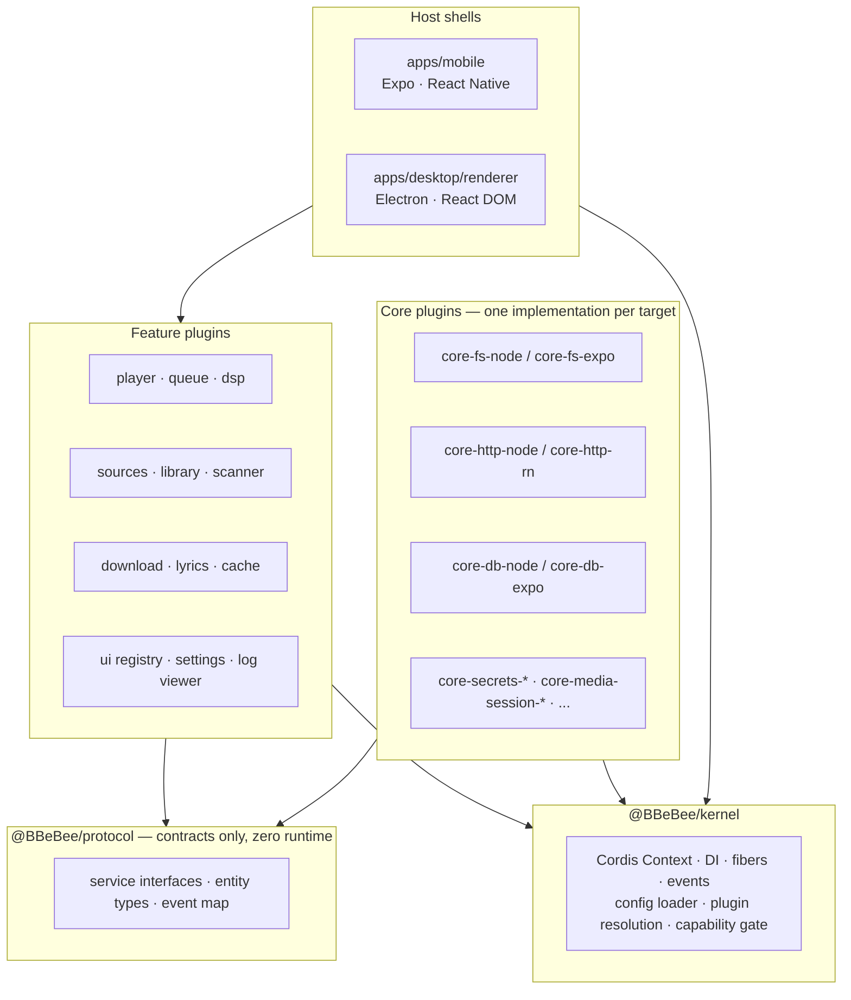
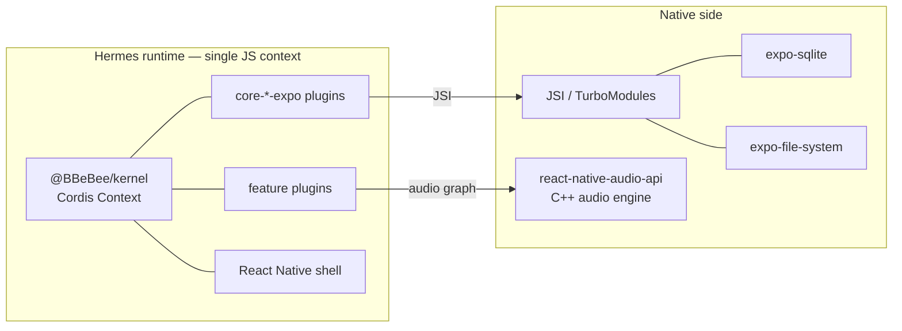
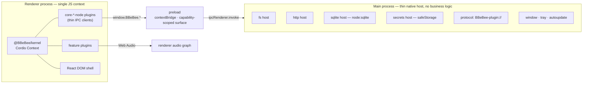
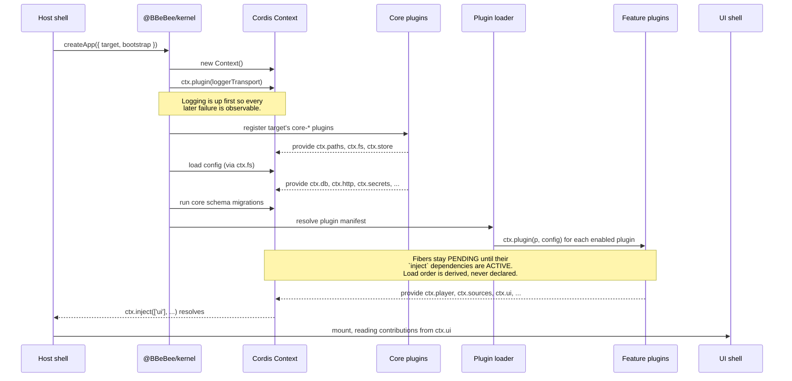

# 02 —— 架构

> **本文回答什么。** 系统如何分层、每个平台上究竟是什么在哪个进程里运行、启动时各部分以何种顺序就绪，以及跨平台抽象在哪里真正发生泄漏。

---

## 1. 分层模型

共五层。让这套架构产生价值的规则是**依赖方向**：每条箭头都只朝下指，契约层之上的任何一层都不得绕过它。

指向 `@BBeBee/protocol` 的那两条箭头值得细读。功能插件与核心插件都依赖契约层，而且**除此之外没有任何共同依赖**。功能插件在编译期根本不知道 `core-fs-expo` 的存在；核心插件也不知道谁在消费自己。这就是整套设计的全部诀窍。

### 不变量

> **`packages/core-*` 之外的任何包都不得导入平台 SDK。**

无论是 `expo-file-system`、`node:fs`、`electron`，还是 `react-native` 的原生模块，都不行。这条规则由一个按目录限定作用范围的 ESLint `no-restricted-imports` 规则机械地强制执行（[09 §3](./09-project-structure.md#3-dependency-rules)），因为它是整个设计赖以成立的不变量，而代码评审无法可靠地兜住它。

有两处刻意留下的例外，范围都很窄：

- **UI 包**分别导入 `react-native` 或 `react-dom`，因为 ADR-2 已经接受按目标平台划分的视图层。它们仍然不得触碰平台*能力*——移动端视图可以渲染 `<FlatList>`，但不可以调用 `FileSystem.readAsStringAsync`。
- **宿主外壳**（`apps/*`）按定义就是平台特定的。它们负责选择注册哪些核心插件（§3），并拥有真正与平台绑定的窗口装饰——深链注册、安全区内边距、窗口控制（[08 §7](./08-ui-architecture.md#7-shell-responsibilities)）。其余一切都应属于插件。

因此，这条不变量约束的是 `packages/plugin-*`、`packages/ui-*` 与 `packages/protocol`——这恰好就是 [09 §3](./09-project-structure.md#3-dependency-rules) 中 lint 规则的覆盖范围。

---

## 2. 各平台的运行时模型

两个平台都是**一个 JavaScript 运行时承载一个 Cordis context**。这种对称是 ADR-3 的直接结果，也正是同一张插件图得以在两端运行的原因。

### 移动端

一切都在同一进程内完成。核心插件经 JSI 调用 Expo 模块。没有序列化边界，也没有 RPC。

### 桌面端

最关键的属性：**`main` 进程不含任何业务逻辑。** 它不知道"曲目"是什么。它的处理器都是机械操作——"读这些字节"、"跑这条 SQL"、"发这个 HTTP 请求"——而且每一个都恰好对应移动端的一个 Expo 模块。如果某个功能需要在 `main` 里写逻辑，那就是服务契约画在了错误高度上的信号。

有两件事经由 `main` 中转，理由值得说明：

- **HTTP。** 并不是因为渲染进程无法发起请求，而是渲染进程里的 `fetch` 受 CORS 约束，无法设置 `Origin`、`Referer`、`Cookie` 或自定义 `User-Agent`，而音乐后端几乎总是要求这四者。经由 `main` 还能获得真正的 cookie jar 与代理支持。
- **插件加载。** 见 [03 §6](./03-plugin-system.md#6-loading-two-modes)——`main` 注册了一个自定义协议，让渲染进程可以在不禁用 CSP、不开启 `nodeIntegration` 的前提下 `import()` 第三方代码。

### 桌面端的进程与安全姿态

渲染进程采用 `contextIsolation: true`、`nodeIntegration: false`、`sandbox: true`。preload 只暴露一个冻结的 `window.BBeBee` 对象，其方法都带有能力（capability）标记；内核按插件逐一包装它们（[03 §7](./03-plugin-system.md#7-capability-model)）。应用源（origin）始终使用严格的 CSP，仅向 `BBeBee-plugin:` scheme 有所放宽。

---

## 3. 启动顺序

两个平台的启动流程完全一致，差别仅在于注册哪些核心插件、运行哪个加载器。

值得牢记的几个要点：

- **没有人给插件列表排顺序。** 对每个启用的插件都会调用 `ctx.plugin()`，顺序随清单（manifest）而定。Cordis 把每条 fiber 保持为 `PENDING`，直到其 `inject` 里点名的服务全部就绪，再转为 `ACTIVE`。依赖成环的结果只是两个插件都永远不会激活——这是一个可诊断的状态，而不是崩溃。
- **外壳等待的是一个服务，而不是计时器。** `apps/*` 在 `ctx.inject(['ui'], …)` 内部挂载 React 树，因此 UI 不可能先于它所读取的注册表渲染出来。
- **启动是可重入的。** 由于卸载插件会销毁它的 fiber 及其注册的一切，配置变更就可以在运行时拆掉并重建任意子树。这与开发期热重载用的是同一套机制。

### 引导插件集

两个外壳的差异只体现在这张表里。这就是整个应用中平台特定的全部表面。

| 服务键 | `apps/mobile` 注册 | `apps/desktop` 注册 |
|---|---|---|
| `ctx.paths` | `core-paths-expo` | `core-paths-electron` |
| `ctx.fs` | `core-fs-expo` | `core-fs-node` |
| `ctx.http` | `core-http-rn` | `core-http-node` |
| `ctx.ws` | `core-ws-rn` | `core-ws-node` |
| `ctx.db` | `core-db-expo` | `core-db-node` |
| `ctx.store` | `core-store-expo` | `core-store-electron` |
| `ctx.secrets` | `core-secrets-expo` | `core-secrets-electron` |
| `ctx.mediaSession` | `core-media-session-rn` | `core-media-session-electron` |
| `ctx.notify` | `core-notify-expo` | `core-notify-electron` |
| `ctx.background` | `core-background-expo` | `core-background-electron` |
| `ctx.device` | `core-device-expo` | `core-device-electron` |
| `ctx.crypto` | `core-crypto-expo` | `core-crypto-node` |
| `ctx.codec` | `core-codec-rn` | `core-codec-node` |
| `ctx.shell` | `core-shell-expo` | `core-shell-electron` |
| 插件加载 | `plugin-loader-static` | `plugin-loader-static` + `plugin-loader-dynamic` |

注意桌面端注册了**两个**加载器：workspace 插件依然静态打包，动态加载器在其之上追加用户安装的插件。

---

## 4. "后台"意味着什么

这是抽象泄漏最尖锐的地方，所以我们直说，而不是粉饰过去。功能插件绝不能假定自己会持续运行。

| 情形 | 移动端 | 桌面端 |
|---|---|---|
| 应用进入后台，音频播放中 | ✅ 继续运行。需要配置支持后台播放的 audio session，以及正确的 `UIBackgroundModes` / 前台服务。 | ✅ 继续运行（窗口只是被隐藏）。 |
| 应用进入后台，无音频 | ⚠️ 数秒内被挂起。只有 `expo-background-task` 的可延迟任务会按操作系统的排期运行——几分钟到几小时不等，且从不保证。 | ✅ 继续运行。 |
| 用户关闭窗口/应用 | ❌ 进程消亡。 | ⚠️ **渲染进程被销毁，内核随之死亡**（ADR-3）。通过"关闭到托盘"（隐藏窗口而非关闭）缓解。 |
| 弱网下的长时间下载 | ⚠️ 仅在前台期间、或音频维持进程存活时才能继续。必须激进地做检查点。 | ✅ 应用运行期间持续进行。 |

从这张表可以推出三条义务，对任何执行长任务的插件都不可妥协：

1. **做检查点，不要只积累。** `download_tasks` 每写入一个分块就持久化一次 `bytesDone` 与续传令牌，因此传输中途被杀最多损失一个分块。见 [07 §4.7](./07-data-model.md#48-downloads)。
2. **启动时恢复，不要假设连续性。** 启动时，手头有任务在飞的插件会发现它处于 `state = 'running'`，必须将其视为"被中断"，而不是"进行中"。
3. **先询问，绝不臆断。** `ctx.background.canRunInBackground()` 与 `ctx.device.formFactor` 的存在，就是为了让插件能够优雅降级而不是悄然失败。需要安排每小时刷新的插件应通过 `ctx.background` 注册，它在移动端映射到操作系统的调度器，在桌面端则映射为普通的 interval。

---

## 5. 组合：功能之间如何触达彼此

服务回答的是"这个能力由谁提供"。它们不回答"一个功能如何在不认识对方的前提下改变另一个功能的行为"。这正是 Cordis 的**瀑布（waterfall）**分发机制的用武之地，在本设计中它被当作一等架构机制来使用。

瀑布（waterfall）钩子就是中间件：每个监听器收到参数和一个 `next` 续延，可以变换输入、短路，或对结果做后处理。

三个承重的瀑布钩子：

| 钩子 | 用途 | 谁在上面挂钩 |
|---|---|---|
| `player/before-resolve` | 给定一个曲目 URN，决定实际播放什么 | `plugin-download` 在存在绑定时替换为本地文件；`plugin-source-failover` 在某个提供方不可用时改从另一个提供方重试链接的 URN |
| `http/request` | 包裹每一个出站请求 | 音源插件注入认证头并刷新过期令牌；`plugin-cache` 命中并存储响应；限流器使其延迟；重试策略使其退避 |
| `dsp/build-chain` | 组装音频节点链 | 每个效果插件在自己配置的位置插入自己的片段 |

收益是具体的：**播放器完全没有"下载"这个概念。** 它只是请求一个可播放的句柄，下载插件——如果加载了——就悄悄用文件路径替代 URL 作答。卸载下载插件，播放照常工作，只是改为流式。`plugin-player` 里没有任何东西发生变化，甚至毫无察觉。

每个事件的完整分发语义——包括各自使用 `emit` / `parallel` / `serial` / `bail` / `waterfall` 中的哪一种——都汇总在 [07 §5](./07-data-model.md#5-the-event-map)。

---

## 6. 状态归属

为了防止插件系统退化成一锅共享可变状态的乱粥，每一份状态都有且只有一个所有者。

| 状态 | 所有者 | 其他方经由 |
|---|---|---|
| 曲库条目（曲目、专辑……） | `ctx.db`，由拥有它的音源插件写入 | 通过所属服务查询，绝不跨插件边界跑裸 SQL |
| 播放控制状态（是否在播、位置） | `ctx.player` | `player/*` 事件；`ctx.player.state` 快照 |
| 队列 | `ctx.player`（持久化到 `queue_items`） | `queue/changed` 事件 |
| 音频图节点 | `ctx.audio` | 绝不直接触碰；效果通过 `dsp/build-chain` 贡献片段 |
| 效果参数 | `ctx.dsp`（持久化到 `effect_nodes`） | `ctx.dsp.setParam()` |
| 认证令牌 | `ctx.secrets`，按提供方实例为键 | 绝不离开拥有它的音源插件 |
| UI 贡献 | `ctx.ui` | 由外壳只读 |
| 插件配置 | 内核，持久化在 `plugin_records` | 以插件的 `config` 参数形式交付；变更会重载 fiber |

React 不持有**任何业务状态**——只有视图状态（当前打开哪个标签、菜单是否展开）。强制执行的理由与钩子设计见 [08 §4](./08-ui-architecture.md#4-binding-services-to-react)。

---

## 7. 接下来读什么

[03 —— 插件系统](./03-plugin-system.md) 规定了一个插件实际长什么样、生命周期与依赖如何运作，以及两个加载器有何差异。
