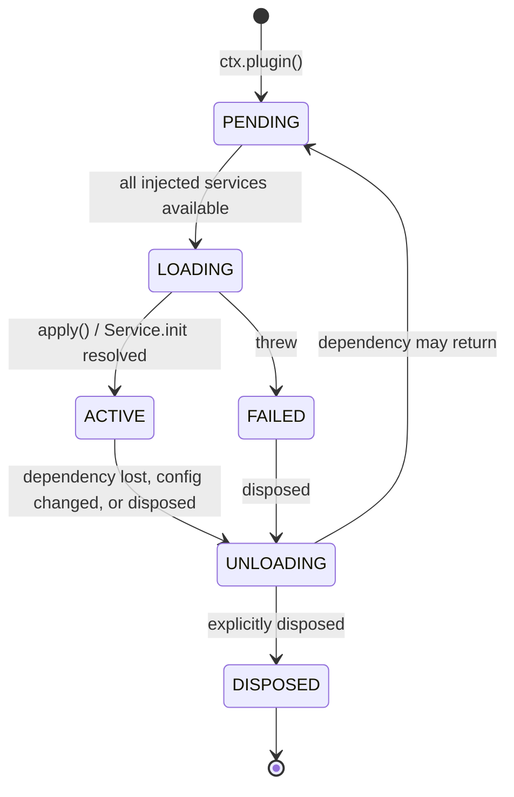

# 03 —— 插件系统

> **本篇回答什么。** 一个 BBeBee 插件在物理上是什么、如何声明并接收依赖、生命周期如何管理、
> 在各平台上如何被发现与加载，以及它受（和不受）怎样的约束。

插件是 [02 §1](./02-architecture.md#1-分层模型) 中的 Layer 2 与 Layer 3。二者在这里的机制完全
相同 —— 同样的清单、同样的生命周期、同样的加载器 —— 而区分核心插件与功能插件的*唯一*一点，
在于它被允许导入什么：核心插件可以触达平台 SDK 与内核的引导表面（bootstrap surface），功能
插件则不可以。这一点值得开篇就讲明，因为下文读起来仿佛只有一种插件，而在架构上二者也确实
几乎就是如此。

下文所有 API 形态均已对照 `cordis@4.0.0-rc.9` 的源码及其测试套件逐一核实。Cordis 目前是发布
候选（release candidate），它自己也如此声明；版本锁定策略见
[09 §5](./09-project-structure.md#51-cordis-rc-问题)。

---

## 1. 插件是什么

插件有三种形态。Cordis 三者皆可接受；BBeBee 只用前两种。

**一个函数。** 适用于只注册行为、不提供服务的插件。

> ⚠️ **务必写成 `async`。** Cordis 用 `!!func.prototype` 来判断"这是不是一个类"，而普通的
> `function apply(…)` 恰好有原型 —— 于是它会被当成服务那样 `new` 出来，**它返回的 disposer
> 会被丢弃**。插件加载、工作、永不卸载：这正是本架构声称不可能发生的失败，而且在有人问起
> "为什么已卸载插件的服务提供者仍然处于注册状态"之前一直不可见。`async function`、箭头函数
> 与对象方法简写都没有原型，是安全的。`conventions.test.ts` 会对另一种形态直接判构建失败。

```ts
import type { Context } from '@BBeBee/protocol'

export const name = 'plugin-media-keys'
export const inject = ['player', 'device']

export async function apply(ctx: Context) {
  // Returning a function makes it the disposer for this plugin.
  return ctx.device.onMediaKey((key) => {
    if (key === 'play-pause') ctx.player.togglePlay()
    if (key === 'next') ctx.player.next()
  })
}
```

**一个 `Service` 子类。** 适用于要认领服务键的插件。类本身就是插件 —— 把构造函数本身传给
`ctx.plugin()`。

```ts
import { Service } from 'cordis'
import type { Context, PlayerService } from '@BBeBee/protocol'

export class Player extends Service implements PlayerService {
  static inject = ['audio', 'db', 'mediaSession']

  constructor(ctx: Context) {
    super(ctx, 'player')   // claims ctx.player
  }

  // Runs after construction. Dependents stay blocked until it resolves,
  // so ctx.player is never observed half-initialised.
  async [Service.init]() {
    await this.restoreQueue()
    const off = this.ctx.mediaSession.onCommand((c) => this.handle(c))
    return () => {           // returned disposer is collected by the fiber
      off()
      this.audioNode?.disconnect()
    }
  }

  togglePlay(): void { /* … */ }
}
```

**一个带 `apply` 的对象。** 与函数形式等价；当元数据与实现放在一起更易读时使用。

### 元数据字段

每个插件都可以携带以下字段（来自 Cordis 的 `Plugin.Base`）：

| 字段 | 含义 |
|---|---|
| `name` | 诊断用标签。出现在日志、错误堆栈与插件检查器中。务必设置。 |
| `inject` | 本插件所需的服务。见 §3。 |
| `provide` | 本插件将要认领的服务键。让 Cordis 预先知道某个键*即将出现*，从而让依赖方等待而不是失败。 |
| `Config` | 一个 [Standard Schema](https://standardschema.dev) 校验器，用于插件的配置。Zod 4、Valibot 与 ArkType 都满足该规范。Cordis 会在 `apply` 执行前完成校验，并抛出逐一列出所有问题的 `ValidationError`。 |
| `intercept` | 按插件粒度的服务配置覆盖。见 §5。 |

### BBeBee 的附加约定

在 Cordis 之上再加两条约定，均由内核强制执行：

- 每个插件包都附带一份 **`BBeBee.plugin.json` 清单**（§6.3），描述入口、能力（capability）
  与 UI 贡献项。Cordis 对此一无所知，由内核读取。
- 插件的**运行时模块拥有一个 default 导出**，即 Cordis 插件本身，因此加载器与被搁置的动态
  加载器（§6.2）可以用完全相同的方式对待每一个插件。

---

## 2. 生命周期

Cordis 把插件生命周期建模为一个 **fiber** —— 一台状态机，外加一份释放台账（disposal ledger）。



最关键、也是多数插件系统所缺失的那次转换：**`ACTIVE → UNLOADING → PENDING`**。当插件注入
的某个服务消失时，插件会被拆除并搁置；该服务一旦恢复，插件便从头重建。这也是为什么停用
一个已导入的音源就能干净地移除它贡献的一切，而不需要任何专门的清理代码：音源是数据，但
运行时给每个音源都分派了自己的 fiber，正是为了让它继承这套机制
（[06 §4.1](./06-music-sources.md#41-一个源的生命周期)）。

### 规则：一切副作用都必须经过 fiber

> 插件启动的任何东西，都必须注册，让 fiber 能够停止它。

还有第二条更隐蔽的规则，它源自服务的分发方式：**凡是通过服务代理拿回来的 disposer，都要
包一层**，而不是直接返回。服务都是经 Cordis 的追踪代理（tracing proxy）触达的，从代理里
返回的那个函数并不是 fiber 会收集的那个 —— 所以最直观的写法会在卸载之后把注册留在原地。

```ts
// ❌ Looks right; the effect is still registered after this plugin unloads.
export async function apply(ctx: Context) {
  return ctx.dsp.registerEffect(effect)
}

// ✅ Wrapped in a local closure, which is what gets collected.
export async function apply(ctx: Context) {
  const off = ctx.dsp.registerEffect(effect)
  return () => off()
}
```

```ts
export async function apply(ctx: Context) {
  // ✅ Return a disposer.
  const conn = ctx.ws.connect(url)
  return () => conn.close()
}

export async function apply(ctx: Context) {
  // ✅ Several disposables — use the generator form; they unwind in reverse.
  return ctx.effect(function* () {
    yield ctx.on('player/track-changed', onTrack)   // ctx.on returns its own disposer
    const timer = setInterval(tick, 30_000)
    yield () => clearInterval(timer)
    yield ctx.ui.registerSlot('now-playing.actions', descriptor)
  }, 'scrobbler')
}
```

反模式 —— 以下每一种都会产出一个无法被停用的插件：

```ts
// ❌ Listener outlives the plugin.
window.addEventListener('resize', onResize)

// ❌ Timer keeps firing into a dead context.
setInterval(poll, 1000)

// ❌ Module-level singleton shared across fibers; survives reload with stale state.
let cache = new Map()

// ❌ Escapes the fiber entirely — nothing can cancel it, and it may resolve
//    after unload and touch disposed state.
;(async () => { await longRunningScan() })()
```

对于最后一种情况，应从 fiber 取一个取消信号并遵守它：

```ts
export async function apply(ctx: Context) {
  const ac = new AbortController()
  void ctx.library.scan({ signal: ac.signal }).catch((e) => ctx.logger.error(e))
  return () => ac.abort()
}
```

`ctx.effect()` 的调用可以嵌套，`fiber.getEffects()` 返回带标签的树 —— 内置插件检查器渲染
的正是这棵树，它也是定位泄漏最快的方法。

### 错误

加载期间抛出异常的插件会进入 `FAILED`；它不会拖垮应用，其依赖方只是永远不会激活。`Config`
校验失败会在 `apply` 执行之前抛出 `ValidationError`，并列出全部问题。内核会把错误记录到
`plugin_records.lastError` 并在插件检查器中呈现，因此坏掉的插件是可见的，而非无声失效。

---

## 3. 依赖

`inject` 是需求的声明，而不是导入。加载顺序*由它推导*而来；BBeBee 中没有任何地方手工编排
插件的启动顺序。

```ts
// Array form — the usual case.
export const inject = ['db', 'http', 'fs']

// Object form — the value is that service's INTERCEPT CONFIG, not a marker.
export const inject = { db: null, http: { timeoutMs: 5_000 } }
```

> ⚠️ **`inject` 里写下的每一个键都是必需的，两种形式皆然。** Cordis 的 `Fiber._refresh()`
> 会遍历每个键，只要有一个实现缺失就把 fiber 停在原地；对象形式里的 `null` 值表示"无拦截配置"，
> *绝不是*"可选"。这一点已在 `packages/kernel/src/cordis-assumptions.test.ts` 中断言过，
> 因为很容易想当然。

fiber 保持 `PENDING`，直到每一个注入的服务都 `ACTIVE`。

### 可选依赖

`inject` 没有可选变体。请把它表达为**嵌套的 `ctx.inject()`**：外层插件立即激活，
只有内层代码块在等待。

```ts
export const inject = ['db']            // hard requirement

export async function apply(ctx: Context) {
  ctx.inject(['scrobbler'], (scoped) => {
    // Runs if and when ctx.scrobbler appears; torn down if it goes away.
    return scoped.on('player/track-completed', (p) => scoped.scrobbler.submit(p))
  })
}
```

装饰器形式做的正是这件事，而且读起来更好：

```ts
import { Inject, Service } from 'cordis'

export class Library extends Service {
  @Inject('scrobbler')
  setupScrobbling() {
    // Runs when ctx.scrobbler becomes available, and is torn down if it goes away.
    return this.ctx.on('player/track-completed', (p) => this.ctx.scrobbler.submit(p))
  }
}
```

> ⚠️ 这里的装饰器是 **2023-11 标准装饰器**，而非旧版 TypeScript 形式。Babel 配置（移动端）
> 与 `tsconfig` 都必须相应设置 ——
> [04 §17](./04-core-services.md#17-运行时兼容性清单)。

### 注入什么

只注入*确实需要*的最小集合。一个仅仅为了读取某个设置就注入 `db` 的插件，应该改为注入
`store`，这样即便在数据库打开失败的设备上它仍能加载。过度注入会把软性降级变成硬性故障。

---

## 4. 服务

服务是稳定键背后的一项能力。其**接口**通过模块增强（module augmentation）在
`@BBeBee/protocol` 中声明一次，任意数量的插件都可以实现它。

```ts
// packages/protocol/src/services/fs.ts
export interface FsService { /* … see 04 … */ }

declare module 'cordis' {
  interface Context {
    fs: FsService
  }
}
```

消费方书写 `ctx.fs.readFile(uri)` 即可获得完整的类型安全，且无需知道挂载的是哪份实现。把
`core-fs-expo` 换成 `core-fs-node` 只是启动插件清单（bootstrap 列表）的一处改动
（[02 §3](./02-architecture.md#引导插件集)），仅此而已。

Cordis 通过追踪代理（tracing proxy）分发服务，因此它知道插件持有的某个值来自服务、必须在该
服务被替换时失效。由此带来两个后果：

- **不要把服务引用缓存进存活期跨越 await 边界的长期变量。** 每次都读取 `this.ctx.fs`；
  这是属性访问，不是查找。
- 对服务对象做同一性比较不可靠。请按 `name` 比较。

### 唯一例外：为清理（teardown）而捕获

插件的 disposer 运行时，它自己的 fiber 已经处于 `UNLOADING`，此时再经上下文取服务会抛出
`cannot get required service in inactive context`。因此，必须在关机时做收尾工作的插件
—— 冲刷日志缓冲、给下载做检查点 —— **必须在加载时就把所需的东西捕获下来**：

```ts
export async function apply(ctx: Context) {
  const fs = ctx.fs                     // captured deliberately, see below
  return async () => {
    try { await fs.writeFile(uri, tail) } catch { /* teardown is best-effort */ }
  }
}
```

只有同时满足以下全部三个条件才允许这样做，且捕获处必须有注释说明：

1. 被捕获的是**核心服务**，由于拆除按逆序进行，其 fiber 的寿命长于每个功能插件
   （[02 §3](./02-architecture.md#3-启动顺序)）。
2. 该引用**只在 disposer 中使用**，绝不出现在热路径上 —— 在热路径上，拦截或隔离自加载以来
   可能已经合法地替换过该服务。
3. 失败被吞掉。抛错的 disposer 会中断其余的拆除工作
   （[09 §6](./09-project-structure.md#6-测试策略)），丢掉最后一行日志远好于
   泄漏排在它后面的每一个监听器。

除此之外的任何地方，都请经由 `ctx` 读取 —— 否则运行在隔离作用域里的插件会悄无声息地继续
与未隔离的服务对话。

---

## 5. 隔离与拦截

两种机制让同一个服务键在插件树的不同部分有不同含义。BBeBee 对二者都重度依赖。

### `ctx.isolate(key)` —— 服务的私有实例

```ts
// Each imported source gets its own HTTP stack: its own cookie jar, its own
// rate limiter, its own host allowlist. They cannot see each other's.
const scoped = ctx.isolate('http')
scoped.plugin(HttpWithCookieJar, { jar: sourceId, rateLimit, allowedHosts })
scoped.plugin(SourceInstance, { record })
```

在 `scoped` 之内，`ctx.http` 是该音源专属的 HTTP 栈；在其他任何地方，它仍是共享的那份。
其余所有服务 —— `fs`、`db`、`logger` —— 依旧共享，因为被隔离的只有被点名的那个键。这正是
想要的语义：一个慢速音源的限流不会卡住另一个的请求，cookie 也绝不会跨过音源边界
（[06 §4.1](./06-music-sources.md#41-一个源的生命周期)）。

### `ctx.intercept(key, config)` —— 同一实例，不同配置

```ts
// Same fs service, but this subtree is confined to the plugin's own data directory.
const confined = ctx.intercept('fs', { root: `plugins/${pluginId}`, mode: 'rw' })
```

能力门（§7）正是用拦截实现的；每个插件专属的 `store` 与 `fs` 命名空间也由此生效，插件无需
自己记得给键加前缀。

---

## 6. 加载

依据[修订后的 ADR-1](./01-overview.md#adr-1--插件在所有目标平台上都静态打包)，
两个目标平台**都只有一个加载器**：插件图在任何平台上都在构建期固定下来。用户在运行时添加的
是音源**字符串（source string）**，它是由 `plugin-source-runtime`（[06](./06-music-sources.md)）
解释的数据，而不是交给 `ctx.plugin()` 的代码。

§6.2 把动态加载器记录为一项搁置的设计 —— 已经想清楚，但未接线 —— 因为搁置它的决定是可逆的，
而它所解决的 CSP 问题并不显然。

### 6.1 所有目标平台 —— `plugin-loader-static`

Metro 无法解析运行时计算出的模块路径，因此插件导入必须可被静态分析。一个代码生成步骤
（`pnpm gen:plugins`，在构建前与开发监视期间运行）扫描工作区中含有 `BBeBee.plugin.json`
的包，并生成：

```ts
// apps/mobile/generated/plugins.ts — GENERATED, do not edit
import player from '@BBeBee/plugin-player'
import sourceLocal from '@BBeBee/plugin-source-local'
// …
export const bundled = {
  '@BBeBee/plugin-player': player,
  '@BBeBee/plugin-source-local': sourceLocal,
} as const
```

配置决定其中哪些真正被实例化、用什么设置。生成的文件会被提交入库，因此干净的检出无需先跑
codegen 即可构建。

### 6.2 桌面端的附加设计 —— `plugin-loader-dynamic`

> **已搁置，未构建。** 下述内容没有在任何外壳中注册。保留它是因为 ADR-1 的修订是一次范围
> 决策，而非技术决策：如果第三方*插件*（与音源不同）有朝一日确有必要走安装流程，设计就是
> 这一份，而那些显而易见的做法为何行不通的理由，不值得重新踩一遍坑。其中所有内容都以
> [10 §M5](./10-roadmap.md#m5--沙箱上的第三方扩展) 为闸门。

渲染进程被沙箱化，`contextIsolation` 开启且 CSP 严格，因此它不能 `import()` 一个 `file://`
路径，而我们也不打算放宽其中任何一条。于是，`main` 将会注册一个特权的自定义协议（scheme）：

```ts
// apps/desktop/main — registered before app ready
protocol.registerSchemesAsPrivileged([{
  scheme: 'BBeBee-plugin',
  privileges: { standard: true, secure: true, supportFetchAPI: true, corsEnabled: false },
}])
```

并从用户插件目录为其提供服务，拒绝路径穿越（path traversal），内容类型为 `text/javascript`。
渲染进程的 CSP 随之写作 `script-src 'self' BBeBee-plugin:`，加载器就是一个普通的动态导入：

```ts
const mod = await import(/* @vite-ignore */ `BBeBee-plugin://${id}@${version}/index.js`)
await ctx.plugin(mod.default, config)
```

这将让 CSP 保持可执行、`nodeIntegration` 保持关闭、避免 `new Function`，并且 —— 因为
`import()` 返回真正的模块 —— 获得正确的 ESM 语义，包括 top-level await。注意它*不能*提供的
是什么：遏制。模块落入的是渲染进程的 realm，这正是若真有版本要交付、它会改经 `ctx.js` 运行
的原因（[§7](#它不是什么)）。

**安装流程。** 获取包 → 校验完整性哈希 → 对照应用版本检查 `engines.BBeBee` → 解压到
`plugins/<id>@<version>/` → 读取清单 → 提示授予能力 → 写入 `plugin_records` 与
`capability_grants` → `ctx.plugin()`。更新采用并行安装、原子替换。卸载则先释放（dispose）
fiber，再删除目录 —— 顺序绝不能反，否则 fiber 的释放器可能在拆除中途失败。

**隔离区（quarantine）。** 连续两次在加载时抛出异常的插件会被标记为 `enabled = false` 并
设置 `lastError`，后续启动将跳过它，直到用户重新启用。没有这一机制，一个坏掉的第三方插件
就会变成无法恢复的启动死循环 —— 这是运行时插件系统最常见的故障模式。同样的思路用在腐坏的
音源而不是崩溃的插件上，就是 [06 §7](./06-music-sources.md#7-错误) 的失效（stale）徽标
—— 但有一个刻意的差别：失效的音源*不会*被停用，因为它缓存的目录仍值得浏览。

> ⚠️ 模块缓存意味着同一 URL 上更新过的插件不会被重新拉取。带版本的 URL（`<id>@<version>`）
> 可绕开此问题；开发模式则追加缓存穿透（cache-busting）查询参数。

### 6.3 清单

```jsonc
{
  "id": "@BBeBee/plugin-source-runtime",
  "version": "1.0.0",
  "displayName": "Music sources",
  "description": "Interprets imported source strings.",
  "engines": { "BBeBee": "^1.0.0" },
  "entry": {
    "main": "./dist/index.js",
    "ui": { "mobile": "./dist/ui.mobile.js", "desktop": "./dist/ui.desktop.js" }
  },
  "capabilities": [
    "net:host/*",           // narrowed per source to that source's allowlist — see §7
    "js",                   // evaluates source rules in ctx.js
    "db:read:core",
    "db:write:core",
    "secrets:own",          // one namespace per source id
    "fs:read:media"         // read cached artwork
  ],
  "contributes": {
    "settings": "./dist/settings-schema.js",
    "slots": ["settings.sources", "source.browse", "source.debug"]
  }
}
```

`entry.ui` 是可选且分目标平台的：插件可以只提供桌面视图而不提供移动端视图。当某个贡献项的
视图在某个目标平台缺失时，外壳必须渲染占位符而非崩溃 —— 这是 ADR-2 的直接代价，UI 注册表
把它显式化了（[08 §3](./08-ui-architecture.md#3-从描述符解析到视图)）。

### 6.4 配置

一份配置文档（桌面端为 YAML，移动端为 JSON），在任何功能插件加载之前通过 `ctx.fs` 读取：

```yaml
plugins:
  '@BBeBee/plugin-player':
    enabled: true
    config: { crossfadeMs: 0, prefetchNext: true }
  '@BBeBee/plugin-source-runtime':
    enabled: true
    config: { defaultRate: '2/1000' }
```

编辑配置只会释放并重建受影响的 fiber。

> **音源不在这里配置。** 它们是 `sources` 表中的行
> （[07 §4.1](./07-data-model.md#41-音源账号与会话)），在应用内导入与编辑，
> `plugin-source-runtime` 给每个音源一个属于自己的 fiber，运行在其专属的 `ctx.isolate('http')`
> 作用域内（§5）。把它们放进配置文件，意味着加一台服务器要手改 JSON，也让"导入这串字符串"
> 变成开发者的动作（[06 §9](./06-music-sources.md#9-导入更新与分享)）。

### 6.5 热重载

开发环境下，`@cordisjs/plugin-hmr` 监视工作区，并在原位重载发生变化的插件。由于卸载是彻底
的，这对受影响的子树而言确实等价于一次重启 —— 旧 fiber 的音频图、监听器与定时器全部消失。
桌面端可直接使用；移动端则由内核在底层重载，同时与 Metro Fast Refresh 在视图层配合。

---

## 7. 能力模型

插件声明自己想触碰什么，由内核居中裁定。随着
[ADR-1 修订](./01-overview.md#adr-1--插件在所有目标平台上都静态打包)落地，
每个插件都是第一方的，因此这扇门如今是一项**让意图保持可审计的纪律**，而不是防范陌生包的
边界 —— 而确实存在的陌生代码，即音源字符串，则由另一套强得多的机制来遏制
（[06 §8](./06-music-sources.md#8-信任导入的源能做什么不能做什么)）。

### 能力语法

| 能力 | 授予 |
|---|---|
| `fs:read:<scope>` / `fs:write:<scope>` | 在命名作用域内的文件系统访问：`own`、`media`、`cache`、`downloads` 或 `all` |
| `net:host/<pattern>` | 到匹配 glob 的主机的出站 HTTP **与 WebSocket** —— 一个授权同时管辖 `ctx.http` 与 `ctx.ws`。`net:host/*` 是一项宽泛授权，在授权提示中会被明确标注。包含一个**限定于本插件实例的持久化 cookie 罐**（[04 §2.1](./04-core-services.md#21-cookie-罐)）—— 存储由核心服务持有，因此无需为此授予 `db` 或 `secrets`。匹配仅针对主机名（小写）；端口无法单独授权 |
| `db:own` | 完全归属自己的命名空间表 —— 读、写与建表（schema）皆可。索引、触发器与视图也算在内：它们按名称归属，因此一个插件的索引和它的表一样叫 `{{ns}}_…` |
| `db:read:<ns>` / `db:write:<ns>` / `db:*:<ns>` | 按动词访问其他命名空间：`read` 是 `SELECT`，`write` 是 `INSERT`/`UPDATE`/`DELETE`，`*` 是二者再加 `CREATE`/`DROP`/`ALTER`。各动词**不**相互蕴含 —— 一个既要读又要写曲库的插件必须同时声明 `db:read:core` *和* `db:write:core`，这样安装时的授权提示才能准确说出它到底在请求什么。语句按其所作所为中要求最高的一档归类，因此 `DROP` 不可能躲在 `SELECT` 身后蒙混过关 |

无论授予了什么，以下三种拒绝一概生效，因为每一种都曾是绕过上表的一条路：

- **门无法归属的变更。** 按表逐项检查*就是*这扇门本身，所以一条没有点名任何它看得见的表的
  语句 —— `DROP INDEX idx_tracks_album`、`VACUUM`、`ANALYZE` —— 过去会未经审查地放行。
  凡是高于 `read` 且无法归属的操作，一律拒绝，而不是靠猜。
- **带 schema 限定的名称。** `SELECT * FROM main.plugin_other_secrets` 过去被读作一个名叫
  `main` 的表，它不带 `plugin_` 前缀，于是落进了 `core` 兜底 —— 普普通通的 SQL 就这样读写
  了另一个插件的行。带限定的名称一律直接拒绝。
- **`PRAGMA`。** pragma 并不局限于它的调用者：`foreign_keys = OFF` 会重新配置所有插件共享的
  那一个连接，而在桌面端这个连接活在 `main` 里。只有 `defer_foreign_keys`（迁移运行器需要
  它）和只读的自省 pragma 被允许；其余情况下 `sqlite_master` 仍可读。

⚠️ 以上全部都是针对 SQLite 实际形态的正则匹配，不是解析器。它失败即关闭（fail closed）——
无法归属的标识符一律视为外来的 —— 而且它防的是寻常失误与顺手越界，不是防一个存心尝试的
作者，反正他与运行时共享同一空间。
| `secrets:own` | 自己的凭据命名空间。不存在 `secrets:all`。仅需要登录态得以保存的插件并不需要它 —— `net:` 下的 cookie 罐已经覆盖了这一点 |
| `js` | 可以在 `ctx.js` 中执行不受信任的脚本（[04 §19](./04-core-services.md#19-ctxjs--沙箱化求值器)）。仅由 `plugin-source-runtime` 持有，别无他者。这项授权并不扩大被评估代码能触达的范围 —— 那由宿主 API 与每次求值的白名单固定 —— 它让*谁被允许运行它*变得可审计 |
| `audio` | 可以向音频图贡献节点 |
| `mediaSession` | 可以发布正在播放元数据并接收传输控制命令 |
| `notify`、`shell`、`background` | 用户可见或操作系统级别的动作 |

`store` 同样受中介，尽管它没有自己的能力项：拦截配置承载的是插件的**存储命名空间**，
`ctx.store`、`ctx.secrets` 与 cookie 罐都以它为键，使一个插件在这三者中获得相同的命名空间
（内核中的 `storageNamespace(config)`）。

> **`plugin-source-runtime` 上的 `net:host/*` 不是它看起来的样子。** 运行时持有这项宽泛授权，
> 是因为在音源被导入之前无从得知主机名；随后它会**收窄**授权：每个音源被隔离的 `ctx.http`
> 作用域都携带该音源自己的白名单 —— 其 `sourceUrl` 主机加上它声明的 `allowedHosts` —— 并由
> `core-http-*` 执行二者中较窄的那个。计算出的 URL 指向未声明主机的规则会被拒绝，而且这份
> 清单会在导入时展示给用户
> （[06 §8](./06-music-sources.md#8-信任导入的源能做什么不能做什么)）。

### 执行

内核通过拦截派生每个插件的上下文：

```ts
// @BBeBee/kernel — simplified
function scopeContext(ctx: Context, opts: GrantOptions) {
  const config = {
    pluginId: opts.pluginId,
    scopeId: opts.scopeId ?? opts.pluginId,   // a source id, or the plugin id
    granted: opts.granted ?? opts.requested,
  }
  let scoped = ctx
  for (const key of MEDIATED_SERVICES) {
    scoped = scoped.intercept(key, config)
  }
  return scoped
}
```

每个受中介的核心服务读取自己的拦截配置，对越界操作以 `CapabilityError` 拒绝。由于服务都是
经 Cordis 的代理触达的，插件无法从拿到的引用出发遍历对象图来获得未加约束的引用。

**授权只有在服务检查它的地方才是真的。** 在 `ctx.db` 调用门之前，`db:own` 只是一个没有含义
的 manifest 字符串；在 `ctx.http` 这么做之前，`net:host/…` 也一样。服务尚不存在的地方，
它的执行也不存在 —— 而安装提示却在承诺没有任何东西守住的承诺。下面是现状，让缺口可见，
而不是被默认掩盖：

| 能力 | 由谁执行 | 状态 |
|---|---|---|
| `fs:read:<scope>` / `fs:write:<scope>` | `core-fs-node`、`core-fs-expo`、桥宿主 | ✅ |
| `db:own`、`db:read:<ns>`、`db:write:<ns>`、`db:*:<ns>` | `core-db-node`、`core-db-expo`、桥宿主 | ✅ |
| `net:host/<glob>` | `core-http-node`，在 `http/request` 瀑布之前*和*之后各检查一次，监听器无法洗白主机 | ✅ |
| `audio` | `core-audio-webaudio` 在 `load` 与各变更器上 | ✅ |
| `mediaSession`、`background`、`notify`、`shell` | — | ⏳ 服务尚不存在；在它们出现之前，授权只是声明性的 |
| `secrets:own` | — | ⏳ M2，随 `ctx.secrets` 一起 |
| `js`，以及 `net:host/…` 的按音源收窄 | `core-js-quickjs-*`、`core-http-*` | ⏳ M2，随音源运行时一起 |

### 门默认关闭（fail closed）

插件的 manifest 是*请求*，永远不是授权。加载器只为标记了 `builtin` 的插件采信 manifest
—— 即随应用打包的第一方包。其余一切必须在 `capability_grants` 中有一条对应的记录；没有就
拒绝加载并记为 `ungranted`，而不是放行。如今每个插件都是 `builtin`，所以这个分支只有测试
会走到 —— 这恰恰是保留它的原因。

这一点很重要，因为失败方式是无声的：如果宿主只是忘了传 grants，一个非 builtin 插件就会恰好
拿到它为自己声明的一切 —— 包括 `net:host/*` —— 把审批变成一纸空文。

### 门实际运行的位置

移动端上，门与它守卫的服务处于同一进程，插件只能穿过其被拦截的上下文触达 `ctx.fs`。

**桌面端则不然。** ADR-3 把内核放进渲染进程，而真正的 `fs` 与 `db` 活在 `main` 中，于是门
运行在*渲染进程一侧*，而承载跨进程调用的桥对渲染进程中的任何代码都是可达的 ——
`window.BBeBeeBridge.call('fs', 'writeFile', …)` 一行就能绕过它。因此，每插件粒度的门在
桌面上约束的是**愿意配合**的插件，而不是拒绝配合的插件。

无论调用者是谁、`main` 都一概执行的限制（因为这些限制无需知道是谁在调用）：

| 限制 | 效果 |
|---|---|
| 方法白名单 | 只有列名的服务方法可达；`constructor` 与继承成员不可达 |
| 路径封闭 | 每一个 `fs` 操作数都必须落在应用目录之内 —— 桥既触不到 `/etc`，也触不到用户家目录的其余部分 |
| 拒绝 `ATTACH`/`DETACH`/`VACUUM INTO` | 否则数据库句柄就成了任意文件读写原语，上面的路径封闭也就形同虚设。三者都出自内核中同一个共享的 `assertSqlAllowed`，受门约束的路径与 `main` 都用它：桥过去维护自己的清单，而且逐渐漂移到只剩 `ATTACH`/`DETACH`，于是 `VACUUM INTO '/any/path'` 直接绕过这张表写出了一个文件 |
| 每次调用一条语句 | 驱动只编译字符串中的第一条语句并静默丢弃其余的，所以 `SELECT 1; DROP …` 既不会完整执行也不会执行一半 —— 它会被拒绝（[04 §5](./04-core-services.md#5-ctxdb--sql)） |
| 流句柄有界 | 循环调用 `streamOpen` 无法耗尽 `main` 的文件描述符 |
| 事务生命周期 | 被遗弃的事务会在渲染进程销毁或空闲超时时回滚，刷新不再能楔死数据库 |

要真正补上每插件粒度的缺口，需要插件不再共享渲染进程的 realm —— 与下文真正的沙箱是同一个
前提。如今这个仓库之外已没有任何东西被当作插件加载，所以门的每插件一半是设计使然的第一方
纪律，而非无心之失。**在任何第三方被当作插件加载之前，必须先解决这个问题**
（[10 §M5](./10-roadmap.md#m5--沙箱上的第三方扩展)）。

### 它不是什么

> ⚠️ **这是纵深防御，不是沙箱。** 插件与应用运行在同一个 JS realm 中。一个蓄意的插件可以
> 触及全局对象、篡改原型，原则上能做渲染进程能做的一切。能力模型抬高的是*意外*越界的成本，
> 并让意图可审计、可撤销 —— 它拦不住恶意插件。也没有人要求它这么做：每个插件都是第一方，
> 随构建一起交付。

真正的遏制需要独立的 realm。**一个现在已经存在** —— `ctx.js`，一个带可枚举宿主 API 的
QuickJS realm，它的诞生是因为导入的音源是不受信任的代码、必须被遏制
（[04 §19](./04-core-services.md#19-ctxjs--沙箱化求值器)、
[06 §8](./06-music-sources.md#8-信任导入的源能做什么不能做什么)）。把它从
"执行音源规则"推广到"承载一整个插件"，意味着把上面能力语法早已描述为协议的服务桥交给它。
这正是 [M5](./10-roadmap.md#m5--沙箱上的第三方扩展) 的形态，而且如今它是
对已交付之物的扩展，而不是一个要从零发明的子系统。

---

## 8. 编写插件：检查清单

- [ ] 已设置 `name`，且与包名后缀一致。
- [ ] `inject` 恰好列出所需内容 —— 可选依赖用对象形式。
- [ ] 未导入任何平台 SDK（[02 §1](./02-architecture.md#不变量)）。核心插件是例外，而且是
      *唯一*的例外。
- [ ] 未从内核的引导表面导入任何东西 —— 功能插件是被交给一个现成 context 的，它并不自己
      构建一个（[02 §1](./02-architecture.md#不变量)）。
- [ ] 未导入任何 `core-*` 包。对 Layer 2 的依赖写作 `inject: ['fs']`。
- [ ] 每个监听器、定时器、套接字与音频节点都通过 `ctx.effect()` 注册，或以释放器
      （disposer）形式返回。
- [ ] 长耗时的异步工作接受 `AbortSignal`，并在释放时中止。
- [ ] 没有模块级可变状态。
- [ ] 若可配置，提供 `Config` 校验模式；默认值已给出。
- [ ] `BBeBee.plugin.json` 声明了能正常工作的最小能力集合。
- [ ] 它确实是一个插件。新的音乐后端是一个**音源字符串**，而不是一个包
      （[06](./06-music-sources.md)）；插件是为运行时无法表达的行为准备的 —— 一个效果器、
      一个 scrobbler、一种传输控制、一个 UI 表面。
- [ ] 自有 DB 表通过 `ctx.db.defineSchema('plugin:<id>', …)` 声明
      （[07 §6](./07-data-model.md#6-迁移)）。
- [ ] 停用、再启用，并用 `fiber.getEffects()` 确认没有任何泄漏。

---

## 9. 下一步

[04 —— 核心服务](./04-core-services.md) 规定了这些插件所依赖的平台抽象。
