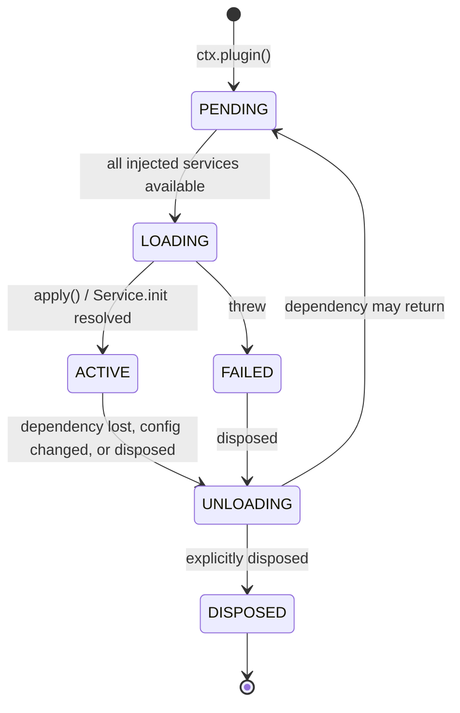

# 03 —— 插件系统

> **本篇回答什么。** 一个 BBeBee 插件在物理上是什么、如何声明并接收依赖、生命周期如何管理、
> 在各平台上如何被发现与加载，以及它受（和不受）怎样的约束。

下文所有 API 形态均已对照 `cordis@4.0.0-rc.9` 的源码及其测试套件逐一核实。Cordis 目前是发布
候选（release candidate），它自己也如此声明；版本锁定策略见
[09 §5](./09-project-structure.md#51-the-cordis-rc-problem)。

---

## 1. 插件是什么

插件有三种形态。Cordis 三者皆可接受；BBeBee 只用前两种。

**一个函数。** 适用于只注册行为、不提供服务的插件。

```ts
import type { Context } from '@BBeBee/protocol'

export const name = 'plugin-media-keys'
export const inject = ['player', 'device']

export function apply(ctx: Context) {
  // Returning a function makes it the disposer for this plugin.
  return ctx.device.onMediaKey((key) => {
    if (key === 'play-pause') ctx.player.togglePlay()
    if (key === 'next') ctx.player.next()
  })
}
```

**一个 `Service` 子类。** 适用于要认领服务键的插件。类本身就是插件 —— 把构造函数本身传给
`ctx.plugin()`。

```ts
import { Service } from 'cordis'
import type { Context, PlayerService } from '@BBeBee/protocol'

export class Player extends Service implements PlayerService {
  static inject = ['audio', 'db', 'mediaSession']

  constructor(ctx: Context) {
    super(ctx, 'player')   // claims ctx.player
  }

  // Runs after construction. Dependents stay blocked until it resolves,
  // so ctx.player is never observed half-initialised.
  async [Service.init]() {
    await this.restoreQueue()
    const off = this.ctx.mediaSession.onCommand((c) => this.handle(c))
    return () => {           // returned disposer is collected by the fiber
      off()
      this.audioNode?.disconnect()
    }
  }

  togglePlay(): void { /* … */ }
}
```

**一个带 `apply` 的对象。** 与函数形式等价；当元数据与实现放在一起更易读时使用。

### 元数据字段

每个插件都可以携带以下字段（来自 Cordis 的 `Plugin.Base`）：

| 字段 | 含义 |
|---|---|
| `name` | 诊断用标签。出现在日志、错误堆栈与插件检查器中。务必设置。 |
| `inject` | 本插件所需的服务。见 §3。 |
| `provide` | 本插件将要认领的服务键。让 Cordis 预先知道某个键*即将出现*，从而让依赖方等待而不是失败。 |
| `Config` | 一个 [Standard Schema](https://standardschema.dev) 校验器，用于插件的配置。Zod 4、Valibot 与 ArkType 都满足该规范。Cordis 会在 `apply` 执行前完成校验，并抛出逐一列出所有问题的 `ValidationError`。 |
| `intercept` | 按插件粒度的服务配置覆盖。见 §5。 |

### BBeBee 的附加约定

在 Cordis 之上再加两条约定，均由内核强制执行：

- 每个插件包都附带一份 **`BBeBee.plugin.json` 清单**（§6.3），描述入口、能力（capability）
  与 UI 贡献项。Cordis 对此一无所知，由内核读取。
- 插件的**运行时模块拥有一个 default 导出**，即 Cordis 插件本身，因此两种加载器可以用完全
  相同的方式对待静态导入与动态导入。

---

## 2. 生命周期

Cordis 把插件生命周期建模为一个 **fiber** —— 一台状态机，外加一份释放台账（disposal ledger）。



最关键、也是多数插件系统所缺失的那次转换：**`ACTIVE → UNLOADING → PENDING`**。当插件注入
的某个服务消失时，插件会被拆除并搁置；该服务一旦恢复，插件便从头重建。正因如此，退出一个
音源的登录就能干净地移除该音源贡献的一切，而不需要在任何地方编写专门的清理代码。

### 规则：一切副作用都必须经过 fiber

> 插件启动的任何东西，都必须注册，让 fiber 能够停止它。

```ts
export function apply(ctx: Context) {
  // ✅ Return a disposer.
  const conn = ctx.ws.connect(url)
  return () => conn.close()
}

export function apply(ctx: Context) {
  // ✅ Several disposables — use the generator form; they unwind in reverse.
  return ctx.effect(function* () {
    yield ctx.on('player/track-changed', onTrack)   // ctx.on returns its own disposer
    const timer = setInterval(tick, 30_000)
    yield () => clearInterval(timer)
    yield ctx.ui.registerSlot('now-playing.actions', descriptor)
  }, 'scrobbler')
}
```

反模式 —— 以下每一种都会产出一个无法被停用的插件：

```ts
// ❌ Listener outlives the plugin.
window.addEventListener('resize', onResize)

// ❌ Timer keeps firing into a dead context.
setInterval(poll, 1000)

// ❌ Module-level singleton shared across fibers; survives reload with stale state.
let cache = new Map()

// ❌ Escapes the fiber entirely — nothing can cancel it, and it may resolve
//    after unload and touch disposed state.
;(async () => { await longRunningScan() })()
```

对于最后一种情况，应从 fiber 取一个取消信号并遵守它：

```ts
export function apply(ctx: Context) {
  const ac = new AbortController()
  void ctx.library.scan({ signal: ac.signal }).catch((e) => ctx.logger.error(e))
  return () => ac.abort()
}
```

`ctx.effect()` 的调用可以嵌套，`fiber.getEffects()` 返回带标签的树 —— 内置插件检查器渲染
的正是这棵树，它也是定位泄漏最快的方法。

### 错误

加载期间抛出异常的插件会进入 `FAILED`；它不会拖垮应用，其依赖方只是永远不会激活。`Config`
校验失败会在 `apply` 执行之前抛出 `ValidationError`，并列出全部问题。内核会把错误记录到
`plugin_records.lastError` 并在插件检查器中呈现，因此坏掉的插件是可见的，而非无声失效。

---

## 3. 依赖

`inject` 是需求的声明，而不是导入。加载顺序*由它推导*而来；BBeBee 中没有任何地方手工编排
插件的启动顺序。

```ts
// 数组形式 —— 常规写法。
export const inject = ['db', 'http', 'fs']

// 对象形式 —— 值是该服务的拦截配置（INTERCEPT CONFIG），不是标记。
export const inject = { db: null, http: { timeoutMs: 5_000 } }
```

> ⚠️ **`inject` 里写下的每一个键都是必需的，两种形式皆然。** Cordis 的 `Fiber._refresh()`
> 会遍历每个键，只要有一个实现缺失就把 fiber 停在原地；对象形式里的 `null` 值表示"无拦截配置"，
> *绝不是*"可选"。这一点已在 `packages/kernel/src/cordis-assumptions.test.ts` 中断言过，
> 因为很容易想当然。

fiber 保持 `PENDING`，直到每一个注入的服务都 `ACTIVE`。

### 可选依赖

`inject` 没有可选变体。请把它表达为**嵌套的 `ctx.inject()`**：外层插件立即激活，
只有内层代码块在等待。

```ts
export const inject = ['db']            // 硬性要求

export function apply(ctx: Context) {
  ctx.inject(['scrobbler'], (scoped) => {
    // ctx.scrobbler 一旦出现就会运行；它消失时会被拆除。
    return scoped.on('player/track-completed', (p) => scoped.scrobbler.submit(p))
  })
}
```

装饰器形式做的正是这件事，而且读起来更好：

```ts
import { Inject, Service } from 'cordis'

export class Library extends Service {
  @Inject('scrobbler')
  setupScrobbling() {
    // Runs when ctx.scrobbler becomes available, and is torn down if it goes away.
    return this.ctx.on('player/track-completed', (p) => this.ctx.scrobbler.submit(p))
  }
}
```

> ⚠️ 这里的装饰器是 **2023-11 标准装饰器**，而非旧版 TypeScript 形式。Babel 配置（移动端）
> 与 `tsconfig` 都必须相应设置 ——
> [04 §17](./04-core-services.md#17-runtime-compatibility-checklist)。

### 注入什么

只注入*确实需要*的最小集合。一个仅仅为了读取某个设置就注入 `db` 的插件，应该改为注入
`store`，这样即便在数据库打开失败的设备上它仍能加载。过度注入会把软性降级变成硬性故障。

---

## 4. 服务

服务是稳定键背后的一项能力。其**接口**通过模块增强（module augmentation）在
`@BBeBee/protocol` 中声明一次，任意数量的插件都可以实现它。

```ts
// packages/protocol/src/services/fs.ts
export interface FsService { /* … see 04 … */ }

declare module 'cordis' {
  interface Context {
    fs: FsService
  }
}
```

消费方书写 `ctx.fs.readFile(uri)` 即可获得完整的类型安全，且无需知道挂载的是哪份实现。把
`core-fs-expo` 换成 `core-fs-node` 只是启动插件清单（bootstrap 列表）的一处改动
（[02 §3](./02-architecture.md#bootstrap-plugin-sets)），仅此而已。

Cordis 通过追踪代理（tracing proxy）分发服务，因此它知道插件持有的某个值来自服务、必须在该
服务被替换时失效。由此带来两个后果：

- **不要把服务引用缓存进存活期跨越 await 边界的长期变量。** 每次都读取 `this.ctx.fs`；
  这是属性访问，不是查找。
- 对服务对象做同一性比较不可靠。请按 `name` 比较。

### 唯一例外：为清理（teardown）而捕获

插件的 disposer 运行时，它自己的 fiber 已经处于 `UNLOADING`，此时再经上下文取服务会抛出
`cannot get required service in inactive context`。因此，必须在关机时做收尾工作的插件
—— 冲刷日志缓冲、给下载做检查点 —— **必须在加载时就把所需的东西捕获下来**：

```ts
export function apply(ctx: Context) {
  const fs = ctx.fs                     // captured deliberately, see below
  return async () => {
    try { await fs.writeFile(uri, tail) } catch { /* teardown is best-effort */ }
  }
}
```

只有同时满足以下全部三个条件才允许这样做，且捕获处必须有注释说明：

1. 被捕获的是**核心服务**，由于拆除按逆序进行，其 fiber 的寿命长于每个功能插件
   （[02 §3](./02-architecture.md#3-boot-sequence)）。
2. 该引用**只在 disposer 中使用**，绝不出现在热路径上 —— 在热路径上，拦截或隔离自加载以来
   可能已经合法地替换过该服务。
3. 失败被吞掉。抛错的 disposer 会中断其余的拆除工作
   （[09 §6](./09-project-structure.md#6-testing-strategy)），丢掉最后一行日志远好于
   泄漏排在它后面的每一个监听器。

除此之外的任何地方，都请经由 `ctx` 读取 —— 否则运行在隔离作用域里的插件会悄无声息地继续
与未隔离的服务对话。

---

## 5. 隔离与拦截

两种机制让同一个服务键在插件树的不同部分有不同含义。BBeBee 对二者都重度依赖。

### `ctx.isolate(key)` —— 服务的私有实例

```ts
// Each provider instance gets its own HTTP stack: its own cookie jar,
// its own rate limiter, its own auth. They cannot see each other's.
const scoped = ctx.isolate('http')
scoped.plugin(HttpWithCookieJar, { jar: instanceId, rateLimit: caps.rateLimit })
scoped.plugin(SubsonicProvider, providerConfig)
```

在 `scoped` 之内，`ctx.http` 是该提供方专属的 HTTP 栈；在其他任何地方，它仍是共享的那份。
其余所有服务 —— `fs`、`db`、`logger` —— 依旧共享，因为被隔离的只有被点名的那个键。这正是
想要的语义：一个坏掉提供方的限流不会卡住另一个的请求，cookie 也绝不会跨过提供方边界。

### `ctx.intercept(key, config)` —— 同一实例，不同配置

```ts
// Same fs service, but this subtree is confined to the plugin's own data directory.
const confined = ctx.intercept('fs', { root: `plugins/${pluginId}`, mode: 'rw' })
```

能力门（§7）正是用拦截实现的；每个插件专属的 `store` 与 `fs` 命名空间也由此生效，插件无需
自己记得给键加前缀。

---

## 6. 加载：两种模式

依据 [ADR-1](./01-overview.md#adr-1--plugins-are-statically-bundled-on-mobile-runtime-loadable-on-desktop)，
一份清单格式，两种加载器。二者产出相同的东西：一组 `{ plugin, config }` 对，交给
`ctx.plugin()`。

### 6.1 移动端与工作区插件 —— `plugin-loader-static`

Metro 无法解析运行时计算出的模块路径，因此插件导入必须可被静态分析。一个代码生成步骤
（`pnpm gen:plugins`，在构建前与开发监视期间运行）扫描工作区中含有 `BBeBee.plugin.json`
的包，并生成：

```ts
// apps/mobile/generated/plugins.ts — GENERATED, do not edit
import player from '@BBeBee/plugin-player'
import sourceLocal from '@BBeBee/plugin-source-local'
// …
export const bundled = {
  '@BBeBee/plugin-player': player,
  '@BBeBee/plugin-source-local': sourceLocal,
} as const
```

配置决定其中哪些真正被实例化、用什么设置。生成的文件会被提交入库，因此干净的检出无需先跑
codegen 即可构建。

### 6.2 桌面端的额外模式 —— `plugin-loader-dynamic`

渲染进程被沙箱化，`contextIsolation` 开启且 CSP 严格，因此它不能 `import()` 一个 `file://`
路径，而我们也不打算放宽其中任何一条。于是，`main` 注册一个特权的自定义协议（scheme）：

```ts
// apps/desktop/main — registered before app ready
protocol.registerSchemesAsPrivileged([{
  scheme: 'BBeBee-plugin',
  privileges: { standard: true, secure: true, supportFetchAPI: true, corsEnabled: false },
}])
```

并从用户插件目录提供服务，拒绝路径穿越（path traversal），内容类型为 `text/javascript`。
渲染进程的 CSP 随之写作 `script-src 'self' BBeBee-plugin:`，加载器就是一个普通的动态导入：

```ts
const mod = await import(/* @vite-ignore */ `BBeBee-plugin://${id}@${version}/index.js`)
await ctx.plugin(mod.default, config)
```

这使 CSP 保持可执行、`nodeIntegration` 保持关闭、避免了 `new Function`，并且 —— 因为
`import()` 返回真正的模块 —— 获得了正确的 ESM 语义，包括 top-level await。

**安装流程。** 获取包 → 校验完整性哈希 → 对照应用版本检查 `engines.BBeBee` → 解压到
`plugins/<id>@<version>/` → 读取清单 → 提示授予能力 → 写入 `plugin_records` 与
`capability_grants` → `ctx.plugin()`。更新采用并行安装、原子替换。卸载则先释放（dispose）
fiber，再删除目录 —— 顺序绝不能反，否则 fiber 的释放器可能在拆除中途失败。

**隔离区（quarantine）。** 连续两次在加载时抛出异常的插件会被标记为 `enabled = false` 并
设置 `lastError`，后续启动将跳过它，直到用户重新启用。没有这一机制，一个坏掉的第三方插件
就会变成无法恢复的启动死循环 —— 这是运行时插件系统最常见的故障模式。

> ⚠️ 模块缓存意味着同一 URL 上更新过的插件不会被重新拉取。带版本的 URL（`<id>@<version>`）
> 可绕开此问题；开发模式则追加缓存穿透（cache-busting）查询参数。

### 6.3 清单

```jsonc
{
  "id": "@BBeBee/plugin-source-subsonic",
  "version": "1.2.0",
  "displayName": "Subsonic / Navidrome",
  "description": "Play music from any Subsonic-compatible server.",
  "engines": { "BBeBee": "^1.0.0" },
  "entry": {
    "main": "./dist/index.js",
    "ui": { "mobile": "./dist/ui.mobile.js", "desktop": "./dist/ui.desktop.js" }
  },
  "capabilities": [
    "net:host/*",           // user-supplied server address
    "db:own",               // its own namespaced tables
    "secrets:own",          // its own credentials
    "fs:read:media"         // read cached artwork
  ],
  "contributes": {
    "services": ["sources.subsonic"],
    "settings": "./dist/settings-schema.js",
    "slots": ["settings.sources", "source.browse"]
  },
  "instantiable": true       // may be configured more than once — see 06 §2
}
```

`entry.ui` 是可选且分目标平台的：插件可以只提供桌面视图而不提供移动端视图。当某个贡献项的
视图在某个目标平台缺失时，外壳必须渲染占位符而非崩溃 —— 这是 ADR-2 的直接代价，UI 注册表
把它显式化了（[08 §3](./08-ui-architecture.md#3-resolving-a-descriptor-to-a-view)）。

### 6.4 配置

一份配置文档（桌面端为 YAML，移动端为 JSON），在任何功能插件加载之前通过 `ctx.fs` 读取：

```yaml
plugins:
  '@BBeBee/plugin-player':
    enabled: true
    config: { crossfadeMs: 0, prefetchNext: true }
  '@BBeBee/plugin-source-subsonic':
    enabled: true
    instances:
      - id: navidrome-home
        config: { baseUrl: https://music.example.org, username: revers }
```

`instances` 展开为每个条目一次 `ctx.plugin()` 调用，各自位于自己的 `ctx.isolate('http')`
作用域内（§5）。机密（secrets）绝不写在这里 —— 只写引用；真正的值存放在 `ctx.secrets`
中。编辑配置只会释放并重建受影响的 fiber。

### 6.5 热重载

开发环境下，`@cordisjs/plugin-hmr` 监视工作区，并在原位重载发生变化的插件。由于卸载是彻底
的，这对受影响的子树而言确实等价于一次重启 —— 旧 fiber 的音频图、监听器与定时器全部消失。
桌面端可直接使用；移动端则由内核在底层重载，同时与 Metro Fast Refresh 在视图层配合。

---

## 7. 能力模型

桌面端可以加载第三方代码（ADR-1），因此插件必须声明自己想要触碰什么，由内核居中裁定。

### 能力语法

| 能力 | 授予 |
|---|---|
| `fs:read:<scope>` / `fs:write:<scope>` | 在命名作用域内的文件系统访问：`own`、`media`、`cache`、`downloads` 或 `all` |
| `net:host/<pattern>` | 到匹配 glob 的主机的出站 HTTP **与 WebSocket** —— 一个授权同时管辖 `ctx.http` 与 `ctx.ws`。`net:host/*` 是一项宽泛授权，在授权提示中会被明确标注。包含一个**限定于本插件实例的持久化 cookie 罐**（[04 §2.1](./04-core-services.md#21-cookie-jars)）—— 存储由核心服务持有，因此无需为此授予 `db` 或 `secrets`。匹配仅针对主机名（小写）；端口无法单独授权 |
| `db:own` / `db:read:<ns>` | 自己的命名空间表；对其他命名空间的显式只读访问 |
| `secrets:own` | 自己的凭据命名空间。不存在 `secrets:all`。仅需要登录态得以保存的插件并不需要它 —— `net:` 下的 cookie 罐已经覆盖了这一点 |
| `audio` | 可以向音频图贡献节点 |
| `mediaSession` | 可以发布正在播放元数据并接收传输控制命令 |
| `notify`、`shell`、`background` | 用户可见或操作系统级别的动作 |

`store` 同样受中介，尽管它没有自己的能力项：拦截配置承载的是插件的**存储命名空间**，
`ctx.store`、`ctx.secrets` 与 cookie 罐都以它为键，使一个插件在这三者中获得相同的命名空间
（内核中的 `storageNamespace(config)`）。

### 执行

内核通过拦截派生每个插件的上下文：

```ts
// @BBeBee/kernel — simplified
function scopeContext(ctx: Context, opts: GrantOptions) {
  const config = {
    pluginId: opts.pluginId,
    instanceId: opts.instanceId ?? opts.pluginId,
    granted: opts.granted ?? opts.requested,
  }
  let scoped = ctx
  for (const key of MEDIATED_SERVICES) {
    scoped = scoped.intercept(key, config)
  }
  return scoped
}
```

每个受中介的核心服务读取自己的拦截配置，对越界操作以 `CapabilityError` 拒绝。由于服务都是
经 Cordis 的代理触达的，插件无法从拿到的引用出发遍历对象图来获得未加约束的引用。

### 门默认关闭（fail closed）

插件的 manifest 是*请求*，永远不是授权。加载器只为标记了 `builtin` 的插件采信 manifest
—— 即随应用打包的第一方包。其余一切（运行时安装的、第三方）必须在 `capability_grants`
中有一条对应的记录；没有就拒绝加载并记为 `ungranted`，而不是放行。

这一点很重要，因为失败方式是无声的：如果宿主只是忘了传 grants，每个第三方插件就会恰好
拿到它为自己声明的一切 —— 包括 `net:host/*` —— 把安装时的逐项审批变成一纸空文。

### 它不是什么

> ⚠️ **这是纵深防御，不是沙箱。** 运行时加载的插件与应用运行在同一个 JS realm 中。一个
> 蓄意的插件可以触及全局对象、篡改原型，原则上能做渲染进程能做的一切。能力模型抬高的是
> *意外*越界的成本，并让意图可审计、可撤销 —— 它拦不住恶意插件。

真正的隔离需要一个独立的 realm —— 一个带消息传递服务桥的 `Worker`，或一个 QuickJS 解释
器。二者都与上述设计兼容（能力语法即成为桥的协议），且都被推迟到 M5 之后。在此之前，诚实
可用的缓解手段是社会性的：插件签名、精选列表、清晰的安装时警告，以及 §6.2 的隔离区机制。

---

## 8. 编写插件：检查清单

- [ ] 已设置 `name`，且与包名后缀一致。
- [ ] `inject` 恰好列出所需内容 —— 可选依赖用对象形式。
- [ ] 未导入任何平台 SDK（[02 §1](./02-architecture.md#the-invariant)）。
- [ ] 每个监听器、定时器、套接字与音频节点都通过 `ctx.effect()` 注册，或以释放器
      （disposer）形式返回。
- [ ] 长耗时的异步工作接受 `AbortSignal`，并在释放时中止。
- [ ] 没有模块级可变状态。
- [ ] 若可配置，提供 `Config` 校验模式；默认值已给出。
- [ ] `BBeBee.plugin.json` 声明了能正常工作的最小能力集合。
- [ ] 自有 DB 表通过 `ctx.db.defineSchema('plugin:<id>', …)` 声明
      （[07 §6](./07-data-model.md#6-migrations)）。
- [ ] 停用、再启用，并用 `fiber.getEffects()` 确认没有任何泄漏。

---

## 9. 下一步

[04 —— 核心服务](./04-core-services.md) 规定了这些插件所依赖的平台抽象。
