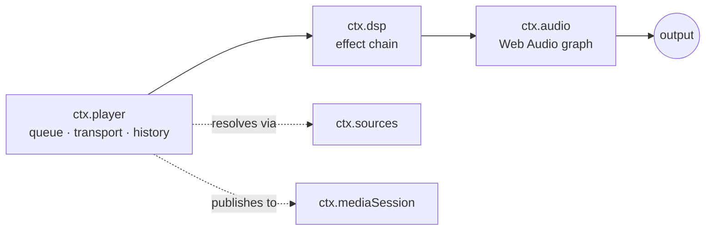
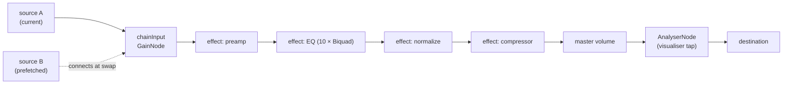
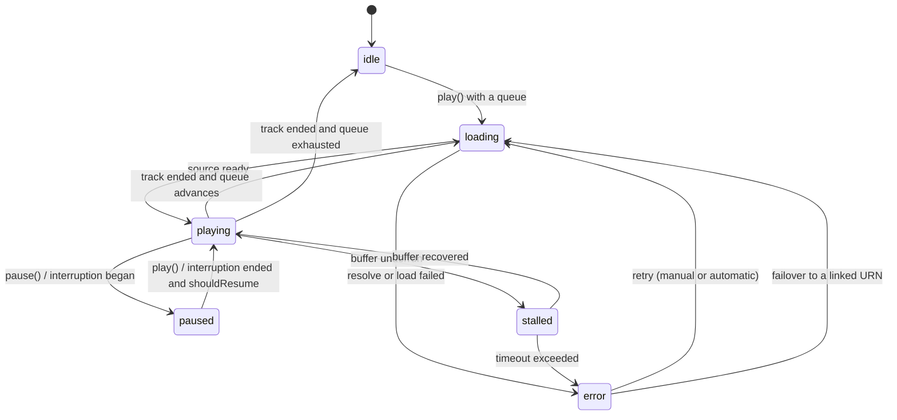
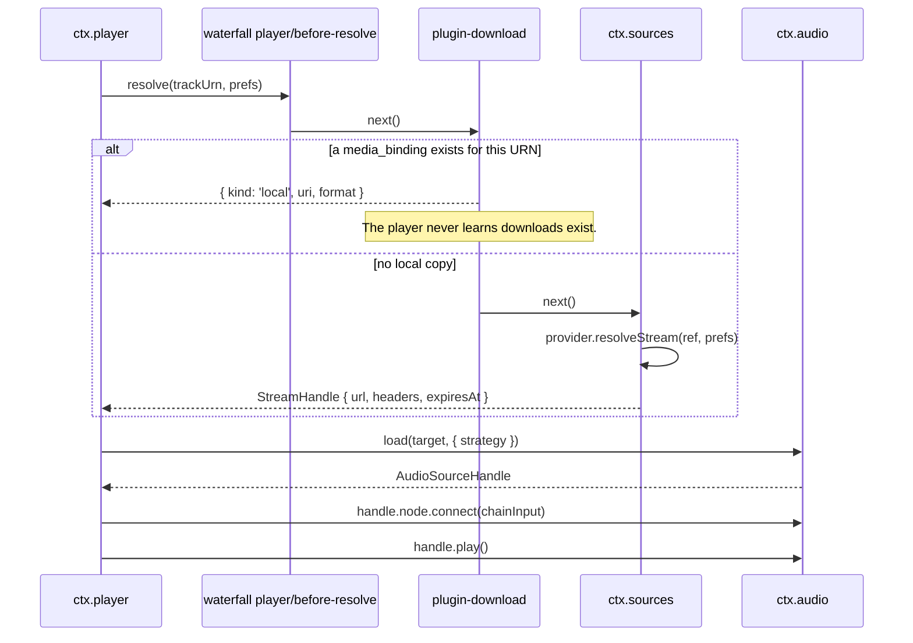

# 05 —— 音频与播放

> **本文回答什么。** 声音究竟是如何发出来的：音频引擎契约、播放控制与队列状态机、DSP 效果如何组合成效果链，以及播放如何在打断、路由切换与后台运行中存活。

三层服务，逐层叠加：



`ctx.player` 决定*播放什么*。`ctx.dsp` 决定*听起来怎样*。`ctx.audio` 拥有音频图，并且是唯一触碰平台的组件。

---

## 1. `ctx.audio` —— 引擎

依据 [ADR-4](./01-overview.md#adr-4--react-native-audio-api-is-the-primary-playback-and-dsp-engine-on-every-target)，契约**就是** Web Audio API 本身。`react-native-audio-api` 在 iOS 与 Android 上实现了它，并为 Electron 渲染进程提供 web 构建，因此同一份音频图描述可以处处运行。

```ts
import type { Uri, Disposable } from '@BBeBee/protocol'

export interface AudioSourceHandle {
  readonly node: AudioNode
  readonly durationMs: number
  play(atMs?: number): void
  pause(): void
  stop(): void
  readonly positionMs: number
  /** Fires when the source reaches its natural end. */
  onEnded(cb: () => void): Disposable
  dispose(): void
}

export interface LoadOptions {
  /** Streaming keeps memory flat; buffered enables sample-accurate gapless. */
  strategy: 'stream' | 'buffer'
  headers?: Record<string, string>
  signal?: AbortSignal
  onBuffered?: (seconds: number) => void
}

export interface AudioService {
  readonly context: BaseAudioContext
  readonly destination: AudioNode
  readonly sampleRate: number
  readonly outputLatencyMs: number

  /** Load a remote URL or a local Uri into a playable source node. */
  load(src: string | Uri, opts: LoadOptions): Promise<AudioSourceHandle>

  /** Where ctx.dsp inserts its chain. Sources connect here, not to destination. */
  readonly chainInput: AudioNode

  setVolume(v: number): void         // 0..1, applied post-chain
  setMuted(m: boolean): void

  listOutputDevices(): Promise<{ id: string; label: string; isDefault: boolean }[]>
  setOutputDevice(id: string): Promise<void>

  /** Interruptions, route changes, focus loss. See §5. */
  onInterruption(cb: (e: { type: 'began' | 'ended'; shouldResume: boolean }) => void): Disposable
  onRouteChange(cb: (e: { reason: 'device-removed' | 'device-added' | 'override' }) => void): Disposable
}
```

### 图拓扑



`chainInput` 存在的意义在于：音源可以随时来去而完全不触碰效果链，效果链可以随时重建而完全不触碰正在播放的音源。两者的生命周期被解耦了。

### 逃生通道

如果 `react-native-audio-api` 在某个平台上被证明不可用，`core-audio-rntp` 可以基于 `react-native-track-player` 实现 `AudioService`，此时 `chainInput` 退化为 no-op，效果降级为平台自带的原生 EQ。`ctx.player` 与每一个效果插件都不受影响。抽象就是那份保险，而正因为契约是标准契约，这份保险才足够便宜。

---

## 2. `ctx.player` —— 播放控制与队列

```ts
export type RepeatMode = 'off' | 'all' | 'one'

export interface QueueItem {
  id: string
  trackUrn: string
  /** Where this came from — an album, a playlist, radio. Drives "playing from". */
  sourceContext?: { kind: 'album' | 'playlist' | 'artist' | 'search' | 'radio'; urn?: string; label?: string }
  addedBy: 'user' | 'autoplay' | 'radio'
}

export interface TransportState {
  status: 'idle' | 'loading' | 'playing' | 'paused' | 'stalled' | 'error'
  currentItemId?: string
  trackUrn?: string
  positionMs: number
  durationMs: number
  bufferedMs: number
  volume: number
  muted: boolean
  repeat: RepeatMode
  shuffle: boolean
  error?: { code: string; message: string; retryable: boolean }
}

export interface PlayerService {
  readonly state: Readonly<TransportState>

  play(): Promise<void>
  pause(): void
  togglePlay(): void
  stop(): void
  seek(positionMs: number): Promise<void>
  next(): Promise<void>
  previous(): Promise<void>       // restarts current if past the threshold — see below

  setVolume(v: number): void
  setMuted(m: boolean): void
  setRepeat(m: RepeatMode): void
  setShuffle(on: boolean): void

  // Queue
  readonly queue: readonly QueueItem[]
  playNow(urns: string[], opts?: { startIndex?: number; context?: QueueItem['sourceContext'] }): Promise<void>
  enqueueNext(urns: string[]): void
  enqueueLast(urns: string[]): void
  removeItems(ids: string[]): void
  moveItem(id: string, toIndex: number): void
  clearQueue(): void
}
```

### 播放控制状态机



有几处行为值得钉死，因为播放器"手感不对"往往就出在这里：

- **`previous()`** 在 position > 3000 ms 时重启当前曲目，否则切回上一首。阈值可配置，默认值与所有其他播放器给用户养成的习惯一致。
- **随机播放（shuffle）** 持久化的是**一个种子加上一个排列**，而不是每次现选的随机结果。这让乱序在重启后保持稳定，让 `previous()` 仍有意义，也让即将播放的队列能够如实展示。
- **单曲循环**不重新解析流，而是复用已加载的缓冲。
- **`stalled`** 与 `paused` 是两回事。UI 显示的是转圈，而不是播放按钮，并且 `ctx.mediaSession` 继续上报 `playing`，以免锁屏界面闪烁。

### 解析流水线

从"队列前进了一格"到"声音出来了"之间发生的事。这是插件架构回报最直观的一段时序。



失败时，流水线会被重新进入而不是立刻把错误抛给用户：`UnavailableError` 会先触发一次 `track_links`（[07 §4.4](./07-data-model.md#44-identity-linking)）查询，寻找同一录音在其他提供方上的条目；只有这一步也一无所获，播放器才进入 `error`。

### 无缝（gapless）与交叉淡入淡出

- **无缝（gapless）** 使用 `AudioBufferQueueSourceNode`：在当前曲目最后约 15 秒内解码下一首并排入同一个 source 节点，因此交接是采样级精确的，没有 `AudioContext` 调度间隙。它要求 `strategy: 'buffer'`，因此只对本地文件与中短流启用，长流则跳过。
- **交叉淡入淡出（crossfade）** 是另一条路径：两个 source 节点，两段 `crossfadeMs` 的增益斜坡，等功率曲线。它与无缝模式互斥——两者同时开启会产生可听见的双重淡变——因此该设置是三选一：`gapless | crossfade | neither`。
- **预取**在距结尾 `max(15s, crossfadeMs + 5s)` 时开始，若队列发生变化则通过 `AbortSignal` 取消。

### 持久化

`playback_state` 在播放期间以 5 秒节流写入，并在暂停、曲目切换与 `ctx.background.onWillSuspend` 时立即写入。启动时播放器会恢复队列与进度，但**不会自动播放**——一启动就出声是吓人的，尤其当那部手机刚在口袋里被点亮的时候。

---

## 3. `ctx.dsp` —— 效果链

每一个效果都是一个插件。这个服务本身只是一个注册表加上一个链构建器。

```ts
import type { StandardSchemaV1 } from '@standard-schema/spec'

export interface EffectSegment {
  /** Where audio enters and leaves this effect. May be the same node. */
  input: AudioNode
  output: AudioNode
  /** Called when a persisted parameter changes. Must be allocation-free. */
  setParam(name: string, value: number | string | boolean): void
  /** Added to the reported chain latency, for A/V sync and visualiser alignment. */
  latencyMs?: number
  dispose(): void
}

export interface EffectDefinition<P = Record<string, unknown>> {
  id: string                      // 'eq10', 'reverb', 'normalize'
  displayName: string
  /** Default ordinal. Lower runs earlier. Users may override. */
  defaultOrder: number
  Params: StandardSchemaV1<unknown, P>
  presets?: { name: string; params: P }[]
  build(ctx: AudioContextLike, params: P): EffectSegment
}

export interface DspService {
  register(def: EffectDefinition): Disposable
  readonly definitions: readonly EffectDefinition[]

  readonly chain: readonly { effectId: string; enabled: boolean; ordinal: number }[]
  setEnabled(effectId: string, on: boolean): Promise<void>
  setOrder(effectId: string, ordinal: number): Promise<void>
  setParam(effectId: string, name: string, value: number | string | boolean): Promise<void>
  applyPreset(effectId: string, presetName: string): Promise<void>

  /** Total added latency, so the visualiser and lyrics can compensate. */
  readonly latencyMs: number
}
```

一个效果插件很小：

```ts
export const name = 'plugin-effect-eq10'
export const inject = ['dsp']

const BANDS = [31, 62, 125, 250, 500, 1000, 2000, 4000, 8000, 16000]

export function apply(ctx: Context) {
  return ctx.dsp.register({
    id: 'eq10',
    displayName: '10-Band Equalizer',
    defaultOrder: 20,
    Params: EqParams,                       // Zod/Valibot schema: gains + preamp
    presets: [{ name: 'Flat', params: { gains: BANDS.map(() => 0) } }],
    build(audioCtx, params) {
      const filters = BANDS.map((f, i) => {
        const n = audioCtx.createBiquadFilter()
        n.type = i === 0 ? 'lowshelf' : i === BANDS.length - 1 ? 'highshelf' : 'peaking'
        n.frequency.value = f
        n.Q.value = 1.41
        n.gain.value = params.gains[i]
        return n
      })
      filters.reduce((a, b) => (a.connect(b), b))
      return {
        input: filters[0],
        output: filters[filters.length - 1],
        setParam(nameOfParam, value) {
          const i = Number(nameOfParam.replace('band', ''))
          // Ramp rather than assign — a step change on a live filter clicks.
          filters[i].gain.setTargetAtTime(Number(value), audioCtx.currentTime, 0.02)
        },
        dispose() { filters.forEach((f) => f.disconnect()) },
      }
    },
  })
}
```

### 效果链组装

`ctx.dsp` 发出 `dsp/build-chain` 瀑布（waterfall）钩子，每个已注册效果按 ordinal 顺序贡献一个 segment，结果被拼接进 `chainInput` 与主音量之间。重建只发生在结构性变化时（某个效果被启用、禁用或重排）；**参数变化绝不重建图**，它们走 `setParam`。若每次拖动 EQ 滑块都重建图，那是听得出来的。

重建本身也是带斜坡的：主增益在 20 ms 内下潜，重新接线，增益再回升。没有这一步，播放中途切换效果会发出咔哒声。

### 内置效果

| id | Order | Implementation | Notes |
|---|---|---|---|
| `preamp` | 10 | `GainNode` | EQ 之前的净空（headroom）；钳制在 −20…+20 dB |
| `eq10` | 20 | 10 × `BiquadFilterNode` | 低架、8 个峰值、高架 |
| `normalize` | 30 | `GainNode` driven by ReplayGain tags | 曲目或专辑模式；回退到扫描器测得的值 |
| `compressor` | 40 | `DynamicsCompressorNode` | 供安静聆听使用的"夜间模式"预设 |
| `reverb` | 50 | `ConvolverNode` | 冲激响应作为资源随包分发；湿/干混合 |
| `widener` | 60 | `ChannelSplitter` + `Delay` + `ChannelMerger` | 基于 Haas 效应；UI 中给出单声道兼容性警告 |
| `crossfeed` | 65 | `IIRFilterNode` + delay | Bauer 风格，缓解耳机听感疲劳 |
| `tempo-pitch` | 70 | JS `AudioWorklet` (phase vocoder) | ⚠️ CPU 开销大；默认关闭，低电量时自动禁用 |
| `limiter` | 90 | `DynamicsCompressorNode`, hard settings | 永远在最后；防止各效果增益累积爆音 |

> ⚠️ `tempo-pitch` 作为 `AudioWorklet` 跑在音频线程上，从 `build()` 收到的那个 `AudioContext` 创建——与所有其他效果一样，它不导入任何平台相关的东西，也不知道底层是哪个引擎。尽管如此，它仍是唯一在中端 Android 上有真实性能风险的效果：它会自行上报掉帧（dropout）计数，在风险出现时以用户可见的提示自我禁用，而不是拖垮整条效果链。

---

## 4. 媒体会话集成

`ctx.player` 在每次曲目变化与状态变化时发布到 `ctx.mediaSession`，position 则节流为每秒一次。命令经由 `onCommand` 反向流入。

在移动端，封面图必须是本地 `Uri`，因此封面缓存在 `update()` 被调用前完成解析与下载；曲目切换时先立即发布不带封面的元数据，图片就绪后再更新一次，而不是拖住整个更新。

---

## 5. 打断、焦点与路由

这件事只在 `ctx.player` 中处理一次，依据的是 `ctx.audio` 的事件。每个平台的规则各不相同，但*策略*是统一的。

| 事件 | 策略 |
|---|---|
| 来电 / 闹钟开始 | 暂停。记住之前正在播放 |
| 打断结束且 `shouldResume` | 仅当确因该原因暂停、且此后用户未干预时才恢复 |
| 其他应用抢占音频焦点（Android） | 暂停。不要 duck——音乐播放器被 duck 是不对的 |
| 瞬时 duck 请求（导航播报） | 200 ms 内把主音量降到 20%，之后恢复 |
| 拔出耳机 / 蓝牙断开 | **立即暂停。**绝不在扬声器上继续 |
| 新输出设备接入 | 在当前设备上继续；没有用户操作不做迁移 |
| 输出设备在播放中消失 | 暂停，给出提示，提供切换选项 |

"拔耳机即暂停"这条规则重要到被设为不可配置。它是用户唯一一次都不会原谅的音频行为。

---

## 6. 播放与后台

交叉参考 [02 §4](./02-architecture.md#4-what-background-means)。具体来说：

- **iOS** —— `UIBackgroundModes: ['audio']`，audio session 类别为 `playback`。播放可以无限持续；*非音频*的工作则不行。
- **Android** —— 一个带媒体通知的前台服务，播放开始时启动，播放结束时停止。没有它，进程会在几分钟内被杀掉。
- **桌面** —— 渲染进程必须保持存活，因此在音频播放时关闭窗口会隐藏到托盘。`powerSaveBlocker` 用于防止在某些 Windows 配置上屏幕休眠连带挂起音频线程。

---

## 7. 测试音频

音频很难测，所以策略是分层展开而非端到端：

1. **效果确定性** —— 每个效果的 `EffectDefinition.build` 都在 `OfflineAudioContext` 中对一份已知输入缓冲运行；输出与存储的参考值在容差内比对。这能抓住滤波系数的意外改动——否则这些改动要等到有人听出 EQ 不对劲才会被发现。
2. **播放控制状态机** —— 针对 mock 的 `AudioService` 做纯单元测试。§2 图中的每一条转移都有测试，包括加载中途被打断、预取中途队列变化。
3. **解析流水线** —— 对 `player/before-resolve` 瀑布（waterfall）钩子分别在加载与未加载 `plugin-download` 的情况下测试，断言除所选目标不同外播放器行为完全一致。
4. **真机冒烟测试** —— 每个发布版本执行一次手工矩阵：锁屏、蓝牙、拔耳机、来电、无缝边界、后台存活。以合理的成本无法自动化，文档对此直言不讳。

---

## 8. 下一步去哪里

[06 —— 音源](./06-music-sources.md) 定义 URN 与流句柄从何而来。
