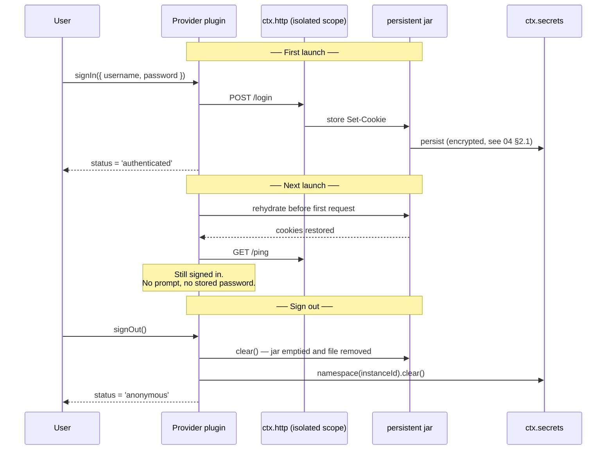
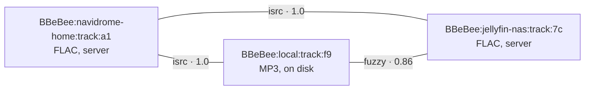

# 06 —— 音源

> **本文回答的问题。** 提供方 SPI —— 每一个音乐后端都要实现的契约。哪些成员是必需的、哪些是可选的，登录与登出，会话如何持久化以让用户保持登录，搜索、浏览、曲库查询、流解析、媒体库变更、错误处理，以及同一条曲目来自两个提供方时如何对账。

这是全系统中扩展性最关键的契约，也是暴露在我们无法控制的外部因素之下最多的契约：每个后端都有不同的 API、不同的认证方式、不同的分页，还有不同的生命周期。SPI 的设计前提是：**提供方不可靠且不平等**，UI 必须去适应每个提供方实际能做到什么。

---

## 1. 契约

接口被刻意拆分为两部分：每个提供方都必须实现的**小型必需核心**，以及提供方仅在后端支持之处才实现的**大型可选接口面**。

```ts
import type { Uri, Disposable } from '@BBeBee/protocol'

export interface MediaProvider {
  // ══ REQUIRED ═════════════════════════════════════════════════
  readonly instanceId: string           // 'navidrome-home'
  readonly displayName: string
  readonly capabilities: Capabilities

  /** Sign-in and sign-out. Required of every provider, including
   *  ones that need no credentials — see §1.1 and §4. */
  readonly auth: ProviderAuth

  /** Fetch one track's metadata by provider-local id. */
  getTrack(id: string): Promise<Track>

  /** Turn a track id into something playable. The reason a provider exists. */
  resolveStream(id: string, prefs: StreamPrefs): Promise<StreamHandle>

  /** Cheap reachability check. Drives the "server unreachable" state. */
  ping(): Promise<boolean>

  // ══ OPTIONAL ═════════════════════════════════════════════════
  // Every member below is gated by the matching `capabilities` flag.
  // A provider that omits one must also declare it unsupported, and the
  // UI hides the affordance rather than offering a button that fails.

  // ── 发现 ─────────────────────────────────────────────────────
  search?(q: SearchQuery, page?: PageRequest): Promise<SearchResult>
  browse?(nodeId?: string, page?: PageRequest): Promise<Paged<BrowseEntry>>

  // ── 曲库 ─────────────────────────────────────────────────────
  /** Batched lookup. Falls back to N× getTrack when absent, which is slower. */
  getTracks?(ids: string[]): Promise<Track[]>
  getAlbum?(id: string): Promise<AlbumDetail>
  getArtist?(id: string): Promise<ArtistDetail>
  getPlaylist?(id: string, page?: PageRequest): Promise<PlaylistDetail>
  getLyrics?(id: string): Promise<Lyrics | undefined>
  getArtwork?(ref: ArtworkRef, size?: number): Promise<Uri>

  // ── 用户在该提供方上的媒体库 ─────────────────────────────────
  library?: ProviderLibrary
}

export interface ProviderLibrary {
  list(kind: 'track' | 'album' | 'artist' | 'playlist', page?: PageRequest): Promise<Paged<LibraryEntry>>
  setSaved(urn: string, saved: boolean): Promise<void>
  createPlaylist(name: string, opts?: { description?: string }): Promise<string>
  addToPlaylist(playlistId: string, trackIds: string[]): Promise<void>
  removeFromPlaylist(playlistId: string, itemIds: string[]): Promise<void>
  reorderPlaylist(playlistId: string, itemId: string, toIndex: number): Promise<void>
  deletePlaylist(playlistId: string): Promise<void>
}
```

注意提供方**不做**什么：它从不写数据库，从不触碰音频图，也从不渲染任何东西。它只回答问题、返回纯数据。`ctx.sources` 把答案缓存进曲库表；`ctx.player` 消费流句柄。

### 1.1 为什么 `auth` 是必需的，而其他一切都不是

可选成员之所以可选，是因为后端确实千差万别：一个纯音频 URL 没有搜索、没有专辑、也没有播放列表，强迫它去桩实现六个一调用就抛异常的方法，只会造出一个对自己撒谎的提供方。`capabilities` 已经携带了这些信息，接口就顺着它走。

`auth` 是例外。它在**每个提供方上都是必需的**，包括那些不需要凭据的提供方，原因有三：

1. **UI 需要一个统一的查找位置。** 每个音源都会在设置里得到一个账户行，展示其状态和登出控件。如果 `auth` 是可选的，每个消费方都得对它的存在性做分支判断，而一个*后来*才长出认证功能的音源就会成为破坏性变更。
2. **登出必须在任何地方都有意义。** "移除这个音源并忘掉它存储的一切"是一个必须统一生效的用户动作 —— 清除 secrets、cookie 与缓存的曲库行。一个没有 `signOut` 的提供方会留下无人负责的残留。
3. **`ctx.sources` 驱动生命周期。** 注册、启动时的会话恢复，以及 `source/auth-expired` 路径，全部是针对 `auth` 编写的，而且不会写第二遍。

不需要凭据的提供方声明 `flow: { kind: 'none' }`，并以平凡的方式实现两个方法 —— `signIn` 立即 resolve 并置 `authenticated`；`signOut` 清掉本地缓存。`plugin-source-local` 正是如此，而且依然只有四行。

### Capabilities

提供方是不平等的，UI 必须知道是怎么个不平等法。每一个可选行为都要被声明出来，外壳据此隐藏相应的入口，而不是展示点了会失败的按钮。

```ts
export interface Capabilities {
  search: { tracks: boolean; albums: boolean; artists: boolean; playlists: boolean; fullText: boolean }
  browse: boolean
  lyrics: boolean
  artwork: boolean
  library: {
    read: boolean
    save: boolean
    playlistWrite: boolean
    playlistReorder: boolean
  }
  streaming: {
    /** Quality tiers this provider can serve, best first. */
    qualities: StreamQuality[]
    transcoding: boolean
    /** Byte-range requests — required for seeking within a stream. */
    seekable: boolean
    /** Whether resolved URLs expire and must be re-resolved. */
    urlExpiry: boolean
  }
  /** Requests per window, if the backend documents one. */
  rateLimit?: { requests: number; windowMs: number }
  /** Provider is region-locked; some catalogue may be unavailable. */
  regional: boolean
}

export type StreamQuality = 'low' | 'normal' | 'high' | 'lossless' | 'hi-res'
```

---

## 2. 提供方插件与提供方实例

数据模型依赖的一个区分：**一个插件，多个实例。**

`@BBeBee/plugin-source-subsonic` 是一个插件。一位用户家里有一台 Navidrome 服务器、公司又有一台，那就拥有它的*两个实例*，各自有独立的基础 URL、凭据、cookie 罐、限流器、缓存的曲库和 URN 命名空间。与此同时，`@BBeBee/plugin-source-local` 是 `instantiable: false` 的 —— 本地文件系统有且只有一个。

实例在配置中声明（[03 §6.4](./03-plugin-system.md#64-configuration)），并且每个实例都在自己的隔离作用域中加载：

```ts
// plugin-loader — simplified
for (const inst of entry.instances ?? [{ id: pluginId, config: entry.config }]) {
  const scoped = ctx.isolate('http')                  // private cookie jar + rate limiter
  scoped.plugin(HttpStack, { jar: inst.id, rateLimit: caps.rateLimit })
  scoped.plugin(providerModule.default, { ...inst.config, instanceId: inst.id })
}
```

下游的一切都以 `instanceId` 为键，从不以插件 id 为键。重命名或移除一台 Navidrome 服务器绝不能波及另一台，URN 也必须保持无歧义 —— 这正是 URN 的第二段是*实例*的原因（[07 §1](./07-data-model.md#1-identity-the-urn)）。

### 注册

```ts
export interface SourcesService {
  register(p: MediaProvider): Disposable
  readonly providers: readonly MediaProvider[]
  get(instanceId: string): MediaProvider | undefined
  /** Resolve a URN to its owning provider. */
  forUrn(urn: string): MediaProvider | undefined
  /** Fan-out search across every provider that supports it. */
  searchAll(q: SearchQuery, opts?: { instanceIds?: string[]; timeoutMs?: number }): Promise<AggregatedSearch>
}

export interface AggregatedSearch {
  /** One entry per provider that was asked — including the ones that failed. */
  byProvider: {
    instanceId: string
    /** Present on success. */
    result?: SearchResult
    /** Present on failure. The provider is reported, never silently dropped. */
    error?: SourceError
    /** True when the provider exceeded `timeoutMs` and is still running. */
    pending: boolean
    tookMs: number
  }[]
}
```

`searchAll` 返回按提供方分组的结果，**并附上每个提供方各自的错误**，绝不合并成一个把失败后端悄悄丢掉的列表。UI 会显示 "Navidrome: 12 results · Jellyfin: unreachable"，这既诚实又可操作。超过 `timeoutMs` 的提供方被报告为 pending，而不是取消整个搜索。

---

## 3. 分页与查询

```ts
export interface PageRequest { cursor?: string; limit?: number }

export interface Paged<T> {
  items: T[]
  cursor?: string        // absent means no more
  total?: number         // only when the backend actually knows
  hasMore: boolean
}

export interface SearchQuery {
  text: string
  types?: ('track' | 'album' | 'artist' | 'playlist')[]
  filters?: { genre?: string; yearFrom?: number; yearTo?: number; durationMaxMs?: number }
}

export interface SearchResult {
  tracks?: Paged<Track>
  albums?: Paged<Album>
  artists?: Paged<Artist>
  playlists?: Paged<Playlist>
}
```

游标是**不透明字符串**，由提供方自己定义 —— 有的后端用偏移量，有的用续传 token，有的用时间戳。消费方绝不能解析或伪造游标。`total` 是可选的，因为很多后端根本提供不了它；凭空编一个总数，只会造出说谎的进度条。

### 浏览

`browse` 把后端暴露的层级式"探索"界面 —— 流派、年代、排行榜、新歌、本地文件的目录树 —— 建模成一棵统一的节点树。

```ts
export interface BrowseEntry {
  id: string                        // pass back as nodeId to descend
  title: string
  subtitle?: string
  artwork?: ArtworkRef
  kind: 'folder' | 'album' | 'artist' | 'playlist' | 'track' | 'genre'
  /** Present for leaves; absent means "call browse(id) to descend". */
  urn?: string
}
```

本地文件提供方返回一棵目录树，Navidrome 返回流派和年份。UI 用同一个组件渲染两者。

---

## 4. 认证

认证由 SPI *声明*而非*实现*：提供方只需要描述自己需要哪种流程，由外壳来驱动它，因此任何提供方插件都不必自己造一个登录界面。

```ts
export type AuthFlow =
  | { kind: 'none' }
  | { kind: 'password'; fields: { id: string; label: string; secret?: boolean }[] }
  | { kind: 'token'; label: string; helpUrl?: string }
  | { kind: 'oauth-pkce'; authorizeUrl: string; tokenUrl: string; clientId: string; scopes: string[]; redirectUri: string }
  | { kind: 'qrcode'; poll: () => Promise<{ status: 'pending' | 'confirmed' | 'expired'; }> }
  | { kind: 'cookie'; loginUrl: string; requiredCookies: string[] }

export type AuthStatus =
  | { state: 'anonymous' }
  | { state: 'authenticated'; displayName?: string; expiresAt?: number }
  | { state: 'expired' }
  | { state: 'error'; message: string }

export interface ProviderAuth {
  readonly flow: AuthFlow
  readonly status: AuthStatus

  /** REQUIRED. Resolves once `status` is 'authenticated', throws AuthError otherwise. */
  signIn(input: Record<string, string>): Promise<void>

  /**
   * REQUIRED. Must leave nothing behind: clears the instance's secrets namespace,
   * empties and forgets its persisted cookie jar, and resets status to 'anonymous'.
   */
  signOut(): Promise<void>

  refresh?(): Promise<void>
  onStatusChange(cb: (s: AuthStatus) => void): Disposable
}
```

以下规则没有任何商量余地：

- **凭据绝不落入可读存储。** Token 进 `ctx.secrets` 的 `namespace(instanceId)` 之下；cookie 进 §4.1 所述的持久化 jar。绝不以明文进 `ctx.db`，绝不进配置文件，绝不出现在日志行里（[04 §16](./04-core-services.md#16-ctxlogger--logging-as-transport-plugins)）。
- **刷新是透明的。** 提供方挂钩 `http/request`；遇到 `401` 就刷新一次并重试。并发涌来的一串 401 必须恰好触发一次刷新 —— 插件持有一个在途（in-flight）的刷新 promise，所有调用方都等待它。
- **过期是一个事件，不是错误。** 刷新失败时，提供方发出 `source/auth-expired` 并置 `status = 'expired'`。`ctx.sources` 保持该实例处于注册状态，缓存的内容仍然可以浏览；只有网络调用会失败。UI 原地展示重新登录提示，而不是让该音源消失。
- **`oauth-pkce` 使用 `ctx.shell.openAuthSession`**，在两个平台上都只是同一调用（[04 §14](./04-core-services.md#14-ctxshell--leaving-the-app)）。

### 4.1 会话持久化 —— cookie 在应用关闭后依然存活

登录一次就必须够用。许多音乐后端 —— 一切使用 `cookie` 流程的，以及大量以 `Set-Cookie` 应答的 `password` 流程 —— 把会话完全装在 cookie 里，于是一个随进程消亡的 jar 意味着每次启动都要登录一次。

因此，每个提供方实例都拥有一个**持久化 cookie 罐**，以 `instanceId` 为键，由 `ctx.http` 提供（[04 §2.1](./04-core-services.md#21-cookie-jars)）。提供方不需要管理它：它存在于该实例隔离的 `ctx.http` 作用域中（[§2](#2-provider-plugins-vs-provider-instances)），于是提供方发出的每个请求都自动带上正确的 cookie，收到的每个 `Set-Cookie` 都会被存储，提供方中一行代码都不用写。



生命周期规则：

- **回灌发生在第一个请求之前，而不是惰性进行。** 提供方的 `[Service.init]` 会等待 `ctx.http.cookies.jar(instanceId).ready`，这样任何请求都不会与空 jar 竞速、拿到一个伪 `401` 从而误触过期路径。
- **持久化按实例划分。** 两台 Navidrome 服务器各有两个 jar，彼此看不见对方的 cookie —— 这由 `ctx.isolate('http')` 作用域自然推出，不额外做任何事。
- **Cookie 就是凭据，并按凭据对待** —— 静态加密，绝不进明文数据库列，绝不出现在日志行里，并被排除在崩溃报告包之外。
- **`signOut()` 必须清空 jar。** 只清内存里的那份是不够的；持久化副本也要删除。这是最容易漏掉的一步，所以它写进了 §9 的清单和一致性测试套件。
- **过期被认真对待。** `Expires`/`Max-Age` 已过去的会话 cookie 在回灌时被丢弃而不是重放，否则会造出一种"明明已登录但每个请求都失败"的困惑状态。
- **用户可以在不登出的情况下撤销。** 设置为每个实例提供"清除已存会话"操作，清掉 jar 与 secrets，同时保留实例本身的配置。

> ⚠️ 一个持久化的 cookie 就是一件持有者凭据（bearer credential），有效期为服务器所选，可能长达数月。它值得与密码同等的保护，[04 §2.1](./04-core-services.md#21-cookie-jars) 的存储设计正是如此对待它。这也意味着"登出"必须真正生效 —— 登出后仍留在磁盘上的 jar 是真实的安全漏洞，而不是不整洁。

---

## 5. 流解析

一个 URN 变成字节的那一刻。

```ts
export interface StreamPrefs {
  quality: StreamQuality
  /** True when the network is metered; providers should downgrade. */
  saveData: boolean
  /** Formats the platform can decode — from ctx.codec.supportedFormats(). */
  acceptFormats: string[]
}

export interface StreamHandle {
  kind: 'remote' | 'local'
  /** URL for remote, file Uri for local. */
  target: string
  mimeType?: string
  codec?: string
  bitrateKbps?: number
  sampleRate?: number
  /** Byte length when known — enables an accurate buffering indicator. */
  byteLength?: number
  seekable: boolean
  /** Headers required to fetch this stream. May contain credentials. */
  headers?: Record<string, string>
  /** Epoch ms. The player re-resolves before this, and on 403. */
  expiresAt?: number
  /** Reserved. Nothing implements this — see 01, non-goals. */
  drm?: { system: string; licenseUrl: string }
}
```

对那些棘手情形的处理：

- **会过期的 URL。** 播放器在 `expiresAt` 距今不足 60 秒时重新解析；流中途遇到 `403` 时，它先重新解析一次并从当前位置续播，之后才把错误抛给用户。
- **音质协商。** 提供方选出它能提供的、≤ 请求音质 **且** 在 `acceptFormats` 内的最好一档，并在句柄里返回它实际选了什么，这样 UI 展示的是真实码率而不是请求的码率。
- **`saveData`。** 取自 `ctx.device.network().metered`。无视它的提供方不算坏了规矩，但下载策略引擎照样会拒绝启动任何传输。

---

## 6. 错误

一套有类型的错误分类法，因为播放器对每一类的反应都不同，而一个字符串消息是没法做分支判断的。

```ts
export abstract class SourceError extends Error {
  abstract readonly code: string
  abstract readonly retryable: boolean
  constructor(message: string, public readonly instanceId?: string) { super(message) }
}

export class AuthError extends SourceError       { code = 'auth' as const;        retryable = false }
export class RateLimitError extends SourceError  { code = 'rate-limit' as const;  retryable = true
  constructor(message: string, public retryAfterMs: number, instanceId?: string) { super(message, instanceId) } }
export class UnavailableError extends SourceError{ code = 'unavailable' as const; retryable = false }
export class NotFoundError extends SourceError   { code = 'not-found' as const;   retryable = false }
export class NetworkError extends SourceError    { code = 'network' as const;     retryable = true }
export class ProviderError extends SourceError   { code = 'provider' as const;    retryable = false }
```

| 错误 | `ctx.player` 的反应 | UI 的展示 |
|---|---|---|
| `AuthError` | 停止。发出 `source/auth-expired` | 在该音源上原地弹出重新登录提示 |
| `RateLimitError` | 等待 `retryAfterMs`，重试一次，然后跳过 | 静默，除非反复出现 |
| `UnavailableError` | **尝试 `track_links`，在别处找同一录音**（§7）；找不到就跳过 | "Unavailable on <source>"，若存在备选则一并给出 |
| `NotFoundError` | 跳过。标记 `tracks.available = 0` | 列表中该曲目置灰 |
| `NetworkError` | 指数退避，重试 3 次，然后暂停 | "Offline" 横幅；队列保留 |
| `ProviderError` | 跳过，并用提供方的原始载荷记录日志 | 通用错误提示，附"复制详情"操作 |

任何错误都不允许清空队列。每一条失败路径都保留用户的队列，让恢复联网之后只需按下播放，而不是重新拼凑他们刚才在听的东西。

---

## 7. 跨提供方身份与故障转移

同一条录音可能同时存在于多个提供方上，也在磁盘上。它们是**拥有不同 URN 的不同实体**，通过 `track_links` 中的行关联起来。



链接由一条匹配流水线产生，按证据强弱排序：

| 方法 | 置信度 | 依据 |
|---|---|---|
| `isrc` | 1.00 | ISRC 精确匹配 |
| `mbid` | 1.00 | MusicBrainz recording id |
| `acoustid` | 0.95 | 声学指纹（可选插件；默认不随附） |
| `fuzzy` | 0.70–0.90 | 归一化的标题 + 艺人 + 2 秒内的时长 |
| `manual` | 1.00 | 用户说了算。绝不被自动化覆盖 |

链接有两处用途：

1. **故障转移** —— 遇到 `UnavailableError` 时，解析器转向关联的 URN，先按置信度、再按用户偏好排序（默认本地优先）。这一逻辑放在 `player/before-resolve` 瀑布（waterfall）钩子内处理，因此它本身是一个插件（`plugin-source-failover`），可以移除。
2. **媒体库去重** —— 统一媒体库把超过置信度阈值的关联 URN 折叠为一行，展示其中最好的可用副本，同时记住全部副本。

> ⚠️ 模糊匹配有时会错 —— 现场版、重制版和电台剪辑版的标题、艺人和时长都几乎相同。任何置信度低于 1.00 的匹配都只被当作*提示*：可用于故障转移，可在 UI 中以"also available on…"展示，但绝不能用来悄悄合并媒体库条目。基于一次错误猜测的合并，会让用户的媒体库以用户自己极难排查的方式出错。

---

## 8. 参考实现

依据 [01, non-goals](./01-overview.md#non-goals)：只支持开放协议，但 SPI 的设计让第三方可以实现任何东西。

| 插件 | 协议 | 锻炼到的能力 |
|---|---|---|
| `plugin-source-local` | 经由 `ctx.fs` + `ctx.codec` 的文件系统 | `instantiable: false`、文件夹 `browse`、`flow: 'none'` 认证、`kind: 'local'` 句柄、FTS5 搜索 |
| `plugin-source-subsonic` | Subsonic API（Navidrome、Airsonic、Gonic） | 多实例、采用加盐 token 方案的 `password` 认证、转码、播放列表写入 |
| `plugin-source-jellyfin` | Jellyfin | `token` 认证、**基于 cookie 的会话持久化**、丰富的浏览、多档音质 |
| `plugin-source-http-url` | 一个纯音频 URL 或播客 feed | SPI 的下限 —— 只实现必需核心（§1），省略每一个可选成员 |

其中两个的存在是为了证明契约的形状，而不是为了功能丰富：

- **`plugin-source-local`** 和其他提供方别无二致，也就是说本地媒体库没有任何特权。它走同样的解析路径和同样的 URN 方案；唯一的区别是 `resolveStream` 立即返回 `kind: 'local'`。它的 `auth` 就是 [§1.1](#11-why-auth-is-required-and-everything-else-is-not) 里那个平凡的 `flow: 'none'` 实现 —— 这恰好证明了"要求 `auth`"不产生任何代价。
- **`plugin-source-http-url`** 只实现必需核心，*其他什么都不实现*：没有 `search`、没有 `browse`、没有 `getAlbum`、没有 `library`。它是可选接口面的回归测试 —— 如果配置了它之后应用行为异常，那就是某个消费方在未检查 `capabilities` 的情况下调用了可选方法。

### 本地扫描器

`plugin-local-scanner` 之所以独立于 `plugin-source-local`，是因为扫描与提供服务是两件事。它通过 `ctx.fs.list` 遍历 `scan_roots`，对每个 `(size, mtime)` 与已记录的 `scan_entries` 行不一致的文件调用 `ctx.codec.readMetadata`，提取封面，并写入曲库行。

- **增量式。** 未变化的文件仅靠 stat 比对即被跳过；对 10 万个文件的曲库做一次无变化重扫，代价只是一堆 stat 调用。
- **可中断。** 以批次运行并使用 `AbortSignal`，每批结束做检查点存档，因此扫描中途挂起最多损失一批。
- **对失败诚实。** 解码失败的文件被记为 `scan_entries.status = 'error'` 并附原因，出现在"无法导入"列表中，而不是无声无息地消失。
- **尽可能监听变化。** 桌面端使用 `ctx.fs.watch`；移动端没有该 API，改为间隔轮询（[04 §1](./04-core-services.md#1-ctxfs--virtual-filesystem)）。

---

## 9. 编写一个提供方：清单

**必需核心（§1）**

- [ ] `auth.signIn` 与 `auth.signOut` 都已实现 —— 若是 `flow: 'none'` 可以很平凡，但必须实现。
- [ ] `getTrack`、`resolveStream` 与 `ping()` 齐备；`ping()` 开销小，且不计入限流。
- [ ] `resolveStream` 在 URL 会过期时设置 `expiresAt`，并遵守 `saveData`。

**可选成员**

- [ ] `capabilities` 与实际实现的可选成员严格一致 —— 少报会降级 UI，多报会弄坏 UI。
- [ ] 可选成员绝不做成一调用就抛异常的桩，要么直接省略。
- [ ] `getTracks` 采用批处理而不是循环调用 `getTrack` —— 或者干脆省略，让回退逻辑接管。

**会话与凭据**

- [ ] 所有网络调用都经由隔离作用域内的 `ctx.http`，绝不裸用 `fetch`，这样实例的 cookie 罐会自动生效。
- [ ] `[Service.init]` 在发出第一个请求前等待 `ctx.http.cookies.jar(instanceId).ready`。
- [ ] `signOut()` 清空 cookie 罐**以及** secrets 命名空间 —— 通过重启应用确认用户已登出来验证（[§4.1](#41-session-persistence--cookies-survive-the-app)）。
- [ ] 认证挂钩 `http/request` 做凭据注入；在途刷新有且只有一个。
- [ ] 任何 cookie、token 或密码都不进日志行或崩溃报告包。

**通用**

- [ ] 每个 URN、缓存键、secret 命名空间、jar 名称和日志作用域都用 `instanceId`。
- [ ] 错误映射到 §6 的分类法 —— 绝不抛裸 `Error`。
- [ ] 游标保持不透明；除非后端真的提供 `total`，否则省略。
- [ ] 注册时返回 disposer，让登出时干净地注销。

---

## 10. 下一步去哪

[07 —— 数据模型](./07-data-model.md) 定义了 URN 方案、这些提供方写入的每一张表，以及完整的事件表。
