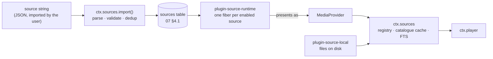
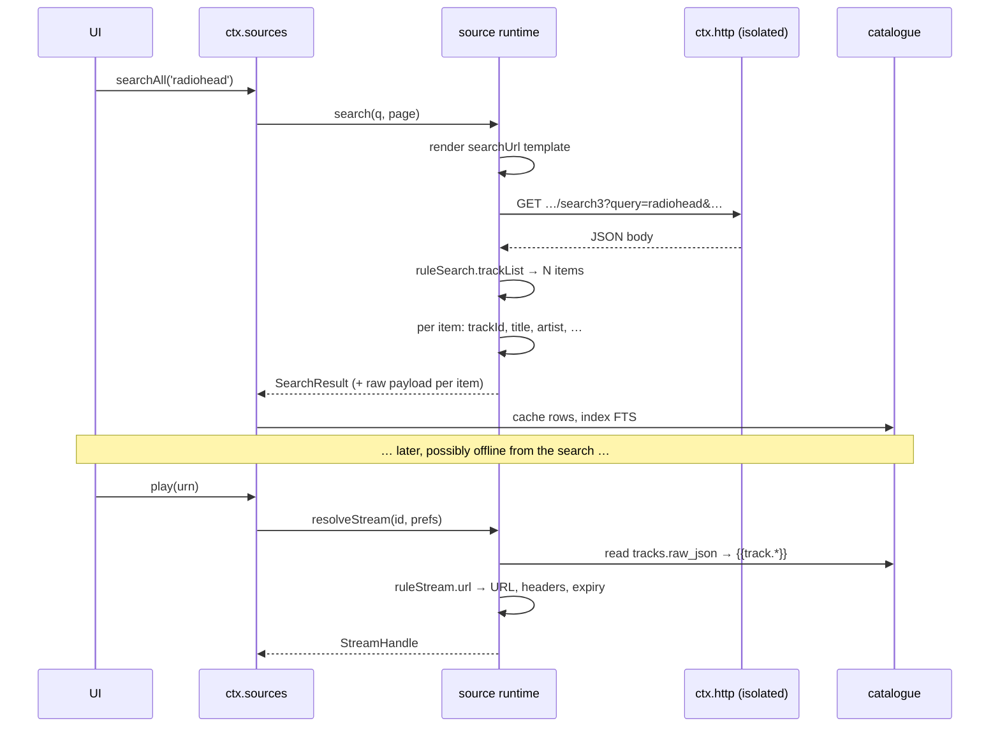
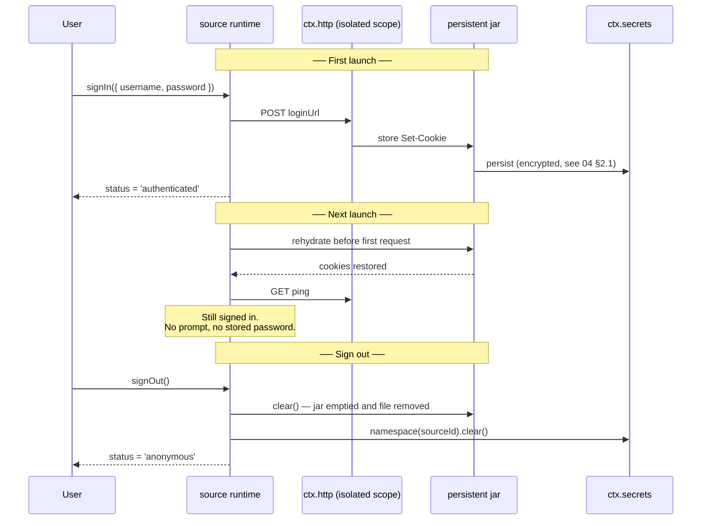
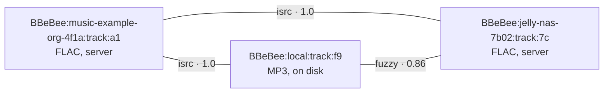

# 06 —— 音源

> **本文回答的问题。** 当音乐源*不再是包、而是一个字符串*之后，它究竟*是什么*：用户导入的 JSON 文档、其中的规则语言、解释它的唯一运行时、一个源如何认证并保持登录、一条规则如何变成字节、一个导入的源被允许做什么与不被允许做什么，以及一个坏掉的源如何被诊断和修复。

一个源是**数据，而不是我们发布的代码**。用户粘贴进一个字符串 —— 来自朋友、论坛、gist 或二维码 —— 应用就能从一个本仓库里没有任何人听说过的后端播放，无需构建、无需发版、也无需安装插件。当那个后端更改了它的 API，修复方式是编辑一个字符串，而不是升一个版本号。

这是 [legado](https://github.com/gedoor/legado) 书源模式在音频上的应用。它是对早期设计的刻意逆转 —— 在旧设计里，每个后端都是一个插件包；[ADR-5](./01-overview.md#adr-5--音源是导入的字符串由一个运行时解释) 记录了那个设计付出了什么、又换来了什么。

---

## 1. 模型

### 1.1 一个运行时，多个源

与远程音乐后端通信的代码有且只有**一份**：`plugin-source-runtime`。它不认领任何属于自己的服务键 —— 它读取 `sources` 表，并为每个启用的行向 `ctx.sources` 注册一个提供方。源就是行；运行时是它们唯一的解释者，不存在需要与之保持同步的第二个解释者。



`MediaProvider` 仍然存在，它之上的一切 —— `ctx.sources`、`ctx.player`、曲库缓存、URN 方案 —— 都没有变。变的是它的实现者构成：它现在是一个**恰好有两个实现的内部接口**（运行时的每源适配器，以及本地文件），而不是第三方面向它编写的扩展点。本仓库之外没有人去实现 `MediaProvider`；他们改写的是一份源文档。

```ts
import type { Uri, Disposable } from '@BBeBee/protocol'

/** Internal. Two implementations: the source runtime, and plugin-source-local. */
export interface MediaProvider {
  readonly sourceId: string             // 'music-example-org-4f1a'
  readonly displayName: string
  readonly capabilities: Capabilities   // derived — see §1.3
  readonly auth: ProviderAuth           // synthesised from the document — see §5

  getTrack(id: string): Promise<Track>
  resolveStream(id: string, prefs: StreamPrefs): Promise<StreamHandle>
  ping(): Promise<boolean>

  search?(q: SearchQuery, page?: PageRequest): Promise<SearchResult>
  browse?(nodeId?: string, page?: PageRequest): Promise<Paged<BrowseEntry>>
  getTracks?(ids: string[]): Promise<Track[]>
  getAlbum?(id: string): Promise<AlbumDetail>
  getArtist?(id: string): Promise<ArtistDetail>
  getPlaylist?(id: string, page?: PageRequest): Promise<PlaylistDetail>
  getLyrics?(id: string): Promise<Lyrics | undefined>
  getArtwork?(ref: ArtworkRef, size?: number): Promise<Uri>
  library?: ProviderLibrary
}
```

提供方**不做**的事情没有变，而且依旧至关重要：它从不写数据库，从不触碰音频图，也从不渲染任何东西。它只回答问题、返回纯数据。`ctx.sources` 把答案缓存进曲库表（[07 §4.3](./07-data-model.md#43-目录catalogue)）；`ctx.player` 消费流句柄。

### 1.2 身份：源 id

一个源文档以 **`sourceUrl`** 为键，与 legado 书源完全一致。它是后端的基础 URL，正是它让两台 Navidrome 服务器成为两个源，而不是一个配置错误的源。

```
sourceUrl  https://music.example.org
       ↓   slugified host + 4 hex of sha256(sourceUrl)
id         music-example-org-4f1a
       ↓
URN        BBeBee:music-example-org-4f1a:track:8f1a2c
```

这个 id 是推导出来的、稳定的，而且短到能放进一行日志里读。它占据 URN 的第二段，而这一段正是 [07 §1](./07-data-model.md#1-身份标识urn) 一直保留给"拥有这个 id 的那个命名空间"的 —— 因此模型变了，URN 方案却不需要变。

有两个后果值得明说，因为它们在过去都需要插件机制才能实现：

- **多实例是免费的。** 家里和公司的 Navidrome 就是两个导入的字符串、两个 `sourceUrl`。没有任何东西是"可实例化的"；这个概念已经不存在了。
- **重新导入是更新，不是重复。** 一个 `sourceUrl` 已存在的字符串会更新那一行并保留其 id，于是每个 URN、缓存的行、cookie 罐和播放列表引用都能在这次编辑中存活下来（[§9](#9-导入更新与分享)）。

### 1.3 能力是推导出来的，不是声明出来的

旧的 SPI 要求提供方声明 `capabilities`，然后寄希望于它与实际实现的方法一致；少报会降级 UI，多报会弄坏 UI。一份源文档不存在这种缝隙：**运行时根据出现了哪些规则块来计算 `Capabilities`。**

| 文档中存在的块 | 带来的能力 |
|---|---|
| `searchUrl` + `ruleSearch` | `search`，以及参与 `searchAll` |
| `exploreUrl` + `ruleExplore` | `browse` |
| `ruleAlbum` | `getAlbum`、专辑详情页 |
| `ruleTrackList` | 专辑与播放列表的曲目列表 |
| `ruleStream` *（或列表规则内的 `streamUrl`）* | `resolveStream` —— **必需**；没有它的源什么都播不了，会在导入时被拒绝 |
| `ruleLyric` | `getLyrics` |
| `loginUrl` / `loginUi` | 一个登录流程；缺席意味着 `flow: { kind: 'none' }` |
| `ruleLibrary.*` | 对应的 `ProviderLibrary` 成员 |

一个存在但为空的规则块按缺席处理。有且只有一个必需块 —— `ruleStream` —— 因为一个产生不出可播放 URL 的源不是音源。

```ts
export interface Capabilities {
  search: { tracks: boolean; albums: boolean; artists: boolean; playlists: boolean; fullText: boolean }
  browse: boolean
  lyrics: boolean
  artwork: boolean
  library: { read: boolean; save: boolean; playlistWrite: boolean; playlistReorder: boolean }
  streaming: {
    qualities: StreamQuality[]
    transcoding: boolean
    /** Byte-range requests — required for seeking within a stream. */
    seekable: boolean
    /** Whether resolved URLs expire and must be re-resolved. */
    urlExpiry: boolean
  }
  rateLimit?: { requests: number; windowMs: number }   // from `concurrentRate`
  regional: boolean
}

export type StreamQuality = 'low' | 'normal' | 'high' | 'lossless' | 'hi-res'
```

外壳依旧隐藏入口，而不是展示点了会失败的按钮 —— 只是它们现在读的是计算出来的值，而不是被承诺出来的值。

---

## 2. 源文档

### 2.1 顶层字段

一个 JSON 对象就是一个源。它们的数组是一个**源集合（source set）**，这也是人们实际分享的东西。

```ts
export interface SourceDocument {
  /** Identity. The backend's base URL. Required, unique, never edited in place. */
  sourceUrl: string
  sourceName: string
  sourceType?: 'music' | 'podcast' | 'radio'      // default 'music'
  sourceGroup?: string                            // free-text, comma-separated; drives filtering
  sourceIcon?: string
  sourceComment?: string                          // author's notes, shown in the editor
  enabled?: boolean                               // default true
  sortOrder?: number

  /** Hosts this source may talk to, beyond sourceUrl's own. Shown at import. §8 */
  allowedHosts?: string[]

  /** Requests per window, honoured by the runtime's scheduler. '3/1000' = 3 per second. */
  concurrentRate?: string

  /** Sent on every request. A rule, so it may be computed. */
  header?: string

  /** Free-text explanation of what `{{source.var}}` is for, shown beside the input. */
  variableComment?: string

  /** Functions shared by every `@js:` block in this document. */
  jsLib?: string

  /* ── auth (§5) ──────────────────────────────────────────────── */
  loginUrl?: string
  loginUi?: LoginField[]
  loginCheckJs?: string

  /* ── entry points ───────────────────────────────────────────── */
  searchUrl?: string
  exploreUrl?: string                             // JSON array of { title, url }, or a rule

  /* ── rule blocks (§2.2) ─────────────────────────────────────── */
  ruleSearch?: ListRule
  ruleExplore?: ListRule
  ruleAlbum?: AlbumRule
  ruleTrackList?: ListRule
  ruleStream?: StreamRule                         // required in practice — see §1.3
  ruleLyric?: LyricRule
  ruleLibrary?: LibraryRule

  /* ── maintained by the app, not the author ──────────────────── */
  lastUpdated?: number
  respondTime?: number
  weight?: number
}
```

> 应用维护的字段会在 `check`（[§10](#10-诊断一个坏掉的源)）时被写回，并在导出时被剥除，因此分享一个源绝不会泄漏*你的*网络有多快、或者*你*上次使用它是什么时候。

### 2.2 规则块

下面的每个值都是 [§3](#3-规则语言) 那门语言的**规则字符串（rule string）** —— 绝不是普通值，哪怕它看起来像。

```ts
/** Search results, explore results, and album track listings share one shape. */
export interface ListRule {
  /** Selects the repeating element. Every other field is evaluated against one of them. */
  trackList: string

  title: string
  artist?: string
  album?: string
  albumId?: string
  artwork?: string
  durationMs?: string
  trackId: string                 // becomes the URN's last segment
  quality?: string

  /** Shortcut: when the list already carries a playable URL, ruleStream is skipped. */
  streamUrl?: string
  /** For explore and album lists: descend rather than play. */
  childUrl?: string
  kind?: string                   // track|album|artist|playlist|folder|genre
}

export interface AlbumRule {
  title: string
  artist?: string
  artwork?: string
  year?: string
  description?: string
  trackCount?: string
  /** Where ruleTrackList is evaluated. Absent means "the same document". */
  trackListUrl?: string
}

export interface StreamRule {
  /** The only required member of the only required block. */
  url: string
  headers?: string                // JSON object; merged over `header`
  mimeType?: string
  codec?: string
  bitrateKbps?: string
  sampleRate?: string
  byteLength?: string
  seekable?: string               // truthy string; default probed with a HEAD
  /** Epoch ms. Its presence is what sets `capabilities.streaming.urlExpiry`. */
  expiresAt?: string
}

export interface LyricRule { lyric: string; format?: string; offsetMs?: string }
```

`browse` 就是 `exploreUrl` + `ruleExplore`：每个探索条目是一个带标题的 URL，而 `childUrl` 非空的条目是要深入下去的节点，而不是拿来播放的叶子。文件夹树、流派列表、排行榜、播客 feed 的单集列表，用的都是同样三个字段 —— 这正是同一个 UI 组件能渲染它们全部的原因。

### 2.3 一个完整的例子

**下限。** 一个只播放一条流的源 —— 最小的合法文档，也是"每个界面都能在一个完全没有可选块的源面前存活"的回归测试：

```json
{
  "sourceUrl": "https://stream.example.org/live.mp3",
  "sourceName": "Example Radio",
  "sourceType": "radio",
  "ruleStream": { "url": "={{source.url}}", "mimeType": "=audio/mpeg", "seekable": "=false" }
}
```

**一个真实的例子。** Subsonic 风格，展示模板、计算出来的认证 token、JSONPath 规则，以及一个由存储的 id 拼出的流 URL：

```json
{
  "sourceUrl": "https://music.example.org",
  "sourceName": "Navidrome — home",
  "sourceGroup": "self-hosted,subsonic",
  "concurrentRate": "5/1000",
  "variableComment": "username:password",
  "jsLib": "function auth(){ const [u,p]=String(src.vars.get('var')||'').split(':'); const s=src.crypto.randomHex(8); return `u=${u}&t=${src.crypto.md5(p+s)}&s=${s}&v=1.16.1&c=BBeBee&f=json` }",
  "searchUrl": "{{source.url}}/rest/search3?query={{key}}&songCount=50&songOffset={{(page-1)*50}}&{{@js:auth()}}",
  "exploreUrl": "[{\"title\":\"Albums\",\"url\":\"{{source.url}}/rest/getAlbumList2?type=alphabeticalByName&size=100&offset={{(page-1)*100}}&{{@js:auth()}}\"}]",

  "ruleSearch": {
    "trackList": "$.subsonic-response.searchResult3.song[*]",
    "trackId":   "$.id",
    "title":     "$.title",
    "artist":    "$.artist",
    "album":     "$.album",
    "albumId":   "$.albumId",
    "durationMs": "$.duration##$##000",
    "artwork":   "={{source.url}}/rest/getCoverArt?id={{item.coverArt}}&{{@js:auth()}}",
    "quality":   "$.suffix"
  },

  "ruleExplore": {
    "trackList": "$.subsonic-response.albumList2.album[*]",
    "trackId":   "$.id",
    "title":     "$.name",
    "artist":    "$.artist",
    "kind":      "=album",
    "childUrl":  "={{source.url}}/rest/getAlbum?id={{item.id}}&{{@js:auth()}}"
  },

  "ruleTrackList": {
    "trackList": "$.subsonic-response.album.song[*]",
    "trackId":   "$.id",
    "title":     "$.title",
    "artist":    "$.artist",
    "durationMs": "$.duration##$##000"
  },

  "ruleStream": {
    "url":       "={{source.url}}/rest/stream?id={{track.id}}&maxBitRate={{prefs.maxBitrateKbps}}&{{@js:auth()}}",
    "seekable":  "=true",
    "bitrateKbps": "{{prefs.maxBitrateKbps}}"
  }
}
```

注意是什么让 `ruleStream` 在数小时后、早已离开产生该曲目那次搜索的情况下仍然可用：运行时把每个列表条目的原始载荷存进 `tracks.raw_json`（[07 §4.3](./07-data-model.md#43-目录catalogue)），并把它暴露为 `{{track.*}}`。解析从不重跑一次搜索。

---

## 3. 规则语言

一门语言，用于 [§2.2](#22-规则块) 中的每一个字段。它刻意保持精小：一条规则就是表单字段里的一行，而源作者是在手机上调试它的。

### 3.1 引擎与前缀

前缀选定引擎。没有前缀时，引擎由规则的形状与被求值文档的内容类型推断。

| 形式 | 引擎 | 适用于 |
|---|---|---|
| `@css:h3 a@text` · 一个裸 CSS 选择器 | CSS 选择，带 `@attr` / `@text` / `@html` 尾巴 | HTML、XML |
| `@json:$.a.b[0]` · 以 `$.` 开头的规则 | JSONPath | JSON |
| `@xpath://div[@id="t"]/text()` · 以 `//` 开头的规则 | XPath | HTML、XML |
| `:(\d+)kbps` | 正则表达式；捕获组 1，若没有则为组 0 | 任意文本 |
| `@js:` … · `<js>` … `</js>` | 沙箱化 JavaScript（[§8](#8-信任导入的源能做什么不能做什么)） | 任意 |
| `=` … | 字面模板 —— 其余部分是带 `{{ }}` 插值的文本，绝不是选择器 | 任意 |

推断的存在是为了让常见情形写得短。它也是这门语言唯一可能让你吃惊的地方，所以这条规则被明文写下，而不是留给各人口味：**规则是选择器，除非它以 `=` 开头。** 一个不带 `=` 的常量 `"audio/mpeg"` 是一个针对不存在元素类型的 CSS 选择器，解释器会明确告诉你这一点，而不是悄悄把字符串原样返回。

### 3.2 模板与作用域

`{{ }}` 求值一个表达式并把结果内联进去。模板内部，以下名字处于作用域之中：

| 名字 | 含义 |
|---|---|
| `source.url` | 文档的 `sourceUrl` |
| `source.var` | 用户输入的每源变量（凭据、一个 cookie、一个地区） |
| `key` | 搜索文本 —— 只在 `searchUrl` 内 |
| `page` | 从 1 开始的页码 —— `searchUrl`、`exploreUrl` 以及任何分页列表 |
| `baseUrl` | 当前文档抓取自的 URL；相对链接以它为基准解析 |
| `item` | 当前列表元素，在求值 `ListRule` 字段时 |
| `result` | 链中到目前为止产生的值（[§3.3](#33-组合器与后处理)） |
| `track`、`album` | 存储的实体，在求值 `ruleStream` 或 `ruleLyric` 时 |
| `prefs` | 当前的 `StreamPrefs`（[§6](#6-流解析)）—— 音质、`saveData`、格式 |
| `src` | [§8](#8-信任导入的源能做什么不能做什么) 的宿主对象 —— `md5`、`get`、`cache`、`vars`…… |

表达式是在沙箱中求值的普通 JavaScript，因此 `{{(page-1)*50}}` 与 `{{@js:auth()}}` 是同一机制的两种语法糖。

### 3.3 组合器与后处理

| 语法 | 含义 |
|---|---|
| `a || b` | 第一个非空结果胜出。后端改了字段名时的惯用法 |
| `a && b` | 按顺序拼接每个结果 |
| `a %% b` | 交错合并两个列表 —— `a[0], b[0], a[1], b[1], …` |
| `rule##pattern##replacement` | 对结果做正则替换。`##pattern##` 不带替换部分即为删除 |
| `rule##pattern##replacement###` | 末尾的 `###` 使它只替换第一处，而不是全部 |
| `=` 模板内的 `{{rule}}` | 内联求值 |

`||` 是这门语言里单件最有用的东西：共享的源正是靠它熬过后端"加了新字段却不删旧字段"的改动；一个写得好的源能挺过一次网站改版，而写得差的源挺不过，原因也在于它。

### 3.4 变量与状态

三种作用域，三种生命周期：

| 作用域 | 由谁写入 | 存活于 | 由谁清除 |
|---|---|---|---|
| `@put:{k:rule}` / `@get:{k}` | 规则，求值中途 | 仅本次求值 | 本次调用结束 |
| `src.cache.put(k, v, ttlMs)` | `@js:` | 内存，按源划分，受 TTL 约束 | TTL 到期、卸载，或"清空缓存" |
| `src.vars.put(k, v)` | `@js:` | `source_vars`（[07 §4.1](./07-data-model.md#41-音源账号与会话)） | 登出，或移除该源 |

`@put` 为每个靠抓取的后端都需要的模式而存在 —— 从搜索页里抠出一个 token，两次调用之后用在流 URL 里 —— 同时不让这个 token 变成全局或持久的。`src.vars` 用于必须熬过重启的东西，并被当作凭据级存储对待：它不随源导出、不进日志，由登出清除。

### 3.5 URL 对象

任何产生 URL 的规则都可以改为产生一个 **URL 对象**：URL 本身、一个逗号、再跟一个 JSON 选项块。这是 legado 的语法，之所以保留，是因为它紧凑到能放进一个表单字段。

```
https://api.example.org/search,{"method":"POST","body":"q={{key}}","headers":{"X-Api":"…"},"charset":"gbk"}
```

| 选项 | 效果 |
|---|---|
| `method` | `GET`（默认）、`POST`、`HEAD` |
| `body` | 请求体；会做模板插值 |
| `headers` | 合并覆盖文档的 `header` |
| `charset` | 解码非 UTF-8 的响应 |
| `retry` | 调用被判为错误前的尝试次数；默认 1 |
| `webView` | ⚠️ 在隐藏的 web view 中渲染并取回结果 DOM。仅桌面端，默认关闭，它是唯一能让一个源拥有完整浏览器的选项 —— 见 [§8](#8-信任导入的源能做什么不能做什么) |

### 3.6 解释器保证什么

规则来自陌生人，而求值时所面对的文档，可能早已在规则写成之后变了样。解释器的契约针对的正是这一点，而不是表达能力：

- **缺席与空是两回事。** 什么都没匹配到的选择器产生*缺席*；匹配到空字符串的选择器产生 `''`。可选字段容忍缺席；必需字段则抛出 `RuleError`，并指明是哪条规则（[§7](#7-错误)）。
- **类型强转是显式且彻底的。** `durationMs` 要经过一个数值强转，它接受 `213`、`"3:33"` 和 `"213.4s"`，对其余一切连同规则 id 一并拒绝，而不是把 `NaN` 写进曲库。
- **每次求值都有界。** 每条规则的墙钟时间、内存、输出大小与 HTTP 调用次数都有上限。一个失控的 `@js:` 块只会让自己那条规则失败；它不会挂死应用（[§8](#8-信任导入的源能做什么不能做什么)）。
- **相对 URL 总是以 `baseUrl` 为基准解析**，源因此永远不必自己拼接路径。
- **规则返回的任何东西都不被当作标记（markup）信任。** 结果是文本，也按文本渲染。一个包含 `<script>` 的标题就是一个标题。
- **失败是可归因的。** 每个错误都携带源 id、规则块、字段与输入摘录 —— 这正是 [§10](#10-诊断一个坏掉的源) 得以成立的前提。

---

## 4. 运行时

### 4.1 一个源的生命周期

一个源不是插件 —— 但运行时仍然给每个源**各自的 fiber 与各自隔离的 `ctx.http` 作用域**，因为正是这一点让禁用一个源变得彻底、且无需专门的清理逻辑（[03 §2](./03-plugin-system.md#2-生命周期)）。

```ts
// plugin-source-runtime — simplified
for (const rec of await ctx.db.select('sources', { enabled: 1 })) {
  const scoped = ctx.isolate('http')                       // private cookie jar + rate limiter
  scoped.plugin(HttpStack, { jar: rec.id, rateLimit: parseRate(rec.doc.concurrentRate) })
  scoped.plugin(SourceInstance, { record: rec })           // registers into ctx.sources
}
```

过去从"一个插件、多个实例"推出的一切，如今都从"一行、一个 fiber"推出：两个源看不见彼此的 cookie，一个源的限流无法拖慢另一个源的请求，移除一个源恰好只销毁它自己的注册、它的 jar、它的 vars，以及 —— 如果用户要求的话 —— 它的曲库行。

编辑一个源字符串只销毁并重建那一个 fiber。用户在下一次搜索时就能看到改动，无需重启。

```ts
export interface SourcesService {
  /* ── the registry (unchanged) ─────────────────────────────────── */
  /** Internal. Called by the runtime per source and by plugin-source-local. */
  register(p: MediaProvider): Disposable
  readonly providers: readonly MediaProvider[]
  get(sourceId: string): MediaProvider | undefined
  forUrn(urn: string): MediaProvider | undefined
  searchAll(q: SearchQuery, opts?: { sourceIds?: string[]; timeoutMs?: number }): Promise<AggregatedSearch>

  /* ── sources as data (§9, §10) ────────────────────────────────── */
  readonly sources: readonly SourceRecord[]
  import(input: string, opts?: ImportOptions): Promise<ImportReport>
  export(ids?: string[]): Promise<string>
  setEnabled(id: string, on: boolean): Promise<void>
  remove(id: string, opts?: { forgetCatalogue?: boolean }): Promise<void>
  check(ids?: string[], opts?: { signal?: AbortSignal }): Promise<CheckReport[]>
  debug(id: string, step: DebugStep): AsyncIterable<TraceEvent>
}

export interface AggregatedSearch {
  /** One entry per source that was asked — including the ones that failed. */
  bySource: {
    sourceId: string
    result?: SearchResult
    /** Present on failure. The source is reported, never silently dropped. */
    error?: SourceError
    /** True when the source exceeded `timeoutMs` and is still running. */
    pending: boolean
    tookMs: number
  }[]
}
```

`searchAll` 形状未变，但比以前更重要了：面对十几个质量参差的导入源，"按源分组的结果、附每个源各自的错误"正是"搜索坏了"与"你十二个源里有三个应答了、一个被限流、一个需要重新导入"之间的区别。

### 4.2 解析流水线



同样的流水线也以同样的方式跑 `browse`（`exploreUrl` → `ruleExplore` → `childUrl` → `ruleAlbum` → `ruleTrackList`）和歌词。动词只有三个 —— 抓取一份文档、从中做选择、对选择结果做强转 —— 每一项能力都只是这三者的不同组合。

### 4.3 分页、限流与缓存

**分页**就是 `{{page}}`。运行时递增它，并在某一页不再产出条目、或重复了上一页的 id 时停止。它对外暴露的仍是与从前相同的不透明游标契约，因此任何消费方都不必知道页其实是数字：

```ts
export interface PageRequest { cursor?: string; limit?: number }

export interface Paged<T> {
  items: T[]
  cursor?: string        // absent means no more
  total?: number         // only when the backend actually says
  hasMore: boolean
}

export interface SearchQuery {
  text: string
  types?: ('track' | 'album' | 'artist' | 'playlist')[]
  filters?: { genre?: string; yearFrom?: number; yearTo?: number; durationMaxMs?: number }
}

export interface SearchResult {
  tracks?: Paged<Track>
  albums?: Paged<Album>
  artists?: Paged<Artist>
  playlists?: Paged<Playlist>
}
```

`total` 保持可选，因为一个抓取来的页面几乎从来不知道总数，而凭空编造一个只会产出说谎的进度条。

**限流**是 `concurrentRate`，由源自己隔离的 HTTP 栈强制执行，而不是由规则。`"3/1000"` 是每秒三个请求；`"1/2000"` 是每两秒一个。没有 `concurrentRate` 的源会得到一个保守默认值，因为往高了猜的失败模式，就是某个人的服务器封掉用户的 IP。

**缓存**有两层，当源行为不端时这个区分就很要紧：HTTP 响应走 `http/request` 瀑布（waterfall）钩子上的 `plugin-cache`，并遵守后端的缓存头；`src.cache` 是源自己的草稿区，带显式 TTL。清掉一层不会清掉另一层，设置界面也把两者分开提供。

---

## 5. 认证与会话

认证**在文档中声明、由外壳驱动**，因此任何源作者都不必编写登录界面 —— 与从前相同的原则，改用数据表达。

```ts
export interface LoginField {
  id: string
  label: string
  type?: 'text' | 'password' | 'checkbox' | 'select'
  options?: string[]
  placeholder?: string
}

export type AuthFlow =
  | { kind: 'none' }
  | { kind: 'variable'; comment?: string }        // the `source.var` box, and nothing more
  | { kind: 'form'; fields: LoginField[]; submitTo: string }
  | { kind: 'webview'; loginUrl: string; requiredCookies: string[] }

export type AuthStatus =
  | { state: 'anonymous' }
  | { state: 'authenticated'; displayName?: string; expiresAt?: number }
  | { state: 'expired' }
  | { state: 'error'; message: string }

export interface ProviderAuth {
  readonly flow: AuthFlow
  readonly status: AuthStatus
  signIn(input: Record<string, string>): Promise<void>
  /** Clears the jar, the secrets namespace, and this source's vars. Leaves nothing. */
  signOut(): Promise<void>
  refresh?(): Promise<void>
  onStatusChange(cb: (s: AuthStatus) => void): Disposable
}
```

每种流程在文档中如何表达：

| 流程 | 写作 | 例子 |
|---|---|---|
| `none` | 完全没有认证字段 | 一个公开的电台流 |
| `variable` | 只有 `variableComment` | Subsonic 的 `user:password`，由 `jsLib` 消费 |
| `form` | `loginUi`（字段）+ `loginUrl`（提交到哪） | 自建服务器的 `/login` |
| `webview` | `loginUrl` + `requiredCookies`，在 `ctx.shell` 中打开 | 登录是网页而非 API 的后端 |

`loginCheckJs` 在每次响应之后运行，判定会话是否仍然有效；返回 false 会置 `status = 'expired'` 并发出 `source/auth-expired`。它对应的是"服务器又开始用登录页应答了"这件事 —— 没有任何 HTTP 状态码能可靠地表达它。

以下规则没有任何商量余地，而且从源还是插件的年代起就一条未变：

- **凭据绝不落入可读存储。** `source.var`、表单输入与 token 进 `ctx.secrets` 的 `namespace(sourceId)` 之下；cookie 进 §5.1 所述的持久化 jar。绝不以明文进 `ctx.db`，绝不进导出的字符串，绝不出现在日志行里（[04 §16](./04-core-services.md#16-ctxlogger--以传输插件形式实现的日志)）。
- **刷新是透明的，且有且只有一次。** 运行时按源挂钩 `http/request`；遇到 `401` 或 `loginCheckJs` 失败时，它重新认证一次并重试。并发涌来的一串 401 恰好触发一次刷新 —— 一个在途（in-flight）的 promise，所有调用方都等待它。
- **过期是一个事件，不是错误。** 源保持注册状态，缓存的曲库仍然可以浏览；只有网络调用会失败。UI 原地展示重新登录提示，而不是让该源消失。
- **导出绝不携带会话。** [§9](#9-导入更新与分享) 会剥除 `source.var`、cookie 与每一个 `src.vars` 值。分享一个源绝不能连带分享一个账号，而这必须由构造保证，而不是靠分享者记得。

### 5.1 会话持久化 —— cookie 在应用关闭后依然存活

登录一次就必须够用。许多后端把会话完全装在 cookie 里，于是一个随进程消亡的 jar 意味着每次启动都要登录一次。

每个源拥有一个**持久化 cookie 罐**，以源 id 为键，由 `ctx.http` 提供（[04 §2.1](./04-core-services.md#21-cookie-罐)）。没有任何规则需要管理它：它存在于该源隔离的 `ctx.http` 作用域中（[§4.1](#41-一个源的生命周期)），于是运行时替该源发出的每个请求都自动带上正确的 cookie，收到的每个 `Set-Cookie` 都会被存储，文档里一行 cookie 处理代码都不用写。



生命周期规则：

- **回灌发生在第一个请求之前，而不是惰性进行。** 源的 fiber 会等待 `ctx.http.cookies.jar(sourceId).ready`，这样任何请求都不会与空 jar 竞速、拿到一个伪 `401` 从而误触过期路径。
- **持久化按源划分。** 两台 Navidrome 服务器各有两个 jar，彼此看不见对方的 cookie —— 这由 `ctx.isolate('http')` 自然推出，不额外做任何事。
- **Cookie 就是凭据，并按凭据对待** —— 静态加密，绝不进明文数据库列，绝不出现在日志行里，并被排除在崩溃报告包与导出之外。
- **`signOut()` 会清空 jar。** 只清内存里的那份是不够的；持久化副本也要删除，连同 secrets 命名空间与 `source_vars` 一起。这是最容易漏掉的一步，所以它写进了 [§13](#13-编写一个源清单) 的清单和一致性测试套件。
- **过期被认真对待。** `Expires`/`Max-Age` 已过去的会话 cookie 在回灌时被丢弃而不是重放，否则会造出一种"明明已登录但每个请求都失败"的困惑状态。
- **用户可以在不移除的情况下撤销。** 设置为每个源提供"清除已存会话"操作，清掉 jar、secrets 命名空间与 vars，同时保留该源的导入状态。

> ⚠️ 一个持久化的 cookie 就是一件持有者凭据（bearer credential），有效期为服务器所选，可能长达数月。它值得与密码同等的保护，[04 §2.1](./04-core-services.md#21-cookie-罐) 的存储设计正是如此对待它。这也意味着"登出"必须真正生效 —— 登出后仍留在磁盘上的 jar 是真实的安全漏洞，而不是不整洁。

---

## 6. 流解析

一个 URN 变成字节的那一刻。契约没有变；变的是如今由 `ruleStream` 产出它，而不是一个手写的提供方。

```ts
export interface StreamPrefs {
  quality: StreamQuality
  /** True when the network is metered; the template sees it as {{prefs.saveData}}. */
  saveData: boolean
  /** Formats the platform can decode — from ctx.codec.supportedFormats(). */
  acceptFormats: string[]
  maxBitrateKbps?: number
}

export interface StreamHandle {
  kind: 'remote' | 'local'
  target: string                  // URL for remote, file Uri for local
  mimeType?: string
  codec?: string
  bitrateKbps?: number
  sampleRate?: number
  byteLength?: number
  seekable: boolean
  /** Headers required to fetch this stream. May contain credentials. */
  headers?: Record<string, string>
  /** Epoch ms. The player re-resolves before this, and on 403. */
  expiresAt?: number
  /** Reserved. Nothing implements this — see 01, non-goals. */
  drm?: { system: string; licenseUrl: string }
}
```

对那些棘手情形的处理：

- **会过期的 URL。** 播放器在 `expiresAt` 距今不足 60 秒时重新解析；流中途遇到 `403` 时，它先重新解析一次并从当前位置续播，之后才把错误抛给用户。返回短时效 URL 的源应设置 `ruleStream.expiresAt`；一个不设置它却照样提供会过期 URL 的源，会制造出本系统中最令人困惑的一类 bug —— 这正是 `check`（[§10](#10-诊断一个坏掉的源)）会把"第二次 HEAD 就拒绝的流 URL"标记出来的原因。
- **音质协商。** `{{prefs.*}}` 在 `ruleStream` 内处于作用域之中，因此由文档决定它能提供什么。它返回什么，句柄里就报告什么，于是 UI 展示的是真实码率而不是请求的码率。
- **`saveData`。** 取自 `ctx.device.network().metered`。无视它的源不算坏了规矩，但下载策略引擎照样会拒绝启动任何传输。
- **头部随句柄一起走。** 一个只在带 `Referer` 时才可用的流 URL 是常事，`ruleStream.headers` 就是源说明这一点的方式。`ctx.audio` 随加载请求一起收到它们；它们在日志中被脱敏。

---

## 7. 错误

分类法没有变，只多了一个字符串模型让它无法避免的条目：一条规则可能*是错的*，这与后端*宕机*是两种不同的失败，混为一谈会把用户引向错误的修法。

```ts
export abstract class SourceError extends Error {
  abstract readonly code: string
  abstract readonly retryable: boolean
  constructor(message: string, public readonly sourceId?: string) { super(message) }
}

export class AuthError extends SourceError       { code = 'auth' as const;        retryable = false }
export class RateLimitError extends SourceError  { code = 'rate-limit' as const;  retryable = true
  constructor(message: string, public retryAfterMs: number, sourceId?: string) { super(message, sourceId) } }
export class UnavailableError extends SourceError{ code = 'unavailable' as const; retryable = false }
export class NotFoundError extends SourceError   { code = 'not-found' as const;   retryable = false }
export class NetworkError extends SourceError    { code = 'network' as const;     retryable = true }
export class ProviderError extends SourceError   { code = 'provider' as const;    retryable = false }

/** The document is valid but a rule did not produce what it must. The source needs editing. */
export class RuleError extends SourceError {
  code = 'rule' as const
  retryable = false
  constructor(message: string, public readonly rule: { block: string; field: string }, sourceId?: string) {
    super(message, sourceId)
  }
}

/** Import-time only: the string is not a valid source document. */
export class SourceFormatError extends Error {
  constructor(message: string, public readonly issues: { path: string; message: string }[]) { super(message) }
}
```

| 错误 | `ctx.player` 的反应 | UI 的展示 |
|---|---|---|
| `AuthError` | 停止。发出 `source/auth-expired` | 在该源上原地弹出重新登录提示 |
| `RateLimitError` | 等待 `retryAfterMs`，重试一次，然后跳过 | 静默，除非反复出现 |
| `UnavailableError` | **通过 `track_links` 在别处找同一录音**（[§11](#11-跨源身份与故障转移)）；找不到就跳过 | "Unavailable on <source>"，若存在备选则一并给出 |
| `NotFoundError` | 跳过。标记 `tracks.available = 0` | 列表中该曲目置灰 |
| `NetworkError` | 指数退避，重试 3 次，然后暂停 | "Offline" 横幅；队列保留 |
| `ProviderError` | 跳过，并用后端的原始载荷记录日志 | 通用错误提示，附"复制详情"操作 |
| `RuleError` | 跳过。递增该源的失败计数器 | **"<source> needs updating"**，一键直达调试视图（[§10](#10-诊断一个坏掉的源)） |

任何错误都不允许清空队列。每一条失败路径都保留用户正在听的东西，因此恢复联网 —— 或者修好一条规则 —— 意味着按下播放，而不是重新拼凑一个队列。

> 一个连续三次调用都抛出 `RuleError` 的源会被标记为**过期（stale）**，并带一个徽标沉到源列表底部。它不会被禁用：过期源的缓存曲库仍然可以浏览，它已下载的曲目也仍然能播。自动禁用它，反而会藏起用户重新导入它所需的唯一信号。

---

## 8. 信任：导入的源能做什么、不能做什么

> ⚠️ **一个源字符串就是一个陌生人写出来的程序。** `@js:`、`jsLib` 与 `{{ }}` 都是 JavaScript。把导入的源当成惰性配置是一种谎言，这个设计也不假装不是如此。

让这件事变得可处理 —— 也确实比它所取代的插件模型更好 —— 的一点在于：一个源的执行环境*小到可以一一列举*。运行期加载的插件与渲染进程共享同一个 realm，什么都能碰到（[03 §7](./03-plugin-system.md#它不是什么)）；而一个源碰不到下面这份清单之外的任何东西。

### 求值器

源的 JavaScript 运行在 `ctx.js` 里 —— 一个**独立的解释器 realm**，两个平台都用 QuickJS —— 不引用应用的全局对象、Cordis 上下文、DOM 或模块系统。它正是 [03 §7](./03-plugin-system.md#它不是什么) 所说的、真正的隔离所需要的独立 realm。音源是它如今就存在、而不是留待以后的原因；第三方插件将继承它（[10 §M5](./10-roadmap.md#m5--沙箱上的第三方扩展)）。契约见 [04 §19](./04-core-services.md#19-ctxjs--沙箱化求值器)。

一个源能看到的全部宿主接口面：

```ts
/** `src` inside any @js: block or {{ }} template. This list is the whole API. */
export interface SourceHost {
  /** HTTP through the source's own isolated stack: its jar, its rate limit, its host allowlist. */
  get(url: string, opts?: RequestOptions): Promise<{ status: number; headers: Record<string, string>; body: string }>
  post(url: string, body: string, opts?: RequestOptions): Promise<{ status: number; headers: Record<string, string>; body: string }>

  parse: { json(s: string): unknown; html(s: string): Node; xml(s: string): Node }
  crypto: { md5, sha1, sha256, hmac, aesEncrypt, aesDecrypt, base64Encode, base64Decode, randomHex }
  cache: { get(k: string): unknown; put(k: string, v: unknown, ttlMs?: number): void }
  vars: { get(k: string): string | undefined; put(k: string, v: string): void }
  url: { encode(s: string): string; decode(s: string): string; resolve(base: string, rel: string): string }
  time: { now(): number }
  log(message: string): void
}
```

没有 `fetch`，没有 `require`，没有 `import`，没有 `globalThis` 透传，没有比调用本身活得更久的计时器，也没有任何形式的文件系统。

### 限制，以及每条限制为何存在

| 限制 | 数值 | 它挡住什么 |
|---|---|---|
| **主机允许列表** | `sourceUrl` 的主机加上 `allowedHosts`，按主机名匹配 | 向攻击者控制的端点外泄数据。指向任何其他主机的 URL 都会被以 `CapabilityError` 拒绝，无论它是字面写出的还是运行时算出来的 |
| 每条规则的墙钟时间 | 2 秒（带网络的 `@js:` 为 10 秒） | 一条把搜索挂死的规则 |
| 每次求值的内存 | 32 MB | 一个把应用 OOM 掉的源 |
| 每条规则的 HTTP 调用次数 | 8 | 一条把一次搜索变成爬取的规则 |
| 每条规则的输出大小 | 1 MB | 一个把整页内容塞进表格单元格的选择器 |
| 并发 | `concurrentRate`，默认保守 | 用户自己的服务器封掉用户的 IP |
| `webView` 选项 | 仅桌面端，默认关闭，按源显式开启并带警告 | 一个带着用户会话的完整浏览器上下文，且能从一段粘贴的字符串触达 |

允许列表是最重要的一条，它也是与 legado 的刻意分歧 —— legado 允许书源请求任何东西。导入时它以一份平实的主机名清单展示 —— "这个源将与这些主机通信：music.example.org、cdn.example.org" —— 因为这样一句话是用户真正能够判断的。

### 一个敌意源仍然能做的事

坦率地列出来，因为不留残余的安全声明算不上安全声明：

- **读走交给它的一切。** 它自己的结果、它自己的凭据、用户输入给它的搜索文本，以及用户经它播放的曲目。
- **把这些发到它自己的主机。** 允许列表限制的是*发到哪*，而不是*发什么*。一个后端怀有恶意的源会学到你的收听习惯，任何沙箱都修不了这个 —— 唯一的办法是不导入它。
- **在上述限制之内浪费资源**，以及慢。
- **在元数据上撒谎**，这是内容问题而非安全问题，表现为一个看起来不对劲的曲库，而不是一次入侵。

它做不到的事：读取另一个源的 cookie、vars 或曲库行；读取或写入任何文件；触达 `ctx` 或除自己作用域内 `ctx.http` 之外的任何服务；在自己的命名空间之外持久化任何东西；在自己的销毁之后继续存活；或在被禁用时运行。

### 内容与合法性

运行时是中立的，本仓库**不随附任何面向第三方服务的源字符串**。它随附解释器、本地文件提供方，以及一小批面向开放自托管协议的文档，用作测试与示例（[09 §6](./09-project-structure.md#6-测试策略)）。用户导入什么，是用户自己的选择、也由用户自己负责；导入界面会说明这个源会做什么、与谁通信，除此之外不加任何评判。

---

## 9. 导入、更新与分享

整个模型的全部意义所在，因此也是最值得做对的接口面。

```ts
export interface ImportOptions {
  /** Import only these sourceUrls out of a set. Absent means the user picked all of them. */
  select?: string[]
  /** Overwrite an existing source with the same sourceUrl. Default: ask. */
  overwrite?: boolean
  group?: string
}

export interface ImportReport {
  added: SourceRecord[]
  updated: { record: SourceRecord; changedFields: string[] }[]
  unchanged: SourceRecord[]
  rejected: { index: number; sourceName?: string; error: SourceFormatError }[]
}
```

**字符串可以来自哪里。** 四种途径都汇入同一个 `import()`：

| 输入 | 处理方式 |
|---|---|
| 粘贴的文本 | 单个对象或数组。容忍空白字符与外层的代码围栏 |
| 一个 URL | 抓取后按文本对待。抓取本身不受允许列表约束 —— 它此刻还不是源 —— 但有大小上限并校验内容类型 |
| 一个文件 | 桌面端拖放，移动端文档选择器 |
| 二维码或 `bbebee://source?…` 深链 | 解码为上述之一。分享面板两者都能生成 |

**导入按顺序做什么：** 解析 → 按 schema 校验 → 推导 id → 按 `sourceUrl` 与现有行做 diff → 呈现列表（逐条的添加/更新/跳过，以及主机允许列表）→ 写入选中的行 → 为每个新启用的源启动一个 fiber。

让这一切在实践中站得住脚的规则：

- **没有任何东西被悄悄导入。** 哪怕是单源字符串也会展示确认界面。这是用户唯一一次看到自己同意了什么的机会。
- **一个集合可以被部分导入。** 四十个条目里有一个格式损坏，不会连累另外三十九个；它会带着 schema 问题和自己的位置落进 `rejected`。
- **更新保留身份。** 以 `sourceUrl` 匹配会保留 id、URN、缓存的曲库、jar 与登录态。diff 会指明哪些字段变了，因此重新导入朋友分享的源集合，不会悄悄覆盖用户自己修好的规则。
- **本地编辑会被标记。** 在应用内编辑过的源带有 `locallyModified` 标志；在它之上重新导入需要一次显式确认，并指明将丢失哪些字段。
- **导出是对称且干净的。** `export()` 产出同样的数组格式、排好序，并剥除应用维护的字段（`respondTime`、`lastUpdated`、`weight`）与一切凭据（[§5](#5-认证与会话)）。导出 → 导入来回一趟，得到与原来完全相同的集合。

**组织它们。** `sourceGroup` 是自由文本、逗号分隔，也是唯一的组织概念：源列表按组过滤，搜索可以限定在一个组内。源可以单独启用或禁用，被禁用的源其 fiber 会被销毁 —— 它只花一行记录的代价。

---

## 10. 诊断一个坏掉的源

源会腐坏。一个后端改了个字段名，四十条导入的字符串就悄悄返回空。本节是让这个模型可维护而不只是灵活的原因，它不是可选的基础设施。

**`check`** —— 对一个或多个源跑一次健康检查。对每个源：解析基础 URL、跑一次规范化搜索、取第一个结果、解析它的流，并对它发一次 HEAD。它记录 `respondTime`，设置或清除 `last_error`，并更新 [§7](#7-错误) 中的过期徽标。对所有源跑一遍只是一条命令，也是"搜索不好使了"时要做的第一件事。

**`debug`** —— 逐步的追踪，也就是 legado 源调试界面的直接对应物：

```ts
export type DebugStep =
  | { kind: 'search'; text: string; page?: number }
  | { kind: 'explore'; url?: string; page?: number }
  | { kind: 'album'; url: string }
  | { kind: 'stream'; urn: string }

export type TraceEvent =
  | { at: number; kind: 'http'; method: string; url: string; status: number; ms: number; bytes: number }
  | { at: number; kind: 'rule'; block: string; field: string; engine: string; rule: string
      input: string; output: string; ms: number }        // input/output truncated and redacted
  | { at: number; kind: 'error'; error: SourceError }
  | { at: number; kind: 'result'; summary: string }
```

它渲染成一份可滚动的追踪，每条规则都展示自己收到了什么、产出了什么、花了多久。三个性质让它有用而不是摆设：

- **每一步都可见，包括成功的那些。** 出错的地方通常在空结果之前两步。
- **它可以原地编辑。** 调试界面就是源编辑器：改一条规则、重跑这一步、保留追踪的其余部分。一次修复是几秒钟的事，不是一轮重新导入。
- **它会脱敏。** 凭据、cookie 与 `source.var` 绝不出现在追踪里，因为追踪正是用户会贴到论坛求助帖里的东西。

**向上游报告。** "复制追踪"会产出源的 id、出错的规则、脱敏后的输入摘录，以及应用版本 —— 一个源作者修好自己文档所需的一切，而不包含任何关于用户的信息。

---

## 11. 跨源身份与故障转移

同一条录音可能同时存在于多个源上，也在磁盘上。它们是**拥有不同 URN 的不同实体**，通过 `track_links` 中的行关联起来。



链接由一条匹配流水线产生，按证据强弱排序：

| 方法 | 置信度 | 依据 |
|---|---|---|
| `isrc` | 1.00 | ISRC 精确匹配 |
| `mbid` | 1.00 | MusicBrainz recording id |
| `acoustid` | 0.95 | 声学指纹（可选插件；默认不随附） |
| `fuzzy` | 0.70–0.90 | 归一化的标题 + 艺人 + 2 秒内的时长 |
| `manual` | 1.00 | 用户说了算。绝不被自动化覆盖 |

链接有两处用途：

1. **故障转移** —— 遇到 `UnavailableError` 或 `RuleError` 时，解析器转向关联的 URN，先按置信度、再按用户偏好排序（默认本地优先）。这一逻辑放在 `player/before-resolve` 瀑布（waterfall）钩子内处理，因此它本身是一个插件（`plugin-failover`），可以移除。面对十几个参差的源，它的价值远比只有两个源时大。
2. **媒体库去重** —— 统一媒体库把超过置信度阈值的关联 URN 折叠为一行，展示其中最好的可用副本，同时记住全部副本。

> ⚠️ 模糊匹配有时会错 —— 现场版、重制版和电台剪辑版的标题、艺人和时长都几乎相同。任何置信度低于 1.00 的匹配都只被当作*提示*：可用于故障转移，可在 UI 中以"also available on…"展示，但绝不能用来悄悄合并媒体库条目。基于一次错误猜测的合并，会让用户的媒体库以用户自己极难排查的方式出错。

---

## 12. 不是字符串的东西：本地文件

恰好有一个提供方无法用文档表达，因为没有可供描述的 HTTP：`plugin-source-local`，源 id 为 `local`。

它与其他提供方别无二致 —— 本地曲库没有任何特权。它走同样的解析路径与同样的 URN 方案；唯一不同的是 `resolveStream`，它立即返回 `kind: 'local'`。它的 `auth.flow` 是 `{ kind: 'none' }`，`signIn` 立即 resolve，`signOut` 清掉它缓存的行。

把它保留为一个 `MediaProvider` 而不是为它开特例，正是曲库、播放器和每个界面不必长出"这是本地吗？"分支的原因 —— 也正因如此，`plugin-download` 才能把下载好的文件替换掉流，而播放器毫无察觉（[02 §5](./02-architecture.md#5-组合功能之间如何触达彼此)）。

### 本地扫描器

`plugin-local-scanner` 之所以独立于 `plugin-source-local`，是因为扫描与提供服务是两件事。它通过 `ctx.fs.list` 遍历 `scan_roots`，对每个 `(size, mtime)` 与已记录的 `scan_entries` 行不一致的文件调用 `ctx.codec.readMetadata`，提取封面，并写入曲库行。

- **增量式。** 未变化的文件仅靠 stat 比对即被跳过；对一个毫无变化的十万文件曲库做一次重扫，代价只是一堆 stat 调用，别无其他。
- **可中断。** 以批次运行并使用 `AbortSignal`，每批结束做检查点存档，因此扫描中途一次挂起的代价是一批。
- **对失败诚实。** 解码失败的文件被记为 `scan_entries.status = 'error'` 并附原因，出现在"无法导入"列表中，而不是无声无息地消失。
- **尽可能监听变化。** 桌面端使用 `ctx.fs.watch`；移动端没有该 API，改为间隔轮询（[04 §1](./04-core-services.md#1-ctxfs--虚拟文件系统)）。

---

## 13. 编写一个源：清单

给撰写文档的人 —— 无论是在应用的编辑器里，还是在一个待分享的文本文件里。

**身份与形态**

- [ ] `sourceUrl` 是后端的基础 URL，保持稳定，而且不是一个带查询参数的搜索 URL。下游的一切都以它为键。
- [ ] `sourceName` 说明这是哪台服务器，而不是哪种协议 —— 用户可能同时有三台同协议的。
- [ ] `allowedHosts` 列出该源会接触的每个额外主机（CDN、封面、流）。你忘掉的一个主机，就是一个到播放时才彻底失败的请求。
- [ ] `concurrentRate` 经过深思熟虑后再设置。如果你不知道服务器的上限，就设慢一点。

**规则**

- [ ] 用到的每个块，其每个必需字段都在：`trackList`、`trackId`、`title`，以及 `ruleStream.url`。
- [ ] `trackId` 在各次搜索之间保持稳定。由行位置推导出的 id，会造出一个自己给自己洗牌的曲库。
- [ ] 可能被网站改版改名的字段使用 `||` 备选。
- [ ] 字面值以 `=` 开头。不带 `=` 的常量是选择器（[§3.1](#31-引擎与前缀)）。
- [ ] `durationMs` 确实是毫秒 —— 面向以秒计的 API 用 `##$##000`。
- [ ] 没有任何一个规则块"存在却为空"；直接删掉它，让该能力诚实地缺席（[§1.3](#13-能力是推导出来的不是声明出来的)）。

**流**

- [ ] `ruleStream` 只依赖 `{{track.*}}`、`{{source.*}}` 与 `{{prefs.*}}` —— 绝不依赖搜索残留的状态，用户从曲库播放时那种状态并不存在。
- [ ] URL 会过期就设置 `expiresAt`。如果它确实会过期而你漏掉了，播放会在几分钟后以一种谁也诊断不了的方式失败。
- [ ] `seekable` 反映真实情况；没把握就省略它，让运行时用 HEAD 探测。
- [ ] 流 URL 需要的任何请求头都写在 `ruleStream.headers` 里，而不是想当然。

**凭据**

- [ ] `variableComment` 准确说明该往变量框里输入什么、按什么格式。
- [ ] 任何凭据都不写进文档本身。导出的东西必须能原样分享（[§9](#9-导入更新与分享)）。
- [ ] `loginCheckJs` 能区分"已登出"与"服务器故障"，否则应用会在服务中断期间陷入循环重登。
- [ ] 登出、重启应用，确认该源已登出且没有留下任何东西（[§5.1](#51-会话持久化--cookie-在应用关闭后依然存活)）。

**分享之前**

- [ ] `check` 通过（[§10](#10-诊断一个坏掉的源)），且追踪里没有 error 步骤。
- [ ] 搜索、探索、专辑、流各至少调试运行一次。
- [ ] 搜索第 2 页返回的条目与第 1 页不同。
- [ ] 导出、导入一个干净的环境，确认它仍然可用 —— 这才是对你的文档实际内容的有效检验。

---

## 14. 下一步去哪

[07 —— 数据模型](./07-data-model.md) 定义了 URN 方案、这些文档所存放的 `sources` 表、它们填充的每一张曲库表，以及完整的事件表。
