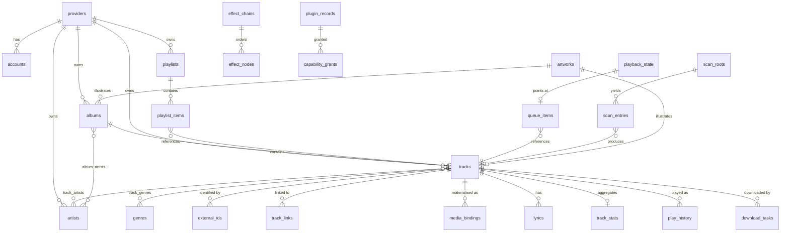

# 07 —— 数据模型

> **本文回答的问题。** 实体如何被标识、现有的每一张表是什么以及为什么存在、哪些运行时类型被刻意*不*持久化、完整的类型化事件表，以及 schema 如何迁移 —— 包括由插件拥有的 schema。

本文所讲的一切都存放在 [`ctx.db`](./04-core-services.md#5-ctxdb--sql) 背后的同一个 SQLite 数据库中，两个平台上完全一致。

---

## 1. 身份标识：URN

```
BBeBee:<providerInstance>:<kind>:<id>
       │                  │       └── provider-local id, opaque, never parsed
       │                  └────────── track | album | artist | playlist | genre
       └───────────────────────────── instance id, not plugin id (06 §2)
```

示例：

```
BBeBee:local:track:9f2c8a1e
BBeBee:navidrome-home:album:41af02
BBeBee:jellyfin-nas:playlist:7c11
```

### 为什么是实例，而不是插件

两台 Navidrome 服务器就是两个命名空间。如果 URN 以插件为键，用户添加第二台服务器的瞬间 id 就会冲突，而移除一台服务器会破坏另一台的行。

### 为什么同一首歌对应多行

Navidrome 服务器上的一个 FLAC 与磁盘上同一录音的一个 MP3 是**两行、两个 URN**，由一行 `track_links` 关联 —— 而不是一行合并记录。

这是本文档中影响最深远的一个建模决策，因此值得把理由说清楚：

- 它们在真正重要的维度上确实不同 —— 比特率、可用性、精确到毫秒的时长、封面图、能否拖动进度（seek）。
- 合并意味着要决定*哪一份*元数据胜出，而任何这类决定都会对某些用户是错的。
- 一次错误的自动匹配之后再"拆开"，远比按需合并困难，而模糊匹配出错的频率足以保证坏匹配必然发生（[06 §7](./06-music-sources.md#7-cross-provider-identity-and-failover)）。
- 一个从应用中移除的提供方，应当恰好带走它自己的那些行。

统一曲库在*展示*时把互相关联的曲目呈现为同一个条目。存储层保持忠实。

### URN 辅助函数

```ts
export interface Urn { instanceId: string; kind: UrnKind; id: string }
export type UrnKind = 'track' | 'album' | 'artist' | 'playlist' | 'genre'

export function parseUrn(urn: string): Urn
export function formatUrn(u: Urn): string
export function instanceOf(urn: string): string
```

`parseUrn` 只按前三个冒号切分，因此提供方本地的 id 中可以出现冒号。

---

## 2. 实体—关系总览



---

## 3. 约定

- SQLite 启用 `journal_mode = WAL`、`foreign_keys = ON`、`synchronous = NORMAL`。
- 时间戳一律是 **epoch 毫秒**，类型为 `INTEGER`。不存日期字符串，也不存时区。
- 布尔值用 `INTEGER` 0/1 表示。
- JSON 列用 `TEXT` 存放 JSON，列名带 `_json` 后缀。
- 每张镜像远端数据的表都带有 `fetched_at`，因此数据是否陈旧始终有据可查。
- 指向目录（catalogue）行的外键是 URN `TEXT`，而不是整数 id —— 提供方给出的 id 一旦离开其实例便毫无意义，以 URN 作联结键让这类错误无从发生。
- 子行无法脱离父行存在的地方使用 `ON DELETE CASCADE`；可以独立存在的地方则做显式清理。

---

## 4. 表

### 4.1 提供方、账号与会话

```sql
CREATE TABLE providers (
  instance_id   TEXT PRIMARY KEY,          -- 'navidrome-home'
  plugin_id     TEXT NOT NULL,             -- '@BBeBee/plugin-source-subsonic'
  display_name  TEXT NOT NULL,
  enabled       INTEGER NOT NULL DEFAULT 1,
  capabilities_json TEXT,                  -- last-known Capabilities (06 §1)
  sort_order    INTEGER NOT NULL DEFAULT 0,
  created_at    INTEGER NOT NULL,
  last_seen_at  INTEGER                    -- last successful ping()
);

CREATE TABLE accounts (
  instance_id    TEXT PRIMARY KEY REFERENCES providers(instance_id) ON DELETE CASCADE,
  remote_user_id TEXT,
  display_name   TEXT,
  status         TEXT NOT NULL,            -- anonymous|authenticated|expired|error
  expires_at     INTEGER,
  updated_at     INTEGER NOT NULL
);

-- Mobile only. Desktop keeps cookies in Chromium's own persisted partition
-- and never writes this table. See 04 §2.1.
CREATE TABLE cookie_jars (
  name        TEXT PRIMARY KEY,            -- the provider instance_id
  ciphertext  BLOB NOT NULL,               -- AES-GCM over the serialised jar
  iv          BLOB NOT NULL,
  key_ref     TEXT NOT NULL,               -- ctx.secrets key holding the AES key
  updated_at  INTEGER NOT NULL
);
```

> **数据库中绝无可读凭据。** Token 与密码都在 `ctx.secrets` 中，位于 `namespace(instanceId)` 之下。Cookie 同样是凭据，但一个真实的会话 jar 会超出 `expo-secure-store` 的 2048 字节值上限，因此移动端对它采用**信封加密**：AES 密钥（很小）放 `ctx.secrets`，密文（不限大小）放 `cookie_jars`。不变式得以保住 —— 密钥与密文绝不同处一库，泄露的数据库文件什么都得不到（[04 §2.1](./04-core-services.md#21-cookie-jars)、[04 §6](./04-core-services.md#6-ctxsecrets--credential-storage)）。
>
> `accounts` 只记录"存在一个会话"以及它何时失效。删除提供方会级联删除 `accounts`；而 `signOut()` 单独负责清空 `cookie_jars` 与 secrets 命名空间，因为它们处在 SQLite 级联之外（[06 §4.1](./06-music-sources.md#41-session-persistence--cookies-survive-the-app)）。

### 4.2 封面图

它被多张表引用，所以放在最前面。

```sql
CREATE TABLE artworks (
  id             TEXT PRIMARY KEY,          -- content hash when local, else derived from source_url
  source_url     TEXT,
  local_uri      TEXT,                      -- populated once cached
  width          INTEGER,
  height         INTEGER,
  blurhash       TEXT,                      -- instant placeholder, no layout shift
  dominant_color TEXT,                      -- '#RRGGBB', drives adaptive player theming
  bytes          INTEGER,
  fetched_at     INTEGER
);
CREATE INDEX idx_artworks_local ON artworks(local_uri) WHERE local_uri IS NOT NULL;
```

`blurhash` 与 `dominant_color` 在缓存落盘时一次性算好，而不是每次渲染都算，因为在 UI 里做这件事会让每次列表滚动都损失一帧。

### 4.3 目录（catalogue）

```sql
CREATE TABLE artists (
  urn          TEXT PRIMARY KEY,
  instance_id  TEXT NOT NULL REFERENCES providers(instance_id) ON DELETE CASCADE,
  remote_id    TEXT NOT NULL,
  name         TEXT NOT NULL,
  sort_name    TEXT,
  artwork_id   TEXT REFERENCES artworks(id),
  bio          TEXT,
  fetched_at   INTEGER NOT NULL,
  raw_json     TEXT
);
CREATE INDEX idx_artists_instance ON artists(instance_id);
CREATE INDEX idx_artists_sort ON artists(sort_name);

CREATE TABLE albums (
  urn           TEXT PRIMARY KEY,
  instance_id   TEXT NOT NULL REFERENCES providers(instance_id) ON DELETE CASCADE,
  remote_id     TEXT NOT NULL,
  title         TEXT NOT NULL,
  sort_title    TEXT,
  album_type    TEXT,                       -- album|single|ep|compilation|live|soundtrack
  release_date  TEXT,                       -- ISO-8601, possibly partial ('1997', '1997-04')
  year          INTEGER,                    -- derived, for cheap sorting and filtering
  track_count   INTEGER,
  disc_count    INTEGER,
  artwork_id    TEXT REFERENCES artworks(id),
  is_various    INTEGER NOT NULL DEFAULT 0,
  fetched_at    INTEGER NOT NULL,
  raw_json      TEXT
);
CREATE INDEX idx_albums_instance ON albums(instance_id);
CREATE INDEX idx_albums_year ON albums(year);

CREATE TABLE tracks (
  urn                TEXT PRIMARY KEY,
  instance_id        TEXT NOT NULL REFERENCES providers(instance_id) ON DELETE CASCADE,
  remote_id          TEXT NOT NULL,
  title              TEXT NOT NULL,
  sort_title         TEXT,
  album_urn          TEXT REFERENCES albums(urn) ON DELETE SET NULL,
  track_no           INTEGER,
  disc_no            INTEGER,
  duration_ms        INTEGER,
  year               INTEGER,
  explicit           INTEGER NOT NULL DEFAULT 0,
  bpm                REAL,
  replay_gain_track  REAL,
  replay_gain_album  REAL,
  peak_track         REAL,
  available          INTEGER NOT NULL DEFAULT 1,   -- cleared on NotFoundError
  qualities_json     TEXT,                          -- StreamQuality[]
  artwork_id         TEXT REFERENCES artworks(id),
  fetched_at         INTEGER NOT NULL,
  raw_json           TEXT
);
CREATE INDEX idx_tracks_album ON tracks(album_urn, disc_no, track_no);
CREATE INDEX idx_tracks_instance ON tracks(instance_id);
CREATE INDEX idx_tracks_title ON tracks(sort_title);

CREATE TABLE track_artists (
  track_urn  TEXT NOT NULL REFERENCES tracks(urn) ON DELETE CASCADE,
  artist_urn TEXT NOT NULL REFERENCES artists(urn) ON DELETE CASCADE,
  role       TEXT NOT NULL DEFAULT 'main',   -- main|featured|composer|remixer|conductor
  ordinal    INTEGER NOT NULL DEFAULT 0,
  PRIMARY KEY (track_urn, artist_urn, role)
);
CREATE INDEX idx_track_artists_artist ON track_artists(artist_urn);

CREATE TABLE album_artists (
  album_urn  TEXT NOT NULL REFERENCES albums(urn) ON DELETE CASCADE,
  artist_urn TEXT NOT NULL REFERENCES artists(urn) ON DELETE CASCADE,
  ordinal    INTEGER NOT NULL DEFAULT 0,
  PRIMARY KEY (album_urn, artist_urn)
);

CREATE TABLE genres (
  id   TEXT PRIMARY KEY,                     -- normalised, lowercase
  name TEXT NOT NULL
);

CREATE TABLE track_genres (
  track_urn TEXT NOT NULL REFERENCES tracks(urn) ON DELETE CASCADE,
  genre_id  TEXT NOT NULL REFERENCES genres(id) ON DELETE CASCADE,
  PRIMARY KEY (track_urn, genre_id)
);
```

`track_artists` 是一张带 `role` 字段的联结表，而不是一个拼接的艺术家字符串，因为把 "Artist feat. Other" 写成自由文本会让客串艺术家无法被浏览 —— 这是音乐类应用中最常见的数据建模错误之一。

**全文搜索**建立在本地目录之上，两个平台上行为完全一致：

```sql
CREATE VIRTUAL TABLE tracks_fts USING fts5(
  title, artist_names, album_title,
  content='', contentless_delete=1,          -- contentless; we manage rows explicitly
  tokenize='unicode61 remove_diacritics 2'
);

-- FTS5 addresses rows by integer rowid; the catalogue is keyed by URN.
CREATE TABLE tracks_fts_map (
  rowid INTEGER PRIMARY KEY AUTOINCREMENT,
  urn   TEXT NOT NULL UNIQUE REFERENCES tracks(urn) ON DELETE CASCADE
);
CREATE INDEX idx_tracks_fts_map_urn ON tracks_fts_map(urn);
```

变音符折叠是有意开启的：用户输入 `bjork` 就必须能找到 `Björk`。

> ⚠️ **`contentless_delete=1` 不是可选项。** 纯 `content=''` 的表会直接拒绝 `DELETE` 和
> `UPDATE`（"cannot DELETE from contentless fts5 table"），于是一条被改名或删除的曲目会永远
> 留在索引里，搜索将返回过期结果，除了整表重建之外无药可救。要求 SQLite ≥ 3.43，
> Node 22.12+ 与 Electron 44 自带的版本都满足。
>
> 即便加了这个开关，**部分列的** `UPDATE` 依然被拒 —— 必须整行重写。请以同一 rowid 上的
> `DELETE` + `INSERT` 来重新索引。

External-content FTS（`content='tracks'`）本可以省掉映射表，但在这里用不了：
`artist_names` 是对 `track_artists` 的聚合，不是 `tracks` 的列。

### 4.4 身份关联

```sql
CREATE TABLE external_ids (
  urn       TEXT NOT NULL,
  namespace TEXT NOT NULL,                   -- isrc|mbid|upc|acoustid|discogs
  value     TEXT NOT NULL,
  PRIMARY KEY (urn, namespace, value)
);
CREATE INDEX idx_external_lookup ON external_ids(namespace, value);

CREATE TABLE track_links (
  urn_a      TEXT NOT NULL,
  urn_b      TEXT NOT NULL,
  confidence REAL NOT NULL,                  -- 0..1, see 06 §7
  method     TEXT NOT NULL,                  -- isrc|mbid|acoustid|fuzzy|manual
  created_at INTEGER NOT NULL,
  PRIMARY KEY (urn_a, urn_b),
  CHECK (urn_a < urn_b)                      -- canonical order: store each pair once
);
CREATE INDEX idx_links_b ON track_links(urn_b);
```

`CHECK (urn_a < urn_b)` 这条约束让这层关系保持对称：无需存两份，也不会冒两个方向不一致的风险。查询时会对两列同时检索。

### 4.5 本地媒体

```sql
CREATE TABLE media_bindings (
  id           TEXT PRIMARY KEY,
  track_urn    TEXT NOT NULL REFERENCES tracks(urn) ON DELETE CASCADE,
  uri          TEXT NOT NULL,                -- ctx.fs Uri, never a raw path
  format       TEXT,                         -- 'flac', 'mp3', 'm4a'
  codec        TEXT,
  bitrate_kbps INTEGER,
  sample_rate  INTEGER,
  channels     INTEGER,
  bit_depth    INTEGER,
  size_bytes   INTEGER,
  checksum     TEXT,                         -- sha256, for integrity checks
  origin       TEXT NOT NULL,                -- download|scan|import
  quality      TEXT,                         -- StreamQuality this satisfies
  verified_at  INTEGER,                      -- last time the file was confirmed present
  created_at   INTEGER NOT NULL
);
CREATE INDEX idx_bindings_track ON media_bindings(track_urn);
CREATE UNIQUE INDEX idx_bindings_uri ON media_bindings(uri);
```

**所谓"已下载"，就是"存在一条绑定"。** 任何地方都没有 `is_downloaded` 这样的标志。`player/before-resolve` 瀑布（waterfall）钩子会询问是否存在绑定，存在就直接播放（[05 §2](./05-audio-playback.md#resolution-pipeline)）。一首曲目可以有多条绑定 —— 比如一份扫描到的本地副本和一份下载来的更高质量副本 —— 由解析器按质量挑选。

之所以需要 `verified_at`，是因为文件会消失：SD 卡被拔出、同步工具删除了文件夹、iOS 清掉了某个文件。文件已丢失的绑定会被直接删除，而不是留到播放那一刻才失败。

```sql
CREATE TABLE scan_roots (
  id            TEXT PRIMARY KEY,
  uri           TEXT NOT NULL UNIQUE,
  recursive     INTEGER NOT NULL DEFAULT 1,
  enabled       INTEGER NOT NULL DEFAULT 1,
  include_globs TEXT,                        -- JSON array
  exclude_globs TEXT,
  last_scan_at  INTEGER,
  last_error    TEXT
);

CREATE TABLE scan_entries (
  uri        TEXT PRIMARY KEY,
  root_id    TEXT NOT NULL REFERENCES scan_roots(id) ON DELETE CASCADE,
  size       INTEGER NOT NULL,
  mtime      INTEGER NOT NULL,
  track_urn  TEXT REFERENCES tracks(urn) ON DELETE SET NULL,
  status     TEXT NOT NULL,                  -- ok|error|skipped|pending
  error      TEXT,
  scanned_at INTEGER NOT NULL
);
CREATE INDEX idx_scan_entries_root ON scan_entries(root_id, status);
```

`(size, mtime)` 这一对就是增量扫描的判据：文件没变就只花一次 `stat`，再无其他开销（[06 §8](./06-music-sources.md#the-local-scanner)）。

### 4.6 播放列表与曲库

```sql
CREATE TABLE playlists (
  urn          TEXT PRIMARY KEY,             -- local ones use instance 'local'
  instance_id  TEXT REFERENCES providers(instance_id) ON DELETE CASCADE,
  remote_id    TEXT,
  name         TEXT NOT NULL,
  description  TEXT,
  artwork_id   TEXT REFERENCES artworks(id),
  owner        TEXT,
  is_public    INTEGER NOT NULL DEFAULT 0,
  is_smart     INTEGER NOT NULL DEFAULT 0,
  smart_query_json TEXT,                     -- rule tree; see below
  track_count  INTEGER,
  duration_ms  INTEGER,
  revision     INTEGER NOT NULL DEFAULT 0,   -- bumped on every local edit
  remote_revision TEXT,                      -- provider's etag/version, for conflict detection
  sync_state   TEXT NOT NULL DEFAULT 'clean',-- clean|dirty|conflict
  created_at   INTEGER NOT NULL,
  updated_at   INTEGER NOT NULL
);

CREATE TABLE playlist_items (
  id           TEXT PRIMARY KEY,
  playlist_urn TEXT NOT NULL REFERENCES playlists(urn) ON DELETE CASCADE,
  position     TEXT NOT NULL,                -- fractional index; see below
  track_urn    TEXT NOT NULL,
  added_at     INTEGER NOT NULL,
  added_by     TEXT,
  note         TEXT
);
CREATE INDEX idx_playlist_items ON playlist_items(playlist_urn, position);
```

**`position` 是小数序索引（LexoRank 风格的字符串），不是整数。** 在 5,000 首曲目的播放列表中移动一首曲目，恰好只写一行 —— 一个严格落在其相邻两项之间的新键 —— 而不是把它之后的所有项重新编号。整数序号会让拖拽重排变成 O(n) 次写，在手机上慢得肉眼可见，还会产生庞大的同步增量。当键的长度超过阈值时，才会执行一次罕见的重平衡（rebalance）。

**智能播放列表**存储的是一棵规则树，在查询时才编译为 SQL：

```ts
export type SmartRule =
  | { op: 'and' | 'or'; rules: SmartRule[] }
  | { op: 'not'; rule: SmartRule }
  | { field: SmartField; cmp: 'eq'|'neq'|'gt'|'lt'|'contains'|'startsWith'|'inLast'; value: string | number }

export type SmartField =
  | 'title' | 'artist' | 'album' | 'genre' | 'year' | 'bpm' | 'durationMs'
  | 'playCount' | 'skipCount' | 'lastPlayedAt' | 'addedAt' | 'rating' | 'loved'
  | 'hasBinding' | 'instanceId' | 'quality'

export interface SmartPlaylist { rules: SmartRule; limit?: number; orderBy?: SmartField; desc?: boolean }
```

编译目标**只允许是参数化 SQL** —— 字段名通过固定的允许清单映射，值始终作为绑定参数。来自插件或导入播放列表的规则树都属于不可信输入。

```sql
CREATE TABLE library_items (
  urn         TEXT PRIMARY KEY,
  kind        TEXT NOT NULL,                 -- track|album|artist|playlist
  instance_id TEXT NOT NULL,
  added_at    INTEGER NOT NULL,
  pinned      INTEGER NOT NULL DEFAULT 0,
  sort_key    TEXT
);
CREATE INDEX idx_library_kind ON library_items(kind, added_at DESC);

CREATE TABLE collections (
  id         TEXT PRIMARY KEY,
  parent_id  TEXT REFERENCES collections(id) ON DELETE CASCADE,
  name       TEXT NOT NULL,
  position   TEXT NOT NULL,
  created_at INTEGER NOT NULL
);

CREATE TABLE collection_items (
  collection_id TEXT NOT NULL REFERENCES collections(id) ON DELETE CASCADE,
  urn           TEXT NOT NULL,
  position      TEXT NOT NULL,
  PRIMARY KEY (collection_id, urn)
);
```

### 4.7 播放

```sql
CREATE TABLE queue_items (
  id                  TEXT PRIMARY KEY,
  position            TEXT NOT NULL,          -- fractional index, as playlists
  track_urn           TEXT NOT NULL,
  source_context_json TEXT,                   -- QueueItem['sourceContext']
  added_by            TEXT NOT NULL,          -- user|autoplay|radio
  added_at            INTEGER NOT NULL
);
CREATE INDEX idx_queue_position ON queue_items(position);

CREATE TABLE playback_state (
  id               INTEGER PRIMARY KEY CHECK (id = 1),   -- singleton
  current_item_id  TEXT REFERENCES queue_items(id) ON DELETE SET NULL,
  position_ms      INTEGER NOT NULL DEFAULT 0,
  repeat_mode      TEXT NOT NULL DEFAULT 'off',
  shuffle          INTEGER NOT NULL DEFAULT 0,
  shuffle_seed     INTEGER,                   -- stable permutation; see 05 §2
  volume           REAL NOT NULL DEFAULT 1.0,
  muted            INTEGER NOT NULL DEFAULT 0,
  output_device_id TEXT,
  device_id        TEXT NOT NULL,             -- which device wrote this; for future sync
  updated_at       INTEGER NOT NULL
);

CREATE TABLE play_history (
  id             TEXT PRIMARY KEY,
  track_urn      TEXT NOT NULL,
  started_at     INTEGER NOT NULL,
  ended_at       INTEGER,
  ms_played      INTEGER NOT NULL DEFAULT 0,
  completed      INTEGER NOT NULL DEFAULT 0,  -- reached the end
  skipped        INTEGER NOT NULL DEFAULT 0,
  source_json    TEXT,
  device_id      TEXT,
  scrobble_state TEXT NOT NULL DEFAULT 'none' -- none|pending|sent|failed
);
CREATE INDEX idx_history_track ON play_history(track_urn, started_at DESC);
CREATE INDEX idx_history_time ON play_history(started_at DESC);
CREATE INDEX idx_history_scrobble ON play_history(scrobble_state) WHERE scrobble_state = 'pending';

CREATE TABLE track_stats (
  urn            TEXT PRIMARY KEY,
  play_count     INTEGER NOT NULL DEFAULT 0,
  skip_count     INTEGER NOT NULL DEFAULT 0,
  last_played_at INTEGER,
  rating         INTEGER,                     -- 0..5, NULL = unrated
  loved          INTEGER NOT NULL DEFAULT 0
);
```

`play_history` 是只追加的事实来源；`track_stats` 是派生缓存，与历史插入在同一事务中更新。两者都保留意味着"最常播放"只需一次带索引的读取，而原始记录仍可用于重新计算 —— `scrobble_state` 还为离线 scrobble 提供了一个持久的发件箱（outbox），即使提交中途进程被杀也能存活。

### 4.8 下载

```sql
CREATE TABLE download_tasks (
  id            TEXT PRIMARY KEY,
  track_urn     TEXT NOT NULL,
  target_uri    TEXT NOT NULL,
  state         TEXT NOT NULL,                -- queued|running|paused|done|failed|canceled
  quality       TEXT,
  bytes_done    INTEGER NOT NULL DEFAULT 0,
  bytes_total   INTEGER,
  etag          TEXT,
  resume_token  TEXT,
  priority      INTEGER NOT NULL DEFAULT 0,
  attempts      INTEGER NOT NULL DEFAULT 0,
  last_error    TEXT,
  binding_id    TEXT REFERENCES media_bindings(id) ON DELETE SET NULL,
  policy_id     TEXT REFERENCES download_policies(id) ON DELETE SET NULL,
  created_at    INTEGER NOT NULL,
  updated_at    INTEGER NOT NULL,
  finished_at   INTEGER
);
CREATE INDEX idx_downloads_state ON download_tasks(state, priority DESC, created_at);
CREATE UNIQUE INDEX idx_downloads_track ON download_tasks(track_urn) WHERE state != 'done';

CREATE TABLE download_policies (
  id             TEXT PRIMARY KEY,
  name           TEXT NOT NULL,
  enabled        INTEGER NOT NULL DEFAULT 1,
  scope_json     TEXT NOT NULL,               -- SmartRule: what to auto-download
  quality        TEXT NOT NULL,
  wifi_only      INTEGER NOT NULL DEFAULT 1,
  max_bytes      INTEGER,
  charging_only  INTEGER NOT NULL DEFAULT 0,
  created_at     INTEGER NOT NULL
);
```

`bytes_done` 与 `resume_token` 在**每个分块**写完后立即落盘，而不是等任务完成 —— 正是这一点让 [02 §4](./02-architecture.md#4-what-background-means) 中的移动端挂起模型变得可存活。启动时，被遗留在 `running` 状态的任务会重置为 `queued`；它们从 `bytes_done` 处用 `Range` 请求续传，并先校验 `etag`，这样远端文件一旦变化就干净地重新开始，而不是拼出一段损坏的数据。

这条部分唯一索引保证每首曲目至多有一个活动任务，又不妨碍日后的重新下载。

### 4.9 DSP 与设置

```sql
CREATE TABLE effect_chains (
  id         TEXT PRIMARY KEY,
  name       TEXT NOT NULL,
  is_active  INTEGER NOT NULL DEFAULT 0,
  scope      TEXT NOT NULL DEFAULT 'global',  -- global|output:<id>|source:<instanceId>
  created_at INTEGER NOT NULL
);
CREATE UNIQUE INDEX idx_chain_active ON effect_chains(scope) WHERE is_active = 1;

CREATE TABLE effect_nodes (
  chain_id    TEXT NOT NULL REFERENCES effect_chains(id) ON DELETE CASCADE,
  effect_id   TEXT NOT NULL,                  -- EffectDefinition.id
  ordinal     INTEGER NOT NULL,
  enabled     INTEGER NOT NULL DEFAULT 1,
  params_json TEXT NOT NULL DEFAULT '{}',
  PRIMARY KEY (chain_id, effect_id)
);
CREATE INDEX idx_effect_order ON effect_nodes(chain_id, ordinal);

CREATE TABLE presets (
  id        TEXT PRIMARY KEY,
  effect_id TEXT NOT NULL,
  name      TEXT NOT NULL,
  params_json TEXT NOT NULL,
  builtin   INTEGER NOT NULL DEFAULT 0
);

CREATE TABLE settings (
  key        TEXT NOT NULL,                   -- 'plugin:@BBeBee/plugin-player/crossfadeMs'
  scope      TEXT NOT NULL DEFAULT 'global',  -- global|device|profile
  value_json TEXT NOT NULL,
  updated_at INTEGER NOT NULL,
  PRIMARY KEY (key, scope)
);
```

设置键按插件 id 做了命名空间隔离，两个插件因此不可能互相冲突；`scope` 则区分应当跟随用户的（`global`）与真正属于单机的（`device`）—— 输出设备的选择就不应同步到手机上。

### 4.10 插件

```sql
CREATE TABLE plugin_records (
  id           TEXT PRIMARY KEY,              -- package id
  version      TEXT NOT NULL,
  source       TEXT NOT NULL,                 -- bundled|local|registry
  enabled      INTEGER NOT NULL DEFAULT 1,
  config_json  TEXT,
  install_uri  TEXT,
  integrity    TEXT,                          -- sha256 of the loaded bundle
  installed_at INTEGER NOT NULL,
  updated_at   INTEGER NOT NULL,
  last_error   TEXT,
  fail_count   INTEGER NOT NULL DEFAULT 0     -- 2 consecutive → quarantine (03 §6.2)
);

CREATE TABLE capability_grants (
  plugin_id  TEXT NOT NULL REFERENCES plugin_records(id) ON DELETE CASCADE,
  capability TEXT NOT NULL,                   -- 'net:host/*.example.com'
  granted_at INTEGER NOT NULL,
  granted_by TEXT NOT NULL DEFAULT 'user',    -- user|bundled
  PRIMARY KEY (plugin_id, capability)
);
```

### 4.11 歌词与缓存

```sql
CREATE TABLE lyrics (
  track_urn   TEXT NOT NULL,
  instance_id TEXT NOT NULL,                  -- who provided them
  format      TEXT NOT NULL,                  -- lrc|ttml|plain
  content     TEXT NOT NULL,
  synced      INTEGER NOT NULL DEFAULT 0,
  offset_ms   INTEGER NOT NULL DEFAULT 0,     -- user-adjustable timing nudge
  language    TEXT,
  is_preferred INTEGER NOT NULL DEFAULT 0,    -- user's pick when several exist
  fetched_at  INTEGER NOT NULL,
  PRIMARY KEY (track_urn, instance_id, language)
);

CREATE TABLE cache_entries (
  key            TEXT PRIMARY KEY,            -- 'artwork:<id>@512', 'http:<sha256>'
  class          TEXT NOT NULL,               -- artwork|http|stream|codec
  uri            TEXT NOT NULL,
  size_bytes     INTEGER NOT NULL,
  last_access_at INTEGER NOT NULL,
  expires_at     INTEGER,
  created_at     INTEGER NOT NULL
);
CREATE INDEX idx_cache_evict ON cache_entries(class, last_access_at);
```

淘汰是**类内 LRU**，每一类有各自的配额，因为不同类的价值差别极大：淘汰一张封面图意味着一次重新抓取和一次可见的闪烁；淘汰一段下载了一半的流，用户就会丢失播放位置。默认值 —— 封面图桌面端 512 MB / 移动端 128 MB、HTTP 64 MB、流缓存 1 GB / 256 MB —— 全部可由用户调整。清理扫描在启动时和每小时各运行一次，文件已丢失的 `cache_entries` 行在同一轮清理中被剪除。

---

## 5. 事件表

在 `@BBeBee/protocol` 中通过扩充 Cordis 的 `Events` 接口一次性声明。派发模式是契约的一部分：它决定了监听器能否阻塞、变换或否决这次派发。

```ts
declare module 'cordis' {
  interface Events {
    // player — emit
    'player/state-changed'(state: TransportState): void
    'player/track-changed'(trackUrn: string | undefined, previous?: string): void
    'player/position'(positionMs: number, durationMs: number): void
    'player/track-completed'(play: PlayRecord): void
    'player/error'(error: SourceError, trackUrn: string): void

    // player — waterfall (interception points)
    'player/before-resolve'(urn: string, prefs: StreamPrefs, next: () => Promise<StreamHandle>): Promise<StreamHandle>
    'player/before-enqueue'(urns: string[], next: (u: string[]) => void): void

    // queue — emit
    'queue/changed'(items: readonly QueueItem[]): void

    // sources
    'source/registered'(instanceId: string): void
    'source/unregistered'(instanceId: string): void
    'source/authenticated'(instanceId: string, status: AuthStatus): void
    'source/auth-expired'(instanceId: string): void
    'source/unreachable'(instanceId: string, error: SourceError): void
    /** Sign-out completed. Listeners purge anything derived from that session. */
    'source/signed-out'(instanceId: string): void

    // http — waterfall
    'http/request'(req: HttpRequest, next: (r: HttpRequest) => Promise<HttpResponse>): Promise<HttpResponse>

    // downloads — emit
    'download/queued'(taskId: string): void
    'download/progress'(taskId: string, done: number, total?: number): void
    'download/completed'(taskId: string, bindingId: string): void
    'download/failed'(taskId: string, error: Error): void

    // library / scanning
    'library/changed'(kind: 'track' | 'album' | 'artist' | 'playlist', urns: string[]): void
    'scan/started'(rootId: string): void
    'scan/progress'(rootId: string, done: number, total?: number): void
    'scan/finished'(rootId: string, summary: { added: number; updated: number; errors: number }): void

    // dsp
    'dsp/build-chain'(segments: EffectSegment[], next: (s: EffectSegment[]) => EffectSegment[]): EffectSegment[]
    'dsp/chain-changed'(chain: DspService['chain']): void

    // plugins
    'plugin/loaded'(id: string): void
    'plugin/failed'(id: string, error: Error): void
    'plugin/unloaded'(id: string): void
  }
}
```

| 事件组 | 模式 | 理由 |
|---|---|---|
| `player/before-resolve`、`player/before-enqueue`、`http/request`、`dsp/build-chain` | **waterfall** | 监听器变换传入的值，并决定链条是否继续。这正是 [02 §5](./02-architecture.md#5-composition-how-features-reach-each-other) 所述的组合机制 |
| `*/changed`、`*/progress`、`player/*`、`plugin/*` | **emit** | 通知。监听器抛出的错误不得影响发出方 |
| `player/track-completed` | **parallel** | scrobble、统计与历史记录全部执行；全部被 await；其中一个失败不阻塞其余 |
| `source/auth-expired` | **serial** | 按序处理 —— 令牌刷新器拥有第一处理权，之后才轮到 UI 出面提示 |
| `source/signed-out` | **parallel** | 每个清除会话派生状态的监听器都被 await，因此登出只有在清理真正完成之后才算结束 |
| `player/position` | **emit**，节流到 1 Hz | 若按 60 Hz 派发，它会毫无收益地霸占事件总线；UI 在两次节拍之间自行插值 |

---

## 6. 迁移

### 核心 schema

只向前（forward-only）、带版本号，位于 `packages/kernel/src/migrations/`。每个迁移是一个编号模块，在事务中应用；已应用的版本会被记录。

```sql
CREATE TABLE schema_migrations (
  namespace   TEXT NOT NULL,                 -- 'core' or 'plugin:<id>'
  version     INTEGER NOT NULL,
  applied_at  INTEGER NOT NULL,
  PRIMARY KEY (namespace, version)
);
```

`down` 迁移只为开发而存在。在生产环境中，用旧版应用打开更新过的数据库会拒绝启动并给出解释性提示，而不是尝试回滚 —— 应用到一半的降级比一次干脆的失败更糟。

> **每个迁移的语句与其记账行在同一个事务中一起提交。** 这是承重结构，不是整洁癖：没有它，
> 一条多语句迁移中途被打断时会留下"表已建好、版本未记录"的状态，下一次启动就会重跑它并撞上
> `table already exists` —— 之后的每一次启动都是如此。数据库将永久无法启动，除了手删文件
> 别无他法。因此 `MigrationDb` 要求实现 `transaction()` 方法；它不是可选项。`BEGIN IMMEDIATE`
> 会先取写锁，而不是在事务中途再升级。

### 插件拥有的 schema

一个只允许核心建表的插件平台算不上真正的平台。插件可以声明自己的：

```ts
await ctx.db.defineSchema('plugin:@BBeBee/plugin-scrobble', [
  {
    version: 1,
    up: `CREATE TABLE {{ns}}_submissions (
           id TEXT PRIMARY KEY,
           play_id TEXT NOT NULL,
           submitted_at INTEGER,
           status TEXT NOT NULL
         )`,
  },
  { version: 2, up: `CREATE INDEX {{ns}}_status ON {{ns}}_submissions(status)` },
])
```

规则：

- `{{ns}}` 展开为由插件 id 派生的、经过清洗的前缀，因此归属在 schema 中一目了然。该变换是
  **有损的** —— `-`、`.`、`_` 都折叠为 `_`，于是 `plugin:a-b` 与 `plugin:a.b` 得到同一个
  `plugin_a_b`。因此唯一性由另一道机制保证：`schema_namespaces` 表记录每个前缀的归属
  命名空间，第二个命名空间来认领同一前缀时会以 `NamespaceCollisionError` 拒绝，
  而不是悄悄共享表。
- 插件只能写自己的表。读取核心目录表需要 `db:read:core`；能力门控会拒绝引用其他命名空间前缀的语句。
- 迁移在 `ctx.plugin()` 内部运行，因此迁移失败只影响该插件。
- **卸载**时提供"删除数据" —— 丢弃该命名空间的表及对应的 `schema_migrations` 行 —— 或"保留数据"，让它们休眠，以便重装后从上次中断处继续。默认保留是更安全的选择。

### 数据保留

`play_history` 会无限制地增长。一次维护过程会保留最近 2 年的完整行（可配置），把更早的行折叠进 `track_stats` 后删除。`cache_entries` 按 §4.11 处理。其余所有数据的大小都以用户曲库的规模为上界。

---

## 7. 运行时类型（从不持久化）

刻意保持瞬态。持久化其中任何一个，只会带来数据陈旧类的 bug，毫无好处。

| 类型 | 定义于 | 为何留在内存中 |
|---|---|---|
| `StreamHandle` | [06 §5](./06-music-sources.md#5-stream-resolution) | 频繁过期；必须重新解析，绝不信任来自存储的副本 |
| `TransportState` | [05 §2](./05-audio-playback.md#2-ctxplayer--transport-and-queue) | 活的；只有持久化的子集落入 `playback_state` |
| `Capabilities` | [06 §1](./06-music-sources.md#capabilities) | 从活的提供方派生。缓存在 `providers.capabilities_json` 中，纯粹是为了在提供方连接之前 UI 也能渲染 |
| `Paged<T>`、游标 | [06 §3](./06-music-sources.md#3-pagination-and-queries) | 不透明且归提供方所有；会话结束便无意义 |
| `EffectSegment` | [05 §3](./05-audio-playback.md#3-ctxdsp--the-effect-chain) | 活的 `AudioNode`。只有 `params_json` 会持久化 |
| `AuthStatus` | [06 §4](./06-music-sources.md#4-authentication) | 登录时重新计算；`accounts` 只保留持久摘要 |

---

## 8. 下一步阅读

[08 —— UI 架构](./08-ui-architecture.md) 讲述这份数据如何抵达两个不同的视图层，而其中任何一个都不占有这份数据。
