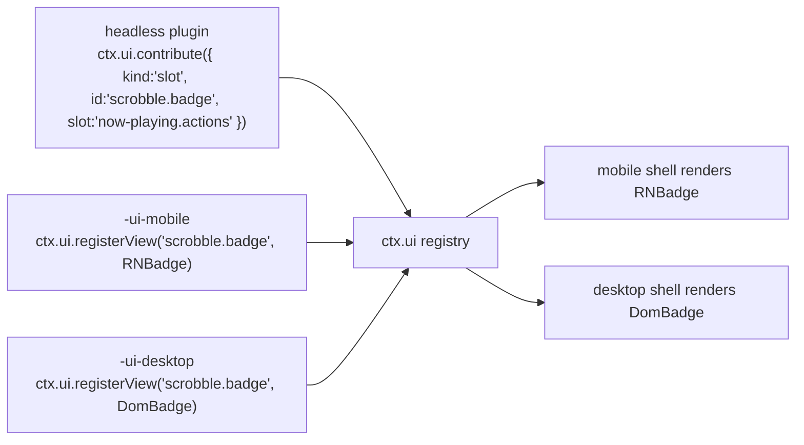

# 08 — UI 架构

> **本篇回答什么。** 一个插件如何向两个不共享任何组件代码的外壳贡献用户界面、视图如何在不拥有数据的前提下找到数据，以及"逻辑"与"视图"的边界画在哪里。

依据 [ADR-2](./01-overview.md#adr-2--the-ui-is-split-react-native-on-mobile-react-dom-on-desktop)，共有两个视图层：移动端用 React Native，桌面端用 React DOM。这一选择的代价完全在本文所述之处支付，而本文要讲的正是如何把这份代价控制在一定范围内。

---

## 1. 三包约定

带 UI 的功能最多拆分为三个包。这种拆分不是官僚流程 —— 正是它让 ADR-2 只复制功能的*像素*，而不是复制*整个*功能。

```
@BBeBee/plugin-scrobble               ← headless: service, state, events, persistence
@BBeBee/plugin-scrobble-ui-mobile     ← React Native views
@BBeBee/plugin-scrobble-ui-desktop    ← React DOM views
```

| 包 | 包含 | 可导入 |
|---|---|---|
| headless | Cordis 插件本体、全部逻辑、全部状态、全部数据库访问、全部网络操作 | 仅 `@BBeBee/protocol` |
| `-ui-mobile` | 组件以及命名这些组件的描述符 | `react`、`react-native`、`@BBeBee/ui-kit-mobile`、headless 包的**类型** |
| `-ui-desktop` | 组件以及命名这些组件的描述符 | `react`、`react-dom`、`@BBeBee/ui-kit-desktop`、headless 包的**类型** |

让这套约定成立的规则：

> **UI 包中不包含任何需要写两遍的逻辑。**

如果你正准备在两个 UI 包里写同一个 `if`，那它就该放进 headless 包 —— 通常作为服务上的一个派生值，或服务暴露的一个选择器（selector）。实践中 UI 包最终都很薄：布局、手势与事件绑定而已。

headless 包可以独立工作。没有 UI 包的插件依然能正常运行；它只是不贡献任何可见的东西 —— 这正是某个目标平台上没有为它编写视图时所发生的事情。

---

## 2. 贡献即描述符

插件从不把组件直接交给外壳。它们注册的是**描述符（descriptor）** —— 指向某个视图的可序列化声明 —— 再由外壳在自己的注册表中解析这个名字。

```ts
export type Contribution =
  | RouteContribution
  | SlotContribution
  | CommandContribution
  | SettingsContribution
  | MenuContribution

export interface RouteContribution {
  kind: 'route'
  id: string                       // 'scrobble.history'
  path: string                     // '/scrobble/history'
  title: string                    // i18n key
  icon?: string                    // name from the shared icon set
  /** Where the shell should offer navigation to it. */
  placement?: ('sidebar' | 'tab-bar' | 'more-menu')[]
  order?: number
}

export interface SlotContribution {
  kind: 'slot'
  id: string
  slot: SlotId                     // a well-known extension point
  order?: number
  /** Evaluated against slot context to decide visibility. Pure, cheap, synchronous. */
  when?: (ctx: SlotContext) => boolean
}

export interface CommandContribution {
  kind: 'command'
  id: string                       // 'player.togglePlay'
  title: string
  icon?: string
  defaultKeybinding?: string       // desktop only; ignored on mobile
  run(args?: unknown): void | Promise<void>
}

export interface SettingsContribution {
  kind: 'settings'
  id: string
  section: 'general' | 'playback' | 'audio' | 'sources' | 'storage' | 'advanced'
  title: string
  /** Rendered automatically from the schema unless a custom view is registered. */
  schema?: StandardSchemaV1
}

export interface MenuContribution {
  kind: 'menu'
  id: string
  /** Desktop application menu bar. Mobile maps these into the more-menu. */
  menu: 'file' | 'edit' | 'view' | 'playback' | 'help'
  title: string
  /** The command run when selected — menus never carry their own logic. */
  command: string
  order?: number
  /** Rendered as a checkbox item, driven by this predicate. */
  checked?: () => boolean
}

export interface UiService {
  contribute(c: Contribution): Disposable
  /** Called by each shell's view package to bind an id to a component. */
  registerView(id: string, component: unknown): Disposable

  readonly routes: readonly RouteContribution[]
  slotsFor(slot: SlotId): readonly SlotContribution[]
  readonly commands: readonly CommandContribution[]
  runCommand(id: string, args?: unknown): Promise<void>
  viewFor(id: string): unknown | undefined
}
```

`registerView` 有意接受 `unknown`：`@BBeBee/protocol` 不得依赖 `react`、`react-native` 或 `react-dom`，因为导入它的是运行在完全没有 React 的环境中的 headless 插件。类型转换在外壳边界处完成 —— 每个外壳只有一处 `as ComponentType`，而不是让 React 依赖渗透进契约层。

### 槽位（slot）

众所周知的扩展点，在 `@BBeBee/protocol` 中逐一枚举，从而保证两个外壳实现的是同一套：

```ts
export type SlotId =
  | 'now-playing.actions'        // buttons beside the transport
  | 'now-playing.panel'          // tabs in the expanded player (lyrics, queue, related)
  | 'track.context-menu'         // right-click / long-press on a track
  | 'album.context-menu'
  | 'library.sidebar'            // extra library sections
  | 'search.results-section'     // an extra results group
  | 'settings.sources'
  | 'source.browse'
  | 'status-bar'                 // desktop only; ignored on mobile
```

槽位渲染是插件的 UI 真正现身的地方：

```tsx
// @BBeBee/ui-kit-desktop
export function Slot({ id, context }: { id: SlotId; context: SlotContext }) {
  const items = useSlot(id, context)
  return <>{items.map((it) => {
    const View = ui.viewFor(it.id) as ComponentType<{ context: SlotContext }> | undefined
    return View ? <View key={it.id} context={context} /> : null
  })}</>
}
```

---

## 3. 从描述符解析到视图

描述符给出一个视图 id。外壳在注册表中查找它，注册表的内容来自为*当前*目标平台加载的那份 UI 包。



**视图缺失是常态，而非错误。** 插件可以只提供桌面视图而无移动端视图（比如多列日志检查器），反之亦然（比如手势驱动的迷你播放器）。贡献本身照常注册，只是槽位为它渲染出空。这是 ADR-2 直接且持续的代价，而把它当作一等状态而非崩溃，正是让这套架构能够存续的关键。

值得强制执行的三条推论：

- 描述符必须携带足够的信息，以便在没有对应视图时也能被*列出* —— 标题与图标。某个目标平台没有对应视图的设置页仍然可以出现，以禁用状态显示"在此平台不可用"，而不是留下一个用户无法理解的空洞。
- `when` 谓词在外壳中运行，必须是同步且廉价的；它们在渲染期间执行。
- 没有视图的命令依然完全可用 —— 它出现在桌面端的命令面板和移动端的更多菜单中。命令是让一个功能在两个平台上都可触达的最廉价方式。

---

## 4. 把服务绑定到 React

来自 [02 §6](./02-architecture.md#6-state-ownership) 的规则：**React 不持有任何领域状态。** 状态由服务拥有，组件负责订阅。

`ui-kit-mobile` 与 `ui-kit-desktop` 都构建在 `@BBeBee/ui-core` 中同一个共享的、与框架无关的 hook 层之上，它只依赖 `react` 和 `@BBeBee/protocol`：

```ts
// @BBeBee/ui-core
export function useService<K extends ServiceKey>(key: K): Context[K] | undefined

/**
 * Subscribe to service state via useSyncExternalStore, so React 18 concurrent
 * rendering cannot tear. `select` must be referentially stable across calls
 * for unchanged inputs — return primitives or memoised objects.
 */
export function useServiceState<K extends ServiceKey, T>(
  key: K,
  events: (keyof Events)[],
  select: (svc: Context[K]) => T,
): T
```

功能专属的 hook 是薄封装，它们放在 **headless** 包中，从而被两个外壳共享：

```ts
// @BBeBee/plugin-player/hooks — shared by both UI packages
export const useTransport = () =>
  useServiceState('player', ['player/state-changed'], (p) => p.state)

export const useQueue = () =>
  useServiceState('player', ['queue/changed'], (p) => p.queue)

/** Position updates at 1 Hz; the UI interpolates with rAF between ticks. */
export const usePosition = () =>
  useServiceState('player', ['player/position'], (p) => p.state.positionMs)
```

这正是三包拆分体现价值的地方。hook —— 那些真正包含"哪个事件使哪份状态失效"这一逻辑的部分 —— 只写一遍。需要写两遍的只有 JSX。

### 渲染规则

- **领域操作不用 `useEffect`。** 任何抓取、写入或修改领域状态的 effect，都应属于组件所调用的某个服务方法。
- **乐观更新放在服务中**，而不是组件里，这样两个外壳在写入失败并回滚时的行为完全一致。
- **列表必须虚拟化。** 移动端用 `FlashList`，桌面端用 `@tanstack/react-virtual`。曲库可能容纳 10 万首曲目；在哪个平台上直接渲染这么多都撑不住。
- **`player/position` 用插值，绝不轮询。** 该事件以 1 Hz 触发（[07 §5](./07-data-model.md#5-the-event-map)）；进度条在两次事件之间用 `requestAnimationFrame` 做动画，并在每个事件到来时重新对齐。
- **封面图先渲染 `blurhash`**，再加载图片（[07 §4.2](./07-data-model.md#42-artwork)）。没有布局跳动，滚动时也没有灰色闪烁。

---

## 5. 导航

| | 移动端 | 桌面端 |
|---|---|---|
| 路由器 | Expo Router（基于文件） | `ui-kit-desktop` 内一个小的内存路由器 |
| 主界面骨架 | 底部标签栏 + 堆栈 | 常驻侧边栏 + 内容面板 |
| 贡献的路由 | 注册为动态路由；`placement` 决定进标签栏还是更多菜单 | 侧边栏条目按 `order` 排序 |
| 返回 | 系统手势 / 硬件按键 | 应用内历史记录，外加 `Cmd/Ctrl+[` |
| 深链接 | 经 `expo-linking` 使用 `BBeBee://` scheme | 同一 scheme 由 `main` 向操作系统注册 |

两个外壳实现同一个供命令使用的 `navigate(routeId, params)`，因此命令在任一目标平台上都能工作，而无需知道底层是哪套路由器。

---

## 6. 设计令牌

令牌是**数据，不是组件** —— 这是让两个视图层看起来像一个产品的唯一办法。

```ts
// @BBeBee/ui-tokens — plain values, no framework
export const tokens = {
  color: {
    bg: { base: '#0B0B0F', raised: '#15151C', overlay: '#1E1E28' },
    text: { primary: '#F5F5F7', secondary: '#A0A0AE', disabled: '#5A5A68' },
    accent: { base: '#7C5CFF', hover: '#8F73FF', muted: '#2A2340' },
    state: { error: '#FF5C5C', warn: '#FFB020', ok: '#3ECF8E' },
  },
  space: [0, 4, 8, 12, 16, 24, 32, 48, 64],
  radius: { sm: 4, md: 8, lg: 16, pill: 999 },
  font: {
    family: { ui: 'Inter', mono: 'JetBrains Mono' },
    size: { xs: 11, sm: 13, md: 15, lg: 20, xl: 28, display: 40 },
    weight: { regular: '400', medium: '500', bold: '700' },
  },
  duration: { fast: 120, normal: 200, slow: 320 },
} as const
```

`ui-kit-mobile` 把它们作为 `StyleSheet` 值消费；`ui-kit-desktop` 把它们输出为 CSS 自定义属性。两者从同一来源派生浅色与深色配色，播放器界面也都能基于 `artworks.dominant_color` 进行着色。

**组件对等是一份契约。** 两个组件库导出同名且同 props 的组件 —— `Button`、`IconButton`、`TrackRow`、`Slider`、`Sheet`/`Dialog`、`List`、`EmptyState`、`Toast`。同时编写两个视图包的插件作者应该是在"誊写"，而不是"重新设计"。CI 中有一个对等性测试，会对比两个组件库导出的名称与 props 类型，出现分歧即失败 —— 因为没有它，两个组件库会悄然漂移，而每个插件作者都要为此买单。

---

## 7. 外壳的职责

外壳很薄。下表中的每一项都是真正的平台专属能力，除了外壳无处安放。

| | `apps/mobile` | `apps/desktop/renderer` |
|---|---|---|
| 启动 | 创建 Context，注册 `core-*-expo`，在 `ctx.inject(['ui'], …)` 内挂载 | 相同流程，使用 `core-*-node` |
| 界面骨架 | 标签栏、堆栈头、安全区内边距 | 侧边栏、标题栏、窗口控制、可调大小的面板 |
| 播放器界面 | 标签栏上方的迷你播放器；可展开为全屏 | 常驻底部栏；可选的独立迷你播放器窗口 |
| 平台专属 | 手势、触觉反馈、下拉刷新 | 右键菜单、拖放、键盘快捷键、托盘、命令面板 |
| 不具备 | 无键盘快捷键、无托盘 | 无手势、无触觉反馈 |

桌面端的**命令面板**（`Cmd/Ctrl+K`）值得单独一提：它直接渲染 `ctx.ui.commands`，因此每个插件命令无需插件作者做任何 UI 工作即可触达。这是整个项目杠杆比最高的外壳代码。

---

## 8. 无障碍

这不是"二期再说"的事，因为事后改造远比一开始就做昂贵。

- 每个可交互元素都有可访问名称 —— 移动端用 `accessibilityLabel`，桌面端用 `aria-label` —— 通过共享组件 props 提供，因此只写一遍。
- 桌面端完全支持键盘导航：可见的焦点环、符合逻辑的 tab 顺序、`Escape` 关闭所有浮层、方向键在列表内移动。
- 移动端遵循系统文字大小设置；令牌的尺寸刻度是相对的，布局在 200% 缩放下经过测试。
- 对比度在两套配色下都达到 WCAG AA —— 由对等性测试检查，而不是靠肉眼。
- `prefers-reduced-motion`（桌面端）与"减弱动态效果"（移动端）会禁用交叉淡入淡出动画与封面视差效果。
- 可视化频谱与任何闪烁元素都遵守减弱动态效果设置，且绝不作为状态的唯一指示。

---

## 9. 接下来去哪

[09 —— 项目结构](./09-project-structure.md) 会把上述一切落成目录树、构建流水线与一组强制执行的规则。
