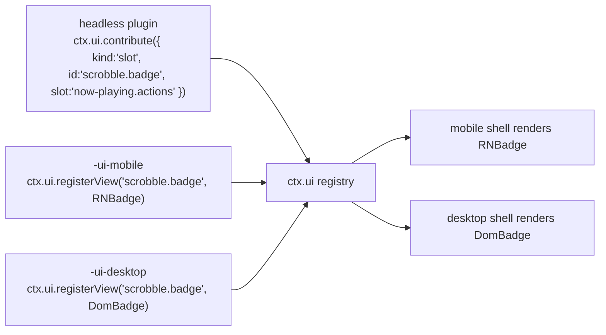

# 08 — UI 架构

> **本篇回答什么。** [02 §1](./02-architecture.md#1-分层模型) 中的 **Layer 4**：一个插件如何向两个不共享任何组件代码的外壳贡献用户界面、视图如何在不拥有数据的前提下找到数据，以及"逻辑"与"视图"的边界画在哪里。

依据 [ADR-2](./01-overview.md#adr-2--ui-拆分移动端-react-native桌面端-react-dom)，共有两个视图层：移动端用 React Native，桌面端用 React DOM。这一选择的代价完全在本文所述之处支付，而本文要讲的正是如何把这份代价控制在一定范围内。

---

## 1. 三包约定

带 UI 的功能最多拆分为三个包。这种拆分不是官僚流程 —— 正是它让 ADR-2 只复制功能的*像素*，而不是复制*整个*功能。

```
@BBeBee/plugin-scrobble               ← headless: service, state, events, persistence
@BBeBee/plugin-scrobble-ui-mobile     ← React Native views
@BBeBee/plugin-scrobble-ui-desktop    ← React DOM views
```

| 包 | 层 | 包含 | 可导入 |
|---|---|---|---|
| headless | 3 | Cordis 插件本体、全部逻辑、全部状态、全部数据库访问、全部网络操作 | 仅 `@BBeBee/protocol` |
| `-ui-mobile` | 4 | 组件以及命名这些组件的描述符 | `react`、`react-native`、`@BBeBee/ui-kit-mobile`、headless 包的**类型** |
| `-ui-desktop` | 4 | 组件以及命名这些组件的描述符 | `react`、`react-dom`、`@BBeBee/ui-kit-desktop`、headless 包的**类型** |

这一拆分正是 Layer 4/Layer 5 边界的具体化。Layer 5 是业务*编排*所在之处 —— 先点这个按钮，再弹那个确认框，然后跳这处导航 —— 而它所编排的业务*规则*则留在 Layer 4，在那里无需渲染器即可测试，并能原封不动地被另一个目标的视图复用。

让这套约定成立的规则：

> **UI 包中不包含任何需要写两遍的逻辑。**

如果你正准备在两个 UI 包里写同一个 `if`，那它就该放进 headless 包 —— 通常作为服务上的一个派生值，或服务暴露的一个选择器（selector）。实践中 UI 包最终都很薄：布局、手势与事件绑定而已。

headless 包可以独立工作。没有 UI 包的插件依然能正常运行；它只是不贡献任何可见的东西 —— 这正是某个目标平台上没有为它编写视图时所发生的事情。

---

## 2. 贡献即描述符

插件从不把组件直接交给外壳。它们注册的是**描述符（descriptor）** —— 指向某个视图的可序列化声明 —— 再由外壳在自己的注册表中解析这个名字。

```ts
export type Contribution =
  | RouteContribution
  | SlotContribution
  | CommandContribution
  | SettingsContribution
  | MenuContribution

export interface RouteContribution {
  kind: 'route'
  id: string                       // 'scrobble.history'
  path: string                     // '/scrobble/history'
  title: string                    // i18n key
  icon?: string                    // name from the shared icon set
  /** Where the shell should offer navigation to it. */
  placement?: ('sidebar' | 'tab-bar' | 'more-menu')[]
  order?: number
}

export interface SlotContribution {
  kind: 'slot'
  id: string
  slot: SlotId                     // a well-known extension point
  order?: number
  /** Evaluated against slot context to decide visibility. Pure, cheap, synchronous. */
  when?: (ctx: SlotContext) => boolean
}

export interface CommandContribution {
  kind: 'command'
  id: string                       // 'player.togglePlay'
  title: string
  icon?: string
  defaultKeybinding?: string       // desktop only; ignored on mobile
  run(args?: unknown): void | Promise<void>
}

export interface SettingsContribution {
  kind: 'settings'
  id: string
  section: 'general' | 'playback' | 'audio' | 'sources' | 'storage' | 'advanced'
  title: string
  /** Rendered automatically from the schema unless a custom view is registered. */
  schema?: StandardSchemaV1
}

export interface MenuContribution {
  kind: 'menu'
  id: string
  /** Desktop application menu bar. Mobile maps these into the more-menu. */
  menu: 'file' | 'edit' | 'view' | 'playback' | 'help'
  title: string
  /** The command run when selected — menus never carry their own logic. */
  command: string
  order?: number
  /** Rendered as a checkbox item, driven by this predicate. */
  checked?: () => boolean
}

export interface UiService {
  contribute(c: Contribution): Disposable
  /** Called by each shell's view package to bind an id to a component. */
  registerView(id: string, component: unknown): Disposable

  readonly routes: readonly RouteContribution[]
  slotsFor(slot: SlotId): readonly SlotContribution[]
  readonly commands: readonly CommandContribution[]
  runCommand(id: string, args?: unknown): Promise<void>
  viewFor(id: string): unknown | undefined
}
```

`registerView` 有意接受 `unknown`：`@BBeBee/protocol` 不得依赖 `react`、`react-native` 或 `react-dom`，因为导入它的是运行在完全没有 React 的环境中的 headless 插件。类型转换在外壳边界处完成 —— 每个外壳只有一处 `as ComponentType`，而不是让 React 依赖渗透进契约层。

### 槽位（slot）

众所周知的扩展点，在 `@BBeBee/protocol` 中逐一枚举，从而保证两个外壳实现的是同一套：

```ts
export type SlotId =
  | 'now-playing.actions'        // buttons beside the transport
  | 'now-playing.panel'          // tabs in the expanded player (lyrics, queue, related)
  | 'track.context-menu'         // right-click / long-press on a track
  | 'album.context-menu'
  | 'library.sidebar'            // extra library sections
  | 'search.results-section'     // an extra results group
  | 'settings.sources'            // the source list: import, groups, enable, reorder
  | 'source.browse'               // a source's explore tree
  | 'source.test'                // one source, exercised feature by feature (06 §10)
  | 'status-bar'                 // desktop only; ignored on mobile
```

槽位渲染是插件的 UI 真正现身的地方：

```tsx
// @BBeBee/ui-kit-desktop
export function Slot({ id, context }: { id: SlotId; context: SlotContext }) {
  const items = useSlot(id, context)
  return <>{items.map((it) => {
    const View = ui.viewFor(it.id) as ComponentType<{ context: SlotContext }> | undefined
    return View ? <View key={it.id} context={context} /> : null
  })}</>
}
```

---

## 3. 从描述符解析到视图

描述符给出一个视图 id。外壳在注册表中查找它，注册表的内容来自为*当前*目标平台加载的那份 UI 包。



**视图缺失是常态，而非错误。** 插件可以只提供桌面视图而无移动端视图（比如多列日志检查器），反之亦然（比如手势驱动的迷你播放器）。贡献本身照常注册，只是槽位为它渲染出空。这是 ADR-2 直接且持续的代价，而把它当作一等状态而非崩溃，正是让这套架构能够存续的关键。

值得强制执行的三条推论：

- 描述符必须携带足够的信息，以便在没有对应视图时也能被*列出* —— 标题与图标。某个目标平台没有对应视图的设置页仍然可以出现，以禁用状态显示"在此平台不可用"，而不是留下一个用户无法理解的空洞。
- `when` 谓词在外壳中运行，必须是同步且廉价的；它们在渲染期间执行。
- 没有视图的命令依然完全可用 —— 它出现在桌面端的命令面板和移动端的更多菜单中。命令是让一个功能在两个平台上都可触达的最廉价方式。

---

## 4. 把服务绑定到 React

来自 [02 §6](./02-architecture.md#6-状态归属) 的规则：**React 不持有任何领域状态。** 状态由服务拥有，组件负责订阅。

`ui-kit-mobile` 与 `ui-kit-desktop` 都构建在 `@BBeBee/ui-core` 中同一个共享的、与框架无关的 hook 层之上，它只依赖 `react` 和 `@BBeBee/protocol`：

```ts
// @BBeBee/ui-core
export function useService<K extends ServiceKey>(key: K): Context[K] | undefined

/**
 * Subscribe to service state via useSyncExternalStore, so React 18 concurrent
 * rendering cannot tear. `select` must be referentially stable across calls
 * for unchanged inputs — return primitives or memoised objects.
 */
export function useServiceState<K extends ServiceKey, T>(
  key: K,
  events: (keyof Events)[],
  select: (svc: Context[K]) => T,
): T
```

功能专属的 hook 是薄封装，它们放在 **headless** 包中，从而被两个外壳共享：

```ts
// @BBeBee/plugin-player/hooks — shared by both UI packages
export const useTransport = () =>
  useServiceState('player', ['player/state-changed'], (p) => p.state)

export const useQueue = () =>
  useServiceState('player', ['queue/changed'], (p) => p.queue)

/** Position updates at 1 Hz; the UI interpolates with rAF between ticks. */
export const usePosition = () =>
  useServiceState('player', ['player/position'], (p) => p.state.positionMs)
```

这正是三包拆分体现价值的地方。hook —— 那些真正包含"哪个事件使哪份状态失效"这一逻辑的部分 —— 只写一遍。需要写两遍的只有 JSX。

### 渲染规则

- **领域操作不用 `useEffect`。** 任何抓取、写入或修改领域状态的 effect，都应属于组件所调用的某个服务方法。
- **乐观更新放在服务中**，而不是组件里，这样两个外壳在写入失败并回滚时的行为完全一致。
- **列表必须虚拟化。** 移动端用 `FlashList`，桌面端用 `@tanstack/react-virtual`。曲库可能容纳 10 万首曲目；在哪个平台上直接渲染这么多都撑不住。
- **`player/position` 用插值，绝不轮询。** 该事件以 1 Hz 触发（[07 §5](./07-data-model.md#5-事件表)）；进度条在两次事件之间用 `requestAnimationFrame` 做动画，并在每个事件到来时重新对齐。
- **封面图先渲染 `blurhash`**，再加载图片（[07 §4.2](./07-data-model.md#42-封面图)）。没有布局跳动，滚动时也没有灰色闪烁。

---

### 音源相关界面

有四个界面承载了整个源字符串模型，值得逐一点名，因为它们是这套 UI 中在传统播放器里没有对应物的部分。这四个界面全部由 `plugin-source-runtime-ui-{mobile,desktop}` 贡献，而且全部是普通描述符 —— 没有任何特殊待遇。

| 界面 | 做什么 | 拆分上的说明 |
|---|---|---|
| **源列表** | 启用、禁用、重排、分组，并查看每个源的健康徽标 | 普通列表；对等性是免费的 |
| **导入审核** | 在任何内容被写入之前，展示粘贴进来的源字符串里有什么 —— 新增 / 更新 / 拒绝，以及主机白名单（[06 §9](./06-music-sources.md#9-导入更新与分享)） | 唯一绝不可跳过的界面，因此它在两端都是模态路由，而不是槽位 |
| **规则追踪器** | 运行一步，并展示每条规则的输入、输出与耗时（[06 §10](./06-music-sources.md#10-诊断一个坏掉的源)） | 一份可以长距离滚动的日志，每一行都带一条可编辑的规则 —— 应用中最接近开发者工具的东西，也是用户能够自己修好一个源的原因 |

让这件事保持低成本的正是 [§1](#1-三包约定) 的那条规则：解析、校验、diff、追踪与脱敏全部位于 headless 包。视图包要做的只是展示一个列表和一个文本框。

---

## 5. 导航

| | 移动端 | 桌面端 |
|---|---|---|
| 路由器 | Expo Router（基于文件） | `ui-kit-desktop` 内一个小的内存路由器 |
| 主界面骨架 | 底部标签栏 + 堆栈 | 常驻侧边栏 + 内容面板 |
| 贡献的路由 | 注册为动态路由；`placement` 决定进标签栏还是更多菜单 | 侧边栏条目按 `order` 排序 |
| 返回 | 系统手势 / 硬件按键 | 应用内历史记录，外加 `Cmd/Ctrl+[` |
| 深链接 | 经 `expo-linking` 使用 `BBeBee://` scheme | 同一 scheme 由 `main` 向操作系统注册 |

两个外壳实现同一个供命令使用的 `navigate(routeId, params)`，因此命令在任一目标平台上都能工作，而无需知道底层是哪套路由器。

---

## 6. 视觉设计语言与设计令牌

视觉设计是一种**沉浸式、深色优先的流媒体美学**，旨在把封面图、高密度的目录列表与高活力的播放状态置于用户体验的中心。浅色主题作为一种可访问的反转配色存在，但深色是塑造整个产品的表面层次与交互模型的主模式。

令牌是**数据，不是组件** —— 这是让两个视图层在不共享组件代码的前提下看起来像一个产品的唯一办法。

```ts
// @BBeBee/ui-tokens — plain values, no framework
export interface Palette {
  bg: { sunken: string; base: string; raised: string; overlay: string }
  text: { primary: string; secondary: string; disabled: string }
  accent: { base: string; hover: string; muted: string; on: string }
  state: { error: string; warn: string; ok: string }
  border: { subtle: string; strong: string }
}

export const dark: Palette = {
  bg: { sunken: '#000000', base: '#121212', raised: '#181818', overlay: '#282828' },
  text: { primary: '#FFFFFF', secondary: '#B3B3B3', disabled: '#6A6A6A' },
  accent: { base: '#1DB954', hover: '#1ED760', muted: '#1B3D2B', on: '#000000' },
  state: { error: '#F15E6C', warn: '#FFA42B', ok: '#1ED760' },
  border: { subtle: '#282828', strong: '#7A7A7A' },
}

export const light: Palette = {
  bg: { sunken: '#F1F1F1', base: '#FFFFFF', raised: '#F6F6F6', overlay: '#EDEDED' },
  text: { primary: '#000000', secondary: '#5E5E5E', disabled: '#8C8C8C' },
  accent: { base: '#12833C', hover: '#0D6E36', muted: '#D7F2E2', on: '#FFFFFF' },
  state: { error: '#C1291F', warn: '#8A5A00', ok: '#0E7A3D' },
  border: { subtle: '#E5E5E5', strong: '#767676' },
}

export const tokens = {
  space: [0, 4, 8, 12, 16, 24, 32, 48, 64] as const,
  radius: { sm: 4, md: 8, lg: 16, pill: 999 } as const,
  font: {
    family: {
      ui: '"Circular Std", Circular, Montserrat, Figtree, system-ui, -apple-system, "Segoe UI", Roboto, sans-serif',
      mono: '"JetBrains Mono", ui-monospace, SFMono-Regular, Menlo, monospace',
    },
    size: { xs: 11, sm: 13, md: 15, lg: 20, xl: 28, display: 40 } as const,
    weight: { regular: '400', medium: '500', bold: '700', heavy: '900' } as const,
    lineHeight: { tight: 1.2, normal: 1.45, loose: 1.7 } as const,
  },
  duration: { fast: 120, normal: 200, slow: 320 } as const,
  size: { touchTarget: 44, icon: 20, iconLarge: 28, row: 56, artworkThumb: 48 } as const,
} as const
```

`ui-kit-mobile` 把它们作为 `StyleSheet` 值消费；`ui-kit-desktop` 把它们输出为 CSS 自定义属性（`cssVariables(scheme)`）。

### 6.1 表面层级与无边框的层级感

深度通过**近黑色表面的微妙亮度阶梯**来传达，而不是厚重的边框或投影。硬朗的轮廓在高密度目录视图中制造视觉杂讯；微妙的对比阶梯让表面彼此区分，同时让封面图更突出。

| 层 | 取值（深色） | 角色与用法 |
|---|---|---|
| `bg.sunken` | `#000000` | 外部底盘与常驻导轨：桌面端窗口骨架、侧边栏/导航栏，以及底部传输播放条。后退感，让内容凸显。 |
| `bg.base` | `#121212` | 主滚动画布：播放列表、专辑视图、搜索结果、曲库网格。 |
| `bg.raised` | `#181818` | 抬升的媒体卡片（专辑/播放列表磁贴）与分区面板。 |
| `bg.overlay` | `#282828` | 悬停的行/卡片、下拉菜单、右键菜单、工具提示，以及模态面板。 |
| `border.subtle` | `#282828` | 主要面板之间的发丝级分隔线（如侧边栏边框、底栏边框）。 |
| `border.strong` | `#7A7A7A` | 聚焦的可交互边界与可访问轮廓（满足 WCAG 1.4.11 的 3:1）。 |

### 6.2 标志性强调色与高对比规则

- **标志性强调色是鲜活的绿色（`#1DB954`，悬停 `#1ED760`）。** 它传达动作、活力与正在播放：播放按钮、活动行标题、进度条填充，以及激活的开关。
- **`accent.on` 是 `#000000`（黑色）。** 在饱和的 `#1DB954` 上放浅色文字无法满足 WCAG AA（仅约 2.6:1）。绿底上的黑色文字与图标对比度超过 8:1。主圆形播放按钮与实心操作药丸始终把黑色字形放在绿色填充之上。
- **浅色模式把色相调整为 `#12833C`。** 饱和的 `#1DB954` 放在白底上无法通过对比度测试；更深的森林绿在保持品牌识别度的同时保持可读。
- **文字层级**：纯白（`#FFFFFF`，`text.primary`）承载标题与主要可交互标签。柔和的银灰（`#B3B3B3`，`text.secondary`）承载艺术家、专辑标题、曲目时长、列标题与次要计数。非活动控件使用低调的 `#6A6A6A`。

### 6.3 字体与字号刻度

字体栈优先选用几何怪诞体（geometric grotesque）字形：
`"Circular Std", Circular, Montserrat, Figtree, system-ui, -apple-system, "Segoe UI", Roboto, sans-serif`。
字体从操作系统/系统本地解析，而不是下载，避免外来网络字体的授权问题与 CSP 网络开销。

刻度遵循**"字重随字号"**：
- **Display（`40px`，字重 `900` heavy，行高 `1.2`）**：播放列表与专辑详情页上的巨型主标题。
- **XL（`28px`，字重 `900` heavy，行高 `1.2`）**：主要分区标题（"为你推荐"、"最近播放"）。
- **LG（`20px`，字重 `700` bold）**：分区标题、货架（shelf）标题、对话框标题。
- **MD（`15px`，标题用 `700` bold，正文用 `400` regular）**：曲目标题、主菜单标签。
- **SM（`13px`，字重 `400` regular）**：艺术家名、专辑副标题链接、时长时间戳。
- **XS（`11px`，字重 `500` medium / `700` bold，全大写）**：列标签（`TITLE`、`ALBUM`、`DATE ADDED`）、分类标签与时长徽标。

### 6.4 组件可供性与微交互

- **药丸按钮（`radius.pill: 999`）**：可交互控件（主操作按钮、分类筛选 chip、标签开关）均为药丸形。在面板皆为矩形的无边框深色 UI 中，全圆角形状立即传达出"可按压"。
- **悬停微缩放**：主药丸按钮在指针下轻微放大（`transform: scale(1.04)`，历时 `120ms`），而不仅是变色，在近黑背景上提供即时的、可触知的物理反馈。
- **媒体卡片与悬浮播放揭晓**：矩形卡片（`radius.md: 8px`，`bg.raised: #181818`）顶部是方形封面（`radius.sm: 4px`），随后是粗体标题与艺术家副标题。指针悬停时：
  1. 卡片背景从 `#181818` 提亮到 `#282828`。
  2. 一枚鲜绿的圆形播放按钮（直径 `48px`，`#1DB954` 填充，`#000000` 播放字形）从封面右下角缓缓升起，带轻微的 translateY 与透明度过渡（`120ms`）以及淡淡的投影。
  3. 点击播放按钮立即开始播放该容器的内容，无需跳转导航。
- **曲目行（`TrackRow`，高 `56px`）**：
  - 显示序号、封面缩略图（`48px` 方形，`radius.sm: 4px`）、`#FFFFFF` 的曲目标题、`#B3B3B3` 的艺术家、专辑名与时长。
  - 悬停时，该行被照亮（`#282828`），曲目序号被替换为播放图标（`▶`），快捷操作（经由 `onToggleLoved` 的红心/喜爱切换按钮 `♥`/`♡`、右键菜单 `···`）变为可见。
  - 正在播放时，曲目标题、曲目序号与均衡器图标以标志性绿色（`#1DB954`）点亮。
- **进度条与滑块（`Slider`）**：
  - 水平条（高 `4px`），背景轨道为低调的灰色。
  - 已播放进度在静态展示时呈 `#FFFFFF`，在指针悬停或拖动时以标志性绿色（`#1DB954`）点亮，并伴随一个圆形滑块把手。

### 6.5 动态主视觉渐变与封面呈现

- **方形封面（`radius.sm: 4px`）**：曲目、专辑与播放列表使用方形比例。艺术家使用圆形头像（`radius.pill`）。
- **零布局跳动加载**：封面容器在全分辨率图片懒加载期间立即以 `blurhash` 字符串作为背景展示，并以 `artworks.dominant_color` 兜底。
- **动态氛围主视觉横幅**：播放列表与专辑视图的头部区域从封面提取 `artworks.dominant_color`，生成一道浓郁的水平渐变，从顶部横幅向外辐射，并平滑地向下渗入 `#121212` 基底画布。

### 6.6 外壳结构与布局范式

- **桌面端外壳**：
  - **左侧导航栏 / 侧边栏（下沉的 `#000000`）**：常驻导航快捷入口（首页、搜索、你的曲库）与可滚动的播放列表列表。
  - **居中的主内容卡片（`#121212`，圆角）**：可滚动画布，承载动态渐变主视觉头部、操作栏（大号绿色圆形播放按钮、红心/收藏、`···`），以及虚拟化的曲目列表或媒体卡片网格。曲库视图通过顶层范围（`All`、`Local`、`Favorites`）与内容视图（`Tracks`、`Albums`）组织条目。
  - **常驻底部播放条（下沉的 `#000000` / `#181818`）**：横贯整个窗口宽度。左侧：当前曲目封面缩略图、曲目标题（`#FFFFFF`）、艺术家副标题（`#B3B3B3`）、收藏按钮。中间：传输按钮（随机、上一首、超大的圆形播放/暂停按钮、下一首、循环）与时间进度条。右侧：音量滑块与功能开关（队列、歌词、设备选择）。
- **移动端外壳**：
  - 干净的全出血（full-bleed）深色视图，带底部导航标签栏与按范围过滤的曲库（`All` / `Local` / `Favorites`）。
  - 常驻迷你播放器紧贴标签栏之上停靠，显示封面缩略图、跑马灯标题、艺术家名、播放/暂停开关，以及一条发丝级播放进度条。
  - 全屏正在播放面板：展开迷你播放器会向上滑出一个沉浸式播放器，包含大幅方形封面、粗犷的几何字体、进度条、圆形传输控件，以及上滑展开的歌词面板。

**组件对等是一份契约。** 两个组件库导出同名且同 props 的组件 —— `Button`、`IconButton`、`TrackRow`、`Slider`、`Sheet`/`Dialog`、`List`、`EmptyState`、`Toast`、`TextField`、`Text`、`Artwork`、`JsonTree`。同时编写两个视图包的插件作者应该是在"誊写"，而不是"重新设计"。CI 中有一个对等性测试，会对比两个组件库导出的名称与 props 类型，出现分歧即失败 —— 因为没有它，两个组件库会悄然漂移，而每个插件作者都要为此买单。

---

## 7. 外壳的职责

外壳很薄。下表中的每一项都是真正的平台专属能力，除了外壳无处安放。

| | `apps/mobile` | `apps/desktop/renderer` |
|---|---|---|
| 启动 | 创建 Context，注册 `core-*-expo`，在 `ctx.inject(['ui'], …)` 内挂载 | 相同流程，使用 `core-*-node` |
| 界面骨架 | 标签栏、堆栈头、安全区内边距 | 侧边栏、标题栏、窗口控制、可调大小的面板 |
| 播放器界面 | 标签栏上方的迷你播放器；可展开为全屏 | 常驻底部栏；可选的独立迷你播放器窗口 |
| 平台专属 | 手势、触觉反馈、下拉刷新 | 右键菜单、拖放、键盘快捷键、托盘、命令面板 |
| 不具备 | 无键盘快捷键、无托盘 | 无手势、无触觉反馈 |

桌面端的**命令面板**（`Cmd/Ctrl+K`）值得单独一提：它直接渲染 `ctx.ui.commands`，因此每个插件命令无需插件作者做任何 UI 工作即可触达。这是整个项目杠杆比最高的外壳代码。

---

## 8. 无障碍

这不是"二期再说"的事，因为事后改造远比一开始就做昂贵。

- 每个可交互元素都有可访问名称 —— 移动端用 `accessibilityLabel`，桌面端用 `aria-label` —— 通过共享组件 props 提供，因此只写一遍。
- 桌面端完全支持键盘导航：可见的焦点环、符合逻辑的 tab 顺序、`Escape` 关闭所有浮层、方向键在列表内移动。
- 移动端遵循系统文字大小设置；令牌的尺寸刻度是相对的，布局在 200% 缩放下经过测试。
- 对比度在两套配色下都达到 WCAG AA —— 由对等性测试检查，而不是靠肉眼。
- `prefers-reduced-motion`（桌面端）与"减弱动态效果"（移动端）会禁用交叉淡入淡出动画与封面视差效果。
- 可视化频谱与任何闪烁元素都遵守减弱动态效果设置，且绝不作为状态的唯一指示。

---

## 9. 接下来去哪

[09 —— 项目结构](./09-project-structure.md) 会把上述一切落成目录树、构建流水线与一组强制执行的规则。
