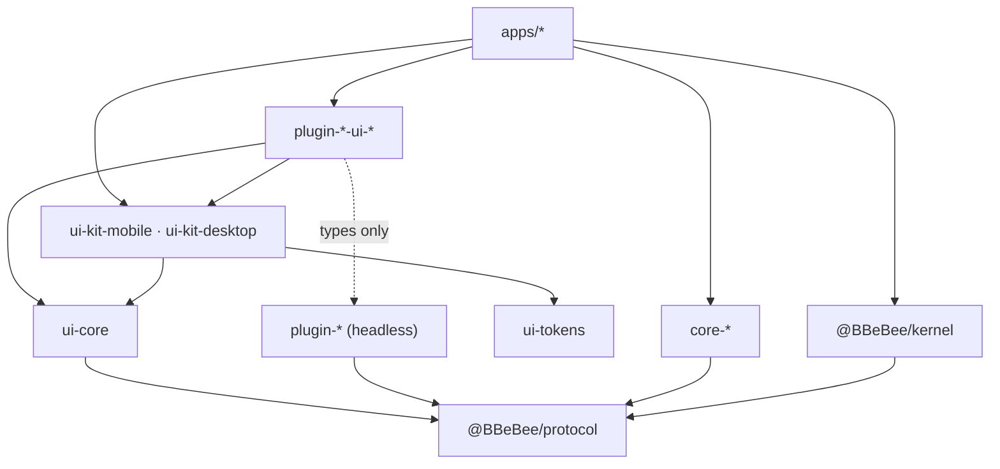

# 09 —— 项目结构

> **本篇回答什么。** Monorepo 的布局、以机械方式强制执行的依赖规则、每个目标如何构建、锁定的版本矩阵，以及防止平台抽象腐化的测试策略。

---

## 1. 仓库布局

```
B_Be_Bee/
├─ apps/
│  ├─ mobile/                       Expo app — the mobile shell
│  │  ├─ app/                       expo-router routes
│  │  ├─ generated/plugins.ts       codegen: static plugin imports (03 §6.1)
│  │  ├─ app.config.ts
│  │  ├─ metro.config.js
│  │  └─ babel.config.js
│  └─ desktop/
│     ├─ main/                      Electron main — IPC hosts only, no domain logic
│     ├─ preload/                   contextBridge surface
│     ├─ renderer/                  React DOM shell + the Cordis kernel
│     └─ electron.vite.config.ts
│
├─ packages/
│  ├─ protocol/                     @BBeBee/protocol — types + contracts, ZERO runtime
│  │  ├─ src/services/              fs, http, db, secrets, audio, player, sources, ui …
│  │  ├─ src/entities/              Track, Album, StreamHandle, TransportState …
│  │  ├─ src/events.ts              the typed event map (07 §5)
│  │  └─ src/conformance/           shared contract test suites (04 §18)
│  │
│  ├─ kernel/                       @BBeBee/kernel — bootstrap, config, loader, capability gate
│  │  └─ src/migrations/            core schema migrations
│  │
│  ├─ core-paths-node/     ✅       ┐ 平台实现。
│  ├─ core-paths-expo/     ✅       │ 只有这些包允许
│  ├─ core-fs-node/        ✅       │ 导入平台 SDK。
│  ├─ core-fs-expo/        ✅       │
│  ├─ core-db-node/        ✅       │ ✅ = 已实现 (M0)
│  ├─ core-db-expo/        ✅       │
│  ├─ core-store-fs/       ✅       │ 共享：单一实现，经 ctx.fs (04 §4)
│  ├─ core-http-node/               │
│  ├─ core-http-rn/                 │
│  ├─ core-secrets-electron/        │
│  ├─ core-secrets-expo/            │
│  ├─ core-audio-webaudio/          │ (shared: react-native-audio-api on both)
│  └─ core-…                        ┘
│
│  ├─ plugin-player/                ┐
│  ├─ plugin-dsp/                   │ headless feature plugins.
│  ├─ plugin-effect-eq10/           │ Import @BBeBee/protocol
│  ├─ plugin-source-local/          │ and nothing else.
│  ├─ plugin-source-subsonic/       │
│  ├─ plugin-local-scanner/         │
│  ├─ plugin-download/              │
│  ├─ plugin-library/               │
│  ├─ plugin-lyrics/                │
│  ├─ plugin-cache/                 │
│  ├─ plugin-log-console/  ✅       │ 日志传输：Cordis exporters，
│  ├─ plugin-log-file/     ✅       │ 跨平台共享 (04 §16)
│  ├─ plugin-log-buffer/   ✅       │
│  └─ plugin-…                      ┘
│
│  ├─ ui-tokens/                    design tokens as plain data (08 §6)
│  ├─ ui-core/                      framework-agnostic React hooks
│  ├─ ui-kit-mobile/                React Native components
│  ├─ ui-kit-desktop/               React DOM components
│  ├─ plugin-player-ui-mobile/      ┐ per-target view packages
│  ├─ plugin-player-ui-desktop/     ┘
│  │
│  └─ tooling/
│     ├─ eslint-config/             including the platform-SDK import ban
│     ├─ tsconfig/
│     ├─ gen-plugins/               the static manifest codegen
│     └─ create-plugin/             scaffolder: pnpm new:plugin
│
├─ docs/                            these documents
├─ pnpm-workspace.yaml
├─ turbo.json
└─ package.json
```

### 命名

| 前缀 | 含义 |
|---|---|
| `core-<service>-<platform>` | 某项核心服务的平台实现 |
| `plugin-<feature>` | 无 UI 的功能插件 |
| `plugin-<feature>-ui-<target>` | 面向单一目标的视图 |
| `plugin-source-<protocol>` | 一个音乐提供方 |
| `plugin-effect-<id>` | 一个 DSP 效果 |
| `ui-*` | 共享 UI 基础设施，不是插件 |

---

## 2. 包分层



凡是不指向 `@BBeBee/protocol` 的箭头都只是便利。*指向* `protocol` 的箭头才是架构本身。

---

## 3. 依赖规则

这些规则由 ESLint 的 `overrides` 按路径限定来机械执行，而不是靠评审把关。每条规则在配置中都有注释，说明它守护的是哪一节文档。

```js
// packages/tooling/eslint-config/index.js — the rules that matter
const PLATFORM_SDKS = [
  'expo*', 'react-native', 'react-native/*', 'electron', 'node:*',
  'fs', 'path', 'crypto', 'child_process', 'better-sqlite3', 'music-metadata',
]

module.exports = {
  overrides: [
    {
      // 02 §1 — the invariant. Nothing outside core-* touches a platform SDK.
      files: ['packages/plugin-*/**', 'packages/ui-*/**', 'packages/protocol/**'],
      excludedFiles: ['packages/plugin-*-ui-*/**'],
      rules: { 'no-restricted-imports': ['error', { patterns: PLATFORM_SDKS }] },
    },
    {
      // 08 §1 — UI packages may render, but may not reach the platform.
      files: ['packages/plugin-*-ui-mobile/**', 'packages/ui-kit-mobile/**'],
      rules: { 'no-restricted-imports': ['error', {
        patterns: PLATFORM_SDKS.filter((p) => p !== 'react-native' && p !== 'react-native/*'),
      }] },
    },
    {
      // @BBeBee/protocol must stay runtime-free so it can be imported anywhere.
      files: ['packages/protocol/src/**'],
      excludedFiles: ['packages/protocol/src/conformance/**'],
      rules: { '@typescript-eslint/no-restricted-imports': ['error', { patterns: ['*'] }] },
    },
    {
      // 02 §2 — main is an IPC host. Domain logic there breaks platform symmetry.
      files: ['apps/desktop/main/**'],
      rules: { 'no-restricted-imports': ['error', { patterns: ['@BBeBee/plugin-*'] }] },
    },
  ],
}
```

等代码库真正成形后，第五条规则值得补上：检查任何 `plugin-*-ui-*` 包都不从其对应的无 UI 插件导入*值*，只允许导入类型。用 `eslint-plugin-import` 的 `no-restricted-paths` 加上仅类型例外即可覆盖。

---

## 4. 构建流水线

| 目标 | 打包器 | 入口 | 说明 |
|---|---|---|---|
| 移动端 | **Metro** | `apps/mobile/index.js` | 需要 `unstable_enablePackageExports` 以解析 Cordis 的 ESM `exports` 映射，并需要 `version: '2023-11'` 档位的 `@babel/plugin-proposal-decorators` |
| 桌面渲染进程 | **Vite** | `apps/desktop/renderer/index.html` | 开发时使用原生 ESM；严格 CSP 扩展了 `BBeBee-plugin:`（03 §6.2） |
| 桌面主进程 + preload | **electron-vite** | `apps/desktop/main/index.ts` | CJS 输出；原生依赖外部化 |
| 各包 | **tsup**（`protocol` 用 `tsc`） | 各包的 `src/index.ts` | 仅 ESM；`protocol` 只产出类型 |
| 第三方插件 | tsup，ESM，将 `@BBeBee/protocol` 外部化 | `dist/index.js` | 不得打包 protocol —— 它由宿主提供 |

```jsonc
// metro.config.js — the parts that are not boilerplate
{
  "resolver": {
    "unstable_enablePackageExports": true,
    "unstable_conditionNames": ["react-native", "import", "require", "default"]
  },
  "watchFolders": ["<repo>/packages"]
}
```

代码生成（`packages/tooling/gen-plugins`）在每次移动端构建之前以及开发监视模式下运行，写出 `apps/mobile/generated/plugins.ts`。其产物**提交进仓库**，因此全新检出无需任何前置步骤即可构建，CI 也只需校验该文件是否为最新，而不必重新生成。

由 Turborepo 编排：`build` 依赖 `^build`，`typecheck` 与 `lint` 并行执行，含有契约测试套件的包其 `test` 依赖 `build`。

---

## 5. 版本矩阵

已于 **2026-08-30** 对照 npm registry 逐项核实。首次提交前请再次核实；其中若干依赖每周都会变动。

| 包 | 版本 | 说明 |
|---|---|---|
| `cordis` | **4.0.0-rc.9** | ⚠️ 候选发布版本 —— 见 §5.1 |
| `cosmokit` | ^1.8.1 | Cordis 依赖 |
| `@standard-schema/spec` | ^1.1.0 | 插件 `Config` 校验 |
| `expo` | 57.0.18 | SDK 57 |
| `react-native` | **0.86.3** | 由 Expo SDK 57 锁定；勿漂移到 0.87 |
| `react` | **19.2.3** | 由 Expo SDK 57 锁定。桌面渲染进程必须与之匹配 |
| `expo-router` | ~57.0.17 | |
| `expo-audio` | ~57.0.4 | `expo-av` 已停止维护，不得使用 |
| `expo-file-system` | ~57.0.6 | `File`/`Directory` API；旧版位于 `expo-file-system/legacy` |
| `expo-sqlite` | ~57.0.2 | |
| `expo-secure-store` | ~57.0.2 | |
| `expo-background-task` | ~57.0.14 | 取代 `expo-background-fetch` |
| `expo-crypto` | ~57.0.2 | |
| `expo-dev-client` | ~57.0.16 | 必需 —— Expo Go 无法承载这些原生模块 |
| `react-native-audio-api` | **0.13.3** | ⚠️ 尚未到 1.0 —— 见 §5.2。Peer 依赖：`react-native-worklets >= 0.6.0` |
| `electron` | **44.0.0** | 要求 Node ≥ 22.12，因此 `node:sqlite` 可用 |
| `electron-vite` | 5.0.0 | |
| `vite` | 8.2.2 | |
| `typescript` | 7.0.2 | ⚠️ 若矩阵中有工具还跟不上 TS 7，就改锁最新的 5.x |
| `vitest` | 4.1.11 | |
| `zod` | 4.5.4 | 符合 Standard Schema；Valibot 或 ArkType 同样可行 |
| `pnpm` | 11.24.0 | 工作区管理器 |
| `turbo` | 2.10.12 | |
| `@shopify/flash-list` | 2.3.2 | 移动端列表虚拟化 |
| `@tanstack/react-virtual` | 3.14.10 | 桌面端列表虚拟化 |
| `music-metadata` | 11.15.0 | 桌面端标签读取，仅用于 `main` |

### 5.1 Cordis RC 问题

`cordis@4.0.0-rc.9` 自己的 README 写道：*"Cordis is under active development. The API is not yet stable and may change without notice."*（Cordis 仍在活跃开发中，API 尚未稳定，且可能不经通知即变更。）整个架构都建立在它之上。缓解措施，按序如下：

1. **精确锁定。** `"cordis": "4.0.0-rc.9"` —— 不带插入号（^），不带波浪号（~）。该包排除在 Renovate/Dependabot 之外；升级必须有意为之、手动执行，并单独开一个 PR。
2. **收敛使用面。** 项目只使用 `Context`、`Service`、`plugin`、`inject`、`effect`、事件方法、`isolate` 和 `intercept` —— 十来个入口。Cordis 提供的其余能力一概不用，因此某处变更的波及范围有界且可审计。
3. **掌握再导出。** `@BBeBee/kernel` 再导出插件所需的内容（`export { Service, Inject } from 'cordis'`），并且**插件从 kernel 导入，而不是直接从 `cordis` 导入**。一旦签名变化，由一个适配模块吸收，而不是波及 40 个包。
4. **锁定测试。** `@BBeBee/protocol` 的契约测试套件包含一小组测试，断言设计所依赖的 Cordis 语义 —— 依赖丢失会卸载插件、effect 按逆序执行、隔离按服务键逐一生效。破坏假设的升级会让 CI 直接失败并给出明确信息，而不是六周后才在运行时暴露。

### 5.2 音频引擎风险

`react-native-audio-api` 处于 `0.13.x`，是另一个未锁定的赌注。ADR-4 的结构已缓解此风险：`ctx.audio` 是一个服务，其契约是*标准的* Web Audio API 而非该库自身的形状，且 `core-audio-rntp` 是有据可查的备选方案（[05 §1](./05-audio-playback.md#escape-hatch)）。锁定纪律与 Cordis 相同。

---

## 6. 测试策略

四层测试，各自能捕获其他层无法捕获的问题。

| 层 | 工具 | 覆盖内容 |
|---|---|---|
| **单元** | Vitest | 纯逻辑：URN 解析、分数索引（fractional indexing）、智能播放列表编译、针对 mock `AudioService` 的播放控制状态机 |
| **契约** | Vitest（Node）+ Detox（真机） | 以 `@BBeBee/protocol/conformance` 中的共享套件测试每一个 `core-*` 实现（04 §18）。**最重要的一层** |
| **集成** | Vitest（内存中的 Context） | 真实的 Cordis Context、真实的功能插件、伪造的核心服务。覆盖插件加载顺序、瀑布（waterfall）钩子组合与卸载完整性 |
| **真机冒烟** | 人工，随每次发布 | 锁屏、蓝牙、拔出耳机、来电、无缝播放边界、后台存活（05 §7） |

有两项测试值得几乎先于一切编写，因为它们把架构的核心主张固化成了代码：

```ts
// Claim: unload is total. (03 §2)
it('leaves nothing behind when disabled', async () => {
  const before = snapshotContext(ctx)         // listeners, timers, services, effects
  const fiber = await ctx.plugin(SomePlugin, config)
  await fiber.dispose()
  expect(snapshotContext(ctx)).toEqual(before)
})

// Claim: the player does not know downloads exist. (02 §5, 05 §2)
it('plays the same track with and without plugin-download', async () => {
  const withoutDl = await resolveVia(ctxWithout, urn)
  const withDl    = await resolveVia(ctxWith, urn)
  expect(withoutDl.kind).toBe('remote')
  expect(withDl.kind).toBe('local')
  expect(playerBehaviour(withoutDl)).toEqual(playerBehaviour(withDl))
})
```

第一项以参数化方式对工作区中的**每一个**插件运行。任何有泄漏的插件都会让 CI 直接失败。

---

## 7. 开发工作流

```bash
pnpm install
pnpm gen:plugins            # refresh the static plugin manifest

pnpm dev:desktop            # electron-vite dev server, HMR on both processes
pnpm dev:mobile             # expo start --dev-client

pnpm new:plugin             # scaffolder: name, kind, targets → a working package
pnpm typecheck && pnpm lint && pnpm test
pnpm build:desktop          # electron-builder → dmg / nsis / AppImage
pnpm build:mobile           # eas build
```

脚手架并非可有可无的点缀。三包约定、清单格式、能力列表、契约测试套件都要接对，手工搭一个插件意味着总会在其中一环出错。`pnpm new:plugin` 会生成无 UI 包、可选的 UI 包、一份合法的 `BBeBee.plugin.json`、一个可通过的冒烟测试，以及文档占位文件。

### 提 PR 前的本地检查清单

- [ ] `pnpm typecheck lint test` 全部通过。
- [ ] 新插件通过 §6 的泄漏测试。
- [ ] 新的核心服务实现在**两个平台上**都通过其契约测试套件。
- [ ] 没有必须放宽 §3 规则才能允许的新导入。
- [ ] 若有依赖变动，版本矩阵已同步更新。

---

## 8. 下一步

[10 —— 路线图与风险](./10-roadmap.md) 规定了构建的先后次序。
