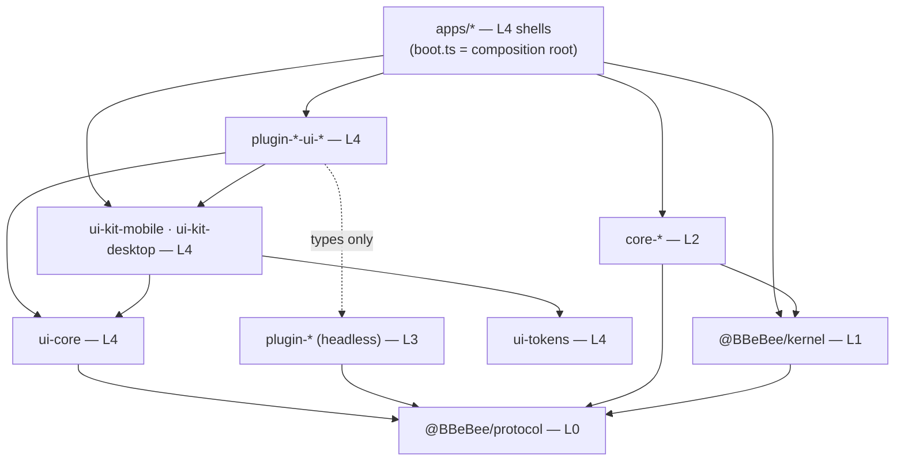

# 09 —— 项目结构

> **本篇回答什么。** Monorepo 的布局、以机械方式强制执行的依赖规则、每个目标如何构建、锁定的版本矩阵，以及防止平台抽象腐化的测试策略。

---

## 1. 仓库布局

```
B_Be_Bee/
├─ apps/                            L4 —— 各个外壳。每个外壳里的 boot.ts +
│                                   plugins.ts 就是组合根 (02 §1)
│  ├─ mobile/                       Expo app —— 移动端外壳
│  │  ├─ app/                       expo-router 路由
│  │  ├─ generated/plugins.ts       代码生成：静态插件导入 (03 §6.1)
│  │  ├─ app.config.ts
│  │  ├─ metro.config.js
│  │  └─ babel.config.js
│  └─ desktop/
│     ├─ main/                      Electron main —— 仅 IPC 宿主，不含领域逻辑
│     ├─ preload/                   contextBridge 暴露面
│     ├─ renderer/                  React DOM 外壳 + Cordis 内核
│     └─ electron.vite.config.ts
│
├─ packages/
│  ├─ protocol/            L0       @BBeBee/protocol —— 类型 + 契约，零运行时
│  │  ├─ src/services/              fs, http, db, secrets, audio, player, sources, ui …
│  │  ├─ src/entities/              Track, Album, StreamHandle, TransportState …
│  │  ├─ src/events.ts              类型化事件表 (07 §5)
│  │  └─ src/conformance/           共享契约测试套件 (04 §18)
│  │
│  ├─ kernel/              L1       @BBeBee/kernel —— 引导、配置、加载器、能力门
│  │  └─ src/migrations/            核心 schema 迁移
│  │
│  ├─ core-paths-node/     ✅       ┐ L2 —— 平台实现。
│  ├─ core-paths-expo/     ✅       │ 只有这些包被允许
│  ├─ core-fs-node/        ✅       │ 导入平台 SDK，也只有它们
│  ├─ core-fs-expo/        ✅       │ 可以驱动内核。
│  ├─ core-db-node/        ✅       │ ✅ = 已实现
│  ├─ core-db-expo/        ✅       │
│  ├─ core-store-fs/       ✅       │ 共享：单一实现，经 ctx.fs (04 §4)
│  ├─ core-http-node/      ✅       │ 传输层是一条接缝：桌面端用
│  ├─ core-http-rn/        ✅       │ Electron 的 net 填上，移动端用 expo/fetch
│  ├─ core-js-quickjs-node/ ✅      │ ctx.js —— 音源沙箱 (04 §19)
│  ├─ core-js-quickjs-expo/         │ ⚠️ 唯一的 M2 缺口：Hermes 没有 WASM
│  ├─ core-device-electron/ ✅      │ ctx.device —— 网络、电量、媒体键
│  ├─ core-device-expo/    ✅       │
│  ├─ core-background-electron/ ✅  │ ctx.background —— wake lock、挂起
│  ├─ core-background-expo/ ✅      │
│  ├─ core-media-session-electron/ ✅ ctx.mediaSession —— OS 的“正在播放”表面
│  ├─ core-media-session-rn/ ✅     │
│  ├─ core-codec-node/     ✅       │ ctx.codec —— 标签：经 ctx.fs 用
│  ├─ core-codec-rn/       ✅       │ music-metadata 读取；-rn 再加上设备的解码器
│  ├─ core-secrets-node/   ✅       │ ⚠️ 名字带 `-node`，却不分平台：它
│  │                                │ 经由 ctx.fs 持久化，因此在
│  │                                │ Electron 被沙箱化的渲染进程里也能加载
│  ├─ core-secrets-expo/   ✅       │
│  ├─ core-audio-webaudio/ ✅       │ (共享：两个平台都用 react-native-audio-api)
│  └─ core-…                        ┘
│
│  ├─ source-rules/         ✅      ┐ L3 —— 规则语言：解析器、各引擎、
│  │                                │ 组合子、类型强转。纯逻辑 ——
│  │                                │ 无 Cordis、无平台、无 I/O (06 §3)
│  ├─ plugin-source-runtime/ ✅     │ 将 source-rules 绑定到 ctx.http · ctx.js
│  ├─ plugin-player/       ✅       │ 无 UI 的功能插件。
│  ├─ plugin-dsp/                   │ 只导入 @BBeBee/protocol，
│  ├─ plugin-effect-eq10/           │ 不导入其他任何东西。
│  ├─ plugin-source-local/ ✅       │ 唯一不是字符串的提供方
│  ├─ plugin-local-scanner/ ✅      │
│  ├─ plugin-download/              │
│  ├─ plugin-library/               │
│  ├─ plugin-lyrics/                │
│  ├─ plugin-cache/                 │
│  ├─ plugin-log-console/  ✅       │ 日志传输：Cordis exporters，
│  ├─ plugin-log-file/     ✅       │ 跨平台共享 (04 §16)
│  ├─ plugin-log-buffer/   ✅       │
│  └─ plugin-…                      ┘
│
│  ├─ plugin-ui/           ✅   L3  ctx.ui 贡献注册表 —— 一个由描述符组成的
│  │                                │ 注册表，因此它不持有任何 React
│  ├─ plugin-sources/      ✅   L3  ctx.sources 注册表 + 目录 (06 §4.1)
│  ├─ plugin-inspector/    ✅   L3  fiber 树 + 带标签的 effect (M0 完成标准)
│  ├─ core-desktop-bridge/ ✅   L2  renderer↔main IPC 客户端 + main 侧宿主
│
│  ├─ ui-tokens/           ✅   L4  以纯数据形式存在的设计令牌，外加
│  │                                │ 08 §8 的 WCAG AA 闸门
│  ├─ ui-core/            ✅   L4  框架无关的 React hooks，以及
│  │                                │ 两套组件库共享的 prop 类型
│  ├─ ui-parity/          ✅       组件契约，以及检查两套组件库
│  │                                │ 是否满足它的测试 (08 §6)
│  ├─ ui-kit-mobile/      ✅       React Native 组件
│  ├─ ui-kit-desktop/     ✅       React DOM 组件
│  ├─ plugin-player-ui-desktop/ ✅  ┐ 正在播放、播放控制、队列
│  ├─ plugin-player-ui-mobile/  ✅  ┘ 
│  ├─ plugin-sources-ui-desktop/ ✅ ┐ 曲库、专辑详情、音源列表、
│  ├─ plugin-sources-ui-mobile/  ✅ ┘ 导入审查、编辑器、规则追踪器 (08 §4)
│  ├─ plugin-local-scanner-ui-desktop/ ✅ ┐ 设置：扫描根目录
│  ├─ plugin-local-scanner-ui-mobile/  ✅ ┘
│  │
│  ├─ tooling-gen-plugins/  ✅      静态注册表代码生成 (pnpm gen:plugins)
│  ├─ tooling-create-plugin/ ✅     脚手架 (pnpm new:plugin)
│  └─ tooling-fixtures/     ✅      仅开发用：≥5,000 文件的语料库生成器、
│                                   一台带插桩的 ctx.fs，以及契约套件
│                                   运行所在的按字节供给的 http fixture
│
├─ fixtures/sources/                示例音源文档；黄金语料库 (§6)
├─ docs/                            这套文档
├─ eslint.config.js                 flat config；架构规则都定义在这里
├─ vitest.config.ts
├─ pnpm-workspace.yaml
└─ package.json
```

### 命名

前缀不是装饰：正因如此，读者 —— 以及 [§3](#3-依赖规则) 中的 lint 配置 —— 才知道一个包处在哪一层，因而才获准导入什么。

| 前缀 | 层 | 含义 |
|---|---|---|
| `protocol` | 0 | 契约。仅一个包，无运行时 |
| `kernel` | 1 | 内核。仅一个包 |
| `core-<service>-<platform>` | 2 | 某项核心服务的平台实现 |
| `plugin-<feature>` | 3 | 无 UI 的功能插件 |
| `plugin-effect-<id>` | 3 | 一个 DSP 效果 |
| `source-rules` | 3 | 源运行时之下的纯逻辑；不是插件 |
| `plugin-<feature>-ui-<target>` | 4 | 面向单一目标的视图 |
| `ui-*` | 4 | 共享 UI 基础设施，不是插件 |

如今刻意**不再有 `plugin-source-<protocol>` 前缀**。一个音乐后端是一份音源文档（[06](./06-music-sources.md)），不是一个包。名字里带 `source` 的只有两个包：解释文档的 `plugin-source-runtime`，以及没有 HTTP 可描述的 `plugin-source-local`（[06 §12](./06-music-sources.md#12-不是字符串的东西本地文件)）。本仓库随附的示例文档存放在 `fixtures/sources/`，而不在 `packages/` 里。

---

## 2. 包分层

与 [02 §1](./02-architecture.md#1-分层模型) 相同的五层，画成实际的 `package.json` 图。每个节点都标注了所属层，这里的每条边都是真实的 `dependencies` 条目 —— 服务键造成的运行时边被刻意略去，因为这是构建图。



凡是不指向 `@BBeBee/protocol` 的箭头都只是便利。*指向* `protocol` 的箭头才是架构本身。

有两条边值得读上两遍，因为它们是分层模型加以*约束*而非*禁止*的对象：

- **`apps/* → @BBeBee/kernel` 与 `apps/* → core-*`** 只为组合根而存在 —— 每个外壳那一对 `boot.ts` / `plugins.ts`。`apps/*` 下的其余文件都是纯粹的 Layer 4，也被当作 Layer 4 来 lint（[§3](#3-依赖规则)）。
- **`core-* → @BBeBee/kernel`** 是唯一一处由包（而非外壳）导入引导表面的地方：`core-db-*` 运行核心迁移，并为能力门划分 context 作用域。这正是 Layer 2 在履行其适配层职责。

没有任何 `plugin-* → core-*` 的边，这是刻意的。一旦出现这样的边，分层模型就被破坏了，`pnpm lint` 会指出来。

---

## 3. 依赖规则

[02 §1](./02-architecture.md#1-分层模型) 的分层模型价值几何，完全取决于它的执行力度，因此它由 ESLint 按路径限定 `overrides` 来机械执行，而不是靠评审把关。下面每条规则都声明了自己守护的是哪一层边界。

```js
// eslint.config.js — the rules that matter
const PLATFORM_SDKS = [
  'expo', 'expo-*', 'expo/*', 'react-native', 'react-native/*', 'react-native-*',
  'electron', 'electron/*', 'node:*', 'fs', 'fs/promises', 'path', 'os', 'crypto',
  'child_process', 'better-sqlite3', 'music-metadata', 'ws',
]

// 02 §1 — the kernel's two surfaces. Being *typed* by the kernel is open to
// Layers 2-4; *driving* it is Layer 2 and the composition root only.
const KERNEL_BOOTSTRAP = [
  'createApp', 'BootstrapError', 'resolveConfig', 'isEnabled', 'loadPlugins',
  'scopeContext', 'capabilityConfigOf', 'assertFs', 'assertHost', 'assertWsHost',
  'CORE_MIGRATIONS', 'MigrationRunner',
]

// The composition root: the only files that may name a Layer 2 package by
// import and call createApp. Everything else under apps/* is Layer 4.
const COMPOSITION_ROOT = [
  'apps/mobile/src/boot.ts', 'apps/mobile/src/plugins.ts',
  'apps/desktop/renderer/boot.ts', 'apps/desktop/renderer/plugins.ts',
  'apps/*/generated/plugins.ts',
]

export default tseslint.config(
  {
    // 02 §1, invariant 1 — Layers 3 and 4 never touch a platform SDK.
    // Only packages/core-* (Layer 2) may.
    files: ['packages/plugin-*/**/*.ts', 'packages/ui-*/**/*.ts', 'packages/protocol/**/*.ts'],
    ignores: ['packages/plugin-*-ui-*/**/*.ts'],
    rules: { 'no-restricted-imports': ['error', { patterns: PLATFORM_SDKS }] },
  },
  {
    // 02 §1, invariant 2 — Layers 3 and 4 may be typed by the kernel but may
    // not drive it. A feature plugin is *handed* a context; it does not build
    // one, resolve plugins, read the config store, or consult the gate.
    files: ['packages/plugin-*/**/*.ts', 'packages/ui-*/**/*.ts', 'apps/**/*.{ts,tsx}'],
    ignores: [...COMPOSITION_ROOT, '**/*.test.ts'],
    rules: {
      'no-restricted-imports': [
        'error',
        {
          paths: [{
            name: '@BBeBee/kernel',
            importNames: KERNEL_BOOTSTRAP,
            message:
              'Layer 3/4 may import the pinned Cordis surface (Context, Service, Inject, ' +
              'FiberState…) but not the bootstrap surface. See docs/02 §1 — the invariant.',
          }],
          patterns: ['@BBeBee/kernel/*'],
        },
      ],
    },
  },
  {
    // 02 §1 — Layer 4 reaches Layer 2 through service keys, never by import.
    // The composition root is the single exception, and it is listed above.
    files: ['apps/**/*.{ts,tsx}'],
    ignores: COMPOSITION_ROOT,
    rules: { 'no-restricted-imports': ['error', { patterns: ['@BBeBee/core-*'] }] },
  },
  {
    // 02 §1 — Layer 1 depends on Layer 0 and nothing else. A kernel that knows
    // which plugins exist is no longer a kernel.
    files: ['packages/kernel/src/**/*.ts'],
    ignores: ['**/*.test.ts'],
    rules: {
      'no-restricted-imports': [
        'error',
        { patterns: ['@BBeBee/core-*', '@BBeBee/plugin-*', '@BBeBee/ui-*', ...PLATFORM_SDKS] },
      ],
    },
  },
  {
    // 02 §1 and 06 §3 — the rule engine is pure logic: no platform, and no I/O
    // either. It takes a document and a string and returns a value; every fetch
    // belongs to plugin-source-runtime. Keeping it pure is what makes the rule
    // corpus in §6 runnable without a network, and it is the Layer 3 entry in
    // 02 §1's testability table.
    files: ['packages/source-rules/**/*.ts'],
    rules: {
      'no-restricted-imports': [
        'error',
        { patterns: [...PLATFORM_SDKS, 'cordis', '@BBeBee/kernel'] },
      ],
    },
  },
  {
    // 08 §1 — Layer 4 view packages may render, but may not reach the platform.
    files: ['packages/plugin-*-ui-mobile/**/*.ts', 'packages/ui-kit-mobile/**/*.ts'],
    rules: {
      'no-restricted-imports': [
        'error',
        { patterns: PLATFORM_SDKS.filter((p) => !p.startsWith('react-native')) },
      ],
    },
  },
  {
    // 02 §1 — Layer 0 must stay runtime-free so it is safe to import anywhere,
    // which is what makes it the seam every other layer is mocked at.
    // `^[^.]` matches bare specifiers only, leaving relative imports alone.
    files: ['packages/protocol/src/**/*.ts'],
    ignores: ['packages/protocol/src/conformance/**/*.ts', '**/*.test.ts'],
    rules: {
      'no-restricted-imports': [
        'error',
        { patterns: [{ regex: '^[^.]', allowTypeImports: true }] },
      ],
    },
  },
  {
    // 02 §2 — main is an IPC host. Domain logic there breaks platform symmetry,
    // and it would put Layer 3 concerns below Layer 2.
    files: ['apps/desktop/main/**/*.ts'],
    rules: { 'no-restricted-imports': ['error', { patterns: ['@BBeBee/plugin-*'] }] },
  },
  {
    // Tests are not shipped, so the SDK ban does not apply: a conformance
    // harness legitimately needs `node:fs` to build a scratch directory.
    files: ['**/*.test.ts'],
    rules: { 'no-restricted-imports': 'off' },
  },
)
```

把它读作一张矩阵，那就是不留任何隐含之处的分层模型：

| | Layer 0 `protocol` | Layer 1 `kernel` | Layer 2 `core-*` | Layer 3 `plugin-*` | Layer 4 `ui-*`、`apps/*` | 平台 SDK |
|---|---|---|---|---|---|---|
| **Layer 0** 可导入 | — | ❌ | ❌ | ❌ | ❌ | ❌ |
| **Layer 1** 可导入 | ✅ | — | ❌ | ❌ | ❌ | ❌ |
| **Layer 2** 可导入 | ✅ | ✅ **全部** | 自己的包 | ❌ | ❌ | ✅ **仅此一层** |
| **Layer 3** 可导入 | ✅ | ⚠️ 仅 Cordis 表面 | ❌ *（改用服务键）* | 仅类型，且仅限兄弟包 | ❌ | ❌ |
| **Layer 4** 可导入 | ✅ | ⚠️ 仅 Cordis 表面 | ❌ *（改用服务键）* | ⚠️ 仅类型 | ✅ | ⚠️ `ui-*`/`plugin-*-ui-*` 可导入视图库；`apps/*` 可导入平台窗口装饰 |
| **组合根** 可导入 | ✅ | ✅ | ✅ | ✅（作为注册表数据） | ✅ | ✅ |

有两条规则刻意放在**测试**里而不是 ESLint 里 —— 一条连自身选择器都无法验证的 lint 规则，比没有更糟：`conventions.test.ts` 扫描未等待的 `ctx.plugin()`（自带一个证明检测器确实会触发的自测），各 `*-scope` 契约套件则检查能力门。见 [§6](#6-测试策略)。

仍待补上：检查任何 `plugin-*-ui-*` 包都不从其对应的无 UI 插件导入*值*，只允许导入类型 —— 上表中 `⚠️ 仅类型` 那一格目前只是约定，而非强制。用 `eslint-plugin-import` 的 `no-restricted-paths` 加上仅类型例外即可覆盖。脚手架已经产出正确的形状 —— 无 UI 包是其视图包的 `devDependency` —— 但还没有任何机制强制它。

不变量第 2 条更干净的长远形态是子路径导出：用 `@BBeBee/kernel/plugin` 承载 Cordis 表面、用 `@BBeBee/kernel` 承载引导表面，这样就能把一份 `importNames` 列表变成一条包边界。它尚未构建，因为 `importNames` 规则眼下已经足够精确，而新增第二个入口点属于已发布 API 的变更；在此记录一笔，免得这个选项被重新发明一遍。

---

## 4. 构建流水线

| 目标 | 打包器 | 入口 | 说明 |
|---|---|---|---|
| 移动端 | **Metro** | `apps/mobile/index.js` | 需要 `unstable_enablePackageExports` 以解析 Cordis 的 ESM `exports` 映射，并需要 `version: '2023-11'` 档位的 `@babel/plugin-proposal-decorators` |
| 桌面渲染进程 | **Vite** | `apps/desktop/renderer/index.html` | 开发时使用原生 ESM；严格 CSP，**不做**扩展 —— 没有任何东西加载外来代码 (02 §2) |
| 桌面主进程 + preload | **electron-vite** | `apps/desktop/main/index.ts` | CJS 输出；原生依赖外部化 |
| 各包 | **tsup**（`protocol` 用 `tsc`） | 各包的 `src/index.ts` | 仅 ESM；`protocol` 只产出类型 |
| QuickJS WASM | 以资源形式复制 | `core-js-quickjs-node` | 随包捆绑，绝不获取 —— CSP 禁止获取它，而一个要自己下载引擎的沙箱算不上沙箱 (04 §19) |

```jsonc
// metro.config.js — the parts that are not boilerplate
{
  "resolver": {
    "unstable_enablePackageExports": true,
    "unstable_conditionNames": ["react-native", "import", "require", "default"]
  },
  "watchFolders": ["<repo>/packages"]
}
```

代码生成（`packages/tooling-gen-plugins`，以 `pnpm gen:plugins` 运行）写出 `apps/{mobile,desktop}/generated/plugins.ts`。其产物**提交进仓库**，因此全新检出无需任何前置步骤即可构建，CI 也只需校验该文件是否为最新，而不必重新生成 —— 每当新增或移除插件包时都要跑一次。

由 Turborepo 编排：`build` 依赖 `^build`，`typecheck` 与 `lint` 并行执行，含有契约测试套件的包其 `test` 依赖 `build`。

---

## 5. 版本矩阵

已于 **2026-08-30** 对照 npm registry 逐项核实。首次提交前请再次核实；其中若干依赖每周都会变动。

| 包 | 版本 | 说明 |
|---|---|---|
| `cordis` | **4.0.0-rc.9** | ⚠️ 候选发布版本 —— 见 §5.1 |
| `cosmokit` | ^1.8.1 | Cordis 依赖 |
| `@standard-schema/spec` | ^1.1.0 | 插件 `Config` 校验 |
| `expo` | 57.0.18 | SDK 57 |
| `react-native` | **0.86.3** | 由 Expo SDK 57 锁定；勿漂移到 0.87 |
| `react` | **19.2.3** | 由 Expo SDK 57 锁定。桌面渲染进程必须与之匹配 |
| `expo-router` | ~57.0.17 | |
| `expo-audio` | ~57.0.4 | `expo-av` 已停止维护，不得使用 |
| `expo-file-system` | ~57.0.6 | `File`/`Directory` API；旧版位于 `expo-file-system/legacy` |
| `expo-sqlite` | ~57.0.2 | |
| `expo-secure-store` | ~57.0.2 | |
| `expo-background-task` | ~57.0.16 | 取代 `expo-background-fetch`。与 `expo-task-manager` ~57.0.16 搭配 |
| `expo-network` | ~57.0.1 | `ctx.device.network()` |
| `expo-battery` | ~57.0.2 | `ctx.device.battery()` |
| `expo-application` | ~57.0.2 | `ctx.device` 所报告的应用版本 |
| `expo-keep-awake` | ~57.0.1 | `ctx.background.acquireWakeLock` |
| `expo-crypto` | ~57.0.2 | |
| `expo-dev-client` | ~57.0.16 | 必需 —— Expo Go 无法承载这些原生模块 |
| `react-native-audio-api` | **0.13.3** | ⚠️ 尚未到 1.0 —— 见 §5.2。Peer 依赖：`react-native-worklets >= 0.6.0` |
| `react-native-gesture-handler` | ~2.32.0 | ⚠️ 我们自己并未使用。`react-native-audio-api` 的桶文件拖进了它的 `AudioControls` 小部件，而该小部件**在未声明二者**的情况下导入了本包与 Reanimated —— 因此不安装它们，Metro 就无法解析包根。见 §5.2 |
| `react-native-reanimated` | ~4.5.1 | ⚠️ 同样的原因。一旦这两个包可被解析，`babel-preset-expo` 会自行添加 worklets 插件，因此 `babel.config.js` 无需改动 |
| `react-native-worklets` | ~0.10.1 | Reanimated 4 的运行时，也是 `react-native-audio-api` 的可选 peer |
| `electron` | **44.0.0** | 要求 Node ≥ 22.12，因此 `node:sqlite` 可用 |
| `electron-vite` | 5.0.0 | |
| `vite` | 8.2.2 | |
| `typescript` | 7.0.2 | ⚠️ 若矩阵中有工具还跟不上 TS 7，就改锁最新的 5.x |
| `vitest` | 4.1.11 | |
| `zod` | 4.5.4 | 符合 Standard Schema；Valibot 或 ArkType 同样可行 |
| `pnpm` | 11.24.0 | 工作区管理器 |
| `turbo` | 2.10.12 | |
| `@shopify/flash-list` | 2.3.2 | 移动端列表虚拟化 |
| `@tanstack/react-virtual` | 3.14.10 | 桌面端列表虚拟化 |
| `music-metadata` | 11.15.0 | 两个目标平台的标签读取**都用它** —— 它是构建在 `ctx.fs` 之上的纯 JS，因此 `core-codec-rn` 直接继承它，而不是另加一个必须与它保持一致的原生读取器 |
| `quickjs-emscripten` | **0.31.0** | ⚠️ 桌面端的 `ctx.js`。精确锁定；WASM 资源随包捆绑，而非获取 (04 §19) |
| `react-native-quickjs` | **0.4.x** | ⚠️ 移动端的 `ctx.js` —— 原生模块，因此会强制重建 dev client。见 §5.3 |

### 5.1 Cordis RC 问题

`cordis@4.0.0-rc.9` 自己的 README 写道：*"Cordis is under active development. The API is not yet stable and may change without notice."*（Cordis 仍在活跃开发中，API 尚未稳定，且可能不经通知即变更。）整个架构都建立在它之上。缓解措施，按序如下：

1. **精确锁定。** `"cordis": "4.0.0-rc.9"` —— 不带插入号（^），不带波浪号（~）。该包排除在 Renovate/Dependabot 之外；升级必须有意为之、手动执行，并单独开一个 PR。
2. **收敛使用面。** 项目只使用 `Context`、`Service`、`plugin`、`inject`、`effect`、事件方法、`isolate` 和 `intercept` —— 十来个入口。Cordis 提供的其余能力一概不用，因此某处变更的波及范围有界且可审计。
3. **掌握再导出。** `@BBeBee/kernel` 再导出插件所需的内容（`export { Service, Inject } from 'cordis'`），并且**插件从 kernel 导入，而不是直接从 `cordis` 导入**。一旦签名变化，由一个适配模块吸收，而不是波及 40 个包。这就是内核的*插件表面*，也是 Layer 1 中 Layer 3 与 Layer 4 唯一获准导入的部分 —— 旁边的引导表面只有 Layer 2 与组合根可用（[02 §1](./02-architecture.md#不变量)，在 [§3](#3-依赖规则) 中强制执行）。
4. **锁定测试。** `@BBeBee/protocol` 的契约测试套件包含一小组测试，断言设计所依赖的 Cordis 语义 —— 依赖丢失会卸载插件、effect 按逆序执行、隔离按服务键逐一生效。破坏假设的升级会让 CI 直接失败并给出明确信息，而不是六周后才在运行时暴露。

### 5.2 音频引擎风险

`react-native-audio-api` 处于 `0.13.x`，是另一个未锁定的赌注。ADR-4 的结构已缓解此风险：`ctx.audio` 是一个服务，其契约是*标准的* Web Audio API 而非该库自身的形状，且 `core-audio-rntp` 是有据可查的备选方案（[05 §1](./05-audio-playback.md#逃生通道)）。锁定纪律与 Cordis 相同。

⚠️ **它的桶文件拖进来一个 UI 小部件。** `react-native-audio-api/src/api.ts` 导入了 `Audio/controls/AudioControls`，后者又导入 `react-native-gesture-handler` 与 `react-native-reanimated` —— 而该包对二者都未声明。因此，在两者都安装之前，导入该包的根入口就无法完成打包，而且即便没有任何东西渲染这个小部件，它的四枚图标 PNG 也会混进 bundle。出路有三条，按当时考虑的顺序：

1. **两个都装** —— 我们的实际做法。它们是普通的 Expo SDK 包，无需改动 Babel，而且 M2 的拖拽排序本来就需要 gesture-handler。代价：两个原生模块，外加约 2 KB 用不上的图标。
2. **在 Metro 的 `resolveRequest` 里垫片（shim）掉它们。** 更省事，而且*眼下*安全，因为没有任何东西渲染 `AudioControls` —— 但第一个添加滑动手势的人，会从一个说谎的解析器那里收到一头雾水的失败。
3. **绕过桶文件做深导入**（`react-native-audio-api/lib/module/core/AudioContext` 等）。避开两个原生模块；该包没有发布 `exports` 映射，所以行得通。但对版本脆弱，而且会蔓延到我们的三个包。

如果这两个原生模块哪天成了问题，方案 3 就是逃生通道，而且它是可控的。

---

### 5.3 求值器风险

`ctx.js` 是第三个 pre-1.0 赌注，而且它是随 [ADR-5](./01-overview.md#adr-5--音源是导入的字符串由一个运行时解释) 一道到来的，并非从容选定。两套 QuickJS 绑定、两套构建系统，其中一套还是原生模块，而它所在的平台恰恰是改动原生模块代价高昂的平台。

缓解手段与另外两个同构，这也正是 `ctx.js` 被做成一个*服务*、而不是 `plugin-source-runtime` 内部一个导入的原因：契约是"在带这些限制、这份宿主暴露面的 realm 里求值这个字符串"，QuickJS 能满足它，`isolated-vm` 形态的嵌入能满足它，`Worker` 也能 —— 只是在限制方面故事更差。契约测试套件测的正是这份契约，包括 `while (true)` 会被中断、宿主对象无法跨边界保留，因此更换实现只是换一个包，而不是一次重新设计。

⚠️ 真正会造成重创的，是出现一个**任何**解释器都无法嵌入的目标平台。今天两个目标平台都不是这种情形；如果哪天变成了这样，那就是重新考虑整套规则语言的触发条件。

---

## 6. 测试策略

四层测试，各自能捕获其他层无法捕获的问题。

| 层 | 工具 | 覆盖内容 |
|---|---|---|
| **单元** | Vitest | 纯逻辑：URN 解析、分数索引（fractional indexing）、智能播放列表编译、针对 mock `AudioService` 的播放控制状态机 |
| **契约** | Vitest（Node）+ Detox（真机） | 以 `@BBeBee/protocol/conformance` 中的共享套件测试每一个 `core-*` 实现（04 §18）。**最重要的一层** |
| **集成** | Vitest（内存中的 Context） | 真实的 Cordis Context、真实的功能插件、伪造的核心服务。覆盖插件加载顺序、瀑布（waterfall）钩子组合与卸载完整性 |
| **音源语料库** | Vitest，对录制的 HTTP fixture 回放 | `fixtures/sources/` 中的每一份示例文档都被端到端回放 —— 搜索、浏览、专辑、流 —— 其响应已被录制，因此任何破坏真实文档的规则引擎改动都会让 CI 失败 |
| **真机冒烟** | 人工，随每次发布 | 锁屏、蓝牙、拔出耳机、来电、无缝播放边界、后台存活（05 §7） |

有两项测试值得几乎先于一切编写，因为它们把架构的核心主张固化成了代码：

```ts
// Claim: unload is total. (03 §2)
it('leaves nothing behind when disabled', async () => {
  const before = snapshotContext(ctx)         // listeners, timers, services, effects
  const fiber = await ctx.plugin(SomePlugin, config)
  await fiber.dispose()
  expect(snapshotContext(ctx)).toEqual(before)
})

// Claim: the player does not know downloads exist. (02 §5, 05 §2)
it('plays the same track with and without plugin-download', async () => {
  const withoutDl = await resolveVia(ctxWithout, urn)
  const withDl    = await resolveVia(ctxWith, urn)
  expect(withoutDl.kind).toBe('remote')
  expect(withDl.kind).toBe('local')
  expect(playerBehaviour(withoutDl)).toEqual(playerBehaviour(withDl))
})
```

第一项以参数化方式对工作区中的**每一个**插件运行。任何有泄漏的插件都会让 CI 直接失败。

一旦音源存在，第三个测试就该与它们并列，因为它是整个字符串模型所立足的主张：

```ts
// Claim: a source is data, and the runtime is the only interpreter. (06 §1.1)
it('plays from a document nobody compiled', async () => {
  await ctx.sources.import(await readFixture('subsonic.json'))
  const hit = await ctx.sources.searchAll({ text: 'radiohead' })
  const handle = await ctx.sources.forUrn(firstUrn(hit))!.resolveStream(id, prefs)
  expect(handle.target).toMatch(/^https:\/\/music\.example\.org\/rest\/stream/)
})
```

语料库套件是最容易在无人照料时腐坏的一个：录制的 fixture 会渐渐偏离活的后端，而"语料库全绿、真实音源却坏了"正是要盯住的那种失败模式。作为制衡，`check` 命令（[06 §10](./06-music-sources.md#10-诊断一个坏掉的源)）要针对活的服务器、由人工、随每次发布运行 —— 与真机冒烟矩阵同一形态，并且出于同样的理由，诚实地保持人工。

---

## 7. 开发工作流

### 首次运行

```bash
pnpm install                 # pnpm 11+, Node 22.12+
pnpm check                   # typecheck + lint + test — should be green on a clean checkout
```

`pnpm check` 是整道闸门。它通过，CI 就通过。推送之前先跑它；本节其余内容在出问题之前都并非必读。

### 日常命令

| 命令 | 作用 |
|---|---|
| `pnpm check` | `typecheck` + `lint` + `test`。提 PR 前的那一条命令 |
| `pnpm test` | Vitest 对所有包跑一遍 |
| `pnpm test:watch` | Vitest 监视模式 —— 干活时让它一直开着 |
| `pnpm typecheck` | 每个包**及两个 app** 都跑 `tsc --noEmit` |
| `pnpm lint` / `pnpm lint:fix` | ESLint，含 [§3](#3-依赖规则) 的架构规则 |
| `pnpm build` | 为每个包产出 `dist/` |
| `pnpm clean` | 移除 `dist/`、`out/` 与构建信息 |

按路径跑单个包的测试 —— `pnpm test packages/core-fs-node` —— 或单个文件。

### 运行应用

| 命令 | 作用 | 需要什么 |
|---|---|---|
| `pnpm dev:desktop` | `electron-vite dev` —— main、preload 与 renderer 三处 HMR | Electron 二进制（由 `pnpm install` 抓取；首次安装需要网络） |
| `pnpm build:desktop` | 产出生产包到 `apps/desktop/out/` | — |
| `pnpm dev:mobile` | `expo start --dev-client` | 设备或模拟器上的**自定义 dev 构建** —— 见下 |

> ⚠️ **移动端需要自定义 dev 构建，不能用 Expo Go。** `react-native-audio-api`、`expo-sqlite` 与 `expo-file-system` 都含原生代码，Expo Go 无法承载本应用。每变更一次原生依赖就构建一次 dev client（`pnpm --filter @BBeBee/mobile exec expo run:android`），之后 `pnpm dev:mobile` 会附着到它。

> ⚠️ **打包尚未配置。** `build:desktop` 产出的是 bundle，不是安装器；`electron-builder`（dmg / nsis / AppImage）与移动端的 `eas build` 要到首个发布版本才到位，不属于 M0。

### 新增插件

```bash
pnpm new:plugin --name scrobble --kind feature --ui desktop --capabilities db:own
pnpm install                 # link the new workspace package
pnpm gen:plugins             # add it to both shells' static registries
pnpm check                   # already green — the template ships passing tests
```

| 标志 | 取值 | 效果 |
|---|---|---|
| `--name` | 小写、连字符分隔 | `scrobble` → `@BBeBee/plugin-scrobble` |
| `--kind` | `feature`（默认）、`effect` | 决定包前缀。没有 `source` 这个种类：一个音乐后端是文档，不是包 |
| `--ui` | `none`（默认）、`desktop`、`mobile`、`both` | 生成 [08 §1](./08-ui-architecture.md#1-三包约定) 所述的按目标视图包 |
| `--capabilities` | 逗号分隔 | 写入 `BBeBee.plugin.json`（[03 §7](./03-plugin-system.md#7-能力模型)） |

脚手架并非可有可无的点缀。三包约定、清单格式、能力列表、泄漏测试都要接对，手工搭一个插件意味着总会在其中一环出错 —— 而且往往是*无声*失败的那一环。模板自带正确的 `await ctx.plugin(...)` 形态与泄漏测试，这两样若靠踩坑领悟，各要付出一整个调试会话的代价。

### 添加一个音源

这根本不算一项开发任务 —— 这正是要点所在。在应用内：**设置 → 音源 → 导入**，粘贴字符串，查看它声明自己会做什么，确认（[06 §9](./06-music-sources.md#9-导入更新与分享)）。无需安装、无需重新构建、无需重启。

有两个命令用于维护本仓库随附在 `fixtures/sources/` 中的*文档*：

| 命令 | 作用 |
|---|---|
| `pnpm source:check <file>` | 针对 live 后端运行 [06 §10](./06-music-sources.md#10-诊断一个坏掉的源) 的健康检查并打印追踪。需要网络；对需要认证的音源，还需要环境里备好凭据 |
| `pnpm source:record <file>` | 回放同样的步骤，并写出语料库套件（[§6](#6-测试策略)）离线回放所用的 HTTP fixture |

**新增或移除插件之后，运行 `pnpm gen:plugins`。** Metro 无法解析运行期路径，因此两个外壳读取的都是一份生成的静态导入注册表（[§4](#4-构建流水线)）。产物随仓库提交；CI 校验其是否为最新，而不是重新生成。

### 各道门各自能抓住什么

值得了解，因为这里的失败通常意味着架构层面的错误，而不是拼写错误：

| 门 | 能抓住的问题 |
|---|---|
| `no-restricted-imports` | 插件伸手去够平台 SDK，而不是 `ctx.*` 服务（[02 §1](./02-architecture.md#不变量)） |
| 契约测试套件 | 同一服务的两份实现渐行渐远 —— 这正是套件存在的理由 |
| `*-scope` 套件 | 能力门在某一平台成立、在另一平台失效 |
| 泄漏测试（`diffSnapshots`） | 卸载不干净的插件（[§6](#6-测试策略)） |
| `conventions.test.ts` | 未等待的 `ctx.plugin()`，会无声地使就绪状态无法传播 |

### 出问题时

| 症状 | 原因 |
|---|---|
| Metro：*无法解析 `cordis`* | `metro.config.js` 缺少 `unstable_enablePackageExports` —— Cordis 是纯 ESM，带 `exports` 映射（[04 §17](./04-core-services.md#17-运行时兼容性清单)） |
| `@Inject` 运行时失败、编译却通过 | 用了旧式装饰器。Babel 需要 `{ version: '2023-11' }`；`tsconfig` 不得设置 `experimentalDecorators` |
| 插件永远停在 `pending` | 某个被注入的服务始终没有 ACTIVE。`ctx.inspector.render()` 会打印纤维树并注明每个 fiber 在等什么 |
| `app.start()` 已 resolve 但某个服务尚未就绪 | 某处有未等待的 `ctx.plugin()`。`pnpm test packages/kernel` 会点名文件 |
| `CapabilityError: … may not …` | manifest 缺少某项能力，或路径/表确实越界。要放宽的是 manifest，永远不要放宽门 |
| 来自音源的 `CapabilityError: host … not allowed` | 文档的规则触达了它未声明的主机。把它加进 `allowedHosts` 并重新导入，让用户看得见 (06 §8) |
| 音源不返回任何结果，也没有报错 | 某条规则在字段本可为空的地方什么都没匹配到。规则追踪器会点名那一步 (06 §10)；`check` 会赶在用户之前找到它 |
| 音源中出现 `JsTimeoutError` | 某个 `@js:` 块在死循环，或在等待一个永不 resolve 的请求。限制按每次求值计，不能按音源配置 (04 §19) |
| 渲染进程：*preload bridge 缺失* | 渲染进程加载时没有拿到 `preload/index.cjs` —— 重新构建，preload 必须是 CJS |
| Electron 在无头机器上无法启动 | 预期行为。它需要 `libgtk-3`、`libnss3` 与显示器；产物本身仍可构建 |

### 提 PR 前的本地检查清单

- [ ] `pnpm check` 全部通过。
- [ ] `pnpm gen:plugins` 不产生任何差异。
- [ ] 新插件通过 [§6](#6-测试策略) 的泄漏测试。
- [ ] 新的核心服务实现通过其契约测试套件 —— **以及它的 `*-scope` 套件，在该服务的每一份实现上**，而不只是你改动的那一份。
- [ ] 没有必须放宽 [§3](#3-依赖规则) 规则才能允许的新导入。
- [ ] 若有依赖变动，版本矩阵已同步更新。
- [ ] 若规则引擎有改动，音源语料库（[§6](#6-测试策略)）全绿 —— 并且如果某个 fixture 不得不重新录制，在 PR 里说明原因，因为被悄悄重录的 fixture 会掩盖一次真实的行为变化。

---

## 8. 下一步

[10 —— 路线图与风险](./10-roadmap.md) 规定了构建的先后次序。
