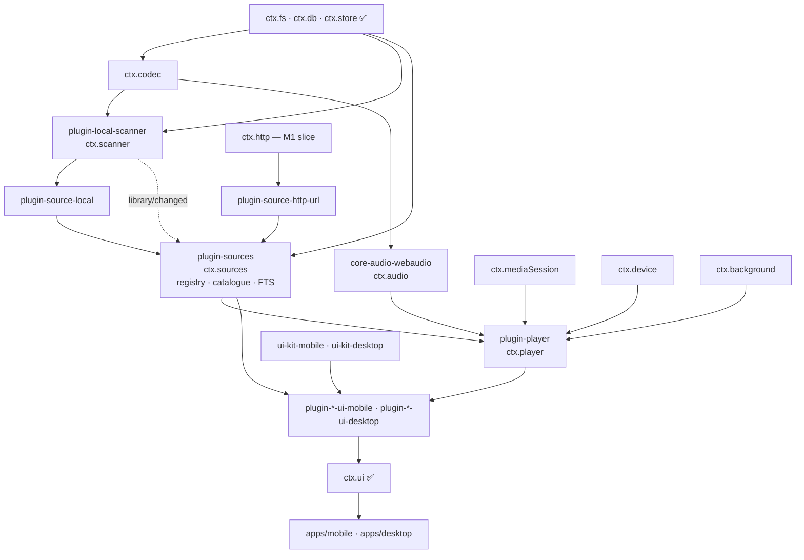
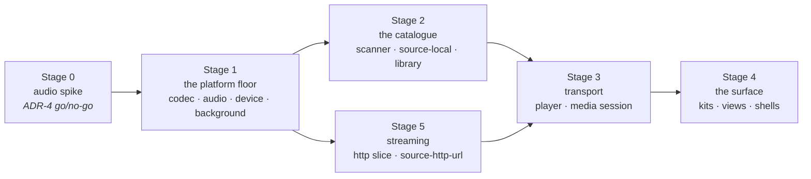
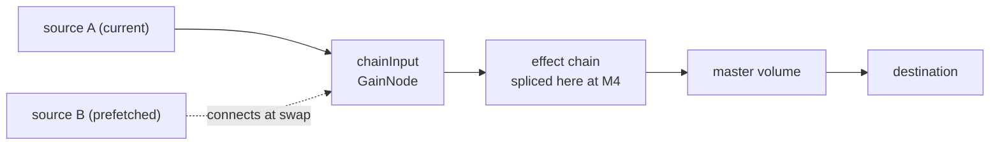

# 11 —— M1 执行计划：能播放音乐

> **本篇回答什么。** M1 构建什么、按什么顺序构建、每个包的"完成"意味着什么，以及
> [10 §M1](./10-roadmap.md#m1--it-plays-music) 里的每一条完成标准究竟如何被验证。
> [10](./10-roadmap.md) 说的是里程碑*是什么*；本篇说的是这一个里程碑*怎么建*。

M0 证明了内核：一张插件图、两个平台、彻底的卸载、达标的各核心服务。它没有证明任何关于应用本身的东西，因为 M0 里的任何东西都发不出声音。

M1 是四项主张停止停留在设计、变成要么能跑要么不能跑的代码的地方。

| 主张 | 陈述于 | M1 对它做了什么 |
|---|---|---|
| 一张 Web Audio 图能在 iOS、Android 与 Electron 上播放并处理音频 | [ADR-4](./01-overview.md#adr-4--react-native-audio-api-is-the-primary-playback-and-dsp-engine-on-every-target) | 三个目标上的缓冲播放与流式播放，带锁屏控制与后台存活 |
| 提供方 SPI 是一种抽象，不是对某一个后端的描述 | [06 §1](./06-music-sources.md#1-the-contract) | 可选面两端各一个提供方：`plugin-source-local` 与 `plugin-source-http-url` |
| 播放器不知道字节从哪里来 | [02 §5](./02-architecture.md#5-composition-how-features-reach-each-other) | `player/before-resolve` 成为一条真实运行的瀑布，有两种可能的答案，一个本地一个远程 |
| 一个插件向两个不共享任何组件代码的外壳贡献 UI | [ADR-2](./01-overview.md#adr-2--the-ui-is-split-react-native-on-mobile-react-dom-on-desktop) | 每个外壳五块屏幕，来自无 UI 包加按目标的视图包 |

[10](./10-roadmap.md) 的排序原则在里程碑内部同样成立：**音频试石先于一切依赖它的东西**（§3.1）。M1 里其余一切都是可回退的工作；ADR-4 不是。

---

## 1. 范围

### 1.1 范围内

| 领域 | 包 | 交付 |
|---|---|---|
| 音频引擎 | `core-audio-webaudio` | `ctx.audio` —— 一份实现，覆盖两个目标 |
| 解码与标签 | `core-codec-node`、`core-codec-rn` | `ctx.codec` —— 元数据、内嵌封面、PCM、格式支持 |
| 操作系统表面 | `core-media-session-electron`、`core-media-session-rn`、`core-device-electron`、`core-device-expo`、`core-background-electron`、`core-background-expo` | 锁屏、通知、MPRIS/SMTC/Now Playing、媒体键、网络状态、wake lock、挂起钩子 |
| 网络（切片） | `core-http-node`、`core-http-rn` | `ctx.http` 限定为 GET/HEAD、请求头、`Range`、流式、进度 —— MD-1 |
| 音源与目录 | `plugin-sources`、`plugin-source-local`、`plugin-source-http-url` | `ctx.sources` —— 注册、发现，以及承接这些答案的目录缓存 |
| 扫描 | `plugin-local-scanner` | `ctx.scanner` —— 根目录、增量遍历、标签与封面导入 |
| 播放 | `plugin-player` | `ctx.player` —— 传输、队列、解析、历史、持久化 |
| UI 基础设施 | `ui-tokens`、`ui-core`、`ui-kit-mobile`、`ui-kit-desktop` | 令牌、钩子，以及一致性组件集 |
| 视图 | `plugin-player-ui-*`、`plugin-sources-ui-*`、`plugin-local-scanner-ui-*` | 曲库、专辑、队列、正在播放、扫描根目录设置 |
| 外壳 | `apps/mobile`、`apps/desktop` | 后台音频配置、关闭到托盘、引导集、新的桥宿主 |
| 内核与契约 | `@BBeBee/kernel`、`@BBeBee/protocol` | `db:write:core`（MD-4）、`ctx.sources` 上的目录读取、`ctx.scanner` 契约、分数索引助手 |

### 1.2 范围外

刻意推迟，并注明各自落点。这里没有任何一项会被 M1 的决策卡住。

| 推迟项 | 落点 | 为什么可以等 |
|---|---|---|
| 认证、`ctx.secrets`、持久化 cookie 罐 | M2 | M1 的提供方没有需要凭据的。没有可登录的后端时造这个罐什么也测不到（[06 §4.1](./06-music-sources.md#41-session-persistence--cookies-survive-the-app)） |
| 认真的跨提供方扇出、`track_links`、身份关联 | M2 | `searchAll` 存在且被使用，但两个提供方 —— 其中一个还不能搜索 —— 不构成扇出。过渡期由 `ctx.sources.searchLocal` 覆盖目录 |
| `plugin-library` / `ctx.library` —— 播放列表、收藏、合集 | M2 | MD-3。M1 的五块屏幕没有任何整理功能，而过去用来论证这个包的目录读取现在已落在 `ctx.sources` 上 |
| `plugin-download`、`origin: 'download'` 的绑定 | M3 | 它挂接的瀑布在 M1 已上线但没有监听者 —— 这恰好是其回归测试所对照的对照组 |
| `ctx.dsp` 与所有效果器 | M4 | 接入点在 M1 图中存在并保持为空（§4.2） |
| `plugin-loader-dynamic`、能力提示、隔离区 | M5 | M1 的每个插件都是 `builtin` |
| 命令面板、右键菜单、拖拽排序、托盘迷你播放器、独立窗口 | M2+ | MD-2 |
| 播放列表、智能播放列表、评分、歌词、scrobble | M2+ | 浏览曲库并按下播放并不需要它们 |
| 打包（`electron-builder`、`eas build`） | 首个发布版本 | 已在 [09 §7](./09-project-structure.md#running-the-apps) 注明 |

### 1.3 里程碑决策

为 M1 做了六项决策，采用 ADR 的体例、出于同样的理由：让六个月后的读者能分清哪些是选择、哪些只是默认假设。

**MD-1 —— 一个最小可用的 `ctx.http` 随 M1 交付。**
GET 与 HEAD、任意请求头、`Range`、`stream()`、`onProgress`、超时与中止。没有 cookie 罐、没有 `download()`、没有认证拦截。
*理由。* 风险登记表对 ADR-4 的早期预警是"M1 要检验流式、无缝衔接与锁屏控制"。本地文件完全压不到流式路径 —— 缓冲、停顿与恢复、按 Range 跳转、一次不是暂停的欠载。等到 M2 才发现引擎处理流很差，就等于在 `plugin-player` 已经照着它写完之后才发现。
*代价。* M1 多两个包，以及一套 M2 只扩展而不重写的契约套件。这套件写成"被推迟的成员缺席，而不是打桩"的形态。

**MD-2 —— UI 是真的，但很窄。**
两套组件库都正经地建 —— 令牌、钩子、一致性组件集、虚拟化、无障碍 —— 然后花在五块屏幕上：曲库（曲目与专辑）、专辑详情、队列、正在播放，以及扫描根目录与 URL 音源的设置。没有命令面板、没有右键菜单、没有拖拽排序、没有托盘迷你播放器。
*理由。* ADR-2 里昂贵且难以事后补装的一半是基础设施：两条必须彼此一致的令牌管线、一层共享钩子、一项一致性测试。便宜的一半是更多屏幕。先写屏幕后补基础设施，等于把屏幕写两遍。
*代价。* 桌面端还没有桌面应用的质感，所以在 M2 补上桌面专属交互之前，ADR-2 的前提一直未获证明。

**MD-3 —— `ctx.sources` 拥有目录；`ctx.library` 是整理，挪到 M2。**
三个服务、三份职责、零重叠：

| 服务 | 包 | 拥有 |
|---|---|---|
| `ctx.sources` | `plugin-sources` | 有哪些后端、它们各持有什么：注册、按 URN 查找、搜索扇出、目录缓存、FTS5 索引 |
| `ctx.library` | `plugin-library` | 用户的整理：播放列表、收藏、合集。**M2** |
| `ctx.player` | `plugin-player` | 播放：传输、队列、解析、历史 |

视图包调用 `ctx.sources`，从不触碰 `ctx.db`。
*理由。* [06 §1](./06-music-sources.md#1-the-contract) 早已把目录缓存划给 `ctx.sources` —— "提供方……回答问题并返回纯数据；`ctx.sources` 把答案缓存进目录表" —— 因此读取应当与写入并肩，而不是落在一个还得与它保持一致的第二个服务里。且 [02 §6](./02-architecture.md#6-state-ownership) 要求目录访问经由*唯一*的属主服务：否则同一段 SQL 会在 `-ui-mobile` 与 `-ui-desktop` 里各写一遍，这正是 ADR-2 风险条目点名要防的失败方式。
*后果。* `plugin-library` 在 M1 里无事可做 —— MD-2 的五块屏幕没有一块做整理 —— 于是它随播放列表一起挪到 M2。M1 少带一个包。
*代价。* `plugin-sources` 在干两件事，本可以由第四个包（`ctx.catalog`）拆开：知道后端*是谁*，与缓存它们*说了什么*。如果这条接缝开始硌手，拆分是可控的 —— 读取与 FTS 索引一起搬走，没有任何消费者需要改形状。

**MD-4 —— 新增 `db:write:core`；`db:read:core` 收窄为只读。** *（已落地。）*
`assertDb` 增加了动词检查：`db:read:core` 只允许对核心表 `SELECT`，变更需要 `db:write:core`，`db:*:core` 额外允许 `CREATE`/`DROP`/`ALTER`。动词不相互蕴含，因此一个既读又写目录的插件要同时声明两者，安装时的授权提示才能准确说出它到底在请求什么。语句按其所作所为中要求最高的一档归类，所以 `DROP` 不可能躲在 `SELECT` 身后。`plugin-sources`、`plugin-source-local`、`plugin-local-scanner` 与 `plugin-player` 都声明 `db:read:core` + `db:write:core`。
*理由。* 过去的 `db:read:core` 会放行任何语句，`INSERT` 也包括在内。M1 是第一个有插件要写核心表的里程碑，所以这是纠正这个名字的最后廉价时机 —— 赶在 M5 的安装时提示一边说"只读"一边把写也放出去之前。
*落点。* `packages/kernel/src/capability.ts` 里的 `classifyDbAccess` 与授权解析器；`db-scope` 契约套件新增四个用例，`core-db-node` 与桌面桥都跑它；[03 §7](./03-plugin-system.md#capability-grammar) 的语法表行。

**MD-5 —— 无缝衔接、预取与淡入淡出全部在 M1。**
[05 §2](./05-audio-playback.md#gapless-and-crossfade) 的完整行为：预取自 `max(15s, crossfadeMs + 5s)` 起，队列变化时经 `AbortSignal` 取消；缓冲源经 `AudioBufferQueueSourceNode` 实现无缝衔接；等功率淡入淡出作为互斥的替代选项；设置为三态 `gapless | crossfade | neither`。
*理由。* 无缝衔接是 M1 对 `react-native-audio-api` 最难的要求，而它就写在 ADR-4 的早期预警里。推迟到 M4 意味着到 M4 才知道答案，那时回退的代价是重写 `plugin-player`，而不是重划一个里程碑的范围。
*代价。* M1 中最精巧的代码，以及一项要靠耳朵听的真机冒烟测试。

**MD-6 —— 桌面端"关闭到托盘"入选；托盘迷你播放器不入。**
关闭窗口是隐藏它，保住渲染进程 —— 也就是内核与音频图 —— 存活，播放期间持有 `powerSaveBlocker`。托盘上只有显示与退出，没有别的 UI。
*理由。* [10 §M1](./10-roadmap.md#m1--it-plays-music) 要求播放能在窗口隐藏后存活，而 [ADR-3](./01-overview.md#adr-3--the-electron-kernel-lives-in-the-renderer-main-is-a-thin-native-host) 使这成为进程生命周期问题而不是 UI 问题。迷你播放器是 UI，而 MD-2 推迟了 UI。

---

## 2. 包集合

`✅` M0 已有 · `+` M1 新增 · `~` 已有，扩展。

```
core-audio-webaudio         +   ctx.audio — shared implementation, all three targets
core-codec-node             +   ctx.codec — music-metadata in main, decodeAudioData in renderer
core-codec-rn               +   ctx.codec — AudioDecoder plus a native tag reader
core-http-node              +   ctx.http (M1 slice) — Electron net, in main
core-http-rn                +   ctx.http (M1 slice) — RN fetch / XHR
core-media-session-electron +   ctx.mediaSession — navigator.mediaSession + MPRIS/SMTC/Now Playing
core-media-session-rn       +   ctx.mediaSession — lock screen and media notification
core-device-electron        +   ctx.device — network, battery, media keys, hotkeys
core-device-expo            +   ctx.device
core-background-electron    +   ctx.background — powerSaveBlocker, intervals, suspend hooks
core-background-expo        +   ctx.background — audio session, expo-background-task
core-desktop-bridge         ~   hosts for codec, http, media session, device; preload surface
core-fs-node / -expo        ✅  toPlayableUri and canWatch get their first real consumer
core-db-node / -expo        ~   the db:write:core verb check (MD-4)

plugin-sources              ✅  ctx.sources — registry, discovery; catalogue cache + FTS to come
plugin-source-local         +   MediaProvider over the filesystem, instance id 'local'
plugin-source-http-url      +   MediaProvider implementing the required core and nothing else
plugin-local-scanner        +   ctx.scanner — roots, incremental walk, tag and artwork import
plugin-player               +   ctx.player — transport, queue, resolution, history, persistence
plugin-ui                   ✅  gets its first non-trivial contributions
plugin-inspector            ✅  used to verify the M1 fiber tree unloads clean

ui-tokens                   +   design tokens as data
ui-core                     +   useService / useServiceState over useSyncExternalStore
ui-kit-mobile               +   the parity component set, React Native
ui-kit-desktop              +   the parity component set, React DOM
plugin-player-ui-*          +   now playing, mini player, transport, queue
plugin-sources-ui-*         +   library, album detail
plugin-local-scanner-ui-*   +   settings: scan roots and URL sources

protocol                    ~   services/library.ts, services/scanner.ts, the fractional index
kernel                      ~   db:write:core, bootstrap sets for the new core services
tooling-fixtures            +   dev-only: the 5,000-file corpus generator (§7)
```

依赖方向 —— 每条箭头都是一次 `inject`，加载顺序由它们推导而来，从不显式声明（[02 §3](./02-architecture.md#3-boot-sequence)）：



---

## 3. 排序

五个阶段。每个阶段都以一件可演示的东西收尾，因为一个无法演示的阶段也无法被证明做完了。



### 3.1 阶段 0 —— 音频试石

在 §2 中任何包落笔之前，先由一个用完即弃的分支回答 ADR-4 是否成立。它不是插件、没有测试、事后删除。它必须在**一台 iOS 真机、一台 Android 真机和 Electron 中**展示：

- 一个本地文件被解码并完整播放，`positionMs` 单调前进。
- 一个远程 URL 以流的方式播放，一次能落点的 seek，以及一次刻意制造的、能恢复而不是让源终止的停顿。
- 两个缓冲源经 `AudioBufferQueueSourceNode` 无缝交接，听不出间隙。
- 一个 `GainNode` 与一个 `BiquadFilterNode` 被构造并连接 —— 不是为了 M1，而是因为 M4 用的同一种货币。
- 应用切后台（移动端）与窗口隐藏（桌面端）时播放不中断。
- 锁屏或通知控件能驱动暂停与恢复。

**决策点。** 若前三项中任何一项在某个目标上失败且试石期内修不好，就以 `core-audio-rntp`（基于 `react-native-track-player`）作为移动端实现（[05 §1](./05-audio-playback.md#escape-hatch)）。其后果要在阶段 1 开工*之前*记录下来，而不是事后才发现：没有移动端 DSP，M4 变成桌面专属；`chainInput` 在移动端成为空操作；MD-5 收窄到回退引擎能提供什么。`ctx.player` 与每个视图包不受影响 —— 这正是抽象存在的意义 —— 但里程碑的范围变了，而这是一个要刻意做出的决策。

### 3.2 阶段 1 —— 平台地基

`core-codec-*`、`core-audio-webaudio`、`core-device-*`、`core-background-*`，以及它们需要的桥宿主。没有功能插件。

**演示。** 一项测试经 `ctx.codec` 与 `ctx.audio` 加载一个随包附带的文件并播放，在 Node（用假件）、iOS 模拟器、Android 模拟器与 Electron 上全绿。

### 3.3 阶段 2 —— 目录

`plugin-local-scanner`、`plugin-source-local`，以及 `plugin-sources` 的目录半边（注册表半边已建成），外加它们需要的协议变更（MD-3）。

**演示。** 把扫描器指向一个文件夹；`ctx.sources.listTracks()` 返回排序且分页的结果；`ctx.sources.searchLocal('bjork')` 找到 `Björk`；对未变化的文件夹做第二次扫描时一个字节的文件内容都不读。仍然听不到任何声音。

### 3.4 阶段 3 —— 传输

`plugin-player` 与 `core-media-session-*`。

**演示。** 从测试或调试控制台：`playNow`、暂停、seek、下一曲、上一曲、重排。锁屏显示曲目且按钮可用。杀掉进程再启动：队列与进度回来，且没有任何东西在播放。

### 3.5 阶段 4 —— 表面

`ui-tokens`、`ui-core`、两套组件库、各视图包、两个外壳。

**演示。** [10 §M1](./10-roadmap.md#m1--it-plays-music) 的完成标准，由一个人拿着手机、另一个人点着鼠标来执行。

### 3.6 阶段 5 —— 流式（与阶段 2 并行）

`core-http-node`、`core-http-rn`、`plugin-source-http-url`。只依赖阶段 1，在阶段 3 汇合，因此从不在关键路径上。

**演示。** 一个配置为音源的 URL 能播放、能 seek、能挺过一次停顿，且在恢复期间上报 `stalled` 而不是 `paused`。

---

## 4. 工作包

每个包在其勾选项全部打勾、`pnpm check` 全绿、并通过以整个工作区为参数的泄漏测试（[09 §6](./09-project-structure.md#6-testing-strategy)）时即告完成。这三条在下文视为默认成立，不再重复。

### 4.1 `core-codec-node` · `core-codec-rn` —— `ctx.codec`

桌面端在 **`main` 中**用 `music-metadata` 读标签，经由 `core-desktop-bridge` 触达；PCM 解码用渲染进程的 `decodeAudioData`，完全不需要过桥。移动端用 `react-native-audio-api` 的 `AudioDecoder` 解 PCM，用一个原生标签读取器拿元数据。

`readMetadata` 不得读整个文件。一个 40 MB 的 FLAC 只值得读一次文件头加一次 seek 到标签块，而不是让 40 MB 走一遍 IPC 通道 —— 这就是 5,000 个文件的扫描要几分钟还是要一下午的区别。

- [ ] 在 `packages/protocol/src/conformance/` 新增 `codecConformance` 套件，在 Node 与真机上运行：标签、内嵌封面、时长探测、PCM 解码、非空的 `supportedFormats()`。
- [ ] 一个契约用例断言 `readMetadata` 在大文件上不超过字节上限。
- [ ] `supportedFormats()` 如实反映各平台；[04 §13](./04-core-services.md#13-ctxcodec--decoding-and-metadata) 的 ⚠️ 以*上报*无法解码的内容来兑现，绝不悄悄跳过。
- [ ] 新的桥方法与所有其他宿主一样带能力标注并做路径封闭（[03 §7](./03-plugin-system.md#where-the-gate-actually-runs)）。

### 4.2 `core-audio-webaudio` —— `ctx.audio`

两个目标一个包：移动端用 `react-native-audio-api@0.13.3`，桌面端用同一个包的 web 构建或渲染进程的原生 Web Audio。这是阶段 0 专为降低风险而存在的那个包。

M1 的图是 [05 §1](./05-audio-playback.md#graph-topology) 的拓扑，链为空：



`chainInput` 从第一天起就是真实节点，源连接到它，永远不直接连 `destination`。M4 在 `chainInput` 与主音量之间接入效果链，一行 `plugin-player` 代码都不用动。M1 **不**交付占位链，也没有 `ctx.dsp`：一个空的接入点是诚实的，一条直通的链是一个日后还得拆掉的谎言。

- [ ] `load()` 同时支持两种策略 —— 本地文件与短的远程文件用 `buffer`，这正是 MD-5 无缝衔接得以成立的前提；其余用 `stream`。
- [ ] `onInterruption` 与 `onRouteChange` 把各平台的事件映射到契约的形状。消费它们的*策略*住在 `plugin-player`（§4.9），不在这里。
- [ ] `listOutputDevices` / `setOutputDevice` 在桌面端是真的；在移动端给出一条带泄漏说明的单项列表，绝不抛错。
- [ ] 上报 `outputLatencyMs`，让 M4 有东西可补偿。
- [ ] `audioConformance`：播放、进度前进、暂停保持位置、seek 落点、`onEnded` 恰好触发一次、`dispose()` 断开它创建的每一个节点。在 Node 里对着 `OfflineAudioContext` 与真机上全绿。

### 4.3 `core-device-*` · `core-background-*`

`ctx.device` 提供 `network()` 与 `onNetworkChange` —— `StreamPrefs.saveData` 的来源 —— 外加桌面端的电量、媒体键与快捷键。

`ctx.background` 提供 `canRunInBackground()`、`acquireWakeLock`、`schedule`（M1 中仅被移动端扫描轮询使用，因为那里的 `ctx.fs.canWatch` 为 false）以及 `onWillSuspend`，后者是播放器做检查点的地方。

- [ ] 桌面端 `canRunInBackground()` 为 `true`；移动端仅在音频持有进程时为 `true`，且该值是推导出来的，不是写死的。
- [ ] `acquireWakeLock` 在桌面端映射为 `powerSaveBlocker` 并及时释放；泄漏的锁会被泄漏测试抓住。
- [ ] `onWillSuspend` 在两个平台上都于真实挂起之前触发，并在真机上验证 —— 一个从不触发的钩子比没有钩子更糟，因为下游的一切都信任它。

### 4.4 `core-media-session-electron` · `core-media-session-rn`

桌面端经渲染进程的 Chromium `navigator.mediaSession` 发布，并经 `main` 支持 MPRIS（Linux）、SMTC（Windows）与 macOS 的"正在播放"中心。移动端用 `react-native-audio-api` 的锁屏与通知控件，在 Android 上这意味着前台服务及其媒体通知。

封面在移动端必须是本地 `Uri`，因此顺序是固定的：先立即发布不带封面的元数据，图像到位后再更新。绝不为等一张图而拖延整次更新。

- [ ] `setSupportedCommands` 真实改变 OS 表面显示哪些按钮。
- [ ] `onCommand` 能往返：一次锁屏按压到达 `ctx.player`，结果在一次更新内反映回去。
- [ ] `clear()` 移除 OS 表面，于是被禁用的 `plugin-player` 不留下幽灵锁屏。

### 4.5 `core-http-node` · `core-http-rn` —— M1 切片

按 MD-1：GET 与 HEAD、任意请求头、`Range`、`stream()`、`onProgress`、`timeoutMs`、`AbortSignal`、重定向处理。桌面端在 `main` 里走 Electron 的 `net` 并把流送回渲染进程，理由见 [02 §2](./02-architecture.md#desktop) 的 CORS 与请求头。

`cookies` 与 `download()` 是**缺席，不是打桩** —— 一个会抛错的成员是对契约的撒谎（[06 §1.1](./06-music-sources.md#11-why-auth-is-required-and-everything-else-is-not)）。`http/request` 瀑布在没有监听者的情况下照常派发，于是 M2 的认证插件面对的是一个已经在工作的钩子。

- [ ] `httpConformance` 只覆盖 M1 切片，写成 M2 加用例而不是重写的形态。
- [ ] 在 RN 0.86 上验证 `ReadableStream` 的可用性，若无则在移动端入口引入 `web-streams-polyfill`（[04 §17](./04-core-services.md#17-runtime-compatibility-checklist)）。
- [ ] Range 请求与进度对着一个真实的按字节服务的 fixture 检验，而不是 mock。

### 4.6 `plugin-sources` · `plugin-source-local`

`plugin-sources` 分两半到来。

**注册表 —— 已建成。** `register`、`providers`、`get`、`forUrn`，以及一个在 M1 里最多只有两个提供方可问的 `searchAll`。它拒绝重复的 `instanceId` 而不是遮蔽既有者，因为同一实例 id 上有两个提供方会让该命名空间里每一条 URN 都有歧义 —— 这正是 URN 方案要防的头号问题。`searchAll` 同时返回按提供方的结果*与*按提供方的错误，把慢后端上报为 `pending` 而不是取消它，跳过 `capabilities` 声明不支持搜索的提供方，并把裸 `throw` 映射到 [06 §6](./06-music-sources.md#6-errors) 的分类法上，让一个粗鲁的提供方毁不掉整个扇出。注册即返回释放器，因此卸载一个提供方插件时它的注册也随之消失。

**目录缓存 —— 阶段 2。** 为它之上的一切提供读取（MD-3），并拥有 FTS5 索引。索引由 `library/changed` 驱动，因此**任何**提供方的行都会被索引，而扫描器或音源根本不需要知道索引存在。重建索引是对同一 rowid 做 `DELETE` + `INSERT`：`contentless_delete=1` 允许删除但拒绝部分 `UPDATE`（[07 §4.3](./07-data-model.md#43-catalogue)）。

每个提供方实例从第一天起就加载在自己的 `ctx.isolate('http')` 作用域里（[06 §2](./06-music-sources.md#2-provider-plugins-vs-provider-instances)），即便 M1 还没有任何需要隔离的 cookie。

- [ ] `listTracks` / `listAlbums` / `listArtists` 的分页与排序在 SQL 里做，绝不在 JS 里做 —— 10 万曲的曲库不能为了排序先整个物化出来。
- [ ] `searchLocal` 折叠变音符号：`bjork` 能找到 `Björk`，以测试断言。
- [ ] 钩子（`useTracks`、`useAlbum`、`useSearch`）住在这个无 UI 包里，由两个视图包共同导入（[08 §4](./08-ui-architecture.md#4-binding-services-to-react)）。
- [ ] 关联 URN 的展示折叠**不**实现，但返回的形状能承载它，于是 M2 加行为而不是改签名。
- [ ] 缓存落地后声明 `db:read:core` + `db:write:core`；注册表半边两者都不需要，什么也不声明（MD-4）。

`plugin-source-local` 与任何提供方一样 —— 本地曲库没有特权。`instantiable: false`、实例 id `local`、`auth.flow = { kind: 'none' }`，`signIn` 立即 resolve，`signOut` 清掉自己缓存的行。四行代码，恰好证明了"要求提供 `auth` 毫无成本"。

`resolveStream` 读取扫描器写入的 `media_bindings` 行（`origin: 'scan'`），返回 `{ kind: 'local', target: await ctx.fs.toPlayableUri(uri), seekable: true }`。它与远程提供方的全部差别就这一处 —— 这也是为什么 M3 的下载能无声地插进来：下载的曲目只是同一个形状换成了 `origin: 'download'`。

`browse` 在启用的扫描根下遍历 `ctx.fs.list`，经 `scan_entries` 把叶子解析为 URN，[06 §3](./06-music-sources.md#browse) 的文件夹树就此免费获得。

`search` 由 `ctx.sources` 维护的 FTS 索引作答，过滤到 `instance_id = 'local'`。一个索引、两个入口 —— `ctx.sources.searchLocal` 面向统一目录，`provider.search` 面向扇出 —— 而不是两套会各自漂移的 tokeniser 配置。

- [ ] `capabilities` 与已实现成员严格一致：`browse: true`、`search.fullText: true`、`library.read: true`、`streaming.seekable: true`、`urlExpiry: false`、`transcoding: false`。
- [ ] `ping()` 保持廉价：根目录存在且可读，仅此而已。
- [ ] 注册以释放器形式返回，卸载插件即移除提供方及其派生的一切。
- [ ] 声明 `db:read:core` + `db:write:core`：它读扫描器写的行，且 `signOut()` 删除本实例的行，这是一次写（MD-4）。
- [ ] 走完 [06 §9](./06-music-sources.md#9-writing-a-provider-checklist) 的检查清单，凭据相关行标注*不适用 —— flow: none* 而不是悄悄跳过。

### 4.7 `plugin-local-scanner` —— `ctx.scanner`

与 `plugin-source-local` 分开，因为扫描与服务是两回事（[06 §8](./06-music-sources.md#the-local-scanner)）。

- **增量。** 以 `(size, mtime)` 对 `scan_entries` 决定一个文件是否需要碰。未变化的曲库只消耗 stat 调用，别无其他。这是完成标准，所以它是测试而不是意愿（§6）。
- **可中断。** 一个事务里一批文件，从 fiber 取 `AbortSignal`，每批之后做检查点，每批发一次 `scan/progress`。扫描中途一次挂起的代价是一批。
- **对失败诚实。** 无法解码的文件记为 `scan_entries.status = 'error'` 并附原因，以"无法导入"列表的形式浮出 —— 绝不无声缺席。
- **封面。** 只提取一次，哈希为 `artworks.id`，`blurhash` 与 `dominant_color` 在导入时用纯 JS 计算（[07 §4.2](./07-data-model.md#42-artwork)）。在任何一项放到列表滚动期间做都会掉帧。
- **删除。** 消失的文件带走自己的 `media_bindings` 行，而一条失去绑定的本地曲目被移除 —— 对实例 `local` 而言，文件*就是*曲目。
- **监视。** `ctx.fs.canWatch` 为真时用 `ctx.fs.watch`；否则注册一个经 `ctx.background.schedule` 的轮询，并把由此产生的延迟如实写进 UI，而不是假装不存在。

- [ ] `addRoot` 用 `ctx.fs.pickDirectory`，且 Android 的 SAF 授权在重启后仍然有效。
- [ ] 写入 `tracks`、`albums`、`artists`、`track_artists`、`genres`、`track_genres`、`artworks`、`media_bindings`、`scan_roots`、`scan_entries`；声明 `db:write:core`（MD-4）。
- [ ] 每批发出 `scan/started`、`scan/progress`、`scan/finished` 与 `library/changed`，UI 于是渐进填充，而不是等整棵树走完。
- [ ] 扫描中途取消后数据库保持一致，下一次扫描以低成本续传。
- [ ] 写入成批并走单一写入路径 —— [10](./10-roadmap.md#-sqlite-as-the-single-store) 的 SQLite 争用风险在这里被第一次实测（§7）。

### 4.8 谁写目录

两个写入者与一个"记录读取者"，值得写明，因为"目录"是多个 M1 包都要触碰的那一份状态。

| 行 | 由谁写 | 授权 |
|---|---|---|
| 实例 `local` 的 `tracks`、`albums`、`artists`、`artworks`、`media_bindings`、`scan_*` | `plugin-local-scanner`，来自磁盘文件 | `db:read:core` + `db:write:core` |
| 远程实例的同名表 | `plugin-sources`，缓存提供方的回答（[06 §1](./06-music-sources.md#1-the-contract)） | `db:read:core` + `db:write:core` |
| `tracks_fts`、`tracks_fts_map` | 仅 `plugin-sources`，由 `library/changed` 驱动 | 同上 |
| `queue_items`、`playback_state`、`play_history`、`track_stats` | `plugin-player` | `db:read:core` + `db:write:core` |
| `playlists`、`playlist_items`、`library_items`、`collections` | M1 无人 —— M2 的 `plugin-library` | — |

一切*读取*都经 `ctx.sources`。提供方从不亲自写目录：它回答问题并返回纯数据，这正是提供方可以不依赖数据库而被测试的原因。

### 4.9 `plugin-player` —— `ctx.player`

M1 里最大的包，也是用户最能感知其行为的包。

**传输。** [05 §2](./05-audio-playback.md#transport-state-machine) 状态机的每一个转移，包括与 `paused` 区分的 `stalled`：UI 显示转圈，锁屏继续上报*正在播放*，于是一次缓冲欠载不会让锁屏闪烁。

**队列。** 持久化到 `queue_items`，用分数索引，因此在 5,000 曲的队列里移动一首曲目恰好写一行。LexoRank 风格的助手放进 `@BBeBee/protocol`、与 URN 助手为邻，因为 M2 的播放列表还要复用它。

**让播放器"手感对"的行为**，每条带一个测试：超过 3000 ms（可配置）时 `previous()` 重播当前曲目，否则回退一曲；随机是持久化的种子加一个排列，不是掷骰子，因此即将播放的队列可以被如实展示；单曲循环复用已加载的缓冲而不是重新解析。

**解析。** `player/before-resolve` 作为瀑布派发，末端调用 `ctx.sources.forUrn(urn).resolveStream(id, prefs)`，`prefs` 由 `ctx.device.network().metered` 与 `ctx.codec.supportedFormats()` 构成。M1 里没有任何东西挂接它 —— 这是刻意的：它是 M3 回归测试"有与没有 `plugin-download` 时播放行为一致"的对照组（[09 §6](./09-project-structure.md#6-testing-strategy)）。

**无缝衔接、预取与淡入淡出**，按 MD-5。

**中断。** [05 §5](./05-audio-playback.md#5-interruptions-focus-and-routes) 的整张策略表，在这里、对着 `ctx.audio` 的事件、一次性实现。拔出耳机即暂停，这一条不可配置。

**持久化。** 播放中每 5 秒节流写一次 `playback_state`；暂停、换曲与 `ctx.background.onWillSuspend` 时立即写。启动时恢复队列与进度，且**绝不自动播放**。

**历史。** `player/track-completed` 并行派发；`play_history` 与 `track_stats` 在同一事务里写入。

- [ ] 状态机的每一个转移都有对着 mock `AudioService` 的单元测试，包括加载途中被打断与预取途中队列变化。
- [ ] 错误映射到 [06 §6](./06-music-sources.md#6-errors) 的分类法，且**任何失败路径都不清空队列**。
- [ ] 每次曲目与状态变化都发布到 `ctx.mediaSession`，位置按 1 Hz 节流。
- [ ] 能力：`audio`、`mediaSession`、`background`、`db:write:core`。
- [ ] 播放中途禁用插件会停止音频、清掉锁屏、不留下任何仍连接的节点 —— 经 `ctx.inspector` 验证。

### 4.10 `plugin-source-http-url`

只实现必需的核心，*别的什么都不做*：没有 `search`、没有 `browse`、没有 `getAlbum`、没有 `library`。配置一个 URL 与可选标题；`getTrack` 合成一个 `Track`；`resolveStream` 返回远程句柄；`ping()` 是一次 HEAD；`capabilities.streaming.seekable` 来自那次 HEAD 的 `Accept-Ranges`。

它是 SPI 的地板，其价值在于充当回归测试：如果任何屏幕在它被配置的情况下坏掉，说明某个消费者在未检查 `capabilities` 的情况下调用了可选方法。M2 的完成标准点名了它；在 §4.5 存在之后把它提前几乎不花成本，还让流式路径有了一个真实用户。

- [ ] 与 `plugin-source-local` 同时配置，且没有任何屏幕在缺少可选成员时坏掉 —— 以断言固定，而不是靠观察。
- [ ] 播放它即走 `stream` 策略、`stalled` → `playing` 的恢复，以及按 `Range` 的 seek。

### 4.11 `ui-tokens` · `ui-core` · `ui-kit-mobile` · `ui-kit-desktop`

令牌是纯数据（[08 §6](./08-ui-architecture.md#6-design-tokens)）；`ui-core` 是架在 `useSyncExternalStore` 上的共享钩子层；两套组件库以同名同 props 导出同一组组件 —— `Button`、`IconButton`、`TrackRow`、`Slider`、`Sheet`/`Dialog`、`List`、`EmptyState`、`Toast`。

- [ ] 一致性测试**先于**第一块屏幕落地：它比对两套库导出的名字与 prop 类型，出现分歧即失败，并对两套配色都检查 WCAG AA 对比度。
- [ ] 列表虚拟化 —— 移动端 `@shopify/flash-list`，桌面端 `@tanstack/react-virtual`。
- [ ] 无障碍名称经共享 props 传入，只写一次（[08 §8](./08-ui-architecture.md#8-accessibility)）；桌面端可键盘导航、焦点可见、`Escape` 关闭浮层；两端都尊重减弱动效。
- [ ] `useServiceState` 的选择器引用稳定，并有测试证明 1 Hz 的进度 tick 不会引发重渲染风暴。

### 4.12 视图包

`plugin-player-ui-{mobile,desktop}`、`plugin-sources-ui-{mobile,desktop}`、`plugin-local-scanner-ui-{mobile,desktop}`。按 MD-2 每外壳五块屏：曲库（曲目与专辑）、专辑详情、队列、正在播放（移动端全屏、桌面端底栏），以及扫描根目录与 URL 音源的设置。

让 ADR-2 保持可负担的那条规则：**如果同一个 `if` 即将在两个包里各写一遍，它就该住进无 UI 的那个。** 这些包应当只做布局、手势与事件接线，别无其他。

- [ ] 贡献是描述符；组件用 `registerView` 绑定，绝不直接交给外壳（[08 §2](./08-ui-architecture.md#2-contributions-are-descriptors)）。
- [ ] `ui.missingViews()` 被用到：至少一个贡献在某个目标上刻意没有视图，外壳显示"此平台不可用"而不是一个窟窿。
- [ ] 封面先渲染 `blurhash`，再渲染图片。滚动时不出现灰色闪烁。
- [ ] 位置在两次 1 Hz tick 之间用 `requestAnimationFrame` 插值，绝不轮询。
- [ ] 没有 `useEffect` 干领域活，React 里没有领域状态。

### 4.13 外壳

| | `apps/mobile` | `apps/desktop` |
|---|---|---|
| 引导 | 加入 `core-codec-rn`、`core-http-rn`、`core-media-session-rn`、`core-device-expo`、`core-background-expo`、`core-audio-webaudio` | 对应的 `-node` / `-electron` 版本，外加同一个共享音频包 |
| 后台音频 | `UIBackgroundModes: ['audio']`，audio session 类别 `playback`；Android 前台服务带媒体通知 | 关闭到托盘以保住渲染进程（MD-6）；播放期间 `powerSaveBlocker` |
| 原生 | 重建自定义 dev client —— M1 的每个核心服务都加了原生代码 | 在 `main` 为 codec、http、media session 与 device 新建桥宿主 |
| 路由 | 贡献的路由以动态 `expo-router` 路由接入；`placement` 决定进 tab 栏还是更多菜单 | 来自 `ctx.ui.routes` 的侧栏项，按 `order` 排序 |

- [ ] 重跑 `pnpm gen:plugins` 并提交其产物（[09 §4](./09-project-structure.md#4-build-pipelines)）。
- [ ] 桌面 CSP 保持不变 —— M1 没有任何东西需要放宽它。
- [ ] `main` 仍不含领域逻辑；每个新宿主都是机械转发（[02 §2](./02-architecture.md#desktop)）。

---

## 5. 新的契约表面

M1 向 `@BBeBee/protocol` 添加的一切。下面的服务接口是契约，不是草图 —— 它们应当能通过编译。

### 5.1 `ctx.sources` 上的目录读取

加到 `packages/protocol/src/services/sources.ts` 现有的 `SourcesService` 上（MD-3）。它已声明的注册表成员 —— `register`、`providers`、`get`、`forUrn`、`searchAll` —— 保持不变且已实现。

```ts
import type { Paged } from '../common.js'
import type { Album, AlbumDetail, Artist, ArtistDetail, Track } from '../entities/catalog.js'
import type { UrnKind } from '../urn.js'

export type TrackSort = 'title' | 'artist' | 'album' | 'addedAt' | 'year' | 'duration' | 'playCount'

export interface CatalogQuery {
  sort?: TrackSort
  desc?: boolean
  /** Restrict to given provider instances. Absent means every instance. */
  instanceIds?: string[]
  page?: PageRequest
}

export interface CatalogCounts { tracks: number; albums: number; artists: number }

export interface SourcesService {
  // … registry members as declared today …

  /* ── the catalogue cache (M1 Stage 2) ─────────────────────────────── */

  listTracks(q?: CatalogQuery): Promise<Paged<Track>>
  listAlbums(q?: CatalogQuery): Promise<Paged<Album>>
  listArtists(q?: CatalogQuery): Promise<Paged<Artist>>
  getAlbum(urn: string): Promise<AlbumDetail | undefined>
  getArtist(urn: string): Promise<ArtistDetail | undefined>

  /**
   * FTS5 over rows already stored, from any provider. Answers instantly and
   * works offline — the opposite of `searchAll`, which asks the backends and
   * can be slow, partial, or unreachable. Both exist; they answer different
   * questions and the UI shows both.
   */
  searchLocal(text: string, opts?: { limit?: number; kinds?: UrnKind[] }): Promise<SearchResult>

  counts(): Promise<CatalogCounts>
}
```

`ctx.library` —— 播放列表、收藏、合集 —— 随 M2 一起规范，那时才有真正做整理的东西。

### 5.2 `ctx.scanner`

```ts
// packages/protocol/src/services/scanner.ts
import type { Uri } from '../common.js'

export interface ScanRoot {
  id: string
  uri: Uri
  recursive: boolean
  enabled: boolean
  lastScanAt?: number
  lastError?: string
}

export interface ScanSummary { added: number; updated: number; removed: number; errors: number }

export interface ScanProgress { rootId: string; done: number; total?: number }

export interface ScannerService {
  readonly roots: readonly ScanRoot[]
  addRoot(uri: Uri, opts?: { recursive?: boolean }): Promise<ScanRoot>
  /** `forgetTracks` also drops the catalogue rows this root produced. */
  removeRoot(id: string, opts?: { forgetTracks?: boolean }): Promise<void>
  setEnabled(id: string, on: boolean): Promise<void>

  /** `full` re-reads metadata even where (size, mtime) is unchanged. */
  scan(opts?: { rootId?: string; full?: boolean; signal?: AbortSignal }): Promise<ScanSummary>
  cancel(): void
  readonly progress: ScanProgress | undefined
}

declare module 'cordis' {
  interface Context {
    scanner: ScannerService
  }
}
```

> [03 §2](./03-plugin-system.md#the-rule-every-side-effect-goes-through-the-fiber) 的片段写的是
> `ctx.library.scan({ signal })`。那是在演示取消，不是在指定归属：扫描属于 `ctx.scanner`，
> 依据 [06 §8](./06-music-sources.md#the-local-scanner) 对扫描与服务分离的规定。它演示的取消
> 形状正是 `ScannerService.scan` 所接受的。

### 5.3 能力语法

向 [03 §7](./03-plugin-system.md#capability-grammar) 增加两行，并收窄一行既有条目（MD-4，已落地）：

| 能力 | 授予 |
|---|---|
| `db:read:core` | 对核心目录表**仅限 `SELECT`**。过去放行任何语句 —— M1 中收窄 |
| `db:write:core` | 变更核心目录行。由 `plugin-sources`、`plugin-source-local`、`plugin-local-scanner` 与 `plugin-player` 持有，均为 `builtin` |
| `db:*:core` | 以上之外再加 `CREATE`/`DROP`/`ALTER`。M1 中无人申请；核心 schema 属于内核的迁移 |

### 5.4 上线的钩子

没有新事件。M1 是已声明的事件获得第一个发送者或监听者的地方 —— 这本身就是一件值得核对的事：

| 事件 | 第一个发送者 | 第一个监听者 |
|---|---|---|
| `scan/*`、`library/changed` | `plugin-local-scanner` | `plugin-sources`（FTS 索引）、各视图 |
| `source/registered`、`source/unregistered` | `plugin-sources` ✅ | 各视图 |
| `player/state-changed`、`player/track-changed`、`player/position`、`player/error` | `plugin-player` | 各视图、`ctx.mediaSession` 发布者 |
| `player/track-completed` | `plugin-player` | 历史与统计写入者 |
| `queue/changed` | `plugin-player` | 队列视图 |
| `player/before-resolve` | `plugin-player`（仅末端） | **无 —— 刻意的**（§4.9） |
| `http/request` | `ctx.http` | M2 之前无 |

M1 期间保持休眠：`download/*`、`dsp/*`、`source/auth-expired`、`source/signed-out`、`source/authenticated`。

---

## 6. 完成标准 → 各自如何验证

来自 [10 §M1](./10-roadmap.md#m1--it-plays-music) 的六条标准，外加 MD-5 补的一条。一条没有指明核查方式的标准只是意愿，不是标准。

| # | 标准 | 如何核查 | 自动化 |
|---|---|---|---|
| 1 | 扫描 ≥ 5,000 个文件；对未变化曲库的增量重扫只消耗 stat 调用 | 语料生成器（§7）造出 5,000 个带标签的文件；带插桩的 `ctx.fs` 统计调用数；第二遍必须发出 `n` 次 stat、零次 `readBytes`、零次 `readMetadata`。在真机上对真实曲库重复 | ✅ Node · 每次发布跑一次真机 |
| 2 | 播放、暂停、seek、下一曲、上一曲、队列重排 —— 三个平台全部支持 | 对着 mock `AudioService` 的传输单元测试（[05 §2](./05-audio-playback.md#transport-state-machine) 的每个转移）；真实 Context 加假核心服务的集成测试；真机冒烟矩阵验证实物 | ✅ + 真机 |
| 3 | iOS 与 Android 的锁屏与通知控件；桌面的 MPRIS/SMTC/Now Playing | `mediaSessionConformance` 对每份实现往返 `update` / `setPlaybackState` / `onCommand`；OS 表面本身靠人工 | 部分 —— 表面靠人工 |
| 4 | 移动端切后台、桌面端隐藏窗口后播放不中断 | 桌面端：自动化检查"关闭是隐藏而非销毁"且播放期间持有 wake lock。移动端：真机冒烟，因为没有任何测试架能忠实地把应用切到后台 | 部分 |
| 5 | 拔出耳机即暂停 | 一项策略单元测试向播放器注入合成的 `onRouteChange` / `onInterruption` 事件，并断言 [05 §5](./05-audio-playback.md#5-interruptions-focus-and-routes) 的整张表，包括"绝不继续用扬声器"。真实事件靠真机冒烟 | ✅ + 真机 |
| 6 | 队列与进度跨重启恢复，且不自动播放 | 集成测试对着一份已填充的 `playback_state` 启动 Context，然后断言队列已恢复、`positionMs` 相符、`status !== 'playing'` | ✅ |
| 7 | *（MD-5）* 无缝衔接的边界听不出；队列变化取消预取 | 单元：下一源在当前源结束前排入队列，且没有第二次 `AudioContext` 调度；队列变化时预取的 `AbortSignal` 触发。可听性是真机矩阵里的听感测试 | 部分 |

---

## 7. 夹具与测试架

在阶段 1 一次性建好，因为之后每个阶段都靠它们。

- **`tooling-fixtures`**（仅开发用，不发布、不打包）。生成 5,000 个文件的语料：覆盖 `mp3`、`flac`、`m4a` 与 `opus` 的短编码，带标签、内嵌封面、ReplayGain 值，以及贴近真实的专辑/艺人分布。它还产出真实曲库里必然会出现的病态用例 —— 完全没有标签、截断的文件头、零字节文件、文件名里的 unicode 与 emoji、扩展名谎报编码的文件，以及一首超长曲目 —— 于是扫描器的错误路径默认就会被压到，而不是靠运气。
- **带插桩的 `ctx.fs`** —— 一个按方法统计调用数的包装器，供标准 1 与扫描器自身的测试使用。它与现有的契约测试架放在一起。
- **mock `AudioService`** —— 时钟可控、`onEnded`、停顿与中断皆可控的确定性假件，因此 `plugin-player` 的测试从不触碰真实音频。从 `@BBeBee/protocol/conformance` 导出，供播放器的测试与未来的任何引擎使用。
- **按字节服务的 fixture**，供 §4.5 使用 —— 一个本地服务器，支持 `Range`、可加延迟、可按需在响应中途停顿。
- **真机冒烟矩阵** —— 一台 iOS 设备、一台刻意选的低配 Android 设备，以及每个桌面 OS 一台机器。核查清单是 [05 §7](./05-audio-playback.md#7-testing-audio) 的那一份，外加 MD-5 的无缝衔接边界。随每次发布运行，坦率地靠人工；假装能自动化只会得不偿失。

有一项测量即使眼下还没有任何东西依赖它，也值得在 M1 期间做一次：**边播放边扫描一个 5,000 文件的曲库**，盯住单一 SQLite 数据库上的写入争用。这是对 [10](./10-roadmap.md#-sqlite-as-the-single-store) 那条风险最便宜的探针，而且只花一次运行的成本。

---

## 8. M1 特有的风险

[10](./10-roadmap.md#risk-register) 的登记表面向整个项目；这里面向本里程碑：每一条都有一个足够早、来得及应对的信号。

| 风险 | 早期信号 | 应对 |
|---|---|---|
| `react-native-audio-api` 在某个目标上无法流式、无法 seek、无法无缝交接 | 阶段 0，在任何包落笔之前 | 改用 `core-audio-rntp` 回退；M4 变成桌面专属；显式重划里程碑范围（§3.1） |
| Android SAF 的 `content://` URI 无法交给解码器 | 在 Android 上首次扫描用户挑选的文件夹 | `ctx.fs.toPlayableUri` 逐文件复制进缓存目录，代价是磁盘。泄漏已在 [04 §1](./04-core-services.md#1-ctxfs--virtual-filesystem) 记录 —— M1 就是付账的地方 |
| 移动端没有 `ctx.fs.watch`，曲库会过期 | 现在已知 | 经 `ctx.background.schedule` 轮询，并在 UI 里如实说明，而不是暗示实时更新 |
| Hermes 在 RN 0.86 上缺 `ReadableStream` | 阶段 1，第一次流式读取 | 移动端入口引入 `web-streams-polyfill`（[04 §17](./04-core-services.md#17-runtime-compatibility-checklist)） |
| `expo-sqlite` 附带的 SQLite < 3.43，`contentless_delete=1` 不可用 | 核心迁移在真机首次启动时失败 | 在迁移里断言 SQLite 版本并大声失败；在 SDK 追上之前回退为带 ⚠️ 标注的 `LIKE` 搜索 |
| Android 14+ 的前台服务政策拒绝媒体服务 | 在较新设备上第一次后台播放 | 声明 `mediaPlayback` 服务类型及其权限；在阶段 1 的 dev 构建里验证，而不是拖到阶段 4 |
| 扫描与播放争用同一个 SQLite 写入者 | §7 的那项测量 | 扫描写入成批；若仍持续，[10](./10-roadmap.md#-sqlite-as-the-single-store) 描述的易变表拆分仍然可用，且任何查询都不跨那条边界做 join |
| 两套组件库从第一块屏幕起就漂移 | 一致性测试，前提是它先于屏幕落地 | 在阶段 4 开工前冻结组件集；分歧是 CI 失败，不是评审意见 |

---

## 9. 完成的定义

当以下全部为真时，M1 才算完成 —— 而不是"应用能放音乐了"，那会稍早一些到来，而且不是同一回事。

- [ ] §6 的每一条完成标准都有绿色核查，或一次签收过的真机运行。
- [ ] `fs`、`db`、`store`、`paths`、**`codec`**、**`audio`**、**`http`（M1 切片）** 与 **`mediaSession`** 的契约套件对每一份实现全绿，Expo 系的在真机上跑。
- [ ] 每个新插件通过泄漏测试，且在播放中途禁用再启用 `plugin-player` 后，`ctx.inspector` 显示一棵干净的树。
- [ ] `pnpm check` 全绿；`pnpm gen:plugins` 不产生任何差异。
- [ ] `db-scope` 套件在两份 `ctx.db` 实现上都覆盖了 MD-4，且没有任何插件持有自己用不到的能力。
- [ ] `@BBeBee/protocol` 仍然零运行时依赖，且 `core-*` 之外没有任何包导入平台 SDK —— 两者都有机械检查（[09 §3](./09-project-structure.md#3-dependency-rules)）。
- [ ] 真机冒烟矩阵已运行并记录在案，包括无缝衔接的听感测试。
- [ ] 文档与代码同一个 PR 更新：[03 §7](./03-plugin-system.md#capability-grammar) 的语法行、
      [09](./09-project-structure.md) 的 ✅ 标记与版本矩阵，以及阶段 0 对 ADR-4 的裁决 —— 无论
      结果如何 —— 写回 [10](./10-roadmap.md#-react-native-audio-api-is-pre-10)。

### M1 明知而留破的地方

值得写明，免得有人把这些报成 bug：没有任何地方可以登录；搜索只覆盖扫描过的内容；不能下载任何东西，且下载替换路径没有监听者；均衡器不存在，它要加入的链也不存在；没有播放列表、评分与歌词；桌面端没有键盘快捷键、右键菜单与命令面板；插件无法在运行时安装；两个 app 都没有安装器。

---

## 10. 下一步去哪里

[10 §M2](./10-roadmap.md#m2--a-second-source) 是提供方 SPI 从假设变成实物的地方。M1 推迟的一切凭据相关的东西 —— `ctx.secrets`、持久化 cookie 罐、`ctx.http` 的认证半边、`source/auth-expired` —— 都在那里一起到来，对着一个真正需要它们的后端。
