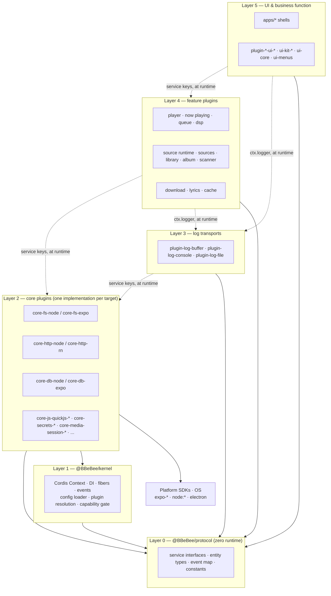
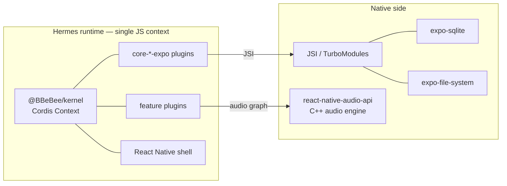
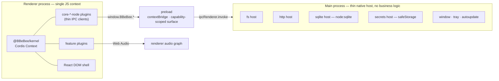
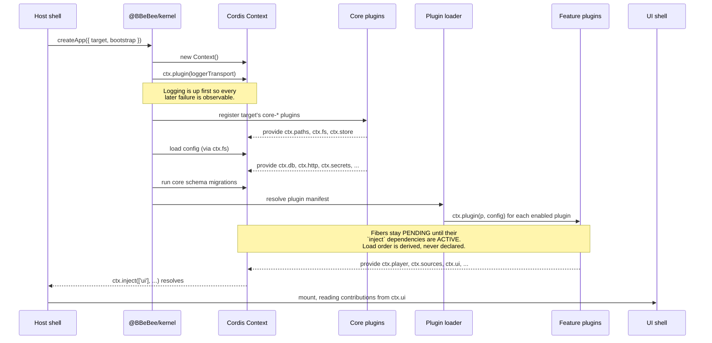

# 分层模型与系统架构

> **历史章节映射：** 原 `docs-zh/02-architecture.md`。

> **本文回答什么。** 系统如何分层、每个平台上究竟是什么在哪个进程里运行、启动时各部分以何种顺序就绪，以及跨平台抽象在哪里真正发生泄漏。

---

## 1. 分层模型

共六层（Layer 0 至 Layer 5），从契约层起向上编号。这个编号本身就是词汇表：在本套文档的任何地方，"Layer 2"指的都是核心插件；而决定一个包获准书写哪些导入的，正是它所在的层。

让这套架构产生价值的规则是**依赖方向**：每条箭头都只朝下指，向下的调用不得跳过任何一层，而且有且只有一层获准触碰底下的机器。

```
┌─────────────────────────────────────────────────────────────────┐
│ Layer 5: UI & Business Function Layer                           │
│  (Pages, Interactions, Business Orchestration)                  │
│  apps/* · plugin-*-ui-mobile · plugin-*-ui-desktop · ui-*       │
│  ✅ Depends on: Protocol, Kernel, Core Plugins, Logs, Features  │
│  ❌ Forbidden: Direct calls to system APIs / Kernel / console   │
└─────────────────────────────────────────────────────────────────┘
                              ▼
┌─────────────────────────────────────────────────────────────────┐
│ Layer 4: Feature Plugins Layer                                  │
│  (Business Feature Modules)                                     │
│  plugin-player · plugin-sources · plugin-download · …           │
│  ✅ Depends on: Protocol, Kernel, Core Plugins, Logs            │
│  ❌ Forbidden: Direct calls to system APIs / Kernel / console   │
└─────────────────────────────────────────────────────────────────┘
                              ▼
┌─────────────────────────────────────────────────────────────────┐
│ Layer 3: Logs Layer                                             │
│  (Log Transports — where a line ends up, and nothing else)      │
│  plugin-log-buffer · plugin-log-console · plugin-log-file       │
│  ✅ Depends on: Protocol, Kernel, Core Plugins                  │
│  ⚠️ The ONLY layer permitted to write to the console            │
└─────────────────────────────────────────────────────────────────┘
                              ▼
┌─────────────────────────────────────────────────────────────────┐
│ Layer 2: Core Plugins Layer                                     │
│  (Core Capability Services — one implementation per target)     │
│  core-fs-* · core-http-* · core-db-* · core-js-quickjs-* · …    │
│  ✅ Depends on: Protocol, Kernel                                │
│  ⚠️ The ONLY layer permitted to directly call system APIs /     │
│     Kernel                                                      │
└─────────────────────────────────────────────────────────────────┘
                              ▼
┌─────────────────────────────────────────────────────────────────┐
│ Layer 1: Kernel Layer                                           │
│  (Infrastructure + System Abstractions)                         │
│  @BBeBee/kernel — Cordis Context · DI · fibers · events ·       │
│  config loader · plugin resolution · capability gate            │
│  ✅ Depends on: Protocol                                        │
└─────────────────────────────────────────────────────────────────┘
                              ▼
┌─────────────────────────────────────────────────────────────────┐
│ Layer 0: Protocol Layer                                         │
│  (Interface Definitions / Data Models / Constants)              │
│  @BBeBee/protocol — zero runtime, zero dependencies             │
│  ✅ All layers may depend on this layer                         │
└─────────────────────────────────────────────────────────────────┘
```

请把这套编号当作一个权限系统来读，而不是一幅画。某一层可以点名上图中位于它自身或其下方的任何一层，此外皆不可 —— 但*如何*点名更低的一层，在 Layer 2 的边界处发生了变化；这正是接下来两个小节的主题，也是这张图的价值超出其形状的原因。

### 每一层是什么

| 层 | 包 | 负责什么 | 可依赖 | 绝不 |
|---|---|---|---|---|
| **5 —— UI 与业务功能** | `apps/mobile`、`apps/desktop/renderer`、`plugin-*-ui-mobile`、`plugin-*-ui-desktop`、`ui-kit-*`、`ui-core`、`ui-menus`、`ui-parity`、`ui-tokens` | 页面、导航、手势与键盘，以及把一条用户意图转换成一系列功能调用的编排 | Layer 0–4 | 平台 SDK；内核的引导表面；SQL；HTTP；`console.*`；业务状态（[§6](#6-状态归属)） |
| **4 —— 功能插件** | 无 UI 的 `plugin-*`（`plugin-player`、`plugin-dsp`、`plugin-sources`、`plugin-source-runtime`、`plugin-source-local`、`plugin-download`、`plugin-library`、`plugin-album`、`plugin-now-playing`、`plugin-queue`、`plugin-lyrics`、`plugin-lyric-sources`、`plugin-cache`、`plugin-local-scanner`、`plugin-history`、`plugin-settings`、`plugin-theme`、`plugin-ui`、`plugin-mini-player`、`plugin-desktop-lyrics`、`plugin-desktop-taskbar`、`plugin-visualizer`、`plugin-sleep-timer`、`plugin-share`、`plugin-inspector`、`plugin-manager`），外加作为纯逻辑的 `source-rules` 与 `@BBeBee/toolkit` | 每个包承担一项业务能力，无 UI：状态、持久化、网络、事件 | Layer 0–3 | 平台 SDK；内核的引导表面；`console.*`；其他功能插件的内部 |
| **3 —— 日志传输** | `packages/logs/*` —— `plugin-log-buffer`、`plugin-log-console`、`plugin-log-file` | 一行日志最终落在哪里，仅此而已。每个传输都订阅 `ctx.logger`；由外壳决定运行哪一个（[contracts.md §16](../services/contracts.md)） | Layer 0–2 | 领域知识；平台 SDK。一个知道"曲目"为何物的传输就是一个功能插件 |
| **2 —— 核心插件** | `packages/core/*` | 每个服务键对应一项平台能力，每个键背后在每个目标上都恰有一份实现 | Layer 0–1 —— **直接** | 领域知识。核心插件不得知道"曲目"是什么 |
| **1 —— 内核** | `@BBeBee/kernel` | Cordis `Context`、DI、fiber 与 effect、事件总线、配置加载、插件解析、能力门、核心迁移 | Layer 0（以及 Cordis） | 导入任何 `core-*` 或 `plugin-*`。内核不知道存在哪些插件 |
| **0 —— 协议** | `@BBeBee/protocol` | 服务接口、实体类型、类型化事件表、常量，以及把实现钉在契约上的契约测试套件 | 什么都不依赖 | 发出运行时值；导入任何裸说明符（[structure.md §3](../workflow/structure.md#3-依赖规则)） |
| **模型之外** | `packages/sdk`（插件开发者公开 SDK）、`packages/tooling/*`（tooling-check-changed、tooling-create-plugin、tooling-fixtures、tooling-gen-plugins） | 公开 SDK 契约、脚手架、构建管道与测试固件 | 按需依赖各层 | 业务领域状态 |

Layer 0 是承重的那一层。它是一个不含任何代码、呈 `.d.ts` 形态的包，正是这一点让 `core-fs-expo` 与 `core-fs-node` 可以互相替换而没有任何消费者需要以不同方式重新编译，也让其上的每一层都能在单元测试中被 mock。

### "依赖"意味着两件不同的事

这正是方框图无法画出的那个区别；弄错它，就是在看似遵守架构的同时破坏架构的最常见方式。

- **Layer 2 通过导入来依赖 Layer 1。** `core-db-node` 从 `@BBeBee/kernel` 导入 `MigrationRunner` 与 `scopeContext` 并调用它们。这是有意为之：核心插件是适配层，所以正是它们既与内核对话、也与操作系统对话。
- **Layer 3、4 与 5 不经导入就依赖 Layer 2。** 功能插件写下 `inject: ['fs', 'http']` —— 点名的是*在 Layer 0 声明的服务键* —— 而内核把它们绑定到外壳注册的任何一个 Layer 2 包上（[§3](#3-启动顺序)）。整个仓库中不存在任何从 `plugin-*` 指向 `core-*` 的编译期导入，`package.json` 文件就是证据：没有任何功能插件把核心插件列为依赖。

所以图中从 Layer 4 指向 Layer 2 的那条箭头是一条**运行时**箭头。它的编译期对应物指向的却是 Layer 0，而这一倒置正是整个设计：



虚线箭头由内核解析；实线箭头则是 `import` 语句。功能插件与核心插件**除 Layer 0 之外毫无共同点**：功能插件在编译期根本不知道 `core-fs-expo` 的存在；核心插件也不知道谁在消费自己。这就是整套设计的全部诀窍，而本文档中的其余一切都是它的推论。

### 不变量

两条规则，都靠机械方式执行，都按目录限定作用范围（[09 §3](../workflow/structure.md#3-依赖规则)），因为代码评审无法可靠地兜住它们：

> **1. `packages/core/*` 之外的任何包都不得导入平台 SDK。**

无论是 `expo-file-system`、`node:fs`、`electron`，还是 `react-native` 的原生模块，都不行。

> **2. Layer 2 之上的任何包都不得驱动内核。**

`@BBeBee/kernel` 有两类导出，而它们的可用性并不对等：

| 暴露面 | 导出内容 | 谁可以导入 |
|---|---|---|
| **插件面（plugin surface）** —— 被*类型化* | 恰好是被钉死的 Cordis 再导出：`Context`、`Service`、`Inject`、`Plugin`、`Fiber`、`Effect`、`EffectMeta`、`InjectSpec`、`FiberState`、`FiberStateName`、`FiberStateValue`、`fiberStateName`、`isActive`、`isSettled` | Layer 2、3 与 4。[09 §5.1](../workflow/build-pipelines.md#51-cordis-rc-问题) 要求插件从内核而非从 `cordis` 获取 Cordis，这样上游的一次变更就由一个适配模块吸收 |
| **引导表面** —— *驱动*内核 | 内核导出的其余一切：`createApp`、配置加载器、插件加载器、能力门、SQL 守卫、迁移运行器 | 仅 Layer 2 与组合根 |

这条规则被写成**插件面的允许列表**，而不是引导表面的禁止列表。引导表面又长又在增长；插件面很短，而且与上游 Cordis 的形状钉在一起。因此，一个新增的内核导出，在有人明确表态之前，对 Layer 3、4 与 5 都是封闭的——这正是失败时更安全的方向。而如果那份列表的两份副本发生漂移，`kernel/src/layers.test.ts` 会让构建失败（[09 §3](../workflow/structure.md#3-依赖规则)）。

功能插件不构造 context、不解析插件、不读配置存储，也不咨询能力门。它是*被交给*一个 context，然后在其中工作。说得这么精确很重要，因为"一切都是 Cordis 插件"听起来仿佛每一层都同等地依赖内核；而分层规则关心的是谁可以**驱动**内核，而不是谁可以被它**类型化**。

### 三处刻意留下的例外

每一处范围都很窄，也都在这里点名，以便可以审计它，而不是靠偶然发现。

- **UI 包导入视图库。** `plugin-*-ui-mobile` 与 `ui-kit-mobile` 导入 `react-native`；桌面端的对应包导入 `react-dom`。ADR-2 已经接受按目标平台划分的视图层。它们仍然不得触碰平台*能力* —— 移动端视图可以渲染 `<FlatList>`，但不可以调用 `FileSystem.readAsStringAsync`。
- **宿主外壳拥有平台窗口装饰。** `apps/*` 按定义就是平台特定的：深链注册、安全区内边距、窗口控制（[08 §7](../ui/architecture.md#7-外壳的职责)）。其余一切都应属于插件。
- **组合根驱动内核。** `apps/mobile/src/boot.ts`、`apps/desktop/renderer/boot.ts`，以及各自旁边的 `plugins.ts` 白名单，是仅有的几个调用 `createApp`、并以导入方式点名 Layer 2 包的文件 —— [§3 的引导表](#引导插件集)就是它们内容的原样照录。这是接线，不是业务功能：组合根不含任何编排、任何领域类型、任何视图代码，而 `apps/*` 的其余部分与其他任何 Layer 5 包一样遵守 Layer 5 规则。这条例外是封闭的，而不是可以无限延伸的：lint 配置按路径点名了那四个文件，而只要出现第五个 `createApp` 调用点，`kernel/src/layers.test.ts` 就会失败——第二个引导就是一个第二个内核。

### 关键设计原则

六层只是手段。以下是它们的目的，而且每一条都点名了让它成真、而非停留于愿望的机制。

**依赖倒置原则（DIP）。** 高层模块不依赖低层模块；二者都依赖抽象。在这里，抽象就是 Layer 0，而倒置在构建图里清晰可见：`plugin-player` 依赖 `@BBeBee/protocol`，`core-db-expo` 也依赖 `@BBeBee/protocol`，谁也不依赖谁。更换 SQLite 实现，只是改 `boot.ts` 里的一行。

**单一职责原则（SRP）。** 每一层回答一类问题 —— *契约是什么*（0）、*任何东西如何加载与卸载*（1）、*这个平台怎么做*（2）、*产品做什么*（3）、*用户看见并触摸什么*（4）—— 且层内的每个包恰好拥有一个服务键或一项功能。当一个改动需要同时修改两层时，接缝通常画在了错误的高度上；常设的反例就是爬进 Electron `main` 的领域逻辑，[§2](#桌面端) 正是为此而拒绝它。

**接口隔离原则（ISP）。** Layer 0 定义许多小的服务接口，而不是一整块平台门面，因此 `inject: ['fs']` 带来的就只有文件系统访问，别无其他。于是插件的 `inject` 列表就成了对其波及范围的一句诚实、可评审的陈述，而能力门（[03 §7](../plugins/capabilities.md#7-能力模型)）在此之上进一步收窄。

**逐层传播。** UI → 功能插件 → 核心插件 → 内核 → 系统。没有任何一环跳跃：一个需要字节的界面去调用功能插件，功能插件去问 `ctx.fs`，`ctx.fs` 是核心插件，核心插件去调 SDK。被禁止的动作是抄近路 —— 视图嫌往返太长，直接伸手去够 `expo-file-system` —— 它之所以被禁止，恰恰因为它最诱人。不变量第 1 条存在的意义，就是让这种近路在 CI 失败，而不是在评审中溜过。

**可测试性。** 每一层都能在 Layer 0 的接缝处被 mock，而这条接缝与生产环境用的是*同一条*，因此测试替身是一份合法的实现，而不是权宜的代用品：

| 测试对象 | Layer 0 处的替身 | 位置 |
|---|---|---|
| 功能插件 | 内存中的 `FsService` / `HttpService` / `DbService` | `packages/tooling/tooling-fixtures`（[09 §6](../workflow/testing.md#6-测试策略)） |
| 核心插件 | 无替身 —— 它被钉在共享契约上 | `protocol/src/conformance` 中的契约测试套件（[04 §18](../services/contracts.md)） |
| UI 包 | hooks 从测试构建的 context 上读取伪造的服务 | [08 §4](../ui/architecture.md#4-把服务绑定到-react) |
| 规则语言 | 无可 mock 之物：`source-rules` 是纯的，没有 Cordis，也没有 I/O | [06 §3](../sources/rule-engines.md#3-规则语言) |

这种循环正是要害：契约测试套件就住在 Layer 0，于是让各层可以互相替换的那份契约，也正是测试它们的那个东西。

---

## 2. 各平台的运行时模型

两个平台都是**一个 JavaScript 运行时承载一个 Cordis context**。这种对称是 ADR-3 的直接结果，也正是同一张插件图得以在两端运行的原因。

### 移动端



一切都在同一进程内完成。核心插件经 JSI 调用 Expo 模块。没有序列化边界，也没有 RPC。

### 桌面端



最关键的属性：**`main` 进程不含任何业务逻辑。** 它不知道"曲目"是什么。它的处理器都是机械操作——"读这些字节"、"跑这条 SQL"、"发这个 HTTP 请求"——而且每一个都恰好对应移动端的一个 Expo 模块。如果某个功能需要在 `main` 里写逻辑，那就是服务契约画在了错误高度上的信号。

有两件事经由 `main` 中转，理由值得说明：

- **HTTP。** 并不是因为渲染进程无法发起请求，而是渲染进程里的 `fetch` 受 CORS 约束，无法设置 `Origin`、`Referer`、`Cookie` 或自定义 `User-Agent`，而音乐后端几乎总是要求这四者。经由 `main` 还能获得真正的 cookie jar 与代理支持。
- **本地媒体与外部动态插件。** 主进程注册了两个特权 scheme：
  `bbebee-file://`（跨沙箱边界提供受路径约束与流式传输支持的本地音频及封面文件）与
  `bbebee-plugin://`（从 `userData/installed-plugins/` 提供外部第三方桌面端插件）。
  工作区内置插件则通过 Vite glob 导入（`getBuiltinPluginRegistry()`）动态发现，在桌面端彻底免除了静态代码生成，同时维持严格的 CSP（[loading.md §6.2](../plugins/loading.md#62-桌面端动态加载--plugin-loader-dynamic)）。
  不受信任的源规则以**源字符串**形式到达，严格在 `ctx.js` 沙箱内运行，绝不在渲染进程 realm 执行（[runtime.md §8](../sources/runtime.md#8-信任导入的源能做什么不能做什么)）。

### 桌面端的进程与安全姿态

渲染进程采用 `contextIsolation: true`、`nodeIntegration: false`、`sandbox: true`。preload 暴露 `window.BBeBee` 与 `window.BBeBeeBridge` 对象，其方法都带有能力（capability）标记；内核按插件逐一包装它们（[capabilities.md §7](../plugins/capabilities.md#7-能力模型)）。应用源（origin）使用严格的 CSP。

在这条底线之上，唯一的例外令牌是 `'wasm-unsafe-eval'`，它是为 `ctx.js` 而存在的。Chromium 把 `WebAssembly.instantiate` 卡在 `script-src` 上，因此没有它 QuickJS 就无法编译，渲染进程会在核心服务清单处中止。它只授予 WebAssembly 的编译权，**此外什么都不给**：`eval` 与 `new Function` 依旧被拒绝——这正是选用这个狭窄令牌、而不选同样能让 WASM 跑起来的 `'unsafe-eval'` 的原因。这笔交易是：为一个内部没有任何宿主对象图的 realm 换来一个编译器（[04 §19](../services/contracts.md)），而这正是整个音源模型所依赖的方向。

---

## 3. 启动顺序

两个平台的启动流程完全一致，差别仅在于注册哪些核心插件、运行哪个加载器。启动就是 [§1](#1-分层模型) 的那摞层横过来放：各层按顺序就绪 —— 先是内核，然后是 Layer 2、Layer 3、Layer 4，最后是 Layer 5 外壳 —— 因为每一层都在等下面那层提供的某个服务键。



值得牢记的几个要点：

- **没有人给插件列表排顺序。** `loadPlugins()` 通过 `Promise.all` 并发实例化所有启用的插件。Cordis 把每条 fiber 保持为 `PENDING`，直到其 `inject` 里点名的服务全部就绪，再转为 `ACTIVE`。依赖成环的结果只是两个插件都永远不会激活——这是一个可诊断的状态，而不是崩溃。
- **外壳等待的是一个服务，而不是计时器。** `apps/*` 在 `ctx.inject(['ui'], …)` 内部挂载 React 树，因此 UI 不可能先于它所读取的注册表渲染出来。
- **非关键插件延后启动。** 首屏非必须的插件（扫描器、下载、分享、可视化、睡眠定时器、历史记录等）移至首帧渲染后，在空闲回调（`requestIdleCallback`）中通过 `app.loadPlugin()` 异步补充加载，避免启动竞争。
- **桌面端建窗建桥并行与感知优化。** Electron 主进程的 `createWindow()` 提前至 `createHost()` 前并发执行，并在 `index.html` 内置纯 CSS 启动画面配合 `show: false` + `ready-to-show`，彻底杜绝纯黑闪屏。
- **启动是可重入的。** 由于卸载插件会销毁它的 fiber 及其注册的一切，配置变更就可以在运行时拆掉并重建任意子树。这与开发期热重载用的是同一套机制。

### 引导插件集

两个外壳的差异只体现在这张表里。这就是整个应用中平台特定的全部表面。

| 服务键 | `apps/mobile` 注册 | `apps/desktop` 注册 |
|---|---|---|
| `ctx.paths` | `core-paths-expo` | `PathsBridge`（`@BBeBee/core-desktop-bridge`）/ `core-paths-node` |
| `ctx.fs` | `core-fs-expo` | `FsBridge`（`@BBeBee/core-desktop-bridge`）/ `core-fs-node` |
| `ctx.store` | `core-store-fs` | `core-store-fs` |
| `ctx.db` | `core-db-expo` | `DbBridge`（`@BBeBee/core-desktop-bridge`）/ `core-db-node` |
| `ctx.http` | `core-http-rn`（含 WebSocket） | `core-http-node`（配合 `bridgeFetch` 与 WebSocket） |
| `ctx.secrets` | `core-secrets-expo` | `core-secrets-node`（配合 `safeStorageCodec`） |
| `ctx.mediaSession` | `core-media-session-rn` | `core-media-session-electron` |
| `ctx.background` | `core-background-expo` | `core-background-electron` |
| `ctx.device` | `core-device-expo` | `core-device-electron` |
| `ctx.codec` | `core-codec-rn` | `core-codec-node` |
| `ctx.js` | 内置 / 开发中 | `core-js-quickjs-node` |
| `ctx.audio` | `MobileAudioService`（`core-audio-webaudio`, `core-audio-mpv`） | `DesktopAudioService`（`core-audio-mpv`, `core-audio-webaudio`） |
| 插件加载 | 静态打包生成（`apps/mobile/generated/plugins.ts`） | Vite glob 动态发现（`getBuiltinPluginRegistry`）+ `bbebee-plugin://` 桥接 |

移动端使用 `apps/mobile/generated/plugins.ts` 静态生成插件集。桌面端通过 Vite glob 导入动态发现内置插件，并借助特权 `bbebee-plugin://` 协议加载外部第三方插件（[loading.md §6.2](../plugins/loading.md#62-桌面端动态加载--plugin-loader-dynamic)）。
面向用户的音频源扩展以**源字符串**形式到达，由 `plugin-source-runtime` 在 `ctx.js` 沙箱中解释运行（[runtime.md §4.1](../sources/runtime.md#41-一个源的生命周期)）。

---

## 4. "后台"意味着什么

这是抽象泄漏最尖锐的地方，所以我们直说，而不是粉饰过去。功能插件绝不能假定自己会持续运行。

| 情形 | 移动端 | 桌面端 |
|---|---|---|
| 应用进入后台，音频播放中 | ✅ 继续运行。需要配置支持后台播放的 audio session，以及正确的 `UIBackgroundModes` / 前台服务。 | ✅ 继续运行（窗口只是被隐藏）。 |
| 应用进入后台，无音频 | ⚠️ 数秒内被挂起。只有 `expo-background-task` 的可延迟任务会按操作系统的排期运行——几分钟到几小时不等，且从不保证。 | ✅ 继续运行。 |
| 用户关闭窗口/应用 | ❌ 进程消亡。 | ⚠️ **渲染进程被销毁，内核随之死亡**（ADR-3）。通过"关闭到托盘"（隐藏窗口而非关闭）缓解。 |
| 弱网下的长时间下载 | ⚠️ 仅在前台期间、或音频维持进程存活时才能继续。必须激进地做检查点。 | ✅ 应用运行期间持续进行。 |

从这张表可以推出三条义务，对任何执行长任务的插件都不可妥协：

1. **做检查点，不要只积累。** `download_tasks` 每写入一个分块就持久化一次 `bytesDone` 与续传令牌，因此传输中途被杀最多损失一个分块。见 [schema.md §4.8](../data-model/schema.md#48-下载)。
2. **启动时恢复，不要假设连续性。** 启动时，手头有任务在飞的插件会发现它处于 `state = 'running'`，必须将其视为"被中断"，而不是"进行中"。
3. **先询问，绝不臆断。** `ctx.background.canRunInBackground()` 与 `ctx.device.formFactor` 的存在，就是为了让插件能够优雅降级而不是悄然失败。需要安排每小时刷新的插件应通过 `ctx.background` 注册，它在移动端映射到操作系统的调度器，在桌面端则映射为普通的 interval。

---

## 5. 组合：功能之间如何触达彼此

[§1](#1-分层模型) 管的是*纵向*依赖 —— 谁可以向下够到谁。本节谈的是它留白的*横向*问题，完全发生在 Layer 4 内部。

服务回答的是"这个能力由谁提供"。它们不回答"一个功能如何在不认识对方的前提下改变另一个功能的行为"。这正是 Cordis 的**瀑布（waterfall）**分发机制的用武之地，在本设计中它被当作一等架构机制来使用 —— 也正是它让两个 Layer 4 的包无需互相导入；这种导入分层模型本不禁止，但经验表明它终将腐化。

瀑布（waterfall）钩子就是中间件：每个监听器收到参数和一个 `next` 续延，可以变换输入、短路，或对结果做后处理。

> ⚠️ **`next` 不接受任何参数。** Cordis 让它闭包捕获的是*原始*参数列表，因此 `next(somethingElse)` 与 `next()` 静默地完全等价。于是监听器只有两步棋可走：**就地修改参数**——改写 `req.headers`、直接增删数组元素——然后调用 `next()`；或者**短路**，返回一个值，根本不调用 `next`。[07 §5](../data-model/events.md#5-事件表) 中的签名就是这样声明的，内核的 `cordis-assumptions.test.ts` 也把它钉死了，因为一个悄悄消失的请求头是极难排查的东西。

三个承重的瀑布钩子：

| 钩子 | 用途 | 谁在上面挂钩 |
|---|---|---|
| `player/before-resolve` | 给定一个曲目 URN，决定实际播放什么 | `plugin-download` 在存在绑定时替换为本地文件；`plugin-failover` 在某个源不可用或其规则已经腐烂时，改在另一个源上重试链接的 URN |
| `http/request` | 包裹每一个出站请求 | 源运行时注入每个源的请求头与 cookie，并刷新过期的会话；`plugin-cache` 命中并存储响应；限流器使其延迟；重试策略使其退避 |
| `dsp/build-chain` | 组装音频节点链 | 每个效果插件在自己配置的位置插入自己的片段 |

收益是具体的：**播放器完全没有"下载"这个概念。** 它只是请求一个可播放的句柄，下载插件——如果加载了——就悄悄用文件路径替代 URL 作答。卸载下载插件，播放照常工作，只是改为流式。`plugin-player` 里没有任何东西发生变化，甚至毫无察觉。

每个事件的完整分发语义——包括各自使用 `emit` / `parallel` / `serial` / `bail` / `waterfall` 中的哪一种——都汇总在 [07 §5](../data-model/events.md#5-事件表)。

---

## 6. 状态归属

为了防止插件系统退化成一锅共享可变状态的乱粥，每一份状态都有且只有一个所有者。

| 状态 | 所有者 | 其他方经由 |
|---|---|---|
| 曲库条目（曲目、专辑……） | `ctx.db`，由 `ctx.sources` 代拥有它的源写入 | 通过 `ctx.sources` 查询，绝不跨插件边界跑裸 SQL |
| 播放控制状态（是否在播、位置） | `ctx.player` | `player/*` 事件；`ctx.player.state` 快照 |
| 队列 | `ctx.player`（持久化到 `queue_items`） | `queue/changed` 事件 |
| 音频图节点 | `ctx.audio` | 绝不直接触碰；效果通过 `dsp/build-chain` 贡献片段 |
| 效果参数 | `ctx.dsp`（持久化到 `effect_nodes`） | `ctx.dsp.setParam()` |
| 认证令牌与源变量 | `ctx.secrets`，按源 id 为键 | 绝不离开该源的隔离作用域；绝不随源字符串一起导出 |
| UI 贡献 | `ctx.ui` | 由外壳只读 |
| 插件配置 | 内核，持久化在 `plugin_records` | 以插件的 `config` 参数形式交付；变更会重载 fiber |
| 源文档 | `ctx.sources`，持久化在 `sources` | 以字符串形式导入、编辑与导出；一次编辑恰好只重载该源的 fiber |

React 不持有**任何业务状态**——只有视图状态（当前打开哪个标签、菜单是否展开）。强制执行的理由与钩子设计见 [08 §4](../ui/architecture.md#4-把服务绑定到-react)。

---

## 7. 接下来读什么

[03 —— 插件系统](../plugins/concepts.md) 规定了一个插件实际长什么样、生命周期与依赖如何运作，以及两个加载器有何差异。
