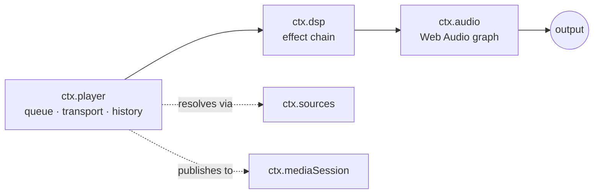
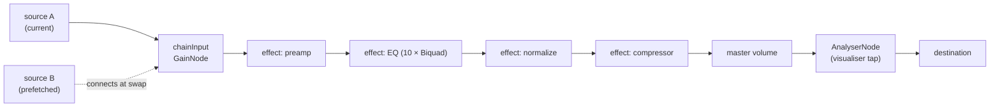

# 音频引擎与 Web Audio 核心契约

> **历史章节映射：** 原 `docs-zh/05-audio-playback.md §1`。

> **本文回答什么。** 声音究竟是如何发出来的：音频引擎契约、播放控制与队列状态机、DSP 效果如何组合成效果链，以及播放如何在打断、路由切换与后台运行中存活。

三层服务，逐层叠加：



`ctx.player` 决定*播放什么*。`ctx.dsp` 决定*听起来怎样*。`ctx.audio` 拥有音频图，并且是唯一触碰平台的组件。

---

## 1. `ctx.audio` —— 引擎

依据 [ADR-4](../architecture/overview.md#adr-4--react-native-audio-api-是所有目标平台上首要的播放与-dsp-引擎)，契约**就是** Web Audio API 本身。`react-native-audio-api` 在 iOS 与 Android 上实现了它，并为 Electron 渲染进程提供 web 构建，因此同一份音频图描述可以处处运行。

```ts
import type { Uri, Disposable } from '@BBeBee/protocol'

export interface AudioSourceHandle {
  readonly node: AudioNode
  readonly durationMs: number
  play(atMs?: number): void
  pause(): void
  stop(): void
  readonly positionMs: number
  /** Fires when the source reaches its natural end. */
  onEnded(cb: () => void): Disposable
  dispose(): void
}

export interface LoadOptions {
  /** Streaming keeps memory flat; buffered enables sample-accurate gapless. */
  strategy: 'stream' | 'buffer'
  headers?: Record<string, string>
  signal?: AbortSignal
  onBuffered?: (seconds: number) => void
}

export interface AudioService {
  readonly context: BaseAudioContext
  readonly destination: AudioNode
  readonly sampleRate: number
  readonly outputLatencyMs: number

  /** Load a remote URL or a local Uri into a playable source node. */
  load(src: string | Uri, opts: LoadOptions): Promise<AudioSourceHandle>

  /** Where ctx.dsp inserts its chain. Sources connect here, not to destination. */
  readonly chainInput: AudioNode

  setVolume(v: number): void         // 0..1, applied post-chain
  setMuted(m: boolean): void

  listOutputDevices(): Promise<{ id: string; label: string; isDefault: boolean }[]>
  setOutputDevice(id: string): Promise<void>

  /** Interruptions, route changes, focus loss. See §5. */
  onInterruption(cb: (e: { type: 'began' | 'ended'; shouldResume: boolean }) => void): Disposable
  onRouteChange(cb: (e: { reason: 'device-removed' | 'device-added' | 'override' }) => void): Disposable
}
```

### 图拓扑



`chainInput` 存在的意义在于：音源可以随时来去而完全不触碰效果链，效果链可以随时重建而完全不触碰正在播放的音源。两者的生命周期被解耦了。

### 加载策略与容错回退 (Resilient Fallback)

`ctx.audio.load(src, { strategy })` 实现了双通道加载路径：
- **`strategy: 'buffer'`**：拉取二进制流到 `ArrayBuffer` 并解码为 `AudioBuffer`，挂载至 `chainInput`。为本地音频与 Gapless 无缝换曲提供样本级精确调度。
- **`strategy: 'stream'`**：通过 `context.createMediaElementSource()` 挂载至媒体元素，保持内存占用恒定。
- **解码回退 (Decode Fallback)**：当 `decodeAudioData()` 遇到无法解码的格式（`.m4a` 中的 ALAC、Hi-Res FLAC、带 ID3v2 头的 FLAC——报 `Unable to decode audio data`）时，`core-audio-webaudio` 降级到媒体元素——其解码覆盖面与 `decodeAudioData` 不同，ALAC 与 24-bit FLAC 均可播放。请求头通过播放器的 `stream.setHeaders` 按主机注册送达元素。
- **桌面端原生高保真引擎 (`@BBeBee/core-audio-mpv`)**：
  - **崩溃隔离原生独立可执行文件 (Crash Isolation & Standalone Executable)**：基于官方 libmpv 与编译生成的独立 native `audio-engine` 二进制可执行文件（`apps/desktop/bin/audio-engine` 或 `.exe`），采用标准 stdio JSON-IPC 与 Electron 主进程通信。任何底层驱动崩溃、音频设备热插拔异常或 native 信号错误均由独立进程隔离，由 `AudioEngineSupervisor` 自动监控并执行优雅自愈重连，保证主进程与渲染界面丝滑稳定。
  - **PCM 不走 IPC 与系统音频直通 (Zero-IPC for PCM)**：音频解码后的高采样率 PCM 流在原生子进程内直接送入 mpv 自身的音频输出端点（Windows `ao=wasapi`、macOS `coreaudio`、Linux `pulse,alsa,pipewire`），严禁跨进程高带宽低效传输 PCM 原始数据。
  - **原生 DSP/EQ 链**：原生引擎内部以 libavfilter 链（`equalizer` / `volume` / `acompressor`）实现 10 段均衡器、前级增益与压限器，监听 `dsp/chain-changed` 动态热更新音频滤镜管线。已用合成单音做端到端实证：+6 dB 频段增益在引擎自身 `astats` 抽头上实测 +6.00 dB。
  - **无缝交接（append + 重绑定）**：`ctx.audio.preloadNext`（协议可选成员）在当前曲目播放期间把下一首追加进引擎内部播放列表（`loadfile append`）；播放列表边界处 mpv 在自身内部无缝前进，不重启解码器。播放器端 ended→load 往返随后**重绑定**到已在发声的文件：引擎将请求 uri 与当前 `path` 比较（不区分方案——mpv 会剥离 `file://`），且仅当文件不在 EOF（单曲循环重播必须从头开始）时，回复 `loaded` 并带 `resumed: true` 而非任何替换。不带位置参数的 `play()` 永不 seek，重绑定的曲目保持连续发声。
  - **原生设备查询**：输出设备枚举优先走 mpv 自身的 `audio-device-list`（原生设备名作为 id，`auto` 为系统默认），引擎无法应答时回退 Chromium 枚举 + 原生标签解析。mpv 命名空间的 id 直接转发给引擎；另一引擎命名空间的陈旧 id 仍可通过共享标签匹配路径工作。
  - **构建与分发**：二进制由 CI 按平台编译（`scripts/build-audio-engine.js`，三平台矩阵 + `--version` 冒烟），并由 `scripts/fetch-libmpv.js`（系统搜索、`LIBMPV_PATH` 覆盖、带 SHA256 校验的 Windows 预编译下载）staged 各平台 libmpv 后经 electron-builder `extraResources` 打包。无 libmpv 的机器上引擎报告加载失败，渲染端降级到媒体元素（Chromium 解码）。
  - **统一 AudioAnalyser 与 WebGL 频谱画布**：`audio-engine` 内部就地由真实音频电平（基于 `astats` 滤镜元数据）驱动计算频谱，经由极轻量 stdio JSON-IPC 与 bridge 通道将频域帧推送到渲染进程，通过统一的 `AudioAnalyser`（`NativeMpvImpl` / `WebAudioImpl`）抽象供给渲染层，在 WebGL Canvas 上利用 GPU 着色器实现高性能流畅渲染。
- **移动端音频引擎架构 (`MobileAudioService` in `apps/mobile`)**：
  - **实际交付的生产级引擎 (路线 A: `@BBeBee/core-audio-webaudio` via `react-native-audio-api`)**：当前移动端运行的生产级音频图引擎，直接基于移动端底层音频子系统（Apple CoreAudio / Android Oboe/AAudio）。提供低延迟音频缓冲、系统后台音频播放与音频焦点打断处理。
  - **规划中架构目标 (路线 B: `@BBeBee/core-audio-mpv` 进程内 libmpv JNI/JSI)**：移动端发烧级音频架构路线图目标。由于 iOS 沙盒严格禁止派生子进程（禁止 `fork`/`posix_spawn`），且 Android 后台会冻结独立子进程，移动端设计为**进程内共享动态库（In-process Dynamic Library `libmpv.so` / `mpv.framework`）**结合 TurboModule JSI 桥接。在原生动态库未编译打包的环境中，`MobileAudioService` 自动兜底运行在路线 A (WebAudio)，移动端设置 UI 明确将 MPV Hi-Fi 标注为「规划中」并禁用，确保不会发生空跑静音。
  - **状态连续性与系统打断管理**：引擎切换时自动保持当前曲目 URL、加载选项与播放进度位置并执行恢复。移动端系统音频焦点打断（电话呼入、闹钟、语音助手）与硬件路由变更（拔出耳机）由系统层统一监听并优雅响应。
- **设置中的音频输出引擎与设备选择 (`audioOutputEngine`, `audioOutputDeviceId`)**：
  用户可在桌面端设置界面的「音频输出引擎与设备」中自由配置驱动与物理设备：
  - **MPV Hi-Fi（Windows 默认）**：独立 native 原生引擎，WASAPI 直通输出、原生 DSP/EQ 与 FFT 可视化。
  - **WebAudio**：标准 Web Audio 共享混音图。
  - **可选择的音频输出设备**：
    - **系统硬件设备全量探测**：Electron 主进程通过授予 `'speaker-selection'` 与 `'media'` 权限解除 Chromium 设备标签屏蔽，并配合底层 OS 查询通道（Windows 注册表与 CIM MMDevices、macOS System Profiler、Linux pactl/aplay），精准获取当前系统中所有物理扬声器、耳机和外接 USB DAC 的真实友好名称（Friendly Name）。
    - **驱动目的地实时锁定**：用户下拉选中目标设备后，系统将设备 ID 持久化至 `settings.audioOutputDeviceId`，并在应用启动及切换时驱动当前引擎重新路由——mpv 引擎优先走自身的 `audio-device-list`（见上），WebAudio 引擎经 `AudioContext.setSinkId` 与桥接原生设备解析双路路由（共享代码，两引擎不漂移）。
- **发烧级无损音频格式与本地扫描器支持**：
  本地扫描器通过纯 JavaScript 的 `music-metadata` 栈读取标签与时长——整个产品不依赖任何外部解码器进程：
  - **ALAC 与 `.m4a`**：此前扫描器在遇到包含 ALAC 编码的 `.m4a` 文件时，因 Chromium 原生不支持而判定为非法编码并报错丢弃。现已通过在 `supportedFormats()` 注册 ALAC 并配合头解析，实现完整导入。
  - **更多无损格式**：`.ape` (Monkey's Audio)、`.wv` (WavPack)、`.dsf` / `.dff` (DSD 音频)、`.m4b`（有声书）现均已加入本地扫描器默认识别扩展名（`DEFAULT_EXTENSIONS`）与元数据解析（`core-codec-node`）。特殊容器的播放覆盖由 MPV 引擎（libmpv）承担；WebAudio 引擎播放 Chromium 能解码的格式。

### 逃生通道

如果 `react-native-audio-api` 在某个平台上被证明不可用，`core-audio-rntp` 可以基于 `react-native-track-player` 实现 `AudioService`，此时 `chainInput` 退化为 no-op，效果降级为平台自带的原生 EQ。`ctx.player` 与每一个效果插件都不受影响。抽象就是那份保险，而正因为契约是标准契约，这份保险才足够便宜。

---

