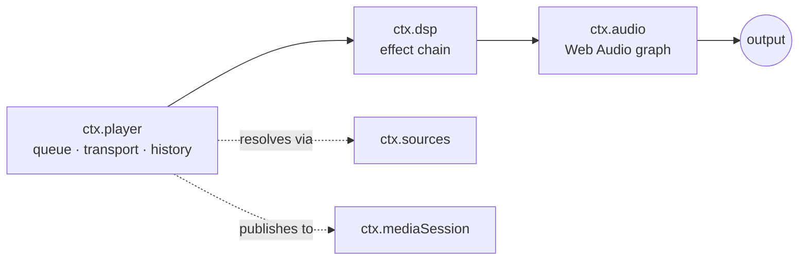
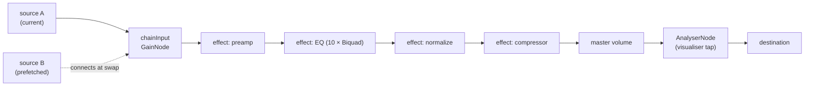

# 音频引擎与 Web Audio 核心契约

> **历史章节映射：** 原 `docs-zh/05-audio-playback.md §1`。

> **本文回答什么。** 声音究竟是如何发出来的：音频引擎契约、播放控制与队列状态机、DSP 效果如何组合成效果链，以及播放如何在打断、路由切换与后台运行中存活。

三层服务，逐层叠加：



`ctx.player` 决定*播放什么*。`ctx.dsp` 决定*听起来怎样*。`ctx.audio` 拥有音频图，并且是唯一触碰平台的组件。

---

## 1. `ctx.audio` —— 引擎

依据 [ADR-4](../architecture/overview.md#adr-4--react-native-audio-api-是所有目标平台上首要的播放与-dsp-引擎)，契约**就是** Web Audio API 本身。`react-native-audio-api` 在 iOS 与 Android 上实现了它，并为 Electron 渲染进程提供 web 构建，因此同一份音频图描述可以处处运行。

```ts
import type { Uri, Disposable } from '@BBeBee/protocol'

export interface AudioSourceHandle {
  readonly node: AudioNode
  readonly durationMs: number
  play(atMs?: number): void
  pause(): void
  stop(): void
  readonly positionMs: number
  /** Fires when the source reaches its natural end. */
  onEnded(cb: () => void): Disposable
  dispose(): void
}

export interface LoadOptions {
  /** Streaming keeps memory flat; buffered enables sample-accurate gapless. */
  strategy: 'stream' | 'buffer'
  headers?: Record<string, string>
  signal?: AbortSignal
  onBuffered?: (seconds: number) => void
}

export interface AudioService {
  readonly context: BaseAudioContext
  readonly destination: AudioNode
  readonly sampleRate: number
  readonly outputLatencyMs: number

  /** Load a remote URL or a local Uri into a playable source node. */
  load(src: string | Uri, opts: LoadOptions): Promise<AudioSourceHandle>

  /** Where ctx.dsp inserts its chain. Sources connect here, not to destination. */
  readonly chainInput: AudioNode

  setVolume(v: number): void         // 0..1, applied post-chain
  setMuted(m: boolean): void

  listOutputDevices(): Promise<{ id: string; label: string; isDefault: boolean }[]>
  setOutputDevice(id: string): Promise<void>

  /** Interruptions, route changes, focus loss. See §5. */
  onInterruption(cb: (e: { type: 'began' | 'ended'; shouldResume: boolean }) => void): Disposable
  onRouteChange(cb: (e: { reason: 'device-removed' | 'device-added' | 'override' }) => void): Disposable
}
```

### 图拓扑



`chainInput` 存在的意义在于：音源可以随时来去而完全不触碰效果链，效果链可以随时重建而完全不触碰正在播放的音源。两者的生命周期被解耦了。

### 加载策略与容错回退 (Resilient Fallback)

`ctx.audio.load(src, { strategy })` 实现了双通道加载路径：
- **`strategy: 'buffer'`**：拉取二进制流到 `ArrayBuffer` 并解码为 `AudioBuffer`，挂载至 `chainInput`。为本地音频与 Gapless 无缝换曲提供样本级精确调度。
- **`strategy: 'stream'`**：通过 `context.createMediaElementSource()` 挂载至媒体元素，保持内存占用恒定。
- **高位深与 ALAC 解码回退 (FFmpeg Bridge)**：Chromium 原生 `decodeAudioData()` 无法解码 Apple Lossless (ALAC) 格式或某些 24-bit/32-bit Hi-Res 音频。桌面端 `core-audio-webaudio` 与 `core-audio-wasapi` 自动调用主进程的 FFmpeg 解码器 (`audio.decodePcm`)，将音频精确解算为 Float32 PCM 声道并直接灌入 `AudioBuffer`，实现无损兼容。
- **WASAPI 硬件独占输出与 Web Audio DSP (`@BBeBee/core-audio-wasapi`)**：
  实现了**范式一（Web Audio 作为纯 DSP 处理核心，旁路导出至 WASAPI 独占输出）**：
  Web Audio 负责执行完整的 `ctx.dsp` 效果器链（10 段 EQ、前级放大、动态压缩）与频谱可视化 (`AnalyserNode`)。通过 `WasapiSinkProcessor` (AudioWorklet) 拦截最终的 Float32 PCM，借由无锁环形队列 (`SharedRingBuffer`) 回传主进程，绕过 Chromium 默认的系统共享混音器（规避 Windows Shared Mode 的强制重采样与精度损耗），通过 WASAPI Exclusive 模式直接以硬件原生采样率与位深直推声卡 DAC。
- **设置中的音频输出引擎切换 (`audioOutputEngine`)**：
  用户可在桌面端设置界面的「音频输出引擎与设备」中自由切换：
  - **系统默认 WebAudio**：通过操作系统共享混音器输出，多软件混音兼容（与浏览器、游戏、系统提示音共存）。
  - **WASAPI 独占 Hi-Res**：硬件独占锁定声卡，绕过系统混音，点对点输出至硬件 DAC。
  - **硬件排他性独占提示（安全告警）**：
    > ⚠️ **硬件排他性独占提示**：启用 WASAPI 独占模式后，播放器将独占锁定声卡硬件。在音频播放期间，计算机上的其他软件（如浏览器网页、视频播放器、游戏及系统提示音）可能会被暂时静音或无法发声。若需同时使用其他音频软件，请随时切回“系统默认 WebAudio”。设置在切换歌曲或重新开始播放时生效。
- **发烧级无损音频格式与本地扫描器支持**：
  桌面端集成 FFmpeg 旁路解码器，打通了全链路无损音频体系：
  - **ALAC 与 `.m4a`**：此前扫描器在遇到包含 ALAC 编码的 `.m4a` 文件时，因 Chromium 原生不支持而判定为非法编码并报错丢弃（`unsupported codec: ALAC is not supported on this platform`）。现已通过在 `supportedFormats()` 注册 ALAC 并配合 FFmpeg 解码，实现完整解析与导入。
  - **更多无损格式**：`.ape` (Monkey's Audio)、`.wv` (WavPack)、`.dsf` / `.dff` (DSD 音频)、`.m4b`（有声书）现均已加入本地扫描器默认识别扩展名（`DEFAULT_EXTENSIONS`）、元数据解析（`core-codec-node`）与解码通道。

### 逃生通道

如果 `react-native-audio-api` 在某个平台上被证明不可用，`core-audio-rntp` 可以基于 `react-native-track-player` 实现 `AudioService`，此时 `chainInput` 退化为 no-op，效果降级为平台自带的原生 EQ。`ctx.player` 与每一个效果插件都不受影响。抽象就是那份保险，而正因为契约是标准契约，这份保险才足够便宜。

---

