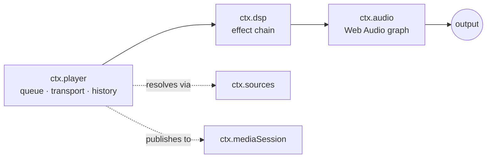
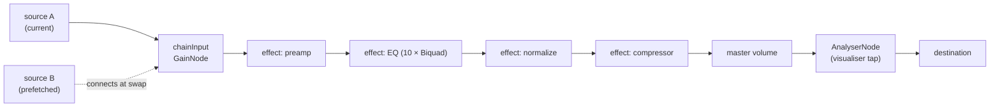

# 音频引擎与 Web Audio 核心契约

> **历史章节映射：** 原 `docs-zh/05-audio-playback.md §1`。

> **本文回答什么。** 声音究竟是如何发出来的：音频引擎契约、播放控制与队列状态机、DSP 效果如何组合成效果链，以及播放如何在打断、路由切换与后台运行中存活。

三层服务，逐层叠加：



`ctx.player` 决定*播放什么*。`ctx.dsp` 决定*听起来怎样*。`ctx.audio` 拥有音频图，并且是唯一触碰平台的组件。

---

## 1. `ctx.audio` —— 引擎

依据 [ADR-4](../architecture/overview.md#adr-4--react-native-audio-api-是所有目标平台上首要的播放与-dsp-引擎)，契约**就是** Web Audio API 本身。`react-native-audio-api` 在 iOS 与 Android 上实现了它，并为 Electron 渲染进程提供 web 构建，因此同一份音频图描述可以处处运行。

```ts
import type { Uri, Disposable } from '@BBeBee/protocol'

export interface AudioSourceHandle {
  readonly node: AudioNode
  readonly durationMs: number
  play(atMs?: number): void
  pause(): void
  stop(): void
  readonly positionMs: number
  /** Fires when the source reaches its natural end. */
  onEnded(cb: () => void): Disposable
  dispose(): void
}

export interface LoadOptions {
  /** Streaming keeps memory flat; buffered enables sample-accurate gapless. */
  strategy: 'stream' | 'buffer'
  headers?: Record<string, string>
  signal?: AbortSignal
  onBuffered?: (seconds: number) => void
}

export interface AudioService {
  readonly context: BaseAudioContext
  readonly destination: AudioNode
  readonly sampleRate: number
  readonly outputLatencyMs: number

  /** Load a remote URL or a local Uri into a playable source node. */
  load(src: string | Uri, opts: LoadOptions): Promise<AudioSourceHandle>

  /** Where ctx.dsp inserts its chain. Sources connect here, not to destination. */
  readonly chainInput: AudioNode

  setVolume(v: number): void         // 0..1, applied post-chain
  setMuted(m: boolean): void

  listOutputDevices(): Promise<{ id: string; label: string; isDefault: boolean }[]>
  setOutputDevice(id: string): Promise<void>

  /** Interruptions, route changes, focus loss. See §5. */
  onInterruption(cb: (e: { type: 'began' | 'ended'; shouldResume: boolean }) => void): Disposable
  onRouteChange(cb: (e: { reason: 'device-removed' | 'device-added' | 'override' }) => void): Disposable
}
```

### 图拓扑



`chainInput` 存在的意义在于：音源可以随时来去而完全不触碰效果链，效果链可以随时重建而完全不触碰正在播放的音源。两者的生命周期被解耦了。

### 逃生通道

如果 `react-native-audio-api` 在某个平台上被证明不可用，`core-audio-rntp` 可以基于 `react-native-track-player` 实现 `AudioService`，此时 `chainInput` 退化为 no-op，效果降级为平台自带的原生 EQ。`ctx.player` 与每一个效果插件都不受影响。抽象就是那份保险，而正因为契约是标准契约，这份保险才足够便宜。

---

