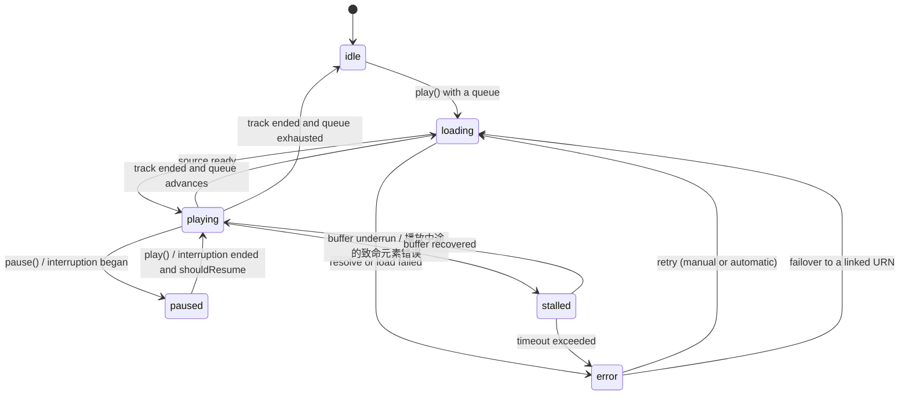
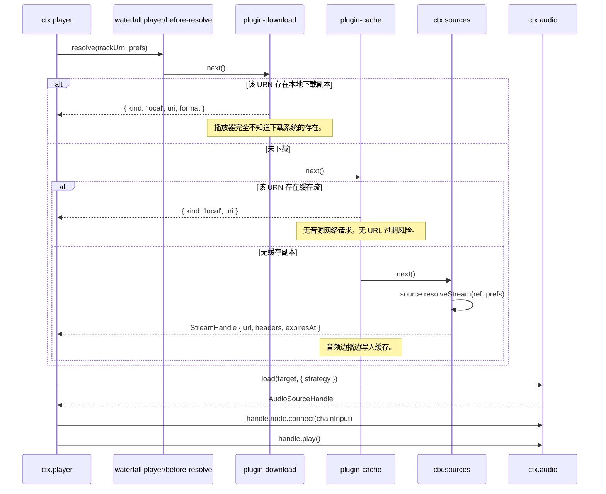

# 播放控制状态机与队列管理

> **历史章节映射：** 原 `docs-zh/05-audio-playback.md §2，§4 – §8`。

## 2. `ctx.player` —— 播放控制与队列

```ts
export type PlayMode = 'shuffle' | 'sequence' | 'single-loop' | 'list-loop'
export type RepeatMode = 'off' | 'all' | 'one'

export interface QueueItem {
  id: string
  trackUrn: string
  /** 来源上下文 —— 专辑、歌单、电台等，用于驱动“来源播放列表”。 */
  sourceContext?: { kind: 'album' | 'playlist' | 'artist' | 'search' | 'radio' | 'local' | 'favorites'; urn?: string; label?: string }
  addedBy: 'user' | 'autoplay' | 'radio'
}

export interface TransportState {
  status: 'idle' | 'loading' | 'playing' | 'paused' | 'stalled' | 'error'
  currentItemId?: string
  trackUrn?: string
  positionMs: number
  durationMs: number
  bufferedMs: number
  volume: number
  muted: boolean
  repeat: RepeatMode
  shuffle: boolean
  playMode: PlayMode
  error?: { code: string; message: string; retryable: boolean }
}

export interface PlayerService {
  readonly state: Readonly<TransportState>
  readonly currentStream?: Readonly<StreamHandle>

  play(): Promise<void>
  pause(): void
  togglePlay(): void
  stop(): void
  seek(positionMs: number): Promise<void>
  next(): Promise<void>
  previous(): Promise<void>       // 若当前进度超过阈值则重启当前曲目 —— 详见下文

  setVolume(v: number): void
  setMuted(m: boolean): void
  setRepeat(m: RepeatMode): void
  setShuffle(on: boolean): void
  setPlayMode(mode: PlayMode): void
  cyclePlayMode(): PlayMode

  // 队列
  readonly queue: readonly QueueItem[]
  /** 位于当前播放曲目之后的后续列表，按真实播放顺序排列（随机播放下为排列后的序列）。 */
  upcoming(): QueueItem[]
  playNow(urns: string[], opts?: { startIndex?: number; context?: QueueItem['sourceContext'] }): Promise<void>
  playFromContext(urn: string, contextUrns?: readonly string[], opts?: { startIndex?: number; context?: QueueItem['sourceContext'] }): Promise<void>
  enqueueNext(urns: string[]): void
  enqueueLast(urns: string[]): void
  removeItems(ids: string[]): void
  moveItem(id: string, toIndex: number): void
  clearQueue(): void

  // 历史记录
  getHistory(opts?: { limit?: number; offset?: number; date?: string }): Promise<PlayRecord[]>
  getHistoryStats(): Promise<PlayHistoryStats>
  getHistoryHeatmap(days?: number): Promise<PlayHistoryHeatmapDay[]>
  clearHistory(): Promise<void>
  removeHistory(idOrUrn: string): Promise<void>
}
```

### 播放控制状态机



有几处行为值得钉死，因为播放器"手感不对"往往就出在这里：

- **`previous()`** 在 position > 3000 ms 时重启当前曲目，否则切回上一首。阈值可配置，默认值与所有其他播放器给用户养成的习惯一致。
- **`playFromContext(urn, contextUrns)`** 是列表行点击的标准语义。若队列中已包含该曲目，则保留当前队列并直接跳转至该条目 —— 用户构建的队列绝不会被静默重排或覆盖。若队列中不存在该曲目，则点击行所属的上下文列表（`contextUrns`：整张专辑曲目、全部本地曲库等）成为新队列，并从被点击位置开始播放；若无可用的上下文，则该曲目单独播放。
- **随机播放（shuffle）** 持久化的是**一个种子加上一个排列**，而不是每次现选的随机结果。这让乱序在重启后保持稳定，让 `previous()` 仍有意义，也让即将播放的队列能够如实展示。
  - **在随机播放下选择曲目 (`rotateShuffle`)**：当用户在随机模式开启时从列表中选择某首特定歌曲（例如点击专辑或歌单中的某首歌），播放器立即播放所选曲目。`QueueModel.rotateShuffle(firstId)` 会循环旋转排列序列，将所选歌曲置于索引 0，其余曲目紧随其后保持伪随机顺序。如果未指定曲目（例如点击“随机播放全部”），则从排列序列头部开始播放。
  - **随机播放永不枯竭**：当排列序列播放完毕时，`next()` 会循环回到头部（`previous()` 循环回到尾部），无论 `repeat` 标记为何 —— 随机队列从定义上就是环形的。只有未开启列表循环的普通顺序播放到达末尾才会停止并进入空闲状态。
- **单曲循环**不重新解析流，而是复用已加载的缓冲。
- **`stalled`** 与 `paused` 是两回事。UI 显示的是转圈，而不是播放按钮，并且 `ctx.mediaSession` 继续上报 `playing`，以免锁屏界面闪烁。
- **开始播放之后才发生的致命错误按 underrun 上报，而不是按自然结束。** 两个引擎均遵循这一原则：WebAudio 的 `StreamedHandle` 在其媒体元素中途死亡（CDN 断流、URL 过期）时上报 `onStalled(true)`；mpv 的 `MpvSourceHandle` 在原生引擎报告致命错误（`MPV_END_FILE_REASON_ERROR`，状态置为 `'error'`）时亦同。当中途失败被当作自然结束时，播放器会误将其记为完整播放并直接切下一首，而在断网下下一首只能无声卡在 0:00。作为 stall 上报，则会经由看门狗触发 `stalled → error`，并在冻结位置变成可重试的网络错误（点击播放即可重试）。曲目从未出声就报错的死链仍会上报 `ended`，以便队列跳过坏链。
- **时长是下限而非承诺**：只要媒体元素提供了有效时长，播放器就上报 `source.durationMs`；否则回退到目录行中存储的时长 —— Bilibili 的 fMP4 流正是典型场景，媒体元素上报 `Infinity`，但搜索规则早已获取了曲目时长。只有支持 seek 的句柄才享受此回退，因此直播流依然不显示进度滑块。
- **进度位置始终来自媒体元素时钟**：流式句柄仅在媒体元素实际发生跳转时将 seek 目标标记为 *挂起 (pending)*：对全新元素调用 `play(0)` 不会移动位置也不会触发 `seeked`，若记为挂起会导致整首歌的进度条一直卡在零。

### 播放模式 (`PlayMode`)

播放器将队列遍历与循环控制统一收敛为 4 种明确的播放模式：

| 模式 | 键值 | `shuffle` | `repeat` | 队列行为说明 |
|---|---|---|---|---|
| **顺序播放** | `'sequence'` | `false` | `'off'` | 按队列顺序逐曲播放，播至队尾停止播放。 |
| **单曲循环** | `'single-loop'` | `false` | `'one'` | 单曲循环重放，复用已加载音频缓冲，不重新解析媒体流。 |
| **列表循环** | `'list-loop'` | `false` | `'all'` | 按队列顺序逐曲播放，队尾自动循环回到第一首。 |
| **随机播放** | `'shuffle'` | `true` | `'all'` | 基于伪随机种子排列乱序播放并无限循环。 |

- **模式循环**：`cyclePlayMode()` 按业界标准次序切换：`顺序播放 (sequence)` $\to$ `单曲循环 (single-loop)` $\to$ `列表循环 (list-loop)` $\to$ `随机播放 (shuffle)` $\to$ `顺序播放`。
- **双向兼容**：调用旧版 `setRepeat()` 或 `setShuffle()` 会通过 `derivePlayMode()` 自动联动更新 `state.playMode`；反之调用 `setPlayMode()` 会同步配置底层队列的 `repeat` 与 `shuffle` 状态。

### 解析流水线

从"队列前进了一格"到"声音出来了"之间发生的事。这是插件架构回报最直观的一段时序。



失败时，流水线会被重新进入而不是立刻把错误抛给用户：`UnavailableError`——或来自某个规则已腐化的源的 `RuleError`（[sources/authoring.md §7](../sources/authoring.md#7-错误)）——会先触发一次 `track_links`（[data-model/schema.md §4.4](../data-model/schema.md#44-身份关联)）查询，寻找同一录音在其他源上的条目；只有这一步也一无所获，播放器才进入 `error`。

**`plugin-download`** 是第一个监听器：如果用户已下载该文件则直接返回，否则放行。**`plugin-cache`** 是第二个监听器，负责自动流缓存：远程句柄带请求头拉取并在播放时写入 `ctx.paths.cache/stream`，以 `stream:<urn>` 记入 `cache_entries` 表；后续的所有解析直接命中本地缓存，无需请求远程音源。未命中缓存时立即返回远程句柄，绝不拖延播放。缓存按 LRU 算法在 `stream` 类别内淘汰；禁用该插件时曲目降级为普通在线流媒体播放。

封面图片走相同的插件缓存路径：`ctx.cache.artwork(ref)` 返回缓存文件，仅在未命中时下载，并更新 `artworks.local_uri`，使包括锁屏在内的所有读取者均能获取本地 `Uri`。渲染端绑定使用 `useResolvedArtwork` Hook（[ui/architecture.md §4](../ui/architecture.md#4-将服务绑定到-react)）。

下载任务本身是 `download_tasks` 表中的记录，由 Worker 调度并经由 **`ctx.downloads`** 暴露。每秒对已下载字节做检查点保存，暂停或中断后恢复时发送 `Range` 请求而无需从头重下。

**统一目的地与独立缓存**：用户显式下载的曲目存储在 `ctx.paths.downloads/BBeBee/` 且永不自动淘汰；自动流缓存位于 `ctx.paths.cache/stream` 并受预算淘汰。由于 `plugin-download` 优先执行，且两者属于不同数据表（`media_bindings` 与 `cache_entries`），“用户下载了什么”与“偶然播过什么缓存”保持清晰解耦。

**策略是数据表记录而非硬编码**：`download_policies` 记录 `wifi_only` 与 `charging_only` 策略。设备状态变化时自动响应 `ctx.device.onNetworkChange`，条件恢复后自动续传。

### 无缝（gapless）与交叉淡入淡出

- **无缝（gapless）** 使用 `AudioBufferQueueSourceNode`：在当前曲目最后约 15 秒内解码下一首并排入同一个 source 节点，因此交接是采样级精确的，没有 `AudioContext` 调度间隙。它要求 `strategy: 'buffer'`，因此只对本地文件与中短流启用，长流则跳过。
- **交叉淡入淡出（crossfade）** 是另一条路径：两个 source 节点，两段 `crossfadeMs` 的增益斜坡，等功率曲线。它与无缝模式互斥——两者同时开启会产生可听见的双重淡变——因此该设置是三选一：`gapless | crossfade | neither`。
- **mpv 引擎基于追加的无缝播放**：`ctx.audio.preloadNext` 在当前曲目播放时将下一首 src 移交给引擎内部（`loadfile append`）；边界处 mpv 在自身播放列表内前进，播放器端仅需在 ended 后重绑定已在发声的文件（`resumed: true`）——消除了可听见的中断，样本级调度在 mpv 内部完成。实现 `preloadNext` 的引擎绝不执行第二次 `audio.load`（第二次 `load` 等于 `loadfile replace`，会掐断当前曲目）。
- **引擎 paused 是停滞而非静音**：mpv 源句柄轮询引擎状态，若引擎在传输层自称 `playing` 期间报告 `paused`，即被旁路暂停。宽限期（默认 2 秒，`pausedStallMs`）之后按冻结位置上报 stall（从未发声则上报 ended 以便跳过），而不是对静音的引擎无限轮询下去；引擎恢复发声则上报恢复。
- **预取**在距结尾 `max(15s, crossfadeMs + 5s)` 时开始，若队列发生变化则通过 `AbortSignal` 取消。
- **高保真音频解码回退 (`decodeAudioData` 回退)**：本地文件采用 `strategy: 'buffer'` 时调用 Web Audio 的 `decodeAudioData`。若遇到 Chromium 无法解码的格式（如 24 位 Hi-Res FLAC 或带 ID3v2 头的 FLAC，抛出 `Unable to decode audio data`），`core-audio-webaudio` 拦截失败并平滑回退至基于 Chromium 内置 FFmpeg 媒体元素的流式加载，完整保留 `chainInput` 上的 DSP 效果链，避免播放崩溃。
- **桌面端本地音频协议 (`bbebee-file://`)**：标准 Electron 渲染进程在 Chromium Web 安全策略下严禁直接读取 `file://` URL。桌面端主进程注册了特权 scheme `bbebee-file://`，支持安全地从磁盘直接读取并流式缓冲本地音频文件。

### 流偏好配置 (Stream Preferences)

传递给解析流水线的 `prefs` 由播放器组装：`prefs.quality` 来源于播放器的 `quality` 配置（默认 `lossless`），`prefs.saveData` 来源于 `ctx.device.network().metered`，`prefs.acceptFormats` 来源于 `ctx.codec.supportedFormats()`。音源在 `ruleStream` 中按需读取这些偏好。

### 持久化

`playback_state` 在播放期间以 5 秒节流写入，并在暂停、曲目切换与 `ctx.background.onWillSuspend` 时立即写入。启动时播放器会恢复队列与进度，但**不会自动播放**——一启动就出声是吓人的，尤其当那部手机刚在口袋里被点亮的时候。

### 响度标准化与 ReplayGain

为消除来自不同来源的歌曲和专辑之间听感响度忽大忽小的落差，BBeBee 提供了符合 ReplayGain 2.0 与 EBU R128 标准（-14 LUFS 流媒体基准）的响度标准化能力：
- **全局偏好设置配置 (`AppSettings`)**：
  - `loudnessNormalizationEnabled: boolean`：总开关。
  - `loudnessNormalizationMode: 'track' | 'album' | 'dynamic'`：单曲均衡（每首曲目匹配目标响度）、专辑均衡（保持整张专辑内动态对比）、或动态 EBU R128（实时 `loudnorm` 测量）。
  - `loudnessTargetLufs: number`：目标响度参考值（默认 -14 LUFS 流媒体标准、-18 LUFS 古典安静、-11 LUFS 高响度）。
  - `loudnessPreampDb: number`：前级校准微调。
- **切歌自动同步**：
  在 `player/track-changed` 事件触发时，`plugin-dsp` 读取当前音轨的元数据（`replayGainTrack` 或 `replayGainAlbum`）。在 Web Audio 模式下计算目标增益偏差并通过 `setTargetAtTime` 在 20 ms 内平滑拉平，消除任何咔哒爆音；在 MPV 模式下直接通过原生 ReplayGain 属性传递并启用防削波保护（`replaygain-clip`），同时避免向 libavfilter 注入重复的 `volume` 滤镜造成二次缩放。
- **接口化贡献呈现**：
  该功能通过 `ctx.ui.contribute({ kind: 'settings', id: 'settings.loudness-normalization', ... })` 动态注册于设置的播放分类中，由 `LoudnessNormalizationCard` 渲染，绝不硬编码。

---

## 4. 媒体会话集成

`ctx.player` 在每次曲目变化与状态变化时发布到 `ctx.mediaSession`，position 则节流为每秒一次。命令经由 `onCommand` 反向流入。

在移动端，封面图必须是本地 `Uri`，因此封面缓存在 `update()` 被调用前完成解析与下载；曲目切换时先立即发布不带封面的元数据，图片就绪后再更新一次，而不是拖住整个更新。

---

## 5. 打断、焦点与路由

这件事只在 `ctx.player` 中处理一次，依据的是 `ctx.audio` 的事件。每个平台的规则各不相同，但*策略*是统一的。

| 事件 | 策略 |
|---|---|
| 来电 / 闹钟开始 | 暂停。记住之前正在播放 |
| 打断结束且 `shouldResume` | 仅当确因该原因暂停、且此后用户未干预时才恢复 |
| 其他应用抢占音频焦点（Android） | 暂停。不要 duck——音乐播放器被 duck 是不对的 |
| 瞬时 duck 请求（导航播报） | 200 ms 内把主音量降到 20%，之后恢复 |
| 拔出耳机 / 蓝牙断开 | **立即暂停。**绝不在扬声器上继续 |
| 新输出设备接入 | 在当前设备上继续；没有用户操作不做迁移 |
| 输出设备在播放中消失 | 暂停，给出提示，提供切换选项 |

"拔耳机即暂停"这条规则重要到被设为不可配置。它是用户唯一一次都不会原谅的音频行为。

事件的产生源头是外壳的职责 —— `ctx.audio` 仅发布外壳转交的事件（`emitInterruption` / `emitRouteChange`）：
- **移动端**：`apps/mobile/src/boot.ts` 监听 `AudioManager` 的 `interruption` 与 `routeChange` 系统事件并直接转发，携带 OS 的 `shouldResume`。
- **桌面端**：桌面外壳在两个引擎上均启用 `emitContextInterruptions`，将 `AudioContext` 的状态变迁（`running → suspended/interrupted → running`）翻译为 `began`/`ended` 事件并记录日志。这些事件携带 `shouldResume: false`，但用户点击播放本身会恢复挂起的上下文。

---

## 6. 播放与后台

交叉参考 [architecture/layers.md §4](../architecture/layers.md#4-后台意味着什么)。具体来说：

- **iOS** —— `UIBackgroundModes: ['audio']`，audio session 类别为 `playback`。播放可以无限持续；*非音频*的工作则不行。
- **Android** —— 一个带媒体通知的前台服务，播放开始时启动，播放结束时停止。没有它，进程会在几分钟内被杀掉。
- **桌面** —— 渲染进程必须保持存活，因此在音频播放时关闭窗口会隐藏到托盘。`powerSaveBlocker` 用于防止在某些 Windows 配置上屏幕休眠连带挂起音频线程。

---

## 7. 测试音频

音频很难测，所以策略是分层展开而非端到端：

1. **效果确定性** —— 每个效果的 `EffectDefinition.build` 都在 `OfflineAudioContext` 中对一份已知输入缓冲运行；输出与存储的参考值在容差内比对。这能抓住滤波系数的意外改动——否则这些改动要等到有人听出 EQ 不对劲才会被发现。
2. **播放控制状态机** —— 针对 mock 的 `AudioService` 做纯单元测试。§2 图中的每一条转移都有测试，包括加载中途被打断、预取中途队列变化。
3. **解析流水线** —— 对 `player/before-resolve` 瀑布（waterfall）钩子分别在加载与未加载 `plugin-download` 的情况下测试，断言除所选目标不同外播放器行为完全一致。
4. **真机冒烟测试** —— 每个发布版本执行一次手工矩阵：锁屏、蓝牙、拔耳机、来电、无缝边界、后台存活。以合理的成本无法自动化，文档对此直言不讳。

---

## 8. 下一步去哪里

[06 —— 音源](../sources/spec.md) 定义 URN 与流句柄从何而来。
