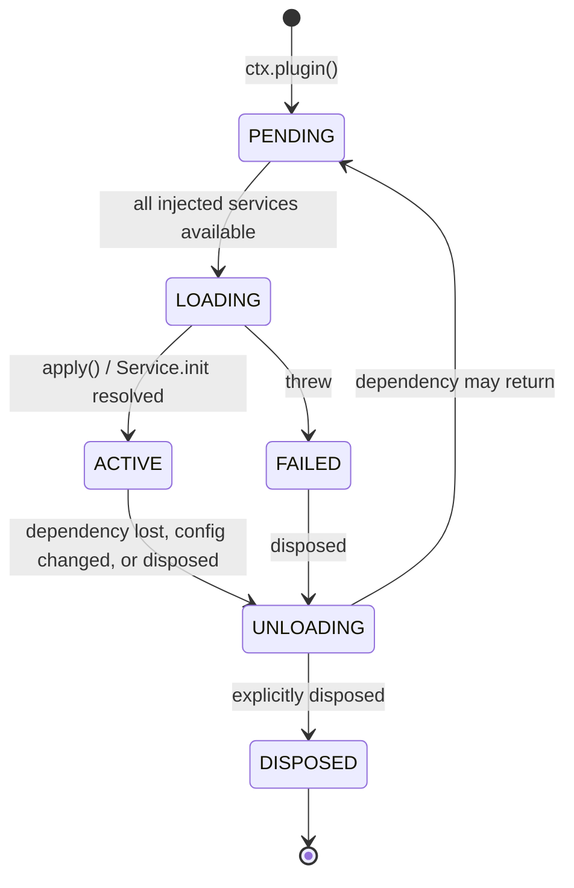

# 插件概念、生命周期与依赖注入

> **历史章节映射：** 原 `docs-zh/03-plugin-system.md §1 – §3`。

> **本篇回答什么。** 一个 BBeBee 插件在物理上是什么、如何声明并接收依赖、生命周期如何管理、
> 在各平台上如何被发现与加载，以及它受（和不受）怎样的约束。

插件是 [02 §1](../architecture/layers.md#1-分层模型) 中的 Layer 2 与 Layer 3。二者在这里的机制完全
相同 —— 同样的清单、同样的生命周期、同样的加载器 —— 而区分核心插件与功能插件的*唯一*一点，
在于它被允许导入什么：核心插件可以触达平台 SDK 与内核的引导表面（bootstrap surface），功能
插件则不可以。这一点值得开篇就讲明，因为下文读起来仿佛只有一种插件，而在架构上二者也确实
几乎就是如此。

下文所有 API 形态均已对照 `cordis@4.0.0-rc.9` 的源码及其测试套件逐一核实。Cordis 目前是发布
候选（release candidate），它自己也如此声明；版本锁定策略见
[09 §5](../workflow/build-pipelines.md#51-cordis-rc-问题)。

---

## 1. 插件是什么

插件有三种形态。Cordis 三者皆可接受；BBeBee 只用前两种。

**一个函数。** 适用于只注册行为、不提供服务的插件。

> ⚠️ **务必写成 `async`。** Cordis 用 `!!func.prototype` 来判断"这是不是一个类"，而普通的
> `function apply(…)` 恰好有原型 —— 于是它会被当成服务那样 `new` 出来，**它返回的 disposer
> 会被丢弃**。插件加载、工作、永不卸载：这正是本架构声称不可能发生的失败，而且在有人问起
> "为什么已卸载插件的服务提供者仍然处于注册状态"之前一直不可见。`async function`、箭头函数
> 与对象方法简写都没有原型，是安全的。`conventions.test.ts` 会对另一种形态直接判构建失败。

```ts
import type { Context } from '@BBeBee/protocol'

export const name = 'plugin-media-keys'
export const inject = ['player', 'device']

export async function apply(ctx: Context) {
  // Returning a function makes it the disposer for this plugin.
  return ctx.device.onMediaKey((key) => {
    if (key === 'play-pause') ctx.player.togglePlay()
    if (key === 'next') ctx.player.next()
  })
}
```

**一个 `Service` 子类。** 适用于要认领服务键的插件。类本身就是插件 —— 把构造函数本身传给
`ctx.plugin()`。

```ts
import { Service } from 'cordis'
import type { Context, PlayerService } from '@BBeBee/protocol'

export class Player extends Service implements PlayerService {
  static inject = ['audio', 'db', 'mediaSession']

  constructor(ctx: Context) {
    super(ctx, 'player')   // claims ctx.player
  }

  // Runs after construction. Dependents stay blocked until it resolves,
  // so ctx.player is never observed half-initialised.
  async [Service.init]() {
    await this.restoreQueue()
    const off = this.ctx.mediaSession.onCommand((c) => this.handle(c))
    return () => {           // returned disposer is collected by the fiber
      off()
      this.audioNode?.disconnect()
    }
  }

  togglePlay(): void { /* … */ }
}
```

**一个带 `apply` 的对象。** 与函数形式等价；当元数据与实现放在一起更易读时使用。

### 元数据字段

每个插件都可以携带以下字段（来自 Cordis 的 `Plugin.Base`）：

| 字段 | 含义 |
|---|---|
| `name` | 诊断用标签。出现在日志、错误堆栈与插件检查器中。务必设置。 |
| `inject` | 本插件所需的服务。见 §3。 |
| `provide` | 本插件将要认领的服务键。让 Cordis 预先知道某个键*即将出现*，从而让依赖方等待而不是失败。 |
| `Config` | 一个 [Standard Schema](https://standardschema.dev) 校验器，用于插件的配置。Zod 4、Valibot 与 ArkType 都满足该规范。Cordis 会在 `apply` 执行前完成校验，并抛出逐一列出所有问题的 `ValidationError`。 |
| `intercept` | 按插件粒度的服务配置覆盖。见 §5。 |

### BBeBee 的附加约定

在 Cordis 之上再加三条约定，由内核与工具链强制执行：

- 每个插件包都附带一份**标准化的 `BBeBee.plugin.json` 清单**（[loading.md §6.3](loading.md#63-插件标准化描述清单bbebeepluginjson)），包含 14 个规范字段：
  `id`、`name`、`displayName`、`description`、`version`、`author`、`engines`、`enabled`、`dependencies`、`systemId`、`moduleId`、`entry`、`capabilities`、`contributes`、`effect`。
  其中 `systemId` 指明所属分层架构 ID（`"layer-1"` 到 `"layer-5"`），`moduleId` 指明功能模块/域 ID（`"sources"`、`"playback"`、`"lyrics"`、`"dsp"`、`"storage"`、`"settings"`、`"inspector"` 等）。
- 插件的**运行时模块拥有一个 default 导出**，即 Cordis 插件本身，因此移动端静态加载器与桌面端动态加载器可以用完全相同的方式对待每一个插件。
- **双模加载架构**：移动端依托 codegen 生成的 `apps/mobile/generated/plugins.ts` 进行纯静态打包；桌面端全面采用动态加载机制 —— 通过 Vite 动态 glob 发现全部工作区内置插件（`getBuiltinPluginRegistry()`），并合流基于特权 `bbebee-plugin://` 协议动态发现的外部第三方插件，无需任何静态生成文件。

---

## 2. 生命周期

Cordis 把插件生命周期建模为一个 **fiber** —— 一台状态机，外加一份释放台账（disposal ledger）。



最关键、也是多数插件系统所缺失的那次转换：**`ACTIVE → UNLOADING → PENDING`**。当插件注入
的某个服务消失时，插件会被拆除并搁置；该服务一旦恢复，插件便从头重建。这也是为什么停用
一个已导入的音源就能干净地移除它贡献的一切，而不需要任何专门的清理代码：音源是数据，但
运行时给每个音源都分派了自己的 fiber，正是为了让它继承这套机制
（[06 §4.1](../sources/runtime.md#41-一个源的生命周期)）。

### 规则：一切副作用都必须经过 fiber

> 插件启动的任何东西，都必须注册，让 fiber 能够停止它。

还有第二条更隐蔽的规则，它源自服务的分发方式：**凡是通过服务代理拿回来的 disposer，都要
包一层**，而不是直接返回。服务都是经 Cordis 的追踪代理（tracing proxy）触达的，从代理里
返回的那个函数并不是 fiber 会收集的那个 —— 所以最直观的写法会在卸载之后把注册留在原地。

```ts
// ❌ Looks right; the effect is still registered after this plugin unloads.
export async function apply(ctx: Context) {
  return ctx.dsp.registerEffect(effect)
}

// ✅ Wrapped in a local closure, which is what gets collected.
export async function apply(ctx: Context) {
  const off = ctx.dsp.registerEffect(effect)
  return () => off()
}
```

```ts
export async function apply(ctx: Context) {
  // ✅ Return a disposer.
  const conn = ctx.ws.connect(url)
  return () => conn.close()
}

export async function apply(ctx: Context) {
  // ✅ Several disposables — use the generator form; they unwind in reverse.
  return ctx.effect(function* () {
    yield ctx.on('player/track-changed', onTrack)   // ctx.on returns its own disposer
    const timer = setInterval(tick, 30_000)
    yield () => clearInterval(timer)
    yield ctx.ui.registerSlot('now-playing.actions', descriptor)
  }, 'scrobbler')
}
```

反模式 —— 以下每一种都会产出一个无法被停用的插件：

```ts
// ❌ Listener outlives the plugin.
window.addEventListener('resize', onResize)

// ❌ Timer keeps firing into a dead context.
setInterval(poll, 1000)

// ❌ Module-level singleton shared across fibers; survives reload with stale state.
let cache = new Map()

// ❌ Escapes the fiber entirely — nothing can cancel it, and it may resolve
//    after unload and touch disposed state.
;(async () => { await longRunningScan() })()
```

对于最后一种情况，应从 fiber 取一个取消信号并遵守它：

```ts
export async function apply(ctx: Context) {
  const ac = new AbortController()
  void ctx.library.scan({ signal: ac.signal }).catch((e) => ctx.logger.error(e))
  return () => ac.abort()
}
```

`ctx.effect()` 的调用可以嵌套，`fiber.getEffects()` 返回带标签的树 —— 内置插件检查器渲染
的正是这棵树，它也是定位泄漏最快的方法。

### 错误

加载期间抛出异常的插件会进入 `FAILED`；它不会拖垮应用，其依赖方只是永远不会激活。`Config`
校验失败会在 `apply` 执行之前抛出 `ValidationError`，并列出全部问题。内核会把错误记录到
`plugin_records.lastError` 并在插件检查器中呈现，因此坏掉的插件是可见的，而非无声失效。

---

## 3. 依赖

`inject` 是需求的声明，而不是导入。加载顺序*由它推导*而来；BBeBee 中没有任何地方手工编排
插件的启动顺序。

```ts
// Array form — the usual case.
export const inject = ['db', 'http', 'fs']

// Object form — the value is that service's INTERCEPT CONFIG, not a marker.
export const inject = { db: null, http: { timeoutMs: 5_000 } }
```

> ⚠️ **`inject` 里写下的每一个键都是必需的，两种形式皆然。** Cordis 的 `Fiber._refresh()`
> 会遍历每个键，只要有一个实现缺失就把 fiber 停在原地；对象形式里的 `null` 值表示"无拦截配置"，
> *绝不是*"可选"。这一点已在 `packages/kernel/src/cordis-assumptions.test.ts` 中断言过，
> 因为很容易想当然。

fiber 保持 `PENDING`，直到每一个注入的服务都 `ACTIVE`。

### 可选依赖

`inject` 没有可选变体。请把它表达为**嵌套的 `ctx.inject()`**：外层插件立即激活，
只有内层代码块在等待。

```ts
export const inject = ['db']            // hard requirement

export async function apply(ctx: Context) {
  ctx.inject(['scrobbler'], (scoped) => {
    // Runs if and when ctx.scrobbler appears; torn down if it goes away.
    return scoped.on('player/track-completed', (p) => scoped.scrobbler.submit(p))
  })
}
```

装饰器形式做的正是这件事，而且读起来更好：

```ts
import { Inject, Service } from 'cordis'

export class Library extends Service {
  @Inject('scrobbler')
  setupScrobbling() {
    // Runs when ctx.scrobbler becomes available, and is torn down if it goes away.
    return this.ctx.on('player/track-completed', (p) => this.ctx.scrobbler.submit(p))
  }
}
```

> ⚠️ 这里的装饰器是 **2023-11 标准装饰器**，而非旧版 TypeScript 形式。Babel 配置（移动端）
> 与 `tsconfig` 都必须相应设置 ——
> [04 §17](../services/contracts.md#17-运行时兼容性清单)。

### 注入什么

只注入*确实需要*的最小集合。一个仅仅为了读取某个设置就注入 `db` 的插件，应该改为注入
`store`，这样即便在数据库打开失败的设备上它仍能加载。过度注入会把软性降级变成硬性故障。

---

