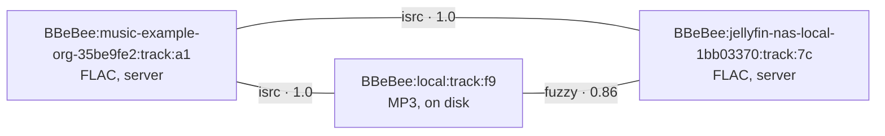

# 音源开发工作流、测试与排障

> **历史章节映射：** 原 `docs-zh/06-music-sources.md §7，§9 – §14`。

## 7. 错误

分类法没有变，只多了一个字符串模型让它无法避免的条目：一条规则可能*是错的*，这与后端*宕机*是两种不同的失败，混为一谈会把用户引向错误的修法。

```ts
export abstract class SourceError extends Error {
  abstract readonly code: string
  abstract readonly retryable: boolean
  constructor(message: string, public readonly sourceId?: string) { super(message) }
}

export class AuthError extends SourceError       { code = 'auth' as const;        retryable = false }
export class RateLimitError extends SourceError  { code = 'rate-limit' as const;  retryable = true
  constructor(message: string, public retryAfterMs: number, sourceId?: string) { super(message, sourceId) } }
export class UnavailableError extends SourceError{ code = 'unavailable' as const; retryable = false }
export class NotFoundError extends SourceError   { code = 'not-found' as const;   retryable = false }
export class NetworkError extends SourceError    { code = 'network' as const;     retryable = true }
export class ProviderError extends SourceError   { code = 'provider' as const;    retryable = false }

/** The document is valid but a rule did not produce what it must. The source needs editing. */
export class RuleError extends SourceError {
  code = 'rule' as const
  retryable = false
  constructor(message: string, public readonly rule: { block: string; field: string }, sourceId?: string) {
    super(message, sourceId)
  }
}

/** Import-time only: the string is not a valid source document. */
export class SourceFormatError extends Error {
  constructor(message: string, public readonly issues: { path: string; message: string }[]) { super(message) }
}
```

| 错误 | `ctx.player` 的反应 | UI 的展示 |
|---|---|---|
| `AuthError` | 停止。发出 `source/auth-expired` | 在该源上原地弹出重新登录提示 |
| `RateLimitError` | 等待 `retryAfterMs`，重试一次，然后跳过 | 静默，除非反复出现 |
| `UnavailableError` | **通过 `track_links` 在别处找同一录音**（[§11](#11-跨源身份与故障转移)）；找不到就跳过 | "Unavailable on <source>"，若存在备选则一并给出 |
| `NotFoundError` | 跳过。标记 `tracks.available = 0` | 列表中该曲目置灰 |
| `NetworkError` | 指数退避，重试 3 次，然后暂停 | "Offline" 横幅；队列保留 |
| `ProviderError` | 跳过，并用后端的原始载荷记录日志 | 通用错误提示，附"复制详情"操作 |
| `RuleError` | 跳过。递增该源的失败计数器 | **"<source> needs updating"**，一键直达测试界面（[§10](#10-诊断一个坏掉的源)） |

任何错误都不允许清空队列。每一条失败路径都保留用户正在听的东西，因此恢复联网 —— 或者修好一条规则 —— 意味着按下播放，而不是重新拼凑一个队列。

> 一个连续三次调用都抛出 `RuleError` 的源会被标记为**过期（stale）**，并带一个徽标沉到源列表底部。它不会被禁用：过期源的缓存曲库仍然可以浏览，它已下载的曲目也仍然能播。自动禁用它，反而会藏起用户重新导入它所需的唯一信号。

---


---

## 9. 导入、更新与分享

整个模型的全部意义所在，因此也是最值得做对的接口面。

```ts
export interface ImportOptions {
  /** Import only these sourceUrls out of a set. Absent means the user picked all of them. */
  select?: string[]
  /** Overwrite an existing source with the same sourceUrl. Default: ask. */
  overwrite?: boolean
  group?: string
}

export interface ImportReport {
  added: SourceRecord[]
  updated: { record: SourceRecord; changedFields: string[] }[]
  unchanged: SourceRecord[]
  /** One malformed entry never rejects the rest of a set. */
  rejected: { index: number; sourceName?: string; error: SourceFormatError }[]
  /**
   * Would overwrite a document the user edited in the app. Needs `overwrite`.
   *
   * Separate from `rejected` because nothing is wrong with these documents —
   * the user is being asked a question, not shown a failure.
   */
  conflicts: { record: SourceRecord; changedFields: string[] }[]
}
```

**字符串可以来自哪里。** 四种途径都汇入同一个 `import()`：

| 输入 | 处理方式 |
|---|---|
| 粘贴的文本 | 单个对象或数组。容忍空白字符与外层的代码围栏 |
| 一个 URL | 抓取后按文本对待。抓取本身不受允许列表约束 —— 它此刻还不是源 —— 但有大小上限并校验内容类型 |
| 一个文件 | 桌面端拖放，移动端文档选择器 |
| 二维码或 `bbebee://source?…` 深链 | 解码为上述之一。分享面板两者都能生成 |

**导入按顺序做什么：** 解析 → 按 schema 校验 → 推导 id → 按 `sourceUrl` 与现有行做 diff → 呈现列表（逐条的添加/更新/跳过，以及主机允许列表）→ 写入选中的行 → 为每个新启用的源启动一个 fiber。

让这一切在实践中站得住脚的规则：

- **没有任何东西被悄悄导入。** 哪怕是单源字符串也会展示确认界面。这是用户唯一一次看到自己同意了什么的机会。
- **一个集合可以被部分导入。** 四十个条目里有一个格式损坏，不会连累另外三十九个；它会带着 schema 问题和自己的位置落进 `rejected`。
- **更新保留身份。** 以 `sourceUrl` 匹配会保留 id、URN、缓存的曲库、jar 与登录态。diff 会指明哪些字段变了，因此重新导入朋友分享的源集合，不会悄悄覆盖用户自己修好的规则。
- **本地编辑会被标记。** 在应用内编辑过的源带有 `locallyModified` 标志；对它重新导入会落进 `conflicts` 而不是 `updated`，并指明将丢失哪些字段，且只有在 `overwrite` 之下才会继续。
- **用户的开关归用户。** 更新绝不会改动 `enabled`。发布修复的作者不能把用户亲手关掉的源重新打开 —— 而一行被禁用的记录，与一行"移除了源但保留曲库"的记录无法区分，因此重新导入不做猜测。
- **导出是对称且干净的。** `export()` 产出同样的数组格式、排好序，并剥除应用维护的字段（`respondTime`、`lastUpdated`、`weight`）与一切凭据（[§5](#5-认证与会话)）。导出 → 导入来回一趟，得到与原来完全相同的集合。

**组织它们。** `sourceGroup` 是自由文本、逗号分隔，也是唯一的组织概念：源列表按组过滤，搜索可以限定在一个组内。源可以单独启用或禁用，被禁用的源其 fiber 会被销毁 —— 它只花一行记录的代价。

---

## 10. 诊断一个坏掉的源

源会腐坏。一个后端改了个字段名，四十条导入的字符串就悄悄返回空。本节是让这个模型可维护而不只是灵活的原因，它不是可选的基础设施。

**`check`** —— 对一个或多个源跑一次健康检查。对每个源：解析基础 URL、跑一次规范化搜索、取第一个结果、解析它的流，并对它发一次 HEAD。它记录 `respondTime`，设置或清除 `last_error`，并更新 [§7](#7-错误) 中的过期徽标。对所有源跑一遍只是一条命令，也是"搜索不好使了"时要做的第一件事。

**`debug`** —— 运行一个源的单个功能，并流式展示它做过的每一件事。这是**测试界面**背后的传输层：页面顶部的选择器挑选要测试的已导入源，该源实际实现的每个功能都拥有自己的测试区 —— 区域列表**就是**功能列表，因为没有 `ruleAlbum` 块的源本来就没有专辑查询可提供。两个区域不属于任何文档、永远存在：一次裸 HTTP 请求，和一段任意脚本。

```ts
export type DebugStep =
  | { kind: 'search'; text: string; page?: number }
  | { kind: 'browse'; nodeId?: string; page?: number }
  | { kind: 'album'; id: string }
  | { kind: 'artist'; id: string }
  | { kind: 'playlist'; id: string; page?: number }
  | { kind: 'lyrics'; id: string }
  | { kind: 'library'; list: 'track' | 'album' | 'artist' | 'playlist'; page?: number }
  | { kind: 'stream'; id: string; quality?: StreamQuality }
  | { kind: 'http'; method: 'GET' | 'POST'; url: string
      headers?: Record<string, string>; body?: string }
  | { kind: 'js'; code: string; argsJson?: string }

export type TraceEvent =
  | { at: number; kind: 'http'; method: string; url: string; status: number; ms: number; bytes: number }
  | { at: number; kind: 'error'; message: string; block?: string; field?: string }
  | { at: number; kind: 'result'; summary: string }
  | { at: number; kind: 'log'; message: string }                  // 文档自己 src.log(...) 的一行
  | { at: number; kind: 'value'; label: string; value: string }   // 完整输出，已脱敏，有上限
```

`http` 步骤是经由该源自己的 scoped client 发出的一次裸请求 —— 白名单、cookie、限速与它的规则完全一致 —— 并把响应体交回来供阅读。`js` 步骤在该源的沙箱里运行任意脚本，文档 `jsLib` 的函数已经就位，JSON 参数会变成作用域变量。两者合起来，就是源作者徒手戳一个后端的方式。

页面分为两栏：左边是你运行的东西，右边是返回的东西 —— 各自独立滚动。四个性质让结果有用而不是摆设：

- **它流式输出。** 一个不再应答的服务器显示为一条 status 0 的 `http` 行，后面什么都没有 —— 这**正是**诊断本身。先收集再展示，在运行放弃之前什么都看不到。
- **输出完整呈现——绝不截断。** 每个功能的回答和每个响应体都以携带完整文本的 `value` 事件落地，可解析的响应体渲染为可折叠的 JSON 树（两个 kit 都有的 `JsonTree`，带全部展开/全部折叠控件），因为读者扫的是形状。脱敏仍然作用于每个值——大小不是秘密，但其中的凭据是。响应体能进入追踪，是因为 `fetchDocument` 在读取解码文本时就把它镜像出来（`FetchSite.onBody`）：响应文本只会被消费一次，没有"第二次读取"可拿而不从接下来解析它的规则那里偷走它。
- **缺失的功能是一个回答，而不是崩溃。** 文档里没有对应规则块的步骤会在追踪中报告"this source does not implement …"。
- **它会脱敏。** 凭据、cookie 与 `source.var` 绝不出现在追踪里，因为追踪正是用户会贴到论坛求助帖里的东西。这是一条**类型**义务，而非一条约定：`TraceEvent` 的每个源自用户的字段都是 `Redacted`，而只有脱敏器能产出它，因此一个携带 `{{source.var}}` 的 URL —— 这是常见情形，不是罕见情形 —— 不可能因为被人遗忘而混进追踪。文档自己的 `src.log(...)` 行也会经过同一个脱敏器，以 `log` 事件镜像进追踪。

**编辑。** 文档不在这个界面上编辑：修复就是一次重新导入，它按 `sourceUrl` 去重并保留 id —— 每个 URN、缓存的行和 cookie jar 都会在编辑中幸存（[§9](#9-导入更新与分享)）。

**向上游报告。** 一份追踪携带源的 id、出错步骤的块与字段、脱敏后的摘录，以及完整输出 —— 一个源作者修好自己文档所需的一切，而不包含任何关于用户的信息。

---

## 11. 跨源身份与故障转移

同一条录音可能同时存在于多个源上，也在磁盘上。它们是**拥有不同 URN 的不同实体**，通过 `track_links` 中的行关联起来。



链接由一条匹配流水线产生，按证据强弱排序：

| 方法 | 置信度 | 依据 |
|---|---|---|
| `isrc` | 1.00 | ISRC 精确匹配 |
| `mbid` | 1.00 | MusicBrainz recording id |
| `acoustid` | 0.95 | 声学指纹（可选插件；默认不随附） |
| `fuzzy` | 0.70–0.90 | 归一化的标题 + 艺人 + 2 秒内的时长 |
| `manual` | 1.00 | 用户说了算。绝不被自动化覆盖 |

链接有两处用途：

1. **故障转移** —— 遇到 `UnavailableError` 或 `RuleError` 时，解析器转向关联的 URN，先按置信度、再按用户偏好排序（默认本地优先）。这一逻辑放在 `player/before-resolve` 瀑布（waterfall）钩子内处理，因此它本身是一个插件（`plugin-failover`），可以移除。面对十几个参差的源，它的价值远比只有两个源时大。
2. **媒体库去重** —— 统一媒体库把超过置信度阈值的关联 URN 折叠为一行，展示其中最好的可用副本，同时记住全部副本。

> ⚠️ 模糊匹配有时会错 —— 现场版、重制版和电台剪辑版的标题、艺人和时长都几乎相同。任何置信度低于 1.00 的匹配都只被当作*提示*：可用于故障转移，可在 UI 中以"also available on…"展示，但绝不能用来悄悄合并媒体库条目。基于一次错误猜测的合并，会让用户的媒体库以用户自己极难排查的方式出错。

---

## 12. 不是字符串的东西：本地文件

恰好有一个提供方无法用文档表达，因为没有可供描述的 HTTP：`plugin-source-local`，源 id 为 `local`。

它与其他提供方别无二致 —— 本地曲库没有任何特权。它走同样的解析路径与同样的 URN 方案；唯一不同的是 `resolveStream`，它立即返回 `kind: 'local'`。它的 `auth.flow` 是 `{ kind: 'none' }`，`signIn` 立即 resolve，`signOut` 清掉它缓存的行。

把它保留为一个 `MediaProvider` 而不是为它开特例，正是曲库、播放器和每个界面不必长出"这是本地吗？"分支的原因 —— 也正因如此，`plugin-download` 才能把下载好的文件替换掉流，而播放器毫无察觉（[02 §5](../architecture/layers.md#5-组合功能之间如何触达彼此)）。

### 本地扫描器

`plugin-local-scanner` 之所以独立于 `plugin-source-local`，是因为扫描与提供服务是两件事。它通过 `ctx.fs.list` 遍历 `scan_specified_dirs`，对每个 `(size, mtime)` 与已记录的 `scan_entries` 行不一致的文件调用 `ctx.codec.readMetadata`，提取封面，并写入曲库行。

- **增量式。** 未变化的文件仅靠 stat 比对即被跳过；对一个毫无变化的十万文件曲库做一次重扫，代价只是一堆 stat 调用，别无其他。
- **可中断。** 以批次运行并使用 `AbortSignal`，每批结束做检查点存档，因此扫描中途一次挂起的代价是一批。
- **对失败诚实。** 解码失败的文件被记为 `scan_entries.status = 'error'` 并附原因，出现在"无法导入"列表中，而不是无声无息地消失。
- **尽可能监听变化。** 桌面端使用 `ctx.fs.watch`；移动端没有该 API，改为间隔轮询（[04 §1](../services/overview.md#1-ctxfs--虚拟文件系统)）。

---

## 13. 编写一个源：清单

给撰写文档的人 —— 无论是在应用的编辑器里，还是在一个待分享的文本文件里。

**身份与形态**

- [ ] `sourceUrl` 是后端的基础 URL，保持稳定，而且不是一个带查询参数的搜索 URL。下游的一切都以它为键。
- [ ] `sourceName` 说明这是哪台服务器，而不是哪种协议 —— 用户可能同时有三台同协议的。
- [ ] `allowedHosts` 列出该源会接触的每个额外主机（CDN、封面、流）。你忘掉的一个主机，就是一个到播放时才彻底失败的请求。
- [ ] `concurrentRate` 经过深思熟虑后再设置。如果你不知道服务器的上限，就设慢一点。

**规则**

- [ ] 用到的每个块，其每个必需字段都在：`trackList`、`trackId`、`title`，以及 `ruleStream.url`。
- [ ] `trackId` 在各次搜索之间保持稳定。由行位置推导出的 id，会造出一个自己给自己洗牌的曲库。
- [ ] 可能被网站改版改名的字段使用 `||` 备选。
- [ ] 字面值以 `=` 开头。不带 `=` 的常量是选择器（[§3.1](#31-引擎与前缀)）。
- [ ] `durationMs` 确实是毫秒 —— 面向以秒计的 API 用 `##$##000`。
- [ ] 没有任何一个规则块"存在却为空"；直接删掉它，让该能力诚实地缺席（[§1.3](#13-能力是推导出来的不是声明出来的)）。

**流**

- [ ] `ruleStream` 只依赖 `{{track.*}}`、`{{source.*}}` 与 `{{prefs.*}}` —— 绝不依赖搜索残留的状态，用户从曲库播放时那种状态并不存在。
- [ ] URL 会过期就设置 `expiresAt`。如果它确实会过期而你漏掉了，播放会在几分钟后以一种谁也诊断不了的方式失败。
- [ ] `seekable` 反映真实情况；没把握就省略它，让运行时用 HEAD 探测。
- [ ] 流 URL 需要的任何请求头都写在 `ruleStream.headers` 里，而不是想当然。

**凭据**

- [ ] `variableComment` 准确说明该往变量框里输入什么、按什么格式。
- [ ] 任何凭据都不写进文档本身。导出的东西必须能原样分享（[§9](#9-导入更新与分享)）。
- [ ] `loginCheckJs` 能区分"已登出"与"服务器故障"，否则应用会在服务中断期间陷入循环重登。
- [ ] 登出、重启应用，确认该源已登出且没有留下任何东西（[§5.1](#51-会话持久化--cookie-在应用关闭后依然存活)）。

**分享之前**

- [ ] `check` 通过（[§10](#10-诊断一个坏掉的源)），且追踪里没有 error 步骤。
- [ ] 搜索、探索、专辑、流各至少调试运行一次。
- [ ] 搜索第 2 页返回的条目与第 1 页不同。
- [ ] 导出、导入一个干净的环境，确认它仍然可用 —— 这才是对你的文档实际内容的有效检验。

---

## 14. 下一步去哪

[07 —— 数据模型](../data-model/schema.md) 定义了 URN 方案、这些文档所存放的 `sources` 表、它们填充的每一张曲库表，以及完整的事件表。
