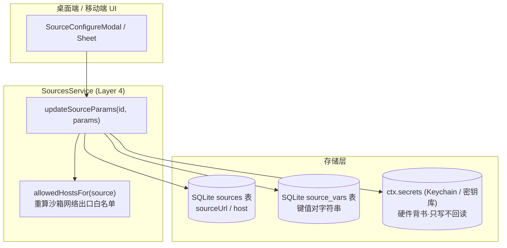
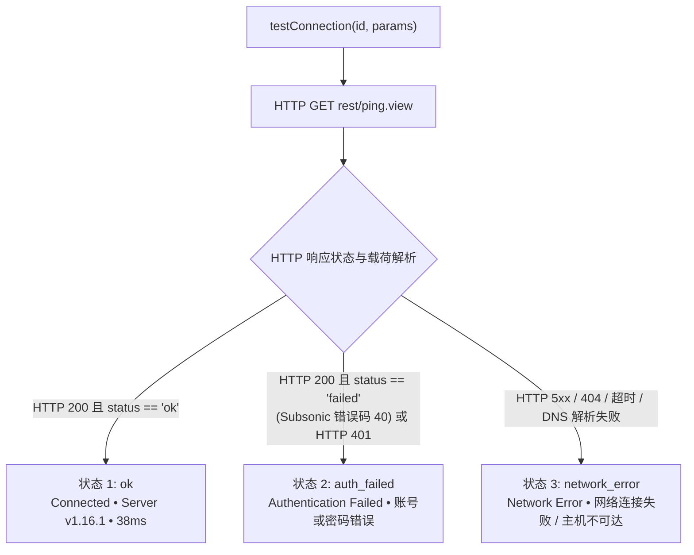

# 每源参数与安全架构规范

> **解答核心问题：** 音乐源与歌词源在每个实例中如何进行独立参数配置、敏感凭据与非敏感变量之间的严格安全边界、Subsonic 三态连接探测机制的工作原理，以及自定义配置如何安全注入到沙箱运行时中。

---

## 1. 每源参数模型 (Per-Source Parameters Model)

远程音乐后端（例如自建 Subsonic/Navidrome 服务器、Jellyfin 实例或 WebDAV 端点）需要针对具体部署实例配置独立参数：服务器 URL、认证凭据以及客户端变量。BBeBee 坚决避免在音乐源规则文档中硬编码这些参数，也禁止将敏感凭据存入应用数据库，而是推行三分化配置架构：



### 1.1 三分化架构定义

| 参数域 | 存储位置 | 敏感级别 | 可变性与安全策略 | 示例 |
|---|---|---|---|---|
| **Host / URL** | `sources.url` (SQLite) | 公开配置 | 用户可直接编辑并触发出口重算 | `https://music.example.org` |
| **Credentials 凭据** | `ctx.secrets` (Keychain / 硬件密钥库) | 极度敏感 | 只写掩码（Masked）、禁止纯文本导出 | `password`, `token`, `user`, `apiKey` |
| **Variables 变量** | `source_vars` (SQLite) | 非敏感配置 | 键值对映射表，随库备份与迁移 | `clientApp: BBeBee`, `bitrate: 320` |

---

## 2. 凭据安全边界与沙箱管控

### 2.1 铁律：SQLite 中严禁存放敏感密钥

1. **零密钥入库：** 任何口令、认证 Token、会话凭据或私钥绝对不得持久化在 SQLite 数据表（`sources`、`source_vars` 或日志表）中。
2. **硬件密钥库背书：** 所有敏感字段均通过 `ctx.secrets` 存储在按源隔离的命名空间 `test:${sourceId}` 或 `source:${sourceId}` 下。在桌面端接入操作系统 Keychain（通过 Electron `safeStorage` 或原生 Keychain API）；在移动端接入 iOS Keychain / Android Keystore。
3. **UI 纯只写掩码策略：** 界面绝不回显已存储的明文密码。密码字段在存在值时显示掩码点位符（`••••••••`）。用户输入新值即可覆盖写入，但无法通过前端组件检查或反射导出密钥。
4. **沙箱出口白名单动态同步：** 当用户修改 `sourceUrl` 或 `host` 时，`updateSourceParams` 自动重新计算 `allowedHostsFor(sourceId)`：
   - 新主机名实时合并入该源的网络访问白名单。
   - QuickJS 隔离沙箱发起 HTTP 请求时，任何未在出口白名单内的域名访问都会被立即拦截并抛出网络违规异常。

---

## 3. Subsonic 音乐源配置与三态连接探测机制

### 3.1 Subsonic 参数范例

标准 Subsonic / OpenSubsonic 音乐源实例通常包含：
- **Host**: `https://subsonic.internal.net`
- **Username**: `audiophile`
- **Password**: 安全口令或 Token（保存在 `ctx.secrets`）
- **Variables**: `clientApp: BBeBee`, `clientVersion: 1.0.0`

### 3.2 三态探测协议规范

当用户点击 **Test Connection** 测试连接时，`ctx.sources.testConnection(id, params)` 对 `<host>/rest/ping.view?f=json&v=1.16.1&c=BBeBee&u=<user>&p=<password>` 发起探测，绝不产生持久化副作用：



#### 三态详细定义与徽标展示

1. **`ok` (连接成功 - 绿色徽标):**
   - 触发条件：HTTP 200 状态码，JSON 返回且 `subsonic-response.status === 'ok'`。
   - 元数据展示：提取服务端版本号 `serverVersion`（如 `1.16.1`）以及往返延迟 `latencyMs`。
2. **`auth_failed` (认证失败 - 琥珀色徽标):**
   - 触发条件：Subsonic 接口响应错误码 40（"Wrong username or password"）、50（"User not authorized"）或 HTTP 401 Unauthorized。
   - 提示导向：明确提示用户核对用户名与口令，无需调整主机出口权限。
3. **`network_error` (网络错误 - 红色徽标):**
   - 触发条件：连接被拒绝、DNS 解析失败、TLS 握手异常、请求超时、网关错误（502/503）或非 JSON 格式载荷。
   - 诊断信息：返回清晰的底层网络错误提示（例如 `Failed to connect to host: Connection refused`）。

---

## 4. 歌词源配置规范与沙箱注入机制

歌词源遵循 `plugin-lyric-sources` 规范。与音乐源使用平铺的 `source_vars` 表不同，歌词源支持结构化的 JSON 对象配置。

### 4.1 服务契约接口

```ts
export interface LyricSourcesService {
  // ...
  updateSourceConfig(id: string, config: Record<string, unknown>): Promise<void>
}
```

配置更新直接安全持久化至歌词源记录的 `config` 字段。

### 4.2 沙箱运行时动态注入

在执行歌词检索请求时：
1. **QuickJS 沙箱环境：** 沙箱环境全局注入不可变的 `source.config` 对象。
2. **检索查询上下文：** 传入 `searchLyrics({ query, artist, title, config })` 的参数自带 `config: source.config ?? {}`。
3. **降级解释器环境：** 降级脚本环境中自动绑定 `query.config = source.config`，确保规则引擎无需改动代码即可动态读取自定义端点、语言偏好或自定义请求头。

---

## 5. UI 组件架构与复用原则

遵循三包原则与 `@BBeBee/ui` 设计规范：
- **桌面端组件：** `packages/ui/plugin-sources-ui-desktop/src/components/SourceConfigureModal.tsx`
- **移动端组件：** `packages/ui/plugin-sources-ui-mobile/src/SourceConfigureModal.tsx`
- **歌词源配置组件：** `packages/ui/plugin-settings-ui-desktop/src/components/sections/LyricSourcesSection.tsx`（内置完整 JSON 编辑器）
- **通用 Hooks：** 统一导出自 `@BBeBee/plugin-sources/views` 与 `@BBeBee/plugin-lyric-sources`，实现界面与核心业务逻辑的完全解耦。
