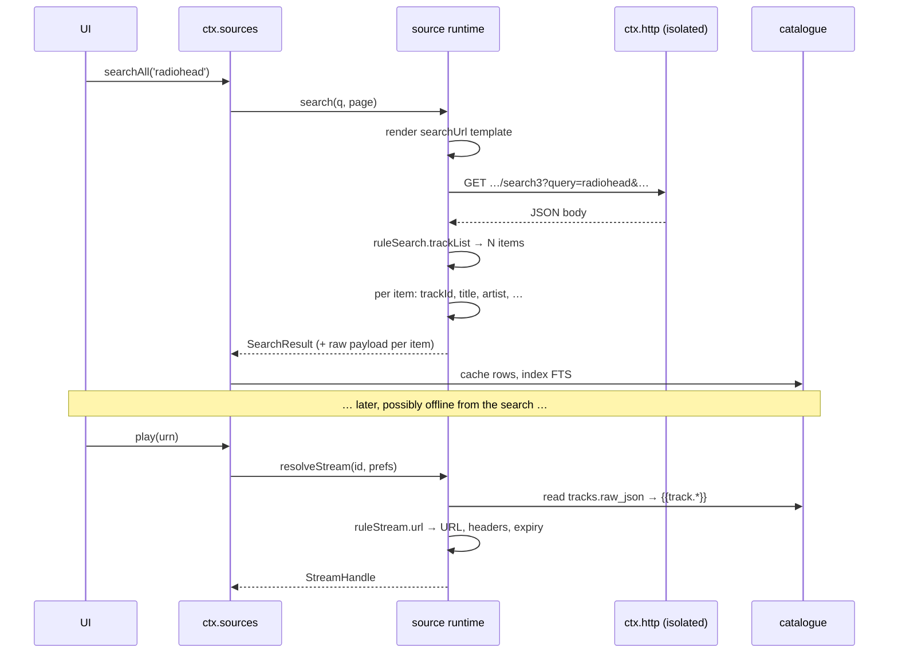
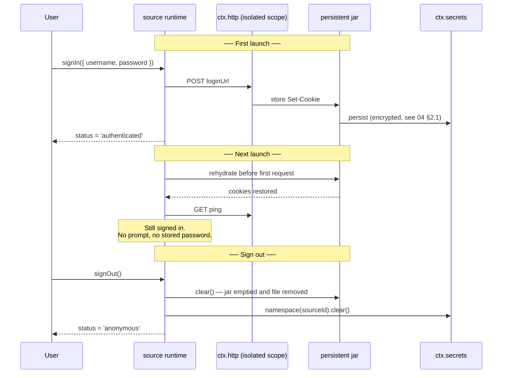

# 音源运行时解析与 QuickJS 安全沙箱

> **历史章节映射：** 原 `docs-zh/06-music-sources.md §4 – §6，§8`。

## 4. 运行时

### 4.1 一个源的生命周期

一个源不是插件 —— 但运行时仍然给每个源**各自的 fiber 与各自隔离的 `ctx.http` 作用域**，因为正是这一点让禁用一个源变得彻底、且无需专门的清理逻辑（[03 §2](../plugins/concepts.md#2-生命周期)）。

```ts
// plugin-source-runtime — simplified
for (const rec of await ctx.db.select('sources', { enabled: 1 })) {
  const scoped = ctx.isolate('http')                       // private cookie jar + rate limiter
  scoped.plugin(HttpStack, { jar: rec.id, rateLimit: parseRate(rec.doc.concurrentRate) })
  scoped.plugin(SourceInstance, { record: rec })           // registers into ctx.sources
}
```

过去从"一个插件、多个实例"推出的一切，如今都从"一行、一个 fiber"推出：两个源看不见彼此的 cookie，一个源的限流无法拖慢另一个源的请求，移除一个源恰好只销毁它自己的注册、它的 jar、它的 vars，以及 —— 如果用户要求的话 —— 它的曲库行。

编辑一个源字符串只销毁并重建那一个 fiber。用户在下一次搜索时就能看到改动，无需重启。

```ts
export interface SourcesService {
  /* ── the registry (unchanged) ─────────────────────────────────── */
  /** Internal. Called by the runtime per source and by plugin-source-local. */
  register(p: MediaProvider): Disposable
  readonly providers: readonly MediaProvider[]
  get(sourceId: string): MediaProvider | undefined
  forUrn(urn: string): MediaProvider | undefined
  searchAll(q: SearchQuery, opts?: { sourceIds?: string[]; timeoutMs?: number }): Promise<AggregatedSearch>

  /* ── sources as data (§9, §10) ────────────────────────────────── */
  readonly sources: readonly SourceRecord[]
  import(input: string, opts?: ImportOptions): Promise<ImportReport>
  export(ids?: string[]): Promise<string>
  setEnabled(id: string, on: boolean): Promise<void>
  /**
   * Remove a source.
   *
   * ⚠️ The two modes differ in what survives, and the difference is forced by
   * the schema rather than chosen: catalogue rows are `ON DELETE CASCADE`, so
   * deleting the row *necessarily* takes the library with it. There is no
   * third option where the row is gone and the tracks remain — those would be
   * orphans with unresolvable URNs.
   *
   *   forgetCatalogue: true   delete the row; the cascade drops its tracks,
   *                           albums, artists, account and vars
   *   forgetCatalogue: false  (default) keep the row, disabled, so the library
   *                           stays browsable and the source list brings it back
   *
   * The default is the safe one: losing a library to a mis-tapped button is
   * far worse than a stale row nothing reads.
   */
  remove(id: string, opts?: { forgetCatalogue?: boolean }): Promise<void>
  /** Every step gets `timeoutMs`, so one hanging source cannot hold the run. */
  check(
    ids?: string[],
    opts?: { signal?: AbortSignal; timeoutMs?: number },
  ): Promise<CheckReport[]>
  debug(id: string, step: DebugStep): AsyncIterable<TraceEvent>
}

export interface AggregatedSearch {
  /** One entry per source that was asked — including the ones that failed. */
  bySource: {
    sourceId: string
    result?: SearchResult
    /** Present on failure. The source is reported, never silently dropped. */
    error?: SourceError
    /** True when the source exceeded `timeoutMs` and is still running. */
    pending: boolean
    tookMs: number
  }[]
}
```

`searchAll` 形状未变，但比以前更重要了：面对十几个质量参差的导入源，"按源分组的结果、附每个源各自的错误"正是"搜索坏了"与"你十二个源里有三个应答了、一个被限流、一个需要重新导入"之间的区别。

### 4.2 解析流水线



同样的流水线也以同样的方式跑 `browse`（`exploreUrl` → `ruleExplore` → `childUrl` → `ruleAlbum` → `ruleTrackList`）和歌词。动词只有三个 —— 抓取一份文档、从中做选择、对选择结果做强转 —— 每一项能力都只是这三者的不同组合。

**浏览节点自带所属阶段。** `browse(nodeId)` 必须知道该跑上述规则中的哪一个，而它无法从 URL 推断出来。所以一个 node id 是一个自足的令牌 —— 源 id、阶段（`explore` 或 `tracks`）与要抓取的 URL —— 而不是指向运行时所持某个映射表的键。那张表熬不过一次重启，而一个正在恢复导航栈的壳，会把用户送回一个在他们离开期间就已不存在的文件夹。令牌里的源 id 在回来的路上会被核对：这不是安全边界 —— 起这一作用的是出站（egress）允许列表，而且它在每次抓取时都会被重新核对，包括对文档算出来的某个 `childUrl` —— 但它让一个来自其他源的过期 id 变成一次干脆的拒绝，而不是一次令人困惑的跨源抓取。

**叶子是曲目；节点是地点。** `childUrl` 非空的条目得到一个 node id，而没有 URN。没有 `childUrl` 的条目得到 URN，可以播放 —— 并且在路过时就被缓存，载荷也在内，走的路线与一条搜索到的曲目完全相同。浏览到一首曲目、一周之后再播放它，必须能行；而这只有在那一行于它被看见时就已写入的前提下才成立。

### 4.3 分页、限流与缓存

**分页**就是 `{{page}}`。运行时递增它，并在某一页不再产出条目、或重复了上一页的 id 时停止。它对外暴露的仍是与从前相同的不透明游标契约，因此任何消费方都不必知道页其实是数字：

```ts
export interface PageRequest { cursor?: string; limit?: number }

export interface Paged<T> {
  items: T[]
  cursor?: string        // absent means no more
  total?: number         // only when the backend actually says
  hasMore: boolean
}

export interface SearchQuery {
  text: string
  types?: ('track' | 'album' | 'artist' | 'playlist')[]
  filters?: { genre?: string; yearFrom?: number; yearTo?: number; durationMaxMs?: number }
}

export interface SearchResult {
  tracks?: Paged<Track>
  albums?: Paged<Album>
  artists?: Paged<Artist>
  playlists?: Paged<Playlist>
}
```

`total` 保持可选，因为一个抓取来的页面几乎从来不知道总数，而凭空编造一个只会产出说谎的进度条。

**限流**是 `concurrentRate`，由源自己隔离的 HTTP 栈强制执行，而不是由规则。`"3/1000"` 是每秒三个请求；`"1/2000"` 是每两秒一个。没有 `concurrentRate` 的源会得到一个保守默认值，因为往高了猜的失败模式，就是某个人的服务器封掉用户的 IP。

**缓存**有两层，当源行为不端时这个区分就很要紧：HTTP 响应走 `http/request` 瀑布（waterfall）钩子上的 `plugin-cache`，并遵守后端的缓存头；`src.cache` 是源自己的草稿区，带显式 TTL。清掉一层不会清掉另一层，设置界面也把两者分开提供。

---

## 5. 认证与会话

认证**在文档中声明、由外壳驱动**，因此任何源作者都不必编写登录界面 —— 与从前相同的原则，改用数据表达。

```ts
export interface LoginField {
  id: string
  label: string
  type?: 'text' | 'password' | 'checkbox' | 'select'
  options?: string[]
  placeholder?: string
}

export type AuthFlow =
  | { kind: 'none' }
  | { kind: 'variable'; comment?: string }        // the `source.var` box, and nothing more
  | { kind: 'form'; fields: LoginField[]; submitTo: string }
  | { kind: 'webview'; loginUrl: string; requiredCookies: string[] }

export type AuthStatus =
  | { state: 'anonymous' }
  | { state: 'authenticated'; displayName?: string; expiresAt?: number }
  | { state: 'expired' }
  | { state: 'error'; message: string }

export interface ProviderAuth {
  readonly flow: AuthFlow
  readonly status: AuthStatus
  signIn(input: Record<string, string>): Promise<void>
  /** Clears the jar, the secrets namespace, and this source's vars. Leaves nothing. */
  signOut(): Promise<void>
  refresh?(): Promise<void>
  onStatusChange(cb: (s: AuthStatus) => void): Disposable
}
```

每种流程在文档中如何表达：

| 流程 | 写作 | 例子 |
|---|---|---|
| `none` | 完全没有认证字段 | 一个公开的电台流 |
| `variable` | 只有 `variableComment` | Subsonic 的 `user:password`，由 `jsLib` 消费 |
| `form` | `loginUi`（字段）+ `loginUrl`（提交到哪） | 自建服务器的 `/login` |
| `webview` | `loginUrl` + `requiredCookies`，在 `ctx.shell` 中打开 | 登录是网页而非 API 的后端 |

`loginCheckJs` 在每次响应之后运行，判定会话是否仍然有效；返回 false 会置 `status = 'expired'` 并发出 `source/auth-expired`。它对应的是"服务器又开始用登录页应答了"这件事 —— 没有任何 HTTP 状态码能可靠地表达它。

以下规则没有任何商量余地，而且从源还是插件的年代起就一条未变：

- **凭据绝不落入可读存储。** `source.var`、表单输入与 token 进 `ctx.secrets` 的 `namespace(sourceId)` 之下；cookie 进 §5.1 所述的持久化 jar。绝不以明文进 `ctx.db`，绝不进导出的字符串，绝不出现在日志行里（[04 §16](../services/logging.md#16-ctxlogger--以传输插件形式实现的日志)）。
- **刷新是透明的，且有且只有一次。** 运行时按源挂钩 `http/request`；遇到 `401` 或 `loginCheckJs` 失败时，它重新认证一次并重试。并发涌来的一串 401 恰好触发一次刷新 —— 一个在途（in-flight）的 promise，所有调用方都等待它。
- **过期是一个事件，不是错误。** 源保持注册状态，缓存的曲库仍然可以浏览；只有网络调用会失败。UI 原地展示重新登录提示，而不是让该源消失。
- **导出绝不携带会话。** [§9](#9-导入更新与分享) 会剥除 `source.var`、cookie 与每一个 `src.vars` 值。分享一个源绝不能连带分享一个账号，而这必须由构造保证，而不是靠分享者记得。

### 5.1 会话持久化 —— cookie 在应用关闭后依然存活

登录一次就必须够用。许多后端把会话完全装在 cookie 里，于是一个随进程消亡的 jar 意味着每次启动都要登录一次。

每个源拥有一个**持久化 cookie 罐**，以源 id 为键，由 `ctx.http` 提供（[04 §2.1](../services/overview.md#21-cookie-罐)）。没有任何规则需要管理它：它存在于该源隔离的 `ctx.http` 作用域中（[§4.1](#41-一个源的生命周期)），于是运行时替该源发出的每个请求都自动带上正确的 cookie，收到的每个 `Set-Cookie` 都会被存储，文档里一行 cookie 处理代码都不用写。



生命周期规则：

- **回灌发生在第一个请求之前，而不是惰性进行。** 源的 fiber 会等待 `ctx.http.cookies.jar(sourceId).ready`，这样任何请求都不会与空 jar 竞速、拿到一个伪 `401` 从而误触过期路径。
- **持久化按源划分。** 两台 Navidrome 服务器各有两个 jar，彼此看不见对方的 cookie —— 这由 `ctx.isolate('http')` 自然推出，不额外做任何事。
- **Cookie 就是凭据，并按凭据对待** —— 静态加密，绝不进明文数据库列，绝不出现在日志行里，并被排除在崩溃报告包与导出之外。
- **`signOut()` 会清空 jar。** 只清内存里的那份是不够的；持久化副本也要删除，连同 secrets 命名空间与 `source_vars` 一起。这是最容易漏掉的一步，所以它写进了 [§13](#13-编写一个源清单) 的清单和一致性测试套件。
- **过期被认真对待。** `Expires`/`Max-Age` 已过去的会话 cookie 在回灌时被丢弃而不是重放，否则会造出一种"明明已登录但每个请求都失败"的困惑状态。
- **用户可以在不移除的情况下撤销。** 设置为每个源提供"清除已存会话"操作，清掉 jar、secrets 命名空间与 vars，同时保留该源的导入状态。

> ⚠️ 一个持久化的 cookie 就是一件持有者凭据（bearer credential），有效期为服务器所选，可能长达数月。它值得与密码同等的保护，[04 §2.1](../services/overview.md#21-cookie-罐) 的存储设计正是如此对待它。这也意味着"登出"必须真正生效 —— 登出后仍留在磁盘上的 jar 是真实的安全漏洞，而不是不整洁。

---

## 6. 流解析

一个 URN 变成字节的那一刻。契约没有变；变的是如今由 `ruleStream` 产出它，而不是一个手写的提供方。

```ts
export interface StreamPrefs {
  quality: StreamQuality
  /** True when the network is metered; the template sees it as {{prefs.saveData}}. */
  saveData: boolean
  /** Formats the platform can decode — from ctx.codec.supportedFormats(). */
  acceptFormats: string[]
  maxBitrateKbps?: number
}

export interface StreamHandle {
  kind: 'remote' | 'local'
  target: string                  // URL for remote, file Uri for local
  mimeType?: string
  codec?: string
  bitrateKbps?: number
  sampleRate?: number
  byteLength?: number
  seekable: boolean
  /** Headers required to fetch this stream. May contain credentials. */
  headers?: Record<string, string>
  /** Epoch ms. The player re-resolves before this, and on 403. */
  expiresAt?: number
  /** Reserved. Nothing implements this — see 01, non-goals. */
  drm?: { system: string; licenseUrl: string }
}
```

对那些棘手情形的处理：

- **会过期的 URL。** 播放器在 `expiresAt` 距今不足 60 秒时重新解析；流中途遇到 `403` 时，它先重新解析一次并从当前位置续播，之后才把错误抛给用户。返回短时效 URL 的源应设置 `ruleStream.expiresAt`；一个不设置它却照样提供会过期 URL 的源，会制造出本系统中最令人困惑的一类 bug —— 这正是 `check`（[§10](#10-诊断一个坏掉的源)）会把"第二次 HEAD 就拒绝的流 URL"标记出来的原因。
- **音质协商。** `{{prefs.*}}` 在 `ruleStream` 内处于作用域之中，因此由文档决定它能提供什么。它返回什么，句柄里就报告什么，于是 UI 展示的是真实码率而不是请求的码率。
- **`saveData`。** 取自 `ctx.device.network().metered`。无视它的源不算坏了规矩，但下载策略引擎照样会拒绝启动任何传输。
- **头部随句柄一起走。** 一个只在带 `Referer` 时才可用的流 URL 是常事，`ruleStream.headers` 就是源说明这一点的方式。`ctx.audio` 随加载请求一起收到它们；它们在日志中被脱敏。

---


---

## 8. 信任：导入的源能做什么、不能做什么

> ⚠️ **一个源字符串就是一个陌生人写出来的程序。** `@js:`、`jsLib` 与 `{{ }}` 都是 JavaScript。把导入的源当成惰性配置是一种谎言，这个设计也不假装不是如此。

让这件事变得可处理 —— 也确实比它所取代的插件模型更好 —— 的一点在于：一个源的执行环境*小到可以一一列举*。运行期加载的插件与渲染进程共享同一个 realm，什么都能碰到（[03 §7](../plugins/concepts.md#它不是什么)）；而一个源碰不到下面这份清单之外的任何东西。

### 求值器

源的 JavaScript 运行在 `ctx.js` 里 —— 一个**独立的解释器 realm**，两个平台都用 QuickJS —— 不引用应用的全局对象、Cordis 上下文、DOM 或模块系统。它正是 [03 §7](../plugins/concepts.md#它不是什么) 所说的、真正的隔离所需要的独立 realm。音源是它如今就存在、而不是留待以后的原因；第三方插件将继承它（[10 §M5](../roadmap/roadmap.md#m5--沙箱上的第三方扩展)）。契约见 [04 §19](../services/contracts.md#19-ctxjs--沙箱化求值器)。

一个源能看到的全部宿主接口面：

```ts
/** `src` inside any @js: block or {{ }} template. This list is the whole API. */
export interface SourceHost {
  /** HTTP through the source's own isolated stack: its jar, its rate limit, its host allowlist. */
  get(url: string, opts?: RequestOptions): Promise<{ status: number; headers: Record<string, string>; body: string }>
  post(url: string, body: string, opts?: RequestOptions): Promise<{ status: number; headers: Record<string, string>; body: string }>

  parse: { json(s: string): unknown; html(s: string): Node; xml(s: string): Node }
  crypto: { md5, sha1, sha256, hmac, aesEncrypt, aesDecrypt, base64Encode, base64Decode, randomHex }
  cache: { get(k: string): unknown; put(k: string, v: unknown, ttlMs?: number): void }
  vars: { get(k: string): string | undefined; put(k: string, v: string): void }
  url: { encode(s: string): string; decode(s: string): string; resolve(base: string, rel: string): string }
  time: { now(): number }
  log(message: string): void
}
```

没有 `fetch`，没有 `require`，没有 `import`，没有 `globalThis` 透传，没有比调用本身活得更久的计时器，也没有任何形式的文件系统。

### 限制，以及每条限制为何存在

| 限制 | 数值 | 它挡住什么 |
|---|---|---|
| **主机允许列表** | `sourceUrl` 的主机加上 `allowedHosts`，按主机名匹配 | 向攻击者控制的端点外泄数据。指向任何其他主机的 URL 都会被以 `CapabilityError` 拒绝，无论它是字面写出的还是运行时算出来的 |

`allowedHosts` 的条目是**主机名**，任何会在静默中被放宽成一个主机名的东西都会在导入时被拒绝。`nas:4533` 读起来像"这台主机的这个端口"，但匹配器里根本不存在端口 —— 端口会被丢弃，条目于是覆盖所有端口 —— 因此它会以一条点名该条目的消息被拒绝。路径出于同样的原因被拒绝。裸 scheme 什么都不会丢，所以 `https://cdn.example.org` 会被接受并规范化为它的主机。一个条目覆盖它的子域（`example.org` 接纳 `cdn.example.org`，绝不容纳 `notexample.org`）；单标签条目只匹配它自己，因此 `["org"]` 不可能意味着".org 中的任何地方"。

| 每条规则的墙钟时间 | 2 秒（带网络的 `@js:` 为 10 秒） | 一条把搜索挂死的规则 |
| 每次求值的内存 | 32 MB | 一个把应用 OOM 掉的源 |
| 每条规则的 HTTP 调用次数 | 8 —— ⚠️ **尚未强制执行**；计数器还不存在 | 一条把一次搜索变成爬取的规则 |
| 每条规则的输出大小 | 1 MB | 一个把整页内容塞进表格单元格的选择器 |
| 并发 | `concurrentRate`，默认保守 | 用户自己的服务器封掉用户的 IP |
| `webView` 选项 | 仅桌面端，默认关闭，按源显式开启并带警告 | 一个带着用户会话的完整浏览器上下文，且能从一段粘贴的字符串触达 |

允许列表是最重要的一条，它也是与 legado 的刻意分歧 —— legado 允许书源请求任何东西。导入时它以一份平实的主机名清单展示 —— "这个源将与这些主机通信：music.example.org、cdn.example.org" —— 因为这样一句话是用户真正能够判断的。

### 一个敌意源仍然能做的事

坦率地列出来，因为不留残余的安全声明算不上安全声明：

- **读走交给它的一切。** 它自己的结果、它自己的凭据、用户输入给它的搜索文本，以及用户经它播放的曲目。
- **把这些发到它自己的主机。** 允许列表限制的是*发到哪*，而不是*发什么*。一个后端怀有恶意的源会学到你的收听习惯，任何沙箱都修不了这个 —— 唯一的办法是不导入它。
- **在上述限制之内浪费资源**，以及慢。
- **在元数据上撒谎**，这是内容问题而非安全问题，表现为一个看起来不对劲的曲库，而不是一次入侵。

它做不到的事：读取另一个源的 cookie、vars 或曲库行；读取或写入任何文件；触达 `ctx` 或除自己作用域内 `ctx.http` 之外的任何服务；在自己的命名空间之外持久化任何东西；在自己的销毁之后继续存活；或在被禁用时运行。

### 内容与合法性

运行时是中立的，本仓库**不随附任何面向第三方服务的源字符串**。它随附解释器、本地文件提供方，以及一小批面向开放自托管协议的文档，用作测试与示例（[09 §6](../workflow/testing.md#6-测试策略)）。用户导入什么，是用户自己的选择、也由用户自己负责；导入界面会说明这个源会做什么、与谁通信，除此之外不加任何评判。

---

