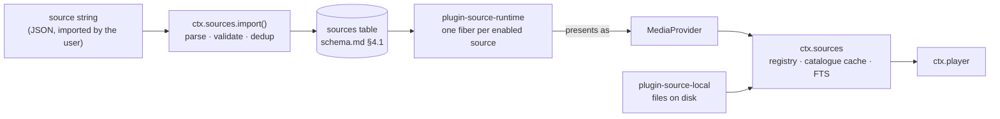

# 音源格式规范与能力推导

> **历史章节映射：** 原 `docs-zh/06-music-sources.md §1 – §2`。

> **本文回答的问题。** 当音乐源*不再是包、而是一个字符串*之后，它究竟*是什么*：用户导入的 JSON 文档、其中的规则语言、解释它的唯一运行时、一个源如何认证并保持登录、一条规则如何变成字节、一个导入的源被允许做什么与不被允许做什么，以及一个坏掉的源如何被诊断和修复。

一个源是**数据，而不是我们发布的代码**。用户粘贴进一个字符串 —— 来自朋友、论坛、gist 或二维码 —— 应用就能从一个本仓库里没有任何人听说过的后端播放，无需构建、无需发版、也无需安装插件。当那个后端更改了它的 API，修复方式是编辑一个字符串，而不是升一个版本号。

这是 [legado](https://github.com/gedoor/legado) 书源模式在音频上的应用。它是对早期设计的刻意逆转 —— 在旧设计里，每个后端都是一个插件包；[ADR-5](../architecture/overview.md#adr-5--音源是导入的字符串由一个运行时解释) 记录了那个设计付出了什么、又换来了什么。

---

## 1. 模型

### 1.1 一个运行时，多个源

与远程音乐后端通信的代码有且只有**一份**：`plugin-source-runtime`。它不认领任何属于自己的服务键 —— 它读取 `sources` 表，并为每个启用的行向 `ctx.sources` 注册一个提供方。源就是行；运行时是它们唯一的解释者，不存在需要与之保持同步的第二个解释者。



`MediaProvider` 仍然存在，它之上的一切 —— `ctx.sources`、`ctx.player`、曲库缓存、URN 方案 —— 都没有变。变的是它的实现者构成：它现在是一个**恰好有两个实现的内部接口**（运行时的每源适配器，以及本地文件），而不是第三方面向它编写的扩展点。本仓库之外没有人去实现 `MediaProvider`；他们改写的是一份源文档。

```ts
import type { Uri, Disposable } from '@BBeBee/protocol'

/** Internal. Two implementations: the source runtime, and plugin-source-local. */
export interface MediaProvider {
  readonly sourceId: string             // 'music-example-org-35be9fe2'
  readonly displayName: string
  readonly capabilities: Capabilities   // derived — see §1.3
  readonly auth: ProviderAuth           // synthesised from the document — 见 runtime.md §5

  getTrack(id: string): Promise<Track>
  resolveStream(id: string, prefs: StreamPrefs): Promise<StreamHandle>
  ping(): Promise<boolean>

  search?(q: SearchQuery, page?: PageRequest): Promise<SearchResult>
  browse?(nodeId?: string, page?: PageRequest): Promise<Paged<BrowseEntry>>
  getTracks?(ids: string[]): Promise<Track[]>
  getAlbum?(id: string, page?: PageRequest): Promise<AlbumDetail>
  getArtist?(id: string): Promise<ArtistDetail>
  getPlaylist?(id: string, page?: PageRequest): Promise<PlaylistDetail>
  getLyrics?(id: string): Promise<Lyrics | undefined>
  getArtwork?(ref: ArtworkRef, size?: number): Promise<Uri>
  library?: ProviderLibrary
}
```

提供方**不做**的事情没有变，而且依旧至关重要：它从不写数据库，从不触碰音频图，也从不渲染任何东西。它只回答问题、返回纯数据。`ctx.sources` 把答案缓存进曲库表（[schema.md §4.3](../data-model/schema.md#43-目录catalogue)）；`ctx.player` 消费流句柄。

### 1.2 身份：源 id

一个源文档以 **`sourceUrl`** 为键，与 legado 书源完全一致。它是后端的基础 URL，正是它让两台 Navidrome 服务器成为两个源，而不是一个配置错误的源。

```
sourceUrl  https://music.example.org
       ↓   slugified host + the first 8 hex of sha256(sourceUrl)
id         music-example-org-35be9fe2
       ↓
URN        BBeBee:music-example-org-35be9fe2:track:8f1a2c
```

> 这个摘要用的是 **SHA-256**，后缀取的是其中的 32 位。这不是装饰：id 是一个主键，因此一次碰撞不只是让某个列表显示混乱 —— 它会让一个源的行覆盖另一个源的行。`doc_hash`（[schema.md §4.1](../data-model/schema.md#41-sources-accounts-and-sessions)）出于同样的原因用的是完整摘要，还要更糟一步：它决定一次重新导入算更新还是无操作，因此那里的碰撞会悄悄跳过这次更新。

这个 id 是推导出来的、稳定的，而且短到能放进一行日志里读。它占据 URN 的第二段，而这一段正是 [urn.md §1](../data-model/urn.md#1-身份标识urn) 一直保留给"拥有这个 id 的那个命名空间"的 —— 因此模型变了，URN 方案却不需要变。

有两个后果值得明说，因为它们在过去都需要插件机制才能实现：

- **多实例是免费的。** 家里和公司的 Navidrome 就是两个导入的字符串、两个 `sourceUrl`。没有任何东西是"可实例化的"；这个概念已经不存在了。
- **重新导入是更新，不是重复。** 一个 `sourceUrl` 已存在的字符串会更新那一行并保留其 id，于是每个 URN、缓存的行、cookie 罐和播放列表引用都能在这次编辑中存活下来（[authoring.md §9](./authoring.md#9-导入更新与分享)）。

### 1.3 能力是推导出来的，不是声明出来的

旧的 SPI 要求提供方声明 `capabilities`，然后寄希望于它与实际实现的方法一致；少报会降级 UI，多报会弄坏 UI。一份源文档不存在这种缝隙：**运行时根据出现了哪些规则块来计算 `Capabilities`。**

| 文档中存在的块 | 带来的能力 |
|---|---|
| `searchUrl` + `ruleSearch` | `search`，以及参与 `searchAll` |
| `searchArtistUrl` + `ruleSearchArtist` | `search` 中的艺术家结果（`searchResult.artists`） |
| `exploreUrl` + `ruleExplore` | `browse` |
| `ruleRecommend`（可选 `recommendUrl`） | `recommend` —— 推荐歌单页渲染的精选 feed |
| `ruleAlbum` | `getAlbum`、专辑详情页 |
| `ruleTrackList` | 专辑与播放列表的曲目列表 |
| `ruleStream` | `resolveStream` —— **必需**；没有它的源什么都播不了，会在导入时被拒绝 |
| `ruleLyric` | `getLyrics` |
| `loginUrl` / `loginUi` | 一个登录流程；缺席意味着 `flow: { kind: 'none' }` |
| `ruleLibrary.*` | 对应的 `ProviderLibrary` 成员 |

一个存在但为空的规则块按缺席处理。有且只有一个必需块 —— `ruleStream` —— 因为一个产生不出可播放 URL 的源不是音源。

艺术家搜索是唯一一个可以复用其他抓取结果的搜索块：缺省 `searchArtistUrl` 时，`ruleSearchArtist` 会在与 `searchUrl` 相同的抓取文档上执行（例如同时返回用户和视频的后端综合搜索）；若提供了 `searchArtistUrl`，艺术家规则会在独立的请求结果上运行。结果借用曲目形态的字段 —— `trackId` 为后端的艺术家 id，`title` 为名称 —— 并成为 `SearchResult.artists`。指定 `types` 的查询仅请求对应的类型 —— `['artist']` 不会抓取曲目文档，`['track']` 不会执行艺术家规则 —— 未指定类型的查询则获取音源支持的全部类型。`searchAll` 将此逻辑下发给各音源：`typesBySource` 允许一次并发搜索仅向一个源请求单曲，同时向另一个源请求单曲与艺术家。艺术家搜索失败会平滑降级（保留单曲结果）而非导致整次搜索失败。

```ts
export interface Capabilities {
  search: { tracks: boolean; albums: boolean; artists: boolean; playlists: boolean; fullText: boolean }
  browse: boolean
  recommend: boolean
  lyrics: boolean
  artwork: boolean
  library: { read: boolean; save: boolean; playlistWrite: boolean; playlistReorder: boolean }
  streaming: {
    qualities: StreamQuality[]
    transcoding: boolean
    /** Byte-range requests — required for seeking within a stream. */
    seekable: boolean
    /** Whether resolved URLs expire and must be re-resolved. */
    urlExpiry: boolean
  }
  rateLimit?: { requests: number; windowMs: number }   // from `concurrentRate`
  regional: boolean
}

export type StreamQuality = 'low' | 'normal' | 'high' | 'lossless' | 'hi-res'
```

外壳依旧隐藏入口，而不是展示点了会失败的按钮 —— 只是它们现在读的是计算出来的值，而不是被承诺出来的值。

---

## 2. 源文档

### 2.1 顶层字段

一个 JSON 对象就是一个源。它们的数组是一个**源集合（source set）**，这也是人们实际分享的东西。

```ts
export interface SourceDocument {
  /** Identity. The backend's base URL. Required, unique, never edited in place. */
  sourceUrl: string
  sourceName: string
  sourceType?: 'music' | 'podcast' | 'radio'      // default 'music'
  sourceGroup?: string                            // free-text, comma-separated; drives filtering
  sourceIcon?: string
  sourceComment?: string                          // author's notes, shown in the editor
  enabled?: boolean                               // default true
  sortOrder?: number

  /** Hosts this source may talk to, beyond sourceUrl's own. Shown at import. §8 */
  allowedHosts?: string[]

  /** Requests per window, honoured by the runtime's scheduler. '3/1000' = 3 per second. */
  concurrentRate?: string

  /** Sent on every request. A rule, so it may be computed. */
  header?: string

  /** Free-text explanation of what `{{source.var}}` is for, shown beside the input. */
  variableComment?: string

  /** Functions shared by every `@js:` block in this document. */
  jsLib?: string

  /* ── auth (见 runtime.md §5) ────────────────────────────────── */
  loginType?: 'form' | 'variable' | 'webview' | 'qrcode'
  loginUrl?: string
  loginUi?: LoginField[]
  loginCheckJs?: string
  loginQrJs?: string
  loginPollJs?: string
  loginRefreshJs?: string

  /* ── entry points ───────────────────────────────────────────── */
  searchUrl?: string
  searchArtistUrl?: string                        // 艺术家搜索，当后端将其独立拆分时使用
  exploreUrl?: string                             // JSON array of { title, url }, or a rule
  recommendUrl?: string                           // ruleRecommend 的可选种子文档

  /* ── stream qualities (§1.2) ────────────────────────────────── */
  qualities?: StreamQuality[]

  /* ── rule blocks (§2.2) ─────────────────────────────────────── */
  ruleSearch?: ListRule
  ruleSearchArtist?: ListRule
  ruleExplore?: ListRule
  ruleRecommend?: ListRule
  ruleAlbum?: AlbumRule
  ruleTrackList?: ListRule
  ruleStream?: StreamRule                         // required in practice — see §1.3
  ruleLyric?: LyricRule
  ruleLibrary?: LibraryRule
  ruleArtist?: ArtistRule
  rulePlaylist?: PlaylistRule

  /** 该音源是否请求外部歌词源（ctx.lyricSources）。默认为 !ruleLyric。 */
  needsLyricSource?: boolean

  /* ── maintained by the app, not the author ──────────────────── */
  lastUpdated?: number
  respondTime?: number
  weight?: number
}
```

> 应用维护的字段会在 `check`（[authoring.md §10](./authoring.md#10-诊断一个坏掉的源)）时被写回，并在导出时被剥除，因此分享一个源绝不会泄漏*你的*网络有多快、或者*你*上次使用它是什么时候。

### 2.2 规则块

下面的每个值都是 [rule-engines.md §3](./rule-engines.md#3-规则语言) 那门语言的**规则字符串（rule string）** —— 绝不是普通值，哪怕它看起来像。

```ts
/** Search results, explore results, and album track listings share one shape. */
export interface ListRule {
  /** Selects the repeating element. Every other field is evaluated against one of them. */
  trackList: string

  title: string
  artist?: string
  album?: string
  albumId?: string
  artwork?: string
  durationMs?: string
  trackId: string                 // becomes the URN's last segment
  quality?: string

  /**
   * A playable URL the list already carries.
   *
   * A convenience, not a substitute: `ruleStream` is required regardless, and
   * reaches this value as `{{track.streamUrl}}`. Making it a substitute would
   * mean two code paths to a stream URL and a source that plays from search
   * but not from the library, so there is one.
   */
  streamUrl?: string
  /** For explore and album lists: descend rather than play. */
  childUrl?: string
  kind?: string                   // track|album|artist|playlist|folder|genre
}

export interface AlbumRule {
  title: string
  artist?: string
  artwork?: string
  year?: string
  description?: string
  trackCount?: string
  /** Where ruleTrackList is evaluated. Absent means "the same document". */
  trackListUrl?: string
  /** For album listings that nest: descend rather than produce tracks. */
  childUrl?: string
}

export interface ArtistRule {
  artist?: string                 // full artist object or JSON rule
  name?: string
  bio?: string
  artwork?: string
  albums?: string
  topTracks?: string
}

export interface PlaylistRule {
  playlist?: string               // full playlist object or JSON rule
  name?: string
  description?: string
  artwork?: string
  trackList?: string
  trackId?: string
  title?: string
  artist?: string
  durationMs?: string
}

export interface StreamRule {
  /** The only required member of the only required block. */
  url: string
  headers?: string                // JSON object; merged over `header`
  mimeType?: string
  codec?: string
  bitrateKbps?: string
  sampleRate?: string
  byteLength?: string
  seekable?: string               // truthy string; default probed with a HEAD
  /** Epoch ms. Its presence is what sets `capabilities.streaming.urlExpiry`. */
  expiresAt?: string
  /** Requested or selected quality tier for this stream. */
  quality?: string
  /** Quality tiers supported by this stream rule ('low' | 'normal' | 'high' | 'lossless' | 'hi-res'). */
  qualities?: StreamQuality[]
}

export interface LyricRule { lyric: string; format?: string; offsetMs?: string }
```

### 2.3 开发态双文件维护与打包

当音源需要复杂的 JavaScript 代码（如混淆签名、多步会话建立、音轨协商等）时，直接在单文件 JSON 的 `"jsLib"` 中编写上百行带 `\n` 转义的代码是极不友好的。

因此，音源采用**开发态拆分维护，构建态合并分发**。双文件源码存放在注册表仓库（[B_Be_Bee-registry](https://github.com/BBeBeeX/B_Be_Bee-registry)）中，本仓库以钉定版本的 `registry/` submodule 消费它（[registry.md](./registry.md)）：
- **`registry/music-sources/<id>/source.json`**：存放元数据、规则声明与 URL 模板。
- **`registry/music-sources/<id>/source.js`**：存放未转义的原生 JavaScript，享受 IDE 完整的高亮、ESLint 校验与代码补全。
- **`registry/lyric-sources/<id>/`**：歌词源沿用同样的双文件布局。

构建工具将其统一编译为单个自包含 JSON（音源输出至 `fixtures/sources/<id>.json`，歌词源输出至 `fixtures/lyric-sources/<id>.json`）：
```bash
# 编译注册表 submodule 的音源与歌词源 → fixtures/sources/ + fixtures/lyric-sources/
pnpm build:sources

# 监听两个注册表目录并自动热重编
pnpm watch:sources

# 旧用法：编译单个混合目录，按文档形态分流
pnpm build:sources --sources <dir>

# 反向解包现有单文件 JSON 为双文件开发结构
node --experimental-strip-types scripts/sources/cli.ts --unpack fixtures/sources/subsonic.json
```

`browse` 就是 `exploreUrl` + `ruleExplore`：每个探索条目是一个带标题的 URL，而 `childUrl` 非空的条目是要深入下去的节点，而不是拿来播放的叶子。文件夹树、流派列表、排行榜、播客 feed 的单集列表，用的都是同样三个字段 —— 这正是同一个 UI 组件能渲染它们全部的原因。

`recommend` 是 `ruleRecommend` 作用于可选 `recommendUrl` 文档：每次调用返回一页精选歌单卡片，
推荐歌单页约定的页大小是 10。行就是探索行 —— `kind: 'album'` 带 `childUrl` —— 所以推荐的歌单
和浏览到的歌单走同一条专辑详情管线，`ctx.sources.recommend` 缓存该页的方式也与 `browse` 完全
一致。`recommendUrl` 可选：推荐内容是精选清单而非端点的源，让 `@js:` 规则自行构造行，此时
`result` 以 `null` 传入。被推荐资源已经消失时后端如何应答，是源自己的策略 —— 音源可以把答案
一分为二：*gone*（API 明确 -404）渲染"当前资源无效"占位卡；*暂时被拒*（限流、风控、超时）渲染
"加载失败"卡并写明原因，且不落任何缓存，下次读取该页时自动重试。卡片的创作者一行属于歌单页
而非推荐页：为一行字每卡片多打一个请求不值得，UP 主名等点开歌单页时再取。

**规则块内的未知字段会在导入时被拒绝。** 不是忽略 —— 是拒绝，并指明路径，因此 `{ "ruleSearch": { "titel": "$.title" } }` 会在导入界面上失败，而不是导入一个标题永远缺席的源。与顶层的非对称（[schema.md §4.1](../data-model/schema.md#41-sources-accounts-and-sessions)，在那里未知字段被原样保留、只是根本无人去读）是刻意的：`sourceName` 旁边多出来的一个键是向前兼容，而 `title` 旁边多出来的一个键是笔误 —— 恰好是笔误只产出静默、不产出错误的唯一一处。

### 2.4 一个完整的例子

**下限。** 一个只播放一条流的源 —— 最小的合法文档，也是"每个界面都能在一个完全没有可选块的源面前存活"的回归测试：

```json
{
  "sourceUrl": "https://stream.example.org/live.mp3",
  "sourceName": "Example Radio",
  "sourceType": "radio",
  "ruleStream": { "url": "={{source.url}}", "mimeType": "=audio/mpeg", "seekable": "=false" }
}
```

**一个真实的例子。** Subsonic 风格，展示模板、计算出来的认证 token、JSONPath 规则，以及一个由存储的 id 拼出的流 URL：

```json
{
  "sourceUrl": "https://music.example.org",
  "sourceName": "Navidrome — home",
  "sourceGroup": "self-hosted,subsonic",
  "concurrentRate": "5/1000",
  "variableComment": "username:password",
  "jsLib": "function auth(){ const [u,p]=String(src.vars.get('var')||'').split(':'); const s=src.crypto.randomHex(8); return `u=${u}&t=${src.crypto.md5(p+s)}&s=${s}&v=1.16.1&c=BBeBee&f=json` }",
  "searchUrl": "{{source.url}}/rest/search3?query={{key}}&songCount=50&songOffset={{@js:(page-1)*50}}&{{@js:auth()}}",
  "exploreUrl": "[{\"title\":\"Albums\",\"url\":\"{{source.url}}/rest/getAlbumList2?type=alphabeticalByName&size=100&offset={{@js:(page-1)*100}}&{{@js:auth()}}\"}]",

  "ruleSearch": {
    "trackList": "$.subsonic-response.searchResult3.song[*]",
    "trackId":   "$.id",
    "title":     "$.title",
    "artist":    "$.artist",
    "album":     "$.album",
    "albumId":   "$.albumId",
    "durationMs": "$.duration##$##000",
    "artwork":   "={{source.url}}/rest/getCoverArt?id={{item.coverArt}}&{{@js:auth()}}",
    "quality":   "$.suffix"
  },

  "ruleExplore": {
    "trackList": "$.subsonic-response.albumList2.album[*]",
    "trackId":   "$.id",
    "title":     "$.name",
    "artist":    "$.artist",
    "kind":      "=album",
    "childUrl":  "={{source.url}}/rest/getAlbum?id={{item.id}}&{{@js:auth()}}"
  },

  "ruleTrackList": {
    "trackList": "$.subsonic-response.album.song[*]",
    "trackId":   "$.id",
    "title":     "$.title",
    "artist":    "$.artist",
    "durationMs": "$.duration##$##000"
  },

  "ruleStream": {
    "url":       "={{source.url}}/rest/stream?id={{track.id}}&maxBitRate={{prefs.maxBitrateKbps}}&{{@js:auth()}}",
    "seekable":  "=true",
    "bitrateKbps": "{{prefs.maxBitrateKbps}}"
  }
}
```

注意是什么让 `ruleStream` 在数小时后、早已离开产生该曲目那次搜索的情况下仍然可用：运行时把每个列表条目的原始载荷存进 `tracks.raw_json`（[schema.md §4.3](../data-model/schema.md#43-目录catalogue)），并把它暴露为 `{{track.*}}`。解析从不重跑一次搜索。

---

