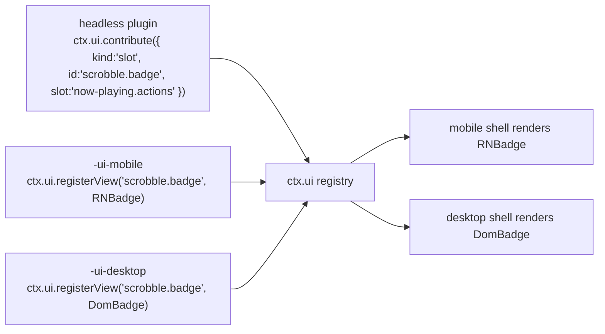

# UI 架构与描述符贡献模型

> **历史章节映射：** 原 `docs-zh/08-ui-architecture.md §1 – §5，§7 – §9`。

> **本篇回答什么。** [layers.md §1](../architecture/layers.md#1-分层模型) 中的 **Layer 5**：一个
> 插件如何向两个不共享任何组件代码的外壳贡献用户界面、视图如何在不拥有数据的前提下
> 找到数据，以及"逻辑"与"视图"的边界画在哪里。

依据 [ADR-2](../architecture/overview.md#adr-2--ui-拆分移动端-react-native桌面端-react-dom)，共有两个视图层：移动端用 React Native，桌面端用 React DOM。这一选择的代价完全在本文所述之处支付，而本文要讲的正是如何把这份代价控制在一定范围内。

---

## 1. 三包约定

带 UI 的功能最多拆分为三个包。这种拆分不是官僚流程 —— 正是它让 ADR-2 只复制功能的*像素*，而不是复制*整个*功能。

```
@BBeBee/plugin-scrobble               ← headless: service, state, events, persistence
@BBeBee/plugin-scrobble-ui-mobile     ← React Native views
@BBeBee/plugin-scrobble-ui-desktop    ← React DOM views
```

| 包 | 层 | 包含 | 可导入 |
|---|---|---|---|
| headless | 4 | Cordis 插件本体、全部逻辑、全部状态、全部数据库访问、全部网络操作 | 仅 `@BBeBee/protocol` |
| `-ui-mobile` | 5 | 组件以及命名这些组件的描述符 | `react`、`react-native`、`@BBeBee/ui-kit-mobile`，以及 headless 包的**公开子路径** —— 其类型与共享的 hooks 和视图 id（`/hooks`、`/views`） |
| `-ui-desktop` | 5 | 组件以及命名这些组件的描述符 | `react`、`react-dom`、`@BBeBee/ui-kit-desktop`，以及 headless 包的**公开子路径** —— 其类型与共享的 hooks 和视图 id（`/hooks`、`/views`） |

这一拆分正是 Layer 4/Layer 5 边界的具体化。Layer 5 是业务*编排*所在之处 —— 先点这个按钮，再弹那个确认框，然后跳这处导航 —— 而它所编排的业务*规则*则留在 Layer 4，在那里无需渲染器即可测试，并能原封不动地被另一个目标的视图复用。

让这套约定成立的规则：

> **UI 包中不包含任何需要写两遍的逻辑。**

如果你正准备在两个 UI 包里写同一个 `if`，那它就该放进 headless 包 —— 通常作为服务上的一个派生值，或服务暴露的一个选择器（selector）。实践中 UI 包最终都很薄：布局、手势与事件绑定而已。

headless 包可以独立工作。没有 UI 包的插件依然能正常运行；它只是不贡献任何可见的东西 —— 这正是某个目标平台上没有为它编写视图时所发生的事情。

### 1.1 包内部组织结构与组件解耦

为防止 UI 包退化为包含数千行代码的单文件庞然大物，每个 UI 包均按单一职责拆分为细分子模块：

```
packages/ui/<package>/src/
├── components/          ← 可复用展示组件、封面图块、卡片、曲目行
│   ├── sections/        ← 按功能划分的分区（如设置面板）
│   └── modals/          ← 独立弹窗与模态编辑流程
├── screens/             ← 顶层屏幕 / 视图目标（如 SearchScreen、PlaylistDetailScreen）
├── hooks/               ← 局部 UI 状态与交互 hooks（如 useTrackLibraryInfo）
├── utils/               ← 纯 UI 数据转换与辅助函数
└── index.tsx            ← 插件注册门面（apply(ctx)）与向后兼容导出
```

超越基本组织结构，UI 包与 UI 基础设施遵循一致的模块化规范：
- **UI Kit 组件结构**：核心 UI 套件包（`ui-kit-mobile`、`ui-kit-desktop`）将主题令牌和样式原语隔离到 `primitives.ts`，将组件定义放在 `src/components/*.tsx`（`Button`、`Text`、`TextField`、`Slider`、`Sheet`、`ContextMenu`、`List`、`Artwork`、`TrackRow`、`Toast`、`JsonTree`，以及桌面端专有的 `StickyDetailBar` 和 `coverTheme`），并通过 `src/index.tsx` 进行统一导出。
- **菜单控制器架构**：`ui-menus` 中的上下文菜单 hooks 分离为子菜单（`src/submenus/*.ts`）、单个实体菜单（`src/menus/*.ts`）和锚点定位工具（`src/types.ts`）。
- **重型屏幕视图解耦**：具有多种视图模式的复杂屏幕（如 `LibraryScreen`）将视图渲染解耦到 `src/components/views/*`（`CollapsedLibraryView`、`ExpandedLibraryView`、`SidebarFolderView`），将操作与数据注水解耦到 `src/hooks/*`（`useLibraryHydration`、`useLibraryActions`），将控制栏与弹窗解耦到 `src/components/*`。
- **纯辅助函数提升**：超出单一功能的纯逻辑工具（如时长格式化、封面 ID、字符串处理）归属于 `@BBeBee/toolkit`（Layer 4 纯库），在桌面和移动端之间保持单一事实来源，避免重复。
- **分享 UI 弹窗与 Canvas 渲染架构（`plugin-share-ui-desktop`）**：模态工作流（`ShareTrackModal`、`SharePlaylistModal`、`ShareAlbumModal`、`ShareLyricsModal`）解耦共享展示组件（`ShareModalHeader`、`BackgroundModeSelector`、`LocalSourceWarning`、`DisabledReasonToast`、`ShareActionButtons`）与状态（`useShareModalState`）。预览图直接通过相同的绘制函数（`drawTrackCard`、`drawPlaylistCard`、`drawAlbumCard`、`drawLyricsCard`）渲染到实时 `<canvas>` 上，确保与导出的 PNG 图像 100% 像素级对齐，并使用非变形封面适配（`drawImageCover`）和 3 行文本自动换行（`wrapText`）。

---

## 2. 贡献即描述符

插件从不把组件直接交给外壳。它们注册的是**描述符（descriptor）** —— 指向某个视图的可序列化声明 —— 再由外壳在自己的注册表中解析这个名字。

```ts
export interface RouteContribution {
  kind: 'route'
  id: string                       // 'scrobble.history'
  path: string                     // '/scrobble/history'
  title: string                    // i18n key
  icon?: string                    // name from the shared icon set
  /** Where the shell should offer navigation to it. */
  placement?: ('sidebar' | 'tab-bar' | 'more-menu' | 'tray')[]
  order?: number
}

export interface SlotContribution {
  kind: 'slot'
  id: string
  slot: SlotId                     // a well-known extension point
  order?: number
  /** Evaluated against slot context to decide visibility. Pure, cheap, synchronous. */
  when?: (ctx: SlotContext) => boolean
}

export interface CommandContribution {
  kind: 'command'
  id: string                       // 'player.togglePlay'
  title: string
  icon?: string
  defaultKeybinding?: string       // desktop only; ignored on mobile
  run(args?: unknown): void | Promise<void>
}

export interface SettingsContribution {
  kind?: 'settings'
  id: string
  /** 目标分类分段：'general' | 'playback' | 'audio' | 'sources' | 'storage' | 'about' 或自定义 ID */
  section: 'general' | 'playback' | 'audio' | 'sources' | 'storage' | 'about' | (string & {})
  title: string
  description?: string
  order?: number
  icon?: string
  actionText?: string
  /** 展示模式：card（内嵌卡片视图）、link（操作按钮/导航行）、auto（自动适配） */
  display?: 'card' | 'link' | 'auto'
  action?: () => void | Promise<void>
  /** 校验/默认值 schema（Standard Schema）。表单 UI 元数据来自 `fields`。 */
  schema?: ParamSchema
  /**
   * 通用自动表单的字段描述符 —— 数据驱动的替代方案，避免为简单键值配置
   * 手写表单组件。字段值默认按点路径（如 `proxy.host`）读写设置文档；
   * 可用 `getValues`（读）与 `onFieldChange`（写）按贡献覆盖。
   */
  fields?: readonly SettingsFieldDescriptor[]
  /** 触发该贡献异步字段数据重新解析的事件。 */
  refreshEvents?: readonly string[]
}

export interface SettingsFieldDescriptor {
  /** 配置文档中的点路径（如 'proxy.host'）。 */
  key: string
  label: string
  description?: string
  /** 渲染的控件类型；未知类型回退为 'text'。 */
  type: 'switch' | 'select' | 'slider' | 'text' | 'number' | 'color'
    | 'directory' | 'action' | 'switch-list'
  options?: readonly { value: string | number; label: string }[]
  /** 'select' 的异步选项（如输出设备列表）。 */
  optionsAsync?: () => Promise<readonly { value: string | number; label: string }[]>
  /** 'switch-list' 的动态布尔子行（如按音源的代理分流）。 */
  entriesAsync?: () => Promise<readonly { id: string; label: string; description?: string }[]>
  /** 行下方动态计算的说明（占用大小、引擎降级提示等）。 */
  noteAsync?: () => Promise<string | undefined>
  min?: number
  max?: number
  step?: number
  unit?: string
  placeholder?: string
  actionText?: string
  onAction?: () => { ok: boolean; message: string } | void | Promise<{ ok: boolean; message: string } | void>
  /** 渲染期求值的同步、廉价可见性谓词（与 slot 的 `when` 同一约定）。 */
  when?: () => boolean
}

export interface MenuContribution {
  kind: 'menu'
  id: string
  /** Desktop application menu bar. Mobile maps these into the more-menu. */
  menu: 'file' | 'edit' | 'view' | 'playback' | 'help'
  title: string
  /** The command run when selected — menus never carry their own logic. */
  command: string
  order?: number
  /** Rendered as a checkbox item, driven by this predicate. */
  checked?: () => boolean
}

export interface TrayContribution {
  kind?: 'tray'
  id: string
  title: string
  icon?: string
  targetRoute?: string
  order?: number
  when?: (ctx: SlotContext) => boolean
  action?: () => void | Promise<void>
}

export type Contribution =
  | RouteContribution
  | SlotContribution
  | CommandContribution
  | SettingsContribution
  | MenuContribution
  | TrayContribution

export interface UiService {
  contribute(c: Contribution): Disposable
  /** Called by each shell's view package to bind an id to a component. */
  registerView(id: string, component: unknown): Disposable

  navigate(id: string, params?: Record<string, unknown>): void

  readonly routes: readonly RouteContribution[]
  slotsFor(slot: SlotId): readonly SlotContribution[]
  readonly commands: readonly CommandContribution[]
  readonly menus: readonly MenuContribution[]
  readonly settings: readonly SettingsContribution[]
  readonly tray: readonly TrayContribution[]
  runCommand(id: string, args?: unknown): Promise<void>
  viewFor(id: string): unknown | undefined
  missingViews(): string[]
}
```

`registerView` 有意接受 `unknown`：`@BBeBee/protocol` 不得依赖 `react`、`react-native` 或 `react-dom`，因为导入它的是运行在完全没有 React 的环境中的 headless 插件。类型转换在外壳边界处完成 —— 每个外壳只有一处 `as ComponentType`，而不是让 React 依赖渗透进契约层。

> ⚠️ **注册绑定到*你自己的*上下文的组件，绝不能绑定到外壳的上下文。** 外壳渲染视图时使用自身挂载的上下文以 `h(Component, { ctx })` 调用 —— 即 `app.ready(['ui'])`，它只注入了 `ui`，没有注入其他任何东西 —— 而 Cordis 上下文在访问其注入列表之外的任何属性时都会抛出异常。因此，从传入的 prop 中读取 `ctx.player` 或 `ctx.inspector` 的屏幕组件会在真机*渲染期间抛出异常*，而所有构建了根上下文的测试却能顺利通过。这里的每个视图包都在其插件被应用时闭包捕获上下文（本地 `bound(ctx, Screen)` 辅助函数），并透传外壳的其他 props；没有遵循这一点的包曾交付过渲染为黑屏窗口的页面。
>
> 无论如何外壳都会兜底捕获异常 —— 抛出异常的视图会按路由被捕获并渲染为具名失败信息，而不是导致整个应用卸载崩溃 —— 但这条边界只是安全网，而非设计契约。

### 槽位（slot）

众所周知的扩展点，在 `@BBeBee/protocol` 中逐一枚举，从而保证两个外壳实现的是同一套：

```ts
export type SlotId =
  | 'now-playing.actions'        // 播放栏操作按钮区（如 mini-player.button、desktop-lyrics.toggle、queue.button 等插件按钮）
  | 'now-playing.panel'          // tabs in the expanded player (lyrics, queue, related)
  | 'now-playing.visualizer'     // 音频可视化画布插槽
  | 'track.context-menu'         // right-click / long-press on a track
  | 'album.context-menu'
  | 'library.sidebar'            // extra library sections
  | 'search.results-section'     // an extra results group
  | 'settings.sources'           // the source list: import, groups, enable, reorder
  | 'source.browse'              // a source's explore tree
  | 'topbar.tray'                // 顶部栏托盘插槽（桌面端）
  | 'status-bar'                 // desktop only; ignored on mobile
```

> **注意：播放栏右侧操作区、设置页与顶部栏托盘完全解耦**：
> - 播放栏右侧的图标（小窗模式/灵动岛、悬浮歌词开关、播放队列）不再硬编码在 `NowPlayingBar`，而是由对应插件向 `'now-playing.actions'` 槽位贡献并在视图注册表中注册组件，底栏按 `order` 升序与 `when` 谓词动态渲染。
> - 各插件的配置选项由插件通过 `ctx.ui.contribute({ kind: 'settings', ... })` 或 `ctx.settings.contribute(...)` 自主向设置服务贡献，设置页自动聚合展示，支持内嵌卡片（`display: 'card'`）与导航行（`display: 'link'`）。设置页源码中**不出现任何归属其他插件的业务字段**：简单键值配置用 `fields` 字段描述符声明（设置页按描述符自动渲染通用表单，Boolean→Switch、Enum→Select、Number→Slider、Text→Input、Action→Button），复杂交互（如桌面歌词实时预览卡）用 `display: 'card'` + 在该插件自己的 UI 包中注册视图；无对应视图的目标平台显示"在此平台不可用"而非空洞。没有归属插件的平台段（closeToTray、代理、User-Agent、音频引擎/设备）由组合根 `apps/*/boot.ts` 贡献 —— 它们正是这些设置的执行者。
> - 桌面端顶部栏在“导入分享”按钮旁提供类似 Windows 托盘的展开按钮（折叠时朝下箭头 `chevron-down`，展开时朝上箭头 `chevron-up`）。插件可在路由中通过 `placement: ['tray']` 或通过 `TrayContribution` 自主决定是否显示在主界面托盘中。点击托盘中的插件图标将通过 `ctx.ui.navigate(...)` 自动跳转至该插件主界面页面并收起托盘。设置页正是走了这条路：其路由携带 `'tray'` placement，因此“设置”无需任何顶部栏专属代码即可出现在托盘中。

槽位渲染是插件的 UI 真正现身的地方：

```tsx
// @BBeBee/ui-kit-desktop
export function Slot({ id, context }: { id: SlotId; context: SlotContext }) {
  const items = useSlot(id, context)
  return <>{items.map((it) => {
    const View = ui.viewFor(it.id) as ComponentType<{ context: SlotContext }> | undefined
    return View ? <View key={it.id} context={context} /> : null
  })}</>
}
```

---

## 3. 从描述符解析到视图

描述符给出一个视图 id。外壳在注册表中查找它，注册表的内容来自为*当前*目标平台加载的那份 UI 包。



**视图缺失是常态，而非错误。** 插件可以只提供桌面视图而无移动端视图（比如多列日志检查器），反之亦然（比如手势驱动的迷你播放器）。贡献本身照常注册，只是槽位为它渲染出空。这是 ADR-2 直接且持续的代价，而把它当作一等状态而非崩溃，正是让这套架构能够存续的关键。

值得强制执行的三条推论：

- 描述符必须携带足够的信息，以便在没有对应视图时也能被*列出* —— 标题与图标。某个目标平台没有对应视图的设置页仍然可以出现，以禁用状态显示"在此平台不可用"，而不是留下一个用户无法理解的空洞。
- `when` 谓词在外壳中运行，必须是同步且廉价的；它们在渲染期间执行。
- 没有视图的命令依然完全可用 —— 它出现在桌面端的命令面板和移动端的更多菜单中。命令是让一个功能在两个平台上都可触达的最廉价方式。

---

## 4. 把服务绑定到 React

来自 [architecture/layers.md §6](../architecture/layers.md#6-状态归属) 的规则：**React 不持有任何领域状态。** 状态由服务拥有，组件负责订阅。

`ui-kit-mobile` 与 `ui-kit-desktop` 都构建在 `@BBeBee/toolkit/hooks` 中同一个共享的、与框架无关的 hook 层之上，它只依赖 `react` 和 `@BBeBee/protocol`；`@BBeBee/ui-core` 对其做再导出，并附加视图通用的部分（`identicon`、共享 prop 类型）：

```ts
// @BBeBee/toolkit/hooks
export function useService<T = unknown>(ctx: Context, key: string): T | undefined

/**
 * 通过 useSyncExternalStore 订阅服务状态，防止 React 18 并发渲染撕裂。
 * `select` 在事件通知与组件渲染时运行，由 store 负责缓存与比较。
 */
export function useServiceState<T>(
  ctx: Context,
  events: readonly string[],
  select: () => T,
  options?: StoreOptions<T> & { deps?: readonly unknown[] },
): T
```

跨功能的绑定 —— 传输状态、封面解析、歌词同步 —— 也在同一个子路径里，这正是桌面视图**无需导入播放器 feature** 就能绑定传输的原因。各 feature 自己的 `./hooks` 子路径仍是它的公开面，并把委托出去的实现逐一再导出：

```ts
// @BBeBee/toolkit/hooks — 由 @BBeBee/plugin-player/hooks 再导出
export const useTransport = (ctx: Context) =>
  useServiceState(ctx, ['player/state-changed', 'player/track-changed'], () => ctx.player.state)

export const useQueue = (ctx: Context) =>
  useServiceState(ctx, ['queue/changed'], () => ctx.player.queue)

/** 进度以 1 Hz 更新；UI 在两次时钟滴答之间用 rAF 进行平滑插值。 */
export const usePosition = (ctx: Context) =>
  useServiceState(ctx, ['player/position'], () => ctx.player.state.positionMs)
```

这正是三包拆分体现价值的地方。hook —— 那些真正包含"哪个事件使哪份状态失效"这一逻辑的部分 —— 只写一遍。需要写两遍的只有 JSX。

### 渲染规则

- **领域操作不用 `useEffect`。** 任何抓取、写入或修改领域状态的 effect，都应属于组件所调用的某个服务方法。
- **乐观更新放在服务中**，而不是组件里，这样两个外壳在写入失败并回滚时的行为完全一致。
- **列表必须虚拟化。** 移动端用 `FlashList`，桌面端用 `@tanstack/react-virtual`。曲库可能容纳 10 万首曲目；在哪个平台上直接渲染这么多都撑不住。
- **详情页头部随列表一起向上滚动。** 桌面端 `List` 拥有 `header` 槽位（Banner 巨幅头图、操作栏 —— 一同滚出视口的部分）、`sticky` 槽位（随着头部播放按钮接近而从视口顶部平滑滑入的 `StickyDetailBar`，留下标题 + 播放按钮 + 表头 —— 即 Spotify 经典布局）、`stickyHeader` 槽位（紧贴在该栏正下方的固定表头）以及 `onScroll`。联动动画是经过精确测量的，而非随意假设（`useDetailBarCollapse` 在每次滚动事件中读取播放按钮到滚动视口顶部的实际距离）：当粘性栏边缘遮盖住半个按钮时，栏完成停靠 —— 其紧凑播放按钮平滑缩放进入。虚拟化列表的偏移量由行以上的所有内容计算，基于占位符的真实位置测量（`scrollMargin`，由 `ResizeObserver` 和滚动监听器共同监听 —— 换行的标题使其无法从 props 推导）。粘性栏与固定表头必须是滚动容器的**直接子节点**：`position: sticky` 只能在其父容器的边界盒内吸顶，若将其嵌套在 header 内部，就会在它们刚刚完全滑入时随 header 一同被滚出视口。
- **`player/position` 用插值，绝不轮询。** 该事件以 1 Hz 触发（[events.md §5](../data-model/events.md#5-事件表)）；进度条在两次事件之间用 `requestAnimationFrame` 做动画，并在每个事件到来时重新对齐。
- **封面图先渲染 `blurhash`**，再加载图片（[schema.md §4.2](../data-model/schema.md#42-封面图)）。没有布局跳动，滚动时也没有灰色闪烁。远程封面请求**不携带 `Referer`**：多个 CDN 会在 Referer 为外部来源时返回防盗链 403 拒绝（Bilibili 的 `hdslb.com` 即如此，而在开发环境下渲染进程的 Referer 为 `localhost`），导致所有结果显示为破损图片，而同一 URL 在浏览器标签页中却能正常打开。
- **封面在渲染前先经由 `ctx.cache` 解析。** 视图包渲染 UI 套件的 `Artwork` 时通过本地 `CachedArtwork` 调用 `useResolvedArtwork(ctx, ref)`（`@BBeBee/toolkit/hooks`）—— 内部自带绘制 `Artwork` 的 `TrackRow` 也通过 `CachedTrackRow` 渲染 —— 因此只要缓存中存在，交给 ``/`Image` 的就是本地文件，且 `dominantColor`/identicon 回退覆盖了在途网络请求：远程 URL 绝不会直接被渲染。缓存副本还会回填 `artworks.local_uri`，这使得锁屏界面能够接收到本地 `Uri`（[contracts.md §7](../services/contracts.md)）。
- **无图片的封面回退至自动生成的 identicon。** 当没有封面可加载时 —— 例如没有内嵌封面的本地文件根本不会生成 `artworks` 记录 —— `Artwork` 渲染一个类似 GitHub identicon 风格的正方形，其内容由实体的 URN 推导而来：种子 URN 的 FNV-1a 哈希驱动一个垂直对称的 5×5 单元格网格与色相，在鲜艳图案后衬以暗色调底色。图案在 `ui-core` 中一次性计算（`identicon()`），因此两个套件将同一 URN 哈希到同一个正方形；只有渲染元素不同（桌面端用 SVG，移动端用 `View` —— 不使用 `react-native-svg` 原生模块）。派生数据绝不能凌驾于真实数据之上：真实图片优于 identicon，而从真实封面提取的 `dominant_color` 优于二者。缺少身份标识（无 `seed`，无 `artwork.id`）则不生成图案 —— 保持纯色方块。
- **详情页从其封面中提取主题色。** 拥有独立封面的屏幕（专辑、歌单 —— 当歌单没有封面时取第一首单曲的封面）组合使用 `useResolvedArtwork` 与套件的 `useImageColor`：缓存时预先提取的 `dominantColor` 优先；若未提取，则通过 Canvas 进行一次性提取（`extractVibrantColor`，基于鲜艳度评分的分桶算法，在 `` 显示的同一 URL 上运行）；无法读取的封面（无 CORS 导致 Canvas 受污染的远程 URL）返回 `undefined`。`headerGradient(tint)` **仅绘制滚动的头部区域** —— 百分比渐变停靠点恰好在头部下边缘平滑过渡至 `--bg-primary`，使下方所有内容（曲目行与固定表头）都坐落在无缝的同一纯色背景上 —— 粘性栏的底色也随之微调着色。`undefined` 回退至中性品牌渐变 —— 封面缺失时优雅降级为页面原貌，绝不引发错误。

---

### 上下文菜单与音乐库交互

桌面端右键、移动端长按，共用一套菜单。`TrackRow.onMore`、`UnifiedLibraryRow.onMore` 与头部操作项将坐标锚点传递给页面；页面持有 `@BBeBee/ui-menus` 的控制器并渲染 UI Kit 的 `ContextMenu`。**菜单模型** —— 某首曲目、歌单、合集拥有哪些操作项，以及各项调用什么 —— 在 `@BBeBee/ui-menus` 中统一定义一次；UI 套件只知道如何绘制菜单行，对歌单或队列一无所知，这使得两个外壳的菜单能够统一到每一项的顺序。

模型中有两个值得锁定的细节：`TrackMenuOptions.lyrics`（页面上已经展示的歌词行）是使“分享歌词”操作项可用的关键 —— 模型自身绝不会主动抓取歌词；在某些祖先节点的 `transform`/`overflow` 会裁剪绝对/固定定位的容器内渲染的菜单（如播放页的悬浮底栏），必须传入 `portal: true`，以便套件将其挂载到 `document.body` 上。全屏播放页本身支持右键弹出正在播放曲目的菜单 —— `useCurrentTrack`（与底栏共享）解析当前曲目，播放状态的 `currentItemId`（队列行回退）使“从队列中移除”准确作用于真实的队列条目，页面上的歌词文本则直接供给“分享歌词”。

#### 视觉与组件模型
- **容器样式**：高对比度流媒体暗色卡片（`#242424`），8px 圆角，4px 内边距，深度阴影 `0 12px 32px rgba(0,0,0,0.55)`，1px 微弱边框（`rgba(255, 255, 255, 0.08)`）。
- **分割线**：操作项支持 `divider: true`，在关键或高危操作上方绘制 1px 半透明分割线。
- **图标**：标准操作（`pencil`、`trash`、`pin`、`plus`、`folder`、`play-filled`、`download`、`playlist`）解析为 Tabler SVG 矢量图标（`stroke: 1.25`），具备一致的 16px 几何尺寸。
- **子菜单与视口边界自适应**：子菜单触发器渲染箭头指示（`chevron-right`）。子菜单动态排除循环嵌套候选项（例如“添加到其他歌单”排除源歌单，“移动到文件夹”排除当前文件夹及其子文件夹）。子菜单定位实时计算水平和垂直视口翻转，动态限制 `maxHeight` 并开启内部滚动条，确保弹出菜单绝不溢出应用窗口屏幕边界。

#### 实体上下文菜单规范
- **曲目上下文菜单**：
  - `add-to-playlist`：“添加到歌单”子菜单。单曲专属于歌单或专辑，不能直接添加到文件夹。
  - `remove-from-playlist`：高危删除色，带分割线，仅在该行渲染在歌单内部时显示。
  - `add-favourite` / `remove-favourite`：在曲库和音源中添加/取消喜欢。
  - `enqueue`：将曲目追加到播放队列末尾。
  - `download`：将曲目加入离线下载队列。
  - `sleep-timer`：配置播放睡眠定时器倒计时。
  - `go-to-album`：当 `track.albumUrn` 存在时导航至专辑详情页。
  - `open-original-resource`：“跳转原始资源”（带图标 `external-link`）。通过 `resolveOriginalResourceUrl` 解析规范化的外部网页 URL（Bilibili 视频/BV/av、网易云、QQ 音乐、YouTube 或直链），并通过 `openExternalUrl` 唤起系统浏览器/宿主环境，无需导入任何平台 SDK。
- **歌单上下文菜单**：
  - `open-original-resource`：“跳转原始资源”，在浏览器中打开外部歌单、Bilibili 列表/合集或收藏夹网页。
  - `edit-details`：打开 `EditPlaylistModal`，通过 `ctx.library.updatePlaylist` 修改封面（通过本地文件选择器或远程 URL）、标题和描述。
  - `delete-playlist`：高危红色，带顶部分割线，触发 `ConfirmDeleteModal` 进行二次确认，然后调用 `ctx.library.deletePlaylist`。
  - `toggle-pin`：在曲库列表中置顶/取消置顶。
  - `add-to-playlist`：“添加到其他歌单”，排除当前歌单。
  - `add-to-collection`：“移动至文件夹”，支持移动至已有文件夹、新建文件夹或移至根目录，并自动清理源文件夹。
- **专辑上下文菜单**：
  - `open-original-resource`：“跳转原始资源”，在浏览器中打开外部专辑、EP 或合集网页。
  - `delete-album`：高危红色，带顶部分割线，触发 `ConfirmDeleteModal` 进行显式二次确认，然后从曲库移除专辑（`ctx.library.setSaved(urn, false)`）并解除任何文件夹关联（`ctx.library.removeFromCollection`）。
  - `toggle-pin`：在曲库列表中置顶/取消置顶专辑。
  - `add-to-collection`：“移动至文件夹”，支持移动至已有文件夹、新建文件夹或移至根目录。
- **文件夹（合集）上下文菜单**：
  - `rename-collection`：打开 `RenameFolderModal` 通过 `ctx.library.renameCollection` 更新文件夹标题。
  - `delete-collection`：高危红色，带分割线，删除文件夹并级联子关系。
  - `toggle-pin`：在曲库列表中置顶/取消置顶文件夹。
  - `create-playlist` 与 `create-folder`：直接在选定文件夹内创建条目。
  - `move-to-folder`：通过 `ctx.library.moveCollection` 将文件夹移动到另一个文件夹或根目录。
  - `add-to-playlist`：“添加到其他歌单”。使用 `collectAllFolderTracks` **递归遍历**所有嵌套歌单曲目、嵌套专辑曲目和所有嵌套子文件夹内容，去重合并（文件夹本身不直接包含单曲）。
  - `enqueue`：将文件夹层级结构下的所有聚合曲目一起加入播放。

#### 音乐库展示模式
- **折叠模式**（72px 侧栏）：极简图标列表，带有统一的文件夹线框图标。进入文件夹后，在顶部品牌 Logo 下方显示 `chevron-left` 返回按钮以返回根曲库。
- **侧边栏模式**（260–340px）：标准视图，通过旋转箭头控件（`chevron-down` / `chevron-right`）支持内联展开文件夹，子项缩进 28px 内边距，并提供专属文件夹详情视图（`chevron-left 文件夹标题`）。文件夹内的歌单自动从根列表中隐藏（`containedPlaylistUrns`），移回根目录时恢复显示。
- **展开模式**（全屏画布）：高密度 3 列表格视图（`标题`、`添加日期`、`上次播放`），顶部带面包屑导航（`音乐库 < 文件夹名`）。

### 详情页、排序与媒体视图

1. **专辑、歌单、本地音乐与最喜欢曲目表格**：
   - **曲目去重**：在 `AlbumScreen`、`PlaylistDetailScreen`、`FavoritesScreen` 和 `LocalMusicScreen` 中，原始曲目列表均按曲目 URN 严格去重（`seen = new Set<string>()`），防止重复数据行、虚拟列表键冲突和批量选择异常。
   - **表头交互排序**：列头（`#`、`标题`、`艺人`、`专辑`、`来源`、`添加日期`、`时长` 带 Tabler `clock` 图标、`播放量`）支持点击切换升序/降序，带方向指示器（`chevron-up` / `chevron-down`）。表头省略了旧版的勾选标记。
   - **来源列与来源排序**：`AlbumScreen`、`FavoritesScreen` 和 `PlaylistDetailScreen` 包含专属“来源”列（在全部为本地曲目的 `LocalMusicScreen` 中省略），通过 `resolveTrackSourceName(ctx, trackUrn)` 动态解析名称（如 `'本地'`、`'哔哩哔哩'`）。列头可点击切换升/降序，排序下拉菜单包含“来源”，通过 `localeCompare(..., { numeric: true, sensitivity: 'base' })` 按显示名称排序。
   - **批量操作工具栏与操作项**：四个详情页的三点菜单均提供平铺的“批量操作”入口（`list-check` 图标，无嵌套子菜单）。点击切换进入批量模式并显示 `BatchActionBar`：
     - 原生 `<input type="checkbox">` 用于“全选”，与单曲行复选框样式一致，支持 `indeterminate`（部分选中）和 `checked` 状态；
     - “批量播放”（`batch-play`）：按当前视觉顺序播放选中曲目；
     - “添加到歌单”（`batch-add`）：打开弹出菜单，带精确的增量曲目计数（`delta = active.tracks.length`）；
     - “删除” / “从最喜欢中删除”（`batch-delete`）：批量移除或取消喜欢选中曲目；
     - “退出批量操作”（`exit-batch`）：取消选择并退出批量模式。
   - **操作栏排序菜单**：下拉 `ContextMenu`（“默认顺序” / “自定义顺序”，带 Tabler `arrows-sort` 或 `list` 图标），支持快速切换排序键与方向。
   - **单曲行悬停曲库操作按钮（`TrackLibraryActionButton`）与 Popover**：在 `LocalMusicScreen`、`PlaylistDetailScreen`、`FavoritesScreen` 和 `CollectionScreen` 中，曲目行的静态勾选被替换为悬停操作图标。鼠标悬停时，未入库曲目显示 `plus`（点击通过 `library.setSaved(track.urn, true)` 保存至“最喜欢”）；已入库曲目显示 `heart-filled`（绿心），点击弹出专属 Spotify 风格的 `SaveToPlaylistPopover`，提供实时歌单搜索、内联快速新建歌单、已喜欢歌曲切换和文件夹树导航：
     - 点击“新建歌单”会平滑将顶部的“查找歌单”搜索栏切换为带自动聚焦的内联新建输入框、带有“确定”确认按钮和取消按钮，同时列表里的“新建歌单”行会自动隐藏，杜绝重复操作；
     - 确认按钮强化了 `flexShrink: 0`、`whiteSpace: 'nowrap'` 与 `minWidth: 44`，输入框配置 `minWidth: 0`，确保按钮文字在 Flexbox 容器内绝不被挤压或换行截断。
   - **专辑头部、来源徽标与分页**：当专辑来自三方音源（`isThirdParty`）时，`AlbumScreen` 在 `top: 24, right: 32` 显示灰色边框徽标（`album-source-badge`）。三方专辑通过 `useAlbum` 支持增量分页（`pageSize: 30`）：虚拟列表计算最后一页的中间半程点（`thresholdIndex = Math.max(0, count - pageSize) + Math.floor((count - Math.max(0, count - pageSize)) / 2)`），滚动越过该位置时触发 `album.loadMore`，避免预先全量抓取和初始挂载时的过早触发。操作栏提供爱心按钮（`heart` / `heart-filled`），绑定至 `library.setSaved(album.urn, isSaved)`，可在用户的音乐库中展示已保存专辑。本地专辑（`BBeBee:local:`）在头部和单曲行中省略下载按钮，并省略下载菜单项。三点菜单和头部右键提供“跳转原始资源”、“加入文件夹”、“添加到音乐库/从音乐库中删除”、“加入播放列表”和“睡眠定时器”（省略“加入歌单”和“转至专辑”）。
   - **播放队列对齐**：从已排序表格播放单曲（单机单曲或“播放全部”）时，将排好序的 URN 序列传递给 `ctx.player.playFromContext`，确保播放队列与视觉顺序完全一致。
   - **歌单项 ID 解耦、来源徽标与分页**：在 `PlaylistDetailScreen` 中，行数据被包装为 `{ item, track, trackUrn, originalIndex }`，在排序操作中保留条目 ID，确保删除和上下文菜单作用于正确的歌单条目。三方歌单（`isThirdParty`）在 `top: 24, right: 32` 显示灰色边框徽标（`playlist-source-badge`），并支持半页滚动分页（每页 30 首）。用户创建的本地歌单即使包含三方曲目也省略来源徽标。头部右键和三点菜单提供“跳转原始资源”。
   - **最喜欢页面对齐（`FavoritesScreen`）**：采用沉浸式紫色渐变头部设计，配备 56px 播放按钮、随机播放、实时搜索过滤以及带悬停 `TrackLibraryActionButton`（`heart-filled` / `heart` 子菜单）的 `FavoriteTrackTableRow`。

2. **本地音乐双视图（歌曲与专辑）**：
   - **全量分页**：`fetchAllLocalTracks` 与 `fetchAllLocalAlbums` 以 500 项为批次递归分页，直到检索出所有本地条目，消除了以往的 100 项截断限制。
   - 头部提供分段切换器，可在“歌曲”（表格列表）与“专辑”（网格视图）之间切换。
   - 专辑网格视图将本地歌曲聚合为 `LocalAlbumCard` 组件，展示封面图、标题、艺人、曲目数量与悬停播放触发器。
   - 排序下拉菜单动态适配专辑专属指标（名称、艺人、年份、曲目数）。

3. **播放历史与最近播放**：
   - **去重**：`HistoryScreen`（桌面与移动端）和 `QueueScreen`（最近播放标签页）按 `trackUrn` 对曲目去重，仅保留最近一次的播放记录（附带相对时间戳与完成度徽标）。
   - **播放次数指示**：`HistoryScreen` 显示 `播放 N 次` 胶囊徽标，指示每首单曲的总播放次数。
   - **计数一致性**：头部计数器（`(${uniqueRecords.length} 首)`）与空状态检查均针对去重后的唯一单曲进行计算。

### 音源相关界面

有四个界面承载了整个源字符串模型，值得逐一点名，因为它们是这套 UI 中在传统播放器里没有对应物的部分。描述符来自 `plugin-sources`，视图来自 `plugin-sources-ui-{mobile,desktop}` —— 全部是普通描述符，没有任何特殊待遇。

| 界面 | 做什么 | 拆分上的说明 |
|---|---|---|
| **源列表** | 启用、禁用、重排、分组，并查看每个源的健康徽标；删除只需确认一次，且连带删除其缓存的曲库（[runtime.md §4.1](../sources/runtime.md#41-一个源的生命周期)）。本地文件行显示扫描器的文件夹，具有与**音乐文件夹**相同的启用/删除控件 | 普通列表；对等性是免费的 |
| **导入审核** | 在任何内容被写入之前，展示粘贴进来的源字符串里有什么 —— 新增 / 更新 / 拒绝，以及主机允许列表（[authoring.md §9](../sources/authoring.md#9-导入更新与分享)） | 唯一绝不可跳过的界面，因此它在两端都是模态路由，而不是槽位 |
| **测试音源** | 运行单项功能 —— 搜索、浏览、专辑、艺人、歌单、歌词、曲库、流、原生 HTTP 请求或任意脚本 —— 并展示每条规则的输入、输出与耗时（[authoring.md §10](../sources/authoring.md#10-诊断一个坏掉的源)） | 测试区域列表正是音源派生出的能力列表，因此界面展示该音源实际支持的操作；追踪日志是一份长可滚动的记录，是应用中最接近开发者工具的东西，也是用户能够自己修好一个源的原因 |
| **搜索** | 一个查询通过 `searchAll` 扇出到所有已选音源，每个源独立成展示块（[runtime.md §4.1](../sources/runtime.md#41-一个源的生命周期)） | 首次搜索前搜索条与接口开关居中为 Hero 态，提交后收缩至顶部，高度留给结果区。桌面端搜索亦可直接从顶部栏（TopBar）常驻交互输入框及其 2×2 矩阵面板触发。搜索界面（`sources.search`）接收传入的 `query` 参数并自动触发 `searchAll`。**按接口提供开关，而非按源** —— 拥有独立艺人搜索的后端会独立展示 `音源 · 单曲` 与 `音源 · 艺人`，选择以 `typesBySource` 传递给 `searchAll`。开关选择作为*排除项*存储，因此新导入的源会自动参与下一次搜索 —— 且失败、超时或无匹配的源保留其标题栏，而不是消失在合并列表中。桌面端结果按音源分组为独立卡片面板（`SourcePanel`），支持折叠展开与粘性吸顶头部（`position: sticky; top: 0`），面板内部支持垂直滚动（`maxHeight: min(520px, 60vh); overflowY: auto`），底部提供独立的“加载更多”分页加载；点击搜索单曲遵循单曲播放模式（`urns: [track.urn]`），队列仅包含并显示该单曲，不污染正在播放的队列；全面适配设计系统色彩管理。 |
| **DSP 与均衡器** | 10 段图示均衡器，支持预设切换（平直、低音增强、人声、高音）、效果链重排、单个效果旁路开关与参数编辑（归一化、压限器、混响等）。作为 `dsp.view` 贡献。可直接从播放器或通过播放设置卡片中的操作按钮打开。 | 描述符在 `plugin-dsp-ui-*` 中。桌面端渲染带垂直滑块的专属视图；移动端提供触控友好的垂直滑块、胶囊选择器与完整链路导航 |
| **设置中心** | 分区多页设置中心（`settings.view`），具有互斥面板导航：常规与语言、播放与音频、桌面歌词（单/双行模式、对齐、字体、字号、颜色选择器、不透明度、实时预览）、全局快捷键（主开关 + 10 组键位绑定）、网络与代理（HTTP/HTTPS/SOCKS5、Google 延迟测速、分源路由开关）、音源、存储与缓存（目录徽标，带更改/打开文件夹按钮）、插件（实时清单与 fiber 状态检视、搜索过滤、4 层折叠分组、依赖/被依赖图、带依赖确认的启用/禁用开关），以及带有防护危险区的高级设置开关的“关于”。 | 描述符在 `plugin-settings` 中，由 `plugin-settings-ui-*` 渲染。 |
| **调试与诊断** | 专属诊断中心，包含三个视图：`debug.view`（调试状态、Node/Electron/OS/Chromium 环境规格）、`debug.logs`（实时环形缓冲区日志发现，带搜索、级别过滤、NDJSON 复制、清除）与 `debug.http-logs`（三方音源网络请求实时检查，包含请求方法、状态码徽标、延迟与 URL）。 | 描述符在 `plugin-settings` 中，视图在 `plugin-settings-ui-desktop` 中。 |

下载操作从**曲目行上的 ⬇ 控件**开始（`TrackRow.onDownload`，仅在加载了 `ctx.downloads` 时出现），位于曲库、专辑与搜索结果中。

让这件事保持低成本的正是 [§1](#1-三包约定) 的那条规则：解析、校验、diff、追踪与脱敏全部位于 headless 包。视图包要做的只是展示一个列表、一个文本框和一组开关。曲库本身由 `plugin-library-ui-*` 提供（歌单、专辑和收藏平级并列），专辑页由 `plugin-album-ui-*` 提供，上述四个则是音源模型新增的界面。

---

## 5. 导航

| | 移动端 | 桌面端 |
|---|---|---|
| 路由器 | Expo Router（基于文件） | `ui-kit-desktop` 内一个小的内存路由器 |
| 主界面骨架 | 底部标签栏 + 堆栈 | 常驻侧边栏 + 内容面板 + 顶部栏（TopBar） |
| 贡献的路由 | 注册为动态路由；`placement` 决定进标签栏还是更多菜单 | 侧边栏条目按 `order` 排序 |
| 返回 | 系统手势 / 硬件按键 | 应用内历史记录，外加 `Cmd/Ctrl+[` |
| 深链接 | 经 `expo-linking` 使用 `BBeBee://` scheme | 同一 scheme 由 `main` 向操作系统注册 |

两个外壳实现同一个供命令使用的 `navigate(routeId, params)`，因此命令在任一目标平台上都能工作，而无需知道底层是哪套路由器。

---

## 7. 外壳的职责

外壳很薄。下表中的每一项都是真正的平台专属能力，除了外壳无处安放。

| | `apps/mobile` | `apps/desktop/renderer` |
|---|---|---|
| 启动 | 创建 Context，注册 `core-*-expo`，在 `ctx.inject(['ui'], …)` 内挂载 | 相同流程，使用 `core-*-node` |
| 界面骨架 | 标签栏、堆栈头、安全区内边距 | 侧边栏、TopBar（居中搜索带折叠为放大镜 + 2×2 矩阵面板、托盘、用户头像）、窗口控制、可调大小面板 |
| 播放器界面 | 标签栏上方的迷你播放器；可展开为全屏 | 常驻底部栏；可选的独立迷你播放器窗口 |
| 平台专属 | 手势、触觉反馈、下拉刷新 | 右键菜单、拖放、键盘快捷键、托盘、命令面板 |
| 不具备 | 无键盘快捷键、无托盘 | 无手势、无触觉反馈 |

桌面端的**命令面板**（`Cmd/Ctrl+K`）值得单独一提：它直接渲染 `ctx.ui.commands`，因此每个插件命令无需插件作者做任何 UI 工作即可触达。这是整个项目杠杆比最高的外壳代码。

### 7.1 桌面端外壳导航与顶部栏交互

桌面端外壳在左侧边栏与顶部栏之间组织主要导航：

0. **TopBar 布局定位**：TopBar **嵌入在主内容面板的顶部**（而不是工作区上方贯穿全宽的横条），因此侧边栏和播放队列面板延伸整个窗口高度。当音乐库的展开模式占据整个工作区时，TopBar 相应移入展开的音乐库面板中（保持吸顶，使窗口控制按钮始终可触达）。没有独立的“主页”按钮 —— 主页绑定在品牌 Logo 上 —— 居中的搜索输入框特意收窄（`max-width: 360px`）。当播放队列展开时，窗口控制按钮位于主面板右上角、队列面板左侧。左侧集群仅保留品牌 Logo 与前进/后退历史按钮 —— 以往的 ⋯ 更多菜单已被移除（其功能位于侧边栏和托盘中）。

1. **左侧边栏过滤**：
   - 左侧导航栏专门用于浏览用户内容和收藏（`library.view`、`history.view`、用户歌单）。
   - 全局工具条目 —— 特别是 `settings.view`（设置中心）和 `sources.search`（搜索）—— 故意从侧边栏路由渲染中排除，以避免视觉杂乱并保持类似 Spotify 的导航对齐。
   - **音乐库侧边栏**保留了两个快捷入口 —— “喜欢”（爱心图标，附带已保存曲目数）与“本地和下载”（下载图标，附带本地曲目数）—— 位于“音乐库”标题与过滤药丸之间；它们分别导航至 `library.favorites` / `library.local`，高亮当前选中项，并在折叠侧栏中作为两个图标磁贴保持可见。“艺人”过滤芯片仅在曲库实际包含艺人时渲染，“已下载”芯片已移除，在库内搜索框打开时隐藏排序标签。
   - **过滤行**本身是扁平的：“歌单/专辑(/艺人)”按钮不带药丸背景 —— 激活项通过外发光（`--glow-brand-sm`）标识 —— 中间由细微竖线分割。创建触发器从头部移至该行最右侧的纯加号图标（其下拉菜单 —— 创建歌单/创建文件夹 —— 锚定在其正下方）；头部仅保留标题与展开按钮。

1a. **曲目与专辑视图模式（紧凑/列表/平铺）**：
   - 专辑、歌单、最喜欢和本地音乐页面在“排序方式”下拉菜单的底部提供**视图模式**分区（`ui-kit-desktop` 中的 `viewModeMenuItems`）：在细分割线后贴左对齐的灰色标题（`MenuItemSpec.heading`，无图标槽，无悬停响应），然后是各个模式选项，当前模式带勾选。
   - **列表（list）** 是默认模式，与传统数据行一致：封面、带副标题艺人的曲目标题、专辑、日期、时长。**紧凑（compact）** 省略封面，并将艺人提升为独立列（包含表头）。本地专辑标签页额外提供**平铺（tiled）** —— 即当前的卡片网格（`LocalAlbumCard`）—— 作为默认视图，而“列表/紧凑”则渲染专辑数据行。
   - 用户选择通过 `useViewMode` 按页面持久化在 `localStorage`（`bbebee_view_mode:<key>`）中，因此用户偏好紧凑视图的页面在重启后保持紧凑。

2. **TopBar 交互式搜索与 2×2 矩阵浮动面板**：
   - **宽度受限时折叠为放大镜**：中间容器上的 `ResizeObserver` 测量搜索框的实际宽度；低于 180px 时整个搜索收缩为单一的放大镜按钮（`topbar-search-collapsed-button`）。点击该按钮会使搜索框横向展开贯穿顶栏 —— 展开期间托盘和头像图标隐藏 —— 并聚焦输入框。点击搜索区以外任意位置、按下 `Escape` 或提交搜索均会恢复折叠状态并带回图标。窗口控制按钮（最小化/最大化/关闭）**绝不隐藏**：其容器在两种状态下均保持 `flexShrink: 0`。
   - **动态搜索图标平移**：
     - *闲置状态*：搜索图标（`search`）位于左侧内边距处（`left: 12px`）。
     - *激活 / 聚焦状态*：图标平滑滑动至最右侧（`right: 12px`，过渡动画 `all 200ms cubic-bezier(0.4, 0, 0.2, 1)`），并作为可交互的提交按钮（`cursor: pointer`）。
     - *取消聚焦*：点击搜索区域外部或按下 `Escape` 取消输入框聚焦，关闭浮动面板，并将图标复位回左侧边缘。
   - **2×2 矩阵浮动面板**：
     - 当输入框获得焦点或输入查询文本时，直接在输入框正下方自动展开（`top: calc(100% + 8px)`，宽度 600px，z-index 1000）。
     - 结构化为 2 行 × 2 列网格：
       - **第 1 行**：左侧标题：“搜索范围”；右侧标题：“搜索历史”，并附带微妙的高透“清空”按钮（`rgba(255, 255, 255, 0.4)`）。
       - **第 2 行**：
         - *左侧单元格（搜索范围）*：连接到 `useSearchSourceSelection(ctx)` 的第三方音源开关按钮。渲染各个音源接口胶囊（激活时呈现绿色填充 `#1DB954` 与黑色文字），旁边提供“全部”与“重置”批量开关。音源选择维护在由 `useSyncExternalStore` 支持的共享 store 中，并在 `localStorage`（`bbebee_search_sources_excluded`）中作为排除项持久化，确保 TopBar 与 `SearchScreen` 保持严格双向同步，且新安装的音源自动参与搜索。
         - *右侧单元格（搜索历史）*：存储在 `localStorage`（`bbebee_search_history`，最多 10 条）中的交互式历史标签。点击任何标签立即执行该查询。历史记录为空时显示微妙的“暂无搜索历史”回退占位符。
   - **搜索提交与路由跳转**：
     - 按下 `Enter`、点击平移到右侧的搜索图标或点击历史标签，将查询提交到历史记录中，关闭矩阵面板，并调用 `navigate('sources.search', { query, sourceIds, typesBySource, searchTimestamp })`。
     - `SearchScreen`（`plugin-sources-ui-desktop`）通过 `useEffect` 监听传入的 `query`、`sourceIds`、`typesBySource` 和 `searchTimestamp` props，并自动执行 `search.searchAll(query, { sourceIds, typesBySource })`，确保 TopBar 中选择的搜索范围限制在搜索页面上即时生效。

3. **TopBar 用户头像与设置入口**：
   - 用户头像图标固定在 TopBar 的右侧集群中。
   - 点击头像直接导航至 `settings.view`（设置中心）。
   - 设置同样可从托盘进入：`plugin-settings` 贡献带有 `placement: ['sidebar', 'tab-bar', 'tray']` 的路由，`Ui.tray` 将放置在托盘的路由映射为托盘项 —— 外壳在侧边栏中排除了该 ID，因此该 placement 仅增加了可达性（托盘图标通过 `ctx.ui.navigate('settings.view')` 导航）。

4. **UI Hooks 中的安全服务访问**：
   - Cordis 上下文实例受到严格的作用域限制（`ctx.inject`）。访问未注入的属性在运行时会抛出异常（`cannot get property "<name>" without inject`）。
   - UI 视图层中检查可选服务的 Hooks（如 `useSources`、`useLiveSourceIds`、`useSearchSourceOptions`）必须始终使用 `serviceOf<T>(ctx, key)` 安全访问服务实例，严禁使用裸成员访问 `(ctx as any)[key]`。

5. **全屏播放页与队列抽屉层级结构**：
   - 全屏播放页（`now-playing.view`）是**覆盖在应用外壳之上的固定蒙层，而非分支切换**：外壳 —— 以及其中每个缓存的页面 —— 保持挂载在下方（蒙层为 `position: fixed`，不透明，z-index 100，作为外壳根节点的后续子节点渲染）。因此从播放页返回时，每个页面都保持离开时的原样：本地状态、滚动位置和事件订阅完好无损。切勿重新引入早期返回的分支切换逻辑 —— 那会卸载每个缓存的页面，正是导致页面状态丢失的原因。
   - **队列抽屉悬浮在播放页上方**：`ui/navigate 'queue.view'` 仅切换抽屉状态（`isQueueOpen`），绝不改变全屏标记；当播放页打开时，抽屉以 z-index 120 渲染（否则为 40），因此它能平滑滑过全屏蒙层之上。再次切换即可就地关闭抽屉。抽屉之上仅有分享弹窗（130，通过围绕 `share.host` 的层叠上下文包装器）和桌面歌词窗口（9999）；队列拖拽调节条处于 125，因此抽屉在全屏播放页上方仍可自由调整大小。

6. **桌面端拖拽导入与本地音乐导航**：
   - 将音频文件或文件夹从操作系统拖入桌面窗口的任何部分，均会触发 `importDroppedFiles(ctx, files)`。
   - 外壳根节点处理 `dragover` 和 `drop`，同时显示交互式拖拽蒙层；`pointerEvents: 'none'` 确保 drop 事件穿透到达根 div，同时屏蔽 Chromium 的默认文件导航行为。
   - 音频文件通过 `scanner.importFiles` 导入，生成的 `track_urn` 标识符从 `media_bindings` 中查询。文件夹通过 `scanner.addSpecifiedDir` 注册并调度后台扫描。
   - 导入成功后，外壳自动导航至 `library.local`（“本地文件”），传入 `{ highlightUrns, highlightUrn: highlightUrns[0] }`。
   - `LocalMusicScreen` 自动切换至“歌曲”视图，将导入的曲目按默认排序排在列表顶部，自动滚动到顶部（`scrollTop = 0`），并在 `LibraryTrackRow` 上渲染高能见度的强调边框和背景高亮（`3px solid var(--accent-primary, #5F87FF)` 与 `rgba(95, 135, 255, 0.18)`），8 秒后平滑淡出。
   - `LocalMusicScreen` 响应式订阅 `library/changed` 和 `scan/finished` 事件，确保后台文件夹扫描和批量导入即时反映在视图中。

7. **推荐界面与弯角书架轮播组件（`RecommendScreen` 与 `RecommendShelfRow`）**：
   - **多源推荐层级**：
     - `RecommendScreen` 将推荐内容组织为按优先级排序的横向书架：
       1. **最近播放专辑**（`useRecentPlayedAlbums`）：从 `ctx.player.getHistory()` 中解析最近播放的 20 张不重复专辑，监听 `player/history-changed`。
       2. **收藏专辑**（`useFavoriteAlbums`）：从用户已保存曲目（`ctx.library.listSaved('track')`）中随机打乱推荐 20 张专辑，监听 `library/changed`。
       3. **第三方音源推荐**（`RecommendShelf`）：为每个实现了 `recommend` 能力的注册音源动态挂载一个书架（`useRecommendSources`），“显示全部”导航至 `RecommendAllScreen`。
   - **弯角书架轮播交互（`RecommendShelfRow`）**：
     - *外侧边缘 3D 弯角变换*：当前可见的最左侧和最右侧卡片在其外边缘向内弯曲（`perspective(600px) rotateY(±22deg)`，变换原点为 `right center / left center`），而中间卡片保持完全平整。
     - *圆柱体渐变阴影*：弯曲卡片附带定向线性渐变（`rgba(0,0,0,0.62)` 渐变至透明），模拟圆柱深度和光影效果。
     - *边界感知重置*：当用户滚动到第一张卡片（索引 0）或最后一张卡片（索引 n-1）时，对应边缘侧自动恢复平整并隐藏翻页箭头。
     - *悬停导航箭头*：大号磨砂玻璃圆形按钮（❮ / ❯，40×40px，字号 22px，`backdropFilter: blur(12px)`）浮动在边缘上方，鼠标悬停时平滑淡入（`opacity: 1`，过渡动画 `0.18s ease`）。
     - *防止垂直滚动拦截*：书架滚动容器强制配置 `overflowX: 'auto'` 与 `overflowY: 'hidden'`，确保鼠标滚轮或触控板的垂直手势干净地透传到页面垂直滚动，而不会被卡在单行书架内。

### 7.2 次级窗口与单内核守卫

当桌面端特性需要脱离主应用窗口时 —— 例如**桌面歌词**与**迷你播放器 / 灵动岛**需要跨窗口悬浮在其他桌面应用上层、主窗口最小化时保持显示、支持多屏自由拖拽并在锁定时开启鼠标穿透：

1. **单 Cordis 内核不变量 (ADR-3)**：次级 `BrowserWindow` 绝对**不能**调用 `boot()` 或创建第二个 Cordis Context。启动第二个内核会导致状态裂脑、事件监听重复触发并破坏插件单例。
2. **被动视图架构（Passive View）**：次级窗口作为纯轻量 React 界面运行，通过 URL 查询参数或哈希（`?window=desktop-lyrics`、`?window=mini-player` 或 `#mini-player`）定向路由，直接挂载视图组件，不加载 Cordis 插件体系。
3. **IPC 数据中枢**：主窗口渲染进程的 UI 适配插件（`plugin-desktop-lyrics-ui-desktop`、`plugin-mini-player-ui-desktop`）通过 IPC 将状态推送到次级窗口（`window.BBeBee.desktopLyrics.updateData(...)`、`window.BBeBee.miniPlayer.updateData(...)`），并通过次级窗口的 `sendAction(...)` 接收用户动作，反向分发给 `ctx.player` 及相应功能服务执行。
4. **系统级原生集成**：
   - 无边框透明窗口（`frame: false`, `transparent: true`, `backgroundColor: '#00000000'`, `alwaysOnTop: true`, `skipTaskbar: true`）。
   - 自由拖拽：CSS `-webkit-app-region: drag`，按钮控制项配置 `-webkit-app-region: no-drag`。
   - 鼠标穿透：锁定状态下动态切换 `setIgnoreMouseEvents(locked, { forward: true })`。

5. **桌面歌词的交互不使用拖拽区**：
   - 歌词窗口根节点**绝不能**携带 `-webkit-app-region: drag` —— 拖拽区会吞掉悬停工具栏依赖的鼠标事件（工具栏曾因此永远不出现）。拖拽改为手动实现：指针捕获 + `desktop-lyrics:set-position` IPC（基于 `screenX/screenY` 增量），拖动结束时通过 `desktop-lyrics:commit-position` 上报最终位置（主进程对程序化移动抑制回声）。
   - 锁定（穿透）时，歌词窗口在工具栏原位置显示唯一的“解锁”胶囊。由于 `forward` 在 Linux 上是空操作，主进程在锁定且可见期间**轮询系统光标**（`desktop-lyrics:cursor`）；渲染端仅在光标位于窗口内时显示该胶囊，并随光标进出胶囊区域切换鼠标处理（`set-ignore-mouse`），窗口其余部分保持完全穿透。

### 7.3 迷你播放器与灵动岛窗口架构

**迷你播放器 / 灵动岛**（`plugin-mini-player` 与 `plugin-mini-player-ui-desktop`）提供专属的次级浮动窗口，支持在标准悬浮媒体胶囊与停靠在屏幕顶部的类似苹果风格的“灵动岛”之间动态变形切换：

1. **三种窗口形态与无缝过渡**：
   - **悬浮迷你播放器（`normal`）**：紧凑的 380×96px 圆角胶囊卡片，配备封面、曲目标题、艺人、进度条和媒体控制按钮。整个卡片主体均可拖拽（`-webkit-app-region: drag`），按钮与交互滑块排除在拖拽之外（`-webkit-app-region: no-drag`）。包含恢复至主窗口（`⤢`）与关闭（`✕`）按钮。
   - **灵动岛胶囊（`attached`）**：超紧凑的 280×50px 胶囊，紧密贴合在当前活动屏幕的顶部边缘。显示曲目标题、艺人与实时跳动音频波形条（`IslandWaveBars`）。点击可展开为完整灵动岛视图；双击可折叠。
   - **展开灵动岛（`expanded`）**：展开至 420×184px 卡片并停靠在屏幕顶部。配备大封面、带跑马灯滚动文字的曲目信息、动画动态波形条、时间轴滑块与传输控制。双击折叠回胶囊；向下拖动超过脱离阈值（>60px）会自动脱离恢复为悬浮迷你播放器。

2. **多显示器边缘吸附与脱离**：
   - 在 `MiniPlayerWindowManager`（`apps/desktop/main/mini-player-manager.ts`）中原生处理。
   - 当用户拖动悬浮窗口至*任意*相连显示器（`screen.getDisplayMatching(bounds)`）顶部边缘 `TOP_SNAP_THRESHOLD`（≤40px）范围内时，窗口自动水平居中吸附（`(bounds.width - attachedWidth) / 2`）并切换为 `attached` 灵动岛模式。
   - 向下拉动灵动岛超过 60px 时自动触发脱离，调整窗口尺寸并恢复至先前的悬浮坐标（`lastFloatingPos`）。

3. **手势优先交互**：
   - 省略了冗余的显式切换按钮（“折叠灵动岛”、“脱离吸附”、“吸附到顶部”），防止视觉杂乱。
   - 拖拽至顶部边缘自动吸附为灵动岛；向下拉动脱离；点击胶囊展开；双击背景折叠回胶囊；点击展开灵动岛中跳动的波形条同样折叠回胶囊。
   - 窗口在任务栏中隐藏（`skipTaskbar: true`）—— 在迷你播放器与灵动岛模式下，均由主窗口项代表整个应用程序。

4. **安全性与封面路径解析**：
   - Chromium 会拦截渲染文档内的 `file://` 资源，产生 `ERR_UNKNOWN_URL_SCHEME` 安全违规。
   - `plugin-mini-player` 中的 `resolveArtworkUri()` 自动将本地路径从 `file://` 转换为 Electron 的特权自定义协议 `bbebee-file://`。
   - `IslandArtwork` 采用匿名跨域加载（`crossOrigin="anonymous"`、`referrerPolicy="no-referrer"`），并在图像损坏或缺失时提供错误边界回退，显示清晰的矢量音符图标。

5. **晶透暗色玻璃设计标准**：
   - 半透明深色玻璃质感样式（`rgba(18, 18, 18, 0.85)` 配合 `backdrop-filter: blur(24px)`）。
   - 高对比度边框线条（`1px solid rgba(255, 255, 255, 0.08)`）。

6. **Cordis 插件拓扑检视器（`plugin-inspector-ui-desktop`）**：
   - 渲染实时 Cordis 运行时的交互式 PCB 硬件主板拓扑可视化，追踪分层、核心服务、业务功能和 UI 插件之间的依赖联系。
   - **上下文聚焦展示策略**：
     为消除大型运行时（70+ 插件、30+ 服务、40+ 事件）中的认知过载，检视器默认显示以左侧可折叠层级树中所选插件为中心的局部拓扑子图。用户可以调整聚焦深度（`depth=1, 2, 3`）、向上游展开前置依赖项、向下游展开依赖消费方、按层级或节点类型搜索/过滤，或一键切换至全系统视图。
   - **纯 `systemId` 驱动的分层解析**：
     - 层级划分严格依据清单中的 **`systemId`**（`"layer-1"` 内核至 `"layer-5"` UI）通过 [`layer-resolver.ts`](../../packages/ui/plugin-inspector-ui-desktop/src/layer-resolver.ts) 动态解析，消除了所有硬编码的服务名称映射表。
     - 消费来自 `pcb-manifests.generated.ts` 的 `PLUGIN_MANIFESTS` 并与实时 Cordis 运行时事件保持同步（`internal/plugin`、`internal/status`、`internal/service`、`internal/listener`、`ui/changed`）。
   - **视觉语言与电路总线布局**：
     - 带有 PCB 网格底纹的深色画布（`#05070D`）。
     - **插件节点**：圆形/圆角电路芯片，带状态呼吸光晕（`ACTIVE`、`PENDING`、`LOADING`、`FAILED`）。
     - **服务节点**：独特的六边形/菱形微芯片形状（`◇ Service`）。
     - **事件节点**：紧凑的圆形引脚徽标（`● event`）。
     - **正交总线走线**：90° 与 45° 倒角总线排线，带有接触过孔与焊盘引脚。
   - **三栏布局**：左侧可折叠层级树、中间交互画布、右侧详细检视抽屉（展示提供方、消费方、声明能力与标记的 fiber 副作用）。

---

## 8. 无障碍

这不是“二期再说”的事，因为事后改造远比一开始就做昂贵。

- 每个可交互元素都有可访问名称 —— 移动端用 `accessibilityLabel`，桌面端用 `aria-label` —— 通过共享组件 props 提供，因此只写一遍。
- 桌面端完全支持键盘导航：可见的焦点环、符合逻辑的 tab 顺序、`Escape` 关闭所有浮层、方向键在列表内移动。
- 移动端遵循系统文字大小设置；令牌的尺寸刻度是相对的，布局在 200% 缩放下经过测试。
- 对比度在两套配色下都达到 WCAG AA —— 由对等性测试检查，而不是靠肉眼。
- `prefers-reduced-motion`（桌面端）与“减弱动态效果”（移动端）会禁用交叉淡入淡出动画与封面视差效果。
- 可视化频谱与任何闪烁元素都遵守减弱动态效果设置，且绝不作为状态的唯一指示。

---

## 9. 接下来去哪

[structure.md](../workflow/structure.md) 会把上述一切落成目录树、构建流水线与一组强制执行的规则。
