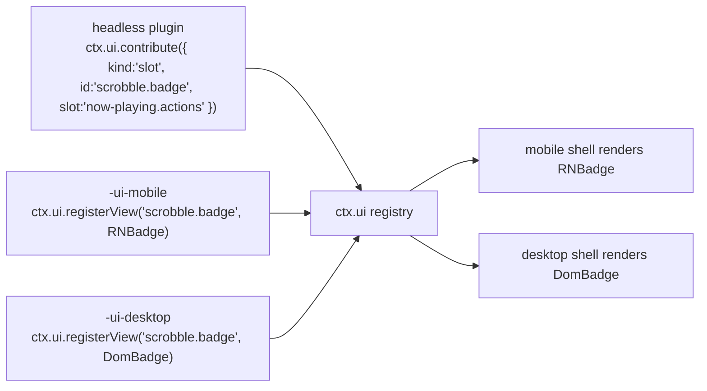

# UI 架构与描述符贡献模型

> **历史章节映射：** 原 `docs-zh/08-ui-architecture.md §1 – §5，§7 – §9`。

> **本篇回答什么。** [02 §1](../architecture/layers.md#1-分层模型) 中的 **Layer 4**：一个插件如何向两个不共享任何组件代码的外壳贡献用户界面、视图如何在不拥有数据的前提下找到数据，以及"逻辑"与"视图"的边界画在哪里。

依据 [ADR-2](../architecture/overview.md#adr-2--ui-拆分移动端-react-native桌面端-react-dom)，共有两个视图层：移动端用 React Native，桌面端用 React DOM。这一选择的代价完全在本文所述之处支付，而本文要讲的正是如何把这份代价控制在一定范围内。

---

## 1. 三包约定

带 UI 的功能最多拆分为三个包。这种拆分不是官僚流程 —— 正是它让 ADR-2 只复制功能的*像素*，而不是复制*整个*功能。

```
@BBeBee/plugin-scrobble               ← headless: service, state, events, persistence
@BBeBee/plugin-scrobble-ui-mobile     ← React Native views
@BBeBee/plugin-scrobble-ui-desktop    ← React DOM views
```

| 包 | 层 | 包含 | 可导入 |
|---|---|---|---|
| headless | 3 | Cordis 插件本体、全部逻辑、全部状态、全部数据库访问、全部网络操作 | 仅 `@BBeBee/protocol` |
| `-ui-mobile` | 4 | 组件以及命名这些组件的描述符 | `react`、`react-native`、`@BBeBee/ui-kit-mobile`、headless 包的**类型** |
| `-ui-desktop` | 4 | 组件以及命名这些组件的描述符 | `react`、`react-dom`、`@BBeBee/ui-kit-desktop`、headless 包的**类型** |

这一拆分正是 Layer 4/Layer 5 边界的具体化。Layer 5 是业务*编排*所在之处 —— 先点这个按钮，再弹那个确认框，然后跳这处导航 —— 而它所编排的业务*规则*则留在 Layer 4，在那里无需渲染器即可测试，并能原封不动地被另一个目标的视图复用。

让这套约定成立的规则：

> **UI 包中不包含任何需要写两遍的逻辑。**

如果你正准备在两个 UI 包里写同一个 `if`，那它就该放进 headless 包 —— 通常作为服务上的一个派生值，或服务暴露的一个选择器（selector）。实践中 UI 包最终都很薄：布局、手势与事件绑定而已。

headless 包可以独立工作。没有 UI 包的插件依然能正常运行；它只是不贡献任何可见的东西 —— 这正是某个目标平台上没有为它编写视图时所发生的事情。

---

## 2. 贡献即描述符

插件从不把组件直接交给外壳。它们注册的是**描述符（descriptor）** —— 指向某个视图的可序列化声明 —— 再由外壳在自己的注册表中解析这个名字。

```ts
export type Contribution =
  | RouteContribution
  | SlotContribution
  | CommandContribution
  | SettingsContribution
  | MenuContribution

export interface RouteContribution {
  kind: 'route'
  id: string                       // 'scrobble.history'
  path: string                     // '/scrobble/history'
  title: string                    // i18n key
  icon?: string                    // name from the shared icon set
  /** Where the shell should offer navigation to it. */
  placement?: ('sidebar' | 'tab-bar' | 'more-menu' | 'tray')[]
  order?: number
}

export interface SlotContribution {
  kind: 'slot'
  id: string
  slot: SlotId                     // a well-known extension point
  order?: number
  /** Evaluated against slot context to decide visibility. Pure, cheap, synchronous. */
  when?: (ctx: SlotContext) => boolean
}

export interface CommandContribution {
  kind: 'command'
  id: string                       // 'player.togglePlay'
  title: string
  icon?: string
  defaultKeybinding?: string       // desktop only; ignored on mobile
  run(args?: unknown): void | Promise<void>
}

export interface SettingsContribution {
  kind?: 'settings'
  id: string
  /** 目标分类分段：'general' | 'playback' | 'audio' | 'sources' | 'storage' | 'about' 或自定义 ID */
  section: 'general' | 'playback' | 'audio' | 'sources' | 'storage' | 'about' | (string & {})
  title: string
  description?: string
  order?: number
  icon?: string
  actionText?: string
  /** 展示模式：card（内嵌卡片视图）、link（操作按钮/导航行）、auto（自动适配） */
  display?: 'card' | 'link' | 'auto'
  action?: () => void | Promise<void>
  /** 自动表单渲染模式（未注册自定义视图时生效） */
  schema?: ParamSchema
}

export interface MenuContribution {
  kind: 'menu'
  id: string
  /** Desktop application menu bar. Mobile maps these into the more-menu. */
  menu: 'file' | 'edit' | 'view' | 'playback' | 'help'
  title: string
  /** The command run when selected — menus never carry their own logic. */
  command: string
  order?: number
  /** Rendered as a checkbox item, driven by this predicate. */
  checked?: () => boolean
}

export interface TrayContribution {
  kind?: 'tray'
  id: string
  title: string
  icon?: string
  targetRoute?: string
  order?: number
  when?: (ctx: SlotContext) => boolean
  action?: () => void | Promise<void>
}

export type Contribution =
  | RouteContribution
  | SlotContribution
  | CommandContribution
  | SettingsContribution
  | MenuContribution
  | TrayContribution

export interface UiService {
  contribute(c: Contribution): Disposable
  /** Called by each shell's view package to bind an id to a component. */
  registerView(id: string, component: unknown): Disposable

  navigate(id: string, params?: Record<string, unknown>): void

  readonly routes: readonly RouteContribution[]
  slotsFor(slot: SlotId): readonly SlotContribution[]
  readonly commands: readonly CommandContribution[]
  readonly menus: readonly MenuContribution[]
  readonly settings: readonly SettingsContribution[]
  readonly tray: readonly TrayContribution[]
  runCommand(id: string, args?: unknown): Promise<void>
  viewFor(id: string): unknown | undefined
  missingViews(): string[]
}
```

`registerView` 有意接受 `unknown`：`@BBeBee/protocol` 不得依赖 `react`、`react-native` 或 `react-dom`，因为导入它的是运行在完全没有 React 的环境中的 headless 插件。类型转换在外壳边界处完成 —— 每个外壳只有一处 `as ComponentType`，而不是让 React 依赖渗透进契约层。

### 槽位（slot）

众所周知的扩展点，在 `@BBeBee/protocol` 中逐一枚举，从而保证两个外壳实现的是同一套：

```ts
export type SlotId =
  | 'now-playing.actions'        // 播放栏操作按钮区（如 mini-player.button、desktop-lyrics.toggle、queue.button 等插件按钮）
  | 'now-playing.panel'          // tabs in the expanded player (lyrics, queue, related)
  | 'now-playing.visualizer'     // 音频可视化画布插槽
  | 'track.context-menu'         // right-click / long-press on a track
  | 'album.context-menu'
  | 'library.sidebar'            // extra library sections
  | 'search.results-section'     // an extra results group
  | 'settings.sources'           // the source list: import, groups, enable, reorder
  | 'source.browse'              // a source's explore tree
  | 'topbar.tray'                // 顶部栏托盘插槽（桌面端）
  | 'status-bar'                 // desktop only; ignored on mobile
```

> **注意：播放栏右侧操作区、设置页与顶部栏托盘完全解耦**：
> - 播放栏右侧的图标（小窗模式/灵动岛、悬浮歌词开关、播放队列）不再硬编码在 `NowPlayingBar`，而是由对应插件向 `'now-playing.actions'` 槽位贡献并在视图注册表中注册组件，底栏按 `order` 升序与 `when` 谓词动态渲染。
> - 各插件的配置选项由插件通过 `ctx.ui.contribute({ kind: 'settings', ... })` 或 `ctx.settings.contribute(...)` 自主向设置服务贡献，设置页自动聚合展示，支持内嵌卡片（`display: 'card'`）与导航行（`display: 'link'`）。
> - 桌面端顶部栏在“导入分享”按钮旁提供类似 Windows 托盘的展开按钮（折叠时朝下箭头 `chevron-down`，展开时朝上箭头 `chevron-up`）。插件可在路由中通过 `placement: ['tray']` 或通过 `TrayContribution` 自主决定是否显示在主界面托盘中。点击托盘中的插件图标将通过 `ctx.ui.navigate(...)` 自动跳转至该插件主界面页面并收起托盘。设置页正是走了这条路：其路由携带 `'tray'` placement，因此“设置”无需任何顶部栏专属代码即可出现在托盘中。

槽位渲染是插件的 UI 真正现身的地方：

```tsx
// @BBeBee/ui-kit-desktop
export function Slot({ id, context }: { id: SlotId; context: SlotContext }) {
  const items = useSlot(id, context)
  return <>{items.map((it) => {
    const View = ui.viewFor(it.id) as ComponentType<{ context: SlotContext }> | undefined
    return View ? <View key={it.id} context={context} /> : null
  })}</>
}
```

---

## 3. 从描述符解析到视图

描述符给出一个视图 id。外壳在注册表中查找它，注册表的内容来自为*当前*目标平台加载的那份 UI 包。



**视图缺失是常态，而非错误。** 插件可以只提供桌面视图而无移动端视图（比如多列日志检查器），反之亦然（比如手势驱动的迷你播放器）。贡献本身照常注册，只是槽位为它渲染出空。这是 ADR-2 直接且持续的代价，而把它当作一等状态而非崩溃，正是让这套架构能够存续的关键。

值得强制执行的三条推论：

- 描述符必须携带足够的信息，以便在没有对应视图时也能被*列出* —— 标题与图标。某个目标平台没有对应视图的设置页仍然可以出现，以禁用状态显示"在此平台不可用"，而不是留下一个用户无法理解的空洞。
- `when` 谓词在外壳中运行，必须是同步且廉价的；它们在渲染期间执行。
- 没有视图的命令依然完全可用 —— 它出现在桌面端的命令面板和移动端的更多菜单中。命令是让一个功能在两个平台上都可触达的最廉价方式。

---

## 4. 把服务绑定到 React

来自 [02 §6](../architecture/layers.md#6-状态归属) 的规则：**React 不持有任何领域状态。** 状态由服务拥有，组件负责订阅。

`ui-kit-mobile` 与 `ui-kit-desktop` 都构建在 `@BBeBee/ui-core` 中同一个共享的、与框架无关的 hook 层之上，它只依赖 `react` 和 `@BBeBee/protocol`：

```ts
// @BBeBee/ui-core
export function useService<K extends ServiceKey>(key: K): Context[K] | undefined

/**
 * Subscribe to service state via useSyncExternalStore, so React 18 concurrent
 * rendering cannot tear. `select` must be referentially stable across calls
 * for unchanged inputs — return primitives or memoised objects.
 */
export function useServiceState<K extends ServiceKey, T>(
  key: K,
  events: (keyof Events)[],
  select: (svc: Context[K]) => T,
): T
```

功能专属的 hook 是薄封装，它们放在 **headless** 包中，从而被两个外壳共享：

```ts
// @BBeBee/plugin-player/hooks — shared by both UI packages
export const useTransport = () =>
  useServiceState('player', ['player/state-changed'], (p) => p.state)

export const useQueue = () =>
  useServiceState('player', ['queue/changed'], (p) => p.queue)

/** Position updates at 1 Hz; the UI interpolates with rAF between ticks. */
export const usePosition = () =>
  useServiceState('player', ['player/position'], (p) => p.state.positionMs)
```

这正是三包拆分体现价值的地方。hook —— 那些真正包含"哪个事件使哪份状态失效"这一逻辑的部分 —— 只写一遍。需要写两遍的只有 JSX。

### 渲染规则

- **领域操作不用 `useEffect`。** 任何抓取、写入或修改领域状态的 effect，都应属于组件所调用的某个服务方法。
- **乐观更新放在服务中**，而不是组件里，这样两个外壳在写入失败并回滚时的行为完全一致。
- **列表必须虚拟化。** 移动端用 `FlashList`，桌面端用 `@tanstack/react-virtual`。曲库可能容纳 10 万首曲目；在哪个平台上直接渲染这么多都撑不住。
- **`player/position` 用插值，绝不轮询。** 该事件以 1 Hz 触发（[07 §5](../data-model/events.md#5-事件表)）；进度条在两次事件之间用 `requestAnimationFrame` 做动画，并在每个事件到来时重新对齐。
- **封面图先渲染 `blurhash`**，再加载图片（[07 §4.2](../data-model/schema.md#42-封面图)）。没有布局跳动，滚动时也没有灰色闪烁。

---

### 音源相关界面

有四个界面承载了整个源字符串模型，值得逐一点名，因为它们是这套 UI 中在传统播放器里没有对应物的部分。这四个界面全部由 `plugin-source-runtime-ui-{mobile,desktop}` 贡献，而且全部是普通描述符 —— 没有任何特殊待遇。

| 界面 | 做什么 | 拆分上的说明 |
|---|---|---|
| **源列表** | 启用、禁用、重排、分组，并查看每个源的健康徽标 | 普通列表；对等性是免费的 |
| **导入审核** | 在任何内容被写入之前，展示粘贴进来的源字符串里有什么 —— 新增 / 更新 / 拒绝，以及主机白名单（[06 §9](../sources/authoring.md#9-导入更新与分享)） | 唯一绝不可跳过的界面，因此它在两端都是模态路由，而不是槽位 |
| **规则追踪器** | 运行一步，并展示每条规则的输入、输出与耗时（[06 §10](../sources/authoring.md#10-诊断一个坏掉的源)） | 一份可以长距离滚动的日志，每一行都带一条可编辑的规则 —— 应用中最接近开发者工具的东西，也是用户能够自己修好一个源的原因 |

让这件事保持低成本的正是 [§1](#1-三包约定) 的那条规则：解析、校验、diff、追踪与脱敏全部位于 headless 包。视图包要做的只是展示一个列表和一个文本框。

---

## 5. 导航

| | 移动端 | 桌面端 |
|---|---|---|
| 路由器 | Expo Router（基于文件） | `ui-kit-desktop` 内一个小的内存路由器 |
| 主界面骨架 | 底部标签栏 + 堆栈 | 常驻侧边栏 + 内容面板 |
| 贡献的路由 | 注册为动态路由；`placement` 决定进标签栏还是更多菜单 | 侧边栏条目按 `order` 排序 |
| 返回 | 系统手势 / 硬件按键 | 应用内历史记录，外加 `Cmd/Ctrl+[` |
| 深链接 | 经 `expo-linking` 使用 `BBeBee://` scheme | 同一 scheme 由 `main` 向操作系统注册 |

两个外壳实现同一个供命令使用的 `navigate(routeId, params)`，因此命令在任一目标平台上都能工作，而无需知道底层是哪套路由器。

---

## 6. 上下文菜单、音乐库与详情页规范

### 上下文菜单与音乐库交互

桌面端右键、移动端长按，共用一套菜单。`TrackRow.onMore`、`UnifiedLibraryRow.onMore` 与头部操作项将坐标锚点传递给页面；页面持有 `@BBeBee/ui-menus` 的控制器并渲染 UI Kit 的 `ContextMenu`。菜单模型在 `@BBeBee/ui-menus` 中统一定义，UI Kit 仅负责渲染菜单项与布局，保持双端操作文案、图标与顺序的一致性。

#### 视觉规范与视口边界保护
- **容器样式**：高对比度流媒体暗色卡片（`#242424`），8px 圆角，4px 内边距，深度阴影 `0 12px 32px rgba(0,0,0,0.55)`，1px 微弱边框。
- **操作项分割与图标**：高危或分组操作支持 `divider: true` 分割线。标准操作（编辑、删除、置顶、文件夹、播放、下载等）映射至 16px 矢量线性图标。
- **子菜单视口边界自适应**：二级子菜单（Flyout）实时计算水平（左/右）与垂直（上/下）视口空间，超出时自动翻转并贴合窗口底边，动态计算 `maxHeight` 并开启内部滚动条（`overflowY: 'auto'`），确保子菜单 100% 完整显示在可视区域内，绝不超出应用窗口边界。

#### 实体菜单规范
- **曲目菜单**：
  - `add-to-playlist`：添加到歌单子菜单。单曲不归属于文件夹，不提供加入文件夹选项。
  - `remove-from-playlist`：高危删除色，仅在歌单详情页渲染。
  - `add-favourite` / `remove-favourite`：喜欢/取消喜欢。
  - `enqueue` / `download` / `sleep-timer` / `go-to-album`：入队、下载、睡眠定时器与转至专辑。
- **歌单菜单**：
  - `edit-details`：打开 `EditPlaylistModal` 修改封面、名称与描述。
  - `delete-playlist`：高危红字，点击唤起 `ConfirmDeleteModal` 二次确认弹窗，确认后调用 `ctx.library.deletePlaylist`。
  - `toggle-pin`：置顶/取消置顶。
  - `add-to-playlist`：复制添加至其他歌单。
  - `add-to-collection`：移动至文件夹（支持跨文件夹移动与“移至根目录”，触发原文件夹清理）。
- **专辑菜单**：
  - `delete-album`：高危红字，点击唤起 `ConfirmDeleteModal` 二次确认弹窗，确认后调用 `ctx.library.setSaved(urn, false)`（若在文件夹内，一并解除文件夹关联）。
  - `toggle-pin`：置顶/取消置顶。
  - `add-to-collection`：移动至文件夹（支持跨文件夹移动与移至根目录）。
- **文件夹菜单**：
  - `rename-collection`：打开 `RenameFolderModal` 重命名。
  - `delete-collection`：高危删除，级联删除关系。
  - `toggle-pin`：置顶/取消置顶。
  - `create-playlist` & `create-folder`：在当前文件夹内快速创建歌单或子文件夹。
  - `move-to-folder`：移动至其他文件夹或根目录。
  - `add-to-playlist` / `enqueue`：使用 `collectAllFolderTracks` 递归汇总子歌单与专辑中的曲目。

#### 音乐库展示模式与文件夹收纳
- **折叠模式（72px）**：极简图标磁贴，进入文件夹显示 `<` 返回根目录按钮。
- **侧边栏模式（260–340px）**：支持内联展开折叠（`▼`/`▲`）与子项缩进（28px），点击进入文件夹详情。文件夹内的歌单自动在根列表中隐藏（`containedPlaylistUrns`），移回根目录时恢复显示。
- **展开模式（全屏）**：高密度三列表格，顶部面包屑导航（`音乐库 < 文件夹名`）。

### 详情页与曲目交互规范

- **表格列交互排序**：列头（`#`、`标题`、`专辑`、`添加日期`、`时长`、`播放量`）点击切换升序/降序，带方向指示箭头。操作栏提供专属排序菜单 `ContextMenu`。
- **排序菜单中的视图模式**（`viewModeMenuItems`）：排序菜单底部以分割线收尾，接一个贴左的灰色「视图模式」分组标题与各模式选项（当前模式带勾选）。专辑/歌单/收藏/本地歌曲页提供 紧凑、列表；本地专辑页额外提供 平铺（默认的卡片网格）。紧凑不显示封面并将艺人独立成列（表头同步）；选择按页持久化在 `localStorage`（`bbebee_view_mode:<key>`）。
- **曲目行悬浮操作按钮与爱心弹窗**：
  - 悬停浮现操作按钮：未入库曲目显示 `＋`，点击保存至“最喜欢的音乐”；
  - 已入库曲目（绿心）：点击弹出 Spotify 风格的 `SaveToPlaylistPopover` 浮动卡片，支持实时过滤歌单、快速新建歌单、已点赞歌曲快捷切换、以及歌单/文件夹收纳。
- **播放队列一致性**：表格排序后点击播放，向播放器传递当前排好序的曲目 URN 序列，确保下一首与视觉顺序一致。
- **歌单项 ID 解耦**：歌单详情页将行数据包装为 `{ item, track, trackUrn, originalIndex }`，确保排序后删除等操作准确作用于对应的 `PlaylistItem.id`。

---

## 7. 外壳的职责

外壳很薄。下表中的每一项都是真正的平台专属能力，除了外壳无处安放。

| | `apps/mobile` | `apps/desktop/renderer` |
|---|---|---|
| 启动 | 创建 Context，注册 `core-*-expo`，在 `ctx.inject(['ui'], …)` 内挂载 | 相同流程，使用 `core-*-node` |
| 界面骨架 | 标签栏、堆栈头、安全区内边距 | 侧边栏、标题栏、窗口控制、可调大小的面板 |
| 播放器界面 | 标签栏上方的迷你播放器；可展开为全屏 | 常驻底部栏；可选的独立迷你播放器窗口 |
| 平台专属 | 手势、触觉反馈、下拉刷新 | 右键菜单、拖放、键盘快捷键、托盘、命令面板 |
| 不具备 | 无键盘快捷键、无托盘 | 无手势、无触觉反馈 |

桌面端的**命令面板**（`Cmd/Ctrl+K`）值得单独一提：它直接渲染 `ctx.ui.commands`，因此每个插件命令无需插件作者做任何 UI 工作即可触达。这是整个项目杠杆比最高的外壳代码。

### 7.1 桌面端全局拖拽导入与本地音乐联动

1. **全局拖拽接管**：桌面端主窗口根节点全局监听 `dragover` 与 `drop` 事件，配合全屏指示蒙层，屏蔽 Chromium 默认将拖拽文件当作网页打开的行为。
2. **格式解析与后台扫描**：
   - 音频文件经 `scanner.importFiles` 提取元数据入库，并通过 `media_bindings` 关系表查询对应文件的 `track_urn`；
   - 文件夹经 `scanner.addSpecifiedDir` 加入扫描目录，并调度后台扫描。
3. **视图自动跳转与高亮**：
   - 导入完成后自动导航至 `library.local`（"本地文件"页面），传递 `{ highlightUrns, highlightUrn: highlightUrns[0] }` 参数；
   - 本地音乐页面自动切换至「歌曲」视图模式，将导入歌曲排在默认排序第一位，自动滚动列表至顶部 (`scrollTop = 0`)；
   - 单曲行应用蓝色强调色边框（`3px solid var(--accent-primary, #5F87FF)`）与半透明高亮底色背景（`rgba(95, 135, 255, 0.18)`），8 秒后视觉高亮自动优雅淡出；
   - 页面实时订阅 `library/changed` 与 `scan/finished` 事件，扫描完成或数据更新时即刻重新加载，无需手动刷新。

### 7.2 次级窗口与单内核守卫（以桌面歌词为例）

当桌面端特性需要脱离主应用窗口时 —— 例如**桌面歌词**需要跨窗口悬浮在其他桌面应用上层、主窗口最小化时保持显示、支持多屏自由拖拽并在锁定时开启鼠标穿透：

1. **单 Cordis 内核不变量 (ADR-3)**：次级 `BrowserWindow` 绝对**不能**调用 `boot()` 或创建第二个 Cordis Context。启动第二个内核会导致状态裂脑、事件监听重复触发并破坏插件单例。
2. **被动视图架构（Passive View）**：次级窗口作为纯轻量 React 界面运行，通过 URL 查询参数或哈希（`?window=desktop-lyrics` 或 `#desktop-lyrics`）定向路由，直接挂载视图组件，不加载 Cordis 插件体系。
3. **IPC 数据中枢**：主窗口渲染进程的 UI 适配插件（`plugin-desktop-lyrics-ui-desktop`）通过 `window.BBeBee.desktopLyrics.updateData(...)` 向次级窗口推送歌词、进度和字号数据；同时监听次级窗口操作栏的动作请求（上一首、下一首、暂停、锁定、关窗等），反向派发给主窗口内的 `ctx.player` 与 `ctx.desktopLyrics` 服务执行。
4. **系统级原生集成**：
   - 无边框透明窗口（`frame: false`, `transparent: true`, `backgroundColor: '#00000000'`, `alwaysOnTop: true`, `skipTaskbar: true`）。
   - 全屏自由拖拽：容器样式配置 `-webkit-app-region: drag`，按钮控制项配置 `-webkit-app-region: no-drag`。
   - 鼠标穿透（锁定模式）：动态调用 `lyricWindow.setIgnoreMouseEvents(locked, { forward: true })`，让鼠标穿透歌词点击底层软件。

5. **桌面歌词的交互不使用拖拽区**：
   - 歌词窗口根节点**不能**携带 `-webkit-app-region: drag`——拖拽区会吞掉悬停工具栏依赖的鼠标事件（工具栏曾因此永远不出现）。拖拽改为手动实现：指针捕获 + `desktop-lyrics:set-position` IPC（基于 `screenX/screenY` 增量），拖动结束时通过 `desktop-lyrics:commit-position` 上报最终位置（主进程对程序化移动抑制回声）。
   - 锁定（穿透）时，歌词窗口在工具栏原位置显示唯一的"解锁"胶囊。由于 `forward` 在 Linux 上是空操作，主进程在锁定且可见期间**轮询系统光标**（`desktop-lyrics:cursor`）；渲染端仅在光标位于窗口内时显示该胶囊，并随光标进出胶囊区域切换鼠标处理（`set-ignore-mouse`），窗口其余部分保持完全穿透。

---

## 8. 无障碍

这不是"二期再说"的事，因为事后改造远比一开始就做昂贵。

- 每个可交互元素都有可访问名称 —— 移动端用 `accessibilityLabel`，桌面端用 `aria-label` —— 通过共享组件 props 提供，因此只写一遍。
- 桌面端完全支持键盘导航：可见的焦点环、符合逻辑的 tab 顺序、`Escape` 关闭所有浮层、方向键在列表内移动。
- 移动端遵循系统文字大小设置；令牌的尺寸刻度是相对的，布局在 200% 缩放下经过测试。
- 对比度在两套配色下都达到 WCAG AA —— 由对等性测试检查，而不是靠肉眼。
- `prefers-reduced-motion`（桌面端）与"减弱动态效果"（移动端）会禁用交叉淡入淡出动画与封面视差效果。
- 可视化频谱与任何闪烁元素都遵守减弱动态效果设置，且绝不作为状态的唯一指示。

---

## 9. 接下来去哪

[09 —— 项目结构](../workflow/structure.md) 会把上述一切落成目录树、构建流水线与一组强制执行的规则。
