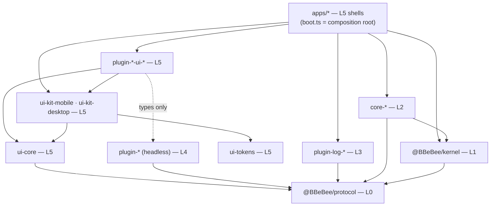

# Monorepo 目录布局与分层架构治理

> **历史章节映射：** 原 `docs-zh/09-project-structure.md §1 – §3`。

> **本篇回答什么。** Monorepo 的布局、以机械方式强制执行的依赖规则、每个目标如何构建、锁定的版本矩阵，以及防止平台抽象腐化的测试策略。

---

## 1. 仓库布局

**文件系统就是分层模型。** 每个包都位于 `packages/<layer>/<package>`，而层目录绝非装饰：它正是 [`eslint.config.js`](#3-依赖规则) 划定规则的依据。一个包由*它住在哪*来治理，因此在层与层之间移动一个包，就是一次 `git mv`，并在同一个提交里改变它的规则。

```
packages/protocol/    Layer 0 —— 契约，零运行时
packages/kernel/      Layer 1 —— 基础设施 + 系统抽象
packages/core/        Layer 2 —— 核心能力服务
packages/logs/        Layer 3 —— 日志传输层
packages/feature/     Layer 4 —— 业务功能模块
packages/ui/          Layer 5 —— 视图与共享 UI 基础设施
packages/tooling/     模型之外 —— 这里的任何东西都不随包发布
```

每个包都在同一深度，因此 `packages/*/*` 一个 glob 就覆盖了整个工作区，每个包的 `tsconfig.json` 也以同一个 `../../../` 抵达基础配置。`apps/` 同属 Layer 5，但它们留在读者预期找到它们的地方。

> ⚠️ **`packages/*/*` 并不完全等于整个工作区，而且这个例外咬过人。** 两个单包层是 `packages/protocol/src` 与 `packages/kernel/src`，比其他所有东西浅一层 —— 于是为深形状写的 glob 会悄无声息地漏掉它们。`vitest.config.ts` 曾经只带着深形状，随之丢掉的是 Layer 0 与 Layer 1 的每一个测试：`layers.test.ts`、`conventions.test.ts`、`shells.test.ts` 与 `cordis-assumptions.test.ts` 都没有被收集，而一套关掉了架构自身守卫的测试跑起来，与开着守卫的运行报告成功的方式一模一样。任何以 glob 扫包的工具都需要同时携带两种形状。

以层的*职责*而非编号来命名目录，带来两个后果。各层不再按自己的顺序排序 —— 字母序是 `core`、`feature`、`kernel`、`protocol`、`ui`，上表就是需要记住的那张映射。而两个单包层读起来是叠词，`packages/protocol` 与 `packages/kernel`，这是每个包都坐在同一深度所付出的代价；另一种做法恰恰要对最可能迎来第二个包的那两层做特判。

`✅` = 已建成并通过 `pnpm check`。没有它的都是已设计但尚未写出的东西。

```
B_Be_Bee/
│
├── apps/                                   🔹 LAYER 5 —— 应用外壳
│   ├── mobile/                     ✅        Expo app
│   │   ├── src/boot.ts                        组合根：注册 core-*-expo (02 §1)
│   │   ├── src/plugins.ts                     允许清单，以数据形式存在 —— 什么都不导入
│   │   ├── src/App.tsx                        挂载在 ctx.inject(['ui'], …) 之内
│   │   ├── generated/plugins.ts               代码生成：静态插件导入 (03 §6.1)
│   │   ├── app.json · index.js                Expo 入口 + 配置
│   │   ├── metro.config.js                    package exports + watchFolders (§4)
│   │   ├── babel.config.js
│   │   └── android/ · ios/                    dev-client 原生工程
│   └── desktop/                    ✅        Electron app
│       ├── main/                              仅 IPC 宿主，不含领域逻辑 (02 §2)
│       ├── preload/                           contextBridge 暴露面
│       ├── renderer/                          React DOM 外壳 + 内核 (ADR-3)
│       │   ├── boot.ts · plugins.ts             组合根 + 允许清单
│       │   └── main.tsx · Shell.tsx             挂载 + 窗口装饰
│       └── electron.vite.config.ts
│
├── packages/
│   │
│   ├── protocol/                    🔹 LAYER 0 —— 契约层
│   │       │                                 @BBeBee/protocol。零运行时依赖、无副作用、
│   │       └── src/                          不触碰平台 —— 这正是它可以从任何层安全导入
│   │           │                             的原因，也是每一层都被 mock 的那条接缝
│   │           ├── services/                 fs · http · db · secrets · audio · player ·
│   │           │                             sources · ui · … (04)
│   │           ├── entities/                 Track, Album, StreamHandle, TransportState … (07)
│   │           ├── events.ts                 类型化事件表 (07 §5)
│   │           ├── errors.ts · frac-index.ts 那点配得上其存在的小型纯运行时
│   │           └── conformance/              共享契约套件：一份测试文件，对着一个键的
│   │                                         两份实现都运行 (04 §18)
│   │
│   ├── kernel/                      🔹 LAYER 1 —— 基础设施 + 系统抽象
│   │       │                                 @BBeBee/kernel。只依赖 protocol 与 cordis，
│   │       └── src/                          工作区里别的什么都不依赖 —— 一个知道
│   │           │                             哪些插件存在的内核就不是内核
│   │           ├── index.ts                  两个表面，可得性并不对等：锁定的 Cordis
│   │           │                             再导出对所有层开放，其下的引导表面只有
│   │           │                             Layer 2 与组合根可用 (02 §1)
│   │           │                             ── 按关注点划分，测试与主体同置：
│   │           ├── bootstrap/                createApp、启动顺序、落定、外壳接线
│   │           ├── config/                   解析、启用/禁用、默认值
│   │           ├── loader/                   注册表 → ctx.plugin()，fiber 状态上报
│   │           ├── capability-gate/          作用域划分与 SQL 守卫 (03 §7)。sql.ts 与
│   │           │                             apps/desktop/main 共享，因此一份允许清单
│   │           │                             同时覆盖被闸的路径与 IPC 宿主
│   │           ├── migrations/               核心 schema 迁移 (07 §6)
│   │           │                             ── 以及不属于任何单一关注点的：
│   │           ├── fiber-state.ts            上游无法导出的 FiberState 镜像
│   │           ├── testing.ts                @BBeBee/kernel/testing —— snapshotContext (§6)
│   │           └── *.test.ts                 conventions · layers · cordis-assumptions：
│   │                                         它们扫描的是工作区，不是内核
│   │
│   ├── core/                        🔹 LAYER 2 —— 核心能力服务
│   │   │                                      唯一获准导入平台 SDK 的包，也是唯一获准
│   │   │                                      驱动内核的包。每个键每个目标一份实现；
│   │   │                                      不含领域知识 —— 它们没有一个知道曲目是什么。
│   │   ├── core-paths-node/        ✅        ctx.paths
│   │   ├── core-paths-expo/        ✅
│   │   ├── core-fs-node/           ✅        ctx.fs —— 虚拟文件系统 (04 §1)
│   │   ├── core-fs-expo/           ✅
│   │   ├── core-db-node/           ✅        ctx.db —— node:sqlite / expo-sqlite (04 §3)
│   │   ├── core-db-expo/           ✅
│   │   ├── core-store-fs/          ✅        ctx.store —— 单一实现，经 ctx.fs (04 §4)
│   │   ├── core-http-node/         ✅        ctx.http —— 传输层是一条接缝：桌面端用
│   │   ├── core-http-rn/           ✅          Electron 的 net 填上，移动端用 expo/fetch
│   │   ├── core-secrets-node/      ✅        ctx.secrets。⚠️ 名字带 -node 却不分平台：它
│   │   │                                       经由 ctx.fs 持久化，因此在 Electron
│   │   │                                       被沙箱化的渲染进程里也能加载
│   │   ├── core-secrets-expo/      ✅
│   │   ├── core-device-electron/   ✅        ctx.device —— 网络、电量、媒体键
│   │   ├── core-device-expo/       ✅
│   │   ├── core-background-electron/ ✅      ctx.background —— wake lock、挂起
│   │   ├── core-background-expo/   ✅
│   │   ├── core-media-session-electron/ ✅   ctx.mediaSession —— OS 的"正在播放"表面
│   │   ├── core-media-session-rn/  ✅
│   │   ├── core-codec-node/        ✅        ctx.codec —— 标签：经 ctx.fs 用
│   │   ├── core-codec-rn/          ✅          music-metadata 读取；-rn 再加上设备的解码器
│   │   ├── core-audio-webaudio/    ✅        ctx.audio —— 两个平台都用 react-native-audio-api (05 §1)
│   │   ├── core-js-quickjs-node/   ✅        ctx.js —— 音源沙箱 (04 §19)
│   │   ├── core-js-quickjs-expo/             ⚠️ 唯一的 M2 缺口：Hermes 没有 WASM
│   │   ├── core-desktop-bridge/    ✅        renderer↔main IPC 客户端 + main 侧宿主。
│   │   │                                       进程边界两侧都是 Layer 2
│   │   └── core-…                            ctx.ws · ctx.notify · ctx.crypto · ctx.shell
│   │
│   ├── logs/                        🔹 LAYER 3 —— 日志传输层
│   │   │                                      Cordis exporters，跨平台共享，决定一行日志
│   │   │                                      最终落在哪。唯一获准写控制台的层；它之上的
│   │   │                                      一切都经 ctx.logger 记日志 (04 §16)。从各外壳
│   │   │                                      的引导数组加载，因此在第一个功能插件启动
│   │   │                                      之前它们就已经在运行。
│   │   ├── plugin-log-buffer/       ✅        ctx.logBuffer —— 日志查看器读取的那个环
│   │   ├── plugin-log-console/      ✅        仅开发用：带作用域前缀的 console.*
│   │   ├── plugin-log-file/         ✅        仅随包发布的构建：经 ctx.fs 的轮转 NDJSON
│   │   └── plugin-log-crash/                 用户可附在报告里的崩溃包
│   │
│   ├── feature/                     🔹 LAYER 4 —— 业务功能模块
│   │   │                                      每包一项业务能力，无 UI：状态、持久化、
│   │   │                                      网络、事件。只导入 @BBeBee/protocol 与内核
│   │   │                                      的插件表面 —— 绝不导入平台 SDK，绝不导入
│   │   │                                      core-* 包（Layer 2 依赖写作 `inject: ['fs']`），
│   │   │                                      也绝不导入传输层（日志是 `ctx.logger`）。
│   │   ├── source-rules/           ✅        规则语言作为纯逻辑：无 Cordis、无平台、
│   │   │                                       无 I/O (06 §3)。parse.ts 是解析器，
│   │   │                                       evaluate.ts 是引擎及其类型强转，
│   │   │                                       jsonpath.ts · template.ts 是两种方言，
│   │   │                                       regex-guard.ts 是 ReDoS 上界
│   │   ├── plugin-source-runtime/  ✅        把 source-rules 绑定到 ctx.http · ctx.js (06 §4)
│   │   ├── plugin-sources/         ✅        ctx.sources 注册表 + 目录 (06 §4.1)
│   │   ├── plugin-source-local/    ✅        唯一不是字符串的提供方 (06 §12)
│   │   ├── plugin-local-scanner/   ✅        ctx.scanner —— ≥5,000 文件的语料遍历
│   │   ├── plugin-player/          ✅        ctx.player —— 传输、队列、历史 (05 §2)
│   │   ├── plugin-ui/              ✅        ctx.ui 贡献注册表 —— 只有描述符，
│   │   │                                       因此它不持有任何 React (08 §2)
│   │   ├── plugin-inspector/       ✅        fiber 树 + 带标注的 effect (M0 完成标准)
│   │   ├── plugin-dsp/                       ctx.dsp —— 效果链 (05 §3)
│   │   ├── plugin-effect-eq10/               一个 DSP 效果，作为一个插件
│   │   ├── plugin-library/          ✅       播放列表、收藏、智能列表
│   │   ├── plugin-lyrics/          ✅        ctx.lyrics —— 歌词缓存、音源解析与播放进度同步
│   │   ├── plugin-desktop-lyrics/  ✅        ctx.desktopLyrics —— 桌面悬浮歌词与独立次级窗口控制器
│   │   ├── plugin-cache/           ✅        http/request 缓存层
│   │   └── plugin-…
│   │
│   ├── ui/                          🔹 LAYER 5 —— 视图与 UI 基础设施
│   │   │                                      布局、手势、事件接线，以及把一次用户意图
│   │   │                                      编排为一串功能调用的部分。任何你会因此写
│   │   │                                      两遍的东西都属于无 UI 的兄弟包，视图包只为
│   │   │                                      TYPES 而导入它。
│   │   ├── ui-tokens/              ✅        以纯数据形式存在的设计令牌 + WCAG AA 闸门 (08 §8)
│   │   ├── ui-core/                ✅        框架无关的钩子 + 共享 prop 类型
│   │   ├── ui-parity/              ✅        组件契约，以及检查两套组件库
│   │   │                                       是否满足它的测试 (08 §6)
│   │   ├── ui-kit-mobile/          ✅        React Native 组件
│   │   ├── ui-kit-desktop/         ✅        React DOM 组件
│   │   ├── plugin-player-ui-desktop/ ✅      ┐ 正在播放、播放控制、队列
│   │   ├── plugin-player-ui-mobile/  ✅      ┘
│   │   ├── plugin-sources-ui-desktop/ ✅     ┐ 曲库、专辑详情、音源列表、导入
│   │   ├── plugin-sources-ui-mobile/  ✅     ┘ 审查、测试界面 (08 §4)
│   │   ├── plugin-local-scanner-ui-desktop/ ✅ ┐ 设置：扫描根目录
│   │   ├── plugin-local-scanner-ui-mobile/  ✅ ┘
│   │   ├── plugin-inspector-ui-desktop/ ✅   渲染出来的 fiber 树
│   │   ├── plugin-lyrics-ui-desktop/ ✅      播放详情页右侧歌词面板，平滑滚动高亮与点击跳转
│   │   └── plugin-desktop-lyrics-ui-desktop/ ✅ 底部栏桌面歌词按钮与原生 Electron 独立窗口 IPC 适配器
│   │
│   └── tooling/                            🔧 分层模型之外
│       │                                      开发辅助。这里没有任何东西进入应用
│       │                                      bundle，这正是层规则不约束它们的原因。
│       ├── tooling-gen-plugins/    ✅        静态注册表代码生成 (pnpm gen:plugins)
│       ├── tooling-create-plugin/  ✅        脚手架 (pnpm new:plugin)
│       └── tooling-fixtures/       ✅        ≥5,000 文件的语料库生成器、一台带插桩的
│                                             ctx.fs，以及契约套件运行所在的
│                                             按字节服务的 http fixture
│
├── sources/                                  多文件音源开发源码目录（source.json + source.js 双文件维护）
├── fixtures/sources/                         编译后的单文件示例音源文档；黄金语料库 (§6)
├── scripts/                                  工程脚本（scripts/sources/ 音源打包、校验与热重载工具）
├── test/stubs/                               Node 无法加载的三个原生模块，由
│                                             vitest.config.ts 别名：react-native-audio-api
│                                             对任何真正原生的东西抛错，expo-sqlite 与
│                                             expo-file-system 则真的能用 (§6)
├── docs/                                     这套文档
├── eslint.config.js                          flat config；层规则都定义在这里 (§3)
├── tsconfig.base.json                        每个包的 tsconfig 都扩展它
├── vitest.config.ts · vitest.global.ts       别名 + 每次运行在下面分配的暂存根目录
├── pnpm-workspace.yaml · .npmrc
└── package.json                              根脚本：check、gen:plugins、new:plugin、build:sources、watch:sources
```

### 为什么层是一个目录

另一种做法 —— 扁平的 `packages/`，由*前缀*承载层信息 —— 是本仓库在分层模型被强制执行之前的形态，它也能用。它做不到的是让层变得**结构化**。目录成为分组方式之后，有三件事变了：

- **lint 规则认位置，不认拼写。** `packages/core/**` 就是获准触碰平台 SDK 的那组包，成员资格是关于文件系统的事实，而不是一种可能被一个名叫 `plugin-fs-helper` 的包悄悄蒙混过去命名约定。
- **层的变更就是一次移动。** 把一个功能插件提升为核心服务，是 `git mv packages/feature/x packages/core/x`，它的规则随之改变，在同一个提交里、在评审中清晰可见。
- **新包必须做出选择。** 脚手架写进 `feature/` 或 `ui/`（[§7](#7-开发工作流)），于是"这个包属于哪一层？"在创建时就被回答，而不是日后从它最终导入了什么来推断。

代价是到处多出一个路径段 —— 在 `pnpm-workspace.yaml` 里、在每个包的 `extends` 里、以及在扫描工作区的测试里，后者现在靠扫描 `packages/*/*` 来定位一个包，而不是把名字拼到 `packages/` 后面。这笔代价只付一次，而且在这个布局落地时就已付清。扫描器拿目录列表当事实来源，而不是一份写死的清单，因此层目录可以改名 —— 事实上就从 `layerN-*` 改成了裸名 —— 而不必触碰它们。

嵌套在包*内部*也物有所值，它区分开那些读者真正会混淆的东西：`protocol` 的 `src/services/` 与 `src/entities/`，以及 `kernel` 里的各关注点目录 —— `bootstrap/`、`config/`、`loader/`、`capability-gate/`、`migrations/`。内核是唯一一个干着五件互不相关工作的包，每个目录都把自己的测试放在旁边。

### 命名

**目录**决定层，进而决定一个包获准导入什么。**前缀**仍然说明它是什么类型的东西，二者按构造方式保持一致 —— 出现在 `feature/` 里的 `core-` 包，是读者一眼能看出的错误。

| 目录 | 层 | 持有的前缀 |
|---|---|---|
| `protocol/` | 0 | `protocol` —— 契约。仅一个包，无运行时 |
| `kernel/` | 1 | `kernel` —— 仅一个包 |
| `core/` | 2 | `core-<service>-<platform>` —— 某项核心服务的平台实现 |
| `feature/` | 3 | 无 UI 的 `plugin-<feature>`、DSP 效果用的 `plugin-effect-<id>`，以及 `source-rules` —— 它是源运行时之下的纯逻辑，不是插件 |
| `ui/` | 4 | 视图用的 `plugin-<feature>-ui-<target>`，两套组件库共享基础设施用的 `ui-*` |
| `tooling/` | — | `tooling-*`。在分层模型之外，因为这里的任何东西都不随包发布 |

如今刻意**不再有 `plugin-source-<protocol>` 前缀**。一个音乐后端是一份音源文档（[06](../sources/spec.md)），不是一个包。名字里带 `source` 的只有两个包：解释文档的 `plugin-source-runtime`，以及没有 HTTP 可描述的 `plugin-source-local`（[06 §12](../sources/authoring.md#12-不是字符串的东西本地文件)）。本仓库随附的示例文档存放在 `fixtures/sources/`，而不在 `packages/` 里。

---

## 2. 包分层

与 [02 §1](../architecture/layers.md#1-分层模型) 相同的六层，画成实际的 `package.json` 图。每个节点都标注了所属层，这里的每条边都是真实的 `dependencies` 条目 —— 服务键造成的运行时边被刻意略去，因为这是构建图。



凡是不指向 `@BBeBee/protocol` 的箭头都只是便利。*指向* `protocol` 的箭头才是架构本身。

有几条边值得读上两遍，因为它们是分层模型加以*约束*而非*禁止*的对象：

- **`apps/* → @BBeBee/kernel` 与 `apps/* → core-*`** 只为组合根而存在 —— 每个外壳那一对 `boot.ts` / `plugins.ts`。`apps/*` 下的其余文件都是纯粹的 Layer 5，也被当作 Layer 5 来 lint（[§3](#3-依赖规则)）。
- **`apps/* → plugin-log-*`** 是出于同样理由的同一个例外。传输层是引导条目，不是注册表条目 —— 它们在核心服务之后、功能插件之前启动，这正是 Layer 3 的*含义* —— 而只有组合根获准以导入的方式点名一个插件。仓库里没有其他任何东西导入传输层；一切都经 `ctx.logger` 记日志（[04 §16](../services/contracts.md)）。
- **`core-* → @BBeBee/kernel`** 是唯一一处由包（而非外壳）导入引导表面的地方：`core-db-*` 运行核心迁移，并为能力门划分 context 作用域。这正是 Layer 2 在履行其适配层职责。

没有任何 `plugin-* → core-*` 的边，这是刻意的；也没有任何 `plugin-* → plugin-log-*` 的边。一旦出现这样的边，分层模型就被破坏了，`pnpm lint` 会指出来 —— 背后还有 `layers.test.ts`，因为一条匹配不到任何东西的 lint 模式什么也禁止不了，读起来却与一条正常工作的模式一模一样。

---

## 3. 依赖规则

[02 §1](../architecture/layers.md#1-分层模型) 的分层模型价值几何，完全取决于它的执行力度，因此它由 ESLint 按路径限定 `overrides` 来机械执行，而不是靠评审把关。由于 [§1](#1-仓库布局) 把每个包都放进了它的层目录，这些路径*就是*层：`packages/core/**` 不是一厢情愿匹配对包的命名约定，它恰恰就是 Layer 2 里那组包。下面每条规则都声明了自己守护的是哪一层边界。这是对 `eslint.config.js` 的节选读法 —— 文件本身才是权威。

```js
// eslint.config.js — the rules that matter
const PLATFORM_SDKS = [
  'expo', 'expo-*', 'expo/*', 'react-native', 'react-native/*', 'react-native-*',
  'electron', 'electron/*', 'node:*', 'fs', 'fs/promises', 'path', 'os', 'crypto',
  'child_process', 'better-sqlite3', 'music-metadata', 'ws',
]

// 02 §1 — the kernel's plugin surface: the pinned Cordis re-exports, which
// only *type* a plugin. An allow-list rather than a ban-list on the bootstrap
// surface, so a new kernel export is closed to Layers 3, 4 and 5 by default.
const KERNEL_PLUGIN_SURFACE = [
  'Context', 'Service', 'Inject', 'FiberState', 'fiberStateName', 'isActive', 'isSettled',
  'Plugin', 'Fiber', 'Effect', 'EffectMeta', 'InjectSpec', 'FiberStateName', 'FiberStateValue',
]

const KERNEL_GUARD = {
  name: '@BBeBee/kernel',
  allowImportNames: KERNEL_PLUGIN_SURFACE,
  message: 'Layers 3, 4 and 5 may be typed by the kernel but may not drive it. See docs/02 §1.',
}

// Both forms: a gitignore-style `*` does not cross a `/`, so the bare name
// alone would let `@BBeBee/core-desktop-bridge/main` through.
const CORE_PACKAGES = ['@BBeBee/core-*', '@BBeBee/core-*/**']

// 04 §16 — Layer 3. Everything above it logs through `ctx.logger`, so nothing
// above it names a transport: an import pins one implementation into code
// whose point is not to know, and keeps it loaded for as long as the importer
// lives.
const LOG_PACKAGES = ['@BBeBee/plugin-log-*', '@BBeBee/plugin-log-*/**']

// The composition root: the only files that may call createApp and name a
// Layer 2 package by import. `apps/*/generated/plugins.ts` is codegen and is
// in the global `ignores`.
const COMPOSITION_ROOT = [
  'apps/mobile/src/boot.ts', 'apps/mobile/src/plugins.ts',
  'apps/desktop/renderer/boot.ts', 'apps/desktop/renderer/plugins.ts',
]

export default tseslint.config(
  {
    // 02 §1 — Layers 4 and 5, addressed by directory. Every invariant at once,
    // because ESLint *replaces* a rule's options rather than merging them:
    // every block covering a file has to restate the whole ban, or the
    // narrower block silently disables the wider one.
    files: ['packages/feature/**/*.{ts,tsx}', 'packages/ui/**/*.{ts,tsx}',
            'packages/protocol/**/*.ts'],
    ignores: ['packages/ui/plugin-*-ui-*/**/*.{ts,tsx}'],
    rules: {
      'no-restricted-imports': ['error', {
        paths: [KERNEL_GUARD],
        patterns: [...PLATFORM_SDKS, ...CORE_PACKAGES, ...LOG_PACKAGES],
      }],
      // 04 §16 — the other half of the same rule. A line written straight to
      // the console skips the redactor and reaches neither the ring buffer nor
      // the log file, which are what a bug report carries.
      'no-console': 'error',
    },
  },
  {
    // 02 §1 — Layer 3 itself. Bound by THE invariant like everything above
    // core, and exempt from `no-console`, which is the layer's job: it is the
    // whole of plugin-log-console, and plugin-log-file's last resort when the
    // write it exists to perform is the thing that failed.
    //
    // The negated pair is load-bearing. An extglob (`plugin-!(log-)*`) parses,
    // matches nothing, and bans nothing while looking correct.
    files: ['packages/logs/**/*.ts'],
    ignores: ['packages/logs/**/*.test.ts'],
    rules: {
      'no-restricted-imports': ['error', {
        paths: [KERNEL_GUARD],
        patterns: [...PLATFORM_SDKS, ...CORE_PACKAGES,
                   '@BBeBee/plugin-*', '@BBeBee/plugin-*/**',
                   '!@BBeBee/plugin-log-*', '!@BBeBee/plugin-log-*/**',
                   '@BBeBee/ui-*', '@BBeBee/ui-*/**'],
      }],
    },
  },
  {
    // 02 §1 and 06 §3 — the rule engine is pure logic: no platform, no I/O,
    // and no Cordis. It takes a document and a string and returns a value;
    // every fetch belongs to plugin-source-runtime. Keeping it pure is what
    // makes the rule corpus in §6 runnable without a network, and it is the
    // Layer 4 entry in 02 §1's testability table.
    files: ['packages/feature/source-rules/**/*.ts'],
    rules: {
      'no-restricted-imports': ['error', {
        patterns: [...PLATFORM_SDKS, ...CORE_PACKAGES, ...LOG_PACKAGES,
                   'cordis', '@BBeBee/kernel'],
      }],
    },
  },
  {
    // 08 §1 — Layer 5 view packages may render, but may not reach the
    // platform. `react-native` is allowed; its capability modules are not.
    files: ['packages/ui/plugin-*-ui-mobile/**/*.{ts,tsx}',
            'packages/ui/ui-kit-mobile/**/*.{ts,tsx}'],
    rules: {
      'no-restricted-imports': ['error', {
        paths: [KERNEL_GUARD],
        patterns: [...PLATFORM_SDKS.filter((p) => !p.startsWith('react-native')),
                   ...CORE_PACKAGES, ...LOG_PACKAGES],
      }],
      'no-console': 'error',
    },
  },
  {
    // The desktop half. `react-dom` is not a platform SDK, so this one bans
    // the whole list — without it, the block above exempts every
    // `plugin-*-ui-*` package and only puts `-ui-mobile` back under a rule.
    files: ['packages/ui/plugin-*-ui-desktop/**/*.{ts,tsx}',
            'packages/ui/ui-kit-desktop/**/*.{ts,tsx}'],
    rules: {
      'no-restricted-imports': ['error', {
        paths: [KERNEL_GUARD],
        patterns: [...PLATFORM_SDKS, ...CORE_PACKAGES, ...LOG_PACKAGES],
      }],
      'no-console': 'error',
    },
  },
  {
    // 02 §1 — Layer 1 depends on Layer 0 and nothing else. A kernel that knows
    // which plugins exist is not a kernel: it resolves them from a registry
    // the shell hands it, which is what lets one kernel boot two graphs.
    // `src/testing.ts` is exempt for the reason `*.test.ts` is.
    files: ['packages/kernel/src/**/*.ts'],
    ignores: ['packages/kernel/src/**/*.test.ts',
              'packages/kernel/src/testing.ts'],
    rules: {
      'no-restricted-imports': ['error', {
        patterns: [...PLATFORM_SDKS, ...CORE_PACKAGES,
                   '@BBeBee/plugin-*', '@BBeBee/plugin-*/**', '@BBeBee/ui-*', '@BBeBee/ui-*/**'],
      }],
    },
  },
  {
    // 02 §1 — Layer 0 must stay runtime-free so it is safe to import anywhere,
    // which is what makes it the seam every other layer is mocked at.
    // `^[^.]` matches bare specifiers only, leaving relative imports alone.
    files: ['packages/protocol/src/**/*.ts'],
    ignores: ['packages/protocol/src/conformance/**/*.ts',
              'packages/protocol/src/**/*.test.ts'],
    rules: {
      'no-restricted-imports': ['error', {
        patterns: [{ regex: '^[^.]', allowTypeImports: true }],
      }],
    },
  },
  {
    // 02 §1 — the shells are Layer 5 and reach Layers 2 and 3 through service
    // keys. Platform SDKs are deliberately NOT banned: a shell owns genuinely
    // platform-bound chrome (08 §7). What it may not do is skip a layer.
    //
    // `no-console` is not set here either, and that is deliberate: a shell has
    // to be able to report a failure that happened before any transport was
    // loaded — a core service throwing means there is no ring buffer to read
    // back and no file being written.
    files: ['apps/mobile/src/**/*.{ts,tsx}', 'apps/desktop/renderer/**/*.{ts,tsx}'],
    ignores: [...COMPOSITION_ROOT, '**/*.test.{ts,tsx}'],
    rules: {
      'no-restricted-imports': ['error', {
        paths: [KERNEL_GUARD], patterns: [...CORE_PACKAGES, ...LOG_PACKAGES],
      }],
    },
  },
  {
    // 02 §2 — main is an IPC host. Domain logic there breaks platform symmetry,
    // and it would put Layer 4 concerns below Layer 2.
    files: ['apps/desktop/main/**/*.ts'],
    rules: { 'no-restricted-imports': ['error', { patterns: ['@BBeBee/plugin-*'] }] },
  },
  {
    // Tests are not shipped, so the SDK ban does not apply: a conformance
    // harness legitimately needs `node:fs` to build a scratch directory, and
    // a plugin's test legitimately loads a real core service to run against.
    files: ['**/*.test.{ts,tsx}'],
    rules: { 'no-restricted-imports': 'off', 'no-console': 'off' },
  },
)
```

把它读作一张矩阵，那就是不留任何隐含之处的分层模型：

| | Layer 0 `protocol/` | Layer 1 `kernel/` | Layer 2 `core/` | Layer 3 `logs/` | Layer 4 `feature/` | Layer 5 `ui/`、`apps/*` | 平台 SDK | `console.*` |
|---|---|---|---|---|---|---|---|---|
| **Layer 0** 可导入 | — | ❌ | ❌ | ❌ | ❌ | ❌ | ❌ | ❌ |
| **Layer 1** 可导入 | ✅ | — | ❌ | ❌ | ❌ | ❌ | ❌ | ❌ |
| **Layer 2** 可导入 | ✅ | ✅ **全部** | 自己的包 | ❌ | ❌ | ❌ | ✅ **仅此一层** | ❌ |
| **Layer 3** 可导入 | ✅ | ⚠️ 仅插件表面 | ❌ *（改用服务键）* | 一个兄弟传输层 | ❌ | ❌ | ❌ | ✅ **仅此一层** |
| **Layer 4** 可导入 | ✅ | ⚠️ 仅插件表面 | ❌ *（改用服务键）* | ❌ *（`ctx.logger`）* | 仅类型，且仅限兄弟包 | ❌ | ❌ | ❌ |
| **Layer 5** 可导入 | ✅ | ⚠️ 仅插件表面 | ❌ *（改用服务键）* | ❌ *（`ctx.logger`）* | ⚠️ 仅类型 | ✅ | ⚠️ `ui/*` 里可导入视图库；`apps/*` 里可导入平台窗口装饰 | ❌ |
| **组合根** 可导入 | ✅ | ✅ | ✅ | ✅（作为引导条目） | ✅（作为注册表数据） | ✅ | ✅ | ✅ |

有三项检查刻意放在**测试**里而不是 ESLint 里，因为一条自身选择器无法被验证的 lint 规则比没有更糟 —— 每一项都自带一个证明其检测器确实会触发的自测：

| 检查 | 位置 | 守护 |
|---|---|---|
| 未等待的 `ctx.plugin()`，以及被声明为普通 `function` 的插件入口 | `kernel/src/conventions.test.ts` | [03 §2](../plugins/concepts.md) |
| 每个功能插件都调用 `ctx.logger`，且 Layer 3 之外没有任何东西导入传输层 | `kernel/src/conventions.test.ts`、`kernel/src/layers.test.ts` | [04 §16](../services/contracts.md) |
| `KERNEL_PLUGIN_SURFACE` 仍等于 `kernel/src/index.ts` 顶部的再导出块，且 `createApp` 只在组合根被调用 | `kernel/src/layers.test.ts` | [02 §1](../architecture/layers.md#不变量) |
| 能力门，以及没有任何插件持有自己用不到的能力 | 各 `*-scope` 契约套件与 `conventions.test.ts` | [03 §7](../plugins/capabilities.md#7-能力模型) |

`layers.test.ts` 存在的理由是：允许清单是内核插件表面的*第二份副本*，而同一份清单的两份副本会漂移。有了它，向 `@BBeBee/kernel` 添加一个导出就强制给出一个深思熟虑的回答："这属于哪个表面？" —— 放进再导出块，每层都能调用；放在下面，就只有 Layer 2 能。

仍待补上：检查任何 `plugin-*-ui-*` 包都不从其对应的无 UI 插件导入*值*，只允许导入类型 —— 上表中 `⚠️ 仅类型` 那一格目前只是约定，而非强制。用 `eslint-plugin-import` 的 `no-restricted-paths` 加上仅类型例外即可覆盖。脚手架已经产出正确的形状 —— 无 UI 包是其视图包的 `devDependency` —— 但还没有任何机制强制它。

---

