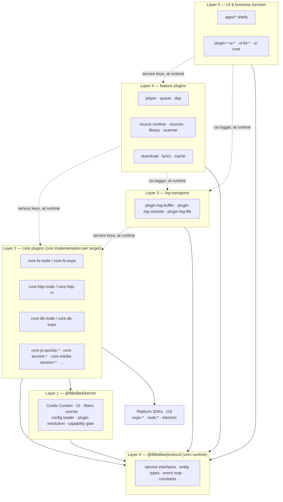
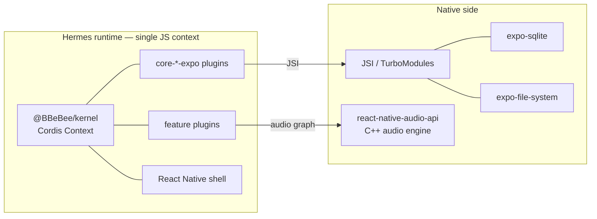
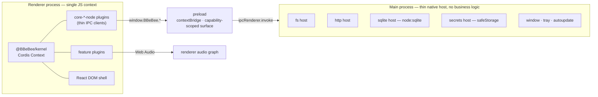
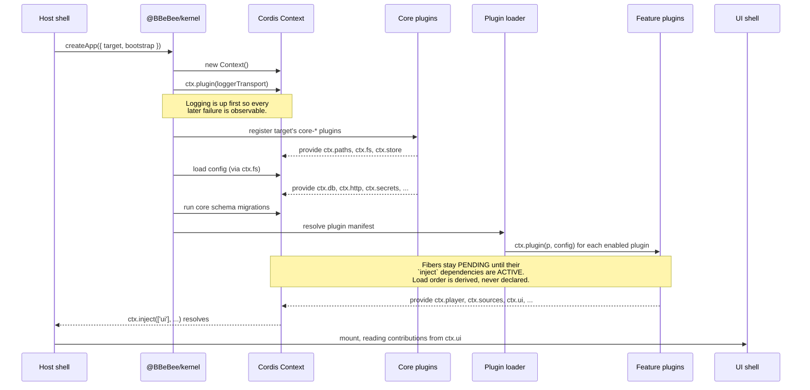

# 02 — Architecture

> **What this answers.** How the system is layered, what actually runs in which process on each
> platform, the order in which things come up at boot, and where the cross-platform abstraction
> genuinely leaks.

---

## 1. The layer model

Five layers, numbered from the contracts upward. The number is vocabulary: "Layer 2" means core
plugins in every document here, and a package's layer is the thing that decides which imports it
is allowed to write.

The rule that gives the architecture its value is the **dependency direction**: every arrow
points down, no call skips a layer on the way down, and exactly one layer is allowed to touch the
machine underneath.

```
┌─────────────────────────────────────────────────────────────────┐
│ Layer 5: UI & Business Function Layer                           │
│  (Pages, Interactions, Business Orchestration)                  │
│  apps/* · plugin-*-ui-mobile · plugin-*-ui-desktop · ui-*       │
│  ✅ Depends on: Protocol, Kernel, Core Plugins, Logs, Features  │
│  ❌ Forbidden: Direct calls to system APIs / Kernel / console   │
└─────────────────────────────────────────────────────────────────┘
                              ▼
┌─────────────────────────────────────────────────────────────────┐
│ Layer 4: Feature Plugins Layer                                  │
│  (Business Feature Modules)                                     │
│  plugin-player · plugin-sources · plugin-download · …           │
│  ✅ Depends on: Protocol, Kernel, Core Plugins, Logs            │
│  ❌ Forbidden: Direct calls to system APIs / Kernel / console   │
└─────────────────────────────────────────────────────────────────┘
                              ▼
┌─────────────────────────────────────────────────────────────────┐
│ Layer 3: Logs Layer                                             │
│  (Log Transports — where a line ends up, and nothing else)      │
│  plugin-log-buffer · plugin-log-console · plugin-log-file       │
│  ✅ Depends on: Protocol, Kernel, Core Plugins                  │
│  ⚠️ The ONLY layer permitted to write to the console            │
└─────────────────────────────────────────────────────────────────┘
                              ▼
┌─────────────────────────────────────────────────────────────────┐
│ Layer 2: Core Plugins Layer                                     │
│  (Core Capability Services — one implementation per target)     │
│  core-fs-* · core-http-* · core-db-* · core-js-quickjs-* · …    │
│  ✅ Depends on: Protocol, Kernel                                │
│  ⚠️ The ONLY layer permitted to directly call system APIs /     │
│     Kernel                                                      │
└─────────────────────────────────────────────────────────────────┘
                              ▼
┌─────────────────────────────────────────────────────────────────┐
│ Layer 1: Kernel Layer                                           │
│  (Infrastructure + System Abstractions)                         │
│  @BBeBee/kernel — Cordis Context · DI · fibers · events ·       │
│  config loader · plugin resolution · capability gate            │
│  ✅ Depends on: Protocol                                        │
└─────────────────────────────────────────────────────────────────┘
                              ▼
┌─────────────────────────────────────────────────────────────────┐
│ Layer 0: Protocol Layer                                         │
│  (Interface Definitions / Data Models / Constants)              │
│  @BBeBee/protocol — zero runtime, zero dependencies             │
│  ✅ All layers may depend on this layer                         │
└─────────────────────────────────────────────────────────────────┘
```

Read the numbering as a permission system rather than a picture. A layer may name anything at or
below it in the list above, and nothing else — but *how* it names a lower layer changes at the
Layer 2 boundary, which is the subject of the next two subsections and the reason the diagram is
worth more than its shape.

### What each layer is

| Layer | Packages | Responsible for | May depend on | Never |
|---|---|---|---|---|
| **5 — UI & business function** | `apps/mobile`, `apps/desktop/renderer`, `plugin-*-ui-mobile`, `plugin-*-ui-desktop`, `ui-kit-*`, `ui-core`, `ui-parity`, `ui-tokens` | Pages, navigation, gestures and keyboard, and the orchestration that turns one user intent into a sequence of feature calls | Layers 0–4 | A platform SDK; the kernel's bootstrap surface; SQL; HTTP; `console.*`; domain state ([§6](#6-state-ownership)) |
| **4 — Feature plugins** | headless `plugin-*` (`plugin-player`, `plugin-dsp`, `plugin-sources`, `plugin-source-runtime`, `plugin-download`, `plugin-library`, `plugin-lyrics`, `plugin-cache`, `plugin-local-scanner`), plus `source-rules` as pure logic beneath them | One business capability each, headless: state, persistence, networking, events | Layers 0–3 | A platform SDK; the kernel's bootstrap surface; `console.*`; another feature plugin's internals |
| **3 — Log transports** | `packages/logs/*` — `plugin-log-buffer`, `plugin-log-console`, `plugin-log-file` | Where a log line ends up, and nothing else. Each subscribes to `ctx.logger`; the shell picks which run ([04 §16](./04-core-services.md)) | Layers 0–2 | Domain knowledge; a platform SDK. A transport that knew what a track was would be a feature |
| **2 — Core plugins** | `packages/core/*` | One platform capability per service key, with one implementation per target behind each key | Layers 0–1 — **directly** | Domain knowledge. A core plugin must not know what a track is |
| **1 — Kernel** | `@BBeBee/kernel` | The Cordis `Context`, DI, fibers and effects, the event bus, config loading, plugin resolution, the capability gate, core migrations | Layer 0 (and Cordis) | Importing any `core-*` or `plugin-*`. The kernel does not know which plugins exist |
| **0 — Protocol** | `@BBeBee/protocol` | Service interfaces, entity types, the typed event map, constants, and the conformance suites that hold implementations to them | Nothing at all | Emitting a runtime value; importing any bare specifier ([09 §3](./09-project-structure.md#3-dependency-rules)) |

Layer 0 is the load-bearing one. It is a `.d.ts`-shaped package with no code in it, which is what
lets `core-fs-expo` and `core-fs-node` be substituted for one another without a single consumer
recompiling differently, and what makes every layer above mockable in a unit test.

### "Depends on" means two different things

This is the distinction the box diagram cannot draw, and getting it wrong is the most common way
to break the architecture while appearing to follow it.

- **Layer 2 depends on Layer 1 by importing it.** `core-db-node` imports `MigrationRunner` and
  `scopeContext` from `@BBeBee/kernel` and calls them. That is intended: core plugins are the
  adaptation layer, so they are the layer that talks to both the kernel and the operating system.
- **Layers 3, 4 and 5 depend on Layer 2 without importing it.** A feature plugin writes
  `inject: ['fs', 'http']` — naming *service keys declared at Layer 0* — and the kernel binds them
  to whichever Layer 2 package the shell registered ([§3](#3-boot-sequence)). There is no
  compile-time import from a `plugin-*` to a `core-*` anywhere in the repository, and the
  `package.json` files are the proof: no feature plugin lists a core plugin as a dependency.

So the arrow from Layer 4 to Layer 2 in the diagram is a **runtime** arrow. Its compile-time
counterpart goes to Layer 0 instead, and that inversion is the whole design:



The dotted arrows are resolved by the kernel; the solid ones are `import` statements. Feature
plugins and core plugins have **nothing in common but Layer 0**: a feature plugin has no
compile-time knowledge that `core-fs-expo` exists, and a core plugin has no idea who consumes it.
That is the entire trick, and everything else in this document is a consequence of it.

### The invariant

Two rules, both mechanical, both scoped by directory in
[09 §3](./09-project-structure.md#3-dependency-rules) because code review will not catch them
reliably:

> **1. No package outside `packages/core/*` may import a platform SDK.**

Not `expo-file-system`, not `node:fs`, not `electron`, not `react-native`'s native modules.

> **2. No package above Layer 2 may drive the kernel.**

`@BBeBee/kernel` has two kinds of export and they are not equally available:

| Surface | Exports | Who may import it |
|---|---|---|
| **Plugin surface** — being *typed* by the kernel | Exactly the pinned Cordis re-exports: `Context`, `Service`, `Inject`, `Plugin`, `Fiber`, `Effect`, `EffectMeta`, `InjectSpec`, `FiberState`, `FiberStateName`, `FiberStateValue`, `fiberStateName`, `isActive`, `isSettled` | Layers 2, 3 and 4. [09 §5.1](./09-project-structure.md#51-the-cordis-rc-problem) asks plugins to take Cordis from the kernel rather than from `cordis`, so one adapter absorbs an upstream change |
| **Bootstrap surface** — *driving* the kernel | Everything else the kernel exports: `createApp`, the config loader, the plugin loader, the capability gate, the SQL guards, the migration runner | Layer 2 and the composition root only |

The rule is written as an **allow-list of the plugin surface**, not a ban-list of the bootstrap
surface. The bootstrap surface is long and grows; the plugin surface is short and is pinned to
upstream Cordis's shape. So a new kernel export is closed to Layers 3, 4 and 5 until someone says
otherwise, which is the safe direction to fail in — and `kernel/src/layers.test.ts` fails the
build if the two copies of that list drift apart
([09 §3](./09-project-structure.md#3-dependency-rules)).

A feature plugin does not construct a context, resolve a plugin, read the config store, or consult
the capability gate. It is *handed* a context and works inside it. Stating it this precisely
matters because "everything is a Cordis plugin" makes it sound as though every layer depends on
the kernel equally; the layer rule is about who may **drive** the kernel, not who may be **typed**
by it.

### Three deliberate exceptions

Each is narrow, and each is named here so it can be audited rather than discovered.

- **UI packages import a view library.** `plugin-*-ui-mobile` and `ui-kit-mobile` import
  `react-native`; their desktop counterparts import `react-dom`. ADR-2 already accepts a
  per-target view layer. They still may not touch platform *capabilities* — a mobile view may
  render a `<FlatList>`, but it may not call `FileSystem.readAsStringAsync`.
- **Host shells own platform chrome.** `apps/*` are platform-specific by definition: deep-link
  registration, safe-area insets, window controls
  ([08 §7](./08-ui-architecture.md#7-shell-responsibilities)). Everything else belongs in a plugin.
- **The composition root drives the kernel.** `apps/mobile/src/boot.ts`,
  `apps/desktop/renderer/boot.ts`, and the `plugins.ts` allowlist beside each are the only files
  that call `createApp` and name Layer 2 packages by import — [§3's bootstrap table](#bootstrap-plugin-sets)
  is literally their contents. This is wiring, not business function: a composition root contains
  no orchestration, no domain types, and no view code, and the rest of `apps/*` obeys the Layer 5
  rule like any other Layer 5 package. The exception is closed rather than open-ended: the lint
  config names those four files by path, and `kernel/src/layers.test.ts` fails if a fifth
  `createApp` call site appears — a second bootstrap is a second kernel.

### Key design principles

The six layers are a means. These are what they are for, and each names the mechanism that makes
it real rather than aspirational.

**Dependency Inversion Principle (DIP).** High-level modules do not depend on low-level modules;
both depend on abstractions. Here the abstraction is Layer 0, and the inversion is visible in the
build graph: `plugin-player` depends on `@BBeBee/protocol`, `core-db-expo` depends on
`@BBeBee/protocol`, and neither depends on the other. Swapping SQLite implementations is a change
to one line of a `boot.ts`.

**Single Responsibility Principle (SRP).** Each layer answers one kind of question — *what is the
contract* (0), *how does anything load and unload* (1), *how does this platform do it* (2), *what
does the product do* (3), *what does the user see and touch* (4) — and each package within a layer
owns exactly one service key or one feature. When a change needs edits in two layers at once, the
seam is usually drawn at the wrong altitude; the standing example is domain logic creeping into
Electron's `main`, which [§2](#desktop) rejects for this reason.

**Interface Segregation Principle (ISP).** Layer 0 defines many small service interfaces rather
than one platform façade, so `inject: ['fs']` pulls in filesystem access and nothing else. A
plugin's `inject` list is therefore an honest, reviewable statement of its blast radius, and it is
what the capability gate ([03 §7](./03-plugin-system.md#7-capability-model)) narrows further.

**Layer-by-layer propagation.** UI → feature plugins → core plugins → kernel → system. Nothing
skips: a screen that needs bytes calls a feature plugin, which asks `ctx.fs`, which is a core
plugin, which calls the SDK. The forbidden move is the shortcut — a view reaching for
`expo-file-system` because the round trip felt long — and it is forbidden precisely because it is
the tempting one. Rule 1 of the invariant exists to make that shortcut fail in CI rather than in
review.

**Testability.** Every layer can be mocked at the Layer 0 seam, and the seam is the *same* seam
production uses, so a test double is a legitimate implementation rather than a stand-in:

| Testing | Substitute at Layer 0 | Where |
|---|---|---|
| A feature plugin | An in-memory `FsService` / `HttpService` / `DbService` | `packages/tooling/tooling-fixtures` ([09 §6](./09-project-structure.md#6-testing-strategy)) |
| A core plugin | Nothing — it is held to the shared contract instead | The conformance suites in `protocol/src/conformance` ([04 §18](./04-core-services.md)) |
| A UI package | The hooks read a fake service off a context built in the test | [08 §4](./08-ui-architecture.md#4-binding-services-to-react) |
| The rule language | Nothing to mock: `source-rules` is pure, with no Cordis and no I/O | [06 §3](./06-music-sources.md#3-the-rule-language) |

The circularity is the point: the conformance suites live in Layer 0, so the contract that makes
the layers substitutable is also the thing that tests them.

---

## 2. Runtime model per platform

Both platforms run **one JavaScript runtime hosting one Cordis context**. This symmetry is the
direct consequence of ADR-3 and is what allows the same plugin graph to run on both.

### Mobile



Everything is in-process. Core plugins call Expo modules across JSI. There is no serialization
boundary and no RPC.

### Desktop



The critical property: **`main` contains no domain logic.** It does not know what a track is. Its
handlers are mechanical — "read these bytes", "run this SQL", "make this HTTP request" — and each
is a direct counterpart of an Expo module on the mobile side. If a feature ever needs logic in
`main`, that is a signal the service contract is drawn at the wrong altitude.

Two things route through `main` for reasons worth stating:

- **HTTP.** Not because the renderer cannot fetch, but because a renderer `fetch` is subject to
  CORS and cannot set `Origin`, `Referer`, `Cookie`, or a custom `User-Agent`. Music backends
  routinely require all four. Going through `main` also gives a real cookie jar and proxy support.
- **Nothing else.** Plugins are statically bundled on both targets
  ([ADR-1](./01-overview.md#adr-1--plugins-are-statically-bundled-on-every-target)), so `main`
  registers no custom protocol and the renderer never loads code it did not ship with. The design
  for doing so is kept on the shelf in
  [03 §6.2](./03-plugin-system.md#62-desktop-additions--plugin-loader-dynamic); it is not wired
  up. User-supplied behaviour arrives as **source strings**, which are data, and runs inside
  `ctx.js` rather than in the renderer's realm
  ([06 §8](./06-music-sources.md#8-trust-what-an-imported-source-can-and-cannot-do)).

### Process/security posture on desktop

`contextIsolation: true`, `nodeIntegration: false`, `sandbox: true` for the renderer. The preload
exposes a single frozen `window.BBeBee` object whose methods are capability-tagged; the kernel
wraps them per plugin ([03 §7](./03-plugin-system.md#7-capability-model)). A strict CSP is served
for the app origin — there is no scheme for loading foreign code, because nothing loads foreign
code.

The one token beyond that floor is `'wasm-unsafe-eval'`, and it is there for `ctx.js`. Chromium
gates `WebAssembly.instantiate` on `script-src`, so QuickJS cannot compile without it and the
renderer aborts on the core service list. It grants WebAssembly compilation and **nothing else**:
`eval` and `new Function` stay refused, which is exactly why the narrow token is used and
`'unsafe-eval'` — which would also have made the WASM work — is not. The trade is a compiler for a
realm with no host object graph in it ([04 §19](./04-core-services.md)), and it is the direction
the whole source model depends on.

---

## 3. Boot sequence

Identical on both platforms except for which core plugins are registered and which loader runs.
Boot is [§1](#1-the-layer-model)'s stack turned on its side: the layers come up in order — kernel,
then Layer 2, then Layer 3, then Layer 4, then the Layer 5 shell — because each is waiting on a service key the
one below it provides.



Points worth internalising:

- **Nobody sequences the plugin list.** `ctx.plugin()` is called for every enabled plugin in
  whatever order the manifest yields. Cordis holds each fiber in `PENDING` until the services
  named in its `inject` exist, then transitions it to `ACTIVE`. A dependency cycle simply means
  neither plugin ever activates — which is a diagnosable state, not a crash.
- **The shell waits on a service, not on a timer.** `apps/*` mounts its React tree inside
  `ctx.inject(['ui'], …)`, so the UI cannot render before the registry it reads from exists.
- **The boot is re-entrant.** Because unloading a plugin disposes its fiber and everything it
  registered, a config change can tear down and rebuild an arbitrary subtree at runtime. This is
  the same mechanism dev-time hot reload uses.

### Bootstrap plugin sets

The shells differ only in this table. It is the entire platform-specific surface of the app.

| Service key | `apps/mobile` registers | `apps/desktop` registers |
|---|---|---|
| `ctx.paths` | `core-paths-expo` | `core-paths-electron` |
| `ctx.fs` | `core-fs-expo` | `core-fs-node` |
| `ctx.http` | `core-http-rn` | `core-http-node` |
| `ctx.ws` | `core-ws-rn` | `core-ws-node` |
| `ctx.db` | `core-db-expo` | `core-db-node` |
| `ctx.store` | `core-store-expo` | `core-store-electron` |
| `ctx.secrets` | `core-secrets-expo` | `core-secrets-electron` |
| `ctx.mediaSession` | `core-media-session-rn` | `core-media-session-electron` |
| `ctx.notify` | `core-notify-expo` | `core-notify-electron` |
| `ctx.background` | `core-background-expo` | `core-background-electron` |
| `ctx.device` | `core-device-expo` | `core-device-electron` |
| `ctx.crypto` | `core-crypto-expo` | `core-crypto-node` |
| `ctx.js` | `core-js-quickjs-rn` | `core-js-quickjs-node` |
| `ctx.codec` | `core-codec-rn` | `core-codec-node` |
| `ctx.shell` | `core-shell-expo` | `core-shell-electron` |
| plugin loading | `plugin-loader-static` | `plugin-loader-static` |

The loader row is the same on both targets, which is
[ADR-1](./01-overview.md#adr-1--plugins-are-statically-bundled-on-every-target) as amended: the
plugin graph is fixed at build time everywhere, and the thing users add at runtime is a **source
string**, loaded by `plugin-source-runtime` from the `sources` table rather than by a loader
([06 §4.1](./06-music-sources.md#41-a-sources-lifetime)).

---

## 4. What "background" means

This is the sharpest place the abstraction leaks, so it is stated plainly rather than papered
over. Feature plugins must not assume they keep running.

| Situation | Mobile | Desktop |
|---|---|---|
| App backgrounded, audio playing | ✅ Runs. Requires an audio session configured for background playback and the correct `UIBackgroundModes` / foreground service. | ✅ Runs (window merely hidden). |
| App backgrounded, no audio | ⚠️ Suspended within seconds. Only `expo-background-task` deferrable work runs, on the OS's schedule — minutes to hours, never guaranteed. | ✅ Runs. |
| Window/app closed by user | ❌ Process gone. | ⚠️ **Renderer is destroyed, so the kernel dies** (ADR-3). Mitigated by close-to-tray, which hides the window instead of closing it. |
| Long download over poor network | ⚠️ Continues only while foregrounded or while audio holds the process alive. Must checkpoint aggressively. | ✅ Continues while the app runs. |

Three obligations fall out of this table and are non-negotiable for any plugin doing long work:

1. **Checkpoint, don't accumulate.** `download_tasks` persists `bytesDone` and a resume token
   after every chunk, so a kill mid-transfer costs one chunk. See
   [07 §4.7](./07-data-model.md#48-downloads).
2. **Resume on boot, don't assume continuity.** A plugin that had work in flight finds it in
   `state = 'running'` at startup and must treat that as "interrupted", not "in progress".
3. **Ask, never assume.** `ctx.background.canRunInBackground()` and `ctx.device.formFactor` exist
   so a plugin can degrade rather than silently fail. A plugin that schedules an hourly refresh
   should register it through `ctx.background`, which on mobile maps to the OS scheduler and on
   desktop to a plain interval.

---

## 5. Composition: how features reach each other

[§1](#1-the-layer-model) governs *vertical* dependency — who may reach down to whom. This section
is about the *horizontal* problem it leaves open, entirely within Layer 4.

Services answer "who provides this capability". They do not answer "how does a feature modify
another feature's behaviour without either knowing about the other". That is what Cordis's
**waterfall** dispatch is for, and it is used as a first-class architectural mechanism here — and
it is what keeps two Layer 4 packages from having to import each other, which the layer model
would allow and which experience says rots.

A waterfall hook is middleware: each listener receives the arguments plus a `next` continuation,
and may transform inputs, short-circuit, or post-process the result.

> ⚠️ **`next` takes no arguments.** Cordis closes it over the *original* argument list, so
> `next(somethingElse)` is silently identical to `next()`. A listener therefore has two moves:
> **mutate the argument in place** — rewrite `req.headers`, splice the array — and call `next()`,
> or **short-circuit** by returning a value and never calling `next` at all. The signatures in
> [07 §5](./07-data-model.md#5-the-event-map) say so, and the kernel's `cordis-assumptions.test.ts`
> pins it, because a header that silently vanishes is a miserable thing to debug.

The three load-bearing waterfalls:

| Hook | Purpose | Who hooks it |
|---|---|---|
| `player/before-resolve` | Given a track URN, decide what actually gets played | `plugin-download` substitutes a file the user downloaded; `plugin-cache` substitutes a cached stream; `plugin-failover` retries a linked URN on another source when one is unavailable or its rules have rotted |
| `http/request` | Wrap every outbound request | The source runtime injects each source's headers and cookies and refreshes an expired session; a response cache, rate limiter and retry policy hook here in a later milestone |
| `dsp/build-chain` | Assemble the audio node chain | Each effect plugin inserts its own segment at its configured position |

The payoff is concrete: **the player has no concept of downloads or caches.** It asks for a
playable handle, and whichever plugin is loaded quietly answers with a file path instead of a URL.
Uninstall them and playback keeps working, streaming instead. Nothing in `plugin-player` changes,
or even knows.

Full dispatch semantics for every event, including which of `emit` / `parallel` / `serial` /
`bail` / `waterfall` each uses, are tabulated in
[07 §5](./07-data-model.md#5-the-event-map).

---

## 6. State ownership

To keep a plugin system from degenerating into shared mutable soup, each piece of state has
exactly one owner.

| State | Owner | Others get it via |
|---|---|---|
| Catalog rows (tracks, albums, …) | `ctx.db`, written by `ctx.sources` on behalf of the owning source | Query through `ctx.sources`, never raw SQL across plugin boundaries |
| Transport state (playing, position) | `ctx.player` | `player/*` events; `ctx.player.state` snapshot |
| Queue | `ctx.player` (persisted to `queue_items`) | `queue/changed` events |
| Audio graph nodes | `ctx.audio` | Never touched directly; effects contribute segments via `dsp/build-chain` |
| Effect parameters | `ctx.dsp` (persisted to `effect_nodes`) | `ctx.dsp.setParam()` |
| Auth tokens, source variables | `ctx.secrets`, keyed per source id | Never leaves that source's isolated scope; never exported with the source string |
| UI contributions | `ctx.ui` | Read-only from shells |
| Plugin config | Kernel, persisted in `plugin_records` | Delivered as the plugin's `config` argument; changes reload the fiber |
| Source documents | `ctx.sources`, persisted in `sources` | Imported, edited and exported as strings; an edit reloads exactly that source's fiber |

React holds **no domain state** — only view state (which tab is open, is this menu expanded).
Enforcement rationale and hook design in [08 §4](./08-ui-architecture.md#4-binding-services-to-react).

---

## 7. Where to go next

[03 — Plugin System](./03-plugin-system.md) specifies what a plugin actually looks like, how
lifecycle and dependencies work, and how the two loaders differ.
