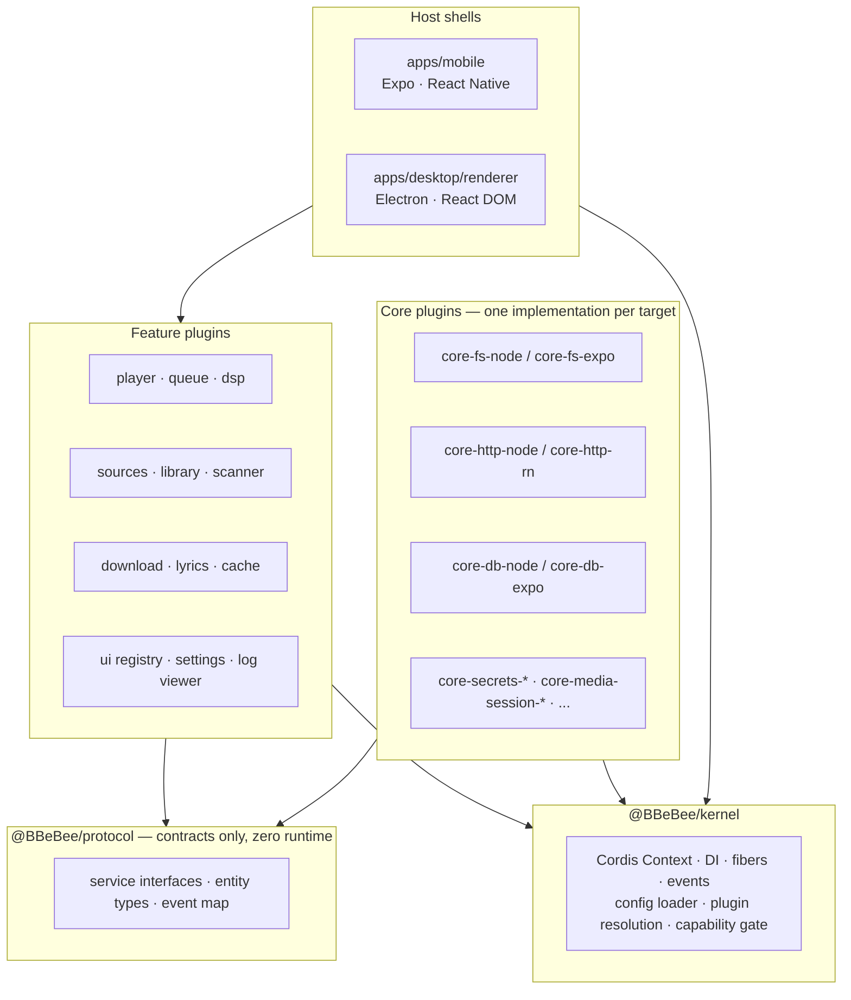
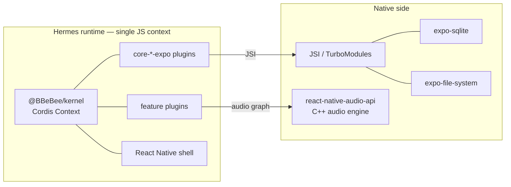
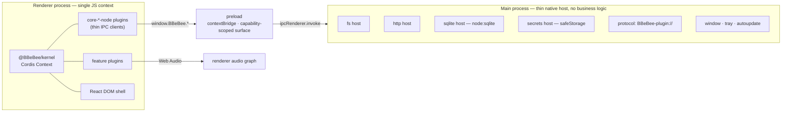
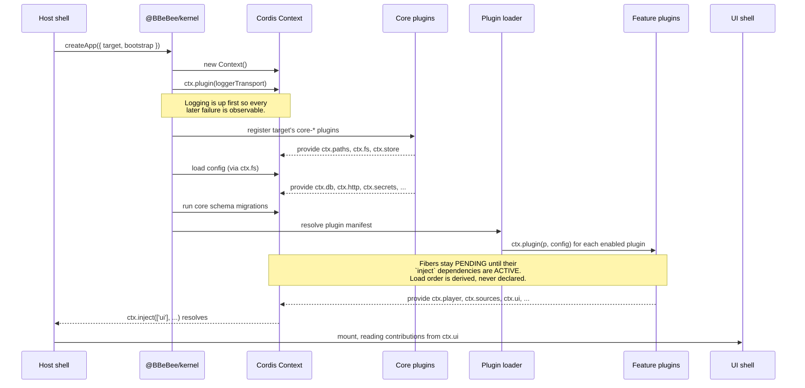

# 02 — Architecture

> **What this answers.** How the system is layered, what actually runs in which process on each
> platform, the order in which things come up at boot, and where the cross-platform abstraction
> genuinely leaks.

---

## 1. The layer model

Five layers. The rule that gives the architecture its value is the **dependency direction**:
every arrow points down, and nothing above the contract layer may skip past it.

Read the two arrows into `@BBeBee/protocol` carefully. Feature plugins and core plugins both
depend on the contract layer, and **on nothing else in common**. A feature plugin has no
compile-time knowledge that `core-fs-expo` exists; a core plugin has no idea who consumes it.
That is the entire trick.

### The invariant

> **No package outside `packages/core-*` may import a platform SDK.**

Not `expo-file-system`, not `node:fs`, not `electron`, not `react-native`'s native modules. This
is enforced mechanically by an ESLint `no-restricted-imports` rule scoped by directory
([09 §3](./09-project-structure.md#3-dependency-rules)), because it is the invariant the whole
design rests on and code review will not catch it reliably.

Two deliberate exceptions, both narrow:

- **UI packages** import `react-native` or `react-dom` respectively, since ADR-2 already accepts a
  per-target view layer. They still may not touch platform *capabilities* — a mobile view may
  render a `<FlatList>`, but it may not call `FileSystem.readAsStringAsync`.
- **Host shells** (`apps/*`) are platform-specific by definition. They choose which core plugins
  to register (§3) and own genuinely platform-bound chrome — deep-link registration, safe-area
  insets, window controls ([08 §7](./08-ui-architecture.md#7-shell-responsibilities)). Everything
  else belongs in a plugin.

The invariant therefore constrains `packages/plugin-*`, `packages/ui-*`, and `packages/protocol` —
which is exactly the scope of the lint rule in
[09 §3](./09-project-structure.md#3-dependency-rules).

---

## 2. Runtime model per platform

Both platforms run **one JavaScript runtime hosting one Cordis context**. This symmetry is the
direct consequence of ADR-3 and is what allows the same plugin graph to run on both.

### Mobile

Everything is in-process. Core plugins call Expo modules across JSI. There is no serialization
boundary and no RPC.

### Desktop

The critical property: **`main` contains no domain logic.** It does not know what a track is. Its
handlers are mechanical — "read these bytes", "run this SQL", "make this HTTP request" — and each
is a direct counterpart of an Expo module on the mobile side. If a feature ever needs logic in
`main`, that is a signal the service contract is drawn at the wrong altitude.

Two things route through `main` for reasons worth stating:

- **HTTP.** Not because the renderer cannot fetch, but because a renderer `fetch` is subject to
  CORS and cannot set `Origin`, `Referer`, `Cookie`, or a custom `User-Agent`. Music backends
  routinely require all four. Going through `main` also gives a real cookie jar and proxy support.
- **Plugin loading.** See [03 §6](./03-plugin-system.md#6-loading-two-modes) — `main` registers a
  custom protocol so the renderer can `import()` third-party code without disabling CSP or
  enabling `nodeIntegration`.

### Process/security posture on desktop

`contextIsolation: true`, `nodeIntegration: false`, `sandbox: true` for the renderer. The preload
exposes a single frozen `window.BBeBee` object whose methods are capability-tagged; the kernel
wraps them per plugin ([03 §7](./03-plugin-system.md#7-capability-model)). A strict CSP is served
for the app origin and extended only to the `BBeBee-plugin:` scheme.

---

## 3. Boot sequence

Identical on both platforms except for which core plugins are registered and which loader runs.

Points worth internalising:

- **Nobody sequences the plugin list.** `ctx.plugin()` is called for every enabled plugin in
  whatever order the manifest yields. Cordis holds each fiber in `PENDING` until the services
  named in its `inject` exist, then transitions it to `ACTIVE`. A dependency cycle simply means
  neither plugin ever activates — which is a diagnosable state, not a crash.
- **The shell waits on a service, not on a timer.** `apps/*` mounts its React tree inside
  `ctx.inject(['ui'], …)`, so the UI cannot render before the registry it reads from exists.
- **The boot is re-entrant.** Because unloading a plugin disposes its fiber and everything it
  registered, a config change can tear down and rebuild an arbitrary subtree at runtime. This is
  the same mechanism dev-time hot reload uses.

### Bootstrap plugin sets

The shells differ only in this table. It is the entire platform-specific surface of the app.

| Service key | `apps/mobile` registers | `apps/desktop` registers |
|---|---|---|
| `ctx.paths` | `core-paths-expo` | `core-paths-electron` |
| `ctx.fs` | `core-fs-expo` | `core-fs-node` |
| `ctx.http` | `core-http-rn` | `core-http-node` |
| `ctx.ws` | `core-ws-rn` | `core-ws-node` |
| `ctx.db` | `core-db-expo` | `core-db-node` |
| `ctx.store` | `core-store-expo` | `core-store-electron` |
| `ctx.secrets` | `core-secrets-expo` | `core-secrets-electron` |
| `ctx.mediaSession` | `core-media-session-rn` | `core-media-session-electron` |
| `ctx.notify` | `core-notify-expo` | `core-notify-electron` |
| `ctx.background` | `core-background-expo` | `core-background-electron` |
| `ctx.device` | `core-device-expo` | `core-device-electron` |
| `ctx.crypto` | `core-crypto-expo` | `core-crypto-node` |
| `ctx.codec` | `core-codec-rn` | `core-codec-node` |
| `ctx.shell` | `core-shell-expo` | `core-shell-electron` |
| plugin loading | `plugin-loader-static` | `plugin-loader-static` + `plugin-loader-dynamic` |

Note that desktop registers **both** loaders: workspace plugins are still statically bundled, and
the dynamic loader adds user-installed ones on top.

---

## 4. What "background" means

This is the sharpest place the abstraction leaks, so it is stated plainly rather than papered
over. Feature plugins must not assume they keep running.

| Situation | Mobile | Desktop |
|---|---|---|
| App backgrounded, audio playing | ✅ Runs. Requires an audio session configured for background playback and the correct `UIBackgroundModes` / foreground service. | ✅ Runs (window merely hidden). |
| App backgrounded, no audio | ⚠️ Suspended within seconds. Only `expo-background-task` deferrable work runs, on the OS's schedule — minutes to hours, never guaranteed. | ✅ Runs. |
| Window/app closed by user | ❌ Process gone. | ⚠️ **Renderer is destroyed, so the kernel dies** (ADR-3). Mitigated by close-to-tray, which hides the window instead of closing it. |
| Long download over poor network | ⚠️ Continues only while foregrounded or while audio holds the process alive. Must checkpoint aggressively. | ✅ Continues while the app runs. |

Three obligations fall out of this table and are non-negotiable for any plugin doing long work:

1. **Checkpoint, don't accumulate.** `download_tasks` persists `bytesDone` and a resume token
   after every chunk, so a kill mid-transfer costs one chunk. See
   [07 §4.7](./07-data-model.md#48-downloads).
2. **Resume on boot, don't assume continuity.** A plugin that had work in flight finds it in
   `state = 'running'` at startup and must treat that as "interrupted", not "in progress".
3. **Ask, never assume.** `ctx.background.canRunInBackground()` and `ctx.device.formFactor` exist
   so a plugin can degrade rather than silently fail. A plugin that schedules an hourly refresh
   should register it through `ctx.background`, which on mobile maps to the OS scheduler and on
   desktop to a plain interval.

---

## 5. Composition: how features reach each other

Services answer "who provides this capability". They do not answer "how does a feature modify
another feature's behaviour without either knowing about the other". That is what Cordis's
**waterfall** dispatch is for, and it is used as a first-class architectural mechanism here.

A waterfall hook is middleware: each listener receives the arguments plus a `next` continuation,
and may transform inputs, short-circuit, or post-process the result.

The three load-bearing waterfalls:

| Hook | Purpose | Who hooks it |
|---|---|---|
| `player/before-resolve` | Given a track URN, decide what actually gets played | `plugin-download` substitutes a local file when a binding exists; `plugin-source-failover` retries a linked URN from another provider when one is unavailable |
| `http/request` | Wrap every outbound request | Source plugins inject auth headers and refresh expired tokens; `plugin-cache` serves and stores responses; a rate limiter delays; a retry policy backs off |
| `dsp/build-chain` | Assemble the audio node chain | Each effect plugin inserts its own segment at its configured position |

The payoff is concrete: **the player has no concept of downloads.** It asks for a playable
handle, and the download plugin — if loaded — quietly answers with a file path instead of a URL.
Uninstall the download plugin and playback keeps working, streaming instead. Nothing in
`plugin-player` changes, or even knows.

Full dispatch semantics for every event, including which of `emit` / `parallel` / `serial` /
`bail` / `waterfall` each uses, are tabulated in
[07 §5](./07-data-model.md#5-the-event-map).

---

## 6. State ownership

To keep a plugin system from degenerating into shared mutable soup, each piece of state has
exactly one owner.

| State | Owner | Others get it via |
|---|---|---|
| Catalog rows (tracks, albums, …) | `ctx.db`, written by the owning source plugin | Query through the owning service, never raw SQL across plugin boundaries |
| Transport state (playing, position) | `ctx.player` | `player/*` events; `ctx.player.state` snapshot |
| Queue | `ctx.player` (persisted to `queue_items`) | `queue/changed` events |
| Audio graph nodes | `ctx.audio` | Never touched directly; effects contribute segments via `dsp/build-chain` |
| Effect parameters | `ctx.dsp` (persisted to `effect_nodes`) | `ctx.dsp.setParam()` |
| Auth tokens | `ctx.secrets`, keyed per provider instance | Never leaves the owning source plugin |
| UI contributions | `ctx.ui` | Read-only from shells |
| Plugin config | Kernel, persisted in `plugin_records` | Delivered as the plugin's `config` argument; changes reload the fiber |

React holds **no domain state** — only view state (which tab is open, is this menu expanded).
Enforcement rationale and hook design in [08 §4](./08-ui-architecture.md#4-binding-services-to-react).

---

## 7. Where to go next

[03 — Plugin System](./03-plugin-system.md) specifies what a plugin actually looks like, how
lifecycle and dependencies work, and how the two loaders differ.
