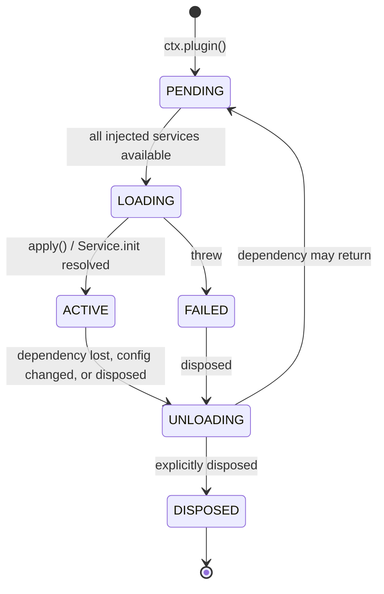

# 03 — Plugin System

> **What this answers.** What a BBeBee plugin physically is, how it declares and receives its
> dependencies, how its lifetime is managed, how it is discovered and loaded on each platform,
> and what containment it is (and is not) subject to.

All API shapes below were verified against `cordis@4.0.0-rc.9` source and its test suite.
Cordis is a release candidate and says so; see
[09 §5](./09-project-structure.md#51-the-cordis-rc-problem) for the pinning strategy.

---

## 1. What a plugin is

A plugin is one of three things. Cordis accepts all three; BBeBee uses the first two.

**A function.** For plugins that only register behaviour and provide no service.

```ts
import type { Context } from '@BBeBee/protocol'

export const name = 'plugin-media-keys'
export const inject = ['player', 'device']

export function apply(ctx: Context) {
  // Returning a function makes it the disposer for this plugin.
  return ctx.device.onMediaKey((key) => {
    if (key === 'play-pause') ctx.player.togglePlay()
    if (key === 'next') ctx.player.next()
  })
}
```

**A `Service` subclass.** For plugins that claim a service key. The class *is* the plugin — pass
the constructor itself to `ctx.plugin()`.

```ts
import { Service } from 'cordis'
import type { Context, PlayerService } from '@BBeBee/protocol'

export class Player extends Service implements PlayerService {
  static inject = ['audio', 'db', 'mediaSession']

  constructor(ctx: Context) {
    super(ctx, 'player')   // claims ctx.player
  }

  // Runs after construction. Dependents stay blocked until it resolves,
  // so ctx.player is never observed half-initialised.
  async [Service.init]() {
    await this.restoreQueue()
    const off = this.ctx.mediaSession.onCommand((c) => this.handle(c))
    return () => {           // returned disposer is collected by the fiber
      off()
      this.audioNode?.disconnect()
    }
  }

  togglePlay(): void { /* … */ }
}
```

**An object with `apply`.** Equivalent to the function form; used when metadata reads better
alongside the implementation.

### The metadata fields

Every plugin may carry these (from Cordis's `Plugin.Base`):

| Field | Meaning |
|---|---|
| `name` | Diagnostic label. Appears in logs, error stacks, and the plugin inspector. Always set it. |
| `inject` | Services this plugin needs. See §3. |
| `provide` | Service keys this plugin will claim. Lets Cordis know a key is *coming* so dependents wait rather than fail. |
| `Config` | A [Standard Schema](https://standardschema.dev) validator for the plugin's configuration. Zod 4, Valibot, and ArkType all satisfy it. Cordis validates before `apply` runs and throws a `ValidationError` listing every issue. |
| `intercept` | Per-plugin service configuration overrides. See §5. |

### BBeBee's additions

Two conventions on top of Cordis, both enforced by the kernel:

- Every plugin package ships a **`BBeBee.plugin.json` manifest** (§6.3) describing entrypoints,
  capabilities, and UI contributions. Cordis knows nothing about it; the kernel reads it.
- A plugin's **runtime module has a default export** that is the Cordis plugin, so both loaders
  can treat static and dynamic imports identically.

---

## 2. Lifecycle

Cordis models plugin lifetime as a **fiber** — a state machine plus a disposal ledger.



The transition that matters most, and that most plugin systems lack: **`ACTIVE → UNLOADING →
PENDING`**. If a service a plugin injected disappears, the plugin is torn down and parked. If
that service comes back, the plugin is rebuilt from scratch. This is why sign-out of a music
source cleanly removes everything that source contributed, with no bespoke cleanup code anywhere.

### The rule: every side effect goes through the fiber

> Anything a plugin starts, it must register so the fiber can stop it.

```ts
export function apply(ctx: Context) {
  // ✅ Return a disposer.
  const conn = ctx.ws.connect(url)
  return () => conn.close()
}

export function apply(ctx: Context) {
  // ✅ Several disposables — use the generator form; they unwind in reverse.
  return ctx.effect(function* () {
    yield ctx.on('player/track-changed', onTrack)   // ctx.on returns its own disposer
    const timer = setInterval(tick, 30_000)
    yield () => clearInterval(timer)
    yield ctx.ui.registerSlot('now-playing.actions', descriptor)
  }, 'scrobbler')
}
```

Anti-patterns, all of which produce a plugin that cannot be disabled:

```ts
// ❌ Listener outlives the plugin.
window.addEventListener('resize', onResize)

// ❌ Timer keeps firing into a dead context.
setInterval(poll, 1000)

// ❌ Module-level singleton shared across fibers; survives reload with stale state.
let cache = new Map()

// ❌ Escapes the fiber entirely — nothing can cancel it, and it may resolve
//    after unload and touch disposed state.
;(async () => { await longRunningScan() })()
```

For the last case, take a cancellation signal from the fiber and honour it:

```ts
export function apply(ctx: Context) {
  const ac = new AbortController()
  void ctx.library.scan({ signal: ac.signal }).catch((e) => ctx.logger.error(e))
  return () => ac.abort()
}
```

`ctx.effect()` calls nest, and `fiber.getEffects()` returns the labelled tree — which is what the
built-in plugin inspector renders, and the fastest way to find a leak.

### Errors

A plugin that throws during load enters `FAILED`; it does not take the app down, and its
dependents simply never activate. `Config` validation failures throw `ValidationError` with every
issue listed, before `apply` runs. The kernel records the error on `plugin_records.lastError`
and surfaces it in the plugin inspector, so a broken plugin is visible rather than silent.

---

## 3. Dependencies

`inject` is a declaration of need, not an import. Load order is *derived* from it; nothing in
BBeBee sequences plugin startup by hand.

```ts
// Array form — the usual case.
export const inject = ['db', 'http', 'fs']

// Object form — the value is that service's INTERCEPT CONFIG, not a marker.
export const inject = { db: null, http: { timeoutMs: 5_000 } }
```

> ⚠️ **Everything named in `inject` is required, in both forms.** Cordis's `Fiber._refresh()`
> iterates every key and parks the fiber if any implementation is missing; a `null` value in the
> object form means "no interception config", *not* "optional". This is asserted in
> `packages/kernel/src/cordis-assumptions.test.ts` because it is easy to assume otherwise.

The fiber stays `PENDING` until every injected service is `ACTIVE`.

### Optional dependencies

There is no optional variant of `inject`. Express one as a **nested `ctx.inject()`**: the outer
plugin activates immediately, and only the inner block waits.

```ts
export const inject = ['db']            // hard requirement

export function apply(ctx: Context) {
  ctx.inject(['scrobbler'], (scoped) => {
    // Runs if and when ctx.scrobbler appears; torn down if it goes away.
    return scoped.on('player/track-completed', (p) => scoped.scrobbler.submit(p))
  })
}
```

The decorator form does exactly this for service classes, and reads better:

```ts
import { Inject, Service } from 'cordis'

export class Library extends Service {
  @Inject('scrobbler')
  setupScrobbling() {
    // Runs when ctx.scrobbler becomes available, and is torn down if it goes away.
    return this.ctx.on('player/track-completed', (p) => this.ctx.scrobbler.submit(p))
  }
}
```

> ⚠️ The decorator is a **2023-11 standard decorator**, not the legacy TypeScript form. Both the
> Babel config (mobile) and `tsconfig` must be set accordingly —
> [04 §17](./04-core-services.md#17-runtime-compatibility-checklist).

### Choosing what to inject

Inject the *narrowest* set that is genuinely required. A plugin that injects `db` merely to read
one setting should inject `store` instead, so it stays loadable on a device where the database
failed to open. Over-injecting turns a soft degradation into a hard one.

---

## 4. Services

A service is a capability behind a stable key. Its **interface** is declared once in
`@BBeBee/protocol` via module augmentation, and any number of plugins may implement it.

```ts
// packages/protocol/src/services/fs.ts
export interface FsService { /* … see 04 … */ }

declare module 'cordis' {
  interface Context {
    fs: FsService
  }
}
```

Consumers write `ctx.fs.readFile(uri)` with full type safety and no knowledge of which
implementation is mounted. Swapping `core-fs-expo` for `core-fs-node` is a bootstrap-list change
([02 §3](./02-architecture.md#bootstrap-plugin-sets)) and nothing else.

Cordis hands out services through a tracing proxy, which is how it knows that a value your plugin
holds came from a service and must be invalidated when that service is replaced. Two consequences:

- **Do not cache a service reference across an await boundary** in a long-lived variable.
  Read `this.ctx.fs` each time; it is a property access, not a lookup.
- Identity comparisons on service objects are unreliable. Compare by `name`.

### The one exception: capturing for teardown

A plugin's disposer runs while its own fiber is already `UNLOADING`, and reaching through the
context there throws `cannot get required service in inactive context`. So a plugin that must do
final work on shutdown — flushing a log buffer, checkpointing a download — **must capture what it
needs at load time**:

```ts
export function apply(ctx: Context) {
  const fs = ctx.fs                     // captured deliberately, see below
  return async () => {
    try { await fs.writeFile(uri, tail) } catch { /* teardown is best-effort */ }
  }
}
```

This is permitted only under all three conditions, and a comment must say so at the capture site:

1. The captured service is a **core service**, whose fiber outlives every feature plugin because
   teardown runs in reverse order ([02 §3](./02-architecture.md#3-boot-sequence)).
2. The reference is used **only in the disposer**, never on the hot path — where interception or
   isolation could legitimately have swapped the service since load.
3. Failure is swallowed. A disposer that throws aborts the rest of teardown
   ([09 §6](./09-project-structure.md#6-testing-strategy)), and losing the last log line is a far
   better outcome than leaking every listener registered after it.

Anywhere else, read through `ctx` — otherwise a plugin running in an isolated scope silently keeps
talking to the unisolated service.

---

## 5. Isolation and interception

Two mechanisms let one service key mean different things in different parts of the plugin tree.
BBeBee leans on both.

### `ctx.isolate(key)` — a private instance of a service

```ts
// Each provider instance gets its own HTTP stack: its own cookie jar,
// its own rate limiter, its own auth. They cannot see each other's.
const scoped = ctx.isolate('http')
scoped.plugin(HttpWithCookieJar, { jar: instanceId, rateLimit: caps.rateLimit })
scoped.plugin(SubsonicProvider, providerConfig)
```

Inside `scoped`, `ctx.http` is the provider-specific stack. Everywhere else it is the shared one.
Every other service — `fs`, `db`, `logger` — is still shared, because only the named key is
isolated. This is exactly the semantics wanted: one bad provider's rate limiting cannot stall
another's requests, and cookies never cross a provider boundary.

### `ctx.intercept(key, config)` — same instance, different configuration

```ts
// Same fs service, but this subtree is confined to the plugin's own data directory.
const confined = ctx.intercept('fs', { root: `plugins/${pluginId}`, mode: 'rw' })
```

Interception is how the capability gate (§7) is implemented, and how per-plugin `store` and `fs`
namespaces are applied without every plugin having to remember to prefix its keys.

---

## 6. Loading: two modes

Per [ADR-1](./01-overview.md#adr-1--plugins-are-statically-bundled-on-mobile-runtime-loadable-on-desktop),
one manifest format, two loaders. Both produce the same thing: a list of
`{ plugin, config }` pairs handed to `ctx.plugin()`.

### 6.1 Mobile and workspace plugins — `plugin-loader-static`

Metro cannot resolve a module path computed at runtime, so plugin imports must be statically
analysable. A codegen step (`pnpm gen:plugins`, run pre-build and in dev watch) scans the
workspace for packages containing a `BBeBee.plugin.json` and emits:

```ts
// apps/mobile/generated/plugins.ts — GENERATED, do not edit
import player from '@BBeBee/plugin-player'
import sourceLocal from '@BBeBee/plugin-source-local'
// …
export const bundled = {
  '@BBeBee/plugin-player': player,
  '@BBeBee/plugin-source-local': sourceLocal,
} as const
```

Configuration decides which of these are actually instantiated and with what settings. The
generated file is committed so a clean checkout builds without running codegen first.

### 6.2 Desktop additions — `plugin-loader-dynamic`

The renderer is sandboxed with `contextIsolation` on and a strict CSP, so it cannot `import()` a
`file://` path, and we are not willing to relax either. Instead, `main` registers a privileged
custom scheme:

```ts
// apps/desktop/main — registered before app ready
protocol.registerSchemesAsPrivileged([{
  scheme: 'BBeBee-plugin',
  privileges: { standard: true, secure: true, supportFetchAPI: true, corsEnabled: false },
}])
```

and serves it from the user plugins directory with path traversal rejected and a
`text/javascript` content type. The renderer's CSP then reads
`script-src 'self' BBeBee-plugin:`, and the loader is an ordinary dynamic import:

```ts
const mod = await import(/* @vite-ignore */ `BBeBee-plugin://${id}@${version}/index.js`)
await ctx.plugin(mod.default, config)
```

This keeps CSP enforceable, keeps `nodeIntegration` off, avoids `new Function`, and — because
`import()` returns a real module — gives correct ESM semantics including top-level await.

**Install flow.** Fetch → verify integrity hash → check `engines.BBeBee` against the app version →
extract to `plugins/<id>@<version>/` → read manifest → prompt for capability grants → write
`plugin_records` and `capability_grants` → `ctx.plugin()`. Update installs alongside and swaps
atomically. Uninstall disposes the fiber first, then removes the directory — never the reverse,
or the fiber's disposer may fail mid-teardown.

**Quarantine.** A plugin that throws during load twice consecutively is marked
`enabled = false` with `lastError` set and is skipped on subsequent boots until the user
re-enables it. Without this, a single bad third-party plugin becomes an unrecoverable boot loop —
the most common failure mode of runtime plugin systems.

> ⚠️ Module caching means an updated plugin at the same URL will not be re-fetched.
> Versioned URLs (`<id>@<version>`) sidestep this; dev mode appends a cache-busting query.

### 6.3 The manifest

```jsonc
{
  "id": "@BBeBee/plugin-source-subsonic",
  "version": "1.2.0",
  "displayName": "Subsonic / Navidrome",
  "description": "Play music from any Subsonic-compatible server.",
  "engines": { "BBeBee": "^1.0.0" },
  "entry": {
    "main": "./dist/index.js",
    "ui": { "mobile": "./dist/ui.mobile.js", "desktop": "./dist/ui.desktop.js" }
  },
  "capabilities": [
    "net:host/*",           // user-supplied server address
    "db:own",               // its own namespaced tables
    "secrets:own",          // its own credentials
    "fs:read:media"         // read cached artwork
  ],
  "contributes": {
    "services": ["sources.subsonic"],
    "settings": "./dist/settings-schema.js",
    "slots": ["settings.sources", "source.browse"]
  },
  "instantiable": true       // may be configured more than once — see 06 §2
}
```

`entry.ui` is optional and per-target: a plugin may ship a desktop view and no mobile one. Shells
must render a placeholder rather than break when a contribution's view is missing for their
target — a direct cost of ADR-2, and one the UI registry makes explicit
([08 §3](./08-ui-architecture.md#3-resolving-a-descriptor-to-a-view)).

### 6.4 Configuration

One config document (YAML on desktop, JSON on mobile), read through `ctx.fs` before any feature
plugin loads:

```yaml
plugins:
  '@BBeBee/plugin-player':
    enabled: true
    config: { crossfadeMs: 0, prefetchNext: true }
  '@BBeBee/plugin-source-subsonic':
    enabled: true
    instances:
      - id: navidrome-home
        config: { baseUrl: https://music.example.org, username: revers }
```

`instances` expands to one `ctx.plugin()` call per entry, each inside its own
`ctx.isolate('http')` scope (§5). Secrets never appear here — only a reference; the value lives in
`ctx.secrets`. Editing config disposes and rebuilds only the affected fibers.

### 6.5 Hot reload

In development, `@cordisjs/plugin-hmr` watches the workspace and reloads changed plugins in place.
Because unload is total, this is genuinely equivalent to a restart for the affected subtree — the
audio graph, listeners, and timers of the old fiber are all gone. This works on desktop; on mobile
it composes with Metro Fast Refresh for the view layer while the kernel reloads underneath.

---

## 7. Capability model

Desktop can load third-party code (ADR-1), so plugins declare what they intend to touch and the
kernel mediates.

### Capability grammar

| Capability | Grants |
|---|---|
| `fs:read:<scope>` / `fs:write:<scope>` | Filesystem access within a named scope: `own`, `media`, `cache`, `downloads`, or `all` |
| `net:host/<pattern>` | Outbound HTTP **and WebSocket** to hosts matching a glob — one grant governs both `ctx.http` and `ctx.ws`. `net:host/*` is a broad grant and is labelled as such in the prompt. Includes a **persisted cookie jar scoped to this plugin instance** ([04 §2.1](./04-core-services.md#21-cookie-jars)) — the core service owns the storage, so no `db` or `secrets` grant is needed for it. Matching is on hostname only, lowercased; a port cannot be granted separately |
| `db:own` | Its own namespaced tables, outright — read, write, and schema. Indexes, triggers and views count: they are attributed by name, so a plugin's index is `{{ns}}_…` like its tables |
| `db:read:<ns>` / `db:write:<ns>` / `db:*:<ns>` | Access to another namespace, by verb: `read` is `SELECT`, `write` is `INSERT`/`UPDATE`/`DELETE`, `*` is both plus `CREATE`/`DROP`/`ALTER`. The verbs do **not** nest — a plugin that reads and writes the catalogue declares `db:read:core` *and* `db:write:core`, so an install-time prompt can name exactly what it is asking for. Statements are classified by the most demanding thing they do, so a `DROP` cannot ride in behind a `SELECT` |

Three refusals apply whatever was granted, because each was a way past the table above:

- **A change the gate cannot attribute.** The per-table checks *are* the gate, so a statement
  naming no table it can see — `DROP INDEX idx_tracks_album`, `VACUUM`, `ANALYZE` — used to pass
  unexamined. Anything above `read` that cannot be attributed is refused rather than guessed at.
- **Schema-qualified names.** `SELECT * FROM main.plugin_other_secrets` was read as a table called
  `main`, which carries no `plugin_` prefix and so fell through to the `core` fallback — ordinary
  SQL that read and wrote another plugin's rows. Qualified names are refused outright.
- **`PRAGMA`.** A pragma is not scoped to its caller: `foreign_keys = OFF` reconfigures the one
  connection every plugin shares, and on desktop that connection lives in `main`. Only
  `defer_foreign_keys` (which the migration runner needs) and the read-only introspection pragmas
  are permitted; `sqlite_master` remains readable for the rest.

⚠️ All of this is regex over the shapes SQLite uses, not a parser. It fails closed — an identifier
it cannot attribute is treated as foreign — and it is a guard rail against the ordinary mistake
and the casual overreach, not against an author who is trying, who shares the runtime anyway.
| `secrets:own` | Its own credential namespace. There is no `secrets:all`. A plugin that only needs its login to persist does not need this — the cookie jar under `net:` already covers it |
| `audio` | May contribute nodes to the audio graph |
| `mediaSession` | May publish now-playing metadata and receive transport commands |
| `notify`, `shell`, `background` | User-visible or OS-level actions |

`store` is also mediated, though it has no capability of its own: the interception config carries
the plugin's **storage namespace**, which `ctx.store`, `ctx.secrets`, and the cookie jar all key
on so a plugin gets the same namespace across the three (`storageNamespace(config)` in the
kernel).

### Enforcement

The kernel derives each plugin's context by interception:

```ts
// @BBeBee/kernel — simplified
function scopeContext(ctx: Context, opts: GrantOptions) {
  const config = {
    pluginId: opts.pluginId,
    instanceId: opts.instanceId ?? opts.pluginId,
    granted: opts.granted ?? opts.requested,
  }
  let scoped = ctx
  for (const key of MEDIATED_SERVICES) {
    scoped = scoped.intercept(key, config)
  }
  return scoped
}
```

Each mediated core service reads its interception config and refuses out-of-scope operations with
a `CapabilityError`. Because services are reached through Cordis's proxy, a plugin cannot obtain
an unscoped reference by walking the object graph from the one it was given.

### The gate fails closed

A plugin's manifest is a *request*, never an authorisation. The loader trusts a manifest only for
plugins marked `builtin` — first-party packages bundled with the app. Anything else
(runtime-installed, third-party) must have a matching row in `capability_grants`; without one it
is refused and recorded as `ungranted` rather than loaded.

This matters because the failure mode is silent: a host that simply forgot to pass its grants
would otherwise hand every third-party plugin exactly what it declared for itself — including
`net:host/*` — turning install-time approval into a no-op.

### Where the gate actually runs

On mobile the gate and the services it guards are in one process, so a plugin reaches `ctx.fs`
only through its intercepted context.

**On desktop they are not.** ADR-3 puts the kernel in the renderer while the real `fs` and `db`
live in `main`, so the gate runs *renderer-side* and the bridge that carries calls across is
reachable by anything in the renderer — `window.BBeBeeBridge.call('fs', 'writeFile', …)` skips it
in one line. The per-plugin gate therefore constrains a **cooperating** plugin on desktop, not one
that declines to cooperate.

What `main` enforces regardless, because it does not require knowing who is calling:

| Limit | Effect |
|---|---|
| Method allowlist | Only the named service methods are reachable; `constructor` and inherited members are not |
| Path containment | Every `fs` operand must lie inside an application directory — the bridge cannot reach `/etc` or the user's home at large |
| `ATTACH`/`DETACH`/`VACUUM INTO` refused | Otherwise the database handle is an arbitrary-file read/write primitive and the containment above is moot. All three come from one shared `assertSqlAllowed` in the kernel, used by the gated path and by `main`: the bridge previously kept its own list, which had drifted to `ATTACH`/`DETACH` only, so `VACUUM INTO '/any/path'` wrote a file straight past this table |
| One statement per call | A driver compiles the first statement of a string and discards the rest silently, so `SELECT 1; DROP …` neither runs nor half-runs — it is refused ([04 §5](./04-core-services.md#5-ctxdb--sql)) |
| Bounded stream handles | A loop of `streamOpen` cannot exhaust `main`'s file descriptors |
| Transaction lifecycle | An abandoned transaction is rolled back on renderer teardown and on an idle timeout, so a reload cannot wedge the database |

Closing the per-plugin gap properly requires plugins to stop sharing the renderer's realm — the
same prerequisite as real sandboxing, below. **This must be resolved before M5** ships
runtime-loaded third-party plugins on desktop; until then the gate's per-plugin half is a
first-party discipline, not a boundary.

### What this is not

> ⚠️ **This is defense in depth, not a sandbox.** Runtime-loaded plugins execute in the same JS
> realm as the app. A determined plugin can reach globals, patch prototypes, and generally do
> anything the renderer can do. The capability model raises the cost of *accidental* overreach and
> makes intent auditable and revocable — it does not contain a hostile plugin.

Real containment needs an isolated realm — a `Worker` with a message-passing service bridge, or a
QuickJS interpreter. Both are compatible with everything above (the capability grammar becomes the
bridge's protocol) and both are deferred past M5. In the meantime the honest mitigations are
social: signed plugins, a curated list, a clear install-time warning, and the quarantine in §6.2.

---

## 8. Writing a plugin: checklist

- [ ] `name` set, and it matches the package name's suffix.
- [ ] `inject` lists exactly what is needed — optional deps in object form.
- [ ] No platform SDK imported ([02 §1](./02-architecture.md#the-invariant)).
- [ ] Every listener, timer, socket, and audio node registered through `ctx.effect()` or returned
      as a disposer.
- [ ] Long async work takes an `AbortSignal` aborted on dispose.
- [ ] No module-level mutable state.
- [ ] `Config` schema present if configurable; defaults supplied.
- [ ] `BBeBee.plugin.json` declares the minimum capabilities that work.
- [ ] Own DB tables declared through `ctx.db.defineSchema('plugin:<id>', …)`
      ([07 §6](./07-data-model.md#6-migrations)).
- [ ] Disable, re-enable, and confirm via `fiber.getEffects()` that nothing leaked.

---

## 9. Where to go next

[04 — Core Services](./04-core-services.md) specifies the platform abstraction these plugins
depend on.
