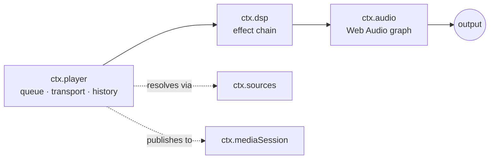
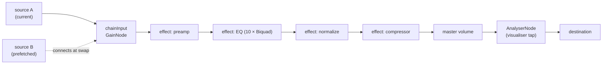
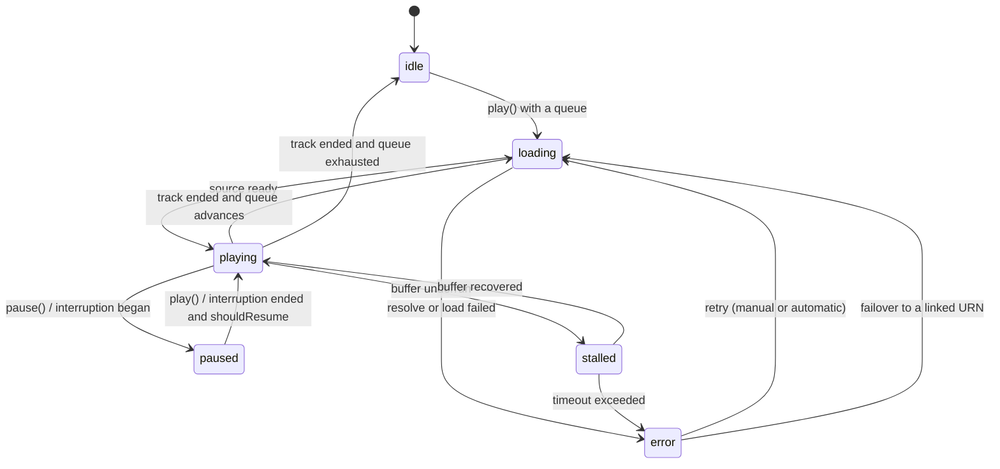
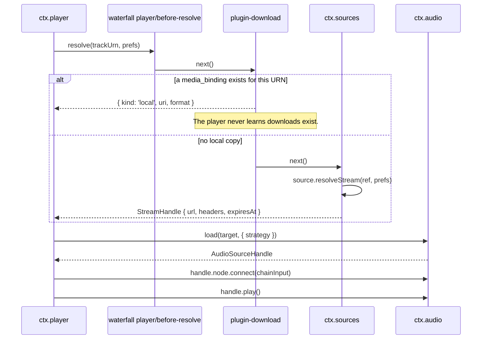

# 05 — Audio & Playback

> **What this answers.** How sound actually gets made: the audio engine contract, the transport
> and queue state machine, how DSP effects compose into a chain, and how playback survives
> interruptions, route changes, and being backgrounded.

Three services, layered:



`ctx.player` decides *what* plays. `ctx.dsp` decides *how it sounds*. `ctx.audio` owns the graph
and is the only thing that touches the platform.

---

## 1. `ctx.audio` — the engine

Per [ADR-4](./01-overview.md#adr-4--react-native-audio-api-is-the-primary-playback-and-dsp-engine-on-every-target),
the contract **is** the Web Audio API. `react-native-audio-api` implements it on iOS and Android
and ships a web build for the Electron renderer, so one graph description runs everywhere.

```ts
import type { Uri, Disposable } from '@BBeBee/protocol'

export interface AudioSourceHandle {
  readonly node: AudioNode
  readonly durationMs: number
  play(atMs?: number): void
  pause(): void
  stop(): void
  readonly positionMs: number
  /** Fires when the source reaches its natural end. */
  onEnded(cb: () => void): Disposable
  dispose(): void
}

export interface LoadOptions {
  /** Streaming keeps memory flat; buffered enables sample-accurate gapless. */
  strategy: 'stream' | 'buffer'
  headers?: Record<string, string>
  signal?: AbortSignal
  onBuffered?: (seconds: number) => void
}

export interface AudioService {
  readonly context: BaseAudioContext
  readonly destination: AudioNode
  readonly sampleRate: number
  readonly outputLatencyMs: number

  /** Load a remote URL or a local Uri into a playable source node. */
  load(src: string | Uri, opts: LoadOptions): Promise<AudioSourceHandle>

  /** Where ctx.dsp inserts its chain. Sources connect here, not to destination. */
  readonly chainInput: AudioNode

  setVolume(v: number): void         // 0..1, applied post-chain
  setMuted(m: boolean): void

  listOutputDevices(): Promise<{ id: string; label: string; isDefault: boolean }[]>
  setOutputDevice(id: string): Promise<void>

  /** Interruptions, route changes, focus loss. See §5. */
  onInterruption(cb: (e: { type: 'began' | 'ended'; shouldResume: boolean }) => void): Disposable
  onRouteChange(cb: (e: { reason: 'device-removed' | 'device-added' | 'override' }) => void): Disposable
}
```

### Graph topology



`chainInput` exists so that sources come and go without ever touching the effect chain, and
effects are rebuilt without ever touching a playing source. The two lifetimes are decoupled.

### Escape hatch

If `react-native-audio-api` proves unworkable on a platform, `core-audio-rntp` can implement
`AudioService` over `react-native-track-player`, with `chainInput` becoming a no-op and effects
degrading to whatever native EQ exists. `ctx.player` and every effect plugin are unaffected. The
abstraction is the insurance policy, and it is cheap precisely because the contract is a standard
one.

---

## 2. `ctx.player` — transport and queue

```ts
export type RepeatMode = 'off' | 'all' | 'one'

export interface QueueItem {
  id: string
  trackUrn: string
  /** Where this came from — an album, a playlist, radio. Drives "playing from". */
  sourceContext?: { kind: 'album' | 'playlist' | 'artist' | 'search' | 'radio'; urn?: string; label?: string }
  addedBy: 'user' | 'autoplay' | 'radio'
}

export interface TransportState {
  status: 'idle' | 'loading' | 'playing' | 'paused' | 'stalled' | 'error'
  currentItemId?: string
  trackUrn?: string
  positionMs: number
  durationMs: number
  bufferedMs: number
  volume: number
  muted: boolean
  repeat: RepeatMode
  shuffle: boolean
  error?: { code: string; message: string; retryable: boolean }
}

export interface PlayerService {
  readonly state: Readonly<TransportState>

  play(): Promise<void>
  pause(): void
  togglePlay(): void
  stop(): void
  seek(positionMs: number): Promise<void>
  next(): Promise<void>
  previous(): Promise<void>       // restarts current if past the threshold — see below

  setVolume(v: number): void
  setMuted(m: boolean): void
  setRepeat(m: RepeatMode): void
  setShuffle(on: boolean): void

  // Queue
  readonly queue: readonly QueueItem[]
  playNow(urns: string[], opts?: { startIndex?: number; context?: QueueItem['sourceContext'] }): Promise<void>
  playFromContext(urn: string, contextUrns?: readonly string[], opts?: { startIndex?: number; context?: QueueItem['sourceContext'] }): Promise<void>
  enqueueNext(urns: string[]): void
  enqueueLast(urns: string[]): void
  removeItems(ids: string[]): void
  moveItem(id: string, toIndex: number): void
  clearQueue(): void
}
```

### Transport state machine



Behaviours worth pinning down, because they are where players feel wrong:

- **`previous()`** restarts the current track if position > 3000 ms, otherwise goes back. The
  threshold is configurable and defaults to what users expect from every other player.
- **`playFromContext(urn, contextUrns)`** is what a tap on a track row means. If the queue
  already holds the track, the queue is kept and playback jumps to that entry — a queue the
  user has built is never silently reordered or replaced. If it does not, the list the row was
  tapped in (`contextUrns`: the album's tracks, the whole local library) becomes the queue and
  playback starts at the tap; with no usable context the track plays alone.
- **Shuffle** is a persisted **seed plus a permutation**, not a random pick each time. This makes
  the shuffled order stable across restarts, makes `previous()` meaningful, and lets the upcoming
  queue be displayed truthfully.
- **Repeat-one** does not re-resolve the stream; it reuses the loaded buffer.
- **`stalled`** is distinct from `paused`. The UI shows a spinner, not a play button, and
  `ctx.mediaSession` keeps reporting `playing` so the lock screen does not flicker.
- **Duration is a floor, not a promise.** The transport reports `source.durationMs` whenever the
  element has one, and falls back to the duration stored in the catalogue row otherwise — Bilibili's
  fMP4 streams are the motivating case, since the element reports `Infinity` while the search rule
  already knew how long the track is. Only seekable handles get the fallback, so a live stream still
  shows no scrubber.
- **Position always comes from the element's clock.** A streamed handle may hold a seek target as
  *pending* only while the element is actually moving there: `play(0)` on a fresh element moves
  nowhere and fires no `seeked`, so recording it as pending left the progress bar at zero for the
  whole track.

### Resolution pipeline

What happens between "the queue advanced" and "audio comes out". This is the sequence where the
plugin architecture pays off most visibly.



On failure the pipeline is re-entered rather than surfaced immediately: an `UnavailableError` — or
a `RuleError` from a source whose rules have rotted
([06 §7](./06-music-sources.md#7-errors)) — triggers a lookup in `track_links`
([07 §4.4](./07-data-model.md#44-identity-linking)) for the same recording on another source, and
only when that yields nothing does the player enter `error`.

`plugin-download` is the waterfall's resident listener, and its policy is a **playback cache**: a
remote handle is fetched with the stream's own headers and written to `ctx.paths.cache` while it
plays, recorded as a `media_bindings` row with `origin: 'download'`; every later resolve answers
`kind: 'local'` and never reaches the provider.

The work itself is a row in `download_tasks` driven by one worker, exposed as **`ctx.downloads`**
(queued → running → done, with paused/canceled/failed): `bytes_done` is checkpointed per second so
a pause or an interruption resumes with a `Range` request instead of starting over, `enqueue`
queues a track without a play (the ⬇ control on a track row calls it), and
pause/resume/cancel/retry/remove/clear move the row and the file together. A Downloads settings
page in both shells renders that list — progress, sizes, and the controls each state allows — plus
the two policy switches.

**Two destinations.** A track the user downloads explicitly is *kept* in
`ctx.paths.downloads/BBeBee/` and is never evicted; the automatic playback cache lives in
`ctx.paths.cache/media` and is evicted oldest-played-first once a byte budget is exceeded. Both are
the same `media_bindings` row, so the player cannot tell them apart, and a kept download outranks
the cache when both exist.

**The policy is a row, not a constant.** `download_policies` holds `wifi_only` and
`charging_only`; the worker holds queued tasks and pauses running ones when the device state stops
satisfying them, re-checking on `ctx.device.onNetworkChange` and on a timer while a charger is the
only thing missing. A task this plugin paused resumes by itself when the constraint lifts; one the
user paused does not.

A binding whose file is gone is deleted rather than left to fail, files orphaned when a source
removal cascaded their binding away are swept when the plugin starts, and resuming sends
`If-Range: <etag>` so a remote file that changed since the partial was written is restarted rather
than spliced. With the plugin's `enabled` set to false the same track simply streams — which is the
control arm of the regression test at
[09 §6](./09-project-structure.md#6-testing-strategy).

### Gapless and crossfade

- **Gapless** uses `AudioBufferQueueSourceNode`: the next track is decoded during the current
  one's last ~15 seconds and queued into the same source node, so the handoff is
  sample-accurate with no `AudioContext` scheduling gap. Requires `strategy: 'buffer'`, so it is
  enabled for local files and short/medium streams and skipped for long ones.
- **Crossfade** is the alternative path: two source nodes, two gain ramps of
  `crossfadeMs`, equal-power curve. Mutually exclusive with gapless — attempting both produces a
  audible double-fade — so the setting is a three-way choice: `gapless | crossfade | neither`.
- **Prefetch** begins at `max(15s, crossfadeMs + 5s)` before the end, and is cancelled via
  `AbortSignal` if the queue changes.

### Stream preferences

The `prefs` handed down the resolution pipeline is built by the player, not resolved from a
store: `prefs.quality` comes from the player's `quality` config (`lossless` by default —
sources are expected to degrade the tier themselves onto the best stream that *can* be decoded
when their backend has no such tier, or the account lacks the entitlement for one),
`prefs.saveData` from `ctx.device.network().metered`, and `prefs.acceptFormats` from
`ctx.codec.supportedFormats()`. A source that needs anything else about the request — a
per-quality URL, a format filter of its own — reads it out of `prefs` in `ruleStream`, and the
player has no concept of the tiers any given backend carries.

### Persistence

`playback_state` is written on a 5-second throttle while playing, and immediately on pause, track
change, and `ctx.background.onWillSuspend`. On boot the player restores the queue and position
but **does not auto-play** — restoring into playback is startling, particularly on a phone that
just launched in a pocket.

---

## 3. `ctx.dsp` — the effect chain

Every effect is a plugin. The service is a registry plus a chain builder.

```ts
import type { StandardSchemaV1 } from '@standard-schema/spec'

export interface EffectSegment {
  /** Where audio enters and leaves this effect. May be the same node. */
  input: AudioNode
  output: AudioNode
  /** Called when a persisted parameter changes. Must be allocation-free. */
  setParam(name: string, value: number | string | boolean): void
  /** Added to the reported chain latency, for A/V sync and visualiser alignment. */
  latencyMs?: number
  dispose(): void
}

export interface EffectDefinition<P = Record<string, unknown>> {
  id: string                      // 'eq10', 'reverb', 'normalize'
  displayName: string
  /** Default ordinal. Lower runs earlier. Users may override. */
  defaultOrder: number
  Params: StandardSchemaV1<unknown, P>
  presets?: { name: string; params: P }[]
  build(ctx: AudioContextLike, params: P): EffectSegment
}

export interface DspService {
  register(def: EffectDefinition): Disposable
  readonly definitions: readonly EffectDefinition[]

  readonly chain: readonly { effectId: string; enabled: boolean; ordinal: number }[]
  setEnabled(effectId: string, on: boolean): Promise<void>
  setOrder(effectId: string, ordinal: number): Promise<void>
  setParam(effectId: string, name: string, value: number | string | boolean): Promise<void>
  applyPreset(effectId: string, presetName: string): Promise<void>

  /** Total added latency, so the visualiser and lyrics can compensate. */
  readonly latencyMs: number
}
```

An effect plugin is small:

```ts
export const name = 'plugin-effect-eq10'
export const inject = ['dsp']

const BANDS = [31, 62, 125, 250, 500, 1000, 2000, 4000, 8000, 16000]

export function apply(ctx: Context) {
  return ctx.dsp.register({
    id: 'eq10',
    displayName: '10-Band Equalizer',
    defaultOrder: 20,
    Params: EqParams,                       // Zod/Valibot schema: gains + preamp
    presets: [{ name: 'Flat', params: { gains: BANDS.map(() => 0) } }],
    build(audioCtx, params) {
      const filters = BANDS.map((f, i) => {
        const n = audioCtx.createBiquadFilter()
        n.type = i === 0 ? 'lowshelf' : i === BANDS.length - 1 ? 'highshelf' : 'peaking'
        n.frequency.value = f
        n.Q.value = 1.41
        n.gain.value = params.gains[i]
        return n
      })
      filters.reduce((a, b) => (a.connect(b), b))
      return {
        input: filters[0],
        output: filters[filters.length - 1],
        setParam(nameOfParam, value) {
          const i = Number(nameOfParam.replace('band', ''))
          // Ramp rather than assign — a step change on a live filter clicks.
          filters[i].gain.setTargetAtTime(Number(value), audioCtx.currentTime, 0.02)
        },
        dispose() { filters.forEach((f) => f.disconnect()) },
      }
    },
  })
}
```

### Chain assembly

`ctx.dsp` emits the `dsp/build-chain` waterfall, each registered effect contributing a segment in
ordinal order, and the result is spliced between `chainInput` and master volume. Rebuilds happen
only on structural change (an effect enabled, disabled, or reordered); **parameter changes never
rebuild the graph**, they call `setParam`. Rebuilding on every EQ slider drag would be audible.

Rebuilds are also ramped: master gain dips over 20 ms, the graph is re-wired, gain returns. Without
this, toggling an effect mid-playback clicks.

### Built-in effects

| id | Order | Implementation | Notes |
|---|---|---|---|
| `preamp` | 10 | `GainNode` | Headroom before EQ; clamped to −20…+20 dB |
| `eq10` | 20 | 10 × `BiquadFilterNode` | Low-shelf, 8 peaking, high-shelf |
| `normalize` | 30 | `GainNode` driven by ReplayGain tags | Track or album mode; falls back to a measured value the scanner computed |
| `compressor` | 40 | `DynamicsCompressorNode` | "Night mode" preset for quiet listening |
| `reverb` | 50 | `ConvolverNode` | Impulse responses shipped as assets; wet/dry mix |
| `widener` | 60 | `ChannelSplitter` + `Delay` + `ChannelMerger` | Haas-based; mono-compatibility warning in the UI |
| `crossfeed` | 65 | `IIRFilterNode` + delay | Bauer-style, for headphone fatigue |
| `tempo-pitch` | 70 | JS `AudioWorklet` (phase vocoder) | ⚠️ CPU-heavy; off by default, disabled automatically on low battery |
| `limiter` | 90 | `DynamicsCompressorNode`, hard settings | Always last; protects against cumulative effect gain |

> ⚠️ `tempo-pitch` runs on the audio thread as an `AudioWorklet` created from the `AudioContext`
> that `build()` receives — like every other effect, it imports nothing platform-specific and does
> not know which engine is underneath. It is nonetheless the one effect with real performance risk
> on mid-range Android: it reports its own dropout count and disables itself with a user-visible
> notice rather than degrading the whole chain.

---

## 4. Media session integration

`ctx.player` publishes to `ctx.mediaSession` on every track change and status change, throttled to
once per second for position. Commands flow the other way through `onCommand`.

Artwork must be a local `Uri` on mobile, so the artwork cache resolves and downloads it before
`update()` is called; a track change publishes metadata immediately with no artwork and updates
again when the image lands, rather than delaying the whole update.

---

## 5. Interruptions, focus, and routes

Handled once, in `ctx.player`, using `ctx.audio`'s events. Every platform's rules are
different; the *policy* is uniform.

| Event | Policy |
|---|---|
| Phone call / alarm begins | Pause. Remember that it was playing |
| Interruption ends with `shouldResume` | Resume only if we paused for this reason and the user has not intervened since |
| Another app takes audio focus (Android) | Pause. Do not duck — ducking a music player is wrong |
| Transient duck request (navigation prompt) | Lower master volume to 20% over 200 ms, restore after |
| Headphones unplugged / Bluetooth disconnected | **Pause immediately.** Never continue to speakers |
| New output device connected | Continue on the current device; do not migrate without user action |
| Output device disappears mid-playback | Pause, surface a notice, offer to switch |

The headphone rule matters enough to be non-configurable. It is the one audio behaviour users
never forgive.

---

## 6. Playback and the background

Cross-reference [02 §4](./02-architecture.md#4-what-background-means). Concretely:

- **iOS** — `UIBackgroundModes: ['audio']`, audio session category `playback`. Playback continues
  indefinitely; *non-audio* work does not.
- **Android** — a foreground service with a media notification, started when playback starts and
  stopped when it ends. Without it, the process is killed within minutes.
- **Desktop** — the renderer must stay alive, so closing the window hides to tray while audio
  plays. `powerSaveBlocker` prevents display-sleep from suspending the audio thread on some
  Windows configurations.

---

## 7. Testing audio

Audio is hard to test, so the strategy is layered rather than end-to-end:

1. **Effect determinism** — every `EffectDefinition.build` runs in an `OfflineAudioContext`
   against a known input buffer; output is compared to a stored reference within a tolerance.
   Catches accidental changes to filter coefficients, which are otherwise invisible until someone
   notices the EQ sounds different.
2. **Transport state machine** — pure unit tests against a mock `AudioService`. Every transition
   in the §2 diagram has a test, including interruption-during-load and queue-change-during-prefetch.
3. **Resolution pipeline** — the `player/before-resolve` waterfall tested with and without
   `plugin-download` loaded, asserting the player behaves identically apart from the chosen target.
4. **Device smoke tests** — a manual matrix per release: lock screen, Bluetooth, headphone unplug,
   incoming call, gapless boundary, background survival. Not automatable at reasonable cost, and
   honest about that.

---

## 8. Where to go next

[06 — Music Sources](./06-music-sources.md) defines where the URNs and stream handles come from.
