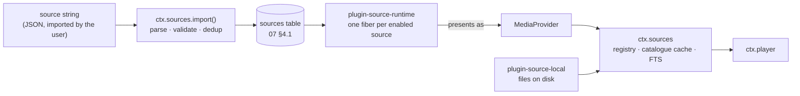
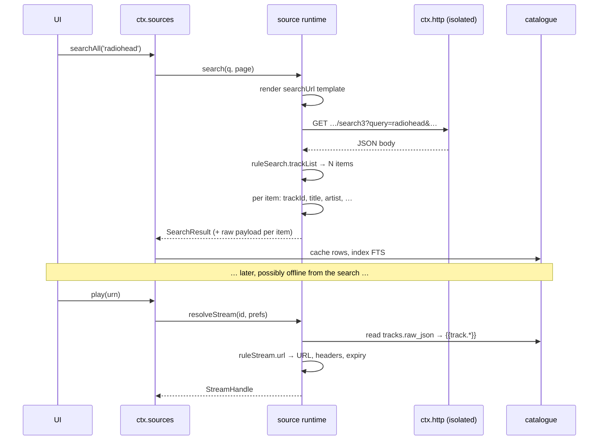
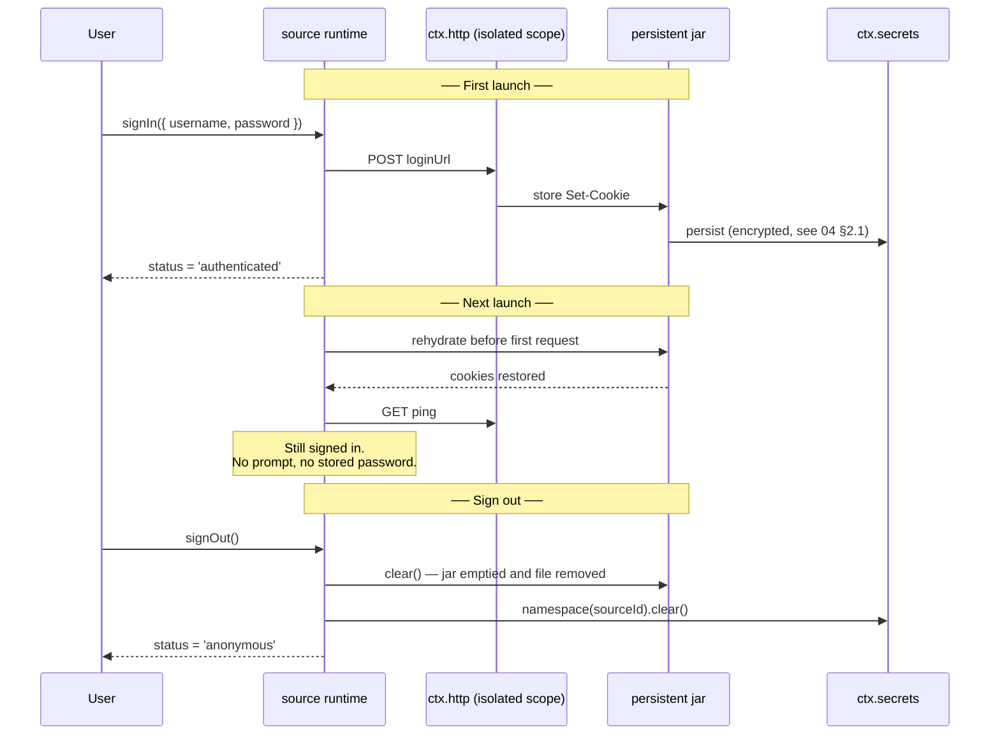
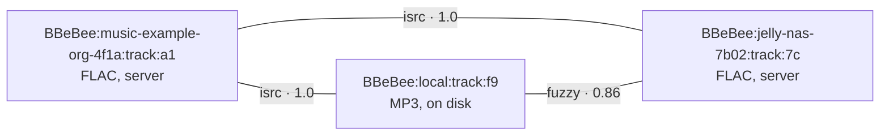

# 06 — Music Sources

> **What this answers.** What a music source *is* now that it is a string rather than a package:
> the JSON document a user imports, the rule language inside it, the single runtime that
> interprets it, how a source authenticates and stays signed in, how a rule becomes bytes, what an
> imported source is and is not allowed to do, and how a broken one is diagnosed and repaired.

A source is **data, not code we ship**. The user pastes a string — from a friend, a forum, a
gist, a QR code — and the app can play from a backend nobody in this repository has heard of, with
no build, no release, and no plugin install. When that backend changes its API, the fix is an
edited string, not a version bump.

This is the [legado](https://github.com/gedoor/legado) model for book sources, applied to audio.
It is a deliberate reversal of the earlier design, in which every backend was a plugin package;
[ADR-5](./01-overview.md#adr-5--music-sources-are-imported-strings-interpreted-by-one-runtime)
records what that cost and what it bought.

---

## 1. The model

### 1.1 One runtime, many sources

There is exactly **one** piece of code that talks to remote music backends:
`plugin-source-runtime`. It claims no service key of its own — it reads the `sources` table and
registers one provider into `ctx.sources` per enabled row. Sources are rows; the runtime is the
only interpreter of them, and there is no second one to keep in step.



`MediaProvider` still exists, and everything above it — `ctx.sources`, `ctx.player`, the
catalogue cache, the URN scheme — is unchanged. What changed is its population: it is now an
**internal interface with exactly two implementations** (the runtime's per-source adapter, and
local files), not an extension point third parties write against. Nobody outside this repository
implements `MediaProvider`; they write a source document instead.

```ts
import type { Uri, Disposable } from '@BBeBee/protocol'

/** Internal. Two implementations: the source runtime, and plugin-source-local. */
export interface MediaProvider {
  readonly sourceId: string             // 'music-example-org-4f1a'
  readonly displayName: string
  readonly capabilities: Capabilities   // derived — see §1.3
  readonly auth: ProviderAuth           // synthesised from the document — see §5

  getTrack(id: string): Promise<Track>
  resolveStream(id: string, prefs: StreamPrefs): Promise<StreamHandle>
  ping(): Promise<boolean>

  search?(q: SearchQuery, page?: PageRequest): Promise<SearchResult>
  browse?(nodeId?: string, page?: PageRequest): Promise<Paged<BrowseEntry>>
  getTracks?(ids: string[]): Promise<Track[]>
  getAlbum?(id: string): Promise<AlbumDetail>
  getArtist?(id: string): Promise<ArtistDetail>
  getPlaylist?(id: string, page?: PageRequest): Promise<PlaylistDetail>
  getLyrics?(id: string): Promise<Lyrics | undefined>
  getArtwork?(ref: ArtworkRef, size?: number): Promise<Uri>
  library?: ProviderLibrary
}
```

What a provider does **not** do is unchanged and still load-bearing: it never writes the database,
never touches the audio graph, never renders anything. It answers questions and returns plain
data. `ctx.sources` caches the answers into the catalogue tables
([07 §4.3](./07-data-model.md#43-catalogue)); `ctx.player` consumes the stream handles.

### 1.2 Identity: the source id

A source document is keyed by **`sourceUrl`**, exactly as a legado book source is. It is the
backend's base URL, and it is what makes two Navidrome servers two sources rather than one
misconfigured one.

```
sourceUrl  https://music.example.org
       ↓   slugified host + 4 hex of sha256(sourceUrl)
id         music-example-org-4f1a
       ↓
URN        BBeBee:music-example-org-4f1a:track:8f1a2c
```

The id is derived, stable, and short enough to read in a log line. It occupies the URN's second
segment, which is the segment [07 §1](./07-data-model.md#1-identity-the-urn) always reserved for
"whichever namespace owns this id" — so the URN scheme did not change when the model did.

Two consequences worth stating, because both used to require plugin machinery:

- **Multiple instances are free.** Home and work Navidrome are two imported strings with two
  `sourceUrl`s. Nothing is "instantiable"; there is no such concept any more.
- **Re-importing is an update, not a duplicate.** A string whose `sourceUrl` already exists
  updates that row and keeps its id, so every URN, cached row, cookie jar and playlist reference
  survives the edit ([§9](#9-importing-updating-and-sharing)).

### 1.3 Capabilities are derived, not declared

The old SPI asked a provider to declare `capabilities` and hope it matched the methods it
implemented; under-declaring degraded the UI and over-declaring broke it. A source document has no
such gap: **the runtime computes `Capabilities` from which rule blocks are present.**

| Present in the document | Enables |
|---|---|
| `searchUrl` + `ruleSearch` | `search`, and participation in `searchAll` |
| `exploreUrl` + `ruleExplore` | `browse` |
| `ruleAlbum` | `getAlbum`, album detail screens |
| `ruleTrackList` | Album and playlist track listings |
| `ruleStream` *(or `streamUrl` inside a list rule)* | `resolveStream` — **required**; a source without it cannot play anything and is rejected at import |
| `ruleLyric` | `getLyrics` |
| `loginUrl` / `loginUi` | A sign-in flow; absent means `flow: { kind: 'none' }` |
| `ruleLibrary.*` | The corresponding `ProviderLibrary` members |

A rule block that is present but empty counts as absent. There is exactly one required block —
`ruleStream` — because a source that cannot produce a playable URL is not a music source.

```ts
export interface Capabilities {
  search: { tracks: boolean; albums: boolean; artists: boolean; playlists: boolean; fullText: boolean }
  browse: boolean
  lyrics: boolean
  artwork: boolean
  library: { read: boolean; save: boolean; playlistWrite: boolean; playlistReorder: boolean }
  streaming: {
    qualities: StreamQuality[]
    transcoding: boolean
    /** Byte-range requests — required for seeking within a stream. */
    seekable: boolean
    /** Whether resolved URLs expire and must be re-resolved. */
    urlExpiry: boolean
  }
  rateLimit?: { requests: number; windowMs: number }   // from `concurrentRate`
  regional: boolean
}

export type StreamQuality = 'low' | 'normal' | 'high' | 'lossless' | 'hi-res'
```

The shells still hide affordances rather than showing buttons that fail — they simply read a
computed value instead of a promised one.

---

## 2. The source document

### 2.1 Top-level fields

One JSON object is one source. An array of them is a **source set**, which is what people
actually share.

```ts
export interface SourceDocument {
  /** Identity. The backend's base URL. Required, unique, never edited in place. */
  sourceUrl: string
  sourceName: string
  sourceType?: 'music' | 'podcast' | 'radio'      // default 'music'
  sourceGroup?: string                            // free-text, comma-separated; drives filtering
  sourceIcon?: string
  sourceComment?: string                          // author's notes, shown in the editor
  enabled?: boolean                               // default true
  sortOrder?: number

  /** Hosts this source may talk to, beyond sourceUrl's own. Shown at import. §8 */
  allowedHosts?: string[]

  /** Requests per window, honoured by the runtime's scheduler. '3/1000' = 3 per second. */
  concurrentRate?: string

  /** Sent on every request. A rule, so it may be computed. */
  header?: string

  /** Free-text explanation of what `{{source.var}}` is for, shown beside the input. */
  variableComment?: string

  /** Functions shared by every `@js:` block in this document. */
  jsLib?: string

  /* ── auth (§5) ──────────────────────────────────────────────── */
  loginUrl?: string
  loginUi?: LoginField[]
  loginCheckJs?: string

  /* ── entry points ───────────────────────────────────────────── */
  searchUrl?: string
  exploreUrl?: string                             // JSON array of { title, url }, or a rule

  /* ── rule blocks (§2.2) ─────────────────────────────────────── */
  ruleSearch?: ListRule
  ruleExplore?: ListRule
  ruleAlbum?: AlbumRule
  ruleTrackList?: ListRule
  ruleStream?: StreamRule                         // required in practice — see §1.3
  ruleLyric?: LyricRule
  ruleLibrary?: LibraryRule

  /* ── maintained by the app, not the author ──────────────────── */
  lastUpdated?: number
  respondTime?: number
  weight?: number
}
```

> Fields the app maintains are written back on `check` ([§10](#10-diagnosing-a-broken-source)) and
> are stripped on export, so sharing a source never leaks how fast *your* network is or when *you*
> last used it.

### 2.2 The rule blocks

Every value below is a **rule string** in the language of [§3](#3-the-rule-language) — never a
plain value, even when it looks like one.

```ts
/** Search results, explore results, and album track listings share one shape. */
export interface ListRule {
  /** Selects the repeating element. Every other field is evaluated against one of them. */
  trackList: string

  title: string
  artist?: string
  album?: string
  albumId?: string
  artwork?: string
  durationMs?: string
  trackId: string                 // becomes the URN's last segment
  quality?: string

  /** Shortcut: when the list already carries a playable URL, ruleStream is skipped. */
  streamUrl?: string
  /** For explore and album lists: descend rather than play. */
  childUrl?: string
  kind?: string                   // track|album|artist|playlist|folder|genre
}

export interface AlbumRule {
  title: string
  artist?: string
  artwork?: string
  year?: string
  description?: string
  trackCount?: string
  /** Where ruleTrackList is evaluated. Absent means "the same document". */
  trackListUrl?: string
}

export interface StreamRule {
  /** The only required member of the only required block. */
  url: string
  headers?: string                // JSON object; merged over `header`
  mimeType?: string
  codec?: string
  bitrateKbps?: string
  sampleRate?: string
  byteLength?: string
  seekable?: string               // truthy string; default probed with a HEAD
  /** Epoch ms. Its presence is what sets `capabilities.streaming.urlExpiry`. */
  expiresAt?: string
}

export interface LyricRule { lyric: string; format?: string; offsetMs?: string }
```

`browse` is `exploreUrl` + `ruleExplore`: each explore entry is a titled URL, and an item whose
`childUrl` is non-empty is a node to descend into rather than a leaf to play. A folder tree, a
genre list, a chart, and a podcast feed's episode list are all the same three fields, which is why
one UI component renders all of them.

### 2.3 A complete example

**The floor.** A source that plays exactly one stream — the smallest legal document, and the
regression test that every screen survives a source with no optional block at all:

```json
{
  "sourceUrl": "https://stream.example.org/live.mp3",
  "sourceName": "Example Radio",
  "sourceType": "radio",
  "ruleStream": { "url": "={{source.url}}", "mimeType": "=audio/mpeg", "seekable": "=false" }
}
```

**A real one.** Subsonic-flavoured, showing templating, a computed auth token, JSONPath rules, and
a stream URL built from a stored id:

```json
{
  "sourceUrl": "https://music.example.org",
  "sourceName": "Navidrome — home",
  "sourceGroup": "self-hosted,subsonic",
  "concurrentRate": "5/1000",
  "variableComment": "username:password",
  "jsLib": "function auth(){ const [u,p]=String(src.vars.get('var')||'').split(':'); const s=src.crypto.randomHex(8); return `u=${u}&t=${src.crypto.md5(p+s)}&s=${s}&v=1.16.1&c=BBeBee&f=json` }",
  "searchUrl": "{{source.url}}/rest/search3?query={{key}}&songCount=50&songOffset={{(page-1)*50}}&{{@js:auth()}}",
  "exploreUrl": "[{\"title\":\"Albums\",\"url\":\"{{source.url}}/rest/getAlbumList2?type=alphabeticalByName&size=100&offset={{(page-1)*100}}&{{@js:auth()}}\"}]",

  "ruleSearch": {
    "trackList": "$.subsonic-response.searchResult3.song[*]",
    "trackId":   "$.id",
    "title":     "$.title",
    "artist":    "$.artist",
    "album":     "$.album",
    "albumId":   "$.albumId",
    "durationMs": "$.duration##$##000",
    "artwork":   "={{source.url}}/rest/getCoverArt?id={{item.coverArt}}&{{@js:auth()}}",
    "quality":   "$.suffix"
  },

  "ruleExplore": {
    "trackList": "$.subsonic-response.albumList2.album[*]",
    "trackId":   "$.id",
    "title":     "$.name",
    "artist":    "$.artist",
    "kind":      "=album",
    "childUrl":  "={{source.url}}/rest/getAlbum?id={{item.id}}&{{@js:auth()}}"
  },

  "ruleTrackList": {
    "trackList": "$.subsonic-response.album.song[*]",
    "trackId":   "$.id",
    "title":     "$.title",
    "artist":    "$.artist",
    "durationMs": "$.duration##$##000"
  },

  "ruleStream": {
    "url":       "={{source.url}}/rest/stream?id={{track.id}}&maxBitRate={{prefs.maxBitrateKbps}}&{{@js:auth()}}",
    "seekable":  "=true",
    "bitrateKbps": "{{prefs.maxBitrateKbps}}"
  }
}
```

Note what makes `ruleStream` work hours later, offline from the search that produced the track:
the runtime stores each list item's raw payload in `tracks.raw_json`
([07 §4.3](./07-data-model.md#43-catalogue)) and exposes it as `{{track.*}}`. Resolution never
re-runs a search.

---

## 3. The rule language

One language, used for every field in [§2.2](#22-the-rule-blocks). It is small on purpose: a rule
is one line in a form field, and a source author is debugging it on a phone.

### 3.1 Engines and prefixes

The prefix picks the engine. With no prefix, the engine is inferred from the shape of the rule and
the content type of the document being evaluated.

| Form | Engine | Applies to |
|---|---|---|
| `@css:h3 a@text` · a bare CSS selector | CSS selection with an `@attr` / `@text` / `@html` tail | HTML, XML |
| `@json:$.a.b[0]` · a rule starting `$.` | JSONPath | JSON |
| `@xpath://div[@id="t"]/text()` · a rule starting `//` | XPath | HTML, XML |
| `:(\d+)kbps` | Regular expression; capture group 1, or group 0 if there is none | Any text |
| `@js:` … · `<js>` … `</js>` | Sandboxed JavaScript ([§8](#8-trust-what-an-imported-source-can-and-cannot-do)) | Any |
| `=` … | Literal template — the rest is text with `{{ }}` interpolation, never a selector | Any |

Inference exists so that the common case is short. It is also the one place the language can
surprise you, so the rule is written down rather than left to taste: **a rule is a selector unless
it starts with `=`.** A constant `"audio/mpeg"` with no `=` is a CSS selector for an element type
that does not exist, and the interpreter will tell you so rather than quietly returning the
string.

### 3.2 Templates and scope

`{{ }}` evaluates an expression and inlines the result. Inside a template, the following are in
scope:

| Name | Meaning |
|---|---|
| `source.url` | The document's `sourceUrl` |
| `source.var` | The per-source variable the user typed (credentials, a cookie, a region) |
| `key` | The search text — only inside `searchUrl` |
| `page` | 1-based page number — `searchUrl`, `exploreUrl`, and any paged list |
| `baseUrl` | The URL the current document was fetched from; relative links resolve against it |
| `item` | The current list element, when evaluating a `ListRule` field |
| `result` | The value produced so far in a chain ([§3.3](#33-combinators-and-post-processing)) |
| `track`, `album` | The stored entity, when evaluating `ruleStream` or `ruleLyric` |
| `prefs` | The active `StreamPrefs` ([§6](#6-stream-resolution)) — quality, `saveData`, formats |
| `src` | The host object of [§8](#8-trust-what-an-imported-source-can-and-cannot-do) — `md5`, `get`, `cache`, `vars`, … |

Expressions are ordinary JavaScript evaluated in the sandbox, so `{{(page-1)*50}}` and
`{{@js:auth()}}` are the same mechanism with different sugar.

### 3.3 Combinators and post-processing

| Syntax | Meaning |
|---|---|
| `a || b` | First non-empty result wins. The idiom for a backend that renamed a field |
| `a && b` | Concatenate every result, in order |
| `a %% b` | Interleave the two lists — `a[0], b[0], a[1], b[1], …` |
| `rule##pattern##replacement` | Regex-replace the result. `##pattern##` with no replacement deletes |
| `rule##pattern##replacement###` | The trailing `###` makes it replace-first rather than replace-all |
| `{{rule}}` inside a `=` template | Inline evaluation |

`||` is the single most useful thing in the language: it is how a shared source survives a backend
that adds a field without removing the old one, and it is why a well-written source keeps working
through a site redesign that breaks a badly written one.

### 3.4 Variables and state

Three scopes, three lifetimes:

| Scope | Written by | Lives in | Cleared by |
|---|---|---|---|
| `@put:{k:rule}` / `@get:{k}` | A rule, mid-evaluation | The current evaluation only | Finishing the call |
| `src.cache.put(k, v, ttlMs)` | `@js:` | Memory, per source, TTL-bounded | TTL, unload, or "clear cache" |
| `src.vars.put(k, v)` | `@js:` | `source_vars` ([07 §4.1](./07-data-model.md#41-sources-accounts-and-sessions)) | Sign-out, or removing the source |

`@put` exists for the pattern every scraped backend needs — pull a token out of the search page,
use it in the stream URL two calls later — without making that token global or persistent.
`src.vars` is for what must survive a restart, and is treated as credential-grade storage: it is
not exported with the source, not logged, and cleared by sign-out.

### 3.5 URL objects

Any rule that produces a URL may instead produce a **URL object**: the URL, a comma, and a JSON
options blob. This is legado's syntax and it is kept because it is compact enough to live in a
form field.

```
https://api.example.org/search,{"method":"POST","body":"q={{key}}","headers":{"X-Api":"…"},"charset":"gbk"}
```

| Option | Effect |
|---|---|
| `method` | `GET` (default), `POST`, `HEAD` |
| `body` | Request body; templated |
| `headers` | Merged over the document's `header` |
| `charset` | Decode a non-UTF-8 response |
| `retry` | Attempts before the call is an error; default 1 |
| `webView` | ⚠️ Render in a hidden web view and take the result DOM. Desktop only, off by default, and it is the one option that gives a source a full browser — see [§8](#8-trust-what-an-imported-source-can-and-cannot-do) |

### 3.6 What the interpreter guarantees

Rules come from strangers and are evaluated against documents that changed since the rule was
written. The interpreter's contract is about that, not about expressiveness:

- **Absent and empty are different.** A selector that matches nothing yields *absent*; a selector
  that matches an empty string yields `''`. Optional fields tolerate absent; required ones raise
  `RuleError` naming the rule ([§7](#7-errors)).
- **Coercion is explicit and total.** `durationMs` runs through a numeric coercion that accepts
  `213`, `"3:33"`, and `"213.4s"` and rejects everything else with the rule id, rather than
  writing `NaN` into the catalogue.
- **Every evaluation is bounded.** Wall-clock, memory, output size, and HTTP calls per rule are
  all capped. A runaway `@js:` block fails its rule; it does not hang the app
  ([§8](#8-trust-what-an-imported-source-can-and-cannot-do)).
- **Relative URLs resolve against `baseUrl`**, always, so a source never has to concatenate paths.
- **Nothing a rule returns is trusted as markup.** Results are text and are rendered as text. A
  title containing `<script>` is a title.
- **Failure is attributable.** Every error carries the source id, the rule block, the field, and
  the input excerpt — which is what makes [§10](#10-diagnosing-a-broken-source) possible.

---

## 4. The runtime

### 4.1 A source's lifetime

A source is not a plugin — but the runtime still gives each one **its own fiber and its own
isolated `ctx.http` scope**, because that is what makes disabling one total and free of bespoke
cleanup ([03 §2](./03-plugin-system.md#2-lifecycle)).

```ts
// plugin-source-runtime — simplified
for (const rec of await ctx.db.select('sources', { enabled: 1 })) {
  const scoped = ctx.isolate('http')                       // private cookie jar + rate limiter
  scoped.plugin(HttpStack, { jar: rec.id, rateLimit: parseRate(rec.doc.concurrentRate) })
  scoped.plugin(SourceInstance, { record: rec })           // registers into ctx.sources
}
```

Everything that used to follow from "one plugin, many instances" now follows from "one row, one
fiber": two sources cannot see each other's cookies, one source's rate limiting cannot stall
another's requests, and removing a source disposes exactly its own registrations, its jar, its
vars, and — if the user asks — its catalogue rows.

Editing a source string disposes and rebuilds only that fiber. The user sees the change on the
next search, with no restart.

```ts
export interface SourcesService {
  /* ── the registry (unchanged) ─────────────────────────────────── */
  /** Internal. Called by the runtime per source and by plugin-source-local. */
  register(p: MediaProvider): Disposable
  readonly providers: readonly MediaProvider[]
  get(sourceId: string): MediaProvider | undefined
  forUrn(urn: string): MediaProvider | undefined
  searchAll(q: SearchQuery, opts?: { sourceIds?: string[]; timeoutMs?: number }): Promise<AggregatedSearch>

  /* ── sources as data (§9, §10) ────────────────────────────────── */
  readonly sources: readonly SourceRecord[]
  import(input: string, opts?: ImportOptions): Promise<ImportReport>
  export(ids?: string[]): Promise<string>
  setEnabled(id: string, on: boolean): Promise<void>
  remove(id: string, opts?: { forgetCatalogue?: boolean }): Promise<void>
  check(ids?: string[], opts?: { signal?: AbortSignal }): Promise<CheckReport[]>
  debug(id: string, step: DebugStep): AsyncIterable<TraceEvent>
}

export interface AggregatedSearch {
  /** One entry per source that was asked — including the ones that failed. */
  bySource: {
    sourceId: string
    result?: SearchResult
    /** Present on failure. The source is reported, never silently dropped. */
    error?: SourceError
    /** True when the source exceeded `timeoutMs` and is still running. */
    pending: boolean
    tookMs: number
  }[]
}
```

`searchAll` is unchanged in shape and more important than before: with a dozen imported sources of
uneven quality, per-source results with per-source errors is the difference between "search is
broken" and "three of your twelve sources answered, one is rate-limited, one needs re-import".

### 4.2 The resolution pipeline



The pipeline runs the same way for `browse` (`exploreUrl` → `ruleExplore` → `childUrl` →
`ruleAlbum` → `ruleTrackList`) and for lyrics. There are only three verbs — fetch a document,
select from it, coerce the selection — and every capability is a different arrangement of them.

### 4.3 Pagination, rate limiting and caching

**Pagination** is `{{page}}`. The runtime increments it and stops when a page yields no items or
repeats the previous page's ids. It exposes the same opaque cursor contract as before, so no
consumer learns that pages are numbers:

```ts
export interface PageRequest { cursor?: string; limit?: number }

export interface Paged<T> {
  items: T[]
  cursor?: string        // absent means no more
  total?: number         // only when the backend actually says
  hasMore: boolean
}

export interface SearchQuery {
  text: string
  types?: ('track' | 'album' | 'artist' | 'playlist')[]
  filters?: { genre?: string; yearFrom?: number; yearTo?: number; durationMaxMs?: number }
}

export interface SearchResult {
  tracks?: Paged<Track>
  albums?: Paged<Album>
  artists?: Paged<Artist>
  playlists?: Paged<Playlist>
}
```

`total` stays optional, because a scraped page almost never knows one and inventing it produces
progress bars that lie.

**Rate limiting** is `concurrentRate`, enforced by the source's isolated HTTP stack rather than by
the rules. `"3/1000"` is three requests per second; `"1/2000"` is one every two seconds. A source
with no `concurrentRate` gets a conservative default, because the failure mode of guessing high is
someone's server banning the user's IP.

**Caching** has two layers, and the distinction matters when a source misbehaves: HTTP responses
go through `plugin-cache` on the `http/request` waterfall and honour the backend's headers;
`src.cache` is the source's own scratch space with an explicit TTL. Clearing one does not clear the
other, and the settings screen offers both separately.

---

## 5. Authentication and session

Auth is **declared in the document and driven by the shell**, so no source author writes a login
screen — the same principle as before, expressed as data.

```ts
export interface LoginField {
  id: string
  label: string
  type?: 'text' | 'password' | 'checkbox' | 'select'
  options?: string[]
  placeholder?: string
}

export type AuthFlow =
  | { kind: 'none' }
  | { kind: 'variable'; comment?: string }        // the `source.var` box, and nothing more
  | { kind: 'form'; fields: LoginField[]; submitTo: string }
  | { kind: 'webview'; loginUrl: string; requiredCookies: string[] }

export type AuthStatus =
  | { state: 'anonymous' }
  | { state: 'authenticated'; displayName?: string; expiresAt?: number }
  | { state: 'expired' }
  | { state: 'error'; message: string }

export interface ProviderAuth {
  readonly flow: AuthFlow
  readonly status: AuthStatus
  signIn(input: Record<string, string>): Promise<void>
  /** Clears the jar, the secrets namespace, and this source's vars. Leaves nothing. */
  signOut(): Promise<void>
  refresh?(): Promise<void>
  onStatusChange(cb: (s: AuthStatus) => void): Disposable
}
```

How each flow is expressed in the document:

| Flow | Written as | Example |
|---|---|---|
| `none` | No auth fields at all | A public radio stream |
| `variable` | `variableComment` only | Subsonic's `user:password`, consumed by `jsLib` |
| `form` | `loginUi` (the fields) + `loginUrl` (where they go) | A self-hosted server's `/login` |
| `webview` | `loginUrl` + `requiredCookies`, opened in `ctx.shell` | A backend whose login is a page, not an API |

`loginCheckJs` runs after every response and decides whether the session is still good; returning
false sets `status = 'expired'` and emits `source/auth-expired`. It is the source's equivalent of
"the server started answering with the login page again", which no HTTP status code reliably
signals.

Rules, all non-negotiable and all unchanged from when sources were plugins:

- **Credentials never land in readable storage.** `source.var`, form input, and tokens go to
  `ctx.secrets` under `namespace(sourceId)`; cookies go to the persisted jar in §5.1. Never in
  `ctx.db` in plaintext, never in the exported string, never in a log line
  ([04 §16](./04-core-services.md#16-ctxlogger--logging-as-transport-plugins)).
- **Refresh is transparent and singular.** The runtime hooks `http/request` per source; on a `401`
  or a failed `loginCheckJs` it re-authenticates once and retries. A burst of 401s triggers exactly
  one refresh — one in-flight promise, every caller awaits it.
- **Expiry is an event, not an error.** The source stays registered and its cached catalogue stays
  browsable; only network calls fail. The UI shows a re-login prompt in place rather than making
  the source vanish.
- **Export never carries a session.** [§9](#9-importing-updating-and-sharing) strips
  `source.var`, cookies, and every `src.vars` value. Sharing a source must not share an account,
  and this has to be true by construction rather than by the sharer remembering.

### 5.1 Session persistence — cookies survive the app

Signing in once must be enough. Many backends carry their session entirely in cookies, so a jar
that dies with the process means a login prompt on every launch.

Each source owns a **persistent cookie jar**, keyed by source id and supplied by `ctx.http`
([04 §2.1](./04-core-services.md#21-cookie-jars)). No rule manages it: it lives in the source's
isolated `ctx.http` scope ([§4.1](#41-a-sources-lifetime)), so every request the runtime makes on
that source's behalf sends the right cookies and every `Set-Cookie` is stored, with no cookie
handling in the document at all.



The lifecycle rules:

- **Rehydration happens before the first request, not lazily.** The source's fiber awaits
  `ctx.http.cookies.jar(sourceId).ready` so no request can race an empty jar and get a spurious
  `401` that trips the expiry path.
- **Persistence is per source.** Two Navidrome servers have two jars that cannot see each other's
  cookies, which follows from `ctx.isolate('http')` and is not extra work.
- **Cookies are credentials and are stored as such** — encrypted at rest, never in a plaintext
  database column, never in a log line, excluded from crash-report bundles and from export.
- **`signOut()` clears the jar.** Emptying it in memory is not enough; the persisted copy is
  deleted, along with the secrets namespace and `source_vars`. This is the most commonly missed
  step, so it is in the checklist in [§13](#13-writing-a-source-checklist) and in the conformance
  suite.
- **Expiry is honoured.** A session cookie with a past `Expires`/`Max-Age` is dropped at
  rehydration rather than replayed, which otherwise produces a confusing "logged in but every
  request fails" state.
- **The user can revoke without removing.** Settings offers "clear stored session" per source,
  which clears the jar, the secrets namespace and the vars while leaving the source imported.

> ⚠️ A persisted cookie is a bearer credential with the lifetime the server chose, which may be
> months. It deserves the same protection as a password, and the storage design in
> [04 §2.1](./04-core-services.md#21-cookie-jars) treats it that way. It also means "sign out"
> genuinely has to work — a jar left on disk after sign-out is a security bug, not untidiness.

---

## 6. Stream resolution

The moment a URN becomes bytes. The contract is unchanged; what changed is that `ruleStream`
produces it instead of a hand-written provider.

```ts
export interface StreamPrefs {
  quality: StreamQuality
  /** True when the network is metered; the template sees it as {{prefs.saveData}}. */
  saveData: boolean
  /** Formats the platform can decode — from ctx.codec.supportedFormats(). */
  acceptFormats: string[]
  maxBitrateKbps?: number
}

export interface StreamHandle {
  kind: 'remote' | 'local'
  target: string                  // URL for remote, file Uri for local
  mimeType?: string
  codec?: string
  bitrateKbps?: number
  sampleRate?: number
  byteLength?: number
  seekable: boolean
  /** Headers required to fetch this stream. May contain credentials. */
  headers?: Record<string, string>
  /** Epoch ms. The player re-resolves before this, and on 403. */
  expiresAt?: number
  /** Reserved. Nothing implements this — see 01, non-goals. */
  drm?: { system: string; licenseUrl: string }
}
```

Handling of the awkward cases:

- **Expiring URLs.** The player re-resolves when `expiresAt` is within 60 seconds, and on a `403`
  mid-stream it re-resolves once and resumes from the current position before surfacing an error.
  A source that returns short-lived URLs sets `ruleStream.expiresAt`; one that does not set it and
  serves expiring URLs anyway produces the single most confusing bug in this system, which is why
  `check` ([§10](#10-diagnosing-a-broken-source)) flags a stream URL that a second HEAD rejects.
- **Quality negotiation.** `{{prefs.*}}` is in scope inside `ruleStream`, so the document picks
  what it can serve. Whatever it returns is reported in the handle, so the UI shows the real
  bitrate rather than the requested one.
- **`saveData`.** Set from `ctx.device.network().metered`. A source that ignores it is not broken,
  but the download policy engine refuses transfers regardless.
- **Headers travel with the handle.** A stream URL that only works with a `Referer` is ordinary,
  and `ruleStream.headers` is how the source says so. `ctx.audio` receives them with the load
  request; they are redacted from logs.

---

## 7. Errors

The taxonomy is unchanged except for one addition that the string model makes unavoidable: a rule
can be *wrong*, which is a different failure from a backend being *down*, and conflating them
sends the user to the wrong fix.

```ts
export abstract class SourceError extends Error {
  abstract readonly code: string
  abstract readonly retryable: boolean
  constructor(message: string, public readonly sourceId?: string) { super(message) }
}

export class AuthError extends SourceError       { code = 'auth' as const;        retryable = false }
export class RateLimitError extends SourceError  { code = 'rate-limit' as const;  retryable = true
  constructor(message: string, public retryAfterMs: number, sourceId?: string) { super(message, sourceId) } }
export class UnavailableError extends SourceError{ code = 'unavailable' as const; retryable = false }
export class NotFoundError extends SourceError   { code = 'not-found' as const;   retryable = false }
export class NetworkError extends SourceError    { code = 'network' as const;     retryable = true }
export class ProviderError extends SourceError   { code = 'provider' as const;    retryable = false }

/** The document is valid but a rule did not produce what it must. The source needs editing. */
export class RuleError extends SourceError {
  code = 'rule' as const
  retryable = false
  constructor(message: string, public readonly rule: { block: string; field: string }, sourceId?: string) {
    super(message, sourceId)
  }
}

/** Import-time only: the string is not a valid source document. */
export class SourceFormatError extends Error {
  constructor(message: string, public readonly issues: { path: string; message: string }[]) { super(message) }
}
```

| Error | What `ctx.player` does | What the UI shows |
|---|---|---|
| `AuthError` | Stop. Emit `source/auth-expired` | In-place re-login prompt on that source |
| `RateLimitError` | Wait `retryAfterMs`, retry once, then skip | Silent unless it repeats |
| `UnavailableError` | **Try `track_links` for the same recording elsewhere** ([§11](#11-cross-source-identity-and-failover)); skip if none | "Unavailable on <source>", with the alternative offered if one exists |
| `NotFoundError` | Skip. Mark `tracks.available = 0` | Track greyed out in lists |
| `NetworkError` | Exponential backoff, 3 attempts, then pause | "Offline" banner; queue preserved |
| `ProviderError` | Skip, log with the backend's raw payload | Generic error with a "copy details" action |
| `RuleError` | Skip. Increment the source's failure counter | **"<source> needs updating"**, with a one-tap route into the debug view ([§10](#10-diagnosing-a-broken-source)) |

An error is never allowed to clear the queue. Every failure path preserves what the user was
listening to, so regaining connectivity — or fixing a rule — means pressing play rather than
rebuilding a queue.

> A source that raises `RuleError` on three consecutive calls is marked **stale** and sorted to the
> bottom of the source list with a badge. It is not disabled: a stale source's cached catalogue is
> still browsable, and its downloaded tracks still play. Disabling it automatically would hide the
> one signal the user needs to go and re-import it.

---

## 8. Trust: what an imported source can and cannot do

> ⚠️ **A source string is a program written by a stranger.** `@js:`, `jsLib`, and `{{ }}` are
> JavaScript. Treating an imported source as inert configuration would be a lie, and the design
> does not pretend otherwise.

What makes this tractable — and genuinely better than the plugin model it replaces — is that a
source's execution environment is *small enough to enumerate*. Runtime-loaded plugins shared the
renderer's realm and could reach anything ([03 §7](./03-plugin-system.md#what-this-is-not)); a
source cannot reach anything that is not on the list below.

### The evaluator

Source JavaScript runs in `ctx.js`, a **separate interpreter realm** — QuickJS on both platforms —
with no reference to the app's globals, the Cordis context, the DOM, or the module system. It is
the isolated realm that [03 §7](./03-plugin-system.md#what-this-is-not) says real containment
requires. Sources are the reason it exists now rather than later; third-party plugins inherit it
([10 §M5](./10-roadmap.md#m5--third-party-extensions-on-the-sandbox)). The contract is in
[04 §19](./04-core-services.md#19-ctxjs--the-sandboxed-evaluator).

The entire host surface a source can see:

```ts
/** `src` inside any @js: block or {{ }} template. This list is the whole API. */
export interface SourceHost {
  /** HTTP through the source's own isolated stack: its jar, its rate limit, its host allowlist. */
  get(url: string, opts?: RequestOptions): Promise<{ status: number; headers: Record<string, string>; body: string }>
  post(url: string, body: string, opts?: RequestOptions): Promise<{ status: number; headers: Record<string, string>; body: string }>

  parse: { json(s: string): unknown; html(s: string): Node; xml(s: string): Node }
  crypto: { md5, sha1, sha256, hmac, aesEncrypt, aesDecrypt, base64Encode, base64Decode, randomHex }
  cache: { get(k: string): unknown; put(k: string, v: unknown, ttlMs?: number): void }
  vars: { get(k: string): string | undefined; put(k: string, v: string): void }
  url: { encode(s: string): string; decode(s: string): string; resolve(base: string, rel: string): string }
  time: { now(): number }
  log(message: string): void
}
```

There is no `fetch`, no `require`, no `import`, no `globalThis` passthrough, no timer that outlives
the call, and no filesystem of any kind.

### The limits, and why each exists

| Limit | Value | What it stops |
|---|---|---|
| **Host allowlist** | `sourceUrl`'s host plus `allowedHosts`, matched on hostname | Exfiltration to an attacker-controlled endpoint. A URL to any other host is refused with `CapabilityError`, whether it was written literally or computed at runtime |
| Wall clock per rule | 2 s (10 s for `@js:` with network) | A rule that hangs the search |
| Memory per evaluation | 32 MB | A source that OOMs the app |
| HTTP calls per rule | 8 | A rule that turns one search into a crawl |
| Output size per rule | 1 MB | A selector that returns an entire page into a table cell |
| Concurrency | `concurrentRate`, default conservative | The user's IP getting banned by their own server |
| `webView` option | Desktop only, off by default, per-source opt-in with a warning | A full browser context with the user's session, reachable from a pasted string |

The allowlist is the important one, and it is a deliberate divergence from legado, which lets a
book source request anything. It is shown at import as a plain list of hostnames — "this source
will talk to: music.example.org, cdn.example.org" — because that sentence is one a user can
actually judge.

### What a hostile source can still do

Stated plainly, because a security claim with no residue is not a security claim:

- **Read everything it is given.** Its own results, its own credentials, the search text the user
  typed into it, and the tracks the user plays through it.
- **Send those to its own hosts.** The allowlist bounds *where*, not *what*. A source whose
  backend is hostile learns your listening habits, and no sandbox fixes that — only not importing
  it does.
- **Waste resources within the limits above**, and be slow.
- **Lie about metadata**, which is a content problem rather than a security one, and shows up as
  a wrong-looking library rather than as compromise.

What it cannot do: read another source's cookies, vars or catalogue rows; read or write any file;
reach `ctx` or any service other than its own scoped `ctx.http`; persist anything outside its own
namespace; survive its own disposal; or run at all while disabled.

### Content and legality

The runtime is neutral, and this repository ships **no source strings for third-party services**.
It ships the interpreter, the local-files provider, and a small corpus of documents for open
self-hosted protocols used as tests and worked examples
([09 §6](./09-project-structure.md#6-testing-strategy)). What a user imports is their choice and
their responsibility; the import screen says what the source will do and to whom it will talk, and
does not editorialise beyond that.

---

## 9. Importing, updating and sharing

The whole point of the model, and therefore the surface most worth getting right.

```ts
export interface ImportOptions {
  /** Import only these sourceUrls out of a set. Absent means the user picked all of them. */
  select?: string[]
  /** Overwrite an existing source with the same sourceUrl. Default: ask. */
  overwrite?: boolean
  group?: string
}

export interface ImportReport {
  added: SourceRecord[]
  updated: { record: SourceRecord; changedFields: string[] }[]
  unchanged: SourceRecord[]
  rejected: { index: number; sourceName?: string; error: SourceFormatError }[]
}
```

**Where a string can come from.** All four land in the same `import()`:

| Input | Handling |
|---|---|
| Pasted text | One object or an array. Whitespace and a wrapping code fence are tolerated |
| A URL | Fetched, then treated as text. The fetch itself is subject to no allowlist — it has not become a source yet — but it is size-capped and content-type-checked |
| A file | Desktop drag-and-drop, mobile document picker |
| A QR code or a `bbebee://source?…` deep link | Decoded to one of the above. The share sheet produces both |

**What import does, in order:** parse → validate against the schema → derive ids → diff against
existing rows by `sourceUrl` → present the list with per-item add/update/skip and the host
allowlist → write the selected rows → start a fiber per newly enabled source.

Rules that make this survivable in practice:

- **Nothing is imported silently.** Even a single-source string shows the review screen. This is
  the only moment the user sees what they are agreeing to.
- **A set is partially importable.** One malformed entry in a set of forty does not reject the
  other thirty-nine; it lands in `rejected` with the schema issue and its position.
- **Update preserves identity.** Matching on `sourceUrl` keeps the id, the URNs, the cached
  catalogue, the jar and the login. The diff names which fields changed, so re-importing a source
  set from a friend does not silently replace a rule the user fixed themselves.
- **Local edits are marked.** A source edited in the app carries a `locallyModified` flag;
  re-importing over it requires an explicit confirmation naming the fields that would be lost.
- **Export is symmetrical and clean.** `export()` emits the same array format, sorted, with
  app-maintained fields (`respondTime`, `lastUpdated`, `weight`) and every credential
  ([§5](#5-authentication-and-session)) stripped. Export → import round-trips to an identical set.

**Organising them.** `sourceGroup` is free text, comma-separated, and is the only organising
concept: the source list filters by group, and search can be restricted to a group. Sources are
enabled or disabled individually, and a disabled source's fiber is disposed — it costs nothing but
a row.

---

## 10. Diagnosing a broken source

Sources rot. A backend changes a field name and forty imported strings quietly return nothing.
This section is what makes the model maintainable rather than merely flexible, and it is not
optional infrastructure.

**`check`** — a health run over one or many sources. For each: resolve the base URL, run a
canonical search, take the first result, resolve its stream, and HEAD it. It records
`respondTime`, sets or clears `last_error`, and updates the stale badge from
[§7](#7-errors). Running it over every source is one command and the first thing to do when
"search stopped working".

**`debug`** — the step-by-step trace, and the direct equivalent of legado's source-debug screen:

```ts
export type DebugStep =
  | { kind: 'search'; text: string; page?: number }
  | { kind: 'explore'; url?: string; page?: number }
  | { kind: 'album'; url: string }
  | { kind: 'stream'; urn: string }

export type TraceEvent =
  | { at: number; kind: 'http'; method: string; url: string; status: number; ms: number; bytes: number }
  | { at: number; kind: 'rule'; block: string; field: string; engine: string; rule: string
      input: string; output: string; ms: number }        // input/output truncated and redacted
  | { at: number; kind: 'error'; error: SourceError }
  | { at: number; kind: 'result'; summary: string }
```

Rendered as a scrollable trace where every rule shows what it received, what it produced, and how
long it took. Three properties are what make it useful rather than decorative:

- **Every step is visible, including the ones that worked.** The failure is usually two steps
  before the empty result.
- **It is editable in place.** The debug screen is the source editor: change a rule, re-run the
  step, keep the rest of the trace. A fix is seconds, not a re-import cycle.
- **It redacts.** Credentials, cookies, and `source.var` never appear in a trace, because the
  trace is the thing users paste into a forum thread asking for help.

**Reporting upstream.** "Copy trace" produces the source's id, the failing rule, the redacted
input excerpt, and the app version — everything a source author needs to fix their document, and
nothing about the user.

---

## 11. Cross-source identity and failover

The same recording may exist on several sources, and on disk. They are **different entities with
different URNs**, related by rows in `track_links`.



Links are produced by a matching pipeline, best evidence first:

| Method | Confidence | Basis |
|---|---|---|
| `isrc` | 1.00 | Exact ISRC match |
| `mbid` | 1.00 | MusicBrainz recording id |
| `acoustid` | 0.95 | Acoustic fingerprint (optional plugin; not shipped by default) |
| `fuzzy` | 0.70–0.90 | Normalised title + artist + duration within 2 s |
| `manual` | 1.00 | The user said so. Never overwritten by automation |

Two things use links:

1. **Failover** — an `UnavailableError` or a `RuleError` sends the resolver to linked URNs, ordered
   by confidence then by user preference (local first by default). Handled inside the
   `player/before-resolve` waterfall, so it is a plugin (`plugin-failover`) and can be removed.
   With a dozen uneven sources this earns its keep far more than it did with two.
2. **Library dedup** — the unified library collapses linked URNs into one row above a confidence
   threshold, displaying the best available copy while remembering all of them.

> ⚠️ Fuzzy matching is wrong sometimes — live versions, remasters, and radio edits share titles,
> artists, and near-identical durations. Anything below 1.00 confidence is a *hint*: used for
> failover, shown as "also available on…", never used to silently merge library entries. Merging
> on a bad guess makes a user's library wrong in a way that is very hard to diagnose.

---

## 12. What is not a string: local files

Exactly one provider is not expressible as a document, because there is no HTTP to describe:
`plugin-source-local`, source id `local`.

It is a provider like any other — the local library is not privileged. It goes through the same
resolve path and the same URN scheme; only `resolveStream` differs, in that it returns
`kind: 'local'` immediately. Its `auth.flow` is `{ kind: 'none' }`, `signIn` resolves immediately,
and `signOut` clears its cached rows.

Keeping it as a `MediaProvider` rather than special-casing it is what keeps the catalogue, the
player, and every screen from growing a "is this local?" branch — and it is why `plugin-download`
can substitute a downloaded file for a stream without the player noticing
([02 §5](./02-architecture.md#5-composition-how-features-reach-each-other)).

### The local scanner

`plugin-local-scanner` is separate from `plugin-source-local` because scanning is a different
concern from serving. It walks `scan_roots` via `ctx.fs.list`, and for each file whose
`(size, mtime)` differs from the recorded `scan_entries` row, calls `ctx.codec.readMetadata`,
extracts artwork, and writes catalogue rows.

- **Incremental.** Unchanged files are skipped by stat comparison alone; a rescan of an unchanged
  100k-file library costs stat calls and nothing else.
- **Interruptible.** Runs in batches with an `AbortSignal`, checkpointing after each batch, so a
  suspend mid-scan costs one batch.
- **Honest about failures.** A file that fails to decode gets `scan_entries.status = 'error'` with
  the reason, surfaced in a "could not import" list rather than silently vanishing.
- **Watching where possible.** `ctx.fs.watch` on desktop; interval polling on mobile, where the
  API does not exist ([04 §1](./04-core-services.md#1-ctxfs--virtual-filesystem)).

---

## 13. Writing a source: checklist

For the person authoring a document — in the app's editor, or in a text file to be shared.

**Identity and shape**

- [ ] `sourceUrl` is the backend's base URL, stable, and not a search URL with a query in it.
      Everything downstream keys on it.
- [ ] `sourceName` says which server this is, not which protocol — the user may have three.
- [ ] `allowedHosts` lists every additional host the source touches (CDN, artwork, streams).
      A host you forget is a request that fails closed at play time.
- [ ] `concurrentRate` set deliberately. If you do not know the server's limit, go slower.

**Rules**

- [ ] Every required field of every block used is present: `trackList`, `trackId`, `title`, and
      `ruleStream.url`.
- [ ] `trackId` is stable across searches. An id derived from a row position produces a library
      that reshuffles itself.
- [ ] Fields that a redesign might rename use `||` alternatives.
- [ ] Literal values start with `=`. A constant with no `=` is a selector
      ([§3.1](#31-engines-and-prefixes)).
- [ ] `durationMs` really is milliseconds — `##$##000` for a seconds-based API.
- [ ] No rule block is present-but-empty; delete it instead, so the capability is honestly absent
      ([§1.3](#13-capabilities-are-derived-not-declared)).

**Streams**

- [ ] `ruleStream` depends only on `{{track.*}}`, `{{source.*}}` and `{{prefs.*}}` — never on
      state left over from a search, which will not exist when the user plays from their library.
- [ ] `expiresAt` is set if the URL expires. If it does and you omit it, playback fails minutes
      later in a way nobody can diagnose.
- [ ] `seekable` reflects reality; if unsure, omit it and let the runtime probe with a HEAD.
- [ ] Any header the stream URL needs is in `ruleStream.headers`, not assumed.

**Credentials**

- [ ] `variableComment` says exactly what to type in the variable box, in the format expected.
- [ ] No credential is written into the document itself. Export must be shareable as-is
      ([§9](#9-importing-updating-and-sharing)).
- [ ] `loginCheckJs` distinguishes "logged out" from "server error", or the app will re-login in a
      loop against an outage.
- [ ] Sign out, relaunch, and confirm the source is signed out and nothing was left behind
      ([§5.1](#51-session-persistence--cookies-survive-the-app)).

**Before sharing**

- [ ] `check` passes ([§10](#10-diagnosing-a-broken-source)), and the trace has no error steps.
- [ ] Debug-run search, explore, album and stream at least once each.
- [ ] Page 2 of a search returns different items than page 1.
- [ ] Export, re-import into a clean profile, and confirm it still works — that is the only test
      of what your document actually contains.

---

## 14. Where to go next

[07 — Data Model](./07-data-model.md) defines the URN scheme, the `sources` table these documents
live in, every catalogue table they populate, and the full event map.
