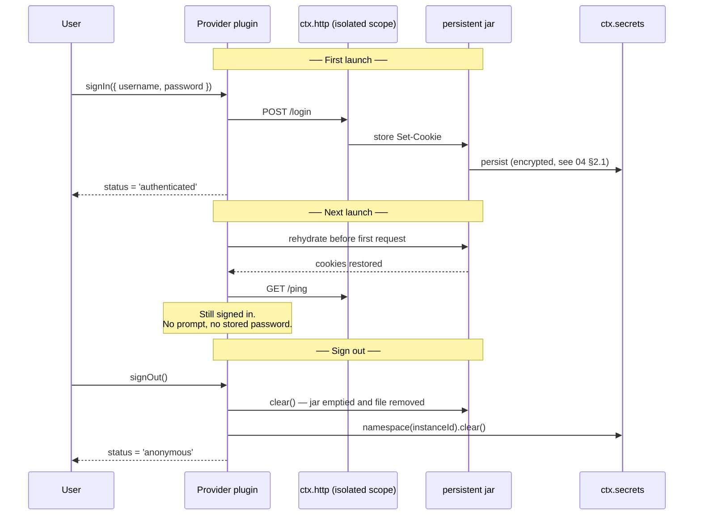
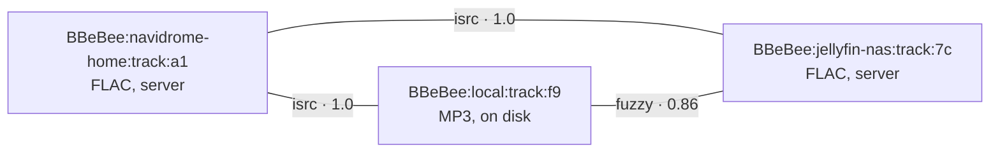

# 06 — Music Sources

> **What this answers.** The provider SPI — the contract every music backend implements. Which
> members are required and which are optional, sign-in and sign-out, how a session is persisted so
> the user stays logged in, search, browse, catalogue lookup, stream resolution, library mutation,
> error handling, and how one track from two providers is reconciled.

This is the most extension-critical contract in the system. It is also the one most exposed to
things outside our control: every backend has a different API, different auth, different
pagination, and a different lifespan. The SPI is designed on the assumption that **providers are
unreliable and unequal**, and that the UI must adapt to what each one can actually do.

---

## 1. The contract

The interface is deliberately split: a **small required core** that every provider must implement,
and a **large optional surface** that providers implement only where the backend supports it.

```ts
import type { Uri, Disposable } from '@BBeBee/protocol'

export interface MediaProvider {
  // ══ REQUIRED ═════════════════════════════════════════════════
  readonly instanceId: string           // 'navidrome-home'
  readonly displayName: string
  readonly capabilities: Capabilities

  /** Sign-in and sign-out. Required of every provider, including
   *  ones that need no credentials — see §1.1 and §4. */
  readonly auth: ProviderAuth

  /** Fetch one track's metadata by provider-local id. */
  getTrack(id: string): Promise<Track>

  /** Turn a track id into something playable. The reason a provider exists. */
  resolveStream(id: string, prefs: StreamPrefs): Promise<StreamHandle>

  /** Cheap reachability check. Drives the "server unreachable" state. */
  ping(): Promise<boolean>

  // ══ OPTIONAL ═════════════════════════════════════════════════
  // Every member below is gated by the matching `capabilities` flag.
  // A provider that omits one must also declare it unsupported, and the
  // UI hides the affordance rather than offering a button that fails.

  // ── Discovery ────────────────────────────────────────────────
  search?(q: SearchQuery, page?: PageRequest): Promise<SearchResult>
  browse?(nodeId?: string, page?: PageRequest): Promise<Paged<BrowseEntry>>

  // ── Catalogue ────────────────────────────────────────────────
  /** Batched lookup. Falls back to N× getTrack when absent, which is slower. */
  getTracks?(ids: string[]): Promise<Track[]>
  getAlbum?(id: string): Promise<AlbumDetail>
  getArtist?(id: string): Promise<ArtistDetail>
  getPlaylist?(id: string, page?: PageRequest): Promise<PlaylistDetail>
  getLyrics?(id: string): Promise<Lyrics | undefined>
  getArtwork?(ref: ArtworkRef, size?: number): Promise<Uri>

  // ── The user's library on this provider ──────────────────────
  library?: ProviderLibrary
}

export interface ProviderLibrary {
  list(kind: 'track' | 'album' | 'artist' | 'playlist', page?: PageRequest): Promise<Paged<LibraryEntry>>
  setSaved(urn: string, saved: boolean): Promise<void>
  createPlaylist(name: string, opts?: { description?: string }): Promise<string>
  addToPlaylist(playlistId: string, trackIds: string[]): Promise<void>
  removeFromPlaylist(playlistId: string, itemIds: string[]): Promise<void>
  reorderPlaylist(playlistId: string, itemId: string, toIndex: number): Promise<void>
  deletePlaylist(playlistId: string): Promise<void>
}
```

Note what the provider does **not** do: it never writes to the database, never touches the audio
graph, and never renders anything. It answers questions and returns plain data. `ctx.sources`
caches the answers into the catalogue tables; `ctx.player` consumes the stream handles.

### 1.1 Why `auth` is required and everything else is not

The optional members are optional because backends genuinely differ: a plain audio URL has no
search, no albums, and no playlists, and forcing it to stub six methods that throw produces a
provider that lies about itself. `capabilities` already carries that information, so the interface
follows it.

`auth` is the exception. It is **required on every provider**, including ones that need no
credentials, for three reasons:

1. **The UI needs one place to look.** Every source gets an account row in settings showing its
   state and a sign-out control. If `auth` were optional, every consumer would branch on its
   presence, and a source that *later* grows authentication becomes a breaking change.
2. **Sign-out has to mean something everywhere.** "Remove this source and forget everything it
   stored" is a user action that must work uniformly — clearing secrets, cookies, and cached
   catalogue rows. A provider without `signOut` would leave residue nothing is responsible for.
3. **`ctx.sources` drives the lifecycle.** Registration, session restoration at boot, and the
   `source/auth-expired` path are all written against `auth`, and they are not written twice.

A provider that needs no credentials declares `flow: { kind: 'none' }` and implements the two
methods trivially — `signIn` resolves immediately and sets `authenticated`; `signOut` clears any
local cache. `plugin-source-local` is exactly this, and it is still four lines.

### Capabilities

Providers are unequal, and the UI must know how. Every optional behaviour is declared, and the
shells hide affordances rather than showing buttons that fail.

```ts
export interface Capabilities {
  search: { tracks: boolean; albums: boolean; artists: boolean; playlists: boolean; fullText: boolean }
  browse: boolean
  lyrics: boolean
  artwork: boolean
  library: {
    read: boolean
    save: boolean
    playlistWrite: boolean
    playlistReorder: boolean
  }
  streaming: {
    /** Quality tiers this provider can serve, best first. */
    qualities: StreamQuality[]
    transcoding: boolean
    /** Byte-range requests — required for seeking within a stream. */
    seekable: boolean
    /** Whether resolved URLs expire and must be re-resolved. */
    urlExpiry: boolean
  }
  /** Requests per window, if the backend documents one. */
  rateLimit?: { requests: number; windowMs: number }
  /** Provider is region-locked; some catalogue may be unavailable. */
  regional: boolean
}

export type StreamQuality = 'low' | 'normal' | 'high' | 'lossless' | 'hi-res'
```

---

## 2. Provider plugins vs. provider instances

A distinction the data model depends on: **one plugin, many instances.**

`@BBeBee/plugin-source-subsonic` is a plugin. A user with a Navidrome server at home and another at
work has *two instances* of it, each with its own base URL, credentials, cookie jar, rate limiter,
cached catalogue, and URN namespace. Meanwhile `@BBeBee/plugin-source-local` is
`instantiable: false` — there is exactly one local filesystem.

Instances are declared in configuration ([03 §6.4](./03-plugin-system.md#64-configuration)) and
each is loaded inside its own isolation scope:

```ts
// plugin-loader — simplified
for (const inst of entry.instances ?? [{ id: pluginId, config: entry.config }]) {
  const scoped = ctx.isolate('http')                  // private cookie jar + rate limiter
  scoped.plugin(HttpStack, { jar: inst.id, rateLimit: caps.rateLimit })
  scoped.plugin(providerModule.default, { ...inst.config, instanceId: inst.id })
}
```

Everything downstream keys on `instanceId`, never on the plugin id. Renaming or removing one
Navidrome server must not disturb the other, and URNs must remain unambiguous — which is exactly
why the URN's second segment is the *instance*
([07 §1](./07-data-model.md#1-identity-the-urn)).

### Registration

```ts
export interface SourcesService {
  register(p: MediaProvider): Disposable
  readonly providers: readonly MediaProvider[]
  get(instanceId: string): MediaProvider | undefined
  /** Resolve a URN to its owning provider. */
  forUrn(urn: string): MediaProvider | undefined
  /** Fan-out search across every provider that supports it. */
  searchAll(q: SearchQuery, opts?: { instanceIds?: string[]; timeoutMs?: number }): Promise<AggregatedSearch>
}

export interface AggregatedSearch {
  /** One entry per provider that was asked — including the ones that failed. */
  byProvider: {
    instanceId: string
    /** Present on success. */
    result?: SearchResult
    /** Present on failure. The provider is reported, never silently dropped. */
    error?: SourceError
    /** True when the provider exceeded `timeoutMs` and is still running. */
    pending: boolean
    tookMs: number
  }[]
}
```

`searchAll` returns per-provider results **with per-provider errors**, never a single merged list
that silently drops a failing backend. The UI shows "Navidrome: 12 results · Jellyfin:
unreachable", which is honest and actionable. Providers that exceed `timeoutMs` are reported as
pending rather than cancelling the whole search.

---

## 3. Pagination and queries

```ts
export interface PageRequest { cursor?: string; limit?: number }

export interface Paged<T> {
  items: T[]
  cursor?: string        // absent means no more
  total?: number         // only when the backend actually knows
  hasMore: boolean
}

export interface SearchQuery {
  text: string
  types?: ('track' | 'album' | 'artist' | 'playlist')[]
  filters?: { genre?: string; yearFrom?: number; yearTo?: number; durationMaxMs?: number }
}

export interface SearchResult {
  tracks?: Paged<Track>
  albums?: Paged<Album>
  artists?: Paged<Artist>
  playlists?: Paged<Playlist>
}
```

Cursors are **opaque strings** owned by the provider — an offset for one backend, a continuation
token for another, a timestamp for a third. Consumers must never parse or synthesise them. `total`
is optional because many backends do not provide it, and inventing one produces progress bars that
lie.

### Browse

`browse` models the hierarchical "explore" surfaces backends expose — genres, decades, charts, new
releases, folder trees for local files — as a uniform tree of nodes.

```ts
export interface BrowseEntry {
  id: string                        // pass back as nodeId to descend
  title: string
  subtitle?: string
  artwork?: ArtworkRef
  kind: 'folder' | 'album' | 'artist' | 'playlist' | 'track' | 'genre'
  /** Present for leaves; absent means "call browse(id) to descend". */
  urn?: string
}
```

A local-files provider returns a directory tree. Navidrome returns genres and years. The UI renders
both with the same component.

---

## 4. Authentication

Auth is declared, not implemented, by the SPI: the provider describes what flow it needs and the
shell drives it, so no provider plugin has to build a login screen.

```ts
export type AuthFlow =
  | { kind: 'none' }
  | { kind: 'password'; fields: { id: string; label: string; secret?: boolean }[] }
  | { kind: 'token'; label: string; helpUrl?: string }
  | { kind: 'oauth-pkce'; authorizeUrl: string; tokenUrl: string; clientId: string; scopes: string[]; redirectUri: string }
  | { kind: 'qrcode'; poll: () => Promise<{ status: 'pending' | 'confirmed' | 'expired'; }> }
  | { kind: 'cookie'; loginUrl: string; requiredCookies: string[] }

export type AuthStatus =
  | { state: 'anonymous' }
  | { state: 'authenticated'; displayName?: string; expiresAt?: number }
  | { state: 'expired' }
  | { state: 'error'; message: string }

export interface ProviderAuth {
  readonly flow: AuthFlow
  readonly status: AuthStatus

  /** REQUIRED. Resolves once `status` is 'authenticated', throws AuthError otherwise. */
  signIn(input: Record<string, string>): Promise<void>

  /**
   * REQUIRED. Must leave nothing behind: clears the instance's secrets namespace,
   * empties and forgets its persisted cookie jar, and resets status to 'anonymous'.
   */
  signOut(): Promise<void>

  refresh?(): Promise<void>
  onStatusChange(cb: (s: AuthStatus) => void): Disposable
}
```

Rules, all non-negotiable:

- **Credentials never land in readable storage.** Tokens go to `ctx.secrets` under
  `namespace(instanceId)`; cookies go to the persisted jar described in §4.1. Never in `ctx.db`
  in plaintext, never in the config file, never in a log line
  ([04 §16](./04-core-services.md#16-ctxlogger--logging-as-transport-plugins)).
- **Refresh is transparent.** The provider hooks `http/request`; on a `401` it refreshes once and
  retries. A concurrent burst of 401s must trigger exactly one refresh — the plugin holds a
  single in-flight refresh promise and every caller awaits it.
- **Expiry is an event, not an error.** When refresh fails, the provider emits
  `source/auth-expired` and sets `status = 'expired'`. `ctx.sources` keeps the instance registered
  so cached content stays browsable; only network calls fail. The UI shows a re-login prompt
  in-place rather than making the source vanish.
- **`oauth-pkce` uses `ctx.shell.openAuthSession`**, which is one call on both platforms
  ([04 §14](./04-core-services.md#14-ctxshell--leaving-the-app)).

### 4.1 Session persistence — cookies survive the app

Signing in once must be enough. Many music backends — anything with a `cookie` flow, and plenty
with a `password` flow that answers with `Set-Cookie` — carry their session entirely in cookies,
so a jar that dies with the process means a login prompt on every launch.

Each provider instance therefore owns a **persistent cookie jar**, keyed by `instanceId` and
supplied by `ctx.http` ([04 §2.1](./04-core-services.md#21-cookie-jars)). The provider does not
manage it: it lives in the instance's isolated `ctx.http` scope
([§2](#2-provider-plugins-vs-provider-instances)), so every request the provider makes sends the
right cookies and every `Set-Cookie` it receives is stored, with no code in the provider at all.



The lifecycle rules:

- **Rehydration happens before the first request, not lazily.** The provider's `[Service.init]`
  awaits `ctx.http.cookies.jar(instanceId).ready` so no request can race an empty jar and get a
  spurious `401` that trips the expiry path.
- **Persistence is per instance.** Two Navidrome servers have two jars that cannot see each
  other's cookies, which follows from the `ctx.isolate('http')` scoping and is not extra work.
- **Cookies are credentials and are stored as such** — encrypted at rest, never in a plaintext
  database column, never in a log line, and excluded from crash-report bundles.
- **`signOut()` must clear the jar.** Emptying it in memory is not enough; the persisted copy is
  deleted. This is the single most commonly missed step, so it is in the checklist in §9 and in
  the conformance suite.
- **Expiry is honoured.** A session cookie with a past `Expires`/`Max-Age` is dropped at
  rehydration rather than replayed, which otherwise produces a confusing "logged in but every
  request fails" state.
- **The user can revoke without signing out.** Settings offers "clear stored session" per
  instance, which clears the jar and secrets while leaving the instance configured.

> ⚠️ A persisted cookie is a bearer credential with the lifetime the server chose, which may be
> months. It is worth the same protection as a password, and the storage design in
> [04 §2.1](./04-core-services.md#21-cookie-jars) treats it that way. It also means "sign out"
> genuinely has to work — a jar left on disk after sign-out is a real security bug, not an
> untidiness.

---

## 5. Stream resolution

The moment a URN becomes bytes.

```ts
export interface StreamPrefs {
  quality: StreamQuality
  /** True when the network is metered; providers should downgrade. */
  saveData: boolean
  /** Formats the platform can decode — from ctx.codec.supportedFormats(). */
  acceptFormats: string[]
}

export interface StreamHandle {
  kind: 'remote' | 'local'
  /** URL for remote, file Uri for local. */
  target: string
  mimeType?: string
  codec?: string
  bitrateKbps?: number
  sampleRate?: number
  /** Byte length when known — enables an accurate buffering indicator. */
  byteLength?: number
  seekable: boolean
  /** Headers required to fetch this stream. May contain credentials. */
  headers?: Record<string, string>
  /** Epoch ms. The player re-resolves before this, and on 403. */
  expiresAt?: number
  /** Reserved. Nothing implements this — see 01, non-goals. */
  drm?: { system: string; licenseUrl: string }
}
```

Handling of the awkward cases:

- **Expiring URLs.** The player re-resolves when `expiresAt` is within 60 seconds, and on a `403`
  mid-stream it re-resolves once and resumes from the current position before surfacing an error.
- **Quality negotiation.** The provider picks the best tier it can serve that is ≤ the requested
  quality **and** in `acceptFormats`. It returns what it actually chose in the handle, so the UI
  can display the real bitrate rather than the requested one.
- **`saveData`.** Set from `ctx.device.network().metered`. Providers that ignore it are not
  broken, but the download policy engine will refuse to start transfers regardless.

---

## 6. Errors

A typed taxonomy, because the player's reaction differs per class and a string message cannot be
branched on.

```ts
export abstract class SourceError extends Error {
  abstract readonly code: string
  abstract readonly retryable: boolean
  constructor(message: string, public readonly instanceId?: string) { super(message) }
}

export class AuthError extends SourceError       { code = 'auth' as const;        retryable = false }
export class RateLimitError extends SourceError  { code = 'rate-limit' as const;  retryable = true
  constructor(message: string, public retryAfterMs: number, instanceId?: string) { super(message, instanceId) } }
export class UnavailableError extends SourceError{ code = 'unavailable' as const; retryable = false }
export class NotFoundError extends SourceError   { code = 'not-found' as const;   retryable = false }
export class NetworkError extends SourceError    { code = 'network' as const;     retryable = true }
export class ProviderError extends SourceError   { code = 'provider' as const;    retryable = false }
```

| Error | What `ctx.player` does | What the UI shows |
|---|---|---|
| `AuthError` | Stop. Emit `source/auth-expired` | In-place re-login prompt on that source |
| `RateLimitError` | Wait `retryAfterMs`, retry once, then skip | Silent unless it repeats |
| `UnavailableError` | **Try `track_links` for the same recording elsewhere** (§7); skip if none | "Unavailable on <source>", with the alternative offered if one exists |
| `NotFoundError` | Skip. Mark `tracks.available = 0` | Track greyed out in lists |
| `NetworkError` | Exponential backoff, 3 attempts, then pause | "Offline" banner; queue preserved |
| `ProviderError` | Skip, log with the provider's raw payload | Generic error with a "copy details" action |

An error is never allowed to clear the queue. Every failure path preserves the user's queue so that
regaining connectivity means pressing play, not rebuilding what they were listening to.

---

## 7. Cross-provider identity and failover

The same recording may exist on several providers, and on disk. They are **different entities with
different URNs**, related by rows in `track_links`.



Links are produced by a matching pipeline, best evidence first:

| Method | Confidence | Basis |
|---|---|---|
| `isrc` | 1.00 | Exact ISRC match |
| `mbid` | 1.00 | MusicBrainz recording id |
| `acoustid` | 0.95 | Acoustic fingerprint (optional plugin; not shipped by default) |
| `fuzzy` | 0.70–0.90 | Normalised title + artist + duration within 2 s |
| `manual` | 1.00 | The user said so. Never overwritten by automation |

Two things use links:

1. **Failover** — an `UnavailableError` sends the resolver to linked URNs, ordered by
   confidence then by user preference (local first by default). Handled inside the
   `player/before-resolve` waterfall, so it is a plugin
   (`plugin-source-failover`) and can be removed.
2. **Library dedup** — the unified library collapses linked URNs into one row above a confidence
   threshold, displaying the best available copy while remembering all of them.

> ⚠️ Fuzzy matching is wrong sometimes — live versions, remasters, and radio edits share titles,
> artists, and near-identical durations. Anything below 1.00 confidence is treated as a *hint*:
> used for failover, shown in the UI as "also available on…", but never used to silently merge
> library entries. Merging on a bad guess makes a user's library wrong in a way that is very hard
> for them to diagnose.

---

## 8. Reference implementations

Per [01, non-goals](./01-overview.md#non-goals): open protocols only, but the SPI is designed so a
third party can implement anything.

| Plugin | Protocol | Exercises |
|---|---|---|
| `plugin-source-local` | Filesystem via `ctx.fs` + `ctx.codec` | `instantiable: false`, folder `browse`, `flow: 'none'` auth, `kind: 'local'` handles, FTS5 search |
| `plugin-source-subsonic` | Subsonic API (Navidrome, Airsonic, Gonic) | Multi-instance, `password` auth with salted-token scheme, transcoding, playlist write |
| `plugin-source-jellyfin` | Jellyfin | `token` auth, **cookie-backed session persistence**, rich browse, quality tiers |
| `plugin-source-http-url` | A plain audio URL or podcast feed | The SPI's floor — implements only the required core (§1) and omits every optional member |

Two of these exist to prove the shape of the contract rather than to be featureful:

- **`plugin-source-local`** is a provider like any other, so the local library is not privileged. It
  goes through the same resolve path and the same URN scheme; only `resolveStream` differs, in that
  it returns `kind: 'local'` immediately. Its `auth` is the trivial `flow: 'none'` implementation
  from [§1.1](#11-why-auth-is-required-and-everything-else-is-not) — which is precisely the case
  that proves requiring `auth` costs nothing.
- **`plugin-source-http-url`** implements the required core and *nothing* else: no `search`, no
  `browse`, no `getAlbum`, no `library`. It is the regression test for the optional surface — if
  the app misbehaves with it configured, some consumer is calling an optional method without
  checking `capabilities`.

### The local scanner

`plugin-local-scanner` is separate from `plugin-source-local` because scanning is a different
concern from serving. It walks `scan_roots` via `ctx.fs.list`, and for each file whose
`(size, mtime)` differs from the recorded `scan_entries` row, calls `ctx.codec.readMetadata`,
extracts artwork, and writes catalogue rows.

- **Incremental.** Unchanged files are skipped by stat comparison alone; a rescan of an unchanged
  100k-file library costs stat calls and nothing else.
- **Interruptible.** Runs in batches with an `AbortSignal`, checkpointing after each batch, so a
  suspend mid-scan costs one batch.
- **Honest about failures.** A file that fails to decode gets `scan_entries.status = 'error'` with
  the reason, surfaced in a "could not import" list rather than silently vanishing.
- **Watching where possible.** `ctx.fs.watch` on desktop; interval polling on mobile, where the
  API does not exist ([04 §1](./04-core-services.md#1-ctxfs--virtual-filesystem)).

---

## 9. Writing a provider: checklist

**The required core (§1)**

- [ ] `auth.signIn` and `auth.signOut` implemented — trivially if `flow: 'none'`, but implemented.
- [ ] `getTrack`, `resolveStream`, and `ping()` present; `ping()` is cheap and does not count
      against a rate limit.
- [ ] `resolveStream` sets `expiresAt` if URLs expire, and honours `saveData`.

**Optional members**

- [ ] `capabilities` matches exactly which optional members are implemented — under-declaring
      degrades the UI, over-declaring breaks it.
- [ ] No optional member is a stub that throws. Omit it instead.
- [ ] `getTracks` batches rather than looping `getTrack` — or is omitted so the fallback is used.

**Session and credentials**

- [ ] All network calls through `ctx.http` inside the isolated scope, never a bare `fetch`, so the
      instance's cookie jar is applied automatically.
- [ ] `[Service.init]` awaits `ctx.http.cookies.jar(instanceId).ready` before its first request.
- [ ] `signOut()` clears the cookie jar **and** the secrets namespace — verified by re-launching
      and confirming the user is signed out ([§4.1](#41-session-persistence--cookies-survive-the-app)).
- [ ] Auth hooks `http/request` for injection; exactly one in-flight refresh.
- [ ] No cookie, token, or password reaches a log line or a crash bundle.

**General**

- [ ] `instanceId` used for every URN, cache key, secret namespace, jar name, and log scope.
- [ ] Errors mapped onto the §6 taxonomy — never a raw `Error`.
- [ ] Cursors opaque; `total` omitted unless the backend really provides it.
- [ ] Registration returned as a disposer so sign-out unregisters cleanly.

---

## 10. Where to go next

[07 — Data Model](./07-data-model.md) defines the URN scheme, every table these providers populate,
and the full event map.
