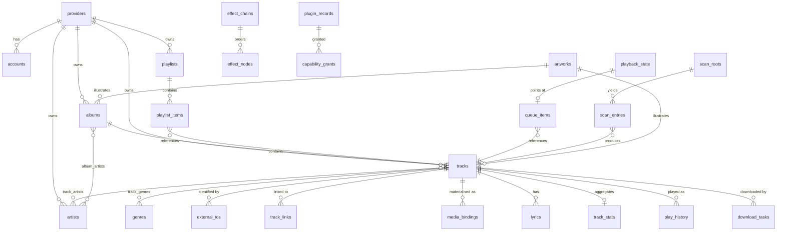

# 07 — Data Model

> **What this answers.** How entities are identified, every table that exists and why, the runtime
> types that are deliberately *not* persisted, the complete typed event map, and how schemas
> migrate — including schemas owned by plugins.

Everything here lives in one SQLite database behind
[`ctx.db`](./04-core-services.md#5-ctxdb--sql), identical on both platforms.

---

## 1. Identity: the URN

```
BBeBee:<providerInstance>:<kind>:<id>
       │                  │       └── provider-local id, opaque, never parsed
       │                  └────────── track | album | artist | playlist | genre
       └───────────────────────────── instance id, not plugin id (06 §2)
```

Examples:

```
BBeBee:local:track:9f2c8a1e
BBeBee:navidrome-home:album:41af02
BBeBee:jellyfin-nas:playlist:7c11
```

### Why the instance, not the plugin

Two Navidrome servers are two namespaces. If the URN keyed on the plugin, ids would collide the
moment a user added a second server, and removing one server would corrupt the other's rows.

### Why the same song is several rows

A FLAC on a Navidrome server and an MP3 of the same recording on disk are **two rows with two
URNs**, joined by a `track_links` row — not one merged row.

This is the single most consequential modelling decision in the document, so the reasoning is
worth stating:

- They genuinely differ in the ways that matter — bitrate, availability, duration to the
  millisecond, artwork, whether they can be seeked.
- Merging requires deciding *which* metadata wins, and any such decision is wrong for some user.
- Un-merging after a bad automatic match is far harder than merging on demand, and fuzzy matching
  is wrong often enough to guarantee bad matches
  ([06 §7](./06-music-sources.md#7-cross-provider-identity-and-failover)).
- A provider removed from the app should take exactly its own rows with it.

The unified library presents linked tracks as one item at *display* time. Storage stays faithful.

### URN helpers

```ts
export interface Urn { instanceId: string; kind: UrnKind; id: string }
export type UrnKind = 'track' | 'album' | 'artist' | 'playlist' | 'genre'

export function parseUrn(urn: string): Urn
export function formatUrn(u: Urn): string
export function instanceOf(urn: string): string
```

`parseUrn` splits on the first three colons only, so provider-local ids may contain colons.

---

## 2. Entity–relationship overview



---

## 3. Conventions

- SQLite with `journal_mode = WAL`, `foreign_keys = ON`, `synchronous = NORMAL`.
- Timestamps are **epoch milliseconds** as `INTEGER`. No date strings, no timezones stored.
- Booleans are `INTEGER` 0/1.
- JSON columns are `TEXT` holding JSON, named with a `_json` suffix.
- Every table that mirrors remote data carries `fetched_at`, so staleness is answerable.
- Foreign keys to catalogue rows are URN `TEXT`, not integer ids — an id from a provider is
  meaningless without its instance, and joining on URNs keeps that impossible to get wrong.
- `ON DELETE CASCADE` wherever a child cannot exist alone; explicit cleanup where it can.

---

## 4. Tables

### 4.1 Providers, accounts, and sessions

```sql
CREATE TABLE providers (
  instance_id   TEXT PRIMARY KEY,          -- 'navidrome-home'
  plugin_id     TEXT NOT NULL,             -- '@BBeBee/plugin-source-subsonic'
  display_name  TEXT NOT NULL,
  enabled       INTEGER NOT NULL DEFAULT 1,
  capabilities_json TEXT,                  -- last-known Capabilities (06 §1)
  sort_order    INTEGER NOT NULL DEFAULT 0,
  created_at    INTEGER NOT NULL,
  last_seen_at  INTEGER                    -- last successful ping()
);

CREATE TABLE accounts (
  instance_id    TEXT PRIMARY KEY REFERENCES providers(instance_id) ON DELETE CASCADE,
  remote_user_id TEXT,
  display_name   TEXT,
  status         TEXT NOT NULL,            -- anonymous|authenticated|expired|error
  expires_at     INTEGER,
  updated_at     INTEGER NOT NULL
);

-- Mobile only. Desktop keeps cookies in Chromium's own persisted partition
-- and never writes this table. See 04 §2.1.
CREATE TABLE cookie_jars (
  name        TEXT PRIMARY KEY,            -- the provider instance_id
  ciphertext  BLOB NOT NULL,               -- AES-GCM over the serialised jar
  iv          BLOB NOT NULL,
  key_ref     TEXT NOT NULL,               -- ctx.secrets key holding the AES key
  updated_at  INTEGER NOT NULL
);
```

> **No readable credential is ever in this database.** Tokens and passwords live in `ctx.secrets`
> under `namespace(instanceId)`. Cookies are also credentials, but a real session jar exceeds
> `expo-secure-store`'s 2048-byte value limit, so mobile stores them **envelope-encrypted**: the
> AES key (small) in `ctx.secrets`, the ciphertext (unbounded) in `cookie_jars`. The invariant is
> preserved — the key and the ciphertext are never in the same store, and a leaked database file
> yields nothing ([04 §2.1](./04-core-services.md#21-cookie-jars),
> [04 §6](./04-core-services.md#6-ctxsecrets--credential-storage)).
>
> `accounts` records only that a session exists and when it lapses. Deleting a provider cascades
> to `accounts`; `signOut()` is separately responsible for clearing `cookie_jars` and the secrets
> namespace, because those are outside SQLite's cascade
> ([06 §4.1](./06-music-sources.md#41-session-persistence--cookies-survive-the-app)).

### 4.2 Artwork

Referenced by several tables, so it comes first.

```sql
CREATE TABLE artworks (
  id             TEXT PRIMARY KEY,          -- content hash when local, else derived from source_url
  source_url     TEXT,
  local_uri      TEXT,                      -- populated once cached
  width          INTEGER,
  height         INTEGER,
  blurhash       TEXT,                      -- instant placeholder, no layout shift
  dominant_color TEXT,                      -- '#RRGGBB', drives adaptive player theming
  bytes          INTEGER,
  fetched_at     INTEGER
);
CREATE INDEX idx_artworks_local ON artworks(local_uri) WHERE local_uri IS NOT NULL;
```

`blurhash` and `dominant_color` are computed once at cache time rather than per render, because
doing it in the UI costs a frame on every list scroll.

### 4.3 Catalogue

```sql
CREATE TABLE artists (
  urn          TEXT PRIMARY KEY,
  instance_id  TEXT NOT NULL REFERENCES providers(instance_id) ON DELETE CASCADE,
  remote_id    TEXT NOT NULL,
  name         TEXT NOT NULL,
  sort_name    TEXT,
  artwork_id   TEXT REFERENCES artworks(id),
  bio          TEXT,
  fetched_at   INTEGER NOT NULL,
  raw_json     TEXT
);
CREATE INDEX idx_artists_instance ON artists(instance_id);
CREATE INDEX idx_artists_sort ON artists(sort_name);

CREATE TABLE albums (
  urn           TEXT PRIMARY KEY,
  instance_id   TEXT NOT NULL REFERENCES providers(instance_id) ON DELETE CASCADE,
  remote_id     TEXT NOT NULL,
  title         TEXT NOT NULL,
  sort_title    TEXT,
  album_type    TEXT,                       -- album|single|ep|compilation|live|soundtrack
  release_date  TEXT,                       -- ISO-8601, possibly partial ('1997', '1997-04')
  year          INTEGER,                    -- derived, for cheap sorting and filtering
  track_count   INTEGER,
  disc_count    INTEGER,
  artwork_id    TEXT REFERENCES artworks(id),
  is_various    INTEGER NOT NULL DEFAULT 0,
  fetched_at    INTEGER NOT NULL,
  raw_json      TEXT
);
CREATE INDEX idx_albums_instance ON albums(instance_id);
CREATE INDEX idx_albums_year ON albums(year);

CREATE TABLE tracks (
  urn                TEXT PRIMARY KEY,
  instance_id        TEXT NOT NULL REFERENCES providers(instance_id) ON DELETE CASCADE,
  remote_id          TEXT NOT NULL,
  title              TEXT NOT NULL,
  sort_title         TEXT,
  album_urn          TEXT REFERENCES albums(urn) ON DELETE SET NULL,
  track_no           INTEGER,
  disc_no            INTEGER,
  duration_ms        INTEGER,
  year               INTEGER,
  explicit           INTEGER NOT NULL DEFAULT 0,
  bpm                REAL,
  replay_gain_track  REAL,
  replay_gain_album  REAL,
  peak_track         REAL,
  available          INTEGER NOT NULL DEFAULT 1,   -- cleared on NotFoundError
  qualities_json     TEXT,                          -- StreamQuality[]
  artwork_id         TEXT REFERENCES artworks(id),
  fetched_at         INTEGER NOT NULL,
  raw_json           TEXT
);
CREATE INDEX idx_tracks_album ON tracks(album_urn, disc_no, track_no);
CREATE INDEX idx_tracks_instance ON tracks(instance_id);
CREATE INDEX idx_tracks_title ON tracks(sort_title);

CREATE TABLE track_artists (
  track_urn  TEXT NOT NULL REFERENCES tracks(urn) ON DELETE CASCADE,
  artist_urn TEXT NOT NULL REFERENCES artists(urn) ON DELETE CASCADE,
  role       TEXT NOT NULL DEFAULT 'main',   -- main|featured|composer|remixer|conductor
  ordinal    INTEGER NOT NULL DEFAULT 0,
  PRIMARY KEY (track_urn, artist_urn, role)
);
CREATE INDEX idx_track_artists_artist ON track_artists(artist_urn);

CREATE TABLE album_artists (
  album_urn  TEXT NOT NULL REFERENCES albums(urn) ON DELETE CASCADE,
  artist_urn TEXT NOT NULL REFERENCES artists(urn) ON DELETE CASCADE,
  ordinal    INTEGER NOT NULL DEFAULT 0,
  PRIMARY KEY (album_urn, artist_urn)
);

CREATE TABLE genres (
  id   TEXT PRIMARY KEY,                     -- normalised, lowercase
  name TEXT NOT NULL
);

CREATE TABLE track_genres (
  track_urn TEXT NOT NULL REFERENCES tracks(urn) ON DELETE CASCADE,
  genre_id  TEXT NOT NULL REFERENCES genres(id) ON DELETE CASCADE,
  PRIMARY KEY (track_urn, genre_id)
);
```

`track_artists` is a join with a `role` rather than an artist string, because "Artist feat. Other"
as free text makes the featured artist unbrowsable — one of the most common data-model mistakes in
music apps.

**Full-text search** over the local catalogue, available identically on both platforms:

```sql
CREATE VIRTUAL TABLE tracks_fts USING fts5(
  title, artist_names, album_title,
  content='', contentless_delete=1,          -- contentless; we manage rows explicitly
  tokenize='unicode61 remove_diacritics 2'
);

-- FTS5 addresses rows by integer rowid; the catalogue is keyed by URN.
CREATE TABLE tracks_fts_map (
  rowid INTEGER PRIMARY KEY AUTOINCREMENT,
  urn   TEXT NOT NULL UNIQUE REFERENCES tracks(urn) ON DELETE CASCADE
);
CREATE INDEX idx_tracks_fts_map_urn ON tracks_fts_map(urn);
```

Diacritic folding is on deliberately: a user typing `bjork` must find `Björk`.

> ⚠️ **`contentless_delete=1` is not optional.** A plain `content=''` table
> rejects `DELETE` and `UPDATE` outright ("cannot DELETE from contentless fts5 table"), so a
> renamed or removed track would keep its index row forever and searches would return stale hits
> with no remedy short of a full rebuild. Requires SQLite ≥ 3.43, which both Node 22.12+ and
> Electron 44 ship.
>
> Even with the flag, a **partial** `UPDATE` is refused — the whole row must be rewritten. Re-index
> as `DELETE` + `INSERT` on the same rowid.

External-content FTS (`content='tracks'`) would remove the need for the mapping table, but is not
usable here: `artist_names` is an aggregate over `track_artists`, not a column of `tracks`.

### 4.4 Identity linking

```sql
CREATE TABLE external_ids (
  urn       TEXT NOT NULL,
  namespace TEXT NOT NULL,                   -- isrc|mbid|upc|acoustid|discogs
  value     TEXT NOT NULL,
  PRIMARY KEY (urn, namespace, value)
);
CREATE INDEX idx_external_lookup ON external_ids(namespace, value);

CREATE TABLE track_links (
  urn_a      TEXT NOT NULL,
  urn_b      TEXT NOT NULL,
  confidence REAL NOT NULL,                  -- 0..1, see 06 §7
  method     TEXT NOT NULL,                  -- isrc|mbid|acoustid|fuzzy|manual
  created_at INTEGER NOT NULL,
  PRIMARY KEY (urn_a, urn_b),
  CHECK (urn_a < urn_b)                      -- canonical order: store each pair once
);
CREATE INDEX idx_links_b ON track_links(urn_b);
```

The `CHECK (urn_a < urn_b)` constraint is what keeps the relation symmetric without storing it
twice or risking the two directions disagreeing. Lookups query both columns.

### 4.5 Local media

```sql
CREATE TABLE media_bindings (
  id           TEXT PRIMARY KEY,
  track_urn    TEXT NOT NULL REFERENCES tracks(urn) ON DELETE CASCADE,
  uri          TEXT NOT NULL,                -- ctx.fs Uri, never a raw path
  format       TEXT,                         -- 'flac', 'mp3', 'm4a'
  codec        TEXT,
  bitrate_kbps INTEGER,
  sample_rate  INTEGER,
  channels     INTEGER,
  bit_depth    INTEGER,
  size_bytes   INTEGER,
  checksum     TEXT,                         -- sha256, for integrity checks
  origin       TEXT NOT NULL,                -- download|scan|import
  quality      TEXT,                         -- StreamQuality this satisfies
  verified_at  INTEGER,                      -- last time the file was confirmed present
  created_at   INTEGER NOT NULL
);
CREATE INDEX idx_bindings_track ON media_bindings(track_urn);
CREATE UNIQUE INDEX idx_bindings_uri ON media_bindings(uri);
```

**A binding is what "downloaded" means.** There is no `is_downloaded` flag anywhere. The
`player/before-resolve` waterfall asks whether a binding exists, and if it does, plays it
([05 §2](./05-audio-playback.md#resolution-pipeline)). One track may have several bindings — a
scanned local copy and a downloaded higher-quality one — and the resolver picks by quality.

`verified_at` exists because files disappear: an SD card is removed, a sync tool deletes a folder,
iOS evicts something. A binding whose file is missing is deleted rather than left to fail at play
time.

```sql
CREATE TABLE scan_roots (
  id            TEXT PRIMARY KEY,
  uri           TEXT NOT NULL UNIQUE,
  recursive     INTEGER NOT NULL DEFAULT 1,
  enabled       INTEGER NOT NULL DEFAULT 1,
  include_globs TEXT,                        -- JSON array
  exclude_globs TEXT,
  last_scan_at  INTEGER,
  last_error    TEXT
);

CREATE TABLE scan_entries (
  uri        TEXT PRIMARY KEY,
  root_id    TEXT NOT NULL REFERENCES scan_roots(id) ON DELETE CASCADE,
  size       INTEGER NOT NULL,
  mtime      INTEGER NOT NULL,
  track_urn  TEXT REFERENCES tracks(urn) ON DELETE SET NULL,
  status     TEXT NOT NULL,                  -- ok|error|skipped|pending
  error      TEXT,
  scanned_at INTEGER NOT NULL
);
CREATE INDEX idx_scan_entries_root ON scan_entries(root_id, status);
```

`(size, mtime)` is the incremental-scan key: unchanged files cost one `stat` and nothing more
([06 §8](./06-music-sources.md#the-local-scanner)).

### 4.6 Playlists and library

```sql
CREATE TABLE playlists (
  urn          TEXT PRIMARY KEY,             -- local ones use instance 'local'
  instance_id  TEXT REFERENCES providers(instance_id) ON DELETE CASCADE,
  remote_id    TEXT,
  name         TEXT NOT NULL,
  description  TEXT,
  artwork_id   TEXT REFERENCES artworks(id),
  owner        TEXT,
  is_public    INTEGER NOT NULL DEFAULT 0,
  is_smart     INTEGER NOT NULL DEFAULT 0,
  smart_query_json TEXT,                     -- rule tree; see below
  track_count  INTEGER,
  duration_ms  INTEGER,
  revision     INTEGER NOT NULL DEFAULT 0,   -- bumped on every local edit
  remote_revision TEXT,                      -- provider's etag/version, for conflict detection
  sync_state   TEXT NOT NULL DEFAULT 'clean',-- clean|dirty|conflict
  created_at   INTEGER NOT NULL,
  updated_at   INTEGER NOT NULL
);

CREATE TABLE playlist_items (
  id           TEXT PRIMARY KEY,
  playlist_urn TEXT NOT NULL REFERENCES playlists(urn) ON DELETE CASCADE,
  position     TEXT NOT NULL,                -- fractional index; see below
  track_urn    TEXT NOT NULL,
  added_at     INTEGER NOT NULL,
  added_by     TEXT,
  note         TEXT
);
CREATE INDEX idx_playlist_items ON playlist_items(playlist_urn, position);
```

**`position` is a fractional index (LexoRank-style string), not an integer.** Moving one track in a
5,000-track playlist writes exactly one row — a new key strictly between its neighbours — instead
of renumbering everything after it. Integer positions make drag-to-reorder O(n) writes, which is
visibly slow on a phone and generates enormous sync deltas. A rare rebalance pass runs when keys
grow past a length threshold.

**Smart playlists** store a rule tree compiled to SQL at query time:

```ts
export type SmartRule =
  | { op: 'and' | 'or'; rules: SmartRule[] }
  | { op: 'not'; rule: SmartRule }
  | { field: SmartField; cmp: 'eq'|'neq'|'gt'|'lt'|'contains'|'startsWith'|'inLast'; value: string | number }

export type SmartField =
  | 'title' | 'artist' | 'album' | 'genre' | 'year' | 'bpm' | 'durationMs'
  | 'playCount' | 'skipCount' | 'lastPlayedAt' | 'addedAt' | 'rating' | 'loved'
  | 'hasBinding' | 'instanceId' | 'quality'

export interface SmartPlaylist { rules: SmartRule; limit?: number; orderBy?: SmartField; desc?: boolean }
```

Compilation is to **parameterised SQL only** — field names map through a fixed allowlist, values
are always bound. A rule tree from a plugin or an imported playlist is untrusted input.

```sql
CREATE TABLE library_items (
  urn         TEXT PRIMARY KEY,
  kind        TEXT NOT NULL,                 -- track|album|artist|playlist
  instance_id TEXT NOT NULL,
  added_at    INTEGER NOT NULL,
  pinned      INTEGER NOT NULL DEFAULT 0,
  sort_key    TEXT
);
CREATE INDEX idx_library_kind ON library_items(kind, added_at DESC);

CREATE TABLE collections (
  id         TEXT PRIMARY KEY,
  parent_id  TEXT REFERENCES collections(id) ON DELETE CASCADE,
  name       TEXT NOT NULL,
  position   TEXT NOT NULL,
  created_at INTEGER NOT NULL
);

CREATE TABLE collection_items (
  collection_id TEXT NOT NULL REFERENCES collections(id) ON DELETE CASCADE,
  urn           TEXT NOT NULL,
  position      TEXT NOT NULL,
  PRIMARY KEY (collection_id, urn)
);
```

### 4.7 Playback

```sql
CREATE TABLE queue_items (
  id                  TEXT PRIMARY KEY,
  position            TEXT NOT NULL,          -- fractional index, as playlists
  track_urn           TEXT NOT NULL,
  source_context_json TEXT,                   -- QueueItem['sourceContext']
  added_by            TEXT NOT NULL,          -- user|autoplay|radio
  added_at            INTEGER NOT NULL
);
CREATE INDEX idx_queue_position ON queue_items(position);

CREATE TABLE playback_state (
  id               INTEGER PRIMARY KEY CHECK (id = 1),   -- singleton
  current_item_id  TEXT REFERENCES queue_items(id) ON DELETE SET NULL,
  position_ms      INTEGER NOT NULL DEFAULT 0,
  repeat_mode      TEXT NOT NULL DEFAULT 'off',
  shuffle          INTEGER NOT NULL DEFAULT 0,
  shuffle_seed     INTEGER,                   -- stable permutation; see 05 §2
  volume           REAL NOT NULL DEFAULT 1.0,
  muted            INTEGER NOT NULL DEFAULT 0,
  output_device_id TEXT,
  device_id        TEXT NOT NULL,             -- which device wrote this; for future sync
  updated_at       INTEGER NOT NULL
);

CREATE TABLE play_history (
  id             TEXT PRIMARY KEY,
  track_urn      TEXT NOT NULL,
  started_at     INTEGER NOT NULL,
  ended_at       INTEGER,
  ms_played      INTEGER NOT NULL DEFAULT 0,
  completed      INTEGER NOT NULL DEFAULT 0,  -- reached the end
  skipped        INTEGER NOT NULL DEFAULT 0,
  source_json    TEXT,
  device_id      TEXT,
  scrobble_state TEXT NOT NULL DEFAULT 'none' -- none|pending|sent|failed
);
CREATE INDEX idx_history_track ON play_history(track_urn, started_at DESC);
CREATE INDEX idx_history_time ON play_history(started_at DESC);
CREATE INDEX idx_history_scrobble ON play_history(scrobble_state) WHERE scrobble_state = 'pending';

CREATE TABLE track_stats (
  urn            TEXT PRIMARY KEY,
  play_count     INTEGER NOT NULL DEFAULT 0,
  skip_count     INTEGER NOT NULL DEFAULT 0,
  last_played_at INTEGER,
  rating         INTEGER,                     -- 0..5, NULL = unrated
  loved          INTEGER NOT NULL DEFAULT 0
);
```

`play_history` is the append-only truth; `track_stats` is a derived cache updated in the same
transaction as the history insert. Keeping both means "most played" is a single indexed read while
the raw record remains available for recomputation — and `scrobble_state` gives offline scrobbles
a durable outbox that survives a kill mid-submit.

### 4.8 Downloads

```sql
CREATE TABLE download_tasks (
  id            TEXT PRIMARY KEY,
  track_urn     TEXT NOT NULL,
  target_uri    TEXT NOT NULL,
  state         TEXT NOT NULL,                -- queued|running|paused|done|failed|canceled
  quality       TEXT,
  bytes_done    INTEGER NOT NULL DEFAULT 0,
  bytes_total   INTEGER,
  etag          TEXT,
  resume_token  TEXT,
  priority      INTEGER NOT NULL DEFAULT 0,
  attempts      INTEGER NOT NULL DEFAULT 0,
  last_error    TEXT,
  binding_id    TEXT REFERENCES media_bindings(id) ON DELETE SET NULL,
  policy_id     TEXT REFERENCES download_policies(id) ON DELETE SET NULL,
  created_at    INTEGER NOT NULL,
  updated_at    INTEGER NOT NULL,
  finished_at   INTEGER
);
CREATE INDEX idx_downloads_state ON download_tasks(state, priority DESC, created_at);
CREATE UNIQUE INDEX idx_downloads_track ON download_tasks(track_urn) WHERE state != 'done';

CREATE TABLE download_policies (
  id             TEXT PRIMARY KEY,
  name           TEXT NOT NULL,
  enabled        INTEGER NOT NULL DEFAULT 1,
  scope_json     TEXT NOT NULL,               -- SmartRule: what to auto-download
  quality        TEXT NOT NULL,
  wifi_only      INTEGER NOT NULL DEFAULT 1,
  max_bytes      INTEGER,
  charging_only  INTEGER NOT NULL DEFAULT 0,
  created_at     INTEGER NOT NULL
);
```

`bytes_done` and `resume_token` are written after **every chunk**, not at completion — this is what
makes the mobile suspension model in
[02 §4](./02-architecture.md#4-what-background-means) survivable. On boot, tasks left in `running`
are reset to `queued`; they resume from `bytes_done` with a `Range` request, validating `etag`
first so a changed remote file restarts cleanly rather than producing a corrupt splice.

The partial unique index enforces one active task per track without blocking re-downloads later.

### 4.9 DSP and settings

```sql
CREATE TABLE effect_chains (
  id         TEXT PRIMARY KEY,
  name       TEXT NOT NULL,
  is_active  INTEGER NOT NULL DEFAULT 0,
  scope      TEXT NOT NULL DEFAULT 'global',  -- global|output:<id>|source:<instanceId>
  created_at INTEGER NOT NULL
);
CREATE UNIQUE INDEX idx_chain_active ON effect_chains(scope) WHERE is_active = 1;

CREATE TABLE effect_nodes (
  chain_id    TEXT NOT NULL REFERENCES effect_chains(id) ON DELETE CASCADE,
  effect_id   TEXT NOT NULL,                  -- EffectDefinition.id
  ordinal     INTEGER NOT NULL,
  enabled     INTEGER NOT NULL DEFAULT 1,
  params_json TEXT NOT NULL DEFAULT '{}',
  PRIMARY KEY (chain_id, effect_id)
);
CREATE INDEX idx_effect_order ON effect_nodes(chain_id, ordinal);

CREATE TABLE presets (
  id        TEXT PRIMARY KEY,
  effect_id TEXT NOT NULL,
  name      TEXT NOT NULL,
  params_json TEXT NOT NULL,
  builtin   INTEGER NOT NULL DEFAULT 0
);

CREATE TABLE settings (
  key        TEXT NOT NULL,                   -- 'plugin:@BBeBee/plugin-player/crossfadeMs'
  scope      TEXT NOT NULL DEFAULT 'global',  -- global|device|profile
  value_json TEXT NOT NULL,
  updated_at INTEGER NOT NULL,
  PRIMARY KEY (key, scope)
);
```

Settings keys are namespaced by plugin id so two plugins cannot collide, and `scope` distinguishes
what should follow the user (`global`) from what is genuinely per-machine (`device`) — output
device selection should not sync to a phone.

### 4.10 Plugins

```sql
CREATE TABLE plugin_records (
  id           TEXT PRIMARY KEY,              -- package id
  version      TEXT NOT NULL,
  source       TEXT NOT NULL,                 -- bundled|local|registry
  enabled      INTEGER NOT NULL DEFAULT 1,
  config_json  TEXT,
  install_uri  TEXT,
  integrity    TEXT,                          -- sha256 of the loaded bundle
  installed_at INTEGER NOT NULL,
  updated_at   INTEGER NOT NULL,
  last_error   TEXT,
  fail_count   INTEGER NOT NULL DEFAULT 0     -- 2 consecutive → quarantine (03 §6.2)
);

CREATE TABLE capability_grants (
  plugin_id  TEXT NOT NULL REFERENCES plugin_records(id) ON DELETE CASCADE,
  capability TEXT NOT NULL,                   -- 'net:host/*.example.com'
  granted_at INTEGER NOT NULL,
  granted_by TEXT NOT NULL DEFAULT 'user',    -- user|bundled
  PRIMARY KEY (plugin_id, capability)
);
```

### 4.11 Lyrics and cache

```sql
CREATE TABLE lyrics (
  track_urn   TEXT NOT NULL,
  instance_id TEXT NOT NULL,                  -- who provided them
  format      TEXT NOT NULL,                  -- lrc|ttml|plain
  content     TEXT NOT NULL,
  synced      INTEGER NOT NULL DEFAULT 0,
  offset_ms   INTEGER NOT NULL DEFAULT 0,     -- user-adjustable timing nudge
  language    TEXT,
  is_preferred INTEGER NOT NULL DEFAULT 0,    -- user's pick when several exist
  fetched_at  INTEGER NOT NULL,
  PRIMARY KEY (track_urn, instance_id, language)
);

CREATE TABLE cache_entries (
  key            TEXT PRIMARY KEY,            -- 'artwork:<id>@512', 'http:<sha256>'
  class          TEXT NOT NULL,               -- artwork|http|stream|codec
  uri            TEXT NOT NULL,
  size_bytes     INTEGER NOT NULL,
  last_access_at INTEGER NOT NULL,
  expires_at     INTEGER,
  created_at     INTEGER NOT NULL
);
CREATE INDEX idx_cache_evict ON cache_entries(class, last_access_at);
```

Eviction is LRU **within a class**, each with its own quota, because the classes have very
different value: evicting artwork costs a re-fetch and a visible flicker; evicting a partially
downloaded stream costs the user their place. Defaults — artwork 512 MB desktop / 128 MB mobile,
HTTP 64 MB, stream cache 1 GB / 256 MB — all user-adjustable. A sweep runs on boot and hourly, and
`cache_entries` rows whose file is gone are pruned in the same pass.

---

## 5. The event map

Declared once in `@BBeBee/protocol` by augmenting Cordis's `Events` interface. The dispatch mode is
part of the contract: it determines whether a listener can block, transform, or veto.

```ts
declare module 'cordis' {
  interface Events {
    // player — emit
    'player/state-changed'(state: TransportState): void
    'player/track-changed'(trackUrn: string | undefined, previous?: string): void
    'player/position'(positionMs: number, durationMs: number): void
    'player/track-completed'(play: PlayRecord): void
    'player/error'(error: SourceError, trackUrn: string): void

    // player — waterfall (interception points)
    'player/before-resolve'(urn: string, prefs: StreamPrefs, next: () => Promise<StreamHandle>): Promise<StreamHandle>
    'player/before-enqueue'(urns: string[], next: (u: string[]) => void): void

    // queue — emit
    'queue/changed'(items: readonly QueueItem[]): void

    // sources
    'source/registered'(instanceId: string): void
    'source/unregistered'(instanceId: string): void
    'source/authenticated'(instanceId: string, status: AuthStatus): void
    'source/auth-expired'(instanceId: string): void
    'source/unreachable'(instanceId: string, error: SourceError): void
    /** Sign-out completed. Listeners purge anything derived from that session. */
    'source/signed-out'(instanceId: string): void

    // http — waterfall
    'http/request'(req: HttpRequest, next: (r: HttpRequest) => Promise<HttpResponse>): Promise<HttpResponse>

    // downloads — emit
    'download/queued'(taskId: string): void
    'download/progress'(taskId: string, done: number, total?: number): void
    'download/completed'(taskId: string, bindingId: string): void
    'download/failed'(taskId: string, error: Error): void

    // library / scanning
    'library/changed'(kind: 'track' | 'album' | 'artist' | 'playlist', urns: string[]): void
    'scan/started'(rootId: string): void
    'scan/progress'(rootId: string, done: number, total?: number): void
    'scan/finished'(rootId: string, summary: { added: number; updated: number; errors: number }): void

    // dsp
    'dsp/build-chain'(segments: EffectSegment[], next: (s: EffectSegment[]) => EffectSegment[]): EffectSegment[]
    'dsp/chain-changed'(chain: DspService['chain']): void

    // plugins
    'plugin/loaded'(id: string): void
    'plugin/failed'(id: string, error: Error): void
    'plugin/unloaded'(id: string): void
  }
}
```

| Event group | Mode | Why |
|---|---|---|
| `player/before-resolve`, `player/before-enqueue`, `http/request`, `dsp/build-chain` | **waterfall** | Listeners transform the value and control whether the chain continues. The composition mechanism of [02 §5](./02-architecture.md#5-composition-how-features-reach-each-other) |
| `*/changed`, `*/progress`, `player/*`, `plugin/*` | **emit** | Notification. Listener errors must not affect the emitter |
| `player/track-completed` | **parallel** | Scrobblers, stats, and history all run; all are awaited; one failing does not block the others |
| `source/auth-expired` | **serial** | Ordered handling — the token refresher gets first refusal before the UI prompts |
| `source/signed-out` | **parallel** | Every listener purging session-derived state is awaited, so sign-out completes only once the cleanup has actually finished |
| `player/position` | **emit**, throttled to 1 Hz | At 60 Hz it would dominate the event bus for no benefit; the UI interpolates between ticks |

---

## 6. Migrations

### Core schema

Forward-only, versioned, in `packages/kernel/src/migrations/`. Each is a numbered module applied
in a transaction; the applied version is recorded.

```sql
CREATE TABLE schema_migrations (
  namespace   TEXT NOT NULL,                 -- 'core' or 'plugin:<id>'
  version     INTEGER NOT NULL,
  applied_at  INTEGER NOT NULL,
  PRIMARY KEY (namespace, version)
);
```

`down` migrations exist only for development. In production, downgrading the app against a
newer database refuses to start with an explanatory message rather than attempting a rollback —
a half-applied downgrade is worse than a clear failure.

> **Each migration's statements and its bookkeeping row commit together, in one transaction.**
> This is load-bearing, not tidiness: without it, an interruption partway through a multi-statement
> migration leaves the tables created but the version unrecorded, so the next boot re-runs it into
> `table already exists` — and every boot after that. The database becomes permanently unbootable
> with no recourse but deleting files by hand. `MigrationDb` therefore requires a `transaction()`
> method; it is not optional. `BEGIN IMMEDIATE` takes the write lock up front rather than
> upgrading mid-transaction.

### Plugin-owned schemas

A plugin platform where only the core may create tables is not really a platform. Plugins declare
their own:

```ts
await ctx.db.defineSchema('plugin:@BBeBee/plugin-scrobble', [
  {
    version: 1,
    up: `CREATE TABLE {{ns}}_submissions (
           id TEXT PRIMARY KEY,
           play_id TEXT NOT NULL,
           submitted_at INTEGER,
           status TEXT NOT NULL
         )`,
  },
  { version: 2, up: `CREATE INDEX {{ns}}_status ON {{ns}}_submissions(status)` },
])
```

Rules:

- `{{ns}}` expands to a sanitised prefix derived from the plugin id, so ownership is legible in
  the schema. The transform is **lossy** — `-`, `.`, and `_` all fold to `_`, so `plugin:a-b` and
  `plugin:a.b` both yield `plugin_a_b`. Uniqueness is therefore enforced separately: a
  `schema_namespaces` table records which namespace owns each prefix, and a second namespace
  claiming it is refused with `NamespaceCollisionError` rather than silently sharing tables.
- A plugin may only write its own tables, and may only `defineSchema` for
  `plugin:<its own instance id>` — otherwise it could claim `core` and own the catalogue.
  Reading core tables requires `db:read:core`, and changing their rows requires `db:write:core` —
  a separate grant, not one implied by the first ([03 §7](./03-plugin-system.md#capability-grammar)).
  `ATTACH`/`DETACH` are refused outright, since
  they would turn the database handle into an arbitrary-file primitive.
- ⚠️ The check is a **regex over table identifiers, not a SQL parser**. It fails closed — an
  identifier it cannot attribute is treated as foreign — and it stops the ordinary mistake and the
  casual overreach. It is not a boundary against an author who is trying, who shares the runtime
  anyway ([03 §7](./03-plugin-system.md#where-the-gate-actually-runs)).
- Migrations run inside `ctx.plugin()`, so a failing migration fails that plugin only.
- **Uninstall** offers "remove data" — drops the namespace's tables and its `schema_migrations`
  rows — or "keep data", leaving them dormant so a reinstall resumes where it left off. Defaulting
  to keep is the safer choice.

### Data retention

`play_history` grows without bound. A maintenance pass keeps full rows for 2 years (configurable),
then collapses older ones into `track_stats` and deletes them. `cache_entries` follow §4.11.
Everything else is bounded by the size of the user's library.

---

## 7. Runtime types (never persisted)

Deliberately transient. Persisting any of them would create staleness bugs with no upside.

| Type | Defined in | Why it stays in memory |
|---|---|---|
| `StreamHandle` | [06 §5](./06-music-sources.md#5-stream-resolution) | Frequently expires; must be re-resolved, never trusted from storage |
| `TransportState` | [05 §2](./05-audio-playback.md#2-ctxplayer--transport-and-queue) | Live; only a durable subset lands in `playback_state` |
| `Capabilities` | [06 §1](./06-music-sources.md#capabilities) | Derived from the live provider. Cached in `providers.capabilities_json` purely so the UI can render before a provider connects |
| `Paged<T>`, cursors | [06 §3](./06-music-sources.md#3-pagination-and-queries) | Opaque and provider-owned; meaningless after a session |
| `EffectSegment` | [05 §3](./05-audio-playback.md#3-ctxdsp--the-effect-chain) | Live `AudioNode`s. Only `params_json` persists |
| `AuthStatus` | [06 §4](./06-music-sources.md#4-authentication) | Recomputed at sign-in; `accounts` keeps only the durable summary |

---

## 8. Where to go next

[08 — UI Architecture](./08-ui-architecture.md) covers how this data reaches two different view
layers without either of them owning it.
