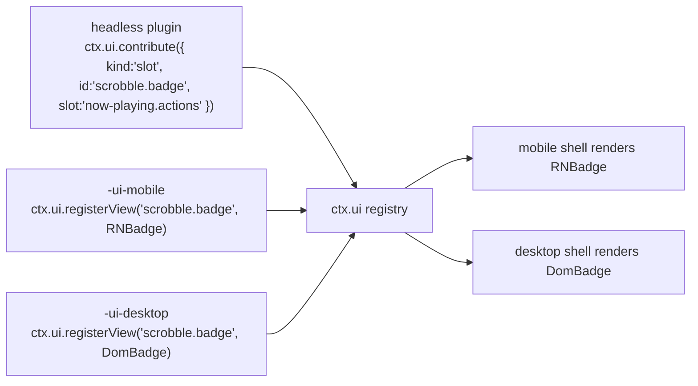

# 08 — UI Architecture

> **What this answers.** **Layer 4** of [02 §1](./02-architecture.md#1-the-layer-model): how a
> single plugin contributes user interface to two shells that share no component code, how views
> find their data without owning it, and where the boundary between "logic" and "view" is drawn.

Per [ADR-2](./01-overview.md#adr-2--the-ui-is-split-react-native-on-mobile-react-dom-on-desktop),
there are two view layers: React Native on mobile and React DOM on desktop. The cost of that
choice is paid entirely here, and this document is about containing it.

---

## 1. The three-package convention

A feature with UI splits into up to three packages. The split is not bureaucracy — it is what
keeps ADR-2 from doubling the *whole* feature instead of just its pixels.

```
@BBeBee/plugin-scrobble               ← headless: service, state, events, persistence
@BBeBee/plugin-scrobble-ui-mobile     ← React Native views
@BBeBee/plugin-scrobble-ui-desktop    ← React DOM views
```

| Package | Layer | Contains | May import |
|---|---|---|---|
| headless | 3 | The Cordis plugin, all logic, all state, all DB access, all networking | `@BBeBee/protocol` only |
| `-ui-mobile` | 4 | Components and the descriptors that name them | `react`, `react-native`, `@BBeBee/ui-kit-mobile`, the headless package's **types** |
| `-ui-desktop` | 4 | Components and the descriptors that name them | `react`, `react-dom`, `@BBeBee/ui-kit-desktop`, the headless package's **types** |

The split is the Layer 4/Layer 5 boundary made concrete. Layer 5 is where business *orchestration*
lives — this button, then that confirmation, then this navigation — while the business *rule* it
orchestrates stays at Layer 4, where it can be tested without a renderer and reused by the other
target's views unchanged.

The rule that makes it work:

> **A UI package contains no logic that would need to be written twice.**

If you are about to write the same `if` in both UI packages, it belongs in the headless one —
usually as a derived value on the service or a selector it exposes. In practice the UI packages
end up thin: layout, gestures, and event wiring.

The headless package works alone. A plugin with no UI package still functions; it simply
contributes nothing visible, which is exactly what happens on a target where its view was not
written.

---

## 2. Contributions are descriptors

Plugins never hand components to the shell directly. They register **descriptors** — serialisable
declarations naming a view — and the shell resolves the name against its own registry.

```ts
export type Contribution =
  | RouteContribution
  | SlotContribution
  | CommandContribution
  | SettingsContribution
  | MenuContribution

export interface RouteContribution {
  kind: 'route'
  id: string                       // 'scrobble.history'
  path: string                     // '/scrobble/history'
  title: string                    // i18n key
  icon?: string                    // name from the shared icon set
  /** Where the shell should offer navigation to it. */
  placement?: ('sidebar' | 'tab-bar' | 'more-menu')[]
  order?: number
}

export interface SlotContribution {
  kind: 'slot'
  id: string
  slot: SlotId                     // a well-known extension point
  order?: number
  /** Evaluated against slot context to decide visibility. Pure, cheap, synchronous. */
  when?: (ctx: SlotContext) => boolean
}

export interface CommandContribution {
  kind: 'command'
  id: string                       // 'player.togglePlay'
  title: string
  icon?: string
  defaultKeybinding?: string       // desktop only; ignored on mobile
  run(args?: unknown): void | Promise<void>
}

export interface SettingsContribution {
  kind: 'settings'
  id: string
  section: 'general' | 'playback' | 'audio' | 'sources' | 'storage' | 'advanced'
  title: string
  /** Rendered automatically from the schema unless a custom view is registered. */
  schema?: StandardSchemaV1
}

export interface MenuContribution {
  kind: 'menu'
  id: string
  /** Desktop application menu bar. Mobile maps these into the more-menu. */
  menu: 'file' | 'edit' | 'view' | 'playback' | 'help'
  title: string
  /** The command run when selected — menus never carry their own logic. */
  command: string
  order?: number
  /** Rendered as a checkbox item, driven by this predicate. */
  checked?: () => boolean
}

export interface UiService {
  contribute(c: Contribution): Disposable
  /** Called by each shell's view package to bind an id to a component. */
  registerView(id: string, component: unknown): Disposable

  readonly routes: readonly RouteContribution[]
  slotsFor(slot: SlotId): readonly SlotContribution[]
  readonly commands: readonly CommandContribution[]
  runCommand(id: string, args?: unknown): Promise<void>
  viewFor(id: string): unknown | undefined
}
```

`registerView` takes `unknown` deliberately: `@BBeBee/protocol` must not depend on `react`,
`react-native`, or `react-dom`, since it is imported by headless plugins that run in contexts with
no React at all. The shells cast at the boundary — one `as ComponentType` in one place per shell,
rather than a React dependency reaching into the contract layer.

### Slots

Well-known extension points, enumerated in `@BBeBee/protocol` so both shells implement the same set:

```ts
export type SlotId =
  | 'now-playing.actions'        // buttons beside the transport
  | 'now-playing.panel'          // tabs in the expanded player (lyrics, queue, related)
  | 'track.context-menu'         // right-click / long-press on a track
  | 'album.context-menu'
  | 'library.sidebar'            // extra library sections
  | 'search.results-section'     // an extra results group
  | 'settings.sources'            // the source list: import, groups, enable, reorder
  | 'source.browse'               // a source's explore tree
  | 'source.editor'               // the document editor for one source
  | 'source.debug'                // the rule tracer (06 §10)
  | 'status-bar'                 // desktop only; ignored on mobile
```

Slot rendering is where a plugin's UI actually shows up:

```tsx
// @BBeBee/ui-kit-desktop
export function Slot({ id, context }: { id: SlotId; context: SlotContext }) {
  const items = useSlot(id, context)
  return <>{items.map((it) => {
    const View = ui.viewFor(it.id) as ComponentType<{ context: SlotContext }> | undefined
    return View ? <View key={it.id} context={context} /> : null
  })}</>
}
```

---

## 3. Resolving a descriptor to a view

The descriptor names a view id. The shell looks it up in a registry populated by whichever UI
package was loaded for *this* target.



**Missing views are normal, not an error.** A plugin may ship a desktop view and no mobile one
(a multi-column log inspector), or the reverse (a gesture-driven mini player). The contribution
still registers; the slot simply renders nothing for it. This is a direct, ongoing cost of ADR-2,
and making it a first-class state rather than a crash is what keeps it survivable.

Three consequences worth enforcing:

- A descriptor must carry enough information to be *listed* without its view — a title and icon.
  A settings page with no view for this target can still appear, disabled, with "not available on
  this platform", rather than leaving a hole the user cannot explain.
- `when` predicates run in the shell and must be synchronous and cheap; they run during render.
- A command with no view is fully functional — it appears in the command palette on desktop and
  in the more-menu on mobile. Commands are the cheapest way to make a feature reachable on both
  targets.

---

## 4. Binding services to React

The rule from [02 §6](./02-architecture.md#6-state-ownership): **React holds no domain state.**
Services own it; components subscribe.

Both `ui-kit-mobile` and `ui-kit-desktop` build on one shared, framework-agnostic hook layer in
`@BBeBee/ui-core`, which depends only on `react` and `@BBeBee/protocol`:

```ts
// @BBeBee/ui-core
export function useService<K extends ServiceKey>(key: K): Context[K] | undefined

/**
 * Subscribe to service state via useSyncExternalStore, so React 18 concurrent
 * rendering cannot tear. `select` must be referentially stable across calls
 * for unchanged inputs — return primitives or memoised objects.
 */
export function useServiceState<K extends ServiceKey, T>(
  key: K,
  events: (keyof Events)[],
  select: (svc: Context[K]) => T,
): T
```

Feature-specific hooks are thin wrappers, and they live in the **headless** package so both shells
share them:

```ts
// @BBeBee/plugin-player/hooks — shared by both UI packages
export const useTransport = () =>
  useServiceState('player', ['player/state-changed'], (p) => p.state)

export const useQueue = () =>
  useServiceState('player', ['queue/changed'], (p) => p.queue)

/** Position updates at 1 Hz; the UI interpolates with rAF between ticks. */
export const usePosition = () =>
  useServiceState('player', ['player/position'], (p) => p.state.positionMs)
```

This is where the three-package split earns its keep. The hooks — the part with actual logic about
which events invalidate which state — are written once. Only the JSX is written twice.

### Rendering rules

- **No `useEffect` for domain work.** An effect that fetches, writes, or mutates domain state
  belongs in a service method the component calls.
- **Optimistic updates live in the service**, not the component, so both shells behave identically
  when a write fails and rolls back.
- **Lists virtualise.** `FlashList` on mobile, `@tanstack/react-virtual` on desktop. A library can
  hold 100k tracks; neither platform survives rendering that.
- **`player/position` is interpolated, never polled.** The event fires at 1 Hz
  ([07 §5](./07-data-model.md#5-the-event-map)); a progress bar animates between ticks with
  `requestAnimationFrame` and re-syncs on each event.
- **Artwork renders `blurhash` first**, then the image
  ([07 §4.2](./07-data-model.md#42-artwork)). No layout shift, no grey flash on scroll.

---

### The source surfaces

Four screens carry the whole string model, and they are worth naming because they are the part of
the UI that has no equivalent in a conventional player. All four are contributed by
`plugin-source-runtime-ui-{mobile,desktop}`, and all four are ordinary descriptors — nothing about
them is privileged.

| Screen | Does | Notes on the split |
|---|---|---|
| **Source list** | Enable, disable, reorder, group, and see each source's health badge | Ordinary list; parity is free |
| **Import review** | Show what a pasted string contains — added / updated / rejected, and the host allowlist — before anything is written ([06 §9](./06-music-sources.md#9-importing-updating-and-sharing)) | The one screen that must never be skipped, so it is a modal route on both, not a slot |
| **Source editor** | Edit the document's fields and rules | ⚠️ Genuinely different: desktop gets a two-pane JSON/form editor, mobile a sectioned form. The *validation* is in the headless package, so the two cannot disagree about what is valid |
| **Rule tracer** | Run one step and show every rule's input, output and timing ([06 §10](./06-music-sources.md#10-diagnosing-a-broken-source)) | A long scrollable log with an editable rule at each row — the closest thing in the app to a developer tool, and the reason a user can fix a source themselves |

The rule that keeps this affordable is [§1](#1-the-three-package-convention)'s: parsing,
validating, diffing, tracing and redacting all live in the headless package. The view packages
show a list and a text field.

---

## 5. Navigation

| | Mobile | Desktop |
|---|---|---|
| Router | Expo Router (file-based) | A small in-memory router in `ui-kit-desktop` |
| Primary chrome | Bottom tab bar + stack | Persistent sidebar + content pane |
| Contributed routes | Registered as dynamic routes; `placement` decides tab bar vs. more-menu | Sidebar entries ordered by `order` |
| Back | OS gesture / hardware button | In-app history, plus `Cmd/Ctrl+[` |
| Deep links | `BBeBee://` scheme via `expo-linking` | Same scheme registered with the OS by `main` |

Both shells implement the same `navigate(routeId, params)` used by commands, so a command works on
either target without knowing which router is underneath.

---

## 6. Design tokens

Tokens are **data, not components** — the only way to keep two view layers looking like one
product.

```ts
// @BBeBee/ui-tokens — plain values, no framework
export const tokens = {
  color: {
    bg: { base: '#0B0B0F', raised: '#15151C', overlay: '#1E1E28' },
    text: { primary: '#F5F5F7', secondary: '#A0A0AE', disabled: '#5A5A68' },
    accent: { base: '#7C5CFF', hover: '#8F73FF', muted: '#2A2340' },
    state: { error: '#FF5C5C', warn: '#FFB020', ok: '#3ECF8E' },
  },
  space: [0, 4, 8, 12, 16, 24, 32, 48, 64],
  radius: { sm: 4, md: 8, lg: 16, pill: 999 },
  font: {
    family: { ui: 'Inter', mono: 'JetBrains Mono' },
    size: { xs: 11, sm: 13, md: 15, lg: 20, xl: 28, display: 40 },
    weight: { regular: '400', medium: '500', bold: '700' },
  },
  duration: { fast: 120, normal: 200, slow: 320 },
} as const
```

`ui-kit-mobile` consumes them as `StyleSheet` values; `ui-kit-desktop` emits them as CSS custom
properties. Both derive light and dark palettes from the same source, and the player screen can
tint from `artworks.dominant_color` on both.

**Component parity is a contract.** Both kits export the same component names with the same props —
`Button`, `IconButton`, `TrackRow`, `Slider`, `Sheet`/`Dialog`, `List`, `EmptyState`, `Toast`. A
plugin author writing both view packages should be transcribing, not redesigning. A parity test in
CI diffs the exported names and prop types of the two kits and fails on divergence, because without
it the kits drift silently and every plugin author pays.

---

## 7. Shell responsibilities

The shells are thin. Everything below is genuinely platform-specific and belongs nowhere else.

| | `apps/mobile` | `apps/desktop/renderer` |
|---|---|---|
| Boot | Create context, register `core-*-expo`, mount inside `ctx.inject(['ui'], …)` | Same with `core-*-node` |
| Chrome | Tab bar, stack headers, safe-area insets | Sidebar, title bar, window controls, resizable panes |
| Player surface | Mini player above the tab bar; expands to full screen | Persistent bottom bar; optional detached mini-player window |
| Platform-only | Gestures, haptics, pull-to-refresh | Right-click menus, drag-and-drop, keyboard shortcuts, tray, command palette |
| Absent | No keyboard shortcuts, no tray | No gestures, no haptics |

The desktop **command palette** (`Cmd/Ctrl+K`) is worth calling out: it renders
`ctx.ui.commands` directly, so every plugin command is reachable with zero UI work from the plugin
author. It is the highest-leverage piece of shell code in the project.

---

## 8. Accessibility

Not a phase-two concern, because retrofitting it is far more expensive than doing it.

- Every interactive element has an accessible name — `accessibilityLabel` on mobile,
  `aria-label` on desktop — supplied through the shared component props so it is written once.
- Desktop is fully keyboard navigable: visible focus rings, logical tab order, `Escape` closes
  every overlay, arrow keys move within lists.
- Mobile respects the OS text-size setting; the token scale is relative, and layouts are tested at
  200%.
- Contrast meets WCAG AA against both palettes — checked in the parity test, not by eye.
- `prefers-reduced-motion` (desktop) and Reduce Motion (mobile) disable the crossfade animations
  and the artwork parallax.
- The visualiser and any flashing element honour reduced-motion and are never the sole indicator
  of state.

---

## 9. Where to go next

[09 — Project Structure](./09-project-structure.md) turns all of this into a directory tree, a
build pipeline, and a set of enforced rules.
