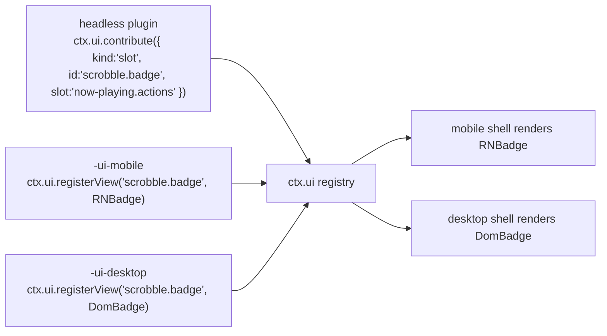

# 08 — UI Architecture

> **What this answers.** **Layer 4** of [02 §1](./02-architecture.md#1-the-layer-model): how a
> single plugin contributes user interface to two shells that share no component code, how views
> find their data without owning it, and where the boundary between "logic" and "view" is drawn.

Per [ADR-2](./01-overview.md#adr-2--the-ui-is-split-react-native-on-mobile-react-dom-on-desktop),
there are two view layers: React Native on mobile and React DOM on desktop. The cost of that
choice is paid entirely here, and this document is about containing it.

---

## 1. The three-package convention

A feature with UI splits into up to three packages. The split is not bureaucracy — it is what
keeps ADR-2 from doubling the *whole* feature instead of just its pixels.

```
@BBeBee/plugin-scrobble               ← headless: service, state, events, persistence
@BBeBee/plugin-scrobble-ui-mobile     ← React Native views
@BBeBee/plugin-scrobble-ui-desktop    ← React DOM views
```

| Package | Layer | Contains | May import |
|---|---|---|---|
| headless | 3 | The Cordis plugin, all logic, all state, all DB access, all networking | `@BBeBee/protocol` only |
| `-ui-mobile` | 4 | Components and the descriptors that name them | `react`, `react-native`, `@BBeBee/ui-kit-mobile`, the headless package's **types** |
| `-ui-desktop` | 4 | Components and the descriptors that name them | `react`, `react-dom`, `@BBeBee/ui-kit-desktop`, the headless package's **types** |

The split is the Layer 4/Layer 5 boundary made concrete. Layer 5 is where business *orchestration*
lives — this button, then that confirmation, then this navigation — while the business *rule* it
orchestrates stays at Layer 4, where it can be tested without a renderer and reused by the other
target's views unchanged.

The rule that makes it work:

> **A UI package contains no logic that would need to be written twice.**

If you are about to write the same `if` in both UI packages, it belongs in the headless one —
usually as a derived value on the service or a selector it exposes. In practice the UI packages
end up thin: layout, gestures, and event wiring.

The headless package works alone. A plugin with no UI package still functions; it simply
contributes nothing visible, which is exactly what happens on a target where its view was not
written.

---

## 2. Contributions are descriptors

Plugins never hand components to the shell directly. They register **descriptors** — serialisable
declarations naming a view — and the shell resolves the name against its own registry.

```ts
export type Contribution =
  | RouteContribution
  | SlotContribution
  | CommandContribution
  | SettingsContribution
  | MenuContribution

export interface RouteContribution {
  kind: 'route'
  id: string                       // 'scrobble.history'
  path: string                     // '/scrobble/history'
  title: string                    // i18n key
  icon?: string                    // name from the shared icon set
  /** Where the shell should offer navigation to it. */
  placement?: ('sidebar' | 'tab-bar' | 'more-menu')[]
  order?: number
}

export interface SlotContribution {
  kind: 'slot'
  id: string
  slot: SlotId                     // a well-known extension point
  order?: number
  /** Evaluated against slot context to decide visibility. Pure, cheap, synchronous. */
  when?: (ctx: SlotContext) => boolean
}

export interface CommandContribution {
  kind: 'command'
  id: string                       // 'player.togglePlay'
  title: string
  icon?: string
  defaultKeybinding?: string       // desktop only; ignored on mobile
  run(args?: unknown): void | Promise<void>
}

export interface SettingsContribution {
  kind: 'settings'
  id: string
  section: 'general' | 'playback' | 'audio' | 'sources' | 'storage' | 'advanced'
  title: string
  /** Rendered automatically from the schema unless a custom view is registered. */
  schema?: StandardSchemaV1
}

export interface MenuContribution {
  kind: 'menu'
  id: string
  /** Desktop application menu bar. Mobile maps these into the more-menu. */
  menu: 'file' | 'edit' | 'view' | 'playback' | 'help'
  title: string
  /** The command run when selected — menus never carry their own logic. */
  command: string
  order?: number
  /** Rendered as a checkbox item, driven by this predicate. */
  checked?: () => boolean
}

export interface UiService {
  contribute(c: Contribution): Disposable
  /** Called by each shell's view package to bind an id to a component. */
  registerView(id: string, component: unknown): Disposable

  readonly routes: readonly RouteContribution[]
  slotsFor(slot: SlotId): readonly SlotContribution[]
  readonly commands: readonly CommandContribution[]
  runCommand(id: string, args?: unknown): Promise<void>
  viewFor(id: string): unknown | undefined
}
```

`registerView` takes `unknown` deliberately: `@BBeBee/protocol` must not depend on `react`,
`react-native`, or `react-dom`, since it is imported by headless plugins that run in contexts with
no React at all. The shells cast at the boundary — one `as ComponentType` in one place per shell,
rather than a React dependency reaching into the contract layer.

> ⚠️ **Register a component bound to *your* context, never the shell's.** A shell renders a view
> as `h(Component, { ctx })` with the context it was mounted on — `app.ready(['ui'])`, which has
> `ui` injected and nothing else — and a cordis context throws for any property outside its inject
> list. A screen that reads `ctx.player` or `ctx.inspector` off the forwarded prop therefore throws
> *during render*, on a device, while every test that built a plain root context passed. Every view
> package here closes over the context its own plugin was applied with (a local `bound(ctx, Screen)`
> helper) and forwards the shell's other props; the one that did not shipped a page that rendered
> as a black window.
>
> The shells catch it either way — a view that throws is caught per route and rendered as a named
> failure, not as an unmounted app — but the boundary is a net, not the contract.

### Slots

Well-known extension points, enumerated in `@BBeBee/protocol` so both shells implement the same set:

```ts
export type SlotId =
  | 'now-playing.actions'        // buttons beside the transport
  | 'now-playing.panel'          // tabs in the expanded player (lyrics, queue, related)
  | 'track.context-menu'         // right-click / long-press on a track
  | 'album.context-menu'
  | 'library.sidebar'            // extra library sections
  | 'search.results-section'     // an extra results group
  | 'settings.sources'            // the source list: import, groups, enable, reorder
  | 'source.browse'               // a source's explore tree
  | 'source.editor'               // the document editor for one source
  | 'source.debug'                // the rule tracer (06 §10)
  | 'status-bar'                 // desktop only; ignored on mobile
```

Slot rendering is where a plugin's UI actually shows up:

```tsx
// @BBeBee/ui-kit-desktop
export function Slot({ id, context }: { id: SlotId; context: SlotContext }) {
  const items = useSlot(id, context)
  return <>{items.map((it) => {
    const View = ui.viewFor(it.id) as ComponentType<{ context: SlotContext }> | undefined
    return View ? <View key={it.id} context={context} /> : null
  })}</>
}
```

---

## 3. Resolving a descriptor to a view

The descriptor names a view id. The shell looks it up in a registry populated by whichever UI
package was loaded for *this* target.



**Missing views are normal, not an error.** A plugin may ship a desktop view and no mobile one
(a multi-column log inspector), or the reverse (a gesture-driven mini player). The contribution
still registers; the slot simply renders nothing for it. This is a direct, ongoing cost of ADR-2,
and making it a first-class state rather than a crash is what keeps it survivable.

Three consequences worth enforcing:

- A descriptor must carry enough information to be *listed* without its view — a title and icon.
  A settings page with no view for this target can still appear, disabled, with "not available on
  this platform", rather than leaving a hole the user cannot explain.
- `when` predicates run in the shell and must be synchronous and cheap; they run during render.
- A command with no view is fully functional — it appears in the command palette on desktop and
  in the more-menu on mobile. Commands are the cheapest way to make a feature reachable on both
  targets.

---

## 4. Binding services to React

The rule from [02 §6](./02-architecture.md#6-state-ownership): **React holds no domain state.**
Services own it; components subscribe.

Both `ui-kit-mobile` and `ui-kit-desktop` build on one shared, framework-agnostic hook layer in
`@BBeBee/ui-core`, which depends only on `react` and `@BBeBee/protocol`:

```ts
// @BBeBee/ui-core
export function useService<K extends ServiceKey>(key: K): Context[K] | undefined

/**
 * Subscribe to service state via useSyncExternalStore, so React 18 concurrent
 * rendering cannot tear. `select` must be referentially stable across calls
 * for unchanged inputs — return primitives or memoised objects.
 */
export function useServiceState<K extends ServiceKey, T>(
  key: K,
  events: (keyof Events)[],
  select: (svc: Context[K]) => T,
): T
```

Feature-specific hooks are thin wrappers, and they live in the **headless** package so both shells
share them:

```ts
// @BBeBee/plugin-player/hooks — shared by both UI packages
export const useTransport = () =>
  useServiceState('player', ['player/state-changed'], (p) => p.state)

export const useQueue = () =>
  useServiceState('player', ['queue/changed'], (p) => p.queue)

/** Position updates at 1 Hz; the UI interpolates with rAF between ticks. */
export const usePosition = () =>
  useServiceState('player', ['player/position'], (p) => p.state.positionMs)
```

This is where the three-package split earns its keep. The hooks — the part with actual logic about
which events invalidate which state — are written once. Only the JSX is written twice.

### Rendering rules

- **No `useEffect` for domain work.** An effect that fetches, writes, or mutates domain state
  belongs in a service method the component calls.
- **Optimistic updates live in the service**, not the component, so both shells behave identically
  when a write fails and rolls back.
- **Lists virtualise.** `FlashList` on mobile, `@tanstack/react-virtual` on desktop. A library can
  hold 100k tracks; neither platform survives rendering that.
- **`player/position` is interpolated, never polled.** The event fires at 1 Hz
  ([07 §5](./07-data-model.md#5-the-event-map)); a progress bar animates between ticks with
  `requestAnimationFrame` and re-syncs on each event.
- **Artwork renders `blurhash` first**, then the image
  ([07 §4.2](./07-data-model.md#42-artwork)). No layout shift, no grey flash on scroll.

---

### The source surfaces

Four screens carry the whole string model, and they are worth naming because they are the part of
the UI that has no equivalent in a conventional player. All four are contributed by
`plugin-source-runtime-ui-{mobile,desktop}`, and all four are ordinary descriptors — nothing about
them is privileged.

| Screen | Does | Notes on the split |
|---|---|---|
| **Source list** | Enable, disable, reorder, group, and see each source's health badge | Ordinary list; parity is free |
| **Import review** | Show what a pasted string contains — added / updated / rejected, and the host allowlist — before anything is written ([06 §9](./06-music-sources.md#9-importing-updating-and-sharing)) | The one screen that must never be skipped, so it is a modal route on both, not a slot |
| **Source editor** | Edit the document's fields and rules | ⚠️ Genuinely different: desktop gets a two-pane JSON/form editor, mobile a sectioned form. The *validation* is in the headless package, so the two cannot disagree about what is valid |
| **Rule tracer** | Run one step and show every rule's input, output and timing ([06 §10](./06-music-sources.md#10-diagnosing-a-broken-source)) | A long scrollable log with an editable rule at each row — the closest thing in the app to a developer tool, and the reason a user can fix a source themselves |

The rule that keeps this affordable is [§1](#1-the-three-package-convention)'s: parsing,
validating, diffing, tracing and redacting all live in the headless package. The view packages
show a list and a text field.

---

## 5. Navigation

| | Mobile | Desktop |
|---|---|---|
| Router | Expo Router (file-based) | A small in-memory router in `ui-kit-desktop` |
| Primary chrome | Bottom tab bar + stack | Persistent sidebar + content pane |
| Contributed routes | Registered as dynamic routes; `placement` decides tab bar vs. more-menu | Sidebar entries ordered by `order` |
| Back | OS gesture / hardware button | In-app history, plus `Cmd/Ctrl+[` |
| Deep links | `BBeBee://` scheme via `expo-linking` | Same scheme registered with the OS by `main` |

Both shells implement the same `navigate(routeId, params)` used by commands, so a command works on
either target without knowing which router is underneath.

---

## 6. Visual design language & design tokens

The visual design is an **immersive, dark-first streaming media aesthetic** designed to place cover
art, dense catalog lists, and high-vitality playback states at the center of the user experience.
The light theme exists as an accessible inversion, but dark is the primary mode that shapes the
entire product's surfaces and interaction model.

Tokens are **data, not components** — the only way to keep two view layers looking like one
product without sharing component code.

```ts
// @BBeBee/ui-tokens — plain values, no framework
export interface Palette {
  bg: { sunken: string; base: string; raised: string; overlay: string }
  text: { primary: string; secondary: string; disabled: string }
  accent: { base: string; hover: string; muted: string; on: string }
  state: { error: string; warn: string; ok: string }
  border: { subtle: string; strong: string }
}

export const dark: Palette = {
  bg: { sunken: '#000000', base: '#121212', raised: '#181818', overlay: '#282828' },
  text: { primary: '#FFFFFF', secondary: '#B3B3B3', disabled: '#6A6A6A' },
  accent: { base: '#1DB954', hover: '#1ED760', muted: '#1B3D2B', on: '#000000' },
  state: { error: '#F15E6C', warn: '#FFA42B', ok: '#1ED760' },
  border: { subtle: '#282828', strong: '#7A7A7A' },
}

export const light: Palette = {
  bg: { sunken: '#F1F1F1', base: '#FFFFFF', raised: '#F6F6F6', overlay: '#EDEDED' },
  text: { primary: '#000000', secondary: '#5E5E5E', disabled: '#8C8C8C' },
  accent: { base: '#12833C', hover: '#0D6E36', muted: '#D7F2E2', on: '#FFFFFF' },
  state: { error: '#C1291F', warn: '#8A5A00', ok: '#0E7A3D' },
  border: { subtle: '#E5E5E5', strong: '#767676' },
}

export const tokens = {
  space: [0, 4, 8, 12, 16, 24, 32, 48, 64] as const,
  radius: { sm: 4, md: 8, lg: 16, pill: 999 } as const,
  font: {
    family: {
      ui: '"Circular Std", Circular, Montserrat, Figtree, system-ui, -apple-system, "Segoe UI", Roboto, sans-serif',
      mono: '"JetBrains Mono", ui-monospace, SFMono-Regular, Menlo, monospace',
    },
    size: { xs: 11, sm: 13, md: 15, lg: 20, xl: 28, display: 40 } as const,
    weight: { regular: '400', medium: '500', bold: '700', heavy: '900' } as const,
    lineHeight: { tight: 1.2, normal: 1.45, loose: 1.7 } as const,
  },
  duration: { fast: 120, normal: 200, slow: 320 } as const,
  size: { touchTarget: 44, icon: 20, iconLarge: 28, row: 56, artworkThumb: 48 } as const,
} as const
```

`ui-kit-mobile` consumes them as `StyleSheet` values; `ui-kit-desktop` emits them as CSS custom
properties (`cssVariables(scheme)`).

### 6.1 Surface hierarchy & borderless elevation

Depth is communicated through **subtle luminance stepping of near-black surfaces**, rather than
heavy borders or drop shadows. Hard outlines create visual clutter in dense catalog views; subtle
contrast steps keep surfaces distinct while making cover art pop.

| Layer | Value (Dark) | Role & Usage |
|---|---|---|
| `bg.sunken` | `#000000` | The outer chassis and persistent rails: desktop window chrome, sidebars/rails, and the bottom transport player bar. Recedes so content stands out. |
| `bg.base` | `#121212` | Main scrollable canvas: playlists, album views, search results, library grids. |
| `bg.raised` | `#181818` | Elevated media cards (album/playlist tiles) and section panels. |
| `bg.overlay` | `#282828` | Hovered rows/cards, dropdowns, context menus, tooltips, and modal sheets. |
| `border.subtle` | `#282828` | Hairline dividers between major panels (e.g. sidebar border, bottom bar border). |
| `border.strong` | `#7A7A7A` | Focused interactive boundaries and accessible outlines (clears WCAG 1.4.11 3:1). |

### 6.2 Signature accent & high-contrast rules

- **The signature accent is vibrant green (`#1DB954`, hover `#1ED760`).** It communicates action,
  vitality, and active playback: play buttons, active row titles, track progress scrubber fill,
  and active switches.
- **`accent.on` is `#000000` (black).** Light text on saturated `#1DB954` fails WCAG AA (only ~2.6:1).
  Black text and icons on green provide over 8:1 contrast. Primary circular play buttons and
  filled action pills always place black glyphs over the green fill.
- **Light mode adapts the hue to `#12833C`.** Saturated `#1DB954` on white fails contrast tests; a
  deeper forest green preserves brand recognition while remaining legible.
- **Text hierarchy**: Pure white (`#FFFFFF`, `text.primary`) carries titles and primary interactive
  labels. Muted silver-grey (`#B3B3B3`, `text.secondary`) carries artists, album titles, track
  durations, column headers, and secondary counts. Inactive controls use subdued `#6A6A6A`.

### 6.3 Typography & type scale

The typography stack prioritises geometric grotesque letterforms:
`"Circular Std", Circular, Montserrat, Figtree, system-ui, -apple-system, "Segoe UI", Roboto, sans-serif`.
The font is resolved locally from the OS/system rather than downloaded, avoiding foreign webfont
licensing and CSP network overhead.

The scale relies on **"weight follows size"**:
- **Display (`40px`, weight `900` heavy, line-height `1.2`)**: Massive hero titles on playlist and
  album detail pages.
- **XL (`28px`, weight `900` heavy, line-height `1.2`)**: Major section headers ("Made for You",
  "Recently Played").
- **LG (`20px`, weight `700` bold)**: Section titles, shelf headers, dialog titles.
- **MD (`15px`, weight `700` bold for titles, `400` regular for body)**: Track titles, primary
  menu labels.
- **SM (`13px`, weight `400` regular)**: Artist names, album subtitle links, duration timestamps.
- **XS (`11px`, weight `500` medium / `700` bold, uppercase)**: Column labels (`TITLE`, `ALBUM`,
  `DATE ADDED`), category tags, and duration badges.

### 6.4 Component affordances & micro-interactions

- **Pill buttons (`radius.pill: 999`)**: Interactive controls (primary action buttons, category
  filter chips, tag toggles) are pill-shaped. In a borderless dark UI where panels are rectangles,
  the fully rounded shape immediately signals pressability.
- **Hover micro-scaling**: Primary pill buttons scale up slightly under the pointer
  (`transform: scale(1.04)` over `120ms`) rather than just shifting color, providing immediate,
  tactile physical feedback against near-black backgrounds.
- **Media cards & floating play reveal**: Rectangular cards (`radius.md: 8px`, `bg.raised: #181818`)
  feature square artwork (`radius.sm: 4px`) at the top, followed by bold title and artist subtitle.
  On pointer hover:
  1. The card background brightens from `#181818` to `#282828`.
  2. A vibrant green circular play button (`48px` diameter, `#1DB954` fill, `#000000` play glyph)
     rises into view at the bottom-right corner of the artwork with a gentle translateY and opacity
     transition (`120ms`) and subtle drop shadow.
  3. Clicking the play button immediately starts playback of that container without navigating.
- **Track rows (`TrackRow`, height `56px`)**:
  - Displays index number, artwork thumbnail (`48px` square, `radius.sm: 4px`), track title in
    `#FFFFFF`, artists in `#B3B3B3`, album name, and duration.
  - On hover, the row illuminates (`#282828`), the track number is replaced by a play icon (`▶`),
    and quick actions (heart/loved toggle button `♥`/`♡` via `onToggleLoved`, context menu `···`) become visible.
  - When actively playing, the track title, track number, and equalizer icon illuminate in
    signature green (`#1DB954`).
- **Scrubbers & sliders (`Slider`)**:
  - Horizontal bar (`4px` height) with a subtle grey background track.
  - Played progress fill displays in `#FFFFFF` during passive display, but illuminates in signature
    green (`#1DB954`) on pointer hover or active drag, accompanied by a circular thumb handle.

### 6.5 Dynamic hero gradients & artwork presentation

- **Square artwork (`radius.sm: 4px`)**: Tracks, albums, and playlists use square aspect ratios.
  Artists use circular avatars (`radius.pill`).
- **Zero-layout-shift loading**: Artwork containers display `blurhash` strings instantly as
  backgrounds while the full resolution image loads lazily, with fallback to `artworks.dominant_color`.
- **Dynamic ambient hero banner**: Header sections of playlist and album views extract
  `artworks.dominant_color` from cover artwork, generating a rich vertical gradient that radiates
  from the top banner and smoothly bleeds down into the `#121212` base canvas.

### 6.6 Shell structure & layout paradigms

- **Desktop Shell**:
  - **Left navigation rail / sidebar (sunken `#000000`)**: Persistent navigation shortcuts (Home,
    Search, Your Library) and scrollable playlist list.
  - **Center main content card (`#121212`, rounded corners)**: Scrollable canvas hosting the
    dynamic gradient hero header, action bar (large green circular play button, heart/save, `···`),
    and virtualized track list or media card grid. The Library view organizes items through
    top-level scopes (`All`, `Local`, `Favorites`) and content views (`Tracks`, `Albums`).
  - **Persistent bottom playback bar (sunken `#000000` / `#181818`)**: Spans the entire window width.
    Left: current track artwork thumbnail, track title (`#FFFFFF`), artist subtitle (`#B3B3B3`),
    save button. Center: transport buttons (shuffle, previous, oversized circular play/pause button,
    next, repeat) and time scrubber. Right: volume slider and utility toggles (queue, lyrics,
    device picker).
- **Mobile Shell**:
  - Clean full-bleed dark views with bottom navigation tab bar and scoped library filtering
    (`All` / `Local` / `Favorites`).
  - Persistent mini-player docked directly above the tab bar showing cover thumbnail, marquee title,
    artist name, play/pause toggle, and a hairline playback progress bar.
  - Full-screen now-playing sheet: Expanding the mini-player slides up an immersive player featuring
    large square cover art, bold geometric typography, scrub bar, circular transport controls, and
    swipe-up lyrics pane.

**Component parity is a contract.** Both kits export the same component names with the same props —
`Button`, `IconButton`, `TrackRow`, `Slider`, `Sheet`/`Dialog`, `List`, `EmptyState`, `Toast`. A
plugin author writing both view packages should be transcribing, not redesigning. A parity test in
CI diffs the exported names and prop types of the two kits and fails on divergence, because without
it the kits drift silently and every plugin author pays.

---

## 7. Shell responsibilities

The shells are thin. Everything below is genuinely platform-specific and belongs nowhere else.

| | `apps/mobile` | `apps/desktop/renderer` |
|---|---|---|
| Boot | Create context, register `core-*-expo`, mount inside `ctx.inject(['ui'], …)` | Same with `core-*-node` |
| Chrome | Tab bar, stack headers, safe-area insets | Sidebar, title bar, window controls, resizable panes |
| Player surface | Mini player above the tab bar; expands to full screen | Persistent bottom bar; optional detached mini-player window |
| Platform-only | Gestures, haptics, pull-to-refresh | Right-click menus, drag-and-drop, keyboard shortcuts, tray, command palette |
| Absent | No keyboard shortcuts, no tray | No gestures, no haptics |

The desktop **command palette** (`Cmd/Ctrl+K`) is worth calling out: it renders
`ctx.ui.commands` directly, so every plugin command is reachable with zero UI work from the plugin
author. It is the highest-leverage piece of shell code in the project.

---

## 8. Accessibility

Not a phase-two concern, because retrofitting it is far more expensive than doing it.

- Every interactive element has an accessible name — `accessibilityLabel` on mobile,
  `aria-label` on desktop — supplied through the shared component props so it is written once.
- Desktop is fully keyboard navigable: visible focus rings, logical tab order, `Escape` closes
  every overlay, arrow keys move within lists.
- Mobile respects the OS text-size setting; the token scale is relative, and layouts are tested at
  200%.
- Contrast meets WCAG AA against both palettes — checked in the parity test, not by eye.
- `prefers-reduced-motion` (desktop) and Reduce Motion (mobile) disable the crossfade animations
  and the artwork parallax.
- The visualiser and any flashing element honour reduced-motion and are never the sole indicator
  of state.

---

## 9. Where to go next

[09 — Project Structure](./09-project-structure.md) turns all of this into a directory tree, a
build pipeline, and a set of enforced rules.
