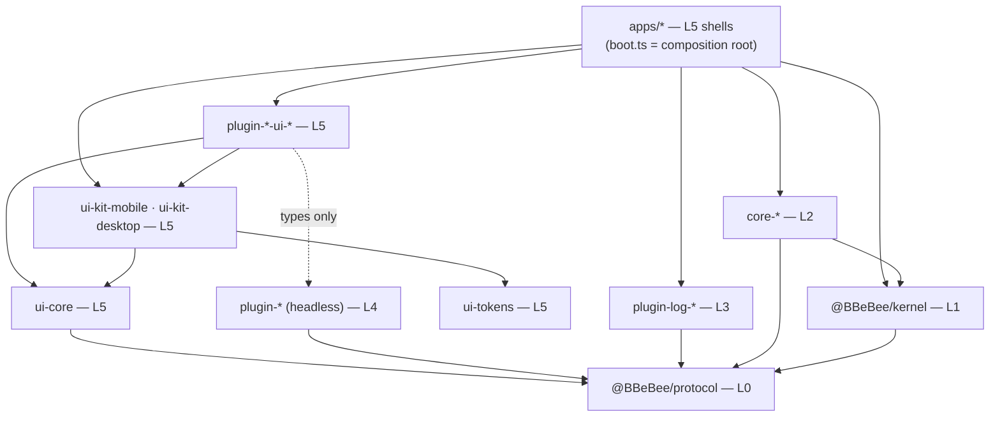

# 09 — Project Structure

> **What this answers.** The monorepo layout, the dependency rules that are mechanically enforced,
> how each target is built, the pinned version matrix, and the testing strategy that keeps the
> platform abstraction from rotting.

---

## 1. Repository layout

**The filesystem is the layer model.** Every package lives at
`packages/<layer>/<package>`, and the layer directory is not decoration: it is
what [`eslint.config.js`](#3-dependency-rules) keys its rules off. A package is governed by *where
it lives*, so moving one between layers is a `git mv` that changes its rules in the same commit.

```
packages/protocol/    Layer 0 — contracts, zero runtime
packages/kernel/      Layer 1 — infrastructure + system abstractions
packages/core/        Layer 2 — core capability services
packages/logs/        Layer 3 — log transports
packages/feature/     Layer 4 — business feature modules
packages/ui/          Layer 5 — views and shared UI infrastructure
packages/tooling/     outside the model — nothing here ships
```

Every package sits at the same depth, so `packages/*/*` is the whole workspace in one glob and
every package's `tsconfig.json` reaches the base config by the same `../../../`. The `apps/` are
Layer 5 too, but they stay where a reader expects to find them.

> ⚠️ **`packages/*/*` is not quite the whole workspace, and the exception has bitten.** The two
> single-package layers are `packages/protocol/src` and `packages/kernel/src`, one level
> shallower than everything else — so a glob written for the deep shape misses them, silently.
> `vitest.config.ts` carried only the deep shape for a while, and with it every test in Layers 0
> and 1: `layers.test.ts`, `conventions.test.ts`, `shells.test.ts` and
> `cordis-assumptions.test.ts` were not collected, and a run with the architecture's own guards
> switched off reports success exactly like one with them on. Any tool that globs packages needs
> both shapes.

Two consequences of naming the directories after the layer's *job* rather than its number. The
layers no longer sort into their own order — `core`, `feature`, `kernel`, `protocol`, `ui` is
alphabetical, and the table above is the mapping to know. And the two single-package layers read
doubled, `packages/protocol` and `packages/kernel`, which is the price of every
package sitting at one depth; the alternative special-cases exactly the two layers most likely to
gain a second package.

`✅` = built and passing `pnpm check`. Anything without it is designed but not yet written.

```
B_Be_Bee/
│
├── apps/                                   🔹 LAYER 5 — application shells
│   ├── mobile/                     ✅        Expo app
│   │   ├── src/boot.ts                        composition root: registers core-*-expo (02 §1)
│   │   ├── src/plugins.ts                     the allowlist, as data — imports nothing
│   │   ├── src/App.tsx                        mounts inside ctx.inject(['ui'], …)
│   │   ├── generated/plugins.ts               codegen: static plugin imports (03 §6.1)
│   │   ├── app.json · index.js                Expo entry + config
│   │   ├── metro.config.js                    package exports + watchFolders (§4)
│   │   ├── babel.config.js
│   │   └── android/ · ios/                    dev-client native projects
│   └── desktop/                    ✅        Electron app
│       ├── main/                              IPC hosts only, no domain logic (02 §2)
│       ├── preload/                           contextBridge surface
│       ├── renderer/                          React DOM shell + the kernel (ADR-3)
│       │   ├── boot.ts · plugins.ts             composition root + allowlist
│       │   └── main.tsx · Shell.tsx             mount + chrome
│       └── electron.vite.config.ts
│
├── packages/
│   │
│   ├── protocol/                    🔹 LAYER 0 — the contract layer 
│   │       │                                 @BBeBee/protocol. ZERO runtime dependencies, no      
│   │       └── src/                          side effects, no platform access — which is what
│   │           │                             makes it safe to import from any layer, and the
│   │           │                             seam every layer is mocked at
│   │           ├── services/                 fs · http · db · secrets · audio · player ·
│   │           │                             sources · ui · … (04)
│   │           ├── entities/                 Track, Album, StreamHandle, TransportState … (07)
│   │           ├── events.ts                 the typed event map (07 §5)
│   │           ├── errors.ts · frac-index.ts the small pure runtime that earns its place
│   │           └── conformance/              shared contract suites: one test file, run
│   │                                         against both implementations of a key (04 §18)
│   │
│   ├── kernel/                      🔹 LAYER 1 — infrastructure + system abstractions  
│   │       │                                 @BBeBee/kernel. Depends on protocol and cordis,
│   │       └── src/                          and nothing else in the workspace — a kernel that
│   │           │                             knows which plugins exist is not one
│   │           ├── index.ts                  two surfaces, not equally available: the pinned
│   │           │                             Cordis re-exports are open to every layer, the
│   │           │                             bootstrap surface below them is Layer 2 + the
│   │           │                             composition root only (02 §1)
│   │           │                             ── by concern, tests beside their subject:
│   │           ├── bootstrap/                createApp, boot order, settling, shell wiring
│   │           ├── config/                   resolve, enable/disable, defaults
│   │           ├── loader/                   registry → ctx.plugin(), fiber-state reporting
│   │           ├── capability-gate/          scoping and the SQL guards (03 §7). sql.ts is
│   │           │                             shared with apps/desktop/main, so one allowlist
│   │           │                             covers the gated path and the IPC host both
│   │           ├── migrations/               core schema migrations (07 §6)
│   │           │                             ── and what belongs to no single concern:
│   │           ├── fiber-state.ts            the FiberState mirror upstream cannot export
│   │           ├── testing.ts                @BBeBee/kernel/testing — snapshotContext (§6)
│   │           └── *.test.ts                 conventions · layers · cordis-assumptions:
│   │                                         these scan the workspace, not the kernel
│   │
│   ├── core/                        🔹 LAYER 2 — core capability services
│   │   │                                      The ONLY packages permitted to import a platform
│   │   │                                      SDK, and the only ones permitted to drive the
│   │   │                                      kernel. One implementation per target per key;
│   │   │                                      no domain knowledge — none of them knows what a
│   │   │                                      track is.
│   │   ├── core-paths-node/        ✅        ctx.paths
│   │   ├── core-paths-expo/        ✅
│   │   ├── core-fs-node/           ✅        ctx.fs — the virtual filesystem (04 §1)
│   │   ├── core-fs-expo/           ✅
│   │   ├── core-db-node/           ✅        ctx.db — node:sqlite / expo-sqlite (04 §3)
│   │   ├── core-db-expo/           ✅
│   │   ├── core-store-fs/          ✅        ctx.store — one impl, via ctx.fs (04 §4)
│   │   ├── core-http-node/         ✅        ctx.http — the transport is a seam: desktop fills
│   │   ├── core-http-rn/           ✅          it with Electron's net, mobile with expo/fetch
│   │   ├── core-secrets-node/      ✅        ctx.secrets. ⚠️ named -node but platform-free: it
│   │   │                                       persists through ctx.fs, so it loads in
│   │   │                                       Electron's sandboxed renderer too
│   │   ├── core-secrets-expo/      ✅
│   │   ├── core-device-electron/   ✅        ctx.device — network, battery, media keys
│   │   ├── core-device-expo/       ✅
│   │   ├── core-background-electron/ ✅      ctx.background — wake locks, suspend
│   │   ├── core-background-expo/   ✅
│   │   ├── core-media-session-electron/ ✅   ctx.mediaSession — the OS now-playing surface
│   │   ├── core-media-session-rn/  ✅
│   │   ├── core-codec-node/        ✅        ctx.codec — tags via music-metadata over ctx.fs;
│   │   ├── core-codec-rn/          ✅          -rn adds the device's decoder
│   │   ├── core-audio-webaudio/    ✅        ctx.audio — react-native-audio-api on both (05 §1)
│   │   ├── core-js-quickjs-node/   ✅        ctx.js — the source sandbox (04 §19)
│   │   ├── core-js-quickjs-expo/             ⚠️ the one M2 gap: Hermes has no WASM
│   │   ├── core-desktop-bridge/    ✅        renderer↔main IPC clients + the main-side host.
│   │   │                                       Layer 2 on both sides of the process boundary
│   │   └── core-…                            ctx.ws · ctx.notify · ctx.crypto · ctx.shell
│   │
│   ├── logs/                        🔹 LAYER 3 — log transports
│   │   │                                      Cordis exporters, shared across platforms, that
│   │   │                                      decide where a line ends up. The only layer that
│   │   │                                      may write to the console; everything above it
│   │   │                                      logs through ctx.logger (04 §16). Loaded from
│   │   │                                      each shell's bootstrap array, so they are running
│   │   │                                      before the first feature plugin starts.
│   │   ├── plugin-log-buffer/      ✅        ctx.logBuffer — the ring the log viewer reads
│   │   ├── plugin-log-console/     ✅        development only: console.* with scoped prefixes
│   │   ├── plugin-log-file/        ✅        shipped builds only: rotating NDJSON via ctx.fs
│   │   └── plugin-log-crash/                 a crash bundle the user may attach to a report
│   │
│   ├── feature/                     🔹 LAYER 4 — business feature modules
│   │   │                                      One business capability each, headless: state,
│   │   │                                      persistence, networking, events. Import
│   │   │                                      @BBeBee/protocol and the kernel's plugin surface
│   │   │                                      — never a platform SDK, never a core-* package
│   │   │                                      (a Layer 2 dependency is `inject: ['fs']`), and
│   │   │                                      never a transport (logging is `ctx.logger`).
│   │   ├── source-rules/           ✅        the rule language as pure logic: no Cordis, no
│   │   │                                       platform, no I/O (06 §3). parse.ts the parser,
│   │   │                                       evaluate.ts the engine and its coercion,
│   │   │                                       jsonpath.ts · template.ts the two dialects,
│   │   │                                       regex-guard.ts the ReDoS bound
│   │   ├── toolkit/                ✅        pure helpers that outgrew one plugin: stable ids
│   │   │                                       (stableId, artworkId), splitArtists,
│   │   │                                       formatDuration, permute. Same charter as
│   │   │                                       source-rules — no Cordis, no I/O, no deps
│   │   ├── plugin-source-runtime/  ✅        binds source-rules to ctx.http · ctx.js (06 §4)
│   │   ├── plugin-sources/         ✅        the ctx.sources registry + catalogue (06 §4.1)
│   │   ├── plugin-source-local/    ✅        the one provider that is not a string (06 §12)
│   │   ├── plugin-local-scanner/   ✅        ctx.scanner — the ≥5,000-file corpus walk
│   │   ├── plugin-player/          ✅        ctx.player — transport, queue, history (05 §2)
│   │   ├── plugin-ui/              ✅        the ctx.ui contribution registry — descriptors
│   │   │                                       only, so it holds no React (08 §2)
│   │   ├── plugin-inspector/       ✅        fiber tree + labelled effects (M0 exit criterion)
│   │   ├── plugin-dsp/                       ctx.dsp — the effect chain (05 §3)
│   │   ├── plugin-effect-eq10/               one DSP effect, as a plugin
│   │   ├── plugin-download/                  media_bindings + before-resolve substitution
│   │   ├── plugin-library/                   playlists, favourites, smart lists
│   │   ├── plugin-lyrics/                    lyric providers
│   │   ├── plugin-cache/                     the http/request cache layer
│   │   └── plugin-…
│   │
│   ├── ui/                          🔹 LAYER 5 — views and UI infrastructure
│   │   │                                      Layout, gestures, event wiring, and the
│   │   │                                      orchestration that turns one user intent into a
│   │   │                                      sequence of feature calls. Anything you would
│   │   │                                      otherwise write twice belongs in the headless
│   │   │                                      sibling, which views import for TYPES only.
│   │   ├── ui-tokens/              ✅        design tokens as data + the WCAG AA gate (08 §8)
│   │   ├── ui-core/                ✅        framework-agnostic hooks + shared prop types
│   │   ├── ui-parity/              ✅        the component contract, and the check that both
│   │   │                                       kits meet it (08 §6)
│   │   ├── ui-kit-mobile/          ✅        React Native components
│   │   ├── ui-kit-desktop/         ✅        React DOM components
│   │   ├── plugin-player-ui-desktop/ ✅      ┐ now playing, transport, queue
│   │   ├── plugin-player-ui-mobile/  ✅      ┘
│   │   ├── plugin-sources-ui-desktop/ ✅     ┐ library, album detail, source list, import
│   │   ├── plugin-sources-ui-mobile/  ✅     ┘ review, test screen (08 §4)
│   │   ├── plugin-local-scanner-ui-desktop/ ✅ ┐ settings: scan roots
│   │   ├── plugin-local-scanner-ui-mobile/  ✅ ┘
│   │   └── plugin-inspector-ui-desktop/ ✅   the fiber tree, rendered
│   │
│   └── tooling/                            🔧 OUTSIDE THE LAYER MODEL
│       │                                      Development aids. Nothing here ships in an app
│       │                                      bundle, which is why the layer rules do not
│       │                                      apply to them.
│       ├── tooling-gen-plugins/    ✅        the static registry codegen (pnpm gen:plugins)
│       ├── tooling-create-plugin/  ✅        the scaffolder (pnpm new:plugin)
│       └── tooling-fixtures/       ✅        the ≥5,000-file corpus generator, an instrumented
│                                             ctx.fs, and the byte-serving http fixture the
│                                             conformance suite runs on
│
├── sources/                                  multi-file source development directory (source.json + source.js)
├── fixtures/sources/                         compiled single-file example source documents; golden corpus (§6)
├── scripts/                                  developer & build scripts (scripts/sources/ source packaging & watch tools)
├── test/stubs/                               the three native modules Node cannot load, aliased
│                                             by vitest.config.ts: react-native-audio-api throws
│                                             on anything genuinely native, expo-sqlite and
│                                             expo-file-system really work (§6)
├── docs/                                     these documents
├── eslint.config.js                          flat config; the layer rules live here (§3)
├── tsconfig.base.json                        every package tsconfig extends this
├── vitest.config.ts · vitest.global.ts       aliases + the scratch root each run allocates under
├── pnpm-workspace.yaml · .npmrc
└── package.json                              the root scripts: check, gen:plugins, new:plugin, build:sources, watch:sources
```

### Why the layer is a directory

The alternative — a flat `packages/` where the *prefix* carries the layer — is what this
repository had until the layer model was enforced, and it worked. What it could not do is make the
layer **structural**. Three things changed when the directory became the grouping:

- **The lint rules key off location, not spelling.** `packages/core/**` is the set of
  packages allowed to touch a platform SDK, and membership is a fact about the filesystem rather
  than a naming convention that a package called `plugin-fs-helper` could quietly slip past.
- **A layer change is a move.** Promoting a feature plugin into a core service is
  `git mv packages/feature/x packages/core/x`, and its rules change with it, in the
  same commit, visibly in review.
- **A new package must choose.** The scaffolder writes into `feature/` or `ui/`
  ([§7](#7-developer-workflow)), so "which layer is this?" is answered at creation instead of
  being inferred later from what the package ended up importing.

The cost is one extra path segment everywhere — in `pnpm-workspace.yaml`, in each package's
`extends`, and in the workspace-scanning tests, which now resolve a package by scanning
`packages/*/*` rather than by joining a name onto `packages/`. That cost is paid once, and it was
paid when this layout landed. The scanners take the directory listing as the source of truth
rather than a hardcoded list, so the layer directories can be renamed — as they were, from
`layerN-*` to the bare name — without touching them.

Nesting also earns its keep *inside* a package, where it separates things a reader genuinely
confuses: `src/services/` and `src/entities/` in `protocol`, and the concern directories in
`kernel` — `bootstrap/`, `config/`, `loader/`, `capability-gate/`, `migrations/`. The kernel is
the one package doing five unrelated jobs, and each directory keeps its own tests beside it.

### Naming

The **directory** decides the layer and therefore what a package may import. The **prefix**
still says what kind of thing it is, and the two agree by construction — a `core-` package in
`feature/` would be a mistake the reader can see.

| Directory | Layer | Prefixes it holds |
|---|---|---|
| `protocol/` | 0 | `protocol` — the contracts. One package, no runtime |
| `kernel/` | 1 | `kernel` — one package |
| `core/` | 2 | `core-<service>-<platform>` — one platform implementation of a core service |
| `feature/` | 3 | `plugin-<feature>` headless, `plugin-effect-<id>` for a DSP effect, and `source-rules` · `toolkit`, pure-logic libraries beneath the plugins rather than plugins themselves |
| `ui/` | 4 | `plugin-<feature>-ui-<target>` for views, `ui-*` for the infrastructure both kits share |
| `tooling/` | — | `tooling-*`. Outside the layer model, because nothing here ships |

There is deliberately **no `plugin-source-<protocol>` prefix any more**. A music backend is a
source document ([06](./06-music-sources.md)), not a package. The only two packages with `source`
in the name are `plugin-source-runtime`, which interprets documents, and `plugin-source-local`,
which has no HTTP to describe ([06 §12](./06-music-sources.md#12-what-is-not-a-string-local-files)).
The example documents this repository ships live in `fixtures/sources/`, not in `packages/`.

`toolkit` shares `source-rules`' shape — **no manifest, so no lifecycle**: it is pure,
dependency-free logic imported directly by whichever plugin needs it, coupling nothing. A package
without a `BBeBee.plugin.json` is a library, and a library never names a `ctx.*` service; the
moment code needs one, it belongs in a `plugin-<feature>` package instead.

---

## 2. Package layering

The same six layers as [02 §1](./02-architecture.md#1-the-layer-model), drawn as the actual
`package.json` graph. Every node is annotated with its layer, and every edge here is a real
`dependencies` entry — the runtime edges that service keys create are deliberately absent, because
this is the build graph.



Every arrow that is not into `@BBeBee/protocol` is a convenience. The arrows *into* `protocol` are
the architecture.

Two edges are worth reading twice, because they are the ones the layer model constrains rather
than forbids:

- **`apps/* → @BBeBee/kernel` and `apps/* → core-*`** exist only for the composition root — the
  `boot.ts` / `plugins.ts` pair per shell. Every other file under `apps/*` is plain Layer 5 and is
  linted as such ([§3](#3-dependency-rules)).
- **`apps/* → plugin-log-*`** is the same exception for the same reason. The transports are
  bootstrap entries, not registry ones — they come up after the core services and before the
  feature plugins, which is what Layer 3 *means* — and only the composition root may name a
  plugin by import. Nothing else in the repository imports a transport; everything logs through
  `ctx.logger` ([04 §16](./04-core-services.md)).
- **`core-* → @BBeBee/kernel`** is the one place the bootstrap surface is imported by a package
  rather than by a shell: `core-db-*` runs the core migrations and scopes contexts for the
  capability gate. That is Layer 2 doing its job as the adaptation layer.

There is no `plugin-* → core-*` edge, on purpose, and no `plugin-* → plugin-log-*` edge either.
If one ever appears, the layer model is broken and `pnpm lint` says so — with
`layers.test.ts` behind it, because a lint pattern that matches nothing forbids nothing and reads
exactly like one that works.

---

## 3. Dependency rules

The layer model of [02 §1](./02-architecture.md#1-the-layer-model) is worth exactly as much as its
enforcement, so it is enforced by ESLint with `overrides` scoped by path, not by review. Because
[§1](#1-repository-layout) puts every package under its layer directory, those paths *are* the
layer: `packages/core/**` is not a naming convention that hopes to match the right
packages, it is exactly the set of packages in Layer 2. Each rule below states which boundary it
protects. This is an abridged reading of `eslint.config.js` — the file itself is the authority.

```js
// eslint.config.js — the rules that matter
const PLATFORM_SDKS = [
  'expo', 'expo-*', 'expo/*', 'react-native', 'react-native/*', 'react-native-*',
  'electron', 'electron/*', 'node:*', 'fs', 'fs/promises', 'path', 'os', 'crypto',
  'child_process', 'better-sqlite3', 'music-metadata', 'ws',
]

// 02 §1 — the kernel's plugin surface: the pinned Cordis re-exports, which
// only *type* a plugin. An allow-list rather than a ban-list on the bootstrap
// surface, so a new kernel export is closed to Layers 3, 4 and 5 by default.
const KERNEL_PLUGIN_SURFACE = [
  'Context', 'Service', 'Inject', 'FiberState', 'fiberStateName', 'isActive', 'isSettled',
  'Plugin', 'Fiber', 'Effect', 'EffectMeta', 'InjectSpec', 'FiberStateName', 'FiberStateValue',
]

const KERNEL_GUARD = {
  name: '@BBeBee/kernel',
  allowImportNames: KERNEL_PLUGIN_SURFACE,
  message: 'Layers 3, 4 and 5 may be typed by the kernel but may not drive it. See docs/02 §1.',
}

// Both forms: a gitignore-style `*` does not cross a `/`, so the bare name
// alone would let `@BBeBee/core-desktop-bridge/main` through.
const CORE_PACKAGES = ['@BBeBee/core-*', '@BBeBee/core-*/**']

// 04 §16 — Layer 3. Everything above it logs through `ctx.logger`, so nothing
// above it names a transport: an import pins one implementation into code
// whose point is not to know, and keeps it loaded for as long as the importer
// lives.
const LOG_PACKAGES = ['@BBeBee/plugin-log-*', '@BBeBee/plugin-log-*/**']

// The composition root: the only files that may call createApp and name a
// Layer 2 package by import. `apps/*/generated/plugins.ts` is codegen and is
// in the global `ignores`.
const COMPOSITION_ROOT = [
  'apps/mobile/src/boot.ts', 'apps/mobile/src/plugins.ts',
  'apps/desktop/renderer/boot.ts', 'apps/desktop/renderer/plugins.ts',
]

export default tseslint.config(
  {
    // 02 §1 — Layers 4 and 5, addressed by directory. Every invariant at once,
    // because ESLint *replaces* a rule's options rather than merging them:
    // every block covering a file has to restate the whole ban, or the
    // narrower block silently disables the wider one.
    files: ['packages/feature/**/*.{ts,tsx}', 'packages/ui/**/*.{ts,tsx}',
            'packages/protocol/**/*.ts'],
    ignores: ['packages/ui/plugin-*-ui-*/**/*.{ts,tsx}'],
    rules: {
      'no-restricted-imports': ['error', {
        paths: [KERNEL_GUARD],
        patterns: [...PLATFORM_SDKS, ...CORE_PACKAGES, ...LOG_PACKAGES],
      }],
      // 04 §16 — the other half of the same rule. A line written straight to
      // the console skips the redactor and reaches neither the ring buffer nor
      // the log file, which are what a bug report carries.
      'no-console': 'error',
    },
  },
  {
    // 02 §1 — Layer 3 itself. Bound by THE invariant like everything above
    // core, and exempt from `no-console`, which is the layer's job: it is the
    // whole of plugin-log-console, and plugin-log-file's last resort when the
    // write it exists to perform is the thing that failed.
    //
    // The negated pair is load-bearing. An extglob (`plugin-!(log-)*`) parses,
    // matches nothing, and bans nothing while looking correct.
    files: ['packages/logs/**/*.ts'],
    ignores: ['packages/logs/**/*.test.ts'],
    rules: {
      'no-restricted-imports': ['error', {
        paths: [KERNEL_GUARD],
        patterns: [...PLATFORM_SDKS, ...CORE_PACKAGES,
                   '@BBeBee/plugin-*', '@BBeBee/plugin-*/**',
                   '!@BBeBee/plugin-log-*', '!@BBeBee/plugin-log-*/**',
                   '@BBeBee/ui-*', '@BBeBee/ui-*/**'],
      }],
    },
  },
  {
    // 02 §1 and 06 §3 — the rule engine is pure logic: no platform, no I/O,
    // and no Cordis. It takes a document and a string and returns a value;
    // every fetch belongs to plugin-source-runtime. Keeping it pure is what
    // makes the rule corpus in §6 runnable without a network, and it is the
    // Layer 4 entry in 02 §1's testability table.
    files: ['packages/feature/source-rules/**/*.ts'],
    rules: {
      'no-restricted-imports': ['error', {
        patterns: [...PLATFORM_SDKS, ...CORE_PACKAGES, ...LOG_PACKAGES,
                   'cordis', '@BBeBee/kernel'],
      }],
    },
  },
  {
    // 08 §1 — Layer 5 view packages may render, but may not reach the
    // platform. `react-native` is allowed; its capability modules are not.
    files: ['packages/ui/plugin-*-ui-mobile/**/*.{ts,tsx}',
            'packages/ui/ui-kit-mobile/**/*.{ts,tsx}'],
    rules: {
      'no-restricted-imports': ['error', {
        paths: [KERNEL_GUARD],
        patterns: [...PLATFORM_SDKS.filter((p) => !p.startsWith('react-native')),
                   ...CORE_PACKAGES, ...LOG_PACKAGES],
      }],
      'no-console': 'error',
    },
  },
  {
    // The desktop half. `react-dom` is not a platform SDK, so this one bans
    // the whole list — without it, the block above exempts every
    // `plugin-*-ui-*` package and only puts `-ui-mobile` back under a rule.
    files: ['packages/ui/plugin-*-ui-desktop/**/*.{ts,tsx}',
            'packages/ui/ui-kit-desktop/**/*.{ts,tsx}'],
    rules: {
      'no-restricted-imports': ['error', {
        paths: [KERNEL_GUARD],
        patterns: [...PLATFORM_SDKS, ...CORE_PACKAGES, ...LOG_PACKAGES],
      }],
      'no-console': 'error',
    },
  },
  {
    // 02 §1 — Layer 1 depends on Layer 0 and nothing else. A kernel that knows
    // which plugins exist is not a kernel: it resolves them from a registry
    // the shell hands it, which is what lets one kernel boot two graphs.
    // `src/testing.ts` is exempt for the reason `*.test.ts` is.
    files: ['packages/kernel/src/**/*.ts'],
    ignores: ['packages/kernel/src/**/*.test.ts',
              'packages/kernel/src/testing.ts'],
    rules: {
      'no-restricted-imports': ['error', {
        patterns: [...PLATFORM_SDKS, ...CORE_PACKAGES,
                   '@BBeBee/plugin-*', '@BBeBee/plugin-*/**', '@BBeBee/ui-*', '@BBeBee/ui-*/**'],
      }],
    },
  },
  {
    // 02 §1 — Layer 0 must stay runtime-free so it is safe to import anywhere,
    // which is what makes it the seam every other layer is mocked at.
    // `^[^.]` matches bare specifiers only, leaving relative imports alone.
    files: ['packages/protocol/src/**/*.ts'],
    ignores: ['packages/protocol/src/conformance/**/*.ts',
              'packages/protocol/src/**/*.test.ts'],
    rules: {
      'no-restricted-imports': ['error', {
        patterns: [{ regex: '^[^.]', allowTypeImports: true }],
      }],
    },
  },
  {
    // 02 §1 — the shells are Layer 5 and reach Layers 2 and 3 through service
    // keys. Platform SDKs are deliberately NOT banned: a shell owns genuinely
    // platform-bound chrome (08 §7). What it may not do is skip a layer.
    //
    // `no-console` is not set here either, and that is deliberate: a shell has
    // to be able to report a failure that happened before any transport was
    // loaded — a core service throwing means there is no ring buffer to read
    // back and no file being written.
    files: ['apps/mobile/src/**/*.{ts,tsx}', 'apps/desktop/renderer/**/*.{ts,tsx}'],
    ignores: [...COMPOSITION_ROOT, '**/*.test.{ts,tsx}'],
    rules: {
      'no-restricted-imports': ['error', {
        paths: [KERNEL_GUARD], patterns: [...CORE_PACKAGES, ...LOG_PACKAGES],
      }],
    },
  },
  {
    // 02 §2 — main is an IPC host. Domain logic there breaks platform symmetry,
    // and it would put Layer 4 concerns below Layer 2.
    files: ['apps/desktop/main/**/*.ts'],
    rules: { 'no-restricted-imports': ['error', { patterns: ['@BBeBee/plugin-*'] }] },
  },
  {
    // Tests are not shipped, so the SDK ban does not apply: a conformance
    // harness legitimately needs `node:fs` to build a scratch directory, and
    // a plugin's test legitimately loads a real core service to run against.
    files: ['**/*.test.{ts,tsx}'],
    rules: { 'no-restricted-imports': 'off', 'no-console': 'off' },
  },
)
```

Read as a matrix, that is the layer model with nothing left implicit:

| | Layer 0 `protocol/` | Layer 1 `kernel/` | Layer 2 `core/` | Layer 3 `logs/` | Layer 4 `feature/` | Layer 5 `ui/`, `apps/*` | Platform SDK | `console.*` |
|---|---|---|---|---|---|---|---|---|
| **Layer 0** may import | — | ❌ | ❌ | ❌ | ❌ | ❌ | ❌ | ❌ |
| **Layer 1** may import | ✅ | — | ❌ | ❌ | ❌ | ❌ | ❌ | ❌ |
| **Layer 2** may import | ✅ | ✅ **all of it** | own package | ❌ | ❌ | ❌ | ✅ **only here** | ❌ |
| **Layer 3** may import | ✅ | ⚠️ plugin surface only | ❌ *(service keys instead)* | a sibling transport | ❌ | ❌ | ❌ | ✅ **only here** |
| **Layer 4** may import | ✅ | ⚠️ plugin surface only | ❌ *(service keys instead)* | ❌ *(`ctx.logger`)* | types only, of a sibling | ❌ | ❌ | ❌ |
| **Layer 5** may import | ✅ | ⚠️ plugin surface only | ❌ *(service keys instead)* | ❌ *(`ctx.logger`)* | ⚠️ types only | ✅ | ⚠️ view library in `ui/*`; platform chrome in `apps/*` | ❌ |
| **Composition root** may import | ✅ | ✅ | ✅ | ✅ (as bootstrap entries) | ✅ (as registry data) | ✅ | ✅ | ✅ |

Three checks deliberately live in **tests** rather than ESLint, because a lint rule whose selector
cannot be verified is worse than none — each of these ships with a self-test proving its detector
fires:

| Check | Where | Protects |
|---|---|---|
| Un-awaited `ctx.plugin()`, and plugin entry points declared as a plain `function` | `kernel/src/conventions.test.ts` | [03 §2](./03-plugin-system.md) |
| Every feature plugin calls `ctx.logger`, and nothing outside Layer 3 imports a transport | `kernel/src/conventions.test.ts`, `kernel/src/layers.test.ts` | [04 §16](./04-core-services.md) |
| `KERNEL_PLUGIN_SURFACE` still equals the re-export block at the top of `kernel/src/index.ts`, and `createApp` is called only from the composition root | `kernel/src/layers.test.ts` | [02 §1](./02-architecture.md#the-invariant) |
| Capability gates, and that no plugin holds a capability it does not use | the `*-scope` conformance suites and `conventions.test.ts` | [03 §7](./03-plugin-system.md#7-capability-model) |

`layers.test.ts` exists because the allow-list is a *second copy* of the kernel's plugin surface,
and two copies of one list drift. With it in place, adding an export to `@BBeBee/kernel` forces a
deliberate answer to "which surface is this?" — put it in the re-export block and every layer may
call it, put it below and only Layer 2 may.

Still to add: a check that no `plugin-*-ui-*` package imports a *value* from its headless sibling,
only types — the `⚠️ types only` cell above is currently convention rather than enforcement.
`eslint-plugin-import`'s `no-restricted-paths` with a type-only exception covers it. The
scaffolder already emits the right shape — the headless package is a `devDependency` of its view
packages — but nothing yet enforces it.

---

## 4. Build pipelines

| Target | Bundler | Entry | Notes |
|---|---|---|---|
| Mobile | **Metro** | `apps/mobile/index.js` | Needs `unstable_enablePackageExports` for Cordis's ESM `exports` map, and `@babel/plugin-proposal-decorators` at `version: '2023-11'` |
| Desktop renderer | **Vite** | `apps/desktop/renderer/index.html` | Native ESM in dev; strict CSP whose single concession is `'wasm-unsafe-eval'`, without which QuickJS cannot compile and the boot fails — it is not `'unsafe-eval'`, so no foreign *JavaScript* loads (02 §2). Pinned by `renderer/csp.test.ts` |
| Desktop main + preload | **electron-vite** | `apps/desktop/main/index.ts` | CJS output; externalises native deps |
| Packages | **tsup** (or `tsc` for `protocol`) | per-package `src/index.ts` | ESM only; `protocol` emits types only |
| QuickJS WASM | embedded in the bundle | `core-js-quickjs-node` | One **single-file** variant (`@jitl/quickjs-singlefile-browser-release-sync`) through `quickjs-emscripten-core`, so the engine is bytes in a JS chunk and is never fetched — a sandbox that downloads its own engine is not one (04 §19). `getQuickJS()` is what this is instead of: it picks a separate-`.wasm` variant that fetches at startup — served `index.html` by Vite in dev, refused outright by a `file://` renderer once packaged — and drags all four variants (~4 MB) into the build |

```jsonc
// metro.config.js — the parts that are not boilerplate
{
  "resolver": {
    "unstable_enablePackageExports": true,
    "unstable_conditionNames": ["react-native", "import", "require", "default"]
  },
  "watchFolders": ["<repo>/packages"]
}
```

Codegen (`packages/tooling/tooling-gen-plugins`, run as `pnpm gen:plugins`) writes
`apps/{mobile,desktop}/generated/plugins.ts`. Its output is **committed**, so a clean checkout
builds without a pre-step and CI verifies the file is current rather than regenerating it — run it
whenever a plugin package is added or removed.

There is no Turborepo and no `turbo.json`: the root scripts orchestrate with `pnpm -r` — `build`
runs before `test` for packages with conformance suites, and `typecheck` and `lint` are plain
recursive runs over the workspace.

---

## 5. Version matrix

Verified against `package.json` / `pnpm-lock.yaml` on **2026-09-12** — the lockfile is the
authority; this matrix is a map. Several of these move weekly.

| Package | Version | Note |
|---|---|---|
| `cordis` | **4.0.0-rc.9** | ⚠️ Release candidate — see §5.1 |
| `cosmokit` | ^1.8.1 | Cordis dependency |
| `@standard-schema/spec` | — | Planned for plugin `Config` validation; **not yet a dependency** |
| `expo` | 57.0.18 | SDK 57 |
| `react-native` | **0.86.3** | Pinned by Expo SDK 57; do not float to 0.87 |
| `react` | **19.2.3** | Pinned by Expo SDK 57. The desktop renderer must match |
| `expo-router` | ~57.0.17 | |
| `expo-audio` | ~57.0.4 | `expo-av` is discontinued and must not be used |
| `expo-file-system` | ~57.0.6 | `File`/`Directory` API; legacy at `expo-file-system/legacy` |
| `expo-sqlite` | ~57.0.2 | |
| `expo-secure-store` | ~57.0.2 | |
| `expo-background-task` | ~57.0.16 | Replaces `expo-background-fetch`. With `expo-task-manager` ~57.0.16 |
| `expo-network` | ~57.0.1 | `ctx.device.network()` |
| `expo-battery` | ~57.0.2 | `ctx.device.battery()` |
| `expo-application` | ~57.0.2 | The app version `ctx.device` reports |
| `expo-keep-awake` | ~57.0.1 | `ctx.background.acquireWakeLock` |
| `expo-crypto` | ~57.0.2 | |
| `expo-dev-client` | ~57.0.16 | Required — Expo Go cannot host the native modules |
| `react-native-audio-api` | **0.13.3** | ⚠️ Pre-1.0 — see §5.2. Peer: `react-native-worklets >= 0.6.0` |
| `react-native-gesture-handler` | ~2.32.0 | ⚠️ Not used by us. `react-native-audio-api`'s barrel pulls in its `AudioControls` widget, which imports this and Reanimated **without declaring either** — so Metro cannot resolve the package root without them. See §5.2 |
| `react-native-reanimated` | ~4.5.1 | ⚠️ Same reason. `babel-preset-expo` adds the worklets plugin on its own once these resolve, so `babel.config.js` needs no change |
| `react-native-worklets` | ~0.10.1 | Reanimated 4's runtime, and `react-native-audio-api`'s optional peer |
| `electron` | **44.0.0** | Requires Node ≥ 22.12, so `node:sqlite` is available |
| `electron-vite` | 5.0.0 | |
| `vite` | ^7.3.6 | Pinned by `electron-vite` 5 — the matrix previously said 8.2.2; read `pnpm-lock.yaml` as the authority |
| `typescript` | **5.9.3** | ⚠️ If any tool in this matrix lags TS 7, stay on the latest 5.x — which is where we are |
| `vitest` | ^4.1.11 | |
| `zod` | — | Planned for plugin `Config` validation (Standard Schema compliant); **not yet a dependency** |
| `pnpm` | 11.x | Workspace manager — read `packageManager` / the lockfile for the exact version |
| `turbo` | — | **Not adopted.** The root scripts orchestrate with `pnpm -r`; there is no `turbo.json` |
| `@shopify/flash-list` | 2.3.2 | Mobile list virtualisation |
| `@tanstack/react-virtual` | 3.14.10 | Desktop list virtualisation |
| `music-metadata` | 11.15.0 | Tag reading on **both** targets — it is pure JS over `ctx.fs`, so `core-codec-rn` inherits it rather than adding a native reader that would have to agree with it |
| `quickjs-emscripten-core` + `@jitl/quickjs-singlefile-browser-release-sync` | **0.32.0** | ⚠️ `ctx.js` on desktop. Pin both exactly and keep them equal — a variant and a core of different versions share an FFI ABI that is not versioned. The single-file variant is what makes the engine bundled rather than fetched (04 §19); the `browser` build is the environment-agnostic one, so Vitest, `main` and the sandboxed renderer all run the same realm |
| `react-native-quickjs` | **0.4.x** | ⚠️ `ctx.js` on mobile — a native module, so it forces a dev-client rebuild. See §5.3 |

### 5.1 The Cordis RC problem

`cordis@4.0.0-rc.9`'s own README says: *"Cordis is under active development. The API is not yet
stable and may change without notice."* The entire architecture rests on it. Mitigation, in order:

1. **Pin exactly.** `"cordis": "4.0.0-rc.9"` — no caret, no tilde. Renovate/Dependabot excluded for
   this package; upgrades are deliberate, manual, and their own PR.
2. **Keep the surface narrow.** The project uses `Context`, `Service`, `plugin`, `inject`,
   `effect`, the event methods, `isolate`, and `intercept` — a dozen entry points. Everything else
   Cordis offers is unused, so the blast radius of a change is bounded and auditable.
3. **Own the re-export.** `@BBeBee/kernel` re-exports what plugins need
   (`export { Service, Inject } from 'cordis'`) and **plugins import from the kernel, not from
   `cordis`**. If a signature changes, one adapter module absorbs it instead of 40 packages.
   This is the kernel's *plugin surface*, and it is the only part of Layer 1 that Layers 3 and 4
   may import — the bootstrap surface beside it is Layer 2 and the composition root only
   ([02 §1](./02-architecture.md#the-invariant), enforced in [§3](#3-dependency-rules)).
4. **Pin the tests.** `@BBeBee/protocol`'s conformance suite includes a small set of tests asserting
   Cordis semantics the design depends on — that a lost dependency unloads a plugin, that effects
   run in reverse order, that isolation is per-key. An upgrade that breaks an assumption fails CI
   with a pointed message rather than at runtime six weeks later.

### 5.2 The audio engine risk

`react-native-audio-api` at `0.13.x` is the other unpinned bet. Mitigated by ADR-4's structure:
`ctx.audio` is a service, its contract is the *standard* Web Audio API rather than the library's
own shape, and `core-audio-rntp` is a documented fallback
([05 §1](./05-audio-playback.md#escape-hatch)). Same pinning discipline as Cordis.

⚠️ **Its barrel drags in a UI widget.** `react-native-audio-api/src/api.ts` imports
`Audio/controls/AudioControls`, which imports `react-native-gesture-handler` and
`react-native-reanimated` — neither of which the package declares. Importing the package root
therefore fails to bundle until both are installed, and the widget's four icon PNGs end up in the
bundle even though nothing renders it. Three ways out, in the order they were considered:

1. **Install both** — what we do. They are ordinary Expo SDK packages, no Babel change is needed,
   and M2's drag-to-reorder wants gesture-handler anyway. Cost: two native modules and ~2 KB of
   icons for something unused.
2. **Shim them in Metro's `resolveRequest`.** Cheaper, and safe *today* because nothing renders
   `AudioControls` — but the first person to add a swipe gesture gets a baffling failure from a
   resolver that lies.
3. **Deep-import past the barrel** (`react-native-audio-api/lib/module/core/AudioContext` and
   friends). Avoids both native modules; the package publishes no `exports` map so it works. Also
   version-fragile, and it would spread across three of our packages.

If the two native modules ever become a problem, 3 is the escape hatch and it is contained.

---

### 5.3 The evaluator risk

`ctx.js` is a third pre-1.0 bet, and it arrived with
[ADR-5](./01-overview.md#adr-5--music-sources-are-imported-strings-interpreted-by-one-runtime)
rather than being chosen at leisure. Two QuickJS bindings, two build systems, one of them a native
module on a platform where native modules are expensive to change.

The mitigation is the same shape as the other two, and it is why `ctx.js` is a *service* rather
than an import inside `plugin-source-runtime`: the contract is "evaluate this string in a realm
with these limits and this host surface", which is satisfiable by QuickJS, by
`isolated-vm`-shaped embeddings, and — with a worse story on limits — by a `Worker`. The
conformance suite tests the contract, including that a `while (true)` is interrupted and that a
host object cannot be retained across the boundary, so a swap is a package change rather than a
redesign.

⚠️ The one thing that would genuinely hurt is a target where **no** interpreter can be embedded.
That is not the case on either target today, and it is the trigger to reconsider the whole rule
language if it ever becomes one.

---

## 6. Testing strategy

Four layers, each catching something the others cannot.

| Layer | Tool | What it covers |
|---|---|---|
| **Unit** | Vitest | Pure logic: URN parsing, fractional indexing, smart-playlist compilation, the transport state machine against a mock `AudioService` |
| **Conformance** | Vitest (Node) + Detox (device) | Every `core-*` implementation against the shared suite in `@BBeBee/protocol/conformance` (04 §18). **The most important layer** |
| **Integration** | Vitest with an in-memory context | A real Cordis context, real feature plugins, fake core services. Covers plugin load order, waterfall composition, and unload completeness |
| **Source corpus** | Vitest, responses recorded inline in the tests | Every example document in `fixtures/sources/` replayed end to end — search, explore, album, stream — so a rule-engine change that breaks real documents fails CI. `pnpm source:record` (to move these to fixture files) is planned, not built |
| **Device smoke** | Manual, per release | Lock screen, Bluetooth, headphone unplug, incoming call, gapless boundary, background survival (05 §7) |

Two tests that are worth writing before almost anything else, because they encode the
architecture's central claims:

```ts
// Claim: unload is total. (03 §2)
it('leaves nothing behind when disabled', async () => {
  const before = snapshotContext(ctx)         // listeners, timers, services, effects
  const fiber = await ctx.plugin(SomePlugin, config)
  await fiber.dispose()
  expect(snapshotContext(ctx)).toEqual(before)
})

// Claim: the player does not know downloads exist. (02 §5, 05 §2)
it('plays the same track with and without plugin-download', async () => {
  const withoutDl = await resolveVia(ctxWithout, urn)
  const withDl    = await resolveVia(ctxWith, urn)
  expect(withoutDl.kind).toBe('remote')
  expect(withDl.kind).toBe('local')
  expect(playerBehaviour(withoutDl)).toEqual(playerBehaviour(withDl))
})
```

The first is run parameterised over **every** plugin in the workspace. A plugin that leaks fails CI.

A third belongs beside them once sources exist, because it is the claim the whole string model
rests on:

```ts
// Claim: a source is data, and the runtime is the only interpreter. (06 §1.1)
it('plays from a document nobody compiled', async () => {
  await ctx.sources.import(await readFixture('subsonic.json'))
  const hit = await ctx.sources.searchAll({ text: 'radiohead' })
  const handle = await ctx.sources.forUrn(firstUrn(hit))!.resolveStream(id, prefs)
  expect(handle.target).toMatch(/^https:\/\/music\.example\.org\/rest\/stream/)
})
```

The corpus suite is the one that decays without attention: recorded fixtures drift from live
backends, and a green corpus with a broken real source is the failure mode to watch for. The
`check` command ([06 §10](./06-music-sources.md#10-diagnosing-a-broken-source)) run against live
servers, by hand, per release, is the counterweight — the same shape as the device smoke matrix,
and honestly manual for the same reason.

---

## 7. Developer workflow

### First run

```bash
pnpm install                 # pnpm 11+, Node 22.12+
pnpm check                   # typecheck + lint + test — should be green on a clean checkout
```

`pnpm check` is the whole gate. If it passes, CI passes. Run it before pushing; nothing else in
this section is required reading until something goes wrong.

### Everyday commands

| Command | What it does |
|---|---|
| `pnpm check` | `typecheck` + `lint` + `test`. The one command before a PR |
| `pnpm check:changed` | `typecheck` + `lint` + `test` on packages and files in the current diff |
| `pnpm test` | Vitest once over every package |
| `pnpm test:watch` | Vitest in watch mode — what to leave running while working |
| `pnpm typecheck` | `tsc --noEmit` in every package **and** both apps |
| `pnpm lint` / `pnpm lint:fix` | ESLint, including the architectural rules in [§3](#3-dependency-rules) |
| `pnpm build` | Emit `dist/` for every package |
| `pnpm clean` | Remove `dist/`, `out/`, and build info |

Run a single package's tests by path — `pnpm test packages/core/core-fs-node` — or a single file.

### Running the apps

| Command | What it does | What it needs |
|---|---|---|
| `pnpm dev:desktop` | `electron-vite dev` — HMR across main, preload and renderer | The Electron binary (fetched by `pnpm install`; needs network on first install) |
| `pnpm build:desktop` | Production bundles into `apps/desktop/out/` | — |
| `pnpm dev:mobile` | `expo start --dev-client` | A **custom dev build** on a device or emulator — see below |

> ⚠️ **Mobile needs a custom dev build, not Expo Go.** `react-native-audio-api`, `expo-sqlite` and
> `expo-file-system` all contain native code, so Expo Go cannot host this app. Build the dev client
> once per native-dependency change (`pnpm --filter @BBeBee/mobile exec expo run:android`), then
> `pnpm dev:mobile` attaches to it.

> ⚠️ **Packaging is not set up yet.** `build:desktop` produces bundles, not an installer;
> `electron-builder` (dmg / nsis / AppImage) and `eas build` for mobile arrive with the first
> release, not M0.

### Adding a plugin

```bash
pnpm new:plugin --name scrobble --kind feature --ui desktop --capabilities db:own
pnpm install                 # link the new workspace package
pnpm gen:plugins             # add it to both shells' static registries
pnpm check                   # already green — the template ships passing tests
```

| Flag | Values | Effect |
|---|---|---|
| `--name` | lowercase, hyphenated | `scrobble` → `@BBeBee/plugin-scrobble` |
| `--kind` | `feature` (default), `effect` | Sets the package prefix. There is no `source` kind: a music backend is a document, not a package |
| `--ui` | `none` (default), `desktop`, `mobile`, `both` | Emits the per-target view packages of [08 §1](./08-ui-architecture.md#1-the-three-package-convention) |

The headless package lands in `packages/feature/`, its views in `packages/ui/`
([§1](#1-repository-layout)). That placement is the scaffolder's most consequential output: the
lint rules key off the layer directory, so a package written into the wrong one is silently
governed by the wrong rules. `tooling-create-plugin`'s own test asserts the split.
| `--capabilities` | comma-separated | Written into `BBeBee.plugin.json` ([03 §7](./03-plugin-system.md#7-capability-model)) |

The scaffolder is not a nicety. With a three-package convention, a manifest format, a capability
list, and a leak test to wire up, hand-rolling a plugin means getting one of them wrong — usually
the one that fails *silently*. The template ships the correct `await ctx.plugin(...)` form and a
leak test, both of which cost a debugging session to discover the hard way.

### Adding & authoring music sources

- **End users**: not a development task at all. In the app: **Settings → Sources → Import**, paste the string, review what it says it will do, confirm ([06 §9](./06-music-sources.md#9-importing-updating-and-sharing)). No install, no rebuild, no restart.
- **Source authors & developers**:
  To avoid writing hundreds of lines of escaped JavaScript inside a single JSON string, author sources in the `sources/<id>/` directory:
  - `source.json`: metadata, allowed hosts, and declarative rule blocks.
  - `source.js`: unescaped JavaScript logic with full IDE syntax highlighting, ESLint, and autocomplete.

| Command | What it does |
|---|---|
| `pnpm build:sources` | Validates and compiles all `sources/` into self-contained single-file documents in `fixtures/sources/<id>.json` |
| `pnpm watch:sources` | Watches `sources/` and recompiles automatically on change |
| `node --experimental-strip-types scripts/sources/cli.ts --unpack <file> [dest]` | Unpacks any existing single-file JSON back into `source.json` + `source.js` dual-file format |

Two commands are **planned** (M2 cleanup; for online backend testing) for working on the *documents this repository ships* in `fixtures/sources/`:

| Command (planned) | What it will do |
|---|---|
| `pnpm source:check <file>` | Run [06 §10](./06-music-sources.md#10-diagnosing-a-broken-source)'s health check against the live backend and print the trace. Needs network and, for anything authenticated, credentials in the environment |
| `pnpm source:record <file>` | Replay the same steps and write the HTTP fixtures the corpus suite ([§6](#6-testing-strategy)) replays offline |

**After adding or removing a plugin, run `pnpm gen:plugins`.** Metro cannot resolve a runtime path,
so both shells read a generated registry of static imports ([§4](#4-build-pipelines)). The output
is committed; CI checks it is current rather than regenerating it.

### What each gate actually catches

Worth knowing, because a failure in one of these usually means an architectural mistake rather
than a typo:

| Gate | Catches |
|---|---|
| `no-restricted-imports` | A plugin reaching for a platform SDK instead of a `ctx.*` service ([02 §1](./02-architecture.md#the-invariant)) |
| Conformance suites | Two implementations of one service drifting apart — the thing they exist for |
| `*-scope` suites | A capability gate that holds on one platform and not the other |
| Leak test (`diffSnapshots`) | A plugin that does not unload cleanly ([§6](#6-testing-strategy)) |
| `conventions.test.ts` | An un-awaited `ctx.plugin()`, which silently fails to propagate readiness |

### When something goes wrong

| Symptom | Cause |
|---|---|
| Metro: *cannot resolve `cordis`* | `unstable_enablePackageExports` missing from `metro.config.js` — Cordis is ESM-only with an `exports` map ([04 §17](./04-core-services.md#17-runtime-compatibility-checklist)) |
| `@Inject` fails at runtime, compiles fine | Legacy decorators. Babel needs `{ version: '2023-11' }`; `tsconfig` must not set `experimentalDecorators` |
| A plugin sits in `pending` forever | An injected service never became ACTIVE. `ctx.inspector.render()` prints the tree and names what each fiber waits for |
| `app.start()` resolves but a service is not ready | An un-awaited `ctx.plugin()` somewhere. `pnpm test packages/kernel` will name the file |
| `CapabilityError: … may not …` | The manifest is missing a capability, or the path/table is genuinely out of scope. Widen the manifest, never the gate |
| `CapabilityError: host … not allowed` from a source | The document's rules reach a host it did not declare. Add it to `allowedHosts` and re-import, so the user sees it (06 §8) |
| A source returns nothing, with no error | A rule matched nothing where the field was optional. The test screen shows what the backend actually answered (06 §10); `check` finds it before a user does |
| `JsTimeoutError` in a source | An `@js:` block looped, or awaited a request that never resolved. Limits are per evaluation and not configurable per source (04 §19) |
| Renderer: *preload bridge is missing* | The renderer loaded without `preload/index.cjs` — rebuild, since preload must be CJS |
| Electron will not launch on a headless machine | Expected. It needs `libgtk-3`, `libnss3` and a display; the bundles still build |

### Local checklist before opening a PR

- [ ] `pnpm check` clean.
- [ ] `pnpm gen:plugins` produces no diff.
- [ ] New plugin passes the leak test in [§6](#6-testing-strategy).
- [ ] New core service implementation passes its conformance suite — **and its `*-scope` suite, on
      every implementation of that service**, not only the one you changed.
- [ ] No new import that the [§3](#3-dependency-rules) rules would have to be widened to permit.
- [ ] Version matrix updated if a dependency moved.
- [ ] If the rule engine changed, the source corpus ([§6](#6-testing-strategy)) is green — and if
      a fixture had to be re-recorded, say why in the PR, because a silently re-recorded fixture
      hides a real behaviour change.

---

## 8. Where to go next

[10 — Roadmap & Risks](./10-roadmap.md) sequences the build.
