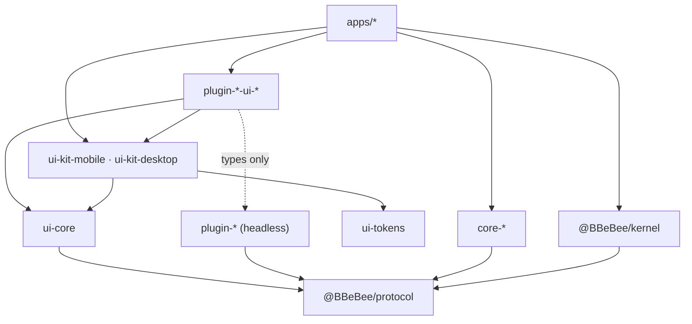

# 09 — Project Structure

> **What this answers.** The monorepo layout, the dependency rules that are mechanically enforced,
> how each target is built, the pinned version matrix, and the testing strategy that keeps the
> platform abstraction from rotting.

---

## 1. Repository layout

```
B_Be_Bee/
├─ apps/
│  ├─ mobile/                       Expo app — the mobile shell
│  │  ├─ app/                       expo-router routes
│  │  ├─ generated/plugins.ts       codegen: static plugin imports (03 §6.1)
│  │  ├─ app.config.ts
│  │  ├─ metro.config.js
│  │  └─ babel.config.js
│  └─ desktop/
│     ├─ main/                      Electron main — IPC hosts only, no domain logic
│     ├─ preload/                   contextBridge surface
│     ├─ renderer/                  React DOM shell + the Cordis kernel
│     └─ electron.vite.config.ts
│
├─ packages/
│  ├─ protocol/                     @BBeBee/protocol — types + contracts, ZERO runtime
│  │  ├─ src/services/              fs, http, db, secrets, audio, player, sources, ui …
│  │  ├─ src/entities/              Track, Album, StreamHandle, TransportState …
│  │  ├─ src/events.ts              the typed event map (07 §5)
│  │  └─ src/conformance/           shared contract test suites (04 §18)
│  │
│  ├─ kernel/                       @BBeBee/kernel — bootstrap, config, loader, capability gate
│  │  └─ src/migrations/            core schema migrations
│  │
│  ├─ core-paths-node/     ✅       ┐ platform implementations.
│  ├─ core-paths-expo/     ✅       │ The ONLY packages allowed to
│  ├─ core-fs-node/        ✅       │ import a platform SDK.
│  ├─ core-fs-expo/        ✅       │
│  ├─ core-db-node/        ✅       │ ✅ = built (M0)
│  ├─ core-db-expo/        ✅       │
│  ├─ core-store-fs/       ✅       │ shared: one impl, via ctx.fs (04 §4)
│  ├─ core-http-node/               │
│  ├─ core-http-rn/                 │
│  ├─ core-secrets-electron/        │
│  ├─ core-secrets-expo/            │
│  ├─ core-audio-webaudio/          │ (shared: react-native-audio-api on both)
│  └─ core-…                        ┘
│
│  ├─ plugin-player/                ┐
│  ├─ plugin-dsp/                   │ headless feature plugins.
│  ├─ plugin-effect-eq10/           │ Import @BBeBee/protocol
│  ├─ plugin-source-local/          │ and nothing else.
│  ├─ plugin-source-subsonic/       │
│  ├─ plugin-local-scanner/         │
│  ├─ plugin-download/              │
│  ├─ plugin-library/               │
│  ├─ plugin-lyrics/                │
│  ├─ plugin-cache/                 │
│  ├─ plugin-log-console/  ✅       │ logging transports: Cordis exporters,
│  ├─ plugin-log-file/     ✅       │ shared across platforms (04 §16)
│  ├─ plugin-log-buffer/   ✅       │
│  └─ plugin-…                      ┘
│
│  ├─ ui-tokens/                    design tokens as plain data (08 §6)
│  ├─ ui-core/                      framework-agnostic React hooks
│  ├─ ui-kit-mobile/                React Native components
│  ├─ ui-kit-desktop/               React DOM components
│  ├─ plugin-player-ui-mobile/      ┐ per-target view packages
│  ├─ plugin-player-ui-desktop/     ┘
│  │
│  └─ tooling/
│     ├─ eslint-config/             including the platform-SDK import ban
│     ├─ tsconfig/
│     ├─ gen-plugins/               the static manifest codegen
│     └─ create-plugin/             scaffolder: pnpm new:plugin
│
├─ docs/                            these documents
├─ pnpm-workspace.yaml
├─ turbo.json
└─ package.json
```

### Naming

| Prefix | Meaning |
|---|---|
| `core-<service>-<platform>` | A platform implementation of a core service |
| `plugin-<feature>` | A headless feature plugin |
| `plugin-<feature>-ui-<target>` | Views for one target |
| `plugin-source-<protocol>` | A music provider |
| `plugin-effect-<id>` | A DSP effect |
| `ui-*` | Shared UI infrastructure, not a plugin |

---

## 2. Package layering



Every arrow that is not into `@BBeBee/protocol` is a convenience. The arrows *into* `protocol` are
the architecture.

---

## 3. Dependency rules

Enforced by ESLint with `overrides` scoped by path, not by review. Each of these has a comment in
the config explaining which document section it protects.

```js
// packages/tooling/eslint-config/index.js — the rules that matter
const PLATFORM_SDKS = [
  'expo*', 'react-native', 'react-native/*', 'electron', 'node:*',
  'fs', 'path', 'crypto', 'child_process', 'better-sqlite3', 'music-metadata',
]

module.exports = {
  overrides: [
    {
      // 02 §1 — the invariant. Nothing outside core-* touches a platform SDK.
      files: ['packages/plugin-*/**', 'packages/ui-*/**', 'packages/protocol/**'],
      excludedFiles: ['packages/plugin-*-ui-*/**'],
      rules: { 'no-restricted-imports': ['error', { patterns: PLATFORM_SDKS }] },
    },
    {
      // 08 §1 — UI packages may render, but may not reach the platform.
      files: ['packages/plugin-*-ui-mobile/**', 'packages/ui-kit-mobile/**'],
      rules: { 'no-restricted-imports': ['error', {
        patterns: PLATFORM_SDKS.filter((p) => p !== 'react-native' && p !== 'react-native/*'),
      }] },
    },
    {
      // @BBeBee/protocol must stay runtime-free so it can be imported anywhere.
      files: ['packages/protocol/src/**'],
      excludedFiles: ['packages/protocol/src/conformance/**'],
      rules: { '@typescript-eslint/no-restricted-imports': ['error', { patterns: ['*'] }] },
    },
    {
      // 02 §2 — main is an IPC host. Domain logic there breaks platform symmetry.
      files: ['apps/desktop/main/**'],
      rules: { 'no-restricted-imports': ['error', { patterns: ['@BBeBee/plugin-*'] }] },
    },
  ],
}
```

A fifth rule is worth adding once the codebase exists: a check that no `plugin-*-ui-*` package
imports a *value* from its headless sibling, only types. `eslint-plugin-import`'s
`no-restricted-paths` with a type-only exception covers it.

---

## 4. Build pipelines

| Target | Bundler | Entry | Notes |
|---|---|---|---|
| Mobile | **Metro** | `apps/mobile/index.js` | Needs `unstable_enablePackageExports` for Cordis's ESM `exports` map, and `@babel/plugin-proposal-decorators` at `version: '2023-11'` |
| Desktop renderer | **Vite** | `apps/desktop/renderer/index.html` | Native ESM in dev; strict CSP extended with `BBeBee-plugin:` (03 §6.2) |
| Desktop main + preload | **electron-vite** | `apps/desktop/main/index.ts` | CJS output; externalises native deps |
| Packages | **tsup** (or `tsc` for `protocol`) | per-package `src/index.ts` | ESM only; `protocol` emits types only |
| Third-party plugins | tsup, ESM, externalising `@BBeBee/protocol` | `dist/index.js` | Must not bundle the protocol — it is provided by the host |

```jsonc
// metro.config.js — the parts that are not boilerplate
{
  "resolver": {
    "unstable_enablePackageExports": true,
    "unstable_conditionNames": ["react-native", "import", "require", "default"]
  },
  "watchFolders": ["<repo>/packages"]
}
```

Codegen (`packages/tooling/gen-plugins`) runs before every mobile build and in dev watch mode,
writing `apps/mobile/generated/plugins.ts`. Its output is **committed**, so a clean checkout builds
without a pre-step and CI can verify the file is up to date rather than regenerating it.

Turborepo orchestrates: `build` depends on `^build`, `typecheck` and `lint` run in parallel,
`test` depends on `build` for packages with conformance suites.

---

## 5. Version matrix

Verified against the npm registry on **2026-08-30**. Reverify before the first commit; several of
these move weekly.

| Package | Version | Note |
|---|---|---|
| `cordis` | **4.0.0-rc.9** | ⚠️ Release candidate — see §5.1 |
| `cosmokit` | ^1.8.1 | Cordis dependency |
| `@standard-schema/spec` | ^1.1.0 | Plugin `Config` validation |
| `expo` | 57.0.18 | SDK 57 |
| `react-native` | **0.86.3** | Pinned by Expo SDK 57; do not float to 0.87 |
| `react` | **19.2.3** | Pinned by Expo SDK 57. The desktop renderer must match |
| `expo-router` | ~57.0.17 | |
| `expo-audio` | ~57.0.4 | `expo-av` is discontinued and must not be used |
| `expo-file-system` | ~57.0.6 | `File`/`Directory` API; legacy at `expo-file-system/legacy` |
| `expo-sqlite` | ~57.0.2 | |
| `expo-secure-store` | ~57.0.2 | |
| `expo-background-task` | ~57.0.14 | Replaces `expo-background-fetch` |
| `expo-crypto` | ~57.0.2 | |
| `expo-dev-client` | ~57.0.16 | Required — Expo Go cannot host the native modules |
| `react-native-audio-api` | **0.13.3** | ⚠️ Pre-1.0 — see §5.2. Peer: `react-native-worklets >= 0.6.0` |
| `electron` | **44.0.0** | Requires Node ≥ 22.12, so `node:sqlite` is available |
| `electron-vite` | 5.0.0 | |
| `vite` | 8.2.2 | |
| `typescript` | 7.0.2 | ⚠️ If any tool in this matrix lags TS 7, pin the latest 5.x instead |
| `vitest` | 4.1.11 | |
| `zod` | 4.5.4 | Standard Schema compliant; Valibot or ArkType work equally |
| `pnpm` | 11.24.0 | Workspace manager |
| `turbo` | 2.10.12 | |
| `@shopify/flash-list` | 2.3.2 | Mobile list virtualisation |
| `@tanstack/react-virtual` | 3.14.10 | Desktop list virtualisation |
| `music-metadata` | 11.15.0 | Desktop tag reading, in `main` only |

### 5.1 The Cordis RC problem

`cordis@4.0.0-rc.9`'s own README says: *"Cordis is under active development. The API is not yet
stable and may change without notice."* The entire architecture rests on it. Mitigation, in order:

1. **Pin exactly.** `"cordis": "4.0.0-rc.9"` — no caret, no tilde. Renovate/Dependabot excluded for
   this package; upgrades are deliberate, manual, and their own PR.
2. **Keep the surface narrow.** The project uses `Context`, `Service`, `plugin`, `inject`,
   `effect`, the event methods, `isolate`, and `intercept` — a dozen entry points. Everything else
   Cordis offers is unused, so the blast radius of a change is bounded and auditable.
3. **Own the re-export.** `@BBeBee/kernel` re-exports what plugins need
   (`export { Service, Inject } from 'cordis'`) and **plugins import from the kernel, not from
   `cordis`**. If a signature changes, one adapter module absorbs it instead of 40 packages.
4. **Pin the tests.** `@BBeBee/protocol`'s conformance suite includes a small set of tests asserting
   Cordis semantics the design depends on — that a lost dependency unloads a plugin, that effects
   run in reverse order, that isolation is per-key. An upgrade that breaks an assumption fails CI
   with a pointed message rather than at runtime six weeks later.

### 5.2 The audio engine risk

`react-native-audio-api` at `0.13.x` is the other unpinned bet. Mitigated by ADR-4's structure:
`ctx.audio` is a service, its contract is the *standard* Web Audio API rather than the library's
own shape, and `core-audio-rntp` is a documented fallback
([05 §1](./05-audio-playback.md#escape-hatch)). Same pinning discipline as Cordis.

---

## 6. Testing strategy

Four layers, each catching something the others cannot.

| Layer | Tool | What it covers |
|---|---|---|
| **Unit** | Vitest | Pure logic: URN parsing, fractional indexing, smart-playlist compilation, the transport state machine against a mock `AudioService` |
| **Conformance** | Vitest (Node) + Detox (device) | Every `core-*` implementation against the shared suite in `@BBeBee/protocol/conformance` (04 §18). **The most important layer** |
| **Integration** | Vitest with an in-memory context | A real Cordis context, real feature plugins, fake core services. Covers plugin load order, waterfall composition, and unload completeness |
| **Device smoke** | Manual, per release | Lock screen, Bluetooth, headphone unplug, incoming call, gapless boundary, background survival (05 §7) |

Two tests that are worth writing before almost anything else, because they encode the
architecture's central claims:

```ts
// Claim: unload is total. (03 §2)
it('leaves nothing behind when disabled', async () => {
  const before = snapshotContext(ctx)         // listeners, timers, services, effects
  const fiber = await ctx.plugin(SomePlugin, config)
  await fiber.dispose()
  expect(snapshotContext(ctx)).toEqual(before)
})

// Claim: the player does not know downloads exist. (02 §5, 05 §2)
it('plays the same track with and without plugin-download', async () => {
  const withoutDl = await resolveVia(ctxWithout, urn)
  const withDl    = await resolveVia(ctxWith, urn)
  expect(withoutDl.kind).toBe('remote')
  expect(withDl.kind).toBe('local')
  expect(playerBehaviour(withoutDl)).toEqual(playerBehaviour(withDl))
})
```

The first is run parameterised over **every** plugin in the workspace. A plugin that leaks fails CI.

---

## 7. Developer workflow

```bash
pnpm install
pnpm gen:plugins            # refresh the static plugin manifest

pnpm dev:desktop            # electron-vite dev server, HMR on both processes
pnpm dev:mobile             # expo start --dev-client

pnpm new:plugin             # scaffolder: name, kind, targets → a working package
pnpm typecheck && pnpm lint && pnpm test
pnpm build:desktop          # electron-builder → dmg / nsis / AppImage
pnpm build:mobile           # eas build
```

The scaffolder is not a nicety. With a three-package convention, a manifest format, a capability
list, and a conformance suite to wire up, hand-rolling a plugin means getting one of them wrong.
`pnpm new:plugin` emits the headless package, optional UI packages, a valid
`BBeBee.plugin.json`, a passing smoke test, and the docs stub.

### Local checklist before opening a PR

- [ ] `pnpm typecheck lint test` clean.
- [ ] New plugin passes the leak test in §6.
- [ ] New core service implementation passes its conformance suite **on both platforms**.
- [ ] No new import that the §3 rules would have to be widened to permit.
- [ ] Version matrix updated if a dependency moved.

---

## 8. Where to go next

[10 — Roadmap & Risks](./10-roadmap.md) sequences the build.
