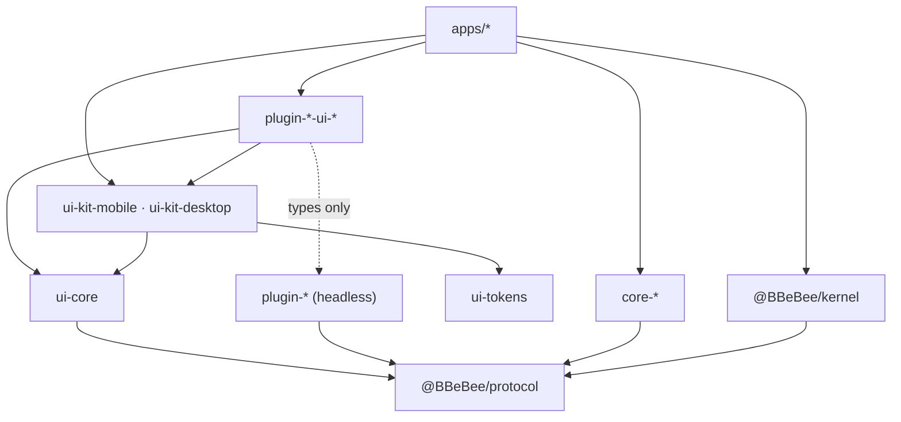

# 09 — Project Structure

> **What this answers.** The monorepo layout, the dependency rules that are mechanically enforced,
> how each target is built, the pinned version matrix, and the testing strategy that keeps the
> platform abstraction from rotting.

---

## 1. Repository layout

```
B_Be_Bee/
├─ apps/
│  ├─ mobile/                       Expo app — the mobile shell
│  │  ├─ app/                       expo-router routes
│  │  ├─ generated/plugins.ts       codegen: static plugin imports (03 §6.1)
│  │  ├─ app.config.ts
│  │  ├─ metro.config.js
│  │  └─ babel.config.js
│  └─ desktop/
│     ├─ main/                      Electron main — IPC hosts only, no domain logic
│     ├─ preload/                   contextBridge surface
│     ├─ renderer/                  React DOM shell + the Cordis kernel
│     └─ electron.vite.config.ts
│
├─ packages/
│  ├─ protocol/                     @BBeBee/protocol — types + contracts, ZERO runtime
│  │  ├─ src/services/              fs, http, db, secrets, audio, player, sources, ui …
│  │  ├─ src/entities/              Track, Album, StreamHandle, TransportState …
│  │  ├─ src/events.ts              the typed event map (07 §5)
│  │  └─ src/conformance/           shared contract test suites (04 §18)
│  │
│  ├─ kernel/                       @BBeBee/kernel — bootstrap, config, loader, capability gate
│  │  └─ src/migrations/            core schema migrations
│  │
│  ├─ core-paths-node/     ✅       ┐ platform implementations.
│  ├─ core-paths-expo/     ✅       │ The ONLY packages allowed to
│  ├─ core-fs-node/        ✅       │ import a platform SDK.
│  ├─ core-fs-expo/        ✅       │
│  ├─ core-db-node/        ✅       │ ✅ = built (M0)
│  ├─ core-db-expo/        ✅       │
│  ├─ core-store-fs/       ✅       │ shared: one impl, via ctx.fs (04 §4)
│  ├─ core-http-node/               │
│  ├─ core-http-rn/                 │
│  ├─ core-js-quickjs-node/         │ ctx.js — the source sandbox (04 §19)
│  ├─ core-js-quickjs-rn/           │
│  ├─ core-device-electron/ ✅      │ ctx.device — network, battery, media keys
│  ├─ core-device-expo/             │
│  ├─ core-background-electron/ ✅  │ ctx.background — wake locks, suspend
│  ├─ core-background-expo/         │
│  ├─ core-media-session-electron/ ✅ ctx.mediaSession — the OS now-playing surface
│  ├─ core-media-session-rn/        │
│  ├─ core-secrets-electron/        │
│  ├─ core-secrets-expo/            │
│  ├─ core-audio-webaudio/          │ (shared: react-native-audio-api on both)
│  └─ core-…                        ┘
│
│  ├─ source-rules/                 ┐ the rule language: parser, engines,
│  │                                │ combinators, coercion. Pure logic —
│  │                                │ no Cordis, no platform, no I/O (06 §3)
│  ├─ plugin-source-runtime/        │ binds source-rules to ctx.http · ctx.js
│  ├─ plugin-player/                │ headless feature plugins.
│  ├─ plugin-dsp/                   │ Import @BBeBee/protocol
│  ├─ plugin-effect-eq10/           │ and nothing else.
│  ├─ plugin-source-local/          │ the one provider that is not a string
│  ├─ plugin-local-scanner/         │
│  ├─ plugin-download/              │
│  ├─ plugin-library/               │
│  ├─ plugin-lyrics/                │
│  ├─ plugin-cache/                 │
│  ├─ plugin-log-console/  ✅       │ logging transports: Cordis exporters,
│  ├─ plugin-log-file/     ✅       │ shared across platforms (04 §16)
│  ├─ plugin-log-buffer/   ✅       │
│  └─ plugin-…                      ┘
│
│  ├─ plugin-ui/           ✅       the ctx.ui contribution registry
│  ├─ plugin-sources/      ✅       the ctx.sources registry + catalogue (06 §4.1)
│  ├─ plugin-inspector/    ✅       fiber tree + labelled effects (M0 exit criterion)
│  ├─ plugin-hello/        ✅       the M0 demonstration plugin
│  ├─ core-desktop-bridge/ ✅       renderer↔main IPC clients + the main-side host
│
│  ├─ ui-tokens/           ✅       design tokens as plain data, plus the
│  │                                WCAG AA gate of 08 §8
│  ├─ ui-core/            ✅       framework-agnostic React hooks, and the
│  │                                prop types both kits share
│  ├─ ui-parity/          ✅       the component contract, and the check that
│  │                                both kits meet it (08 §6)
│  ├─ ui-kit-mobile/      ✅       React Native components
│  ├─ ui-kit-desktop/     ✅       React DOM components
│  ├─ plugin-hello-ui-desktop/ ✅   ┐ per-target view packages
│  ├─ plugin-hello-ui-mobile/  ✅   ┘
│  ├─ plugin-source-runtime-ui-desktop/ ┐ source list, import review,
│  ├─ plugin-source-runtime-ui-mobile/  ┘ editor, rule tracer (08 §4)
│  │
│  ├─ tooling-gen-plugins/  ✅      the static registry codegen (pnpm gen:plugins)
│  └─ tooling-create-plugin/ ✅     the scaffolder (pnpm new:plugin)
│
├─ fixtures/sources/                example source documents; the golden corpus (§6)
├─ docs/                            these documents
├─ eslint.config.js                 flat config; the architectural rules live here
├─ vitest.config.ts
├─ pnpm-workspace.yaml
└─ package.json
```

### Naming

| Prefix | Meaning |
|---|---|
| `core-<service>-<platform>` | A platform implementation of a core service |
| `plugin-<feature>` | A headless feature plugin |
| `plugin-<feature>-ui-<target>` | Views for one target |
| `plugin-effect-<id>` | A DSP effect |
| `ui-*` | Shared UI infrastructure, not a plugin |

There is deliberately **no `plugin-source-<protocol>` prefix any more**. A music backend is a
source document ([06](./06-music-sources.md)), not a package. The only two packages with `source`
in the name are `plugin-source-runtime`, which interprets documents, and `plugin-source-local`,
which has no HTTP to describe ([06 §12](./06-music-sources.md#12-what-is-not-a-string-local-files)).
The example documents this repository ships live in `fixtures/sources/`, not in `packages/`.

---

## 2. Package layering



Every arrow that is not into `@BBeBee/protocol` is a convenience. The arrows *into* `protocol` are
the architecture.

---

## 3. Dependency rules

Enforced by ESLint with `overrides` scoped by path, not by review. Each of these has a comment in
the config explaining which document section it protects.

```js
// eslint.config.js — the rules that matter
const PLATFORM_SDKS = [
  'expo', 'expo-*', 'expo/*', 'react-native', 'react-native/*', 'react-native-*',
  'electron', 'electron/*', 'node:*', 'fs', 'fs/promises', 'path', 'os', 'crypto',
  'child_process', 'better-sqlite3', 'music-metadata', 'ws',
]

export default tseslint.config(
  {
    // 02 §1 — the invariant. Nothing outside core-* touches a platform SDK.
    files: ['packages/plugin-*/**/*.ts', 'packages/ui-*/**/*.ts', 'packages/protocol/**/*.ts'],
    ignores: ['packages/plugin-*-ui-*/**/*.ts'],
    rules: { 'no-restricted-imports': ['error', { patterns: PLATFORM_SDKS }] },
  },
  {
    // 02 §1 and 06 §3 — the rule engine is pure logic: no platform, and no I/O
    // either. It takes a document and a string and returns a value; every fetch
    // belongs to plugin-source-runtime. Keeping it pure is what makes the rule
    // corpus in §6 runnable without a network.
    files: ['packages/source-rules/**/*.ts'],
    rules: {
      'no-restricted-imports': [
        'error',
        { patterns: [...PLATFORM_SDKS, 'cordis', '@BBeBee/kernel'] },
      ],
    },
  },
  {
    // 08 §1 — UI packages may render, but may not reach the platform.
    files: ['packages/plugin-*-ui-mobile/**/*.ts', 'packages/ui-kit-mobile/**/*.ts'],
    rules: {
      'no-restricted-imports': [
        'error',
        { patterns: PLATFORM_SDKS.filter((p) => !p.startsWith('react-native')) },
      ],
    },
  },
  {
    // @BBeBee/protocol must stay runtime-free so it is safe to import anywhere.
    // `^[^.]` matches bare specifiers only, leaving relative imports alone.
    files: ['packages/protocol/src/**/*.ts'],
    ignores: ['packages/protocol/src/conformance/**/*.ts', '**/*.test.ts'],
    rules: {
      'no-restricted-imports': [
        'error',
        { patterns: [{ regex: '^[^.]', allowTypeImports: true }] },
      ],
    },
  },
  {
    // 02 §2 — main is an IPC host. Domain logic there breaks platform symmetry.
    files: ['apps/desktop/main/**/*.ts'],
    rules: { 'no-restricted-imports': ['error', { patterns: ['@BBeBee/plugin-*'] }] },
  },
  {
    // Tests are not shipped, so the SDK ban does not apply: a conformance
    // harness legitimately needs `node:fs` to build a scratch directory.
    files: ['**/*.test.ts'],
    rules: { 'no-restricted-imports': 'off' },
  },
)
```

Two rules deliberately live in **tests** rather than ESLint, because a lint rule whose selector
cannot be verified is worse than none: `conventions.test.ts` scans for un-awaited `ctx.plugin()`
(with a self-test proving the detector fires), and the `*-scope` conformance suites check the
capability gates. See [§6](#6-testing-strategy).

Still to add: a check that no `plugin-*-ui-*` package imports a *value* from its headless sibling,
only types. `eslint-plugin-import`'s `no-restricted-paths` with a type-only exception covers it.
The scaffolder already emits the right shape — the headless package is a `devDependency` of its
view packages — but nothing yet enforces it.

---

## 4. Build pipelines

| Target | Bundler | Entry | Notes |
|---|---|---|---|
| Mobile | **Metro** | `apps/mobile/index.js` | Needs `unstable_enablePackageExports` for Cordis's ESM `exports` map, and `@babel/plugin-proposal-decorators` at `version: '2023-11'` |
| Desktop renderer | **Vite** | `apps/desktop/renderer/index.html` | Native ESM in dev; strict CSP, **not** extended — nothing loads foreign code (02 §2) |
| Desktop main + preload | **electron-vite** | `apps/desktop/main/index.ts` | CJS output; externalises native deps |
| Packages | **tsup** (or `tsc` for `protocol`) | per-package `src/index.ts` | ESM only; `protocol` emits types only |
| QuickJS WASM | copied as an asset | `core-js-quickjs-node` | Bundled, never fetched — the CSP forbids fetching it, and a sandbox that downloads its own engine is not one (04 §19) |

```jsonc
// metro.config.js — the parts that are not boilerplate
{
  "resolver": {
    "unstable_enablePackageExports": true,
    "unstable_conditionNames": ["react-native", "import", "require", "default"]
  },
  "watchFolders": ["<repo>/packages"]
}
```

Codegen (`packages/tooling-gen-plugins`, run as `pnpm gen:plugins`) writes
`apps/{mobile,desktop}/generated/plugins.ts`. Its output is **committed**, so a clean checkout
builds without a pre-step and CI verifies the file is current rather than regenerating it — run it
whenever a plugin package is added or removed.

Turborepo orchestrates: `build` depends on `^build`, `typecheck` and `lint` run in parallel,
`test` depends on `build` for packages with conformance suites.

---

## 5. Version matrix

Verified against the npm registry on **2026-08-30**. Reverify before the first commit; several of
these move weekly.

| Package | Version | Note |
|---|---|---|
| `cordis` | **4.0.0-rc.9** | ⚠️ Release candidate — see §5.1 |
| `cosmokit` | ^1.8.1 | Cordis dependency |
| `@standard-schema/spec` | ^1.1.0 | Plugin `Config` validation |
| `expo` | 57.0.18 | SDK 57 |
| `react-native` | **0.86.3** | Pinned by Expo SDK 57; do not float to 0.87 |
| `react` | **19.2.3** | Pinned by Expo SDK 57. The desktop renderer must match |
| `expo-router` | ~57.0.17 | |
| `expo-audio` | ~57.0.4 | `expo-av` is discontinued and must not be used |
| `expo-file-system` | ~57.0.6 | `File`/`Directory` API; legacy at `expo-file-system/legacy` |
| `expo-sqlite` | ~57.0.2 | |
| `expo-secure-store` | ~57.0.2 | |
| `expo-background-task` | ~57.0.14 | Replaces `expo-background-fetch` |
| `expo-crypto` | ~57.0.2 | |
| `expo-dev-client` | ~57.0.16 | Required — Expo Go cannot host the native modules |
| `react-native-audio-api` | **0.13.3** | ⚠️ Pre-1.0 — see §5.2. Peer: `react-native-worklets >= 0.6.0` |
| `electron` | **44.0.0** | Requires Node ≥ 22.12, so `node:sqlite` is available |
| `electron-vite` | 5.0.0 | |
| `vite` | 8.2.2 | |
| `typescript` | 7.0.2 | ⚠️ If any tool in this matrix lags TS 7, pin the latest 5.x instead |
| `vitest` | 4.1.11 | |
| `zod` | 4.5.4 | Standard Schema compliant; Valibot or ArkType work equally |
| `pnpm` | 11.24.0 | Workspace manager |
| `turbo` | 2.10.12 | |
| `@shopify/flash-list` | 2.3.2 | Mobile list virtualisation |
| `@tanstack/react-virtual` | 3.14.10 | Desktop list virtualisation |
| `music-metadata` | 11.15.0 | Desktop tag reading, in `main` only |
| `quickjs-emscripten` | **0.31.0** | ⚠️ `ctx.js` on desktop. Pin exactly; the WASM asset is bundled, not fetched (04 §19) |
| `react-native-quickjs` | **0.4.x** | ⚠️ `ctx.js` on mobile — a native module, so it forces a dev-client rebuild. See §5.3 |

### 5.1 The Cordis RC problem

`cordis@4.0.0-rc.9`'s own README says: *"Cordis is under active development. The API is not yet
stable and may change without notice."* The entire architecture rests on it. Mitigation, in order:

1. **Pin exactly.** `"cordis": "4.0.0-rc.9"` — no caret, no tilde. Renovate/Dependabot excluded for
   this package; upgrades are deliberate, manual, and their own PR.
2. **Keep the surface narrow.** The project uses `Context`, `Service`, `plugin`, `inject`,
   `effect`, the event methods, `isolate`, and `intercept` — a dozen entry points. Everything else
   Cordis offers is unused, so the blast radius of a change is bounded and auditable.
3. **Own the re-export.** `@BBeBee/kernel` re-exports what plugins need
   (`export { Service, Inject } from 'cordis'`) and **plugins import from the kernel, not from
   `cordis`**. If a signature changes, one adapter module absorbs it instead of 40 packages.
4. **Pin the tests.** `@BBeBee/protocol`'s conformance suite includes a small set of tests asserting
   Cordis semantics the design depends on — that a lost dependency unloads a plugin, that effects
   run in reverse order, that isolation is per-key. An upgrade that breaks an assumption fails CI
   with a pointed message rather than at runtime six weeks later.

### 5.2 The audio engine risk

`react-native-audio-api` at `0.13.x` is the other unpinned bet. Mitigated by ADR-4's structure:
`ctx.audio` is a service, its contract is the *standard* Web Audio API rather than the library's
own shape, and `core-audio-rntp` is a documented fallback
([05 §1](./05-audio-playback.md#escape-hatch)). Same pinning discipline as Cordis.

---

### 5.3 The evaluator risk

`ctx.js` is a third pre-1.0 bet, and it arrived with
[ADR-5](./01-overview.md#adr-5--music-sources-are-imported-strings-interpreted-by-one-runtime)
rather than being chosen at leisure. Two QuickJS bindings, two build systems, one of them a native
module on a platform where native modules are expensive to change.

The mitigation is the same shape as the other two, and it is why `ctx.js` is a *service* rather
than an import inside `plugin-source-runtime`: the contract is "evaluate this string in a realm
with these limits and this host surface", which is satisfiable by QuickJS, by
`isolated-vm`-shaped embeddings, and — with a worse story on limits — by a `Worker`. The
conformance suite tests the contract, including that a `while (true)` is interrupted and that a
host object cannot be retained across the boundary, so a swap is a package change rather than a
redesign.

⚠️ The one thing that would genuinely hurt is a target where **no** interpreter can be embedded.
That is not the case on either target today, and it is the trigger to reconsider the whole rule
language if it ever becomes one.

---

## 6. Testing strategy

Four layers, each catching something the others cannot.

| Layer | Tool | What it covers |
|---|---|---|
| **Unit** | Vitest | Pure logic: URN parsing, fractional indexing, smart-playlist compilation, the transport state machine against a mock `AudioService` |
| **Conformance** | Vitest (Node) + Detox (device) | Every `core-*` implementation against the shared suite in `@BBeBee/protocol/conformance` (04 §18). **The most important layer** |
| **Integration** | Vitest with an in-memory context | A real Cordis context, real feature plugins, fake core services. Covers plugin load order, waterfall composition, and unload completeness |
| **Source corpus** | Vitest, against recorded HTTP fixtures | Every example document in `fixtures/sources/` replayed end to end — search, explore, album, stream — with its responses recorded, so a rule-engine change that breaks real documents fails CI |
| **Device smoke** | Manual, per release | Lock screen, Bluetooth, headphone unplug, incoming call, gapless boundary, background survival (05 §7) |

Two tests that are worth writing before almost anything else, because they encode the
architecture's central claims:

```ts
// Claim: unload is total. (03 §2)
it('leaves nothing behind when disabled', async () => {
  const before = snapshotContext(ctx)         // listeners, timers, services, effects
  const fiber = await ctx.plugin(SomePlugin, config)
  await fiber.dispose()
  expect(snapshotContext(ctx)).toEqual(before)
})

// Claim: the player does not know downloads exist. (02 §5, 05 §2)
it('plays the same track with and without plugin-download', async () => {
  const withoutDl = await resolveVia(ctxWithout, urn)
  const withDl    = await resolveVia(ctxWith, urn)
  expect(withoutDl.kind).toBe('remote')
  expect(withDl.kind).toBe('local')
  expect(playerBehaviour(withoutDl)).toEqual(playerBehaviour(withDl))
})
```

The first is run parameterised over **every** plugin in the workspace. A plugin that leaks fails CI.

A third belongs beside them once sources exist, because it is the claim the whole string model
rests on:

```ts
// Claim: a source is data, and the runtime is the only interpreter. (06 §1.1)
it('plays from a document nobody compiled', async () => {
  await ctx.sources.import(await readFixture('subsonic.json'))
  const hit = await ctx.sources.searchAll({ text: 'radiohead' })
  const handle = await ctx.sources.forUrn(firstUrn(hit))!.resolveStream(id, prefs)
  expect(handle.target).toMatch(/^https:\/\/music\.example\.org\/rest\/stream/)
})
```

The corpus suite is the one that decays without attention: recorded fixtures drift from live
backends, and a green corpus with a broken real source is the failure mode to watch for. The
`check` command ([06 §10](./06-music-sources.md#10-diagnosing-a-broken-source)) run against live
servers, by hand, per release, is the counterweight — the same shape as the device smoke matrix,
and honestly manual for the same reason.

---

## 7. Developer workflow

### First run

```bash
pnpm install                 # pnpm 11+, Node 22.12+
pnpm check                   # typecheck + lint + test — should be green on a clean checkout
```

`pnpm check` is the whole gate. If it passes, CI passes. Run it before pushing; nothing else in
this section is required reading until something goes wrong.

### Everyday commands

| Command | What it does |
|---|---|
| `pnpm check` | `typecheck` + `lint` + `test`. The one command before a PR |
| `pnpm test` | Vitest once over every package |
| `pnpm test:watch` | Vitest in watch mode — what to leave running while working |
| `pnpm typecheck` | `tsc --noEmit` in every package **and** both apps |
| `pnpm lint` / `pnpm lint:fix` | ESLint, including the architectural rules in [§3](#3-dependency-rules) |
| `pnpm build` | Emit `dist/` for every package |
| `pnpm clean` | Remove `dist/`, `out/`, and build info |

Run a single package's tests by path — `pnpm test packages/core-fs-node` — or a single file.

### Running the apps

| Command | What it does | What it needs |
|---|---|---|
| `pnpm dev:desktop` | `electron-vite dev` — HMR across main, preload and renderer | The Electron binary (fetched by `pnpm install`; needs network on first install) |
| `pnpm build:desktop` | Production bundles into `apps/desktop/out/` | — |
| `pnpm dev:mobile` | `expo start --dev-client` | A **custom dev build** on a device or emulator — see below |

> ⚠️ **Mobile needs a custom dev build, not Expo Go.** `react-native-audio-api`, `expo-sqlite` and
> `expo-file-system` all contain native code, so Expo Go cannot host this app. Build the dev client
> once per native-dependency change (`pnpm --filter @BBeBee/mobile exec expo run:android`), then
> `pnpm dev:mobile` attaches to it.

> ⚠️ **Packaging is not set up yet.** `build:desktop` produces bundles, not an installer;
> `electron-builder` (dmg / nsis / AppImage) and `eas build` for mobile arrive with the first
> release, not M0.

### Adding a plugin

```bash
pnpm new:plugin --name scrobble --kind feature --ui desktop --capabilities db:own
pnpm install                 # link the new workspace package
pnpm gen:plugins             # add it to both shells' static registries
pnpm check                   # already green — the template ships passing tests
```

| Flag | Values | Effect |
|---|---|---|
| `--name` | lowercase, hyphenated | `scrobble` → `@BBeBee/plugin-scrobble` |
| `--kind` | `feature` (default), `effect` | Sets the package prefix. There is no `source` kind: a music backend is a document, not a package |
| `--ui` | `none` (default), `desktop`, `mobile`, `both` | Emits the per-target view packages of [08 §1](./08-ui-architecture.md#1-the-three-package-convention) |
| `--capabilities` | comma-separated | Written into `BBeBee.plugin.json` ([03 §7](./03-plugin-system.md#7-capability-model)) |

The scaffolder is not a nicety. With a three-package convention, a manifest format, a capability
list, and a leak test to wire up, hand-rolling a plugin means getting one of them wrong — usually
the one that fails *silently*. The template ships the correct `await ctx.plugin(...)` form and a
leak test, both of which cost a debugging session to discover the hard way.

### Adding a music source

Not a development task at all, which is the point. In the app: **Settings → Sources → Import**,
paste the string, review what it says it will do, confirm
([06 §9](./06-music-sources.md#9-importing-updating-and-sharing)). No install, no rebuild, no
restart.

Two commands exist for working on the *documents this repository ships* in `fixtures/sources/`:

| Command | What it does |
|---|---|
| `pnpm source:check <file>` | Runs [06 §10](./06-music-sources.md#10-diagnosing-a-broken-source)'s health check against the live backend and prints the trace. Needs network and, for anything authenticated, credentials in the environment |
| `pnpm source:record <file>` | Replays the same steps and writes the HTTP fixtures the corpus suite ([§6](#6-testing-strategy)) replays offline |

**After adding or removing a plugin, run `pnpm gen:plugins`.** Metro cannot resolve a runtime path,
so both shells read a generated registry of static imports ([§4](#4-build-pipelines)). The output
is committed; CI checks it is current rather than regenerating it.

### What each gate actually catches

Worth knowing, because a failure in one of these usually means an architectural mistake rather
than a typo:

| Gate | Catches |
|---|---|
| `no-restricted-imports` | A plugin reaching for a platform SDK instead of a `ctx.*` service ([02 §1](./02-architecture.md#the-invariant)) |
| Conformance suites | Two implementations of one service drifting apart — the thing they exist for |
| `*-scope` suites | A capability gate that holds on one platform and not the other |
| Leak test (`diffSnapshots`) | A plugin that does not unload cleanly ([§6](#6-testing-strategy)) |
| `conventions.test.ts` | An un-awaited `ctx.plugin()`, which silently fails to propagate readiness |

### When something goes wrong

| Symptom | Cause |
|---|---|
| Metro: *cannot resolve `cordis`* | `unstable_enablePackageExports` missing from `metro.config.js` — Cordis is ESM-only with an `exports` map ([04 §17](./04-core-services.md#17-runtime-compatibility-checklist)) |
| `@Inject` fails at runtime, compiles fine | Legacy decorators. Babel needs `{ version: '2023-11' }`; `tsconfig` must not set `experimentalDecorators` |
| A plugin sits in `pending` forever | An injected service never became ACTIVE. `ctx.inspector.render()` prints the tree and names what each fiber waits for |
| `app.start()` resolves but a service is not ready | An un-awaited `ctx.plugin()` somewhere. `pnpm test packages/kernel` will name the file |
| `CapabilityError: … may not …` | The manifest is missing a capability, or the path/table is genuinely out of scope. Widen the manifest, never the gate |
| `CapabilityError: host … not allowed` from a source | The document's rules reach a host it did not declare. Add it to `allowedHosts` and re-import, so the user sees it (06 §8) |
| A source returns nothing, with no error | A rule matched nothing where the field was optional. The rule tracer names the step (06 §10); `check` finds it before a user does |
| `JsTimeoutError` in a source | An `@js:` block looped, or awaited a request that never resolved. Limits are per evaluation and not configurable per source (04 §19) |
| Renderer: *preload bridge is missing* | The renderer loaded without `preload/index.cjs` — rebuild, since preload must be CJS |
| Electron will not launch on a headless machine | Expected. It needs `libgtk-3`, `libnss3` and a display; the bundles still build |

### Local checklist before opening a PR

- [ ] `pnpm check` clean.
- [ ] `pnpm gen:plugins` produces no diff.
- [ ] New plugin passes the leak test in [§6](#6-testing-strategy).
- [ ] New core service implementation passes its conformance suite — **and its `*-scope` suite, on
      every implementation of that service**, not only the one you changed.
- [ ] No new import that the [§3](#3-dependency-rules) rules would have to be widened to permit.
- [ ] Version matrix updated if a dependency moved.
- [ ] If the rule engine changed, the source corpus ([§6](#6-testing-strategy)) is green — and if
      a fixture had to be re-recorded, say why in the PR, because a silently re-recorded fixture
      hides a real behaviour change.

---

## 8. Where to go next

[10 — Roadmap & Risks](./10-roadmap.md) sequences the build.
