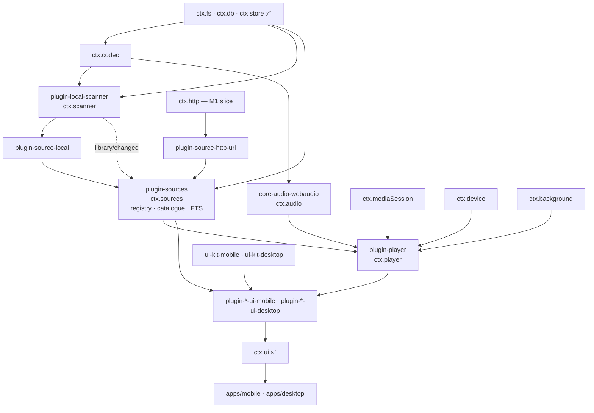
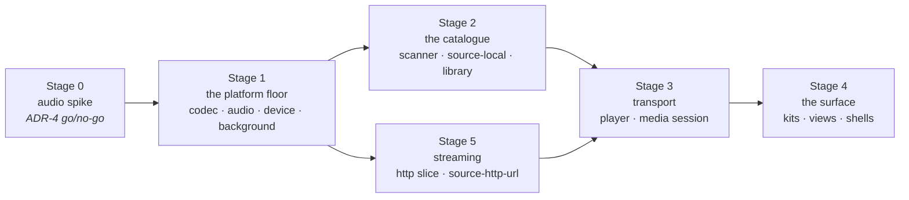
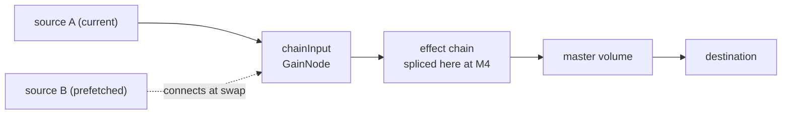

# 11 — M1 Execution Plan: It plays music

> **What this answers.** What M1 builds, in what order, what "done" means for each package, and
> how every exit criterion in [10 §M1](./10-roadmap.md#m1--it-plays-music) is actually verified.
> [10](./10-roadmap.md) says *what* the milestones are; this says *how* this one gets built.

M0 proved the kernel: one plugin graph, two platforms, total unload, conformant core services. It
proved nothing about the application, because nothing in M0 makes a sound.

M1 is where four claims stop being design and become code that either works or does not.

| Claim | Stated in | What M1 does to it |
|---|---|---|
| One Web Audio graph plays and processes audio on iOS, Android and Electron | [ADR-4](./01-overview.md#adr-4--react-native-audio-api-is-the-primary-playback-and-dsp-engine-on-every-target) | Buffered and streamed playback on all three targets, with lock-screen control and background survival |
| The provider SPI is an abstraction, not a description of one backend | [06 §1](./06-music-sources.md#1-the-contract) | Two providers at opposite ends of the optional surface: `plugin-source-local` and `plugin-source-http-url` |
| The player does not know where bytes come from | [02 §5](./02-architecture.md#5-composition-how-features-reach-each-other) | `player/before-resolve` becomes a live waterfall with two possible answers, one local and one remote |
| One plugin contributes UI to two shells that share no component code | [ADR-2](./01-overview.md#adr-2--the-ui-is-split-react-native-on-mobile-react-dom-on-desktop) | Five screens per shell, from headless packages plus per-target view packages |

The sequencing principle from [10](./10-roadmap.md) holds inside the milestone too: **the audio
spike comes before anything that depends on it** (§3.1). Everything else in M1 is recoverable
work; ADR-4 is not.

---

## 1. Scope

### 1.1 In

| Area | Packages | Delivers |
|---|---|---|
| Audio engine | `core-audio-webaudio` | `ctx.audio` — one implementation, both targets |
| Decoding & tags | `core-codec-node`, `core-codec-rn` | `ctx.codec` — metadata, artwork, PCM, format support |
| OS surfaces | `core-media-session-electron`, `core-media-session-rn`, `core-device-electron`, `core-device-expo`, `core-background-electron`, `core-background-expo` | Lock screen, notification, MPRIS/SMTC/Now Playing, media keys, network state, wake locks, suspend hooks |
| Network (slice) | `core-http-node`, `core-http-rn` | `ctx.http` restricted to GET/HEAD, headers, `Range`, streaming, progress — MD-1 |
| Sources & catalogue | `plugin-sources`, `plugin-source-local`, `plugin-source-http-url` | `ctx.sources` — registration, discovery, and the catalogue cache those answers land in |
| Scanning | `plugin-local-scanner` | `ctx.scanner` — roots, incremental walk, tag and artwork import |
| Playback | `plugin-player` | `ctx.player` — transport, queue, resolution, history, persistence |
| UI infrastructure | `ui-tokens`, `ui-core`, `ui-kit-mobile`, `ui-kit-desktop` | Tokens, hooks, and the parity component set |
| Views | `plugin-player-ui-*`, `plugin-sources-ui-*`, `plugin-local-scanner-ui-*` | Library, album, queue, now playing, scan-root settings |
| Shells | `apps/mobile`, `apps/desktop` | Background audio configuration, close-to-tray, bootstrap sets, new bridge hosts |
| Kernel & contracts | `@BBeBee/kernel`, `@BBeBee/protocol` | `db:write:core` (MD-4), the catalogue reads on `ctx.sources`, the `ctx.scanner` contract, the fractional-index helper |

### 1.2 Out

Deferred deliberately, with where each lands. Nothing here is blocked by an M1 decision.

| Deferred | Lands in | Why it can wait |
|---|---|---|
| Authentication, `ctx.secrets`, persistent cookie jars | M2 | No M1 provider has credentials. Building the jar with no backend to sign into tests nothing ([06 §4.1](./06-music-sources.md#41-session-persistence--cookies-survive-the-app)) |
| Cross-provider fan-out in anger, `track_links`, identity linking | M2 | `searchAll` exists and is exercised, but two providers — one of which cannot search — is not a fan-out. `ctx.sources.searchLocal` covers the catalogue in the meantime |
| `plugin-library` / `ctx.library` — playlists, favourites, collections | M2 | MD-3. None of M1's five screens curates anything, and the catalogue reads that used to justify the package now live on `ctx.sources` |
| `plugin-download`, bindings with `origin: 'download'` | M3 | The waterfall it hooks is live in M1 with no listeners — which is exactly the control arm its regression test compares against |
| `ctx.dsp` and every effect | M4 | The splice point exists in the M1 graph and stays empty (§4.2) |
| `plugin-loader-dynamic`, capability prompts, quarantine | M5 | Every M1 plugin is `builtin` |
| Command palette, context menus, drag-to-reorder, tray mini-player, detached window | M2+ | MD-2 |
| Playlists, smart playlists, ratings, lyrics, scrobbling | M2+ | Not required to browse a library and press play |
| Packaging (`electron-builder`, `eas build`) | First release | Already noted in [09 §7](./09-project-structure.md#running-the-apps) |

### 1.3 Milestone decisions

Six decisions taken for M1, in the shape of the ADRs and for the same reason: so a reader six
months from now can tell what was chosen from what was merely assumed.

**MD-1 — A minimal `ctx.http` ships in M1.**
GET and HEAD, arbitrary headers, `Range`, `stream()`, `onProgress`, timeout and abort. No cookie
jars, no `download()`, no auth interception.
*Why.* The risk register's early warning for ADR-4 is that "M1 exercises streaming, gapless, and
lock-screen controls". Local files exercise none of the streaming path — buffering, stall and
recovery, seek-by-range, an underrun that is not a pause. Discovering at M2 that the engine
handles streams badly is discovering it after `plugin-player` was written against it.
*Cost.* Two more packages in M1, and a conformance suite that M2 extends rather than replaces.
The suite is written so the deferred members are absent, not stubbed.

**MD-2 — The UI is real but narrow.**
Both kits are built properly — tokens, hooks, the parity component set, virtualisation,
accessibility — and are then spent on five screens: library (tracks and albums), album detail,
queue, now playing, and settings for scan roots and URL sources. No command palette, no
right-click menus, no drag-to-reorder, no tray mini-player.
*Why.* The expensive, hard-to-retrofit half of ADR-2 is the infrastructure: two token pipelines
that must agree, a shared hook layer, a parity test. The cheap half is more screens. Building
screens first and infrastructure later means writing the screens twice.
*Cost.* Desktop does not yet feel like a desktop app, so ADR-2's premise stays unproven until the
desktop-only interactions land in M2.

**MD-3 — `ctx.sources` owns the catalogue; `ctx.library` is curation, and moves to M2.**
Three services, three responsibilities, no overlap:

| Service | Package | Owns |
|---|---|---|
| `ctx.sources` | `plugin-sources` | Which backends exist, and what they hold: registration, lookup by URN, the search fan-out, the catalogue cache, and the FTS5 index |
| `ctx.library` | `plugin-library` | The user's curation: playlists, favourites, collections. **M2** |
| `ctx.player` | `plugin-player` | Playback: transport, queue, resolution, history |

The view packages call `ctx.sources` and never touch `ctx.db`.
*Why.* [06 §1](./06-music-sources.md#1-the-contract) already assigns the catalogue cache to
`ctx.sources` — "the provider … answers questions and returns plain data; `ctx.sources` caches the
answers into the catalogue tables" — so reads belong beside the writes rather than in a second
service that would have to agree with it. And [02 §6](./02-architecture.md#6-state-ownership)
requires catalogue access through *one* owning service: without that, the same SQL gets written in
`-ui-mobile` and `-ui-desktop`, which is the exact failure mode ADR-2's risk entry names.
*Consequence.* `plugin-library` has nothing left to do in M1 — none of MD-2's five screens curates
anything — so it moves to M2 with playlists. M1 carries one package fewer.
*Cost.* `plugin-sources` is doing two jobs that a fourth package (`ctx.catalog`) could separate:
knowing *who* the backends are, and caching *what* they said. If that seam starts to hurt, the
split is contained — the reads and the FTS index move together, and no consumer changes shape.

**MD-4 — `db:write:core` is added; `db:read:core` becomes read-only.** *(Landed.)*
`assertDb` gained a verb check: `db:read:core` permits `SELECT` against core tables, mutation
requires `db:write:core`, and `db:*:core` additionally permits `CREATE`/`DROP`/`ALTER`. The verbs
do not nest, so a plugin that reads and writes the catalogue declares both and the install-time
prompt can name exactly what it is asking for. Statements are classified by the most demanding
thing they do, so a `DROP` cannot ride in behind a `SELECT`. `plugin-sources`,
`plugin-source-local`, `plugin-local-scanner` and `plugin-player` all declare
`db:read:core` + `db:write:core`.
*Why.* `db:read:core` used to let any statement through, `INSERT` included. M1 is the first
milestone whose plugins write core tables, so it was the last cheap moment to fix the name —
before an install-time prompt in M5 says "read" while granting write.
*Where.* `classifyDbAccess` and the grant parser in `packages/kernel/src/capability.ts`, the
shared SQL reader in `packages/kernel/src/sql.ts`, and cases in the `db-scope` suite that both
`core-db-node` and the desktop bridge run; the grammar rows in
[03 §7](./03-plugin-system.md#capability-grammar).
*Also closed while in there*, each of which made the verbs meaningless on its own: a
schema-qualified `main.plugin_other_secrets` was attributed to a table called `main` and permitted
by the `core` fallback; a statement naming no visible table (`DROP INDEX`, `VACUUM`, `PRAGMA
foreign_keys = OFF`) skipped the gate entirely, since the per-table loop *is* the gate; the desktop
bridge kept a second list of forbidden SQL that had drifted, so `VACUUM INTO '/any/path'` wrote a
file past its containment checks; `core-db-expo` had no gate at all, so `db:own` meant one thing on
desktop and nothing on mobile; and both drivers silently executed only the first statement of a
multi-statement string, which would have let a migration record a version it had half-applied.

**MD-5 — Gapless, prefetch and crossfade are all in M1.**
The full [05 §2](./05-audio-playback.md#gapless-and-crossfade) behaviour: prefetch beginning at
`max(15s, crossfadeMs + 5s)` and cancelled by `AbortSignal` when the queue changes;
`AudioBufferQueueSourceNode` gapless for buffered sources; equal-power crossfade as the mutually
exclusive alternative; the setting is the three-way `gapless | crossfade | neither`.
*Why.* Gapless is the hardest thing M1 asks of `react-native-audio-api`, and it is named in the
ADR-4 early warning. Deferring it to M4 means learning the answer at M4, when the fallback costs a
rewrite of `plugin-player` rather than a re-scope of a milestone.
*Cost.* The most intricate code in M1, and a device smoke test that is a listening test.

**MD-6 — Desktop close-to-tray is in; the tray mini-player is not.**
Closing the window hides it, keeping the renderer — and therefore the kernel and the audio graph —
alive, with `powerSaveBlocker` held while playing. There is no tray UI beyond show and quit.
*Why.* [10 §M1](./10-roadmap.md#m1--it-plays-music) requires playback to survive window-hide, and
[ADR-3](./01-overview.md#adr-3--the-electron-kernel-lives-in-the-renderer-main-is-a-thin-native-host)
makes that a process-lifetime question rather than a UI one. The mini-player is UI, and MD-2
defers UI.

---

## 2. The package set

`✅` exists from M0 · `+` new in M1 · `~` existing, extended.

```
core-audio-webaudio         ✅  ctx.audio — shared implementation, all three targets
core-codec-node             ✅  ctx.codec — music-metadata over ctx.fs, bounded head read
core-codec-rn               +   ctx.codec — AudioDecoder plus a native tag reader
core-http-node              ✅  ctx.http (M1 slice) — fetch-shaped, transport is a seam
core-http-rn                +   ctx.http (M1 slice) — RN fetch / XHR
core-media-session-electron +   ctx.mediaSession — navigator.mediaSession + MPRIS/SMTC/Now Playing
core-media-session-rn       +   ctx.mediaSession — lock screen and media notification
core-device-electron        +   ctx.device — network, battery, media keys, hotkeys
core-device-expo            +   ctx.device
core-background-electron    +   ctx.background — powerSaveBlocker, intervals, suspend hooks
core-background-expo        +   ctx.background — audio session, expo-background-task
core-desktop-bridge         ~   hosts for codec, http, media session, device; preload surface
core-fs-node / -expo        ✅  toPlayableUri and canWatch get their first real consumer
core-db-node / -expo        ~   the db:write:core verb check (MD-4)

plugin-sources              ✅  ctx.sources — registry, discovery, catalogue cache, FTS index
plugin-source-local         ✅  MediaProvider over the filesystem, instance id 'local'
plugin-source-http-url      ✅  MediaProvider implementing the required core and nothing else
plugin-local-scanner        ✅  ctx.scanner — roots, incremental walk, tag and artwork import
plugin-player               ✅  ctx.player — transport, queue, resolution, history, persistence
plugin-ui                   ✅  gets its first non-trivial contributions
plugin-inspector            ✅  used to verify the M1 fiber tree unloads clean

ui-tokens                   +   design tokens as data
ui-core                     +   useService / useServiceState over useSyncExternalStore
ui-kit-mobile               +   the parity component set, React Native
ui-kit-desktop              +   the parity component set, React DOM
plugin-player-ui-*          +   now playing, mini player, transport, queue
plugin-sources-ui-*         +   library, album detail
plugin-local-scanner-ui-*   +   settings: scan roots and URL sources

protocol                    ✅  catalogue reads on ctx.sources, ctx.scanner, the fractional index,
                                the audio/codec conformance suites, the mock AudioService
kernel                      ~   db:write:core, bootstrap sets for the new core services
tooling-fixtures            +   dev-only: the 5,000-file corpus generator (§7)
```

Dependency direction — every arrow is an `inject`, and load order is derived from them, never
declared ([02 §3](./02-architecture.md#3-boot-sequence)):



---

## 3. Sequencing

Five stages. Each ends in something demonstrable, because a stage that cannot be demonstrated
cannot be shown to be finished.



### 3.1 Stage 0 — the audio spike

Before any package in §2 is written, one throwaway branch answers whether ADR-4 holds. It is not a
plugin, has no tests, and is deleted afterwards. It must show, **on an iOS device, an Android
device, and in Electron**:

- A local file decoded and played to completion, with `positionMs` advancing monotonically.
- A remote URL played as a stream, with a seek that lands and a deliberately induced stall that
  recovers rather than ending the source.
- Two buffered sources handed off through `AudioBufferQueueSourceNode` with no audible gap.
- A `GainNode` and a `BiquadFilterNode` constructed and connected — not for M1, but because M4 is
  bought with the same currency.
- Playback continuing with the app backgrounded (mobile) and the window hidden (desktop).
- Lock-screen or notification controls driving pause and resume.

**The decision point.** If any of the first three fails on a target and is not fixable within the
spike, `core-audio-rntp` over `react-native-track-player` becomes the mobile implementation
([05 §1](./05-audio-playback.md#escape-hatch)). The consequences are then recorded *before* Stage 1
starts rather than discovered later: no mobile DSP, so M4 becomes desktop-only; `chainInput`
becomes a no-op on mobile; MD-5 narrows to whatever the fallback engine offers. `ctx.player` and
every view package are unaffected — that is what the abstraction is for — but the milestone's
scope changes, and that is a decision to take deliberately.

### 3.2 Stage 1 — the platform floor

`core-codec-*`, `core-audio-webaudio`, `core-device-*`, `core-background-*`, and the bridge hosts
they need. No feature plugins.

**Demo.** A test that loads a bundled file through `ctx.codec` and `ctx.audio` and plays it, green
in Node with fakes, on an iOS simulator, on an Android emulator, and in Electron.

### 3.3 Stage 2 — the catalogue

`plugin-local-scanner`, `plugin-source-local`, and the catalogue half of `plugin-sources` (the
registry half is already built), plus the protocol changes they need (MD-3).

**Demo.** Point the scanner at a folder; `ctx.sources.listTracks()` returns it sorted and paged;
`ctx.sources.searchLocal('bjork')` finds `Björk`; a second scan of the unchanged folder reads no
file contents at all. Still nothing audible.

### 3.4 Stage 3 — transport

`plugin-player` and `core-media-session-*`.

**Demo.** From a test or the debug console: `playNow`, pause, seek, next, previous, reorder. The
lock screen shows the track and its buttons work. Kill and relaunch: the queue and position are
back, and nothing is playing.

### 3.5 Stage 4 — the surface

`ui-tokens`, `ui-core`, both kits, the view packages, both shells.

**Demo.** The exit criteria of [10 §M1](./10-roadmap.md#m1--it-plays-music), performed by a person
holding a phone and a person clicking a mouse.

### 3.6 Stage 5 — streaming (parallel with Stage 2)

`core-http-node`, `core-http-rn`, `plugin-source-http-url`. Depends only on Stage 1 and joins at
Stage 3, so it never sits on the critical path.

**Demo.** A URL configured as a source plays, seeks, survives a stall, and reports `stalled`
rather than `paused` while it recovers.

---

## 4. Work packages

Each is done when its boxes are ticked, `pnpm check` is green, and it passes the leak test
parameterised over the workspace ([09 §6](./09-project-structure.md#6-testing-strategy)). Those
three are assumed below rather than repeated.

### 4.1 `core-codec-node` · `core-codec-rn` — `ctx.codec`

Desktop reads tags with `music-metadata` **in `main`**, reached through `core-desktop-bridge`; PCM
decoding uses the renderer's `decodeAudioData` and needs no bridge at all. Mobile uses
`react-native-audio-api`'s `AudioDecoder` for PCM and a native tag reader for metadata.

`readMetadata` must not read the whole file. A 40 MB FLAC costs a header read and a seek to the
tag block, not 40 MB across an IPC channel — that is the difference between a 5,000-file scan
taking minutes and taking an afternoon.

- [ ] New `codecConformance` suite in `packages/protocol/src/conformance/`, run in Node and on
      device: tags, embedded artwork, duration probe, PCM decode, non-empty `supportedFormats()`.
- [ ] A conformance case asserts `readMetadata` stays under a byte ceiling on a large file.
- [ ] `supportedFormats()` reflects reality per platform; the ⚠️ in
      [04 §13](./04-core-services.md#13-ctxcodec--decoding-and-metadata) is honoured by
      *reporting* what could not be decoded, never by skipping it silently.
- [ ] The new bridge methods are capability-tagged and path-contained like every other host
      ([03 §7](./03-plugin-system.md#where-the-gate-actually-runs)).

### 4.2 `core-audio-webaudio` — `ctx.audio`

One package for both targets: `react-native-audio-api@0.13.3` on mobile, the same package's web
build or the renderer's native Web Audio on desktop. This is the package Stage 0 exists to
de-risk.

The M1 graph is the [05 §1](./05-audio-playback.md#graph-topology) topology with the chain empty:



`chainInput` is a real node from day one and sources connect to it, never to `destination`. M4
splices the chain between `chainInput` and master volume without touching a line of
`plugin-player`. M1 ships **no** placeholder chain and no `ctx.dsp`: an empty splice point is
honest, a pass-through chain is a lie that later has to be un-built.

- [ ] `load()` honours both strategies — `buffer` for local files and short remote ones, which is
      what makes MD-5's gapless possible, and `stream` otherwise.
- [ ] `onInterruption` and `onRouteChange` map each platform's events onto the contract's shape.
      The *policy* that consumes them lives in `plugin-player` (§4.9), not here.
- [ ] `listOutputDevices` / `setOutputDevice` are real on desktop; on mobile a single-entry list
      with the leak documented, never a thrown error.
- [ ] `outputLatencyMs` is reported, so M4 has something to compensate against.
- [ ] `audioConformance`: play, position advances, pause holds position, seek lands, `onEnded`
      fires exactly once, `dispose()` disconnects every node it created. Green against an
      `OfflineAudioContext` in Node and on device.

### 4.3 `core-device-*` · `core-background-*`

`ctx.device` supplies `network()` and `onNetworkChange` — where `StreamPrefs.saveData` comes from
— plus battery, media keys and hotkeys on desktop.

`ctx.background` supplies `canRunInBackground()`, `acquireWakeLock`, `schedule` (used in M1 only
by the mobile scan poller, since `ctx.fs.canWatch` is false there) and `onWillSuspend`, which is
where the player checkpoints.

- [ ] Desktop's `canRunInBackground()` is `true`; mobile's is `true` only while audio holds the
      process, and the value is derived rather than hardcoded.
- [ ] `acquireWakeLock` maps to `powerSaveBlocker` on desktop and is released promptly; a leaked
      lock is caught by the leak test.
- [ ] `onWillSuspend` fires before a real suspension on both platforms, verified on device — a
      hook that never fires is worse than no hook, because everything downstream trusts it.

### 4.4 `core-media-session-electron` · `core-media-session-rn`

Desktop publishes through Chromium's `navigator.mediaSession` in the renderer, and through `main`
for MPRIS (Linux), SMTC (Windows) and the macOS Now Playing centre. Mobile uses
`react-native-audio-api`'s lock-screen and notification controls, which on Android means the
foreground service and its media notification.

Artwork must be a local `Uri` on mobile, so the order is fixed: publish metadata immediately with
no artwork, then update when the image lands. Never delay the whole update on an image fetch.

- [ ] `setSupportedCommands` genuinely changes which buttons the OS surface shows.
- [ ] `onCommand` round-trips: a lock-screen press reaches `ctx.player`, and the result is
      reflected back within one update.
- [ ] `clear()` removes the OS surface, so a disabled `plugin-player` leaves no ghost lock screen.

### 4.5 `core-http-node` · `core-http-rn` — the M1 slice

Per MD-1: GET and HEAD, arbitrary headers, `Range`, `stream()`, `onProgress`, `timeoutMs`,
`AbortSignal`, redirect handling. Desktop routes through Electron's `net` in `main` and streams to
the renderer, for the CORS and header reasons in [02 §2](./02-architecture.md#desktop).

`cookies` and `download()` are **absent, not stubbed** — a member that throws is a lie about the
contract ([06 §1.1](./06-music-sources.md#11-why-auth-is-required-and-everything-else-is-not)).
The `http/request` waterfall is dispatched with no listeners, so M2's auth plugins arrive to a
hook that already works.

- [ ] `httpConformance` covers only the M1 slice, written so M2 adds cases rather than rewrites it.
- [x] `net:host/<glob>` is enforced here, before and after the waterfall — the grant was a manifest
      string with no meaning, exactly as `db:own` once was
      ([03 §7](./03-plugin-system.md#enforcement)).
- [ ] `ReadableStream` availability verified on RN 0.86, with `web-streams-polyfill` in the mobile
      entry if absent ([04 §17](./04-core-services.md#17-runtime-compatibility-checklist)).
- [ ] Range requests and progress are exercised against a real byte-serving fixture, not a mock.

### 4.6 `plugin-sources` · `plugin-source-local`

`plugin-sources` arrives in two halves.

**The registry — built.** `register`, `providers`, `get`, `forUrn`, and a `searchAll` that in M1
has at most two providers to ask. It refuses a duplicate `instanceId` rather than shadowing the
incumbent, because two providers on one instance id makes every URN in that namespace ambiguous —
the one thing the URN scheme exists to prevent. `searchAll` returns per-provider results *and*
per-provider errors, reports a slow backend as `pending` rather than cancelling it, skips
providers whose `capabilities` declare no search, and maps a raw `throw` onto the
[06 §6](./06-music-sources.md#6-errors) taxonomy so one rude provider cannot fail the fan-out.
Registration is a disposer, so a provider plugin that unloads takes its registration with it.

**The catalogue cache — Stage 2.** Reads for everything above it (MD-3), and ownership of the
FTS5 index. Indexing is driven by `library/changed`, so **any** provider's rows are indexed
without the scanner or a source knowing an index exists. Re-indexing is `DELETE` + `INSERT` on the
same rowid: `contentless_delete=1` permits deletion but refuses a partial `UPDATE`
([07 §4.3](./07-data-model.md#43-catalogue)).

Each provider instance is loaded inside its own `ctx.isolate('http')` scope from the start
([06 §2](./06-music-sources.md#2-provider-plugins-vs-provider-instances)), even though nothing in
M1 has cookies to isolate.

- [ ] `listTracks` / `listAlbums` / `listArtists` page and sort in SQL, never in JS — a 100k-track
      library must not be materialised in order to sort it.
- [ ] `searchLocal` folds diacritics: `bjork` finds `Björk`, asserted as a test.
- [ ] Hooks (`useTracks`, `useAlbum`, `useSearch`) live in this headless package and are imported
      by both view packages ([08 §4](./08-ui-architecture.md#4-binding-services-to-react)).
- [ ] The linked-URN display collapse is **not** implemented, but the returned shape can carry it,
      so M2 adds behaviour rather than changing a signature.
- [ ] Declares `db:read:core` + `db:write:core` once the cache lands; the registry half needs
      neither and declares nothing (MD-4).

`plugin-source-local` is a provider like any other — the local library is not privileged.
`instantiable: false`, instance id `local`, `auth.flow = { kind: 'none' }` with `signIn` resolving
immediately and `signOut` clearing its cached rows. Four lines, and precisely the case that proves
requiring `auth` costs nothing.

`resolveStream` reads the `media_bindings` row the scanner wrote (`origin: 'scan'`) and returns
`{ kind: 'local', target: await ctx.fs.toPlayableUri(uri), seekable: true }`. That is the entire
difference from a remote provider — and it is why M3's downloads slot in without the player
noticing, since a downloaded track is the same shape with `origin: 'download'`.

`browse` walks `ctx.fs.list` under the enabled scan roots and resolves leaves to URNs through
`scan_entries`, which gives the folder tree of [06 §3](./06-music-sources.md#browse) for free.

`search` is answered from the FTS index `ctx.sources` maintains, filtered to
`instance_id = 'local'`. One index with two entry points — `ctx.sources.searchLocal` for the
unified catalogue, `provider.search` for the fan-out — rather than two tokeniser configurations
that drift apart.

- [ ] `capabilities` matches the implemented members exactly: `browse: true`,
      `search.fullText: true`, `library.read: true`, `streaming.seekable: true`,
      `urlExpiry: false`, `transcoding: false`.
- [ ] `ping()` is cheap: the roots exist and are readable, nothing more.
- [ ] Registration is returned as a disposer, so unloading the plugin removes the provider and
      everything derived from it.
- [ ] Declares `db:read:core` + `db:write:core`: it reads the rows the scanner wrote, and
      `signOut()` deletes its own instance's rows, which is a write (MD-4).
- [ ] The checklist in [06 §9](./06-music-sources.md#9-writing-a-provider-checklist) is walked,
      with the credential rows marked *not applicable — flow: none* rather than skipped silently.

### 4.7 `plugin-local-scanner` — `ctx.scanner`

Separate from `plugin-source-local`, because scanning is a different concern from serving
([06 §8](./06-music-sources.md#the-local-scanner)).

- **Incremental.** `(size, mtime)` against `scan_entries` decides whether a file is touched at
  all. An unchanged library costs stat calls and nothing else. This is an exit criterion, so it is
  a test rather than an intention (§6).
- **Interruptible.** Batches of files inside one transaction, an `AbortSignal` taken from the
  fiber, a checkpoint after each batch, `scan/progress` per batch. A suspend mid-scan costs one
  batch.
- **Honest about failures.** A file that will not decode gets `scan_entries.status = 'error'` with
  the reason, surfaced as a "could not import" list — never silently absent.
- **Artwork.** Extracted once, hashed for `artworks.id`, with `blurhash` and `dominant_color`
  computed at import time in pure JS ([07 §4.2](./07-data-model.md#42-artwork)). Doing either
  during a list scroll costs a frame.
- **Deletions.** A file that is gone takes its `media_bindings` row with it, and a local track
  left with no binding is removed — for instance `local`, the file *is* the track.
- **Watching.** `ctx.fs.watch` where `ctx.fs.canWatch`; otherwise a poll through
  `ctx.background.schedule`, with the resulting latency stated in the UI rather than pretended
  away. ⚠️ And where *neither* exists — which is every desktop build until
  `core-background-electron` lands, since the bridge's `canWatch` is false — the scanner falls back
  to its own timer. Without that there was no automatic rescan on desktop at all: files changed and
  the library silently stayed stale.

- [ ] `addRoot` uses `ctx.fs.pickDirectory`, and the Android SAF grant survives a relaunch.
- [ ] Writes `tracks`, `albums`, `artists`, `track_artists`, `genres`, `track_genres`, `artworks`,
      `media_bindings`, `scan_roots`, `scan_entries`; declares `db:write:core` (MD-4).
- [ ] Emits `scan/started`, `scan/progress`, `scan/finished` and `library/changed` per batch, so
      the UI fills progressively instead of after the whole walk.
- [ ] Cancelling mid-scan leaves the database consistent, and the next scan resumes cheaply.
- [ ] Writes are batched and go through a single writer path — the SQLite contention risk in
      [10](./10-roadmap.md#-sqlite-as-the-single-store) is measured here first (§7).

### 4.8 Who writes the catalogue

Two writers and one reader-of-record, which is worth stating because "the catalogue" is the one
piece of state several M1 packages touch.

| Rows | Written by | Grant |
|---|---|---|
| `tracks`, `albums`, `artists`, `artworks`, `media_bindings`, `scan_*` for instance `local` | `plugin-local-scanner`, from files on disk | `db:read:core` + `db:write:core` |
| The same tables for a remote instance | `plugin-sources`, caching what a provider answered ([06 §1](./06-music-sources.md#1-the-contract)) | `db:read:core` + `db:write:core` |
| `tracks_fts`, `tracks_fts_map` | `plugin-sources` only, off `library/changed` | as above |
| `queue_items`, `playback_state`, `play_history`, `track_stats` | `plugin-player` | `db:read:core` + `db:write:core` |
| `playlists`, `playlist_items`, `library_items`, `collections` | Nobody in M1 — `plugin-library` in M2 | — |

Everything *reads* through `ctx.sources`. A provider never writes the catalogue itself: it answers
questions and returns plain data, which is what makes a provider testable without a database.

### 4.9 `plugin-player` — `ctx.player`

The largest package in M1, and the one whose behaviour users notice most.

**Transport.** Every transition in the [05 §2](./05-audio-playback.md#transport-state-machine)
state machine, including `stalled` as distinct from `paused`: the UI shows a spinner and the lock
screen keeps reporting *playing*, so it does not flicker on a buffer underrun.

**Queue.** Persisted to `queue_items` with a fractional index, so moving one track in a
5,000-track queue writes exactly one row. The LexoRank-style helper goes in `@BBeBee/protocol`
beside the URN helpers, because playlists reuse it in M2.

**Behaviours that make a player feel right**, each with a test: `previous()` restarts the current
track past 3000 ms (configurable) and otherwise steps back; shuffle is a persisted seed plus a
permutation, not a dice roll, so the upcoming queue can be displayed truthfully; repeat-one reuses
the loaded buffer instead of re-resolving.

**Resolution.** `player/before-resolve` is dispatched as a waterfall whose terminal calls
`ctx.sources.forUrn(urn).resolveStream(id, prefs)`, with `prefs` built from
`ctx.device.network().metered` and `ctx.codec.supportedFormats()`. In M1 nothing hooks it — and
that is deliberate: it is the control arm of M3's regression test that playback is identical with
and without `plugin-download` ([09 §6](./09-project-structure.md#6-testing-strategy)).

**Gapless, prefetch and crossfade** per MD-5.

**Interruptions.** The whole policy table from
[05 §5](./05-audio-playback.md#5-interruptions-focus-and-routes), implemented once, here, over
`ctx.audio`'s events. Headphone unplug pauses, and that one is not configurable.

**Persistence.** `playback_state` on a 5-second throttle while playing, and immediately on pause,
on track change, and on `ctx.background.onWillSuspend`. On boot the queue and position are
restored and **nothing auto-plays**.

**History.** `player/track-completed` dispatched in parallel; `play_history` and `track_stats`
written in the same transaction.

- [ ] Every state-machine transition has a unit test against a mock `AudioService`, including
      interruption-during-load and queue-change-during-prefetch.
- [ ] Errors are mapped onto the [06 §6](./06-music-sources.md#6-errors) taxonomy, and **no
      failure path clears the queue**.
- [ ] Publishes to `ctx.mediaSession` on every track and status change, position throttled to 1 Hz.
- [ ] Capabilities: `audio`, `mediaSession`, `background`, `db:write:core`.
- [ ] Disabling the plugin mid-playback stops audio, clears the lock screen, and leaves no node
      connected — verified through `ctx.inspector`.

### 4.10 `plugin-source-http-url`

Implements the required core and *nothing* else: no `search`, no `browse`, no `getAlbum`, no
`library`. Configured with a URL and an optional title; `getTrack` synthesises a `Track`;
`resolveStream` returns a remote handle; `ping()` is a HEAD; `capabilities.streaming.seekable`
comes from that HEAD's `Accept-Ranges`.

It is the SPI's floor, and its value is as a regression test: if any screen breaks with it
configured, some consumer is calling an optional method without checking `capabilities`. M2's exit
criteria name it; bringing it forward costs almost nothing once §4.5 exists, and it gives the
streaming path a real user.

- [ ] Configured alongside `plugin-source-local` with no screen breaking on a missing optional
      member — asserted, not observed.
- [ ] Playing it exercises the `stream` strategy, `stalled` → `playing` recovery, and seek by
      `Range`.

### 4.11 `ui-tokens` · `ui-core` · `ui-kit-mobile` · `ui-kit-desktop`

Tokens are plain data ([08 §6](./08-ui-architecture.md#6-design-tokens)); `ui-core` is the shared
hook layer over `useSyncExternalStore`; the kits export the same component names with the same
props — `Button`, `IconButton`, `TrackRow`, `Slider`, `Sheet`/`Dialog`, `List`, `EmptyState`,
`Toast`.

- [ ] The parity test lands **before** the first screen: it diffs exported names and prop types
      across the kits and fails on divergence, and it checks WCAG AA contrast on both palettes.
- [ ] Lists virtualise — `@shopify/flash-list` on mobile, `@tanstack/react-virtual` on desktop.
- [ ] Accessible names come through shared props so they are written once
      ([08 §8](./08-ui-architecture.md#8-accessibility)); desktop is keyboard navigable with
      visible focus and `Escape` closing overlays; both honour reduced motion.
- [ ] `useServiceState` selectors are referentially stable, and a test proves a 1 Hz position tick
      does not cause a re-render storm.

### 4.12 The view packages

`plugin-player-ui-{mobile,desktop}`, `plugin-sources-ui-{mobile,desktop}`,
`plugin-local-scanner-ui-{mobile,desktop}`. Five screens per MD-2: library (tracks and albums),
album detail, queue, now playing (full screen on mobile, bottom bar on desktop), and settings for
scan roots and URL sources.

The rule that keeps ADR-2 affordable: **if the same `if` is about to be written in both packages,
it belongs in the headless one.** These packages should be layout, gestures and event wiring, and
nothing else.

- [ ] Contributions are descriptors; components are bound with `registerView`, never handed to the
      shell directly ([08 §2](./08-ui-architecture.md#2-contributions-are-descriptors)).
- [ ] `ui.missingViews()` is exercised: at least one contribution deliberately has no view on one
      target, and the shell shows "not available on this platform" rather than a hole.
- [ ] Artwork renders `blurhash` first, then the image. No grey flash on scroll.
- [ ] Position is interpolated with `requestAnimationFrame` between 1 Hz ticks, never polled.
- [ ] No `useEffect` doing domain work, and no domain state in React.

### 4.13 The shells

| | `apps/mobile` | `apps/desktop` |
|---|---|---|
| Bootstrap | Add `core-codec-rn`, `core-http-rn`, `core-media-session-rn`, `core-device-expo`, `core-background-expo`, `core-audio-webaudio` | The `-node` / `-electron` counterparts, plus the same shared audio package |
| Background audio | `UIBackgroundModes: ['audio']`, audio session category `playback`; Android foreground service with a media notification | Close-to-tray so the renderer survives (MD-6); `powerSaveBlocker` while playing |
| Native | Rebuild the custom dev client — every M1 core service adds native code | New bridge hosts in `main` for codec, http, media session and device |
| Routing | Contributed routes as dynamic `expo-router` routes; `placement` decides tab bar vs. more-menu | Sidebar entries from `ctx.ui.routes`, ordered by `order` |

- [ ] `pnpm gen:plugins` re-run and its output committed
      ([09 §4](./09-project-structure.md#4-build-pipelines)).
- [ ] The desktop CSP is unchanged — nothing in M1 needs it widened.
- [ ] `main` still holds no domain logic; every new host is mechanical
      ([02 §2](./02-architecture.md#desktop)).

---

## 5. New contract surface

Everything M1 adds to `@BBeBee/protocol`. The service interfaces below are contracts, not
sketches — they are intended to compile.

### 5.1 Catalogue reads on `ctx.sources`

Added to the existing `SourcesService` in `packages/protocol/src/services/sources.ts` (MD-3). The
registry members it already declares — `register`, `providers`, `get`, `forUrn`, `searchAll` — are
unchanged and already implemented.

```ts
import type { Paged } from '../common.js'
import type { Album, AlbumDetail, Artist, ArtistDetail, Track } from '../entities/catalog.js'
import type { UrnKind } from '../urn.js'

export type TrackSort = 'title' | 'artist' | 'album' | 'addedAt' | 'year' | 'duration' | 'playCount'

export interface CatalogQuery {
  sort?: TrackSort
  desc?: boolean
  /** Restrict to given provider instances. Absent means every instance. */
  instanceIds?: string[]
  page?: PageRequest
}

export interface CatalogCounts { tracks: number; albums: number; artists: number }

export interface SourcesService {
  // … registry members as declared today …

  /* ── the catalogue cache (M1 Stage 2) ─────────────────────────────── */

  listTracks(q?: CatalogQuery): Promise<Paged<Track>>
  listAlbums(q?: CatalogQuery): Promise<Paged<Album>>
  listArtists(q?: CatalogQuery): Promise<Paged<Artist>>
  getAlbum(urn: string): Promise<AlbumDetail | undefined>
  getArtist(urn: string): Promise<ArtistDetail | undefined>

  /**
   * FTS5 over rows already stored, from any provider. Answers instantly and
   * works offline — the opposite of `searchAll`, which asks the backends and
   * can be slow, partial, or unreachable. Both exist; they answer different
   * questions and the UI shows both.
   */
  searchLocal(text: string, opts?: { limit?: number; kinds?: UrnKind[] }): Promise<SearchResult>

  counts(): Promise<CatalogCounts>
}
```

`ctx.library` — playlists, favourites, collections — is specified with M2, when something
actually curates.

### 5.2 `ctx.scanner`

```ts
// packages/protocol/src/services/scanner.ts
import type { Uri } from '../common.js'

export interface ScanRoot {
  id: string
  uri: Uri
  recursive: boolean
  enabled: boolean
  lastScanAt?: number
  lastError?: string
}

export interface ScanSummary { added: number; updated: number; removed: number; errors: number }

export interface ScanProgress { rootId: string; done: number; total?: number }

export interface ScannerService {
  readonly roots: readonly ScanRoot[]
  addRoot(uri: Uri, opts?: { recursive?: boolean }): Promise<ScanRoot>
  /** `forgetTracks` also drops the catalogue rows this root produced. */
  removeRoot(id: string, opts?: { forgetTracks?: boolean }): Promise<void>
  setEnabled(id: string, on: boolean): Promise<void>

  /** `full` re-reads metadata even where (size, mtime) is unchanged. */
  scan(opts?: { rootId?: string; full?: boolean; signal?: AbortSignal }): Promise<ScanSummary>
  cancel(): void
  readonly progress: ScanProgress | undefined
}

declare module 'cordis' {
  interface Context {
    scanner: ScannerService
  }
}
```

> The snippet in [03 §2](./03-plugin-system.md#the-rule-every-side-effect-goes-through-the-fiber)
> writes `ctx.library.scan({ signal })`. That was illustrating cancellation, not assigning
> ownership: scanning belongs to `ctx.scanner`, per
> [06 §8](./06-music-sources.md#the-local-scanner)'s separation of scanning from serving. The
> cancellation shape it demonstrates is exactly what `ScannerService.scan` takes.

### 5.3 Capability grammar

Two rows added to [03 §7](./03-plugin-system.md#capability-grammar), and one existing row narrowed
(MD-4, landed):

| Capability | Grants |
|---|---|
| `db:read:core` | **`SELECT` only** against core catalogue tables. Previously any statement — narrowed in M1 |
| `db:write:core` | Mutation of core catalogue rows. Held by `plugin-sources`, `plugin-source-local`, `plugin-local-scanner` and `plugin-player`, all `builtin` |
| `db:*:core` | The above plus `CREATE`/`DROP`/`ALTER`. Nothing in M1 asks for it; the core schema belongs to the kernel's migrations |

### 5.4 Events that go live

No new events. M1 is where already-declared ones get their first emitter or listener, which is a
useful thing to be able to check:

| Event | First emitter | First listener |
|---|---|---|
| `scan/*`, `library/changed` | `plugin-local-scanner` | `plugin-sources` (FTS indexing), views |
| `source/registered`, `source/unregistered` | `plugin-sources` ✅ | views |
| `player/state-changed`, `player/track-changed`, `player/position`, `player/error` | `plugin-player` | views, `ctx.mediaSession` publisher |
| `player/track-completed` | `plugin-player` | history and stats writer |
| `queue/changed` | `plugin-player` | queue view |
| `player/before-resolve` | `plugin-player` (terminal only) | **none — deliberately** (§4.9) |
| `http/request` | `ctx.http` | none until M2 |

Dormant through M1: `download/*`, `dsp/*`, `source/auth-expired`, `source/signed-out`,
`source/authenticated`.

---

## 6. Exit criteria → how each is verified

The six criteria from [10 §M1](./10-roadmap.md#m1--it-plays-music), plus the one MD-5 adds. A
criterion with no named check is an intention, not a criterion.

| # | Criterion | How it is checked | Automated |
|---|---|---|---|
| 1 | Scan ≥ 5,000 files; incremental rescan of an unchanged library costs stat calls only | The corpus generator (§7) builds 5,000 tagged files; an instrumented `ctx.fs` counts calls; the second pass must issue `n` stats, zero `readBytes`, and zero `readMetadata`. Repeated on device against a real library | ✅ Node · device run per release |
| 2 | Play, pause, seek, next, previous, queue reorder — on all three platforms | Transport unit tests against a mock `AudioService` (every transition in [05 §2](./05-audio-playback.md#transport-state-machine)); an integration test in a real context with fake core services; the device smoke matrix for the real thing | ✅ + device |
| 3 | Lock-screen and notification controls on iOS and Android; MPRIS/SMTC/Now Playing on desktop | `mediaSessionConformance` round-trips `update` / `setPlaybackState` / `onCommand` per implementation; the OS surfaces themselves are manual | Partly — surfaces are manual |
| 4 | Playback survives backgrounding on mobile and window-hide on desktop | Desktop: an automated check that closing hides rather than destroys and that the wake lock is held while playing. Mobile: device smoke, since no harness can background an app faithfully | Partly |
| 5 | Headphone unplug pauses | A policy unit test drives synthetic `onRouteChange` / `onInterruption` events through the player and asserts the whole [05 §5](./05-audio-playback.md#5-interruptions-focus-and-routes) table, including "never continue to speakers". The real event is device smoke | ✅ + device |
| 6 | Queue and position restore across a restart, without auto-playing | An integration test boots a context against a populated `playback_state`, then asserts the queue is restored, `positionMs` matches, and `status !== 'playing'` | ✅ |
| 7 | *(MD-5)* Gapless boundary is inaudible; a queue change cancels the prefetch | Unit: the next source is queued before the current one ends and no second `AudioContext` schedule happens; the prefetch `AbortSignal` fires on a queue change. Audibility is a listening test in the device matrix | Partly |

---

## 7. Fixtures and harnesses

Built once, in Stage 1, because every later stage leans on them.

- **`tooling-fixtures`** (dev-only, not published, not bundled). Generates the 5,000-file corpus:
  short encodes across `mp3`, `flac`, `m4a` and `opus`, with tags, embedded artwork, ReplayGain
  values, and a realistic album/artist distribution. It also emits the pathological cases that a
  real library always contains — no tags at all, a truncated header, a zero-byte file, unicode and
  emoji in filenames, a file whose extension lies about its codec, and one very long track — so
  the scanner's error path is exercised by default rather than by luck.
- **Instrumented `ctx.fs`** — a wrapper counting calls per method, used by criterion 1 and by the
  scanner's own tests. It lives beside the existing conformance harness.
- **Mock `AudioService`** — a deterministic fake with controllable clock, `onEnded`, stalls and
  interruptions, so `plugin-player`'s tests never touch real audio. Exported from
  `@BBeBee/protocol/conformance` so both the player's tests and any future engine can use it.
- **A byte-serving fixture** for §4.5 — a local server that honours `Range`, delays, and can stall
  mid-response on demand.
- **The device smoke matrix** — one iOS device, one deliberately low-end Android device, and one
  machine per desktop OS. The list of checks is
  [05 §7](./05-audio-playback.md#7-testing-audio)'s, plus the gapless boundary from MD-5. It runs
  per release and is honestly manual; pretending otherwise would cost more than it saves.

One measurement is worth taking during M1 even though nothing depends on it yet: **scan a 5,000
file library while playing** and watch for write contention on the single SQLite database. It is
the cheapest possible probe of the risk in
[10](./10-roadmap.md#-sqlite-as-the-single-store), and it costs one run.

---

## 8. Risks specific to M1

The register in [10](./10-roadmap.md#risk-register) is about the project. These are about this
milestone: each has a signal that arrives early enough to act on.

| Risk | Early signal | Response |
|---|---|---|
| `react-native-audio-api` cannot stream, seek, or hand off gaplessly on a target | Stage 0, before any package is written | `core-audio-rntp` fallback; M4 becomes desktop-only; the milestone is re-scoped explicitly (§3.1) |
| Android SAF `content://` URIs cannot be handed to the decoder | First scan of a user-picked folder on Android | `ctx.fs.toPlayableUri` copies into the cache directory per file, at the cost of disk. The leak is already documented in [04 §1](./04-core-services.md#1-ctxfs--virtual-filesystem) — M1 is where it gets paid |
| `ctx.fs.watch` is absent on mobile, so the library goes stale | Known now | Poll via `ctx.background.schedule`, and say so in the UI instead of implying live updates |
| Hermes lacks `ReadableStream` on RN 0.86 | Stage 1, first streamed read | `web-streams-polyfill` in the mobile entry ([04 §17](./04-core-services.md#17-runtime-compatibility-checklist)) |
| `expo-sqlite` ships SQLite < 3.43, so `contentless_delete=1` is unavailable | The core migration fails at first boot on device | Assert the SQLite version in the migration and fail loudly; fall back to a `LIKE` search with a ⚠️ in the UI until the SDK catches up |
| Android 14+ foreground-service policy rejects the media service | First background playback on a modern device | Declare the `mediaPlayback` service type and its permission; verify in the dev build during Stage 1, not during Stage 4 |
| Scan and playback contend on one SQLite writer | The measurement in §7 | Batch scanner writes; if it persists, the volatile-table split described in [10](./10-roadmap.md#-sqlite-as-the-single-store) is still available and nothing joins across that boundary |
| The two kits drift from the first screen onward | The parity test, if it lands before the screens | Freeze the component set before Stage 4 starts; a divergence is a CI failure, not a review comment |

---

## 9. Definition of done

M1 is finished when all of this is true — not when the app plays music, which happens somewhat
earlier and is not the same thing.

- [ ] Every exit criterion in §6 has a green check or a signed-off device run.
- [ ] The `fs`, `db`, `store`, `paths`, **`codec`**, **`audio`**, **`http` (M1 slice)** and
      **`mediaSession`** conformance suites are green against every implementation, on device for
      the Expo ones.
- [ ] The leak test passes for every new plugin, and `ctx.inspector` shows a clean tree after
      disabling and re-enabling `plugin-player` mid-playback.
- [ ] `pnpm check` is green; `pnpm gen:plugins` produces no diff.
- [ ] The `db-scope` suite covers MD-4 on both `ctx.db` implementations, and no plugin holds a
      capability it does not use.
- [ ] `@BBeBee/protocol` still has zero runtime dependencies, and no package outside `core-*`
      imports a platform SDK — both mechanically checked
      ([09 §3](./09-project-structure.md#3-dependency-rules)).
- [ ] The device smoke matrix is run and recorded, including the gapless listening test.
- [ ] Docs updated in the same PR as the code: the grammar row in
      [03 §7](./03-plugin-system.md#capability-grammar), the ✅ marks and version matrix in
      [09](./09-project-structure.md), and the ADR-4 verdict from Stage 0 written into
      [10](./10-roadmap.md#-react-native-audio-api-is-pre-10) whichever way it went.

### What M1 knowingly leaves broken

Worth stating, so nobody reports these as bugs: there is no way to sign into anything; search
covers only what has been scanned; nothing can be downloaded, and the download-substitution path
has no listener; the equalizer does not exist and neither does the chain it would join; there are
no playlists, ratings, or lyrics; desktop has no keyboard shortcuts, context menus, or command
palette; a plugin cannot be installed at runtime; and neither app has an installer.

---

## 10. Where to go next

[10 §M2](./10-roadmap.md#m2--a-second-source) is where the provider SPI stops being a hypothesis.
Everything M1 defers about credentials — `ctx.secrets`, the persistent cookie jar, the auth
half of `ctx.http`, `source/auth-expired` — arrives together there, against a backend that
actually requires them.
