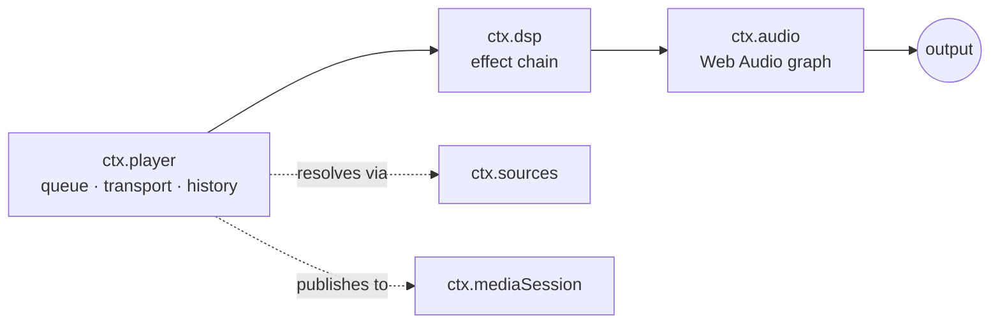
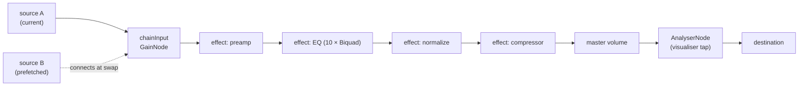

# Audio Engine & Web Audio Core

> **Legacy Reference:** Formerly `docs/05-audio-playback.md §1`.

> **What this answers.** How sound actually gets made: the audio engine contract, the transport
> and queue state machine, how DSP effects compose into a chain, and how playback survives
> interruptions, route changes, and being backgrounded.

Three services, layered:



`ctx.player` decides *what* plays. `ctx.dsp` decides *how it sounds*. `ctx.audio` owns the graph
and is the only thing that touches the platform.

---

## 1. `ctx.audio` — the engine

Per [ADR-4](../architecture/overview.md#adr-4--react-native-audio-api-is-the-primary-playback-and-dsp-engine-on-every-target),
the contract **is** the Web Audio API. `react-native-audio-api` implements it on iOS and Android
and ships a web build for the Electron renderer, so one graph description runs everywhere.

```ts
import type { Uri, Disposable } from '@BBeBee/protocol'

export interface AudioSourceHandle {
  readonly node: AudioNode
  readonly durationMs: number
  play(atMs?: number): void
  pause(): void
  stop(): void
  readonly positionMs: number
  /** Fires when the source reaches its natural end. */
  onEnded(cb: () => void): Disposable
  dispose(): void
}

export interface LoadOptions {
  /** Streaming keeps memory flat; buffered enables sample-accurate gapless. */
  strategy: 'stream' | 'buffer'
  headers?: Record<string, string>
  signal?: AbortSignal
  onBuffered?: (seconds: number) => void
}

export interface AudioService {
  readonly context: BaseAudioContext
  readonly destination: AudioNode
  readonly sampleRate: number
  readonly outputLatencyMs: number

  /** Load a remote URL or a local Uri into a playable source node. */
  load(src: string | Uri, opts: LoadOptions): Promise<AudioSourceHandle>

  /** Where ctx.dsp inserts its chain. Sources connect here, not to destination. */
  readonly chainInput: AudioNode
  /** Where ctx.dsp connects back to the master output. */
  readonly chainOutput?: AudioNode
  /** Dip master volume smoothly over durationMs (default 20ms) to prevent clicks during rewiring. */
  dipVolume?(durationMs?: number): Promise<Disposable>

  setVolume(v: number): void         // 0..1, applied post-chain
  setMuted(m: boolean): void

  listOutputDevices(): Promise<{ id: string; label: string; isDefault: boolean }[]>
  setOutputDevice(id: string): Promise<void>

  /** Interruptions, route changes, focus loss. See §5. */
  onInterruption(cb: (e: { type: 'began' | 'ended'; shouldResume: boolean }) => void): Disposable
  onRouteChange(cb: (e: { reason: 'device-removed' | 'device-added' | 'override' }) => void): Disposable
}
```

### Graph topology



`chainInput` exists so that sources come and go without ever touching the effect chain, and
effects are rebuilt without ever touching a playing source. The two lifetimes are decoupled.

### Load strategies & resilient fallback

`ctx.audio.load(src, { strategy })` implements two distinct loading pathways:
- **`strategy: 'buffer'`**: Fetches binary bytes into an `ArrayBuffer` and decodes with `context.decodeAudioData()`. Creates an `AudioBufferSourceNode` connected to `chainInput`. Provides sample-accurate scheduling for prefetching and gapless track transitions.
- **`strategy: 'stream'`**: Binds to a media element (`HTMLMediaElement`) via `context.createMediaElementSource()`. Keeps memory footprint constant regardless of track length and supports progressive buffering.
- **Resilient Decode Fallback**: Chromium's built-in `decodeAudioData()` fails on certain formats (notably 24-bit Hi-Res FLAC files, Apple Lossless ALAC in `.m4a`, or FLAC files with ID3v2 metadata chunk headers) with `Unable to decode audio data`. `core-audio-webaudio` intercepts this error in `loadBuffered` and automatically queries the desktop bridge's FFmpeg decoder (`audio.decodePcm`) to decode the file into 32-bit Float PCM channels, directly populating an `AudioBuffer` and routing through `chainInput` without quality loss. Both call sites forward the source's request headers with the URI; for `http(s)` inputs ffmpeg receives them as `-user_agent`/`-headers`, because streaming CDNs that check `Referer` answer a header-less request with `403 Forbidden`.
- **WASAPI Exclusive Output & Web Audio DSP (`@BBeBee/core-audio-wasapi`)**:
  Implements Paradigm 1 for high-fidelity bit-perfect output on Windows desktop:
  Web Audio continues to run the full `ctx.dsp` effect chain (10-band EQ, preamp, dynamic compressor) and UI visualizer (`AnalyserNode`). An `AudioWorklet` processor (`WasapiSinkProcessor`) taps into the master output and transfers 32-bit Float PCM to a lock-free `SharedRingBuffer`, bypassing Chromium's default `context.destination` and OS shared mixer. The Electron main process WASAPI client then drives the audio endpoint in exclusive mode (`AUDCLNT_SHAREMODE_EXCLUSIVE`) at the hardware's native sample rate and bit depth.
  - **True streaming (`strategy: 'stream'`)**: the WASAPI service wraps an `HTMLMediaElement` with `createMediaElementSource` and feeds `chainInput`, so the DSP chain and the sink worklet see a stream exactly like a decoded buffer — memory stays flat for a multi-hour track. Exclusive output is initialised from the context's own rate (elements are resampled to it) with the probed channel layout, degrading to shared `destination` output if the endpoint refuses the format; the handle is the same `StreamedHandle` the WebAudio service uses, so stall/seek semantics cannot drift between implementations. The element cannot set request headers itself — remote sources rely on the per-host registration the player performs via `stream.setHeaders` before the load.
  - **Bridge-first buffered decode**: unlike the WebAudio service, which reaches the FFmpeg bridge only *after* `decodeAudioData` fails, this service attempts `audio.decodePcm` first on every buffered load — whenever a bridge exists, a track decodes through FFmpeg regardless of codec — and falls back to `decodeAudioData` when the bridge is absent or fails.
- **Audio Output Engine & Device Selection in Settings (`audioOutputEngine`, `audioOutputDeviceId`)**:
  Settings provide output driver and hardware device configuration under the *Audio Output Engine & Devices* section:
  - **WASAPI Exclusive Hi-Res Mode (Default)**: Locks the audio hardware endpoint exclusively (`AUDCLNT_SHAREMODE_EXCLUSIVE`) for bit-perfect output, bypassing Windows OS mixer resampling.
  - **Shared WebAudio Mode**: Output routes through the operating system mixer, allowing concurrent audio playback from browsers, games, and system alerts.
  - **Selectable Audio Output Devices**:
    - **Full System Hardware Probing**: Electron main process unmasks Chromium device labels by handling `'speaker-selection'` and `'media'` permissions, while querying native OS subsystems (Windows Registry & CIM MMDevices, macOS System Profiler, Linux pactl/aplay) to resolve exact hardware friendly names (speakers, headphones, external USB DACs).
    - **Driver Destination Routing**: Selecting a device persists `settings.audioOutputDeviceId`. On boot and upon change, both Web Audio (`AudioContext.setSinkId`) and WASAPI Exclusive (`wasapi.setOutputDevice`) redirect the audio stream directly to the chosen physical endpoint as the audio driver destination.
- **Audiophile Lossless Formats & Local Scanner Integration**:
  Desktop integrates `ffmpeg` to decode formats beyond Chromium's built-in capability:
  - **ALAC & `.m4a`**: Previously, ALAC tracks inside `.m4a` containers were rejected during scanning (`unsupported codec: ALAC is not supported on this platform`). With the FFmpeg decode bridge and `alac` added to `supportedFormats()`, ALAC files are fully imported and decoded.
  - **Lossless Formats**: `.ape` (Monkey's Audio), `.wv` (WavPack), `.dsf`/`.dff` (DSD Audio), and `.m4b` (Audiobooks) are now included in local scanning (`DEFAULT_EXTENSIONS`), tag sniffing (`core-codec-node`), and PCM decoding.
- **Desktop Scheme Rewriting**: Under Electron web security, renderer `fetch()` calls to `file://` URIs are rejected. The desktop core service automatically transforms `file://` URLs into the registered privileged protocol `bbebee-file://` before fetching or binding to media elements.

### Escape hatch

If `react-native-audio-api` proves unworkable on a platform, `core-audio-rntp` can implement
`AudioService` over `react-native-track-player`, with `chainInput` becoming a no-op and effects
degrading to whatever native EQ exists. `ctx.player` and every effect plugin are unaffected. The
abstraction is the insurance policy, and it is cheap precisely because the contract is a standard
one.

---

