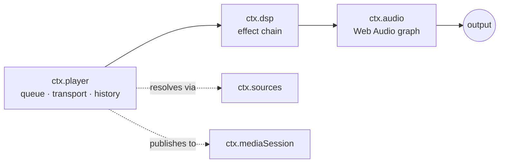
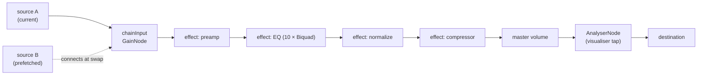

# Audio Engine & Web Audio Core

> **Legacy Reference:** Formerly `docs/05-audio-playback.md §1`.

> **What this answers.** How sound actually gets made: the audio engine contract, the transport
> and queue state machine, how DSP effects compose into a chain, and how playback survives
> interruptions, route changes, and being backgrounded.

Three services, layered:



`ctx.player` decides *what* plays. `ctx.dsp` decides *how it sounds*. `ctx.audio` owns the graph
and is the only thing that touches the platform.

---

## 1. `ctx.audio` — the engine

Per [ADR-4](../architecture/overview.md#adr-4--react-native-audio-api-is-the-primary-playback-and-dsp-engine-on-every-target),
the contract **is** the Web Audio API. `react-native-audio-api` implements it on iOS and Android
and ships a web build for the Electron renderer, so one graph description runs everywhere.

```ts
import type { Uri, Disposable } from '@BBeBee/protocol'

export interface AudioSourceHandle {
  readonly node: AudioNode
  readonly durationMs: number
  play(atMs?: number): void
  pause(): void
  stop(): void
  readonly positionMs: number
  /** Fires when the source reaches its natural end. */
  onEnded(cb: () => void): Disposable
  dispose(): void
}

export interface LoadOptions {
  /** Streaming keeps memory flat; buffered enables sample-accurate gapless. */
  strategy: 'stream' | 'buffer'
  headers?: Record<string, string>
  signal?: AbortSignal
  onBuffered?: (seconds: number) => void
}

export interface AudioService {
  readonly context: BaseAudioContext
  readonly destination: AudioNode
  readonly sampleRate: number
  readonly outputLatencyMs: number

  /** Load a remote URL or a local Uri into a playable source node. */
  load(src: string | Uri, opts: LoadOptions): Promise<AudioSourceHandle>

  /** Where ctx.dsp inserts its chain. Sources connect here, not to destination. */
  readonly chainInput: AudioNode
  /** Where ctx.dsp connects back to the master output. */
  readonly chainOutput?: AudioNode
  /** Dip master volume smoothly over durationMs (default 20ms) to prevent clicks during rewiring. */
  dipVolume?(durationMs?: number): Promise<Disposable>

  setVolume(v: number): void         // 0..1, applied post-chain
  setMuted(m: boolean): void

  listOutputDevices(): Promise<{ id: string; label: string; isDefault: boolean }[]>
  setOutputDevice(id: string): Promise<void>

  /** Interruptions, route changes, focus loss. See §5. */
  onInterruption(cb: (e: { type: 'began' | 'ended'; shouldResume: boolean }) => void): Disposable
  onRouteChange(cb: (e: { reason: 'device-removed' | 'device-added' | 'override' }) => void): Disposable
}
```

### Graph topology



`chainInput` exists so that sources come and go without ever touching the effect chain, and
effects are rebuilt without ever touching a playing source. The two lifetimes are decoupled.

### Load strategies & resilient fallback

`ctx.audio.load(src, { strategy })` implements two distinct loading pathways:
- **`strategy: 'buffer'`**: Fetches binary bytes into an `ArrayBuffer` and decodes with `context.decodeAudioData()`. Creates an `AudioBufferSourceNode` connected to `chainInput`. Provides sample-accurate scheduling for prefetching and gapless track transitions.
- **`strategy: 'stream'`**: Binds to a media element (`HTMLMediaElement`) via `context.createMediaElementSource()`. Keeps memory footprint constant regardless of track length and supports progressive buffering.
- **Decode Fallback**: when `decodeAudioData()` fails on a format it cannot decode (ALAC in `.m4a`, Hi-Res FLAC, ID3v2-prefixed headers — `Unable to decode audio data`), `core-audio-webaudio` degrades to the media element, whose decoder coverage differs from `decodeAudioData`'s — ALAC and 24-bit FLAC included. Request headers reach the element through the per-host registration the player performs via `stream.setHeaders`.
- **Desktop Native Hi-Fi Engine (`@BBeBee/core-audio-mpv`)**:
  One of the two desktop engines. Powered by official libmpv running in an independent standalone native `audio-engine` executable binary for crash isolation.
  - **Standalone Native Binary & Crash Isolation**: The native libmpv instance, audio decoding, and the platform audio output driver run inside a dedicated compiled native binary (`apps/desktop/bin/audio-engine` or `.exe`), communicating via stdio JSON-IPC and monitored by an Electron Main supervisor (`AudioEngineSupervisor`). Any audio driver crash, device disconnect, or native signal failure is trapped in the child process without crashing the UI or Main process, with automated recovery.
  - **Zero-IPC for PCM & Direct OS Audio Output**: Decoded audio PCM directly feeds mpv's own audio output — `ao=wasapi` on Windows, `coreaudio` on macOS, `pulse,alsa,pipewire` on Linux. Raw high-bitrate PCM samples NEVER cross IPC boundaries to the renderer, eliminating memory copies, IPC serialization overhead, and GC stutter.
  - **Full Effect Chain via libavfilter Adapters**: every built-in effect (10-band EQ, preamp, compressor, limiter, normalize, crossfeed, widener, reverb, tempo-pitch) declares an optional `buildLavfi(params)` adapter on its `EffectDefinition` — a libavfilter fragment per effect (`equalizer`/`lowshelf`/`highshelf`, `volume`, `acompressor`, `alimiter`, `crossfeed`, `extrastereo`, `aecho`, `rubberband`). The engine walks the ENABLED chain in ordinal order, joins the fragments into one `af` string (plus the `astats` tap), and pushes it at mount, on `dsp/chain-changed` (debounced 200 ms — every `af` write makes mpv rebuild the chain), and effects without an adapter are skipped with a log line. `FILE_LOADED` reads mpv's actual pause flag rather than assuming, so a play that races the loader (the gapless re-bind) keeps the status bookkeeping honest. Verified end-to-end against synthesized tones: a +6 dB band boost measures +6.00 dB at the engine's own `astats` tap, and a −40 dB chain attenuates the measured level accordingly.
  - **Gapless Handoff (append + re-bind)**: `ctx.audio.preloadNext` (optional contract member) appends the next track to the engine's internal playlist (`loadfile append`) while the current one still plays; at the playlist boundary mpv advances inside itself — no decoder restart. The player's ended→load round-trip then *re-binds* to the already-sounding file: the engine compares the requested uri against its current `path` (scheme-insensitively — mpv strips `file://`), and unless the file sits at EOF (a repeat-one replay must start over) it replies `loaded` with `resumed: true` instead of replacing anything. `play()` without a position argument never seeks, so the re-bound track keeps sounding.
  - **Native Device Query**: output device enumeration prefers mpv's own `audio-device-list` (native device names as ids, `auto` as the machine default), falling back to Chromium enumeration + native label resolution when the engine cannot answer. Ids from the mpv namespace are forwarded straight to the engine; stale ids from the other engine's namespace keep working through the shared label-matching path.
  - **Build & Distribution**: the binary is compiled per platform by CI (`scripts/build-audio-engine.js`, three-platform matrix, `--version` smoke) and packaged with per-platform libmpv staged by `scripts/fetch-libmpv.js` (system search, `LIBMPV_PATH` override, SHA256-verified Windows prebuilt download) via electron-builder `extraResources`. On a machine without libmpv the engine reports the load failure and the renderer degrades to the media element (Chromium decode). The full binary/libmpv lookup order and the degradation matrix are specified in [workflow/build-pipelines.md §4.1](../workflow/build-pipelines.md#41-the-native-audio-engine-binary).
  - **Unified AudioAnalyser & WebGL Spectrum Canvas**: Real-time audio-level-driven spectrum analysis is computed in-process within the standalone native audio-engine (via `astats` metadata levels) and dispatched to the renderer via lightweight stdio JSON-IPC and bridge IPC (`mpvGetFftFrame`). `plugin-visualizer` wraps this into a unified `AudioAnalyser` abstraction (`NativeMpvImpl` / `WebAudioImpl`), feeding the WebGL Canvas GPU shader pipeline seamlessly without leaking backend details to UI components.
- **Mobile Audio Engine Architecture (`MobileAudioService` in `apps/mobile`)**:
  - **Delivered Production Engine (Route A: `@BBeBee/core-audio-webaudio` via `react-native-audio-api`)**: Native audio graph running directly on mobile OS audio subsystems (Apple CoreAudio on iOS, Google Oboe/AAudio on Android). Provides low-latency audio buffering, system background audio, and audio focus interruption handling.
  - **Roadmap Route B (`@BBeBee/core-audio-mpv` via in-process libmpv JNI/JSI)**: Architectural target for mobile audiophile playback. Because mobile sandboxes disallow child process spawning, Route B is designed as an in-process native shared library (`libmpv.so` on Android, `mpv.framework` on iOS). When compiled, it interfaces via TurboModule JSI to provide hardware decoding and stream buffering. In builds where the native library is not yet bundled, `MobileAudioService` automatically operates on Route A (WebAudio) to ensure reliable audio output.
  - **State Continuity & Audio Interruption Management**: Audio settings and system interruptions (phone calls, alarms) via `AudioManager.observeAudioInterruptions` are handled uniformly at the composition root.
- **Audio Output Engine & Device Selection in Settings (`audioOutputEngine`, `audioOutputDeviceId`)**:
  Settings provide output driver and hardware device configuration under the *Audio Output Engine & Devices* section:
  - **Engine Choice (Default: MPV Hi-Fi on Windows, WebAudio elsewhere)**: MPV Hi-Fi provides native crash isolation and direct WASAPI output; WebAudio provides the standard Web Audio graph.
  - **Selectable Audio Output Devices**:
    - **Full System Hardware Probing**: Electron main process unmasks Chromium device labels by handling `'speaker-selection'` and `'media'` permissions, while querying native OS subsystems (Windows Registry & CIM MMDevices, macOS System Profiler, Linux pactl/aplay) to resolve exact hardware friendly names (speakers, headphones, external USB DACs).
    - **Driver Destination Routing**: Selecting a device persists `settings.audioOutputDeviceId`. On boot and upon change, the active engine redirects output to the chosen endpoint — `AudioContext.setSinkId` receives the Chromium id, while the same id is label-matched against the bridge's native device list and the resolved OS device is forwarded to main's `audio.setOutputDevice`. The mpv engine additionally prefers its own `audio-device-list` for enumeration (see above). Both engines run the shared routing through shared code, so they cannot drift.
- **Audiophile Lossless Formats & Local Scanner Integration**:
  The local scanner reads tags and durations through the pure-JavaScript `music-metadata` stack — no external decoder is involved anywhere in the product:
  - **ALAC & `.m4a`**: Previously, ALAC tracks inside `.m4a` containers were rejected during scanning (`unsupported codec: ALAC is not supported on this platform`). With `alac` in `supportedFormats()` and header parsing, ALAC files are fully imported.
  - **Lossless Formats**: `.ape` (Monkey's Audio), `.wv` (WavPack), `.dsf`/`.dff` (DSD Audio), and `.m4b` (Audiobooks) are included in local scanning (`DEFAULT_EXTENSIONS`) and tag sniffing (`core-codec-node`). Playback coverage for the exotic containers is the MPV engine's (libmpv); the WebAudio engine plays what Chromium decodes.
- **Desktop Scheme Rewriting**: Under Electron web security, renderer `fetch()` calls to `file://` URIs are rejected. The desktop core service automatically transforms `file://` URLs into the registered privileged protocol `bbebee-file://` before fetching or binding to media elements.

### Escape hatch

If `react-native-audio-api` proves unworkable on a platform, `core-audio-rntp` can implement
`AudioService` over `react-native-track-player`, with `chainInput` becoming a no-op and effects
degrading to whatever native EQ exists. `ctx.player` and every effect plugin are unaffected. The
abstraction is the insurance policy, and it is cheap precisely because the contract is a standard
one.

---

