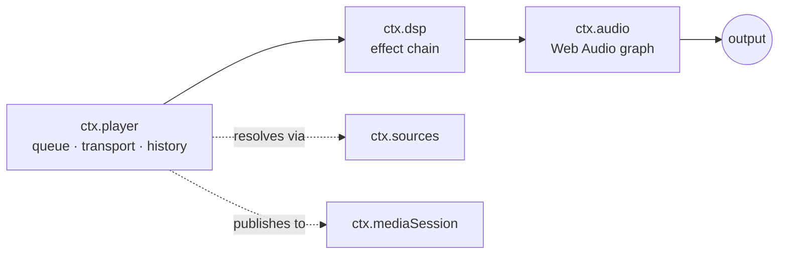
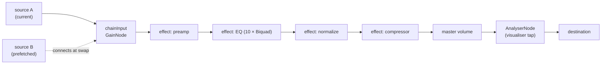

# Audio Engine & Web Audio Core

> **Legacy Reference:** Formerly `docs/05-audio-playback.md §1`.

> **What this answers.** How sound actually gets made: the audio engine contract, the transport
> and queue state machine, how DSP effects compose into a chain, and how playback survives
> interruptions, route changes, and being backgrounded.

Three services, layered:



`ctx.player` decides *what* plays. `ctx.dsp` decides *how it sounds*. `ctx.audio` owns the graph
and is the only thing that touches the platform.

---

## 1. `ctx.audio` — the engine

Per [ADR-4](../architecture/overview.md#adr-4--react-native-audio-api-is-the-primary-playback-and-dsp-engine-on-every-target),
the contract **is** the Web Audio API. `react-native-audio-api` implements it on iOS and Android
and ships a web build for the Electron renderer, so one graph description runs everywhere.

```ts
import type { Uri, Disposable } from '@BBeBee/protocol'

export interface AudioSourceHandle {
  readonly node: AudioNode
  readonly durationMs: number
  play(atMs?: number): void
  pause(): void
  stop(): void
  readonly positionMs: number
  /** Fires when the source reaches its natural end. */
  onEnded(cb: () => void): Disposable
  dispose(): void
}

export interface LoadOptions {
  /** Streaming keeps memory flat; buffered enables sample-accurate gapless. */
  strategy: 'stream' | 'buffer'
  headers?: Record<string, string>
  signal?: AbortSignal
  onBuffered?: (seconds: number) => void
}

export interface AudioService {
  readonly context: BaseAudioContext
  readonly destination: AudioNode
  readonly sampleRate: number
  readonly outputLatencyMs: number

  /** Load a remote URL or a local Uri into a playable source node. */
  load(src: string | Uri, opts: LoadOptions): Promise<AudioSourceHandle>

  /** Where ctx.dsp inserts its chain. Sources connect here, not to destination. */
  readonly chainInput: AudioNode
  /** Where ctx.dsp connects back to the master output. */
  readonly chainOutput?: AudioNode
  /** Dip master volume smoothly over durationMs (default 20ms) to prevent clicks during rewiring. */
  dipVolume?(durationMs?: number): Promise<Disposable>

  setVolume(v: number): void         // 0..1, applied post-chain
  setMuted(m: boolean): void

  listOutputDevices(): Promise<{ id: string; label: string; isDefault: boolean }[]>
  setOutputDevice(id: string): Promise<void>

  /** Interruptions, route changes, focus loss. See §5. */
  onInterruption(cb: (e: { type: 'began' | 'ended'; shouldResume: boolean }) => void): Disposable
  onRouteChange(cb: (e: { reason: 'device-removed' | 'device-added' | 'override' }) => void): Disposable
}
```

### Graph topology



`chainInput` exists so that sources come and go without ever touching the effect chain, and
effects are rebuilt without ever touching a playing source. The two lifetimes are decoupled.

### Load strategies & resilient fallback

`ctx.audio.load(src, { strategy })` implements two distinct loading pathways:
- **`strategy: 'buffer'`**: Fetches binary bytes into an `ArrayBuffer` and decodes with `context.decodeAudioData()`. Creates an `AudioBufferSourceNode` connected to `chainInput`. Provides sample-accurate scheduling for prefetching and gapless track transitions.
- **`strategy: 'stream'`**: Binds to a media element (`HTMLMediaElement`) via `context.createMediaElementSource()`. Keeps memory footprint constant regardless of track length and supports progressive buffering.
- **Resilient Decode Fallback**: Chromium's built-in `decodeAudioData()` fails on certain formats (notably 24-bit Hi-Res FLAC files, Apple Lossless ALAC in `.m4a`, or FLAC files with ID3v2 metadata chunk headers) with `Unable to decode audio data`. `core-audio-webaudio` intercepts this error in `loadBuffered` and automatically queries the desktop bridge's FFmpeg decoder (`audio.decodePcm`) to decode the file into 32-bit Float PCM channels, directly populating an `AudioBuffer` and routing through `chainInput` without quality loss. Both call sites forward the source's request headers with the URI; for `http(s)` inputs ffmpeg receives them as `-user_agent`/`-headers`, because streaming CDNs that check `Referer` answer a header-less request with `403 Forbidden`.
- **Desktop Native Hi-Fi Engine (`@BBeBee/core-audio-mpv`)**:
  One of the two desktop engines. Powered by official libmpv running in an independent standalone native `audio-engine` executable binary for crash isolation.
  - **Standalone Native Binary & Crash Isolation**: The native libmpv instance, audio decoding, and WASAPI driver run inside a dedicated compiled native binary (`apps/desktop/bin/audio-engine` or `.exe`), communicating via stdio JSON-IPC and monitored by an Electron Main supervisor (`AudioEngineSupervisor`). Any audio driver crash, device disconnect, or native signal failure is trapped in the child process without crashing the UI or Main process, with automated recovery.
  - **Zero-IPC for PCM & Direct WASAPI Output**: Decoded audio PCM directly feeds WASAPI output (`ao=wasapi`). Raw high-bitrate PCM samples NEVER cross IPC boundaries to the renderer, eliminating memory copies, IPC serialization overhead, and GC stutter.
  - **In-process Native DSP/EQ**: The native audio-engine implements a 10-band equalizer (31Hz–16kHz), preamp gain, and dynamic compressor filter chain, hot-updated in real time whenever `ctx.dsp` triggers `dsp/chain-changed`.
  - **Unified AudioAnalyser & WebGL Spectrum Canvas**: Real-time FFT analysis is computed in-process within the audio-engine and pushed to the renderer via lightweight IPC/Shared Memory. `plugin-visualizer` wraps this into a unified `AudioAnalyser` abstraction (`NativeMpvImpl` / `WebAudioImpl`), feeding the WebGL Canvas GPU shader pipeline seamlessly without leaking backend details to UI components.
- **Audio Output Engine & Device Selection in Settings (`audioOutputEngine`, `audioOutputDeviceId`)**:
  Settings provide output driver and hardware device configuration under the *Audio Output Engine & Devices* section:
  - **Engine Choice (Default: MPV Hi-Fi on Windows, WebAudio elsewhere)**: MPV Hi-Fi provides native crash isolation and direct WASAPI output; WebAudio provides the standard Web Audio graph.
  - **Selectable Audio Output Devices**:
    - **Full System Hardware Probing**: Electron main process unmasks Chromium device labels by handling `'speaker-selection'` and `'media'` permissions, while querying native OS subsystems (Windows Registry & CIM MMDevices, macOS System Profiler, Linux pactl/aplay) to resolve exact hardware friendly names (speakers, headphones, external USB DACs).
    - **Driver Destination Routing**: Selecting a device persists `settings.audioOutputDeviceId`. On boot and upon change, the active engine redirects output to the chosen endpoint — `AudioContext.setSinkId` receives the Chromium id, while the same id is label-matched against the bridge's native device list and the resolved OS device is forwarded to main's `audio.setOutputDevice`. Both engines run this dual routing through shared code, so they cannot drift.
- **Audiophile Lossless Formats & Local Scanner Integration**:
  Desktop integrates `ffmpeg` to decode formats beyond Chromium's built-in capability:
  - **ALAC & `.m4a`**: Previously, ALAC tracks inside `.m4a` containers were rejected during scanning (`unsupported codec: ALAC is not supported on this platform`). With the FFmpeg decode bridge and `alac` added to `supportedFormats()`, ALAC files are fully imported and decoded.
  - **Lossless Formats**: `.ape` (Monkey's Audio), `.wv` (WavPack), `.dsf`/`.dff` (DSD Audio), and `.m4b` (Audiobooks) are now included in local scanning (`DEFAULT_EXTENSIONS`), tag sniffing (`core-codec-node`), and PCM decoding.
- **Desktop Scheme Rewriting**: Under Electron web security, renderer `fetch()` calls to `file://` URIs are rejected. The desktop core service automatically transforms `file://` URLs into the registered privileged protocol `bbebee-file://` before fetching or binding to media elements.

### Escape hatch

If `react-native-audio-api` proves unworkable on a platform, `core-audio-rntp` can implement
`AudioService` over `react-native-track-player`, with `chainInput` becoming a no-op and effects
degrading to whatever native EQ exists. `ctx.player` and every effect plugin are unaffected. The
abstraction is the insurance policy, and it is cheap precisely because the contract is a standard
one.

---

