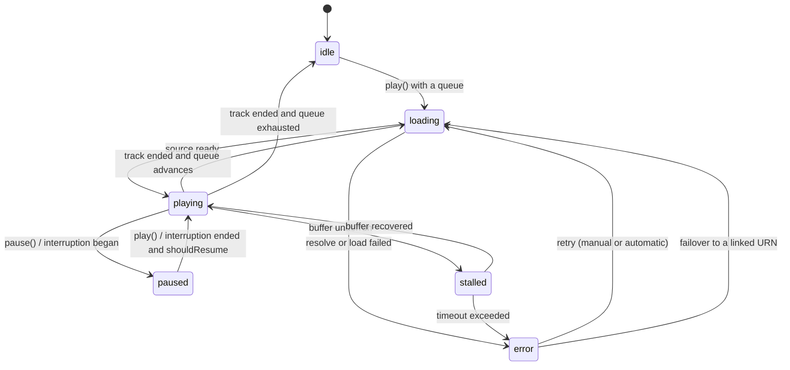
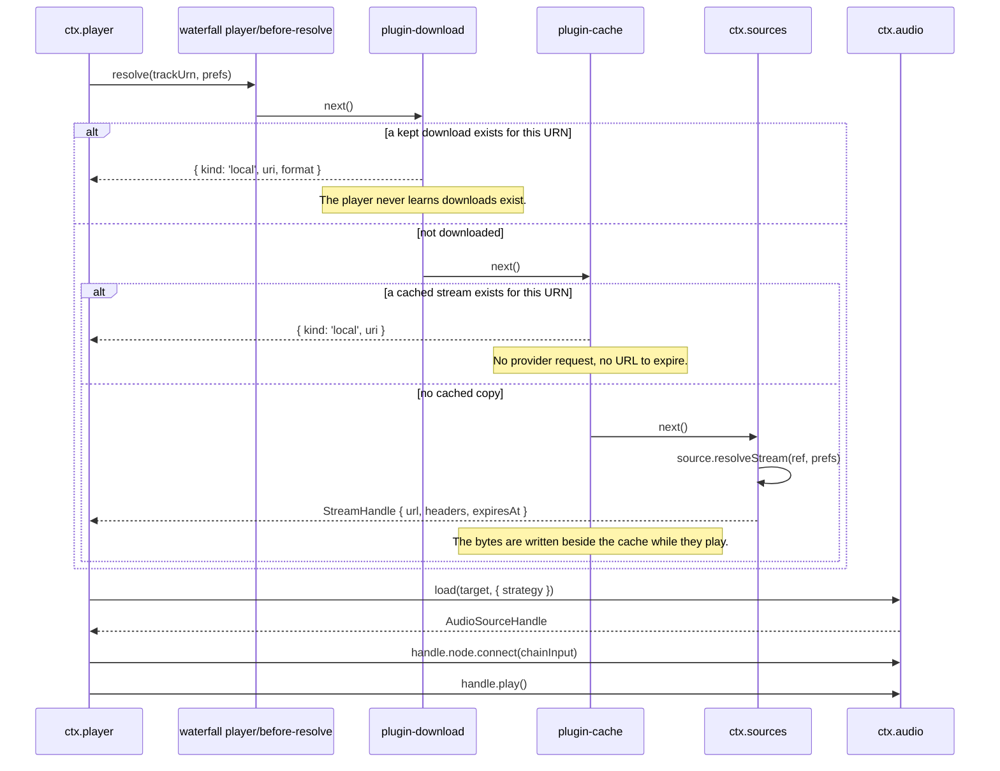

# Playback Transport & Queue Management

> **Legacy Reference:** Formerly `docs/05-audio-playback.md §2, §4 – §8`.

## 2. `ctx.player` — transport and queue

```ts
export type PlayMode = 'shuffle' | 'sequence' | 'single-loop' | 'list-loop'
export type RepeatMode = 'off' | 'all' | 'one'

export interface QueueItem {
  id: string
  trackUrn: string
  /** Where this came from — an album, a playlist, radio. Drives "playing from". */
  sourceContext?: { kind: 'album' | 'playlist' | 'artist' | 'search' | 'radio' | 'local' | 'favorites'; urn?: string; label?: string }
  addedBy: 'user' | 'autoplay' | 'radio'
}

export interface TransportState {
  status: 'idle' | 'loading' | 'playing' | 'paused' | 'stalled' | 'error'
  currentItemId?: string
  trackUrn?: string
  positionMs: number
  durationMs: number
  bufferedMs: number
  volume: number
  muted: boolean
  repeat: RepeatMode
  shuffle: boolean
  playMode: PlayMode
  error?: { code: string; message: string; retryable: boolean }
}

export interface PlayerService {
  readonly state: Readonly<TransportState>
  readonly currentStream?: Readonly<StreamHandle>

  play(): Promise<void>
  pause(): void
  togglePlay(): void
  stop(): void
  seek(positionMs: number): Promise<void>
  next(): Promise<void>
  previous(): Promise<void>       // restarts current if past the threshold — see below

  setVolume(v: number): void
  setMuted(m: boolean): void
  setRepeat(m: RepeatMode): void
  setShuffle(on: boolean): void
  setPlayMode(mode: PlayMode): void
  cyclePlayMode(): PlayMode

  // Queue
  readonly queue: readonly QueueItem[]
  playNow(urns: string[], opts?: { startIndex?: number; context?: QueueItem['sourceContext'] }): Promise<void>
  playFromContext(urn: string, contextUrns?: readonly string[], opts?: { startIndex?: number; context?: QueueItem['sourceContext'] }): Promise<void>
  enqueueNext(urns: string[]): void
  enqueueLast(urns: string[]): void
  removeItems(ids: string[]): void
  moveItem(id: string, toIndex: number): void
  clearQueue(): void
}
```

### Transport state machine



Behaviours worth pinning down, because they are where players feel wrong:

- **`previous()`** restarts the current track if position > 3000 ms, otherwise goes back. The
  threshold is configurable and defaults to what users expect from every other player.
- **`playFromContext(urn, contextUrns)`** is what a tap on a track row means. If the queue
  already holds the track, the queue is kept and playback jumps to that entry — a queue the
  user has built is never silently reordered or replaced. If it does not, the list the row was
  tapped in (`contextUrns`: the album's tracks, the whole local library) becomes the queue and
  playback starts at the tap; with no usable context the track plays alone.
- **Shuffle** is a persisted **seed plus a permutation**, not a random pick each time. This makes
  the shuffled order stable across restarts, makes `previous()` meaningful, and lets the upcoming
  queue be displayed truthfully.
  - **Selecting a track under Shuffle (`rotateShuffle`)**: When a user selects a specific track from
    a list (e.g. clicking a song in an album or playlist while shuffle is active), the transport plays
    that clicked track immediately. Rather than picking whatever song happened to land at that array
    index, `QueueModel.rotateShuffle(firstId)` circularly rotates the permutation so the chosen track
    is placed at index 0, followed by the remaining tracks in their pseudo-random order. If no track is
    specified (e.g. clicking "Shuffle All"), playback starts with the head of the permutation.
  - **Shuffle never runs dry**: when the permutation is exhausted, `next()` wraps to its head (and
    `previous()` to its tail) regardless of the `repeat` flag — a shuffled queue is circular by
    definition. Only a plain sequence without repeat-all reaches an end and goes idle.
- **Repeat-one** does not re-resolve the stream; it reuses the loaded buffer.
- **`stalled`** is distinct from `paused`. The UI shows a spinner, not a play button, and
  `ctx.mediaSession` keeps reporting `playing` so the lock screen does not flicker.
- **Duration is a floor, not a promise.** The transport reports `source.durationMs` whenever the
  element has one, and falls back to the duration stored in the catalogue row otherwise — Bilibili's
  fMP4 streams are the motivating case, since the element reports `Infinity` while the search rule
  already knew how long the track is. Only seekable handles get the fallback, so a live stream still
  shows no scrubber.
- **Position always comes from the element's clock.** A streamed handle may hold a seek target as
  *pending* only while the element is actually moving there: `play(0)` on a fresh element moves
  nowhere and fires no `seeked`, so recording it as pending left the progress bar at zero for the
  whole track.

### Playback Modes (`PlayMode`)

The player unifies queue traversal and repeating into four explicit playback modes:

| Mode | Key | `shuffle` | `repeat` | Queue Traversal Behaviour |
|---|---|---|---|---|
| **Sequence** | `'sequence'` | `false` | `'off'` | Traverses queue in order, stops playback upon reaching queue end. |
| **Single Loop**  | `'single-loop'` | `false` | `'one'` | Replays the current track repeatedly without re-resolving streams. |
| **List Loop** | `'list-loop'` | `false` | `'all'` | Traverses queue in order and wraps around to the beginning indefinitely. |
| **Shuffle** | `'shuffle'` | `true` | `'all'` | Shuffles queue with a stable seeded permutation and loops indefinitely. |

- **Mode Cycling**: `cyclePlayMode()` advances modes in the standard order: `sequence` $\to$ `single-loop` $\to$ `list-loop` $\to$ `shuffle` $\to$ `sequence`.
- **Backward Compatibility**: Calling `setRepeat()` or `setShuffle()` automatically synchronizes `state.playMode` through `derivePlayMode()`. Similarly, calling `setPlayMode()` automatically configures the underlying `repeat` and `shuffle` properties on the queue.

### Resolution pipeline

What happens between "the queue advanced" and "audio comes out". This is the sequence where the
plugin architecture pays off most visibly.



On failure the pipeline is re-entered rather than surfaced immediately: an `UnavailableError` — or
a `RuleError` from a source whose rules have rotted
([06 §7](../sources/authoring.md#7-errors)) — triggers a lookup in `track_links`
([07 §4.4](../data-model/schema.md#44-identity-linking)) for the same recording on another source, and
only when that yields nothing does the player enter `error`.

**`plugin-download`** is the first listener: it answers with the file the user downloaded, or
passes through. **`plugin-cache`** is the second, and it is the automatic cache: a remote handle
is fetched with the stream's own headers and written to `ctx.paths.cache/stream` while it plays,
recorded in `cache_entries` under the key `stream:<urn>`; every later resolve answers
`kind: 'local'` and never reaches the provider. A miss returns the remote handle immediately, so
the cache never delays the play it is caching. Entries are evicted least-recently-used within the
`stream` class, and with the plugin disabled the same track simply streams — which is the control
arm of the regression test at [09 §6](../workflow/testing.md#6-testing-strategy).

Covers take the same path through the same plugin: `ctx.cache.artwork(ref)` returns the cached
file, fetching and writing it only on a miss, and fills in `artworks.local_uri` so every other
reader — including the lock screen — sees a local `Uri` on the next catalogue read. The render
side is the `useResolvedArtwork` hook ([08 §4](../ui/architecture.md#4-binding-services-to-react)).

The work itself is a row in `download_tasks` driven by one worker, exposed as **`ctx.downloads`**
(queued → running → done, with paused/canceled/failed): `bytes_done` is checkpointed per second so
a pause or an interruption resumes with a `Range` request instead of starting over, `enqueue`
queues a track without a play (the ⬇ control on a track row calls it), and
pause/resume/cancel/retry/remove/clear move the row and the file together. A Downloads settings
page in both shells renders that list — progress, sizes, and the controls each state allows — plus
the two policy switches.

**One destination, and the cache beside it.** A track the user downloads is kept in
`ctx.paths.downloads/BBeBee/` and is never evicted; the automatic cache lives in
`ctx.paths.cache/stream` and is evicted by `plugin-cache` under a per-class budget. A kept
download outranks the cache because `plugin-download`'s listener runs first, and the two stores
are different tables (`media_bindings` vs `cache_entries`), so "what did the user download?" and
"what did we happen to play?" stay separable.

**The policy is a row, not a constant.** `download_policies` holds `wifi_only` and
`charging_only`; the worker holds queued tasks and pauses running ones when the device state stops
satisfying them, re-checking on `ctx.device.onNetworkChange` and on a timer while a charger is the
only thing missing. A task this plugin paused resumes by itself when the constraint lifts; one the
user paused does not.

A binding whose file is gone is deleted rather than left to fail, files orphaned when a source
removal cascaded their binding away are swept when the plugin starts, and resuming sends
`If-Range: <etag>` so a remote file that changed since the partial was written is restarted rather
than spliced. With the plugin's `enabled` set to false the same track simply streams — which is the
control arm of the regression test at
[09 §6](../workflow/testing.md#6-testing-strategy).

### Gapless and crossfade

- **Gapless** uses `AudioBufferQueueSourceNode`: the next track is decoded during the current
  one's last ~15 seconds and queued into the same source node, so the handoff is
  sample-accurate with no `AudioContext` scheduling gap. Requires `strategy: 'buffer'`, so it is
  enabled for local files and short/medium streams and skipped for long ones.
- **Crossfade** is the alternative path: two source nodes, two gain ramps of
  `crossfadeMs`, equal-power curve. Mutually exclusive with gapless — attempting both produces a
  audible double-fade — so the setting is a three-way choice: `gapless | crossfade | neither`.
- **The mpv engine's gapless is append-based**: `ctx.audio.preloadNext` hands the next src to the
  engine (`loadfile append`) while the current track plays; at the boundary mpv advances inside its
  own playlist and the player's load of the now-current track *re-binds* to it (`resumed: true`) —
  the ended→next policy is unchanged, only the audible restart is gone. Sample-accurate scheduling
  is mpv-internal here; what the player hands over is the src, not PCM.
- **Prefetch** begins at `max(15s, crossfadeMs + 5s)` before the end, and is cancelled via
  `AbortSignal` if the queue changes.
- **Decoder fallback on Hi-Res audio (`decodeAudioData` fallback)**:
  When `strategy: 'buffer'` is selected for a local file, Web Audio's `decodeAudioData` is invoked.
  Certain audio encodings (such as 24-bit Hi-Res FLAC or FLAC files with ID3v2 header prefixes)
  are rejected by Chromium's native `decodeAudioData` with `Unable to decode audio data`.
  `core-audio-webaudio` intercepts this decode failure and smoothly falls back to `loadStreamed`
  via Chromium's internal FFmpeg media element decoder, keeping the `chainInput` DSP graph fully
  intact without aborting playback.
- **Desktop local audio scheme (`bbebee-file://`)**:
  Standard Electron renderers disallow renderer `fetch()` and media loading from raw `file://` URLs
  under Chromium web security rules (`bridge: refusing to fetch bbebee-file://`). The desktop main
  process registers the custom privileged scheme `bbebee-file://` to securely stream and buffer
  local music files directly from disk.

### Stream preferences

The `prefs` handed down the resolution pipeline is built by the player, not resolved from a
store: `prefs.quality` comes from the player's `quality` config (`lossless` by default —
sources are expected to degrade the tier themselves onto the best stream that *can* be decoded
when their backend has no such tier, or the account lacks the entitlement for one),
`prefs.saveData` from `ctx.device.network().metered`, and `prefs.acceptFormats` from
`ctx.codec.supportedFormats()`. A source that needs anything else about the request — a
per-quality URL, a format filter of its own — reads it out of `prefs` in `ruleStream`, and the
player has no concept of the tiers any given backend carries.

### Persistence

`playback_state` is written on a 5-second throttle while playing, and immediately on pause, track
change, and `ctx.background.onWillSuspend`. On boot the player restores the queue and position
but **does not auto-play** — restoring into playback is startling, particularly on a phone that
just launched in a pocket.

### Loudness Normalization & ReplayGain

To eliminate perceived volume jumps across tracks and albums from different sources, BBeBee provides loudness normalization compliant with ReplayGain 2.0 and EBU R128 (-14 LUFS standard reference):
- **AppSettings Configuration**:
  - `loudnessNormalizationEnabled: boolean` (master switch)
  - `loudnessNormalizationMode: 'track' | 'album' | 'dynamic'` (Track-level matching, Album-level dynamic preservation, or dynamic EBU R128 `loudnorm`)
  - `loudnessTargetLufs: number` (Target loudness reference: -14 LUFS default, -18 LUFS quiet/classical, -11 LUFS loud)
  - `loudnessPreampDb: number` (Pre-amp calibration offset)
- **Automatic Track Synchronization**:
  On `player/track-changed`, `plugin-dsp` inspects the active track's metadata (`replayGainTrack` or `replayGainAlbum`). In Web Audio mode, it computes the target gain offset and smoothly adjusts the input `GainNode` with 20 ms smoothing (`setTargetAtTime`), preventing audible clicks. In MPV mode, it sets native ReplayGain properties directly with clipping protection (`replaygain-clip`), while keeping libavfilter free from duplicate volume filters.
- **Interface Contribution**:
  The setting is contributed into the `playback` section via `ctx.ui.contribute({ kind: 'settings', id: 'settings.loudness-normalization', ... })` and rendered by `LoudnessNormalizationCard`.

---

## 4. Media session integration

`ctx.player` publishes to `ctx.mediaSession` on every track change and status change, throttled to
once per second for position. Commands flow the other way through `onCommand`.

Artwork must be a local `Uri` on mobile, so the artwork cache resolves and downloads it before
`update()` is called; a track change publishes metadata immediately with no artwork and updates
again when the image lands, rather than delaying the whole update.

---

## 5. Interruptions, focus, and routes

Handled once, in `ctx.player`, using `ctx.audio`'s events. Every platform's rules are
different; the *policy* is uniform.

| Event | Policy |
|---|---|
| Phone call / alarm begins | Pause. Remember that it was playing |
| Interruption ends with `shouldResume` | Resume only if we paused for this reason and the user has not intervened since |
| Another app takes audio focus (Android) | Pause. Do not duck — ducking a music player is wrong |
| Transient duck request (navigation prompt) | Lower master volume to 20% over 200 ms, restore after |
| Headphones unplugged / Bluetooth disconnected | **Pause immediately.** Never continue to speakers |
| New output device connected | Continue on the current device; do not migrate without user action |
| Output device disappears mid-playback | Pause, surface a notice, offer to switch |

The headphone rule matters enough to be non-configurable. It is the one audio behaviour users
never forgive.

Where the events come from is the shell's job — `ctx.audio` only publishes what a shell hands it
(`emitInterruption` / `emitRouteChange`):

- **Mobile** — `apps/mobile/src/boot.ts` subscribes to `AudioManager`'s `interruption` and
  `routeChange` system events and forwards them verbatim. These carry the OS's `shouldResume`, so
  they are the informed source, and the `AudioContext`'s own state transitions stay untranslated
  (`emitContextInterruptions` off) rather than publishing every interruption twice.
- **Desktop** — there is no other interruption surface, so the desktop shell opts into
  `emitContextInterruptions` on both engines (`core-audio-webaudio` and `core-audio-mpv`;
  the shared observer lives in the former and the MPV engine follows its context across a
  rate rebuild): the `AudioContext`'s state transitions
  (`running → suspended/interrupted → running`) are translated into `began`/`ended` events, and
  every transition is logged. A context *born* suspended (autoplay policy) is not an interruption.
  The events carry `shouldResume: false` — waking the machine does not mean the user wants sound —
  but `play()` itself resumes a suspended context on the way in, since the press of the button is
  the user gesture.

The publishing half is part of the `AudioService` contract, and the conformance suite asserts a
published interruption reaches its listeners. A pause arriving through `ctx.mediaSession` (media
keys, lock screen, another app taking the session) is logged at info with its command name — the
"where did this pause come from" record.

---

## 6. Playback and the background

Cross-reference [02 §4](../architecture/layers.md#4-what-background-means). Concretely:

- **iOS** — `UIBackgroundModes: ['audio']`, audio session category `playback`. Playback continues
  indefinitely; *non-audio* work does not.
- **Android** — a foreground service with a media notification, started when playback starts and
  stopped when it ends. Without it, the process is killed within minutes.
- **Desktop** — the renderer must stay alive, so closing the window hides to tray while audio
  plays. `powerSaveBlocker` prevents display-sleep from suspending the audio thread on some
  Windows configurations.

---

## 7. Testing audio

Audio is hard to test, so the strategy is layered rather than end-to-end:

1. **Effect determinism** — every `EffectDefinition.build` runs in an `OfflineAudioContext`
   against a known input buffer; output is compared to a stored reference within a tolerance.
   Catches accidental changes to filter coefficients, which are otherwise invisible until someone
   notices the EQ sounds different.
2. **Transport state machine** — pure unit tests against a mock `AudioService`. Every transition
   in the §2 diagram has a test, including interruption-during-load and queue-change-during-prefetch.
3. **Resolution pipeline** — the `player/before-resolve` waterfall tested with each of
   `plugin-download` and `plugin-cache` loaded and with neither, asserting the player behaves
   identically apart from the chosen target.
4. **Device smoke tests** — a manual matrix per release: lock screen, Bluetooth, headphone unplug,
   incoming call, gapless boundary, background survival. Not automatable at reasonable cost, and
   honest about that.

---

## 8. Where to go next

[06 — Music Sources](../sources/spec.md) defines where the URNs and stream handles come from.
