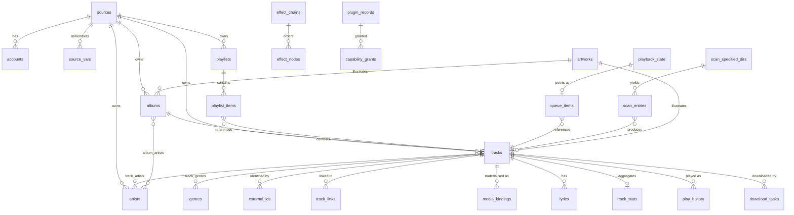

# SQLite Database Schema & Entity Tables

> **Legacy Reference:** Formerly `docs/07-data-model.md §2 – §4, §7`.

## 2. Entity–relationship overview



---

## 3. Conventions

- SQLite with `journal_mode = WAL`, `foreign_keys = ON`, `synchronous = NORMAL`.
- Timestamps are **epoch milliseconds** as `INTEGER`. No date strings, no timezones stored.
- Booleans are `INTEGER` 0/1.
- JSON columns are `TEXT` holding JSON, named with a `_json` suffix.
- Every table that mirrors remote data carries `fetched_at`, so staleness is answerable.
- Foreign keys to catalogue rows are URN `TEXT`, not integer ids — an id from a backend is
  meaningless without the source it came from, and joining on URNs keeps that impossible to get
  wrong.
- `ON DELETE CASCADE` wherever a child cannot exist alone; explicit cleanup where it can.

---

## 4. Tables

### 4.1 Sources, accounts, and sessions

**The source document is the row.** `doc_json` holds the imported string verbatim; every other
column is either derived from it (and therefore rebuildable) or app-maintained state that must not
travel when the source is shared.

```sql
CREATE TABLE sources (
  id            TEXT PRIMARY KEY,          -- 'music-example-org-35be9fe2', derived (06 §1.2)
  source_url    TEXT NOT NULL UNIQUE,      -- the document's identity; dedup key on import
  name          TEXT NOT NULL,             -- denormalised from doc_json for list rendering
  source_group  TEXT,                      -- comma-separated, free text
  source_type   TEXT NOT NULL DEFAULT 'music',  -- music|podcast|radio
  doc_json      TEXT NOT NULL,             -- the SourceDocument, verbatim (06 §2.1)
  doc_hash      TEXT NOT NULL,             -- sha256 of doc_json; drives the import diff
  enabled       INTEGER NOT NULL DEFAULT 1,
  sort_order    INTEGER NOT NULL DEFAULT 0,
  capabilities_json TEXT,                  -- derived Capabilities, cached (06 §1.3)
  allowed_hosts_json TEXT,                 -- the egress allowlist shown at import (06 §8)
  locally_modified INTEGER NOT NULL DEFAULT 0,  -- edited in-app since import
  origin_uri    TEXT,                      -- where it was imported from, if a URL
  imported_at   INTEGER NOT NULL,
  updated_at    INTEGER NOT NULL,
  last_check_at INTEGER,                   -- last `check` run (06 §10)
  last_error    TEXT,                      -- the failing rule, if any
  fail_count    INTEGER NOT NULL DEFAULT 0,-- 3 consecutive RuleErrors → stale badge (06 §7)
  respond_time_ms INTEGER
);
CREATE INDEX idx_sources_enabled ON sources(enabled, sort_order);

-- Per-source persisted state written by rules via src.vars (06 §3.4).
-- Credential-grade: never exported, cleared by signOut().
CREATE TABLE source_vars (
  source_id  TEXT NOT NULL REFERENCES sources(id) ON DELETE CASCADE,
  key        TEXT NOT NULL,
  value      TEXT NOT NULL,
  updated_at INTEGER NOT NULL,
  PRIMARY KEY (source_id, key)
);

CREATE TABLE accounts (
  source_id      TEXT PRIMARY KEY REFERENCES sources(id) ON DELETE CASCADE,
  remote_user_id TEXT,
  display_name   TEXT,
  status         TEXT NOT NULL,            -- anonymous|authenticated|expired|error
  expires_at     INTEGER,
  updated_at     INTEGER NOT NULL
);

-- Mobile only. Desktop keeps cookies in Chromium's own persisted partition
-- and never writes this table. See 04 §2.1.
CREATE TABLE cookie_jars (
  name        TEXT PRIMARY KEY,            -- the source id
  ciphertext  BLOB NOT NULL,               -- AES-GCM over the serialised jar
  iv          BLOB NOT NULL,
  key_ref     TEXT NOT NULL,               -- ctx.secrets key holding the AES key
  updated_at  INTEGER NOT NULL
);
```

Why `doc_json` is stored whole rather than shredded into columns: the document is the artefact the
user owns. Round-tripping it through a normalised schema would mean export producing something
subtly different from what was imported — reordered keys, dropped unknown fields, a rule
reformatted — and the first time a user's edited document came back changed, they would stop
trusting export.

**Unknown *top-level* fields survive an older app**, for the same reason: a document written for a
newer runtime is stored and re-exported intact, and the fields this build does not understand are
simply not read. An unknown field **inside a rule block** is refused at import instead
([06 §2.2](../sources/rule-engines.md#22-the-rule-blocks)) — and the asymmetry is deliberate. A stray
top-level key is forward compatibility; `ruleSearch.titel` is a typo that would otherwise validate,
never be read, and leave the source half-working in a way that looks like the backend changed.

`doc_hash` is what makes re-import a three-way answer rather than a coin flip: unchanged (same
hash, skip), updated (different hash, show the field diff), or conflicting (different hash *and*
`locally_modified`, require confirmation) — see
[06 §9](../sources/authoring.md#9-importing-updating-and-sharing).

It is a **full SHA-256**, and `id`'s suffix is the first 32 bits of one. The short non-cryptographic
hash this started as was wrong twice over: `id` is a primary key, so a collision makes one source's
row overwrite another's, and `doc_hash` decides whether an update happens at all, so a collision
there classifies a changed document as "unchanged" and skips it in silence.

> **`enabled` is the user's, not the document's.** An import writes every other column but never
> this one. An author publishing a fix must not switch a source back on that the user turned off —
> and a disabled row is indistinguishable from one removed with its library kept
> ([06 §4.1](../sources/runtime.md#41-a-sources-lifetime)), so the import path does not guess.

> **No readable credential is ever in this database.** Tokens, passwords and the per-source
> variable live in `ctx.secrets` under `namespace(sourceId)`; `source_vars` holds only what a rule
> chose to persist and is treated the same way. Cookies are also credentials, but a real session
> jar exceeds `expo-secure-store`'s 2048-byte value limit, so mobile stores them
> **envelope-encrypted**: the AES key (small) in `ctx.secrets`, the ciphertext (unbounded) in
> `cookie_jars`. The invariant is preserved — the key and the ciphertext are never in the same
> store, and a leaked database file yields nothing
> ([04 §2.1](../services/overview.md#21-cookie-jars),
> [04 §6](../services/contracts.md#6-ctxsecrets--credential-storage)).
>
> ⚠️ **A source document must never contain a credential**, and `export()` cannot strip what it
> cannot recognise. Hence the separation above: credentials live outside `doc_json` by
> construction, so "share this source" is safe by default rather than by the sharer remembering
> ([06 §5](../sources/runtime.md#5-authentication-and-session)).
>
> `accounts` records only that a session exists and when it lapses. Deleting a source cascades to
> `accounts` and `source_vars`; `signOut()` is separately responsible for clearing `cookie_jars`
> and the secrets namespace, because those are outside SQLite's cascade
> ([06 §5.1](../sources/runtime.md#51-session-persistence--cookies-survive-the-app)).

### 4.2 Artwork

Referenced by several tables, so it comes first.

```sql
CREATE TABLE artworks (
  id             TEXT PRIMARY KEY,          -- content hash when local, else derived from source_url
  source_url     TEXT,
  local_uri      TEXT,                      -- populated once cached
  width          INTEGER,
  height         INTEGER,
  blurhash       TEXT,                      -- instant placeholder, no layout shift
  dominant_color TEXT,                      -- '#RRGGBB', drives adaptive player theming
  bytes          INTEGER,
  fetched_at     INTEGER
);
CREATE INDEX idx_artworks_local ON artworks(local_uri) WHERE local_uri IS NOT NULL;
```

`blurhash` and `dominant_color` are computed once at cache time rather than per render, because
doing it in the UI costs a frame on every list scroll.

### 4.3 Catalogue

```sql
CREATE TABLE artists (
  urn          TEXT PRIMARY KEY,
  source_id    TEXT NOT NULL REFERENCES sources(id) ON DELETE CASCADE,
  remote_id    TEXT NOT NULL,
  name         TEXT NOT NULL,
  sort_name    TEXT,
  artwork_id   TEXT REFERENCES artworks(id),
  bio          TEXT,
  fetched_at   INTEGER NOT NULL,
  raw_json     TEXT
);
CREATE INDEX idx_artists_source ON artists(source_id);
CREATE INDEX idx_artists_sort ON artists(sort_name);

CREATE TABLE albums (
  urn           TEXT PRIMARY KEY,
  source_id     TEXT NOT NULL REFERENCES sources(id) ON DELETE CASCADE,
  remote_id     TEXT NOT NULL,
  title         TEXT NOT NULL,
  sort_title    TEXT,
  album_type    TEXT,                       -- album|single|ep|compilation|live|soundtrack
  release_date  TEXT,                       -- ISO-8601, possibly partial ('1997', '1997-04')
  year          INTEGER,                    -- derived, for cheap sorting and filtering
  track_count   INTEGER,
  disc_count    INTEGER,
  artwork_id    TEXT REFERENCES artworks(id),
  is_various    INTEGER NOT NULL DEFAULT 0,
  fetched_at    INTEGER NOT NULL,
  raw_json      TEXT
);
CREATE INDEX idx_albums_source ON albums(source_id);
CREATE INDEX idx_albums_year ON albums(year);

CREATE TABLE tracks (
  urn                TEXT PRIMARY KEY,
  source_id          TEXT NOT NULL REFERENCES sources(id) ON DELETE CASCADE,
  remote_id          TEXT NOT NULL,
  title              TEXT NOT NULL,
  sort_title         TEXT,
  album_urn          TEXT REFERENCES albums(urn) ON DELETE SET NULL,
  track_no           INTEGER,
  disc_no            INTEGER,
  duration_ms        INTEGER,
  year               INTEGER,
  explicit           INTEGER NOT NULL DEFAULT 0,
  bpm                REAL,
  replay_gain_track  REAL,
  replay_gain_album  REAL,
  peak_track         REAL,
  available          INTEGER NOT NULL DEFAULT 1,   -- 0 = withdrawn by its provider
                                                 -- (remote: NotFoundError; local: scan dir disabled)
  qualities_json     TEXT,                          -- StreamQuality[]
  artwork_id         TEXT REFERENCES artworks(id),
  fetched_at         INTEGER NOT NULL,
  raw_json           TEXT
);
CREATE INDEX idx_tracks_album ON tracks(album_urn, disc_no, track_no);
CREATE INDEX idx_tracks_source ON tracks(source_id);
CREATE INDEX idx_tracks_title ON tracks(sort_title);

CREATE TABLE track_artists (
  track_urn  TEXT NOT NULL REFERENCES tracks(urn) ON DELETE CASCADE,
  artist_urn TEXT NOT NULL REFERENCES artists(urn) ON DELETE CASCADE,
  role       TEXT NOT NULL DEFAULT 'main',   -- main|featured|composer|remixer|conductor
  ordinal    INTEGER NOT NULL DEFAULT 0,
  PRIMARY KEY (track_urn, artist_urn, role)
);
CREATE INDEX idx_track_artists_artist ON track_artists(artist_urn);

CREATE TABLE album_artists (
  album_urn  TEXT NOT NULL REFERENCES albums(urn) ON DELETE CASCADE,
  artist_urn TEXT NOT NULL REFERENCES artists(urn) ON DELETE CASCADE,
  ordinal    INTEGER NOT NULL DEFAULT 0,
  PRIMARY KEY (album_urn, artist_urn)
);

CREATE TABLE genres (
  id   TEXT PRIMARY KEY,                     -- normalised, lowercase
  name TEXT NOT NULL
);

CREATE TABLE track_genres (
  track_urn TEXT NOT NULL REFERENCES tracks(urn) ON DELETE CASCADE,
  genre_id  TEXT NOT NULL REFERENCES genres(id) ON DELETE CASCADE,
  PRIMARY KEY (track_urn, genre_id)
);
```

`track_artists` is a join with a `role` rather than an artist string, because "Artist feat. Other"
as free text makes the featured artist unbrowsable — one of the most common data-model mistakes in
music apps.

**Full-text search** over the local catalogue, available identically on both platforms:

```sql
CREATE VIRTUAL TABLE tracks_fts USING fts5(
  title, artist_names, album_title,
  content='', contentless_delete=1,          -- contentless; we manage rows explicitly
  tokenize='unicode61 remove_diacritics 2'
);

-- FTS5 addresses rows by integer rowid; the catalogue is keyed by URN.
CREATE TABLE tracks_fts_map (
  rowid INTEGER PRIMARY KEY AUTOINCREMENT,
  urn   TEXT NOT NULL UNIQUE REFERENCES tracks(urn) ON DELETE CASCADE
);
CREATE INDEX idx_tracks_fts_map_urn ON tracks_fts_map(urn);
```

Diacritic folding is on deliberately: a user typing `bjork` must find `Björk`.

> ⚠️ **`contentless_delete=1` is not optional.** A plain `content=''` table
> rejects `DELETE` and `UPDATE` outright ("cannot DELETE from contentless fts5 table"), so a
> renamed or removed track would keep its index row forever and searches would return stale hits
> with no remedy short of a full rebuild. Requires SQLite ≥ 3.43, which both Node 22.12+ and
> Electron 44 ship.
>
> Even with the flag, a **partial** `UPDATE` is refused — the whole row must be rewritten. Re-index
> as `DELETE` + `INSERT` on the same rowid.

External-content FTS (`content='tracks'`) would remove the need for the mapping table, but is not
usable here: `artist_names` is an aggregate over `track_artists`, not a column of `tracks`.

### 4.4 Identity linking

```sql
CREATE TABLE external_ids (
  urn       TEXT NOT NULL,
  namespace TEXT NOT NULL,                   -- isrc|mbid|upc|acoustid|discogs
  value     TEXT NOT NULL,
  PRIMARY KEY (urn, namespace, value)
);
CREATE INDEX idx_external_lookup ON external_ids(namespace, value);

CREATE TABLE track_links (
  urn_a      TEXT NOT NULL,
  urn_b      TEXT NOT NULL,
  confidence REAL NOT NULL,                  -- 0..1, see 06 §7
  method     TEXT NOT NULL,                  -- isrc|mbid|acoustid|fuzzy|manual
  created_at INTEGER NOT NULL,
  PRIMARY KEY (urn_a, urn_b),
  CHECK (urn_a < urn_b)                      -- canonical order: store each pair once
);
CREATE INDEX idx_links_b ON track_links(urn_b);
```

The `CHECK (urn_a < urn_b)` constraint is what keeps the relation symmetric without storing it
twice or risking the two directions disagreeing. Lookups query both columns.

### 4.5 Local media

```sql
CREATE TABLE media_bindings (
  id           TEXT PRIMARY KEY,
  track_urn    TEXT NOT NULL REFERENCES tracks(urn) ON DELETE CASCADE,
  uri          TEXT NOT NULL,                -- ctx.fs Uri, never a raw path
  format       TEXT,                         -- 'flac', 'mp3', 'm4a'
  codec        TEXT,
  bitrate_kbps INTEGER,
  sample_rate  INTEGER,
  channels     INTEGER,
  bit_depth    INTEGER,
  size_bytes   INTEGER,
  checksum     TEXT,                         -- sha256, for integrity checks
  origin       TEXT NOT NULL,                -- download|scan|import
  quality      TEXT,                         -- StreamQuality this satisfies
  verified_at  INTEGER,                      -- last time the file was confirmed present
  created_at   INTEGER NOT NULL
);
CREATE INDEX idx_bindings_track ON media_bindings(track_urn);
CREATE UNIQUE INDEX idx_bindings_uri ON media_bindings(uri);
```

**A binding is what "downloaded" means.** There is no `is_downloaded` flag anywhere. The
`player/before-resolve` waterfall asks whether a binding exists, and if it does, plays it
([05 §2](../audio/playback.md#resolution-pipeline)). One track may have several bindings — a
scanned local copy and a downloaded higher-quality one — and the resolver picks by quality.

`verified_at` exists because files disappear: an SD card is removed, a sync tool deletes a folder,
iOS evicts something. A binding whose file is missing is deleted rather than left to fail at play
time.

```sql
CREATE TABLE scan_specified_dirs (
  id            TEXT PRIMARY KEY,
  uri           TEXT NOT NULL UNIQUE,
  recursive     INTEGER NOT NULL DEFAULT 1,
  enabled       INTEGER NOT NULL DEFAULT 1,
  include_globs TEXT,                        -- JSON array
  exclude_globs TEXT,
  last_scan_at  INTEGER,
  last_error    TEXT
);

CREATE TABLE scan_entries (
  uri              TEXT PRIMARY KEY,
  specified_dir_id TEXT NOT NULL REFERENCES scan_specified_dirs(id) ON DELETE CASCADE,
  size             INTEGER NOT NULL,
  mtime            INTEGER NOT NULL,
  track_urn        TEXT REFERENCES tracks(urn) ON DELETE SET NULL,
  status           TEXT NOT NULL,                  -- ok|error|skipped|pending
  error            TEXT,
  scanned_at       INTEGER NOT NULL
);
CREATE INDEX idx_scan_entries_specified_dir ON scan_entries(specified_dir_id, status);
CREATE INDEX idx_scan_entries_track ON scan_entries(track_urn);
```

`(size, mtime)` is the incremental-scan key: unchanged files cost one `stat` and nothing more
([06 §12](../sources/authoring.md#the-local-scanner)).

### 4.6 Playlists and library

```sql
CREATE TABLE playlists (
  urn          TEXT PRIMARY KEY,             -- local ones use source id 'local'
  source_id    TEXT REFERENCES sources(id) ON DELETE CASCADE,
  remote_id    TEXT,
  name         TEXT NOT NULL,
  description  TEXT,
  artwork_id   TEXT REFERENCES artworks(id),
  owner        TEXT,
  is_public    INTEGER NOT NULL DEFAULT 0,
  is_smart     INTEGER NOT NULL DEFAULT 0,
  smart_query_json TEXT,                     -- rule tree; see below
  track_count  INTEGER,
  duration_ms  INTEGER,
  revision     INTEGER NOT NULL DEFAULT 0,   -- bumped on every local edit
  remote_revision TEXT,                      -- the source's etag/version, for conflict detection
  sync_state   TEXT NOT NULL DEFAULT 'clean',-- clean|dirty|conflict
  created_at   INTEGER NOT NULL,
  updated_at   INTEGER NOT NULL
);

CREATE TABLE playlist_items (
  id           TEXT PRIMARY KEY,
  playlist_urn TEXT NOT NULL REFERENCES playlists(urn) ON DELETE CASCADE,
  position     TEXT NOT NULL,                -- fractional index; see below
  track_urn    TEXT NOT NULL,
  added_at     INTEGER NOT NULL,
  added_by     TEXT,
  note         TEXT
);
CREATE INDEX idx_playlist_items ON playlist_items(playlist_urn, position);
```

**`position` is a fractional index (LexoRank-style string), not an integer.** Moving one track in a
5,000-track playlist writes exactly one row — a new key strictly between its neighbours — instead
of renumbering everything after it. Integer positions make drag-to-reorder O(n) writes, which is
visibly slow on a phone and generates enormous sync deltas. A rare rebalance pass runs when keys
grow past a length threshold.

**Smart playlists** store a rule tree compiled to SQL at query time:

```ts
export type SmartRule =
  | { op: 'and' | 'or'; rules: SmartRule[] }
  | { op: 'not'; rule: SmartRule }
  | { field: SmartField; cmp: 'eq'|'neq'|'gt'|'lt'|'contains'|'startsWith'|'inLast'; value: string | number | boolean }

export type SmartField =
  | 'title' | 'artist' | 'album' | 'genre' | 'year' | 'bpm' | 'durationMs'
  | 'playCount' | 'skipCount' | 'lastPlayedAt' | 'addedAt' | 'rating' | 'loved'
  | 'hasBinding' | 'sourceId' | 'quality'

export interface SmartPlaylist { rules: SmartRule; limit?: number; orderBy?: SmartField; desc?: boolean }
```

Compilation is to **parameterised SQL only** — field names map through a fixed allowlist, values
are always bound. A rule tree from a plugin or an imported playlist is untrusted input.

```sql
CREATE TABLE library_items (
  urn         TEXT PRIMARY KEY,
  kind        TEXT NOT NULL,                 -- track|album|artist|playlist
  source_id   TEXT NOT NULL,
  added_at    INTEGER NOT NULL,
  pinned      INTEGER NOT NULL DEFAULT 0,
  sort_key    TEXT
);
CREATE INDEX idx_library_kind ON library_items(kind, added_at DESC);

CREATE TABLE collections (
  id         TEXT PRIMARY KEY,
  parent_id  TEXT REFERENCES collections(id) ON DELETE CASCADE,
  name       TEXT NOT NULL,
  position   TEXT NOT NULL,
  created_at INTEGER NOT NULL
);

CREATE TABLE collection_items (
  collection_id TEXT NOT NULL REFERENCES collections(id) ON DELETE CASCADE,
  urn           TEXT NOT NULL,
  position      TEXT NOT NULL,
  PRIMARY KEY (collection_id, urn)
);
```

**`ctx.library` (`plugin-library`) owns all five tables.** It is the only writer outside the
migrations, and the view packages call it rather than touching `ctx.db` (MD-3, docs/11 §1.3).

```ts
interface LibraryService {
  // favourites — library_items
  isSaved(urn: string): Promise<boolean>
  setSaved(urn: string, saved: boolean): Promise<void>
  listSaved(kind?: SavedKind, page?: PageRequest): Promise<Paged<LibraryEntry>>
  setPinned(urn: string, pinned: boolean): Promise<void>

  // playlists — playlists + playlist_items
  listPlaylists(page?: PageRequest): Promise<Paged<Playlist>>
  getPlaylist(urn: string, page?: PageRequest): Promise<PlaylistDetail | undefined>
  createPlaylist(name: string, opts?: { description?: string; smart?: SmartPlaylist }): Promise<Playlist>
  updatePlaylist(urn: string, patch: { name?: string; description?: string | null; artworkUrl?: string | null }): Promise<void>
  deletePlaylist(urn: string): Promise<void>
  addTracks(urn: string, trackUrns: readonly string[], opts?: { at?: number }): Promise<number>
  removeItems(urn: string, itemIds: readonly string[]): Promise<void>
  moveItem(urn: string, itemId: string, toIndex: number): Promise<void>
  setSmartQuery(urn: string, query: SmartPlaylist): Promise<void>

  // collections — collections + collection_items
  listCollections(): Promise<readonly Collection[]>
  createCollection(name: string, opts?: { parentId?: string }): Promise<Collection>
  renameCollection(id: string, name: string): Promise<void>
  moveCollection?(id: string, parentId: string | null): Promise<void>
  deleteCollection(id: string): Promise<void>
  listCollectionItems(id: string, page?: PageRequest): Promise<Paged<CollectionItem>>
  addToCollection(id: string, urns: readonly string[]): Promise<number>
  removeFromCollection(id: string, urns: readonly string[]): Promise<void>
}
```

A **smart** playlist's `PlaylistDetail.items` are resolved from its rule tree at read time and are
read-only: `id` is the track URN, and the item verbs refuse with a `LibraryError` whose code is
`smart-playlist`. A stored playlist's `track_count` and `duration_ms` are recomputed in the same
transaction as its item rows, so the derived columns cannot disagree with them. `setSaved` is
idempotent — saving an already-saved URN keeps its original `added_at`, so a second screen
re-saving it cannot silently reorder the shelf.

The service emits `library/changed(kind, urns)` for favourites and playlist edits, and
`library/collections-changed()` for collections: a collection has no URN and no `UrnKind`, so
folding it into `library/changed` would mean emitting a kind that named something else.

### 4.7 Playback

```sql
CREATE TABLE queue_items (
  id                  TEXT PRIMARY KEY,
  position            TEXT NOT NULL,          -- fractional index, as playlists
  track_urn           TEXT NOT NULL,
  source_context_json TEXT,                   -- QueueItem['sourceContext']
  added_by            TEXT NOT NULL,          -- user|autoplay|radio
  added_at            INTEGER NOT NULL
);
CREATE INDEX idx_queue_position ON queue_items(position);

CREATE TABLE playback_state (
  id               INTEGER PRIMARY KEY CHECK (id = 1),   -- singleton
  current_item_id  TEXT REFERENCES queue_items(id) ON DELETE SET NULL,
  position_ms      INTEGER NOT NULL DEFAULT 0,
  repeat_mode      TEXT NOT NULL DEFAULT 'off',
  shuffle          INTEGER NOT NULL DEFAULT 0,
  shuffle_seed     INTEGER,                   -- stable permutation; see 05 §2
  volume           REAL NOT NULL DEFAULT 1.0,
  muted            INTEGER NOT NULL DEFAULT 0,
  output_device_id TEXT,
  device_id        TEXT NOT NULL,             -- which device wrote this; for future sync
  updated_at       INTEGER NOT NULL
);

CREATE TABLE play_history (
  id             TEXT PRIMARY KEY,
  track_urn      TEXT NOT NULL,
  started_at     INTEGER NOT NULL,
  ended_at       INTEGER,
  ms_played      INTEGER NOT NULL DEFAULT 0,
  completed      INTEGER NOT NULL DEFAULT 0,  -- reached the end
  skipped        INTEGER NOT NULL DEFAULT 0,
  source_json    TEXT,
  device_id      TEXT,
  scrobble_state TEXT NOT NULL DEFAULT 'none' -- none|pending|sent|failed
);
CREATE INDEX idx_history_track ON play_history(track_urn, started_at DESC);
CREATE INDEX idx_history_time ON play_history(started_at DESC);
CREATE INDEX idx_history_scrobble ON play_history(scrobble_state) WHERE scrobble_state = 'pending';

CREATE TABLE track_stats (
  urn            TEXT PRIMARY KEY,
  play_count     INTEGER NOT NULL DEFAULT 0,
  skip_count     INTEGER NOT NULL DEFAULT 0,
  last_played_at INTEGER,
  rating         INTEGER,                     -- 0..5, NULL = unrated
  loved          INTEGER NOT NULL DEFAULT 0
);
```

`play_history` is the append-only truth; `track_stats` is a derived cache updated in the same
transaction as the history insert. `loved` (0/1) records whether the track is marked as a user
favorite, toggled via `ctx.sources.setLoved(urn, loved)` and queried via `CatalogQuery.onlyLoved`
to drive the default Favorites library. The track's `library_items` row is written by the same
control — `useToggleFavorite` in `plugin-library/hooks` — because one heart is one intent, and a
heart and the Favorites shelf disagreeing is a bug the user would see. Keeping both means "most
played" is a single indexed read while the raw record remains available for recomputation — and
`scrobble_state` gives offline scrobbles a durable outbox that survives a kill mid-submit.

### 4.8 Downloads

```sql
CREATE TABLE download_tasks (
  id            TEXT PRIMARY KEY,
  track_urn     TEXT NOT NULL,
  target_uri    TEXT NOT NULL,
  state         TEXT NOT NULL,                -- queued|running|paused|done|failed|canceled
  quality       TEXT,
  bytes_done    INTEGER NOT NULL DEFAULT 0,
  bytes_total   INTEGER,
  etag          TEXT,
  resume_token  TEXT,
  priority      INTEGER NOT NULL DEFAULT 0,
  attempts      INTEGER NOT NULL DEFAULT 0,
  last_error    TEXT,
  binding_id    TEXT REFERENCES media_bindings(id) ON DELETE SET NULL,
  policy_id     TEXT REFERENCES download_policies(id) ON DELETE SET NULL,
  created_at    INTEGER NOT NULL,
  updated_at    INTEGER NOT NULL,
  finished_at   INTEGER
);
CREATE INDEX idx_downloads_state ON download_tasks(state, priority DESC, created_at);
CREATE UNIQUE INDEX idx_downloads_track ON download_tasks(track_urn) WHERE state != 'done';

CREATE TABLE download_policies (
  id             TEXT PRIMARY KEY,
  name           TEXT NOT NULL,
  enabled        INTEGER NOT NULL DEFAULT 1,
  scope_json     TEXT NOT NULL,               -- SmartRule: what to auto-download
  quality        TEXT NOT NULL,
  wifi_only      INTEGER NOT NULL DEFAULT 1,
  max_bytes      INTEGER,
  charging_only  INTEGER NOT NULL DEFAULT 0,
  created_at     INTEGER NOT NULL
);
```

`bytes_done` and `resume_token` are written after **every chunk**, not at completion — this is what
makes the mobile suspension model in
[02 §4](../architecture/layers.md#4-what-background-means) survivable. On boot, tasks left in `running`
are reset to `queued`; they resume from `bytes_done` with a `Range` request carrying
`If-Range: <etag>`, so a remote file that changed since the partial was written answers with the
whole file and is restarted cleanly rather than producing a corrupt splice. The `etag` is recorded
when the response headers arrive — before any body byte — so even a first attempt that was
interrupted knows which remote version its partial belongs to.

The partial unique index enforces one active task per track without blocking re-downloads later.

### 4.9 DSP and settings

```sql
CREATE TABLE effect_chains (
  id         TEXT PRIMARY KEY,
  name       TEXT NOT NULL,
  is_active  INTEGER NOT NULL DEFAULT 0,
  scope      TEXT NOT NULL DEFAULT 'global',  -- global|output:<id>|source:<sourceId>
  created_at INTEGER NOT NULL
);
CREATE UNIQUE INDEX idx_chain_active ON effect_chains(scope) WHERE is_active = 1;

CREATE TABLE effect_nodes (
  chain_id    TEXT NOT NULL REFERENCES effect_chains(id) ON DELETE CASCADE,
  effect_id   TEXT NOT NULL,                  -- EffectDefinition.id
  ordinal     INTEGER NOT NULL,
  enabled     INTEGER NOT NULL DEFAULT 1,
  params_json TEXT NOT NULL DEFAULT '{}',
  PRIMARY KEY (chain_id, effect_id)
);
CREATE INDEX idx_effect_order ON effect_nodes(chain_id, ordinal);

CREATE TABLE presets (
  id        TEXT PRIMARY KEY,
  effect_id TEXT NOT NULL,
  name      TEXT NOT NULL,
  params_json TEXT NOT NULL,
  builtin   INTEGER NOT NULL DEFAULT 0
);

CREATE TABLE settings (
  key        TEXT NOT NULL,                   -- 'plugin:@BBeBee/plugin-player/crossfadeMs'
  scope      TEXT NOT NULL DEFAULT 'global',  -- global|device|profile
  value_json TEXT NOT NULL,
  updated_at INTEGER NOT NULL,
  PRIMARY KEY (key, scope)
);
```

Settings keys are namespaced by plugin id so two plugins cannot collide, and `scope` distinguishes
what should follow the user (`global`) from what is genuinely per-machine (`device`) — output
device selection should not sync to a phone.

### 4.10 Plugins

```sql
CREATE TABLE plugin_records (
  id           TEXT PRIMARY KEY,              -- package id
  version      TEXT NOT NULL,
  source       TEXT NOT NULL,                 -- bundled|local|registry
  enabled      INTEGER NOT NULL DEFAULT 1,
  config_json  TEXT,
  install_uri  TEXT,
  integrity    TEXT,                          -- sha256 of the loaded bundle
  installed_at INTEGER NOT NULL,
  updated_at   INTEGER NOT NULL,
  last_error   TEXT,
  fail_count   INTEGER NOT NULL DEFAULT 0     -- 2 consecutive → quarantine (03 §6.2)
);

CREATE TABLE capability_grants (
  plugin_id  TEXT NOT NULL REFERENCES plugin_records(id) ON DELETE CASCADE,
  capability TEXT NOT NULL,                   -- 'net:host/*.example.com'
  granted_at INTEGER NOT NULL,
  granted_by TEXT NOT NULL DEFAULT 'user',    -- user|bundled
  PRIMARY KEY (plugin_id, capability)
);
```

### 4.11 Lyrics and cache

```sql
CREATE TABLE lyrics (
  track_urn   TEXT NOT NULL,
  source_id   TEXT NOT NULL,                  -- which source provided them
  format      TEXT NOT NULL,                  -- lrc|ttml|plain
  content     TEXT NOT NULL,
  synced      INTEGER NOT NULL DEFAULT 0,
  offset_ms   INTEGER NOT NULL DEFAULT 0,     -- user-adjustable timing nudge
  language    TEXT,
  is_preferred INTEGER NOT NULL DEFAULT 0,    -- user's pick when several exist
  fetched_at  INTEGER NOT NULL,
  PRIMARY KEY (track_urn, source_id, language)
);

CREATE TABLE cache_entries (
  key            TEXT PRIMARY KEY,            -- 'artwork:<id>', 'stream:<urn>', 'http:<sha256>'
  class          TEXT NOT NULL,               -- artwork|http|stream|codec
  uri            TEXT NOT NULL,
  size_bytes     INTEGER NOT NULL,
  last_access_at INTEGER NOT NULL,
  expires_at     INTEGER,
  created_at     INTEGER NOT NULL
);
CREATE INDEX idx_cache_evict ON cache_entries(class, last_access_at);
```

`plugin-cache` owns this table (`ctx.cache`; docs/05 §2). One row per cached file: an artwork key
is the `ArtworkRef.id`, a stream key is its track URN — so a re-signed URL is the same cache entry
— and `uri` is the file under `ctx.paths.cache/{artwork,stream}`. A resolved stream or a rendered
cover updates `last_access_at`, which is the LRU clock.

Eviction is LRU **within a class**, each with its own quota, because the classes have very
different value: evicting artwork costs a re-fetch and a visible flicker; evicting a stream costs
the user a re-download. Defaults — artwork 512 MB desktop / 128 MB mobile, HTTP 64 MB, stream
cache 1 GB / 256 MB — all configurable. A sweep runs on boot and hourly, and in the same pass
files no row names are deleted and `cache_entries` rows whose file is gone are pruned. A file the
user downloaded is a `media_bindings` row instead (docs/07 §4.5) and is never evicted.

### 4.12 Legacy: providers

```sql
CREATE TABLE providers (
  instance_id       TEXT PRIMARY KEY,
  plugin_id         TEXT NOT NULL,
  display_name      TEXT NOT NULL,
  enabled           INTEGER NOT NULL DEFAULT 1,
  capabilities_json TEXT,
  sort_order        INTEGER NOT NULL DEFAULT 0,
  created_at        INTEGER NOT NULL,
  last_seen_at      INTEGER
);
```

The pre-document provider registry from before sources became strings (06 §1). Migration v3 added
`sources`/`source_vars` and carried any existing `providers` rows across as **written disabled**;
`plugin-source-runtime` still touches the table only to keep that transition honest. New code
reads `sources` — nothing else should.

---


---

## 7. Runtime types (never persisted)

Deliberately transient. Persisting any of them would create staleness bugs with no upside.

| Type | Defined in | Why it stays in memory |
|---|---|---|
| `StreamHandle` | [06 §6](../sources/runtime.md#6-stream-resolution) | Frequently expires; must be re-resolved, never trusted from storage |
| `TransportState` | [05 §2](../audio/playback.md#2-ctxplayer--transport-and-queue) | Live; only a durable subset lands in `playback_state` |
| `Capabilities` | [06 §1.3](../sources/rule-engines.md#13-capabilities-are-derived-not-declared) | Computed from the source document's rule blocks. Cached in `sources.capabilities_json` purely so the UI can render before a source connects |
| `Paged<T>`, cursors | [06 §4.3](../sources/rule-engines.md#43-pagination-rate-limiting-and-caching) | Opaque and source-owned; meaningless after a session |
| `TraceEvent` | [06 §10](../sources/authoring.md#10-diagnosing-a-broken-source) | A debug trace is about one run against one live backend; storing it would preserve a redacted answer to a question nobody asks twice |
| `EffectSegment` | [05 §3](../audio/dsp.md#3-ctxdsp--the-effect-chain) | Live `AudioNode`s. Only `params_json` persists |
| `AuthStatus` | [06 §5](../sources/runtime.md#5-authentication-and-session) | Recomputed at sign-in; `accounts` keeps only the durable summary |

---

