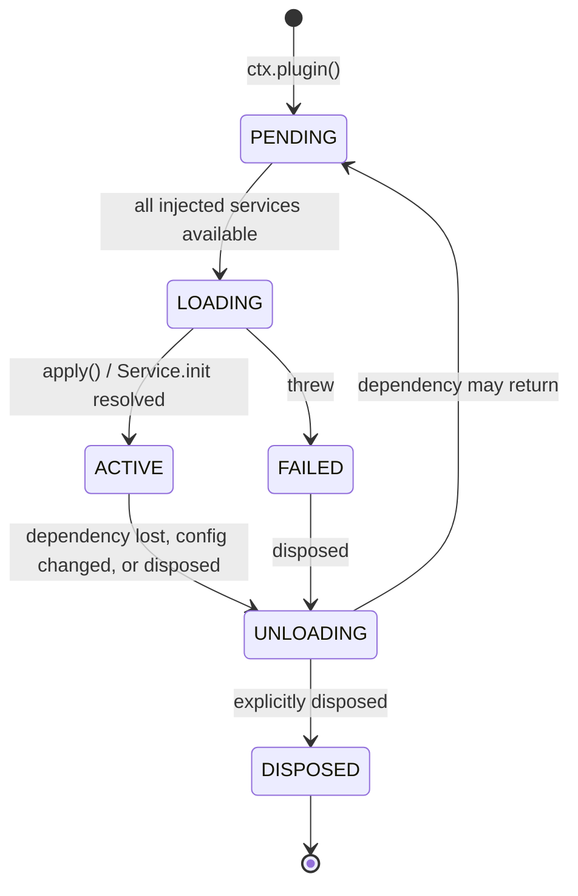

# Plugin Concepts, Lifecycle & DI

> **Legacy Reference:** Formerly `docs/03-plugin-system.md §1 – §3`.

> **What this answers.** What a BBeBee plugin physically is, how it declares and receives its
> dependencies, how its lifetime is managed, how it is discovered and loaded on each platform,
> and what containment it is (and is not) subject to.

Plugins are Layers 2 through 4 of [02 §1](../architecture/layers.md#1-the-layer-model): core services,
log transports and features. The mechanics here are identical for all of them — same manifest,
same lifecycle, same loader — and the *only* thing that
distinguishes a core plugin from a feature plugin is what it is allowed to import: a core plugin
may reach the platform SDK and the kernel's bootstrap surface, a feature plugin may not. That is
worth stating early, because everything below reads as if there were one kind of plugin, and
architecturally there nearly is.

All API shapes below were verified against `cordis@4.0.0-rc.9` source and its test suite.
Cordis is a release candidate and says so; see
[09 §5](../workflow/build-pipelines.md#51-the-cordis-rc-problem) for the pinning strategy.

---

## 1. What a plugin is

A plugin is one of three things. Cordis accepts all three; BBeBee uses the first two.

**A function.** For plugins that only register behaviour and provide no service.

> ⚠️ **Make it `async`.** Cordis decides "is this a class?" with
> `!!func.prototype`, and a plain `function apply(…)` has one — so it is `new`-ed as if it were a
> service and **the disposer it returns is discarded**. The plugin loads, works, and never unloads:
> exactly the failure this architecture claims is impossible, and invisible until something asks
> why an unloaded plugin's provider is still registered. `async function`, arrow functions and
> object-method shorthand have no prototype and are safe. `conventions.test.ts` fails the build on
> the other shape.

```ts
import type { Context } from '@BBeBee/protocol'

export const name = 'plugin-media-keys'
export const inject = ['player', 'device']

export async function apply(ctx: Context) {
  // Returning a function makes it the disposer for this plugin.
  return ctx.device.onMediaKey((key) => {
    if (key === 'play-pause') ctx.player.togglePlay()
    if (key === 'next') ctx.player.next()
  })
}
```

**A `Service` subclass.** For plugins that claim a service key. The class *is* the plugin — pass
the constructor itself to `ctx.plugin()`.

```ts
import { Service } from 'cordis'
import type { Context, PlayerService } from '@BBeBee/protocol'

export class Player extends Service implements PlayerService {
  static inject = ['audio', 'db', 'mediaSession']

  constructor(ctx: Context) {
    super(ctx, 'player')   // claims ctx.player
  }

  // Runs after construction. Dependents stay blocked until it resolves,
  // so ctx.player is never observed half-initialised.
  async [Service.init]() {
    await this.restoreQueue()
    const off = this.ctx.mediaSession.onCommand((c) => this.handle(c))
    return () => {           // returned disposer is collected by the fiber
      off()
      this.audioNode?.disconnect()
    }
  }

  togglePlay(): void { /* … */ }
}
```

**An object with `apply`.** Equivalent to the function form; used when metadata reads better
alongside the implementation.

### The metadata fields

Every plugin may carry these (from Cordis's `Plugin.Base`):

| Field | Meaning |
|---|---|
| `name` | Diagnostic label. Appears in logs, error stacks, and the plugin inspector. Always set it. |
| `inject` | Services this plugin needs. See §3. |
| `provide` | Service keys this plugin will claim. Lets Cordis know a key is *coming* so dependents wait rather than fail. |
| `Config` | A [Standard Schema](https://standardschema.dev) validator for the plugin's configuration. Zod 4, Valibot, and ArkType all satisfy it. Cordis validates before `apply` runs and throws a `ValidationError` listing every issue. |
| `intercept` | Per-plugin service configuration overrides. See §5. |

### BBeBee's additions

Three conventions on top of Cordis, enforced by the kernel and tooling:

- Every plugin package ships a **standardized `BBeBee.plugin.json` manifest** ([loading.md §6.3](loading.md#63-standardized-manifest-specification-bbebeepluginjson)) with 14 standard fields:
  `id`, `name`, `displayName`, `description`, `version`, `author`, `engines`, `enabled`, `dependencies`, `systemId`, `moduleId`, `entry`, `capabilities`, `contributes`, `effect`.
  The `systemId` field assigns the package to its architectural layer stratum (`"layer-1"` through `"layer-5"`), while `moduleId` maps it to its functional domain (`"sources"`, `"playback"`, `"lyrics"`, `"dsp"`, `"storage"`, `"settings"`, `"inspector"`, etc.).
- A plugin's **runtime module has a default export** that is the Cordis plugin, so the static loader on mobile and the dynamic loader on desktop treat every plugin identically.
- **Dual-mode Loading Architecture**: Statically bundled on mobile via codegen (`apps/mobile/generated/plugins.ts`), while desktop dynamically discovers and loads all workspace built-ins via Vite dynamic globs (`getBuiltinPluginRegistry()`) and third-party plugins over the privileged `bbebee-plugin://` scheme without any static codegen file.

---

## 2. Lifecycle

Cordis models plugin lifetime as a **fiber** — a state machine plus a disposal ledger.



The transition that matters most, and that most plugin systems lack: **`ACTIVE → UNLOADING →
PENDING`**. If a service a plugin injected disappears, the plugin is torn down and parked. If
that service comes back, the plugin is rebuilt from scratch. This is also why disabling one
imported music source removes everything it contributed with no bespoke cleanup code: a source is
data, but the runtime gives each one its own fiber precisely to inherit this
([06 §4.1](../sources/runtime.md#41-a-sources-lifetime)).

### The rule: every side effect goes through the fiber

> Anything a plugin starts, it must register so the fiber can stop it.

A second, subtler rule follows from how services are handed out: **wrap a disposer that came back
through a service proxy** rather than returning it straight. Services are reached through Cordis's
tracing proxy, and the function that comes back through it is not the one the fiber collects — so
the obvious line leaves the registration in place after unload.

```ts
// ❌ Looks right; the effect is still registered after this plugin unloads.
export async function apply(ctx: Context) {
  return ctx.dsp.registerEffect(effect)
}

// ✅ Wrapped in a local closure, which is what gets collected.
export async function apply(ctx: Context) {
  const off = ctx.dsp.registerEffect(effect)
  return () => off()
}
```

```ts
export async function apply(ctx: Context) {
  // ✅ Return a disposer.
  const conn = ctx.ws.connect(url)
  return () => conn.close()
}

export async function apply(ctx: Context) {
  // ✅ Several disposables — use the generator form; they unwind in reverse.
  return ctx.effect(function* () {
    yield ctx.on('player/track-changed', onTrack)   // ctx.on returns its own disposer
    const timer = setInterval(tick, 30_000)
    yield () => clearInterval(timer)
    yield ctx.ui.registerSlot('now-playing.actions', descriptor)
  }, 'scrobbler')
}
```

Anti-patterns, all of which produce a plugin that cannot be disabled:

```ts
// ❌ Listener outlives the plugin.
window.addEventListener('resize', onResize)

// ❌ Timer keeps firing into a dead context.
setInterval(poll, 1000)

// ❌ Module-level singleton shared across fibers; survives reload with stale state.
let cache = new Map()

// ❌ Escapes the fiber entirely — nothing can cancel it, and it may resolve
//    after unload and touch disposed state.
;(async () => { await longRunningScan() })()
```

For the last case, take a cancellation signal from the fiber and honour it:

```ts
export async function apply(ctx: Context) {
  const ac = new AbortController()
  void ctx.library.scan({ signal: ac.signal }).catch((e) => ctx.logger.error(e))
  return () => ac.abort()
}
```

`ctx.effect()` calls nest, and `fiber.getEffects()` returns the labelled tree — which is what the
built-in plugin inspector renders, and the fastest way to find a leak.

### Errors

A plugin that throws during load enters `FAILED`; it does not take the app down, and its
dependents simply never activate. `Config` validation failures throw `ValidationError` with every
issue listed, before `apply` runs. The kernel records the error on `plugin_records.lastError`
and surfaces it in the plugin inspector, so a broken plugin is visible rather than silent.

---

## 3. Dependencies

`inject` is a declaration of need, not an import. Load order is *derived* from it; nothing in
BBeBee sequences plugin startup by hand.

```ts
// Array form — the usual case.
export const inject = ['db', 'http', 'fs']

// Object form — the value is that service's INTERCEPT CONFIG, not a marker.
export const inject = { db: null, http: { timeoutMs: 5_000 } }
```

> ⚠️ **Everything named in `inject` is required, in both forms.** Cordis's `Fiber._refresh()`
> iterates every key and parks the fiber if any implementation is missing; a `null` value in the
> object form means "no interception config", *not* "optional". This is asserted in
> `packages/kernel/src/cordis-assumptions.test.ts` because it is easy to assume otherwise.

The fiber stays `PENDING` until every injected service is `ACTIVE`.

### Optional dependencies

There is no optional variant of `inject`. Express one as a **nested `ctx.inject()`**: the outer
plugin activates immediately, and only the inner block waits.

```ts
export const inject = ['db']            // hard requirement

export async function apply(ctx: Context) {
  ctx.inject(['scrobbler'], (scoped) => {
    // Runs if and when ctx.scrobbler appears; torn down if it goes away.
    return scoped.on('player/track-completed', (p) => scoped.scrobbler.submit(p))
  })
}
```

The decorator form does exactly this for service classes, and reads better:

```ts
import { Inject, Service } from 'cordis'

export class Library extends Service {
  @Inject('scrobbler')
  setupScrobbling() {
    // Runs when ctx.scrobbler becomes available, and is torn down if it goes away.
    return this.ctx.on('player/track-completed', (p) => this.ctx.scrobbler.submit(p))
  }
}
```

> ⚠️ The decorator is a **2023-11 standard decorator**, not the legacy TypeScript form. Both the
> Babel config (mobile) and `tsconfig` must be set accordingly —
> [04 §17](../services/contracts.md#17-runtime-compatibility-checklist).

### Choosing what to inject

Inject the *narrowest* set that is genuinely required. A plugin that injects `db` merely to read
one setting should inject `store` instead, so it stays loadable on a device where the database
failed to open. Over-injecting turns a soft degradation into a hard one.

---

