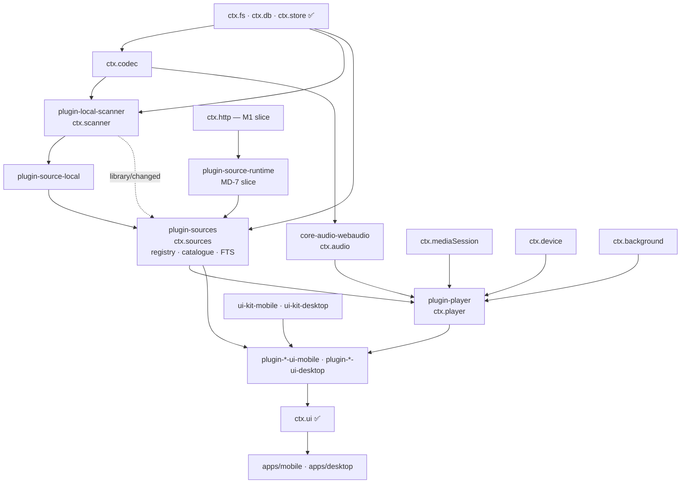
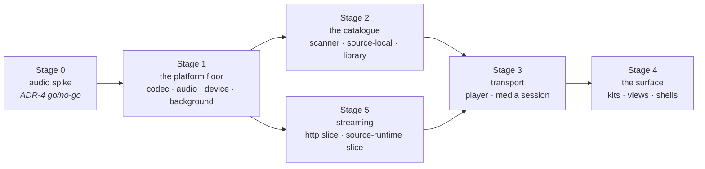
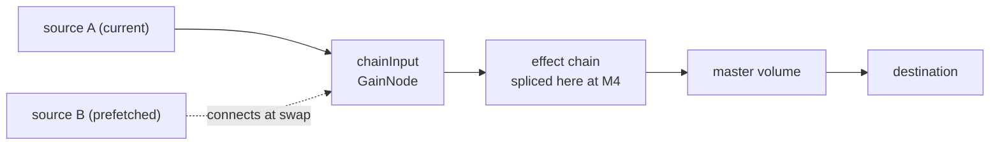

# M1 Execution Plan (Historical Archive)

> **Legacy Reference:** Formerly `docs/11-roadmap-M1.md`.

> **What this answers.** What M1 builds, in what order, what "done" means for each package, and
> how every exit criterion in [roadmap.md §M1](./roadmap.md#m1--it-plays-music) is actually verified.
> [roadmap.md](./roadmap.md) says *what* the milestones are; this says *how* this one gets built.

> ⚠️ **Historical record.** The package names below are the ones that existed during M1. The
> screens have since been split into surface plugins — `plugin-album` (the album page),
> `plugin-now-playing` (the full-screen player and the bar that opens it), `plugin-queue` (the
> up-next list) — and `plugin-library` owns playlists, favourites and collections. For the
> current package layout see [workflow/structure.md §1](../workflow/structure.md#1-repository-layout), and for the
> current state of each milestone see [roadmap.md](./roadmap.md).

M0 proved the kernel: one plugin graph, two platforms, total unload, conformant core services. It
proved nothing about the application, because nothing in M0 makes a sound.

M1 is where four claims stop being design and become code that either works or does not.

| Claim | Stated in | What M1 does to it |
|---|---|---|
| One Web Audio graph plays and processes audio on iOS, Android and Electron | [ADR-4](../architecture/overview.md#adr-4--react-native-audio-api-is-the-primary-playback-and-dsp-engine-on-every-target) | Buffered and streamed playback on all three targets, with lock-screen control and background survival |
| A music source is data the runtime interprets, not a package we ship | [sources/spec.md §1](../sources/spec.md#1-the-model) | Two providers at opposite ends of the surface: `plugin-source-local`, and a **one-rule source document** played through the runtime's M1 slice (MD-7) |
| The player does not know where bytes come from | [architecture/layers.md §5](../architecture/layers.md#5-composition-how-features-reach-each-other) | `player/before-resolve` becomes a live waterfall with two possible answers, one local and one remote |
| One plugin contributes UI to two shells that share no component code | [ADR-2](../architecture/overview.md#adr-2--the-ui-is-split-react-native-on-mobile-react-dom-on-desktop) | Five screens per shell, from headless packages plus per-target view packages |

The sequencing principle from [roadmap.md](./roadmap.md) holds inside the milestone too: **the audio
spike comes before anything that depends on it** (§3.1). Everything else in M1 is recoverable
work; ADR-4 is not.

---

## 1. Scope

### 1.1 In

| Area | Packages | Delivers |
|---|---|---|
| Audio engine | `core-audio-webaudio` | `ctx.audio` — one implementation, both targets |
| Decoding & tags | `core-codec-node`, `core-codec-rn` | `ctx.codec` — metadata, artwork, PCM, format support |
| OS surfaces | `core-media-session-electron`, `core-media-session-rn`, `core-device-electron`, `core-device-expo`, `core-background-electron`, `core-background-expo` | Lock screen, notification, MPRIS/SMTC/Now Playing, media keys, network state, wake locks, suspend hooks |
| Network (slice) | `core-http-node`, `core-http-rn` | `ctx.http` restricted to GET/HEAD, headers, `Range`, streaming, progress — MD-1 |
| Sources & catalogue | `plugin-sources`, `plugin-source-local`, `plugin-source-runtime` *(stream-only slice, MD-7)* | `ctx.sources` — registration, discovery, the catalogue cache those answers land in, and the first source document |
| Scanning | `plugin-local-scanner` | `ctx.scanner` — roots, incremental walk, tag and artwork import |
| Playback | `plugin-player` | `ctx.player` — transport, queue, resolution, history, persistence |
| UI infrastructure | `ui-tokens`, `ui-core`, `ui-kit-mobile`, `ui-kit-desktop` | Tokens, hooks, and the parity component set |
| Views | `plugin-player-ui-*`, `plugin-sources-ui-*`, `plugin-local-scanner-ui-*` | Library, album, queue, now playing, scan-root settings, and a minimal paste-a-URL source list |
| Shells | `apps/mobile`, `apps/desktop` | Background audio configuration, close-to-tray, bootstrap sets, new bridge hosts |
| Kernel & contracts | `@BBeBee/kernel`, `@BBeBee/protocol` | `db:write:core` (MD-4), the catalogue reads on `ctx.sources`, the `ctx.scanner` contract, the fractional-index helper |

### 1.2 Out

Deferred deliberately, with where each lands. Nothing here is blocked by an M1 decision.

| Deferred | Lands in | Why it can wait |
|---|---|---|
| The rule language, `@js:`, search/explore/album rules, import UI, the tracer | M2 | MD-7. M1 needs a playable URL, which is one template; everything else in [06](../sources/spec.md) needs a backend to point at and a sandbox to run in, and neither is on M1's critical path |
| `ctx.js` — the **implementation** | M2 | The contract lands in `@BBeBee/protocol` with the docs, because [services/contracts.md §19](../services/contracts.md#19-ctxjs--the-sandboxed-evaluator) is what M2 is built against and a contract nobody can read is not a plan. No `core-js-quickjs-*` package exists, nothing injects `js`, and no M1 code path evaluates a script |
| Authentication, `ctx.secrets`, persistent cookie jars | M2 | No M1 source has credentials. Building the jar with no backend to sign into tests nothing ([sources/runtime.md §5.1](../sources/runtime.md#51-session-persistence--cookies-survive-the-app)) |
| Cross-source fan-out in anger, `track_links`, identity linking | M2 | `searchAll` exists and is exercised, but two sources — one of which cannot search — is not a fan-out. `ctx.sources.searchLocal` covers the catalogue in the meantime |
| `plugin-library` / `ctx.library` — playlists, favourites, collections | M2 | MD-3. None of M1's five screens curates anything, and the catalogue reads that used to justify the package now live on `ctx.sources` |
| `plugin-download`, bindings with `origin: 'download'` | M3 | The waterfall it hooks is live in M1 with no listeners — which is exactly the control arm its regression test compares against |
| `ctx.dsp` and every effect | M4 | The splice point exists in the M1 graph and stays empty (§4.2) |
| Capability prompts, quarantine, any runtime-loaded code | M5, if ever | Every plugin is `builtin` and statically bundled ([ADR-1 as amended](../architecture/overview.md#adr-1--plugins-are-statically-bundled-on-every-target)) |
| Command palette, context menus, drag-to-reorder, tray mini-player, detached window | M2+ | MD-2 |
| Playlists, smart playlists, ratings, lyrics, scrobbling | M2+ | Not required to browse a library and press play |
| Packaging (`electron-builder`, `eas build`) | First release | Already noted in [workflow/structure.md §7](../workflow/structure.md#running-the-apps) |

### 1.3 Milestone decisions

Seven decisions taken for M1, in the shape of the ADRs and for the same reason: so a reader six
months from now can tell what was chosen from what was merely assumed.

**MD-1 — A minimal `ctx.http` ships in M1.**
GET and HEAD, arbitrary headers, `Range`, `stream()`, `onProgress`, timeout and abort. No cookie
jars, no `download()`, no auth interception.
*Why.* The risk register's early warning for ADR-4 is that "M1 exercises streaming, gapless, and
lock-screen controls". Local files exercise none of the streaming path — buffering, stall and
recovery, seek-by-range, an underrun that is not a pause. Discovering at M2 that the engine
handles streams badly is discovering it after `plugin-player` was written against it.
*Cost.* Two more packages in M1, and a conformance suite that M2 extends rather than replaces.
The suite is written so the deferred members are absent, not stubbed.

**MD-2 — The UI is real but narrow.**
Both kits are built properly — tokens, hooks, the parity component set, virtualisation,
accessibility — and are then spent on five screens: library (tracks and albums), album detail,
queue, now playing, and settings for scan roots and URL sources. No command palette, no
right-click menus, no drag-to-reorder, no tray mini-player.
*Why.* The expensive, hard-to-retrofit half of ADR-2 is the infrastructure: two token pipelines
that must agree, a shared hook layer, a parity test. The cheap half is more screens. Building
screens first and infrastructure later means writing the screens twice.
*Cost.* Desktop does not yet feel like a desktop app, so ADR-2's premise stays unproven until the
desktop-only interactions land in M2.

**MD-7 — `plugin-source-runtime` enters at M1 as a stream-only slice.**
The runtime ships in M1 able to do exactly one thing: hold a source document whose only rule block
is `ruleStream`, render its `url` template, and return a `StreamHandle`. No `@js:`, no `ctx.js`,
no selector engines, no import review screen — a URL typed into settings becomes a two-field
document written straight to the `sources` table.
*Why.* M1 must exercise the streaming path — buffering, stall and recovery, seek-by-range — or
ADR-4's early warning is untested (MD-1). Something has to own a remote URL. Under the old design
that was `plugin-source-http-url`, a package; under
[ADR-5](../architecture/overview.md#adr-5--music-sources-are-imported-strings-interpreted-by-one-runtime)
the same job is a document, and writing the package would mean deleting it in M2. This way M1's
streaming provider *is* the first source document, and M2 grows the runtime rather than replacing
a package.
*Cost.* A sliver of M2 pulled forward — the record shape, the fiber-per-source lifecycle, and the
`=`-template evaluator, which is the smallest piece of the language. Everything expensive stays in
M2.
*Consequence.* The regression test M1 wanted — "a provider with none of the optional surface must
not break any screen" — gets sharper: capabilities are derived
([sources/rule-engines.md §1.3](../sources/rule-engines.md#13-capabilities-are-derived-not-declared)), so a document with
one rule block genuinely *has* one capability, and a screen that assumes more fails immediately
rather than plausibly.

**MD-3 — `ctx.sources` owns the catalogue; `ctx.library` is curation, and moves to M2.**
Three services, three responsibilities, no overlap:

| Service | Package | Owns |
|---|---|---|
| `ctx.sources` | `plugin-sources` | Which backends exist, and what they hold: registration, lookup by URN, the search fan-out, the catalogue cache, and the FTS5 index |
| `ctx.library` | `plugin-library` | The user's curation: playlists, favourites, collections. **M2** |
| `ctx.player` | `plugin-player` | Playback: transport, queue, resolution, history |

The view packages call `ctx.sources` and never touch `ctx.db`.
*Why.* [sources/runtime.md §1.1](../sources/runtime.md#11-one-runtime-many-sources) already assigns the catalogue
cache to `ctx.sources` — "the provider … answers questions and returns plain data; `ctx.sources`
caches the answers into the catalogue tables" — so reads belong beside the writes rather than in a second
service that would have to agree with it. And [architecture/layers.md §6](../architecture/layers.md#6-state-ownership)
requires catalogue access through *one* owning service: without that, the same SQL gets written in
`-ui-mobile` and `-ui-desktop`, which is the exact failure mode ADR-2's risk entry names.
*Consequence.* `plugin-library` has nothing left to do in M1 — none of MD-2's five screens curates
anything — so it moves to M2 with playlists. M1 carries one package fewer.
*Cost.* `plugin-sources` is doing two jobs that a fourth package (`ctx.catalog`) could separate:
knowing *who* the backends are, and caching *what* they said. If that seam starts to hurt, the
split is contained — the reads and the FTS index move together, and no consumer changes shape.

**MD-4 — `db:write:core` is added; `db:read:core` becomes read-only.** *(Landed.)*
`assertDb` gained a verb check: `db:read:core` permits `SELECT` against core tables, mutation
requires `db:write:core`, and `db:*:core` additionally permits `CREATE`/`DROP`/`ALTER`. The verbs
do not nest, so a plugin that reads and writes the catalogue declares both and the install-time
prompt can name exactly what it is asking for. Statements are classified by the most demanding
thing they do, so a `DROP` cannot ride in behind a `SELECT`. `plugin-sources`,
`plugin-source-local`, `plugin-local-scanner` and `plugin-player` all declare
`db:read:core` + `db:write:core`.
*Why.* `db:read:core` used to let any statement through, `INSERT` included. M1 is the first
milestone whose plugins write core tables, so it was the last cheap moment to fix the name —
before an install-time prompt in M5 says "read" while granting write.
*Where.* `classifyDbAccess` and the grant parser in
`packages/kernel/src/capability-gate/capability.ts`, the shared SQL reader in
`packages/kernel/src/capability-gate/sql.ts`, and cases in the `db-scope` suite that both
`core-db-node` and the desktop bridge run; the grammar rows in
[plugins/capabilities.md §7](../plugins/capabilities.md#capability-grammar).
*Also closed while in there*, each of which made the verbs meaningless on its own: a
schema-qualified `main.plugin_other_secrets` was attributed to a table called `main` and permitted
by the `core` fallback; a statement naming no visible table (`DROP INDEX`, `VACUUM`, `PRAGMA
foreign_keys = OFF`) skipped the gate entirely, since the per-table loop *is* the gate; the desktop
bridge kept a second list of forbidden SQL that had drifted, so `VACUUM INTO '/any/path'` wrote a
file past its containment checks; `core-db-expo` had no gate at all, so `db:own` meant one thing on
desktop and nothing on mobile; and both drivers silently executed only the first statement of a
multi-statement string, which would have let a migration record a version it had half-applied.

**MD-5 — Gapless, prefetch and crossfade are all in M1.**
The full [audio/playback.md §2](../audio/playback.md#gapless-and-crossfade) behaviour: prefetch beginning at
`max(15s, crossfadeMs + 5s)` and cancelled by `AbortSignal` when the queue changes;
`AudioBufferQueueSourceNode` gapless for buffered sources; equal-power crossfade as the mutually
exclusive alternative; the setting is the three-way `gapless | crossfade | neither`.
*Why.* Gapless is the hardest thing M1 asks of `react-native-audio-api`, and it is named in the
ADR-4 early warning. Deferring it to M4 means learning the answer at M4, when the fallback costs a
rewrite of `plugin-player` rather than a re-scope of a milestone.
*Cost.* The most intricate code in M1, and a device smoke test that is a listening test.

**MD-6 — Desktop close-to-tray is in; the tray mini-player is not.**
Closing the window hides it, keeping the renderer — and therefore the kernel and the audio graph —
alive, with `powerSaveBlocker` held while playing. There is no tray UI beyond show and quit.
⚠️ The blocker half was built as a service and then never asked for: `ctx.background.acquireWakeLock`
existed, was tested, reached `powerSaveBlocker` through the bridge — and had **no caller**, so a
hidden window kept playing right up until the machine slept. `plugin-player` now takes the lock
while the transport is playing-like and releases it on pause, on an empty queue, and on unload.
`stalled` counts as playing: a lock dropped and re-taken on every buffer underrun is one the OS
sees flapping, and the track is still playing as far as the user is concerned.
*Why.* [roadmap.md §M1](./roadmap.md#m1--it-plays-music) requires playback to survive window-hide, and
[ADR-3](../architecture/overview.md#adr-3--the-electron-kernel-lives-in-the-renderer-main-is-a-thin-native-host)
makes that a process-lifetime question rather than a UI one. The mini-player is UI, and MD-2
defers UI.

---

## 2. The package set

`✅` exists from M0 · `+` new in M1 · `~` existing, extended.

```
core-audio-webaudio         ✅  ctx.audio — shared implementation, all three targets
core-codec-node             ✅  ctx.codec — music-metadata over ctx.fs, bounded head read
core-codec-rn               ✅  ctx.codec — inherits the tag reader (it is pure JS over ctx.fs
                                and a second one would have to agree with it), adds the device's
                                decodeAudioData and its own supportedFormats
core-http-node              ✅  ctx.http (M1 slice) — fetch-shaped, transport is a seam
core-http-rn                ✅  ctx.http (M1 slice) — the same engine over expo/fetch, which is
                                the only RN fetch with a real ReadableStream
core-media-session-electron ✅  ctx.mediaSession — navigator.mediaSession + MPRIS/SMTC/Now Playing
core-media-session-rn       ✅  ctx.mediaSession — lock screen and media notification
core-device-electron        ✅  ctx.device — network, battery, media keys, hotkeys
core-device-expo            ✅  ctx.device — expo-network, expo-battery
core-background-electron    ✅  ctx.background — powerSaveBlocker, intervals, suspend hooks
core-background-expo        ✅  ctx.background — audio session, keep-awake, expo-background-task
core-desktop-bridge         ✅  hosts for fs, db, paths, system and http; preload surface;
                                the main→renderer event channel the OS services need
core-fs-node / -expo        ✅  toPlayableUri and canWatch get their first real consumer
core-db-node / -expo        ✅  the db:write:core verb check (MD-4)

plugin-sources              ✅  ctx.sources — registry, discovery, catalogue cache, FTS index
plugin-source-local         ✅  MediaProvider over the filesystem, source id 'local'
plugin-source-runtime       ✅  grown past the MD-7 slice into M2's full runtime
plugin-local-scanner        ✅  ctx.scanner — roots, incremental walk, tag and artwork import
plugin-player               ✅  ctx.player — transport, queue, resolution, history, persistence
plugin-ui                   ✅  gets its first non-trivial contributions
plugin-inspector            ✅  used to verify the M1 fiber tree unloads clean

ui-tokens                   ✅  design tokens as data, with the WCAG AA gate
ui-core                     ✅  useService / useServiceState over useSyncExternalStore
ui-parity                   ✅  the component contract, and the check both kits must pass
ui-kit-mobile               ✅  the parity component set, React Native
ui-kit-desktop              ✅  the parity component set, React DOM
plugin-player-ui-*          ✅  now playing, transport, queue
plugin-sources-ui-*         ✅  library, album detail
plugin-local-scanner-ui-*   ✅  settings: scan roots

protocol                    ✅  catalogue reads on ctx.sources, ctx.scanner, the fractional index,
                                the audio/codec/http conformance suites, the mock AudioService
kernel                      ✅  db:write:core, bootstrap sets for the new core services
tooling-fixtures            ✅  dev-only: the ≥5,000-file corpus generator, the instrumented
                                ctx.fs, and the byte-serving http fixture (§7)
```

Dependency direction — every arrow is an `inject`, and load order is derived from them, never
declared ([architecture/layers.md §3](../architecture/layers.md#3-boot-sequence)):



---

## 3. Sequencing

Five stages. Each ends in something demonstrable, because a stage that cannot be demonstrated
cannot be shown to be finished.



### 3.1 Stage 0 — the audio spike

Before any package in §2 is written, one throwaway branch answers whether ADR-4 holds. It is not a
plugin, has no tests, and is deleted afterwards. It must show, **on an iOS device, an Android
device, and in Electron**:

- A local file decoded and played to completion, with `positionMs` advancing monotonically.
- A remote URL played as a stream, with a seek that lands and a deliberately induced stall that
  recovers rather than ending the source.
- Two buffered sources handed off through `AudioBufferQueueSourceNode` with no audible gap.
- A `GainNode` and a `BiquadFilterNode` constructed and connected — not for M1, but because M4 is
  bought with the same currency.
- Playback continuing with the app backgrounded (mobile) and the window hidden (desktop).
- Lock-screen or notification controls driving pause and resume.

**The decision point.** If any of the first three fails on a target and is not fixable within the
spike, `core-audio-rntp` over `react-native-track-player` becomes the mobile implementation
([audio/playback.md §1](../audio/playback.md#escape-hatch)). The consequences are then recorded *before* Stage 1
starts rather than discovered later: no mobile DSP, so M4 becomes desktop-only; `chainInput`
becomes a no-op on mobile; MD-5 narrows to whatever the fallback engine offers. `ctx.player` and
every view package are unaffected — that is what the abstraction is for — but the milestone's
scope changes, and that is a decision to take deliberately.

### 3.2 Stage 1 — the platform floor

`core-codec-*`, `core-audio-webaudio`, `core-device-*`, `core-background-*`, and the bridge hosts
they need. No feature plugins.

**Demo.** A test that loads a bundled file through `ctx.codec` and `ctx.audio` and plays it, green
in Node with fakes, on an iOS simulator, on an Android emulator, and in Electron.

### 3.3 Stage 2 — the catalogue

`plugin-local-scanner`, `plugin-source-local`, and the catalogue half of `plugin-sources` (the
registry half is already built), plus the protocol changes they need (MD-3).

**Demo.** Point the scanner at a folder; `ctx.sources.listTracks()` returns it sorted and paged;
`ctx.sources.searchLocal('bjork')` finds `Björk`; a second scan of the unchanged folder reads no
file contents at all. Still nothing audible.

### 3.4 Stage 3 — transport

`plugin-player` and `core-media-session-*`.

**Demo.** From a test or the debug console: `playNow`, `playFromContext` (a queued URN jumps and
the queue survives; an unqueued one brings its list in), pause, seek, next, previous, reorder. The
lock screen shows the track and its buttons work. Kill and relaunch: the queue and position are
back, and nothing is playing.

### 3.5 Stage 4 — the surface

`ui-tokens`, `ui-core`, both kits, the view packages, both shells.

**Demo.** The exit criteria of [roadmap.md §M1](./roadmap.md#m1--it-plays-music), performed by a person
holding a phone and a person clicking a mouse.

### 3.6 Stage 5 — streaming (parallel with Stage 2)

`core-http-node`, `core-http-rn`, and the MD-7 slice of `plugin-source-runtime`. Depends only on
Stage 1 and joins at Stage 3, so it never sits on the critical path.

**Demo.** A URL pasted into settings becomes a one-rule source document; it plays, seeks, survives
a stall, and reports `stalled` rather than `paused` while it recovers.

---

## 4. Work packages

Each is done when its boxes are ticked, `pnpm check` is green, and it passes the leak test
parameterised over the workspace ([workflow/testing.md §6](../workflow/testing.md#6-testing-strategy)). Those
three are assumed below rather than repeated.

### 4.1 `core-codec-node` · `core-codec-rn` — `ctx.codec`

Desktop reads tags with `music-metadata` **in `main`**, reached through `core-desktop-bridge`; PCM
decoding uses the renderer's `decodeAudioData` and needs no bridge at all. Mobile uses
`react-native-audio-api`'s `AudioDecoder` for PCM and a native tag reader for metadata.

`readMetadata` must not read the whole file. A 40 MB FLAC costs a header read and a seek to the
tag block, not 40 MB across an IPC channel — that is the difference between a 5,000-file scan
taking minutes and taking an afternoon.

- [x] New `codecConformance` suite in `packages/protocol/src/conformance/`, run in Node and on
      device: tags, embedded artwork, duration probe, PCM decode, non-empty `supportedFormats()`.
      ⚠️ Green in Node against `core-codec-node`; the device half is the smoke matrix's.
      The PCM case is deliberately two-sided, because `decode` is a member the two platforms
      answer differently: mobile has a real decoder (`AudioDecoder`), and on desktop decoding
      belongs to the audio engine, since a second decoder in the tag reader would be a second
      answer to "what can this platform play". So an implementation may decode *or* refuse in a
      way that names where decoding lives — what it may not do is return something shaped like
      audio with no audio in it. A caller can handle a refusal and cannot handle a lie, which is
      the same rule as MD-1's "absent, not stubbed".
- [x] A conformance case asserts `readMetadata` stays under a byte ceiling on a large file.
- [x] `supportedFormats()` reflects reality per platform; the ⚠️ in
      [services/contracts.md §13](../services/contracts.md#13-ctxcodec--decoding-and-metadata) is honoured by
      *reporting* what could not be decoded, never by skipping it silently.
- [x] The new bridge methods are capability-tagged and path-contained like every other host
      ([plugins/concepts.md §7](../plugins/concepts.md#where-the-gate-actually-runs)).
      ⚠️ **There turned out to be none for codec.** `music-metadata` is pure JavaScript, so it
      reads through `ctx.fs` like everything else and the same implementation runs in `main` and
      in the renderer — one code path instead of two, and the bounded head read is a
      `readBytes` that was already on the allowlist and already path-contained. The paragraph
      above describes the design that was replaced. `http` is the host that did grow, and it
      carries its own gate (§4.5) and containment cases.

### 4.2 `core-audio-webaudio` — `ctx.audio`

One package for both targets: `react-native-audio-api@0.13.3` on mobile, the same package's web
build or the renderer's native Web Audio on desktop. This is the package Stage 0 exists to
de-risk.

The M1 graph is the [audio/playback.md §1](../audio/playback.md#graph-topology) topology with the chain empty:



`chainInput` is a real node from day one and sources connect to it, never to `destination`. M4
splices the chain between `chainInput` and master volume without touching a line of
`plugin-player`. M1 ships **no** placeholder chain and no `ctx.dsp`: an empty splice point is
honest, a pass-through chain is a lie that later has to be un-built.

- [x] `load()` honours both strategies — `buffer` for local files and short remote ones, which is
      what makes MD-5's gapless possible, and `stream` otherwise.
- [x] `onInterruption` and `onRouteChange` map each platform's events onto the contract's shape.
      The *policy* that consumes them lives in `plugin-player` (§4.9), not here.
- [x] A streamed source reports a buffer underrun and its recovery through `onStalled`, which is
      the only thing that makes `stalled` distinguishable from `paused` one layer up. The
      element's `waiting`/`stalled` become `true` and `playing`/`canplaythrough` become `false`,
      and only a *change* is published — an element under a slow network sends `waiting`
      repeatedly, and a player that took each one as a fresh stall would restart its recovery
      timeout on every one of them. A decoded buffer cannot underrun and registers nothing.
- [x] `listOutputDevices` / `setOutputDevice` are real on desktop; on mobile a single-entry list
      with the leak documented, never a thrown error.
- [x] `outputLatencyMs` is reported, so M4 has something to compensate against.
- [x] `audioConformance`: play, position advances, pause holds position, seek lands, `onEnded`
      fires exactly once, `dispose()` disconnects every node it created. Green against an
      `OfflineAudioContext` in Node and on device.

### 4.3 `core-device-*` · `core-background-*`

`ctx.device` supplies `network()` and `onNetworkChange` — where `StreamPrefs.saveData` comes from
— plus battery, media keys and hotkeys on desktop.

`ctx.background` supplies `canRunInBackground()`, `acquireWakeLock`, `schedule` (used in M1 only
by the mobile scan poller, since `ctx.fs.canWatch` is false there) and `onWillSuspend`, which is
where the player checkpoints.

- [x] Desktop's `canRunInBackground()` is `true`; mobile's is `true` only while audio holds the
      process, and the value is derived rather than hardcoded.
- [x] `acquireWakeLock` maps to `powerSaveBlocker` on desktop and is released promptly; a leaked
      lock is caught by the leak test. ⚠️ And it now has a *caller* — see MD-6. A capability with
      no consumer passes every test it has and delivers nothing.
- [ ] `onWillSuspend` fires before a real suspension on both platforms, verified on device — a
      hook that never fires is worse than no hook, because everything downstream trusts it.

### 4.4 `core-media-session-electron` · `core-media-session-rn`

Desktop publishes through Chromium's `navigator.mediaSession` in the renderer, and through `main`
for MPRIS (Linux), SMTC (Windows) and the macOS Now Playing centre. Mobile uses
`react-native-audio-api`'s lock-screen and notification controls, which on Android means the
foreground service and its media notification.

Artwork must be a local `Uri` on mobile, so the order is fixed: publish metadata immediately with
no artwork, then update when the image lands. Never delay the whole update on an image fetch.

⚠️ `setPlaybackState('stopped')` is a **transport state**, not `clear()`. The two implementations
disagreed about this for exactly as long as nothing asked: desktop set the session to `none` and
kept the track, mobile hid the notification and dropped it — so a queue that ran to the end lost
its lock screen on one platform and kept it on the other. Removing the surface has its own member,
and the conformance suite now holds both to it.

- [x] `setSupportedCommands` genuinely changes which buttons the OS surface shows.
- [x] `onCommand` round-trips: a lock-screen press reaches `ctx.player`, and the result is
      reflected back within one update.
- [x] `clear()` removes the OS surface, so a disabled `plugin-player` leaves no ghost lock screen.

### 4.5 `core-http-node` · `core-http-rn` — the M1 slice

Per MD-1: GET and HEAD, arbitrary headers, `Range`, `stream()`, `onProgress`, `timeoutMs`,
`AbortSignal`, redirect handling. Desktop routes through Electron's `net` in `main` and streams to
the renderer, for the CORS and header reasons in [architecture/layers.md §2](../architecture/layers.md#desktop).

`cookies` and `download()` are **absent, not stubbed** — a member that throws is a lie about the
contract, which is the same principle that makes a source's capabilities derived rather than
declared ([sources/rule-engines.md §1.3](../sources/rule-engines.md#13-capabilities-are-derived-not-declared)).

⚠️ **Never normalise a request through `new Request()` on the way to the bridge.** A `Request`'s
header list carries the *request guard*, and in a browser that guard silently drops every
forbidden request header — `Cookie` among them. The renderer-side transport exists to send
`Cookie`. Normalising through a `Request` therefore deletes the one header the bridge was built
for, and deletes it quietly: signing in appears to work and never sticks. It is also a bug no test
in this repository can see by default, because Node's `fetch` does not implement the guard — so
the check that covers it stands a strict `Request` in first. `Headers` on its own carries the
"none" guard and is safe.
The `http/request` waterfall is dispatched with no listeners, so M2's auth plugins arrive to a
hook that already works.

- [x] `httpConformance` covers only the M1 slice, written so M2 adds cases rather than rewrites it.
- [x] `net:host/<glob>` is enforced here, before and after the waterfall — the grant was a manifest
      string with no meaning, exactly as `db:own` once was
      ([plugins/concepts.md §7](../plugins/concepts.md#enforcement)).
- [x] `ReadableStream` on RN 0.86 — resolved by **`expo/fetch`** rather than by a polyfill.
      React Native's own `fetch` is XHR-backed and its `Response.body` is `null`, so a polyfilled
      stream over it would be a stream in shape only: no `Range` seek that plays before the file
      arrives, no `onProgress`, no stall distinguishable from a slow response. `expo/fetch` is
      WinterCG-compliant and returns a real one ([services/contracts.md §17](../services/contracts.md#17-runtime-compatibility-checklist)).
      ⚠️ Verified by construction, not on a device.
- [x] Range requests and progress are exercised against a real byte-serving fixture, not a mock.

### 4.6 `plugin-sources` · `plugin-source-local`

`plugin-sources` arrives in two halves.

**The registry — built.** `register`, `providers`, `get`, `forUrn`, and a `searchAll` that in M1
has at most two sources to ask. It refuses a duplicate `sourceId` rather than shadowing the
incumbent, because two providers on one source id makes every URN in that namespace ambiguous —
the one thing the URN scheme exists to prevent. `sourceUrl` uniqueness in the `sources` table
([data-model/urn.md §4.1](../data-model/urn.md#41-sources-accounts-and-sessions)) is the other half of the same
guarantee, enforced one layer down. `searchAll` returns per-provider results *and*
per-provider errors, reports a slow backend as `pending` rather than cancelling it, skips
providers whose `capabilities` declare no search, and maps a raw `throw` onto the
[sources/authoring.md §7](../sources/authoring.md#7-errors) taxonomy so one rude source cannot fail the fan-out.
Registration is a disposer, so a source whose fiber unloads takes its registration with it.

**The catalogue cache — Stage 2.** Reads for everything above it (MD-3), and ownership of the
FTS5 index. Indexing is driven by `library/changed`, so **any** provider's rows are indexed
without the scanner or a source knowing an index exists. Re-indexing is `DELETE` + `INSERT` on the
same rowid: `contentless_delete=1` permits deletion but refuses a partial `UPDATE`
([data-model/schema.md §4.3](../data-model/schema.md#43-catalogue)).

Each source is loaded inside its own `ctx.isolate('http')` scope from the start
([sources/runtime.md §4.1](../sources/runtime.md#41-a-sources-lifetime)), even though nothing in M1 has cookies to
isolate.

- [x] `listTracks` / `listAlbums` / `listArtists` page and sort in SQL, never in JS — a 100k-track
      library must not be materialised in order to sort it.
- [x] `searchLocal` folds diacritics: `bjork` finds `Björk`, asserted as a test.
- [x] Hooks (`useTracks`, `useAlbum`, `useSearch`) live in this headless package and are imported
      by both view packages ([ui/architecture.md §4](../ui/architecture.md#4-binding-services-to-react)).
- [x] The linked-URN display collapse is **not** implemented, but the returned shape can carry it,
      so M2 adds behaviour rather than changing a signature. ⚠️ M2's linking overtook this the
      way its runtime overtook MD-7: `track_links`, `linkTracks` and `linksFor` are built and
      exposed on `ctx.sources`. Only the *display* collapse is still M2's.
- [x] Declares `db:read:core` + `db:write:core` once the cache lands; the registry half needs
      neither and declares nothing (MD-4).

`plugin-source-local` is a provider like any other — the local library is not privileged. Source
id `local`, `auth.flow = { kind: 'none' }` with `signIn` resolving immediately and `signOut`
clearing its cached rows. It is the one provider that is not a document and never will be, because
there is no HTTP to describe ([sources/authoring.md §12](../sources/authoring.md#12-what-is-not-a-string-local-files)).

`resolveStream` reads the `media_bindings` row the scanner wrote (`origin: 'scan'`) and returns
`{ kind: 'local', target: await ctx.fs.toPlayableUri(uri), seekable: true }`. That is the entire
difference from a remote provider — and it is why M3's downloads slot in without the player
noticing, since a downloaded track is the same shape with `origin: 'download'`.

`browse` walks `ctx.fs.list` under the enabled scan roots and resolves leaves to URNs through
`scan_entries`, which gives the folder tree of
[sources/rule-engines.md §2.2](../sources/rule-engines.md#22-the-rule-blocks) for free — the same `childUrl`-or-leaf shape a
document's `ruleExplore` produces, rendered by the same component.

`search` is answered from the FTS index `ctx.sources` maintains, filtered to
`source_id = 'local'`. One index with two entry points — `ctx.sources.searchLocal` for the
unified catalogue, `provider.search` for the fan-out — rather than two tokeniser configurations
that drift apart.

- [x] `capabilities` matches the implemented members exactly: `browse: true`,
      `search.fullText: true`, `library.read: true`, `streaming.seekable: true`,
      `urlExpiry: false`, `transcoding: false`.
- [x] `ping()` is cheap: the roots exist and are readable, nothing more.
- [x] Registration is returned as a disposer, so unloading the plugin removes the provider and
      everything derived from it.
- [x] Declares `db:read:core` + `db:write:core`: it reads the rows the scanner wrote, and
      `signOut()` deletes its own source's rows, which is a write (MD-4).

### 4.7 `plugin-local-scanner` — `ctx.scanner`

Separate from `plugin-source-local`, because scanning is a different concern from serving
([sources/authoring.md §12](../sources/authoring.md#the-local-scanner)).

- **Incremental.** `(size, mtime)` against `scan_entries` decides whether a file is touched at
  all. An unchanged library costs stat calls and nothing else. This is an exit criterion, so it is
  a test rather than an intention (§6).
- **Interruptible.** Batches of files inside one transaction, an `AbortSignal` taken from the
  fiber, a checkpoint after each batch, `scan/progress` per batch. A suspend mid-scan costs one
  batch.
- **Honest about failures.** A file that will not decode gets `scan_entries.status = 'error'` with
  the reason, surfaced as a "could not import" list — never silently absent.
- **Artwork.** Extracted once, hashed for `artworks.id`, with `blurhash` and `dominant_color`
  computed at import time in pure JS ([data-model/schema.md §4.2](../data-model/schema.md#42-artwork)). Doing either
  during a list scroll costs a frame.
- **Deletions.** A file that is gone takes its `media_bindings` row with it, and a local track
  left with no binding is removed — for instance `local`, the file *is* the track.
- **Watching.** `ctx.fs.watch` where `ctx.fs.canWatch`; otherwise a poll through
  `ctx.background.schedule`, with the resulting latency stated in the UI rather than pretended
  away. ⚠️ And where *neither* exists — which is every desktop build until
  `core-background-electron` lands, since the bridge's `canWatch` is false — the scanner falls back
  to its own timer. Without that there was no automatic rescan on desktop at all: files changed and
  the library silently stayed stale.

- [x] `addSpecifiedDir` uses `ctx.fs.pickDirectory`, and the Android SAF grant survives a relaunch.
      ⚠️ The picker call sits in the *view* package and `addSpecifiedDir` takes the `Uri` it returns:
      choosing a folder is a UI act, and a service that opened a dialog could not be driven from
      a test or a restore. The SAF half is device work.
- [x] Writes `tracks`, `albums`, `artists`, `track_artists`, `genres`, `track_genres`, `artworks`,
      `media_bindings`, `scan_specified_dirs`, `scan_entries`; declares `db:write:core` (MD-4).
- [x] Emits `scan/started`, `scan/progress`, `scan/finished` and `library/changed` per batch, so
      the UI fills progressively instead of after the whole walk.
- [x] Cancelling mid-scan leaves the database consistent, and the next scan resumes cheaply.
- [x] Writes are batched and go through a single writer path — the SQLite contention risk in
      [10](./roadmap.md#-sqlite-as-the-single-store) is measured here first (§7).

### 4.8 Who writes the catalogue

Two writers and one reader-of-record, which is worth stating because "the catalogue" is the one
piece of state several M1 packages touch.

| Rows | Written by | Grant |
|---|---|---|
| `tracks`, `albums`, `artists`, `artworks`, `media_bindings`, `scan_*` for source `local` | `plugin-local-scanner`, from files on disk | `db:read:core` + `db:write:core` |
| The same tables for a remote source | `plugin-sources`, caching what a source answered ([sources/runtime.md §1.1](../sources/runtime.md#11-one-runtime-many-sources)) | `db:read:core` + `db:write:core` |
| `tracks_fts`, `tracks_fts_map` | `plugin-sources` only, off `library/changed` | as above |
| `queue_items`, `playback_state`, `play_history`, `track_stats` | `plugin-player` | `db:read:core` + `db:write:core` |
| `playlists`, `playlist_items`, `library_items`, `collections` | Nobody in M1 — `plugin-library` in M2 | — |

Everything *reads* through `ctx.sources`. A provider never writes the catalogue itself: it answers
questions and returns plain data, which is what makes a provider testable without a database — and
what makes the source runtime testable against recorded HTTP fixtures with no database at all
([workflow/testing.md §6](../workflow/testing.md#6-testing-strategy)).

### 4.9 `plugin-player` — `ctx.player`

The largest package in M1, and the one whose behaviour users notice most.

**Transport.** Every transition in the [audio/playback.md §2](../audio/playback.md#transport-state-machine)
state machine, including `stalled` as distinct from `paused`: the UI shows a spinner and the lock
screen keeps reporting *playing*, so it does not flicker on a buffer underrun.

**Queue.** Persisted to `queue_items` with a fractional index, so moving one track in a
5,000-track queue writes exactly one row. The LexoRank-style helper goes in `@BBeBee/protocol`
beside the URN helpers, because playlists reuse it in M2.

**Behaviours that make a player feel right**, each with a test: `previous()` restarts the current
track past 3000 ms (configurable) and otherwise steps back; shuffle is a persisted seed plus a
permutation, not a dice roll, so the upcoming queue can be displayed truthfully; repeat-one reuses
the loaded buffer instead of re-resolving.

**Resolution.** `player/before-resolve` is dispatched as a waterfall whose terminal calls
`ctx.sources.forUrn(urn).resolveStream(id, prefs)`, with `prefs` built from
`ctx.device.network().metered` and `ctx.codec.supportedFormats()`. In M1 nothing hooks it — and
that is deliberate: it is the control arm of M3's regression test that playback is identical with
and without `plugin-download` ([workflow/testing.md §6](../workflow/testing.md#6-testing-strategy)).

**Gapless, prefetch and crossfade** per MD-5.

**Interruptions.** The whole policy table from
[audio/playback.md §5](../audio/playback.md#5-interruptions-focus-and-routes), implemented once, here, over
`ctx.audio`'s events. Headphone unplug pauses, and that one is not configurable.

**Persistence.** `playback_state` on a 5-second throttle while playing, and immediately on pause,
on track change, and on `ctx.background.onWillSuspend`. On boot the queue and position are
restored and **nothing auto-plays**.

**History.** `player/track-completed` dispatched in parallel; `play_history` and `track_stats`
written in the same transaction.

- [x] Every state-machine transition has a unit test against a mock `AudioService`, including
      interruption-during-load and queue-change-during-prefetch.
- [x] `stalled` is a state the player actually reaches, not just one the type allows. An underrun
      on a playing track becomes `stalled`; recovery returns it to `playing`; the lock screen
      goes on reporting *playing* throughout, so it does not flicker every time a train enters a
      tunnel. Pause, seek, an interruption and a route change all treat `stalled` as playing —
      it is a starved `playing`, not a `paused`, and refusing the user's pause because no audio
      happens to be coming out would be the wrong half of that distinction. The state is bounded
      by `stallTimeoutMs`: [audio/playback.md §2](../audio/playback.md#transport-state-machine)'s `stalled --> error: timeout exceeded`, without which a
      stream whose server went away spins a spinner for ever.
- [x] Errors are mapped onto the [sources/authoring.md §7](../sources/authoring.md#7-errors) taxonomy, and **no
      failure path clears the queue**.
- [x] Holds a wake lock through `ctx.background` while playing, and lets it go otherwise (MD-6).
      The acquire is async, so a lock that lands after playback stopped is released on arrival
      rather than held until something else changes the status — the failure nobody notices until
      a laptop flattens itself in a bag. `ctx.background` stays optional: a build without it plays
      exactly as before and simply does not hold the lock.
- [x] Publishes to `ctx.mediaSession` on every track and status change, position throttled to 1 Hz.
- [x] Capabilities: `audio`, `mediaSession`, `background`, `db:write:core`.
- [x] Disabling the plugin mid-playback stops audio, clears the lock screen, and leaves no node
      connected — verified through `ctx.inspector`.

### 4.10 `plugin-source-runtime` — the MD-7 slice

Per MD-7, the runtime lands in M1 doing one thing: turning a source row into a playable URL.

**What ships.** The `sources` table and its migration
([data-model/urn.md §4.1](../data-model/urn.md#41-sources-accounts-and-sessions)); source-id derivation from
`sourceUrl` ([sources/authoring.md §1.2](../sources/authoring.md#12-identity-the-source-id)); a fiber per enabled
source inside its own `ctx.isolate('http')` scope; the `=` template evaluator with `{{source.*}}`,
`{{track.*}}` and `{{prefs.*}}` in scope; and `ruleStream` → `StreamHandle`. `getTrack`
synthesises a `Track` from the row; `ping()` is a HEAD; `capabilities.streaming.seekable` comes
from that HEAD's `Accept-Ranges` when the document does not say.

**What does not.** The selector engines, combinators, `@put`/`@get`, `@js:` and therefore `ctx.js`,
`searchUrl`, `exploreUrl`, every rule block but `ruleStream`, login, the import review screen, the
editor, and the tracer. Settings offers "add a URL", which writes a two-field document; pasting a
full document is M2.

Its value is unchanged from the package it replaces — it is the floor, and therefore the
regression test: if any screen breaks with it configured, some consumer is reading a capability it
never checked. Derived capabilities make that sharper, since a one-block document genuinely has
one capability rather than a declared claim to one.

- [x] Configured alongside `plugin-source-local` with no screen breaking on an absent capability —
      asserted, not observed.
- [x] Playing it exercises the `stream` strategy, `stalled` → `playing` recovery, and seek by
      `Range`. ⚠️ The `stream` strategy is desktop-only until `StreamerNode` lands: React Native
      has no `HTMLMediaElement`, so the engine refuses a streamed load rather than pretending
      (§9). The stall path itself is engine-agnostic and tested against the mock.
- [x] Disabling the source disposes its fiber and its isolated http scope; the leak test covers it
      like any plugin ([sources/runtime.md §4.1](../sources/runtime.md#41-a-sources-lifetime)).
- [x] `doc_json` round-trips: what settings wrote is what `export()` emits, byte for byte. The
      cheapest possible early check on the claim M2's export criterion rests on.
- [x] The `=` evaluator refuses anything it does not understand rather than silently emitting the
      rule as a literal — the failure mode that would make every later rule bug harder to find.

### 4.11 `ui-tokens` · `ui-core` · `ui-kit-mobile` · `ui-kit-desktop`

Tokens are plain data ([ui/design-system.md §6](../ui/design-system.md#6-visual-design-language--design-tokens)); `ui-core` is the shared
hook layer over `useSyncExternalStore`; the kits export the same component names with the same
props — `Button`, `IconButton`, `TrackRow`, `Slider`, `Sheet`/`Dialog`, `List`, `EmptyState`,
`Toast`.

- [x] The parity test lands **before** the first screen: it diffs exported names and prop types
      across the kits and fails on divergence, and it checks WCAG AA contrast on both palettes.
- [x] Lists virtualise — `@shopify/flash-list` on mobile, `@tanstack/react-virtual` on desktop.
      Desktop windows the rows and publishes `aria-setsize`/`aria-posinset`, because windowing is
      invisible to a sighted user and catastrophic to a screen reader unless the true length is
      said out loud. ⚠️ `estimatedItemSize` is now a desktop-only hint: FlashList v2 measures
      rows itself and dropped the prop, so the mobile kit deliberately does not forward it —
      passing it would read as a hint and do nothing. It stays in the shared contract because
      one prop that one kit ignores is cheaper than two contracts.
- [x] Accessible names come through shared props so they are written once
      ([ui/architecture.md §8](../ui/architecture.md#8-accessibility)); desktop is keyboard navigable with
      visible focus and `Escape` closing overlays; both honour reduced motion.
      ⚠️ The mobile `Slider` was a *picture* of a scrubber: no gesture, and an
      `onAccessibilityAction` that committed the value it already had — a control announced as
      adjustable that adjusted nothing, and no way for anyone to seek on mobile at all
      (criterion 2). It now drags through React Native's own responder system — no
      `react-native-gesture-handler`, because a native module in the kit is the one thing
      `configureNative` exists to keep out — reports `onChange` through the drag and `onCommit`
      once on release, clamps to its range, gives the position back if the OS takes the drag
      away, and steps by 5% for `increment`/`decrement`.
- [x] `useServiceState` selectors are referentially stable, and a test proves a 1 Hz position tick
      does not cause a re-render storm.

### 4.12 The view packages

`plugin-player-ui-{mobile,desktop}`, `plugin-sources-ui-{mobile,desktop}`,
`plugin-local-scanner-ui-{mobile,desktop}`. Five screens per MD-2: library (tracks and albums, with
scope filtering for `All`, `Local`, and `Favorites`), album detail, queue, now playing (full screen on mobile, bottom bar on desktop), and settings for
scan roots and URL sources. The last one is the seed of M2's source list
([ui/architecture.md §4](../ui/architecture.md#the-source-surfaces)) — a list with add and remove, and
deliberately no import review screen, because there is nothing yet to review.

The rule that keeps ADR-2 affordable: **if the same `if` is about to be written in both packages,
it belongs in the headless one.** These packages should be layout, gestures and event wiring, and
nothing else.

- [x] Contributions are descriptors; components are bound with `registerView`, never handed to the
      shell directly ([ui/architecture.md §2](../ui/architecture.md#2-contributions-are-descriptors)).
      ⚠️ **Bound to the view package's own context, not the shell's.** The shell renders a view
      as `h(Component, { ctx })` with the context it got from `app.ready(['ui'])` — `ui`
      injected and nothing else. A cordis context *throws* for any property that was not
      injected, so every screen reading `ctx.sources`, `ctx.player` or `ctx.scanner` through its
      hooks threw on a device. The M0 demo's view package had always registered a closure over
      its own context; the M1 view packages registered bare components. They now do the same, and
      each declares the services its screens actually read.
- [x] `ui.missingViews()` is exercised: at least one contribution deliberately has no view on one
      target, and the shell shows "not available on this platform" rather than a hole.
      `plugin-inspector` is that contribution — both shells run it, only desktop has a view for
      it — and `shells.test.ts` asserts the arrangement still holds, so the day someone adds
      `plugin-inspector-ui-mobile` the check says the path stopped being covered.
- [x] Artwork renders `blurhash` first, then the image. No grey flash on scroll.
- [x] Position is interpolated with `requestAnimationFrame` between 1 Hz ticks, never polled.
- [x] No `useEffect` doing domain work, and no domain state in React.
- [x] A view never reads a service with `ctx.name`. `ui-core`'s `serviceOf` / `useService` ask
      through `reflect.get(name, false)`, which answers `undefined` instead of throwing.
      ⚠️ `ctx.player?.playNow()` looks like a safe optional and is not one: the property read
      throws before `?.` can short-circuit. `useService`'s own doc comment promised "`undefined`
      where it is not loaded" while doing exactly that — true on the root context every test
      built, false on the scoped context every view actually gets.

### 4.13 The shells

| | `apps/mobile` | `apps/desktop` |
|---|---|---|
| Bootstrap | Add `core-codec-rn`, `core-http-rn`, `core-media-session-rn`, `core-device-expo`, `core-background-expo`, `core-audio-webaudio` | The `-node` / `-electron` counterparts, plus the same shared audio package |
| Background audio | `UIBackgroundModes: ['audio']`, audio session category `playback`; Android foreground service with a media notification | Close-to-tray so the renderer survives (MD-6); `powerSaveBlocker` while playing |
| Native | Rebuild the custom dev client — every M1 core service adds native code | New bridge hosts in `main` for codec, http, media session and device |
| Routing | Contributed routes as dynamic `expo-router` routes; `placement` decides tab bar vs. more-menu | Sidebar entries from `ctx.ui.routes`, ordered by `order` |

- [x] `pnpm gen:plugins` re-run and its output committed
      ([workflow/build-pipelines.md §4](../workflow/build-pipelines.md#4-build-pipelines)).
- [x] The desktop CSP carries exactly one token beyond its floor: `'wasm-unsafe-eval'`, because
      `ctx.js` is in the desktop bootstrap list and Chromium gates `WebAssembly.instantiate` on
      `script-src` — without it QuickJS never compiles and `createApp` aborts. It is **not**
      `'unsafe-eval'`, so `eval` and `new Function` stay refused and nothing about "no foreign
      code in the renderer" changes. `renderer/csp.test.ts` fails on either direction of drift.
- [x] **Every target bundles.** `expo export` for android and ios, and
      `electron-vite build` for desktop. Cheap, and the only thing that catches a package that
      typechecks and cannot be *loaded* — which is a different failure and, as it turned out, the
      one actually present: `core-secrets-node` opened its own file with `node:fs`, which is
      correct in `main` and impossible in a sandboxed renderer, so the desktop renderer could not
      bundle it at all. It now persists through `ctx.fs` using the context it was **constructed**
      with, which keeps the store's own file out of the *caller's* capability budget — the reason
      the platform API was reached for in the first place (`core-secrets-node`'s own tests pin
      that: a caller holding `secrets:own` and no `fs` grant must still be able to save).
- [x] `main` still holds no domain logic; every new host is mechanical
      ([architecture/layers.md §2](../architecture/layers.md#desktop)).

---

## 5. New contract surface

Everything M1 adds to `@BBeBee/protocol`. The service interfaces below are contracts, not
sketches — they are intended to compile.

### 5.1 Catalogue reads on `ctx.sources`

Added to the existing `SourcesService` in `packages/protocol/src/services/sources.ts` (MD-3). The
registry members it already declares — `register`, `providers`, `get`, `forUrn`, `searchAll` — are
unchanged and already implemented.

```ts
import type { Paged, PageRequest } from '../common.js'
import type { Album, AlbumDetail, Artist, ArtistDetail, Track } from '../entities/catalog.js'

export type TrackSort = 'title' | 'artist' | 'album' | 'addedAt' | 'year' | 'duration' | 'playCount'

export interface CatalogQuery {
  sort?: TrackSort
  desc?: boolean
  /** Restrict to given sources. Absent means every source. */
  sourceIds?: string[]
  /** Restrict to loved/favorited tracks. */
  onlyLoved?: boolean
  page?: PageRequest
}

export interface CatalogCounts { tracks: number; albums: number; artists: number }

export interface SourcesService {
  // … registry members as declared today …

  /* ── the catalogue cache (M1 Stage 2) ─────────────────────────────── */

  listTracks(q?: CatalogQuery): Promise<Paged<Track>>
  listAlbums(q?: CatalogQuery): Promise<Paged<Album>>
  listArtists(q?: CatalogQuery): Promise<Paged<Artist>>
  getAlbum(urn: string): Promise<AlbumDetail | undefined>
  getArtist(urn: string): Promise<ArtistDetail | undefined>

  /**
   * FTS5 over rows already stored, from any provider. Answers instantly and
   * works offline — the opposite of `searchAll`, which asks the backends and
   * can be slow, partial, or unreachable. Both exist; they answer different
   * questions and the UI shows both.
   */
  searchLocal(text: string, opts?: { limit?: number; sourceIds?: string[] }): Promise<SearchResult>

  counts(): Promise<CatalogCounts>

  /** Mark or unmark a track as loved / favorited. */
  setLoved(urn: string, loved: boolean): Promise<void>
}
```

⚠️ `searchLocal`'s filter is `sourceIds`, not the `kinds: UrnKind[]` this section first sketched.
Two reasons, and the second is the real one: it matches `CatalogQuery.sourceIds`, so "restrict to
these sources" is spelled once across the whole catalogue surface; and a `kinds` filter would have
had exactly one legal value in M1, because the FTS index holds tracks (`SEARCHABLE_KINDS`). A
parameter whose only argument is its default is not a filter, it is a promise about M2 made in the
wrong place — `kinds` lands when albums and artists are indexed and there is something to choose
between.

`ctx.library` — playlists, favourites, collections — is specified with M2, when something
actually curates.

### 5.2 `ctx.scanner`

```ts
// packages/protocol/src/services/scanner.ts
import type { Uri } from '../common.js'

export interface ScanSpecifiedDir {
  id: string
  uri: Uri
  recursive: boolean
  enabled: boolean
  lastScanAt?: number
  lastError?: string
}

export interface ScanSummary { added: number; updated: number; removed: number; errors: number }

export interface ScanProgress { specifiedDirId: string; done: number; total?: number }

export interface ScannerService {
  readonly specifiedDirs: readonly ScanSpecifiedDir[]
  addSpecifiedDir(uri: Uri, opts?: { recursive?: boolean }): Promise<ScanSpecifiedDir>
  /** `forgetTracks` also drops the catalogue rows this specified dir produced. */
  removeSpecifiedDir(id: string, opts?: { forgetTracks?: boolean }): Promise<void>
  setEnabled(id: string, on: boolean): Promise<void>

  /** `full` re-reads metadata even where (size, mtime) is unchanged. */
  scan(opts?: { specifiedDirId?: string; full?: boolean; signal?: AbortSignal }): Promise<ScanSummary>
  cancel(): void
  readonly progress: ScanProgress | undefined
}

declare module 'cordis' {
  interface Context {
    scanner: ScannerService
  }
}
```

> The snippet in [plugins/concepts.md §2](../plugins/concepts.md#the-rule-every-side-effect-goes-through-the-fiber)
> writes `ctx.library.scan({ signal })`. That was illustrating cancellation, not assigning
> ownership: scanning belongs to `ctx.scanner`, per
> [sources/authoring.md §12](../sources/authoring.md#the-local-scanner)'s separation of scanning from serving. The
> cancellation shape it demonstrates is exactly what `ScannerService.scan` takes.

### 5.3 Capability grammar

Two rows added to [plugins/capabilities.md §7](../plugins/capabilities.md#capability-grammar), and one existing row narrowed
(MD-4, landed):

| Capability | Grants |
|---|---|
| `db:read:core` | **`SELECT` only** against core catalogue tables. Previously any statement — narrowed in M1 |
| `db:write:core` | Mutation of core catalogue rows. Held by `plugin-sources`, `plugin-source-local`, `plugin-local-scanner` and `plugin-player`, all `builtin` |
| `db:*:core` | The above plus `CREATE`/`DROP`/`ALTER`. Nothing in M1 asks for it; the core schema belongs to the kernel's migrations |

### 5.4 Events that go live

No new events. M1 is where already-declared ones get their first emitter or listener, which is a
useful thing to be able to check:

| Event | First emitter | First listener |
|---|---|---|
| `scan/*`, `library/changed` | `plugin-local-scanner` | `plugin-sources` (FTS indexing), views |
| `source/registered`, `source/unregistered` | `plugin-sources` ✅ | views |
| `player/state-changed`, `player/track-changed`, `player/position`, `player/error` | `plugin-player` | views, `ctx.mediaSession` publisher |
| `player/track-completed` | `plugin-player` | history and stats writer |
| `queue/changed` | `plugin-player` | queue view |
| `player/before-resolve` | `plugin-player` (terminal only) | **none — deliberately** (§4.9) |
| `http/request` | `ctx.http` | none until M2 |

Dormant through M1: `download/*`, `dsp/*`, `source/auth-expired`, `source/signed-out`,
`source/authenticated`, `source/rule-failed`, `source/checked`.

`source/imported`, `source/changed` and `source/removed` get a first emitter in the MD-7 slice —
"add a URL" is an import of a two-field document — and their listener is the runtime rebuilding
that source's fiber, which is the mechanism M2 then leans on entirely.

---

## 6. Exit criteria → how each is verified

The six criteria from [roadmap.md §M1](./roadmap.md#m1--it-plays-music), plus the one MD-5 adds. A
criterion with no named check is an intention, not a criterion.

| # | Criterion | How it is checked | Automated |
|---|---|---|---|
| 1 | Scan ≥ 5,000 files; incremental rescan of an unchanged library costs stat calls only | The corpus generator (§7) builds 5,000 tagged files; an instrumented `ctx.fs` counts calls; the second pass must issue `n` stats, zero `readBytes`, and zero `readMetadata`. Runs against the **real** `core-codec-node`, in `plugin-local-scanner/src/corpus.test.ts`. Repeated on device against a real library | ✅ Node · device run per release |
| 2 | Play, pause, seek, next, previous, queue reorder — on all three platforms | Transport unit tests against a mock `AudioService` (every transition in [audio/playback.md §2](../audio/playback.md#transport-state-machine)); an integration test in a real context with fake core services; both scrubbers driven — desktop's `input[type=range]`, mobile's responder drag in `ui-kit-mobile/src/slider.test.tsx` — since a seek the UI cannot express is not a seek; the device smoke matrix for the real thing | ✅ + device |
| 3 | Lock-screen and notification controls on iOS and Android; MPRIS/SMTC/Now Playing on desktop | `mediaSessionConformance` round-trips `update` / `setPlaybackState` / `onCommand` per implementation; the OS surfaces themselves are manual | Partly — surfaces are manual |
| 4 | Playback survives backgrounding on mobile and window-hide on desktop | Desktop: `apps/desktop/main/window-policy.test.ts` on the close decision — hide with a tray or on macOS, destroy where there would be no way back, never intercept a quit — plus `plugin-player`'s wake-lock suite, which pins that the lock is taken while playing, held through a stall, released on pause, on an empty queue and on unload, and not stranded when playback stops mid-acquire. Mobile: device smoke, since no harness can background an app faithfully | Partly |
| 5 | Headphone unplug pauses | A policy unit test drives synthetic `onRouteChange` / `onInterruption` events through the player and asserts the whole [audio/playback.md §5](../audio/playback.md#5-interruptions-focus-and-routes) table, including "never continue to speakers". The real event is device smoke | ✅ + device |
| 6 | Queue and position restore across a restart, without auto-playing | An integration test boots a context against a populated `playback_state`, then asserts the queue is restored, `positionMs` matches, and `status !== 'playing'` | ✅ |
| 7 | *(MD-5)* Gapless boundary is inaudible; a queue change cancels the prefetch | Unit: the next source is queued before the current one ends and no second `AudioContext` schedule happens; the prefetch `AbortSignal` fires on a queue change. Audibility is a listening test in the device matrix | Partly |

---

## 7. Fixtures and harnesses

Built once, in Stage 1, because every later stage leans on them.

- **`tooling-fixtures`** (dev-only, not published, not bundled). Generates the 5,000-file corpus,
  with tags, embedded artwork, ReplayGain values and a realistic album/artist distribution. It
  also emits the pathological cases that a real library always contains — no tags at all, a
  truncated header, a zero-byte file, unicode and emoji in filenames, a file whose extension lies
  about its codec, and one very long track — so the scanner's error path is exercised by default
  rather than by luck.

  ⚠️ **The files are written byte by byte rather than encoded.** A valid ID3v2.4 tag over real
  MPEG-1 Layer III frames, and a real FLAC metadata chain; `music-metadata` reads both exactly as
  it reads a CD rip. Shelling out to an encoder was the obvious alternative and is worse on both
  counts that matter: five thousand process spawns is minutes rather than seconds, and it makes
  the scan criterion depend on whatever happens to be installed — green on one machine and
  silently absent on another. What is given up is decodable audio, which nothing in the scanner
  needs, and `m4a`/`opus` coverage, which is `codecConformance`'s job and not this corpus's.

  Two of the pathological files earned their keep immediately: a zero-byte `.mp3` and a JPEG
  behind an `.mp3` name were being *imported* — `core-codec-node` passed the extension's MIME type
  to the parser, which trusted it and reported `{ codec: 'mp3' }` with no bytes behind it, so the
  scanner wrote phantom tracks named after the files. Which is worse than either of the two honest
  outcomes §4.7 allows. It now sniffs the container from the content, which also fixes the
  `.mp3`-that-is-really-FLAC case in the other direction.
- **Instrumented `ctx.fs`** — counts calls per method, used by criterion 1 and by the scanner's own
  tests. It patches the service **instance** rather than wrapping it in a new object: one instance
  is shared by every fiber and each fiber reaches it through its own scoped `Context`, so a
  wrapper installed on the root context would be bypassed by every plugin and would report a
  reassuring zero. Patching in place is what makes the count cover the scanner *and* the codec
  reading tags through it, which is the pair the criterion is actually about.
- **Mock `AudioService`** — a deterministic fake with controllable clock, `onEnded`, stalls and
  interruptions, so `plugin-player`'s tests never touch real audio. Exported from
  `@BBeBee/protocol/conformance` so both the player's tests and any future engine can use it.
- **A byte-serving fixture** for §4.5 — a local server that honours `Range`, delays, and can stall
  mid-response on demand. `httpConformance` runs against it rather than against a mock, and the
  stall route immediately found a real bug: `core-http-node` detached the caller's `AbortSignal`
  in a `finally` that ran when the *headers* arrived, so aborting a request that had already
  started streaming did nothing — which is the only case that matters, since MD-5's prefetch is
  cancelled mid-download when the queue changes.
- **Stubs that are not fakes** — `test/stubs/` aliases `expo-sqlite` to `node:sqlite`,
  `expo-file-system` to `node:fs`, and `react-native-audio-api` to a surface that throws on
  anything genuinely native. The first two exist so the *second* implementation of `ctx.db` and
  `ctx.fs` runs the same conformance suites as the first, in CI, rather than only on a device
  nobody has to hand. ⚠️ They reproduce the platform's **refusals**, not just its successes:
  `File.move` throws "Destination already exists" here exactly as it does on a phone. A stub
  that quietly overwrote would let the adapter pass the suite and still fail in the world,
  which is the failure mode a stub is most likely to introduce.

- **The device smoke matrix** — one iOS device, one deliberately low-end Android device, and one
  machine per desktop OS. The list of checks is
  [audio/playback.md §7](../audio/playback.md#7-testing-audio)'s, plus the gapless boundary from MD-5. It runs
  per release and is honestly manual; pretending otherwise would cost more than it saves.

One measurement is worth taking during M1 even though nothing depends on it yet: **scan a 5,000
file library while playing** and watch for write contention on the single SQLite database. It is
the cheapest possible probe of the risk in
[10](./roadmap.md#-sqlite-as-the-single-store), and it costs one run.

**Taken** — `plugin-local-scanner/src/corpus.test.ts`, against a file-backed database rather than
`:memory:`, because WAL, the lock and the busy timeout are the things under test and an in-memory
database has a different concurrency story from the one that ships. The player checkpoints with no
save throttle, which is as hard as it ever writes.

> `[contention] 5011 files: 18162ms quiet, 19416ms while playing (1.07×), 2795 checkpoints landed`
> `[contention] 5011 files: 24746ms quiet, 27880ms while playing (1.13×), 3806 checkpoints landed`

**Contention is not a problem at this scale.** A scan costs 7–13% more while a track plays — the
second line is the same probe during a full `pnpm test`, which is the more honest number. Thousands
of checkpoints landed *during* the scan rather than queueing behind it; no write was refused, and
the player was still playing at the end. What the test asserts is those outcomes — a `SQLITE_BUSY`
reaching a caller, a starved checkpoint, a player driven into `error` — and not the timing, because
a threshold on shared CI hardware is a flake generator. The ratio is printed for a human to read,
which is what a probe is for.

- **The shell wiring check** — `packages/kernel/src/bootstrap/shells.test.ts`. Reads each shell's allowlist,
  its generated registry and the manifests, and asserts that every configured plugin is bundled,
  that every service a configured plugin *requires* is provided by the bootstrap array or by
  another configured plugin, and that the two shells run the same feature set.

  ⚠️ It exists because its absence cost a milestone. Every M1 package was built and green while
  the desktop shell had `plugin-player` commented out — `ctx.audio` was in no bootstrap array —
  and the mobile shell was still running the M0 set: four core services and the demo plugin. Both
  states are invisible from inside a package, and nearly invisible from outside one: a fiber
  waiting for a service that will never arrive looks exactly like a fiber that is merely slow. The
  runtime half of the same check is `await app.ready(BOOTSTRAP_SERVICES)` in each `boot()`, which
  turns a missing service into a startup error that names it.

---

## 8. Risks specific to M1

The register in [10](./roadmap.md#risk-register) is about the project. These are about this
milestone: each has a signal that arrives early enough to act on.

| Risk | Early signal | Response |
|---|---|---|
| `react-native-audio-api` cannot stream, seek, or hand off gaplessly on a target | Stage 0, before any package is written | `core-audio-rntp` fallback; M4 becomes desktop-only; the milestone is re-scoped explicitly (§3.1) |
| Android SAF `content://` URIs cannot be handed to the decoder | First scan of a user-picked folder on Android | `ctx.fs.toPlayableUri` copies into the cache directory per file, at the cost of disk. The leak is already documented in [services/overview.md §1](../services/overview.md#1-ctxfs--virtual-filesystem) — M1 is where it gets paid |
| `ctx.fs.watch` is absent on mobile, so the library goes stale | Known now | Poll via `ctx.background.schedule`, and say so in the UI instead of implying live updates |
| Hermes lacks `ReadableStream` on RN 0.86 | Stage 1, first streamed read | `web-streams-polyfill` in the mobile entry ([services/contracts.md §17](../services/contracts.md#17-runtime-compatibility-checklist)) |
| `expo-sqlite` ships SQLite < 3.43, so `contentless_delete=1` is unavailable | The core migration fails at first boot on device | Assert the SQLite version in the migration and fail loudly; fall back to a `LIKE` search with a ⚠️ in the UI until the SDK catches up |
| Android 14+ foreground-service policy rejects the media service | First background playback on a modern device | Declare the `mediaPlayback` service type and its permission; verify in the dev build during Stage 1, not during Stage 4 |
| Scan and playback contend on one SQLite writer | The measurement in §7 | **Measured, and it does not.** 1.07× at 5,000 files with the player checkpointing unthrottled, no refused write, no starved checkpoint. Scanner writes are batched, which is most of why. If it ever does bite, the volatile-table split described in [10](./roadmap.md#-sqlite-as-the-single-store) is still available and nothing joins across that boundary |
| The two kits drift from the first screen onward | The parity test, if it lands before the screens | Freeze the component set before Stage 4 starts; a divergence is a CI failure, not a review comment |

---

## 9. Definition of done

M1 is finished when all of this is true — not when the app plays music, which happens somewhat
earlier and is not the same thing.

- [ ] Every exit criterion in §6 has a green check or a signed-off device run.
      **Outstanding: the device runs only.** Every automated column in §6 is green; criteria 3,
      4, 5 and 7 keep a manual half that no harness can honestly stand in for.
- [x] The `fs`, `db`, `store`, `paths`, **`codec`**, **`audio`**, **`http` (M1 slice)** and
      **`mediaSession`** conformance suites are green against every implementation, on device for
      the Expo ones. ⚠️ Three of the Expo implementations turned out not to need a device to be
      covered: `core-media-session-rn` runs the suite with its native surface injected;
      `core-db-expo` runs `db` *and* `db-scope` with `expo-sqlite` aliased to `node:sqlite`
      behind the same API; and `core-fs-expo` runs `paths`, `fs` and `fs-scope` with
      `expo-file-system` aliased to `node:fs` behind the SDK 54+ `File`/`Directory`/`Paths`
      surface. Real statements, real files, real gates.

      **This was not an optimisation.** The `fs` suite existed and ran against one
      implementation, and [10](./roadmap.md#-the-abstraction-leaks-faster-than-it-is-patched)
      names that exact gap as a risk whose primary defence is the suite. It leaked: Expo's
      `File.move` refuses an existing destination where `rename(2)` replaces it, so every
      write-temp-then-move in the codebase failed from a device's *second* launch onward —
      `ctx.store` persisted nothing — while CI stayed green, because the one `move` case only
      ever moved onto a fresh path. Both halves are fixed: the adapter clears the destination,
      and the suite gained "move replaces an existing destination" and its `copy` twin.

      What stays on the device is what is genuinely of the device: the SDK's SQLite *build*
      (and therefore `contentless_delete=1`), SAF `content://` trees, the directory picker, the
      decoder, and whether the lock screen draws.
- [x] The leak test passes for every new plugin, and `ctx.inspector` shows a clean tree after
      disabling and re-enabling `plugin-player` mid-playback. ⚠️ Writing the *re-enabling* half
      found the bug it was meant to find: `ctx.mediaSession.clear()` ran only from `stop()`, and
      a disable does not go through `stop()` — so a disabled player left a lock screen showing a
      track that was not playing, with buttons that no longer did anything. The teardown now
      takes the OS surface down with it.
- [x] `pnpm check` is green; `pnpm gen:plugins` produces no diff.
- [x] The `db-scope` suite covers MD-4 on both `ctx.db` implementations, and no plugin holds a
      capability it does not use. ⚠️ The second half is now a check rather than a habit
      (`conventions.test.ts`): every declared capability is mapped through the gate's own
      `servicesForCapability` and the package must actually reach the service. It found three
      over-grants on its first run — `core-device-electron` asking for `shell`, `core-http-rn`
      for `fs:write:downloads` it has no `download()` to use (MD-1), and the M0 demo plugin for
      `secrets:own` — all three now removed. This matters most in M5, when an install-time
      prompt reads the manifest out loud: a plugin asking for what it never touches teaches
      users to click through.
- [x] `@BBeBee/protocol` still has zero runtime dependencies, and no package outside `core-*`
      imports a platform SDK — both mechanically checked
      ([workflow/structure.md §3](../workflow/structure.md#3-dependency-rules)). The same config now also pins the
      other two layer edges: nothing above Layer 2 imports the kernel's bootstrap surface or a
      `core-*` package, and the kernel imports neither ([architecture/layers.md §1](../architecture/layers.md#the-invariant)).
- [ ] The device smoke matrix is run and recorded, including the gapless listening test.
      **The one genuinely outstanding item.** It is honestly manual (§7), and everything it
      covers is either a surface an OS draws or a sound a person has to hear.
- [x] Docs updated in the same PR as the code: the grammar row in
      [plugins/capabilities.md §7](../plugins/capabilities.md#capability-grammar) and the ✅ marks and version matrix in
      [09](../workflow/structure.md).
- [ ] The ADR-4 verdict from Stage 0 written into
      [10](./roadmap.md#-react-native-audio-api-is-pre-10) whichever way it went.
      **Cannot be written yet, and saying so is the point**: the spike needs an iOS device, an
      Android device and an Electron machine, none of which has run it, so the verdict is still
      a hypothesis and [roadmap.md](./roadmap.md) records it as one. Writing a verdict from the Node
      suites would be writing down a guess in the place a decision goes.

### What M1 knowingly leaves broken

Worth stating, so nobody reports these as bugs: nothing can be downloaded, and the
download-substitution path has no listener; the equalizer does not exist and neither does the
chain it would join; there are no playlists, ratings, or lyrics; desktop has no keyboard
shortcuts, context menus, or command palette; nothing can be installed at runtime; and neither app
has an installer.

Two entries that used to be on this list are gone, because M2's runtime overtook the MD-7 slice
before M1's shells were wired: a source string **can** be imported, and there **is** a way to sign
in. Two have replaced them, and both are about mobile rather than about scope:

- **A long remote track does not stream on mobile.** `load({ strategy: 'stream' })` needs an
  `HTMLMediaElement`, which React Native does not have, so the engine refuses it rather than
  pretending. Local files and short remote ones are buffered and unaffected. `StreamerNode` is the
  way out and it is device work.
- **A scripted source document does nothing on mobile.** `core-js-quickjs-expo` does not exist —
  Hermes has no WebAssembly, so it needs a native module and a dev-client rebuild. The runtime
  reports the affected capabilities as absent rather than offering a button that cannot work,
  which is the designed degradation ([roadmap.md §M2](./roadmap.md#m2--sources-are-strings)).

---

## 10. Where to go next

[roadmap.md §M2](./roadmap.md#m2--sources-are-strings) is where
[ADR-5](../architecture/overview.md#adr-5--music-sources-are-imported-strings-interpreted-by-one-runtime)
stops being a hypothesis: the rule language, the sandbox, import and export, and the tracer, all
against a backend that requires them. Everything M1 defers about credentials — `ctx.secrets`, the
persistent cookie jar, the auth half of `ctx.http`, `source/auth-expired` — arrives in the same
milestone, because a real source needs to log in.
