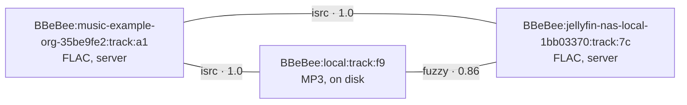

# Source Authoring, Testing & Diagnostic Workflow

> **Legacy Reference:** Formerly `docs/06-music-sources.md §7, §9 – §14`.

## 7. Errors

The taxonomy is unchanged except for one addition that the string model makes unavoidable: a rule
can be *wrong*, which is a different failure from a backend being *down*, and conflating them
sends the user to the wrong fix.

```ts
export abstract class SourceError extends Error {
  abstract readonly code: string
  abstract readonly retryable: boolean
  constructor(message: string, public readonly sourceId?: string) { super(message) }
}

export class AuthError extends SourceError       { code = 'auth' as const;        retryable = false }
export class RateLimitError extends SourceError  { code = 'rate-limit' as const;  retryable = true
  constructor(message: string, public retryAfterMs: number, sourceId?: string) { super(message, sourceId) } }
export class UnavailableError extends SourceError{ code = 'unavailable' as const; retryable = false }
export class NotFoundError extends SourceError   { code = 'not-found' as const;   retryable = false }
export class NetworkError extends SourceError    { code = 'network' as const;     retryable = true }
export class ProviderError extends SourceError   { code = 'provider' as const;    retryable = false }

/** The document is valid but a rule did not produce what it must. The source needs editing. */
export class RuleError extends SourceError {
  code = 'rule' as const
  retryable = false
  constructor(message: string, public readonly rule: { block: string; field: string }, sourceId?: string) {
    super(message, sourceId)
  }
}

/** Import-time only: the string is not a valid source document. */
export class SourceFormatError extends Error {
  constructor(message: string, public readonly issues: { path: string; message: string }[]) { super(message) }
}
```

| Error | What `ctx.player` does | What the UI shows |
|---|---|---|
| `AuthError` | Stop. Emit `source/auth-expired` | In-place re-login prompt on that source |
| `RateLimitError` | Wait `retryAfterMs`, retry once, then skip | Silent unless it repeats |
| `UnavailableError` | **Try `track_links` for the same recording elsewhere** ([§11](#11-cross-source-identity-and-failover)); skip if none | "Unavailable on <source>", with the alternative offered if one exists |
| `NotFoundError` | Skip. Mark `tracks.available = 0` | Track leaves library listings (rows kept, so URN-keyed reads still work) |
| `NetworkError` | Exponential backoff, 3 attempts, then pause | "Offline" banner; queue preserved |
| `ProviderError` | Skip, log with the backend's raw payload | Generic error with a "copy details" action |
| `RuleError` | Skip. Increment the source's failure counter | **"<source> needs updating"**, with a one-tap route into the test view ([§10](#10-diagnosing-a-broken-source)) |

An error is never allowed to clear the queue. Every failure path preserves what the user was
listening to, so regaining connectivity — or fixing a rule — means pressing play rather than
rebuilding a queue.

> A source that raises `RuleError` on three consecutive calls is marked **stale** and sorted to the
> bottom of the source list with a badge. It is not disabled: a stale source's cached catalogue is
> still browsable, and its downloaded tracks still play. Disabling it automatically would hide the
> one signal the user needs to go and re-import it.

---


---

## 9. Importing, updating and sharing

The whole point of the model, and therefore the surface most worth getting right.

```ts
export interface ImportOptions {
  /** Import only these sourceUrls out of a set. Absent means the user picked all of them. */
  select?: string[]
  /** Overwrite an existing source with the same sourceUrl. Default: ask. */
  overwrite?: boolean
  group?: string
}

export interface ImportReport {
  added: SourceRecord[]
  updated: { record: SourceRecord; changedFields: string[] }[]
  unchanged: SourceRecord[]
  /** One malformed entry never rejects the rest of a set. */
  rejected: { index: number; sourceName?: string; error: SourceFormatError }[]
  /**
   * Would overwrite a document the user edited in the app. Needs `overwrite`.
   *
   * Separate from `rejected` because nothing is wrong with these documents —
   * the user is being asked a question, not shown a failure.
   */
  conflicts: { record: SourceRecord; changedFields: string[] }[]
}
```

> ⚠️ A rejection's issues are what the import screen renders — so a failure the gate or the
> driver produced (a value SQLite will not bind, a capability refusal) rides along **in the
> issues** as `could not be stored: <cause>`, and is logged. An opaque "could not be stored"
> with nothing to investigate was a bug report that wrote itself and helped no one.

**Where a string can come from.** All four land in the same `import()`:

| Input | Handling |
|---|---|
| Pasted text | One object or an array. Whitespace and a wrapping code fence are tolerated |
| A URL | Fetched, then treated as text. The fetch itself is subject to no allowlist — it has not become a source yet — but it is size-capped and content-type-checked |
| A file | Desktop drag-and-drop, mobile document picker |
| A QR code or a `bbebee://source?…` deep link | Decoded to one of the above. The share sheet produces both |

**What import does, in order:** parse → validate against the schema → derive ids → diff against
existing rows by `sourceUrl` → present the list with per-item add/update/skip and the host
allowlist → write the selected rows → start a fiber per newly enabled source.

Rules that make this survivable in practice:

- **Nothing is imported silently.** Even a single-source string shows the review screen. This is
  the only moment the user sees what they are agreeing to.
- **A set is partially importable.** One malformed entry in a set of forty does not reject the
  other thirty-nine; it lands in `rejected` with the schema issue and its position.
- **Update preserves identity.** Matching on `sourceUrl` keeps the id, the URNs, the cached
  catalogue, the jar and the login. The diff names which fields changed, so re-importing a source
  set from a friend does not silently replace a rule the user fixed themselves.
- **Local edits are marked.** A source edited in the app carries a `locallyModified` flag;
  re-importing over it lands in `conflicts` rather than `updated`, naming the fields that would be
  lost, and proceeds only with `overwrite`.
- **The user's switch is theirs.** An update never changes `enabled`. An author publishing a fix
  must not turn a source back on that the user switched off — and a disabled row is
  indistinguishable from one removed with its library kept, so re-import does not guess.
- **Export is symmetrical and clean.** `export()` emits the same array format, sorted, with
  app-maintained fields (`respondTime`, `lastUpdated`, `weight`) and every credential
  ([runtime.md §5](./runtime.md#5-authentication-and-session)) stripped. Export → import round-trips to an identical set.

**Organising them.** `sourceGroup` is free text, comma-separated, and is the only organising
concept: the source list filters by group, and search can be restricted to a group. Sources are
enabled or disabled individually, and a disabled source's fiber is disposed — it costs nothing but
a row.

---

## 10. Diagnosing a broken source

Sources rot. A backend changes a field name and forty imported strings quietly return nothing.
This section is what makes the model maintainable rather than merely flexible, and it is not
optional infrastructure.

**`check`** — a health run over one or many sources. For each: resolve the base URL, run a
canonical search, take the first result, resolve its stream, and HEAD it. It records
`respondTime`, sets or clears `last_error`, and updates the stale badge from
[§7](#7-errors). Running it over every source is one command and the first thing to do when
"search stopped working".

**`debug`** — run one feature of one source and stream everything it did. This is the transport
behind the **test screen**: a selector picks which imported source the page tests, and each
feature the source actually implements gets its own test area — the list of areas *is* the list
of features, because a source without a `ruleAlbum` block has no album lookup to offer. Two areas
belong to no document and are always there: a raw HTTP request and an arbitrary script.

```ts
export type DebugStep =
  | { kind: 'search'; text: string; page?: number }
  | { kind: 'browse'; nodeId?: string; page?: number }
  | { kind: 'album'; id: string }
  | { kind: 'artist'; id: string }
  | { kind: 'playlist'; id: string; page?: number }
  | { kind: 'lyrics'; id: string }
  | { kind: 'library'; list: 'track' | 'album' | 'artist' | 'playlist'; page?: number }
  | { kind: 'stream'; id: string; quality?: StreamQuality }
  | { kind: 'http'; method: 'GET' | 'POST'; url: string
      headers?: Record<string, string>; body?: string }
  | { kind: 'js'; code: string; argsJson?: string }

export type TraceEvent =
  | { at: number; kind: 'http'; method: string; url: string; status: number; ms: number; bytes: number }
  | { at: number; kind: 'error'; message: string; block?: string; field?: string }
  | { at: number; kind: 'result'; summary: string }
  | { at: number; kind: 'log'; message: string }                  // a src.log(...) line from the document
  | { at: number; kind: 'value'; label: string; value: string }   // a whole output, redacted, capped
```

The `http` step is one raw request through the source's own scoped client — allowlist, cookies
and rate limits exactly as its rules get them — with the body handed back for reading. The `js`
step runs arbitrary script in the source's sandbox, where the document's `jsLib` functions are
already loaded and the JSON arguments become scope variables. Together they are how an author
pokes a backend by hand.

The page is two columns: what you run on the left, what came back on the right — each scrolling
on its own. Four properties are what make the results useful rather than decorative:

- **It streams.** A request to a server that has stopped answering shows as an `http` line with
  status 0 and nothing after it — which *is* the diagnosis. Collecting first would show nothing
  until the run gave up.
- **The output is shown whole — never truncated.** A feature's answer and every response body
  land as a `value` event that carries the full text, and a parseable body renders as a
  collapsible JSON tree (`JsonTree`, in both kits) with expand-all / collapse-all controls,
  because the shape is what a reader scans. Redaction still runs over every value — size is not
  a secret, but a credential in one still is. Bodies reach the trace because `fetchDocument`
  mirrors the decoded text out as it reads it (`FetchSite.onBody`): the response's text is
  consumed exactly once, so there is no second read to take without stealing it from the rule
  that parses next.
- **A missing feature is an answer, not a crash.** A step whose document has no matching rule
  block reports "this source does not implement …" in the trace.
- **It redacts.** Credentials, cookies, and `source.var` never appear in a trace, because the
  trace is the thing users paste into a forum thread asking for help. This is a **type**
  obligation, not a convention: every user-derived field of `TraceEvent` is `Redacted`, which only
  the redactor produces, so a URL carrying `{{source.var}}` — the common case, not the exotic one
  — cannot reach a trace by being forgotten about. A document's own `src.log(...)` lines are
  mirrored into the trace as `log` events, through the same redactor.

**Editing.** The document is not edited on this screen: a fix is a re-import, which dedupes on
`sourceUrl` and keeps the id — every URN, cached row and cookie jar survives it
([§9](#9-importing-updating-and-sharing)).

**Reporting upstream.** A trace carries the source's id, the failing step's block and field, the
redacted excerpts, and the whole outputs — everything a source author needs to fix their document,
and nothing about the user.

---

## 11. Cross-source identity and failover

The same recording may exist on several sources, and on disk. They are **different entities with
different URNs**, related by rows in `track_links`.



Links are produced by a matching pipeline, best evidence first:

| Method | Confidence | Basis |
|---|---|---|
| `isrc` | 1.00 | Exact ISRC match |
| `mbid` | 1.00 | MusicBrainz recording id |
| `acoustid` | 0.95 | Acoustic fingerprint (optional plugin; not shipped by default) |
| `fuzzy` | 0.70–0.90 | Normalised title + artist + duration within 2 s |
| `manual` | 1.00 | The user said so. Never overwritten by automation |

Two things use links:

1. **Failover** — an `UnavailableError` or a `RuleError` sends the resolver to linked URNs, ordered
   by confidence then by user preference (local first by default). Handled inside the
   `player/before-resolve` waterfall, so it is a plugin (`plugin-failover`) and can be removed.
   With a dozen uneven sources this earns its keep far more than it did with two.
2. **Library dedup** — the unified library collapses linked URNs into one row above a confidence
   threshold, displaying the best available copy while remembering all of them.

> ⚠️ Fuzzy matching is wrong sometimes — live versions, remasters, and radio edits share titles,
> artists, and near-identical durations. Anything below 1.00 confidence is a *hint*: used for
> failover, shown as "also available on…", never used to silently merge library entries. Merging
> on a bad guess makes a user's library wrong in a way that is very hard to diagnose.

---

## 12. What is not a string: local files

Exactly one provider is not expressible as a document, because there is no HTTP to describe:
`plugin-source-local`, source id `local`.

It is a provider like any other — the local library is not privileged. It goes through the same
resolve path and the same URN scheme; only `resolveStream` differs, in that it returns
`kind: 'local'` immediately. Its `auth.flow` is `{ kind: 'none' }`, `signIn` resolves immediately,
and `signOut` clears its cached rows.

Keeping it as a `MediaProvider` rather than special-casing it is what keeps the catalogue, the
player, and every screen from growing a "is this local?" branch — and it is why `plugin-download`
can substitute a downloaded file for a stream without the player noticing
([layers.md §3](../architecture/layers.md#3-the-layer-model)).

### The local scanner

`plugin-local-scanner` is separate from `plugin-source-local` because scanning is a different
concern from serving. It walks `scan_specified_dirs` via `ctx.fs.list`, and for each file whose
`(size, mtime)` differs from the recorded `scan_entries` row, calls `ctx.codec.readMetadata`,
extracts artwork, and writes catalogue rows.

- **Incremental.** Unchanged files are skipped by stat comparison alone; a rescan of an unchanged
  100k-file library costs stat calls and nothing else.
- **Interruptible.** Runs in batches with an `AbortSignal`, checkpointing after each batch, so a
  suspend mid-scan costs one batch.
- **Honest about failures.** A file that fails to decode gets `scan_entries.status = 'error'` with
  the reason, surfaced in a "could not import" list rather than silently vanishing.
- **Disabling a folder hides its music, not its rows.** `setEnabled(dir, false)` recomputes
  `tracks.available` from the rule *a track is available when some enabled dir's last scan
  produced it*: the disabled folder's tracks leave every library listing — tracks, albums,
  artists, search — and re-enabling restores them without a rescan. Rows are never deleted, so
  queue restores and playlists (which read by URN, not through listings) keep working. A file
  covered by two specified dirs belongs to the one that last scanned it; the other's next walk
  re-points the entry and the reconcile that follows ends the scan restores visibility.
- **Watching where possible.** `ctx.fs.watch` on desktop; interval polling on mobile, where the
  API does not exist ([overview.md §1](../services/overview.md#1-core-capabilities-catalogue)).

---

## 13. Writing a source: checklist

For the person authoring a document — in the app's editor, or in a text file to be shared.

**Identity and shape**

- [ ] `sourceUrl` is the backend's base URL, stable, and not a search URL with a query in it.
      Everything downstream keys on it.
- [ ] `sourceName` says which server this is, not which protocol — the user may have three.
- [ ] `allowedHosts` lists every additional host the source touches (CDN, artwork, streams).
      A host you forget is a request that fails closed at play time.
- [ ] `concurrentRate` set deliberately. If you do not know the server's limit, go slower.

**Rules**

- [ ] Every required field of every block used is present: `trackList`, `trackId`, `title`, and
      `ruleStream.url`.
- [ ] `trackId` is stable across searches. An id derived from a row position produces a library
      that reshuffles itself.
- [ ] Fields that a redesign might rename use `||` alternatives.
- [ ] Literal values start with `=`. A constant with no `=` is a selector
      ([rule-engines.md §3.1](./rule-engines.md#31-engines-and-prefixes)).
- [ ] `durationMs` really is milliseconds — `##$##000` for a seconds-based API.
- [ ] No rule block is present-but-empty; delete it instead, so the capability is honestly absent
      ([spec.md §1.3](./spec.md#13-capabilities-are-derived-not-declared)).

**Streams**

- [ ] `ruleStream` depends only on `{{track.*}}`, `{{source.*}}` and `{{prefs.*}}` — never on
      state left over from a search, which will not exist when the user plays from their library.
- [ ] `expiresAt` is set if the URL expires. If it does and you omit it, playback fails minutes
      later in a way nobody can diagnose.
- [ ] `seekable` reflects reality; if unsure, omit it and let the runtime probe with a HEAD.
- [ ] Any header the stream URL needs is in `ruleStream.headers`, not assumed.

**Credentials**

- [ ] `variableComment` says exactly what to type in the variable box, in the format expected.
- [ ] No credential is written into the document itself. Export must be shareable as-is
      ([§9](#9-importing-updating-and-sharing)).
- [ ] `loginCheckJs` distinguishes "logged out" from "server error", or the app will re-login in a
      loop against an outage.
- [ ] Sign out, relaunch, and confirm the source is signed out and nothing was left behind
      ([runtime.md §5.1](./runtime.md#51-session-persistence--cookies-survive-the-app)).

**Before sharing**

- [ ] `check` passes ([§10](#10-diagnosing-a-broken-source)), and the trace has no error steps.
- [ ] Debug-run search, explore, album and stream at least once each.
- [ ] Page 2 of a search returns different items than page 1.
- [ ] Export, re-import into a clean profile, and confirm it still works — that is the only test
      of what your document actually contains.

---

## 14. Where to go next

[schema.md](../data-model/schema.md) defines the URN scheme, the `sources` table these documents
live in, every catalogue table they populate, and the full event map.
