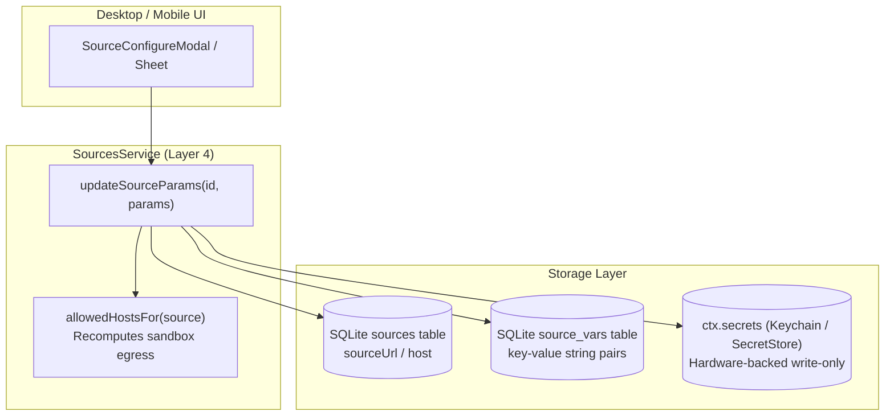
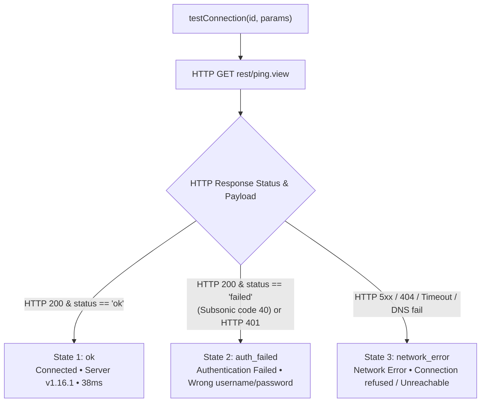

# Per-Source Parameters & Security Architecture

> **What this answers:** How music sources and lyric sources are configured per-instance, the strict security boundary between sensitive credentials and non-sensitive variables, how the 3-state Subsonic connection probe works, and how custom configurations are injected into sandboxed runtimes.

---

## 1. The Per-Source Parameters Model

Music backends (such as self-hosted Subsonic/Navidrome servers, Jellyfin instances, or WebDAV endpoints) require instance-specific parameters: server URLs, authentication credentials, and client variables. Rather than hardcoding these in source documents or storing sensitive secrets in application databases, BBeBee enforces a tripartite configuration model:



### 1.1 Tripartite Architecture

| Parameter Domain | Storage Location | Sensitivity | Mutability | Examples |
|---|---|---|---|---|
| **Host / URL** | `sources.url` (SQLite) | Public / Config | User-editable | `https://music.example.org` |
| **Credentials** | `ctx.secrets` (Keychain / Hardware Store) | Highly Sensitive | Write-only / Masked | `password`, `token`, `user`, `apiKey` |
| **Variables** | `source_vars` (SQLite) | Non-sensitive | Key-Value pairs | `clientApp: BBeBee`, `bitrate: 320` |

---

## 2. Credential Security Boundaries

### 2.1 The Invariant: No Secrets in SQLite

1. **Zero Secret Persistence in Database:** Under no circumstances are credentials, passwords, session tokens, or API secrets persisted in SQLite database tables (`sources`, `source_vars`, or logs).
2. **Hardware-Backed Secret Storage:** All sensitive values are routed to `ctx.secrets` under the isolated namespace `test:${sourceId}` or `source:${sourceId}`. On desktop, this maps to OS Keychain (via Electron `safeStorage` or native keychain APIs); on mobile, this maps to iOS Keychain / Android Keystore.
3. **UI Write-Only Exposure:** The UI never displays decrypted secrets in plaintext. Password fields render masked placeholder dots (`••••••••`). Users can enter a new password to overwrite existing credentials, but cannot exfiltrate stored credentials via UI inspection.
4. **Automated Sandbox Egress Allowlist:** When a user updates `sourceUrl` or `host`, `updateSourceParams` automatically recomputes `allowedHostsFor(sourceId)`:
   - The new hostname is appended to the source's network egress allowlist.
   - Any HTTP request initiated within the QuickJS isolated sandbox to hosts outside this egress list is rejected with an Egress Violation security error.

---

## 3. Subsonic Source Configuration & 3-State Probe

### 3.1 Subsonic Configuration Example

A typical Subsonic / OpenSubsonic source requires:
- **Host**: `https://subsonic.internal.net`
- **Username**: `audiophile`
- **Password**: Secure token or plaintext password (stored in `ctx.secrets`)
- **Variables**: `clientApp: BBeBee`, `clientVersion: 1.0.0`

### 3.2 3-State Connectivity Probe Protocol

When a user taps **Test Connection**, `ctx.sources.testConnection(id, params)` executes an active probe against `<host>/rest/ping.view?f=json&v=1.16.1&c=BBeBee&u=<user>&p=<password>` without persisting changes:



#### Detailed State Specifications

1. **`ok` (Connected - Green Badge):**
   - Condition: HTTP 200 response containing valid JSON with `subsonic-response.status === 'ok'`.
   - Metadata: Extracts `serverVersion` (e.g. `1.16.1`) and roundtrip `latencyMs`.
2. **`auth_failed` (Authentication Failed - Amber Badge):**
   - Condition: Response contains `subsonic-response.status === 'failed'` with error code 40 ("Wrong username or password"), error code 50 ("User not authorized"), or HTTP 401 Unauthorized.
   - User Action: Prompt user to verify username and password without altering host egress permissions.
3. **`network_error` (Network Error - Red Badge):**
   - Condition: Connection refused, DNS failure, TLS handshake error, timeout, HTTP 502/503 bad gateway, or non-JSON payload.
   - Diagnostics: Returns descriptive message (e.g., `Failed to connect to host: Connection refused`).

---

## 4. Lyric Sources Configuration & Sandbox Injection

Lyric sources implement the `plugin-lyric-sources` specification. Unlike music sources which rely on `source_vars` tables, lyric sources support arbitrary structured JSON configurations per source.

### 4.1 Schema & Service Interface

```ts
export interface LyricSourcesService {
  // ...
  updateSourceConfig(id: string, config: Record<string, unknown>): Promise<void>
}
```

Configuration updates are saved into the source record's `config` column.

### 4.2 Sandbox Runtime Injection

When a lyric query is executed:
1. **QuickJS Environment:** The sandbox context exposes `source.config` as a frozen JavaScript object inside the evaluation realm.
2. **Query Context:** The query parameter handed to `searchLyrics({ query, artist, title, config })` contains `config: source.config ?? {}`.
3. **Fallback Evaluator:** Fallback script execution binds `query.config = source.config` so rule engines can dynamically read custom API endpoints, language preferences, or header overrides.

---

## 5. UI Architecture & Reusable Bindings

In accordance with the Three-Package UI Rule and `@BBeBee/ui` guidelines:
- **Desktop Component:** `SourceConfigureModal.tsx` in `plugin-sources-ui-desktop`.
- **Mobile Component:** `SourceConfigureModal.tsx` in `plugin-sources-ui-mobile`.
- **Lyric Source Config:** `LyricSourcesSection.tsx` in `plugin-settings-ui-desktop` with full JSON schema editor.
- **Headless Hooks:** `useSourceParams` and `useLyricSourceConfig` in `@BBeBee/plugin-sources/views` and `@BBeBee/plugin-lyric-sources`.
