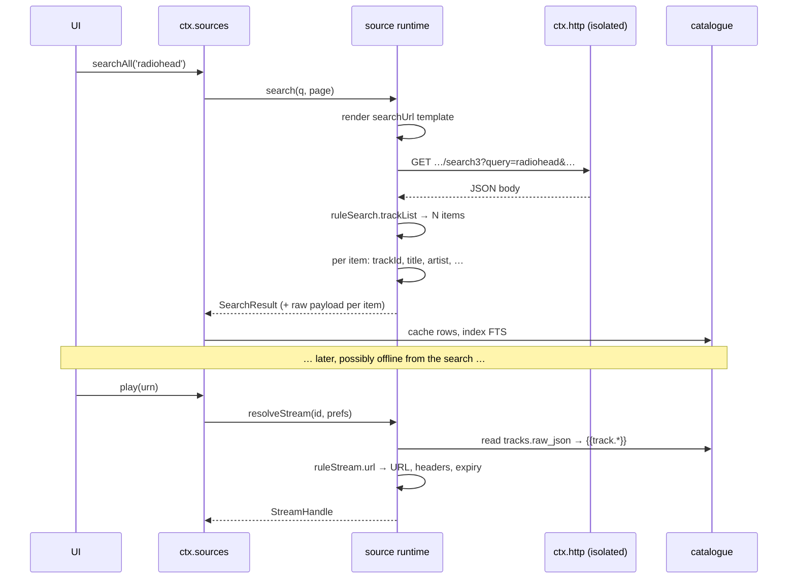
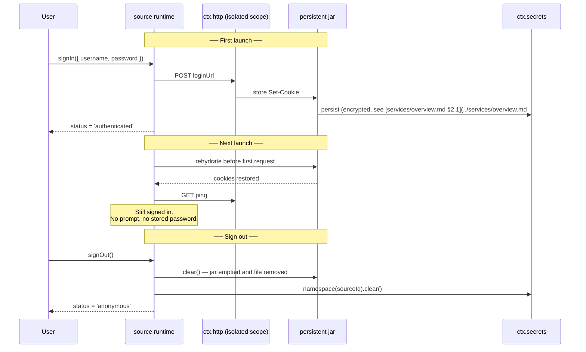

# Source Runtime & Security Sandbox

> **Legacy Reference:** Formerly `docs/06-music-sources.md §4 – §6, §8`.

## 4. The runtime

### 4.1 A source's lifetime

A source is not a plugin — but the runtime still gives each one **its own fiber and its own
isolated `ctx.http` scope**, because that is what makes disabling one total and free of bespoke
cleanup ([plugins/concepts.md §2](../plugins/concepts.md#2-lifecycle)).

```ts
// plugin-source-runtime — simplified
for (const rec of await ctx.db.select('sources', { enabled: 1 })) {
  const scoped = ctx.isolate('http')                       // private cookie jar + rate limiter
  scoped.plugin(HttpStack, { jar: rec.id, rateLimit: parseRate(rec.doc.concurrentRate) })
  scoped.plugin(SourceInstance, { record: rec })           // registers into ctx.sources
}
```

Everything that used to follow from "one plugin, many instances" now follows from "one row, one
fiber": two sources cannot see each other's cookies, one source's rate limiting cannot stall
another's requests, and removing a source disposes exactly its own registrations, its jar, its
vars, and — if the user asks — its catalogue rows.

Editing a source string disposes and rebuilds only that fiber. The user sees the change on the
next search, with no restart.

```ts
export interface SourcesService {
  /* ── the registry (unchanged) ─────────────────────────────────── */
  /** Internal. Called by the runtime per source and by plugin-source-local. */
  register(p: MediaProvider): Disposable
  readonly providers: readonly MediaProvider[]
  get(sourceId: string): MediaProvider | undefined
  forUrn(urn: string): MediaProvider | undefined
  getAlbum(urn: string, page?: PageRequest): Promise<AlbumDetail | undefined>
  getPlaylist(urn: string, page?: PageRequest): Promise<PlaylistDetail | undefined>
  searchAll(
    q: SearchQuery,
    opts?: {
      sourceIds?: string[]
      timeoutMs?: number
      /** Per-source interface filter; absent sources keep `q.types`. */
      typesBySource?: Record<string, SearchQuery['types']>
    },
  ): Promise<AggregatedSearch>
  searchSource(
    sourceId: string,
    query: SearchQuery,
    page?: PageRequest,
    opts?: { timeoutMs?: number; types?: SearchQuery['types'] },
  ): Promise<AggregatedSearchEntry>

  /* ── sources as data (§9, §10) ────────────────────────────────── */
  readonly sources: readonly SourceRecord[]
  import(input: string, opts?: ImportOptions): Promise<ImportReport>
  export(ids?: string[]): Promise<string>
  setEnabled(id: string, on: boolean): Promise<void>
  /**
   * Remove a source.
   *
   * ⚠️ The two modes differ in what survives, and the difference is forced by
   * the schema rather than chosen: catalogue rows are `ON DELETE CASCADE`, so
   * deleting the row *necessarily* takes the library with it. There is no
   * third option where the row is gone and the tracks remain — those would be
   * orphans with unresolvable URNs.
   *
   *   forgetCatalogue: true   delete the row; the cascade drops its tracks,
   *                           albums, artists, account and vars
   *   forgetCatalogue: false  (default) keep the row, disabled, so the library
   *                           stays browsable and the source list brings it back
   *
   * The default is the safe one: losing a library to a mis-tapped button is
   * far worse than a stale row nothing reads.
   */
  remove(id: string, opts?: { forgetCatalogue?: boolean }): Promise<void>
  /** Every step gets `timeoutMs`, so one hanging source cannot hold the run. */
  check(
    ids?: string[],
    opts?: { signal?: AbortSignal; timeoutMs?: number },
  ): Promise<CheckReport[]>
  debug(id: string, step: DebugStep): AsyncIterable<TraceEvent>
}

export interface AggregatedSearch {
  /** One entry per source that was asked — including the ones that failed. */
  bySource: {
    sourceId: string
    result?: SearchResult
    /** Present on failure. The source is reported, never silently dropped. */
    error?: SourceError
    /** True when the source exceeded `timeoutMs` and is still running. */
    pending: boolean
    tookMs: number
  }[]
}
```

`searchAll` is unchanged in shape and more important than before: with a dozen imported sources of
uneven quality, per-source results with per-source errors is the difference between "search is
broken" and "three of your twelve sources answered, one is rate-limited, one needs re-import".

The search screen consumes exactly that shape and never merges it. `useSourceSearch` (headless,
shared by both shells) runs the fan-out and `searchResultRows` flattens the answer into one
virtualised list whose sections are headed by source name — a source that failed, timed out or
found nothing keeps its header, so "no matches" and "never answered" cannot look the same. The
toggles come from `useSearchSourceSelection`: every searchable provider is selected by default and
the user's choices are stored as *exclusions*, so a source imported later still joins the next
search. `canSearchProvider` is the one predicate the service and the screen share, so the toggles
cannot offer a source `searchAll` would silently skip ([ui/architecture.md §4](../ui/architecture.md#the-source-surfaces)).

The cache write behind that fan-out is the **service's own**, not the caller's. `searchAll` is
reached through the UI package's context, which holds no database grants, so the step runs on the
handle captured at init (through `CacheWriter`, beside `Catalog` and `SourceStore`) rather than the
caller's. Getting this backwards is invisible in the search results — they are returned from memory
either way — and shows up much later as a queue that cannot resolve a cover or a title, because the
rows never reached the catalogue.

### 4.2 The resolution pipeline



The pipeline runs the same way for `browse` (`exploreUrl` → `ruleExplore` → `childUrl` →
`ruleAlbum` → `ruleTrackList`) and for lyrics. There are only three verbs — fetch a document,
select from it, coerce the selection — and every capability is a different arrangement of them.

**Browse nodes carry their own stage.** `browse(nodeId)` has to know which of those rules to run,
and it cannot infer it from the URL. So a node id is a self-contained token — the source id, the
stage (`explore` or `tracks`), and the URL to fetch — rather than a key into a map the runtime
keeps. The map would not survive a relaunch, and a shell restoring its navigation stack would
return the user to a folder that had ceased to exist while they were away. The source id in the
token is checked on the way back in: not a security boundary — the egress allowlist is that, and
it is re-checked on every fetch, including on a `childUrl` the document computed — but it turns a
stale id from another source into a plain refusal instead of a confusing cross-source fetch.

**A leaf is a track; a node is a place.** An item whose `childUrl` is non-empty gets a node id and
no URN. An item without one gets a URN and is playable — and is cached on the way past, payload
included, by exactly the route a searched track is. Browsing to a track and playing it a week
later has to work, and it only works if the row was written when it was seen.

`recommend` is the same pipeline wearing a different hat: `ruleRecommend` runs over the (optional)
`recommendUrl` document, and its rows are mapped exactly as explore rows are mapped — a
recommendation card and a browse row are one thing to every screen downstream. The service caches
the page the way it caches browse, which is where a card's `childUrl` payload lands. That matters
because of how an album detail is served: **the catalogue is read first, and the source is asked
live only when the catalogue cannot answer** — an album row that exists but has no tracks, or no
row at all, triggers a live `getAlbum` through the provider, and the answer goes through the same
writer a search does. A recommended playlist opens on the first click and keeps opening after a
restart, by the same mechanism a browsed album does; a source with no `ruleAlbum` has no live
fetch to fall back to, and its rows stay what the cache made of them.

### 4.3 Pagination, rate limiting and caching

**Pagination** is `{{page}}`. The runtime increments it and stops when a page yields no items or
repeats the previous page's ids. It exposes the same opaque cursor contract as before, so no
consumer learns that pages are numbers:

```ts
export interface PageRequest { cursor?: string; limit?: number }

export interface Paged<T> {
  items: T[]
  cursor?: string        // absent means no more
  total?: number         // only when the backend actually says
  hasMore: boolean
}

export interface SearchQuery {
  text: string
  types?: ('track' | 'album' | 'artist' | 'playlist')[]
  filters?: { genre?: string; yearFrom?: number; yearTo?: number; durationMaxMs?: number }
}

export interface SearchResult {
  tracks?: Paged<Track>
  albums?: Paged<Album>
  artists?: Paged<Artist>
  playlists?: Paged<Playlist>
}
```

`total` stays optional, because a scraped page almost never knows one and inventing it produces
progress bars that lie.

Detail endpoints (`getAlbum(urn, page?)` and `getPlaylist(urn, page?)`) also participate in this
pagination model. When querying third-party providers with large albums, series or collections,
consumers pass a `PageRequest` (typically 30 items per page) and receive `hasMore` and `cursor` within
`AlbumDetail` or `PlaylistDetail`. The runtime translates this to the source's page parameters
(`pn`/`page_num` and `ps`/`page_size`), allowing views to paginate incrementally on scroll rather than
loading thousands of tracks up front.

**Rate limiting** is `concurrentRate`, enforced by the source's isolated HTTP stack rather than by
the rules. `"3/1000"` is three requests per second; `"1/2000"` is one every two seconds. A source
with no `concurrentRate` gets a conservative default, because the failure mode of guessing high is
someone's server banning the user's IP.

**Caching** has two layers, and the distinction matters when a source misbehaves: `plugin-cache`
caches the **media** a source answers with — covers via `ctx.cache.artwork()`, and the audio
streams themselves on `player/before-resolve`, keyed by track URN and evicted LRU within a byte
budget — while `src.cache` is the source's own scratch space for rule results, with an explicit
TTL. Clearing one does not clear the other, and the settings screen offers both separately.
Generic HTTP response caching on the `http/request` waterfall is not implemented yet; when it
lands it will honour the backend's headers.

---

## 5. Authentication and session

Auth is **declared in the document and driven by the shell**, so no source author writes a login
screen — the same principle as before, expressed as data.

```ts
export interface LoginField {
  id: string
  label: string
  type?: 'text' | 'password' | 'checkbox' | 'select'
  options?: string[]
  placeholder?: string
}

export type AuthFlow =
  | { kind: 'none' }
  | { kind: 'variable'; comment?: string }        // the `source.var` box, and nothing more
  | { kind: 'form'; fields: LoginField[]; submitTo: string }
  | { kind: 'webview'; loginUrl: string; requiredCookies: string[] }
  | { kind: 'qrcode'; pollIntervalMs?: number }

export type AuthStatus =
  | { state: 'anonymous' }
  | { state: 'authenticated'; displayName?: string; expiresAt?: number }
  | { state: 'expired' }
  | { state: 'error'; message: string }

export interface QrCodeSession {
  code: string
  key: string
  expiresAt?: number
  poll(): Promise<'pending' | 'scanned' | 'confirmed' | 'expired'>
}

export interface ProviderAuth {
  readonly flow: AuthFlow
  readonly status: AuthStatus
  signIn(input: Record<string, string>): Promise<void>
  createQrSession?(): Promise<QrCodeSession>
  /** Clears the jar, the secrets namespace, and this source's vars. Leaves nothing. */
  signOut(): Promise<void>
  refresh?(): Promise<void>
  onStatusChange(cb: (s: AuthStatus) => void): Disposable
}
```

How each flow is expressed in the document:

| Flow | Written as | Example |
|---|---|---|
| `none` | No auth fields at all | A public radio stream |
| `variable` | `variableComment` only | Subsonic's `user:password`, consumed by `jsLib` |
| `form` | `loginUi` (the fields) + `loginUrl` (where they go) | A self-hosted server's `/login` |
| `webview` | `loginUrl` + `requiredCookies`, opened in `ctx.shell` | A backend whose login is a page, not an API |
| `qrcode` | `loginType: 'qrcode'` + `loginQrJs` + `loginPollJs` | Web/QR sign-in flows (e.g. Subsonic) |

`loginCheckJs` runs after every response and decides whether the session is still good; returning
false sets `status = 'expired'` and emits `source/auth-expired`. It is the source's equivalent of
"the server started answering with the login page again", which no HTTP status code reliably
signals.

Rules, all non-negotiable and all unchanged from when sources were plugins:

- **Credentials never land in readable storage.** `source.var`, form input, and tokens go to
  `ctx.secrets` under `namespace(sourceId)`; cookies go to the persisted jar in §5.1. Never in
  `ctx.db` in plaintext, never in the exported string, never in a log line
  ([services/logging.md §16](../services/logging.md#16-ctxlogger--logging-as-transport-plugins)).
- **Refresh is transparent and singular.** The runtime hooks `http/request` per source; on a `401`
  or a failed `loginCheckJs` it re-authenticates once and retries. A burst of 401s triggers exactly
  one refresh — one in-flight promise, every caller awaits it.
- **Expiry is an event, not an error.** The source stays registered and its cached catalogue stays
  browsable; only network calls fail. The UI shows a re-login prompt in place rather than making
  the source vanish.
- **Export never carries a session.** [authoring.md §9](./authoring.md#9-importing-updating-and-sharing) strips
  `source.var`, cookies, and every `src.vars` value. Sharing a source must not share an account,
  and this has to be true by construction rather than by the sharer remembering.

### 5.1 Session persistence — cookies survive the app

Signing in once must be enough. Many backends carry their session entirely in cookies, so a jar
that dies with the process means a login prompt on every launch.

Each source owns a **persistent cookie jar**, keyed by source id and supplied by `ctx.http`
([services/overview.md §2.1](../services/overview.md#21-cookie-jars)). No rule manages it: it lives in the source's
isolated `ctx.http` scope ([§4.1](#41-a-sources-lifetime)), so every request the runtime makes on
that source's behalf sends the right cookies and every `Set-Cookie` is stored, with no cookie
handling in the document at all.



The lifecycle rules:

- **Rehydration happens before the first request, not lazily.** The source's fiber awaits
  `ctx.http.cookies.jar(sourceId).ready` so no request can race an empty jar and get a spurious
  `401` that trips the expiry path.
- **Persistence is per source.** Two Navidrome servers have two jars that cannot see each other's
  cookies, which follows from `ctx.isolate('http')` and is not extra work.
- **Cookies are credentials and are stored as such** — encrypted at rest, never in a plaintext
  database column, never in a log line, excluded from crash-report bundles and from export.
- **`signOut()` clears the jar.** Emptying it in memory is not enough; the persisted copy is
  deleted, along with the secrets namespace and `source_vars`. This is the most commonly missed
  step, so it is in the checklist in [authoring.md §13](./authoring.md#13-writing-a-source-checklist) and in the conformance
  suite.
- **Expiry is honoured.** A session cookie with a past `Expires`/`Max-Age` is dropped at
  rehydration rather than replayed, which otherwise produces a confusing "logged in but every
  request fails" state.
- **The user can revoke without removing.** Settings offers "clear stored session" per source,
  which clears the jar, the secrets namespace and the vars while leaving the source imported.

> ⚠️ A persisted cookie is a bearer credential with the lifetime the server chose, which may be
> months. It deserves the same protection as a password, and the storage design in
> [overview.md §2.1](../services/overview.md#21-cookie-jars) treats it that way. It also means "sign out"
> genuinely has to work — a jar left on disk after sign-out is a security bug, not untidiness.

---

## 6. Stream resolution

The moment a URN becomes bytes. The contract is unchanged; what changed is that `ruleStream`
produces it instead of a hand-written provider.

```ts
export interface StreamPrefs {
  quality: StreamQuality
  /** True when the network is metered; the template sees it as {{prefs.saveData}}. */
  saveData: boolean
  /** Formats the platform can decode — from ctx.codec.supportedFormats(). */
  acceptFormats: string[]
  maxBitrateKbps?: number
}

export interface StreamHandle {
  kind: 'remote' | 'local'
  target: string                  // URL for remote, file Uri for local
  mimeType?: string
  codec?: string
  bitrateKbps?: number
  sampleRate?: number
  byteLength?: number
  seekable: boolean
  /** Headers required to fetch this stream. May contain credentials. */
  headers?: Record<string, string>
  /** Epoch ms. The player re-resolves before this, and on 403. */
  expiresAt?: number
  /** What the provider actually served, which may be below what was asked. */
  quality?: StreamQuality
  /** Reserved. Nothing implements this — see architecture/overview.md §1, non-goals. */
  drm?: { system: string; licenseUrl: string }
}
```

`ruleStream.quality` is what turns a document's own tier language into that field. A source whose
backend names tiers differently maps them itself — the Bilibili document maps `30216 流畅 → low`,
`30232 标准 → normal`, `30280 高品质 → high`, `30250 杜比全景声 → lossless`, `30251 Hi-Res 无损 →
hi-res` — so the app compares and displays tiers it knows, never backend ids.

Handling of the awkward cases:

- **Expiring URLs.** The player re-resolves when `expiresAt` is within 60 seconds, and on a `403`
  mid-stream it re-resolves once and resumes from the current position before surfacing an error.
  A source that returns short-lived URLs sets `ruleStream.expiresAt`; one that does not set it and
  serves expiring URLs anyway produces the single most confusing bug in this system, which is why
  `check` ([authoring.md §10](./authoring.md#10-diagnosing-a-broken-source)) flags a stream URL that a second HEAD rejects.
- **Quality negotiation.** `{{prefs.*}}` is in scope inside `ruleStream`, so the document picks
  what it can serve. Whatever it returns is reported in the handle, so the UI shows the real
  bitrate rather than the requested one.
- **`saveData`.** Set from `ctx.device.network().metered`. A source that ignores it is not broken,
  but the download policy engine refuses transfers regardless.
- **Headers travel with the handle.** A stream URL that only works with a `Referer` is ordinary,
  and `ruleStream.headers` is how the source says so. `ctx.audio` receives them with the load
  request; they are redacted from logs.

---

> **Note on Section 7:** Error diagnosis, rule failure codes, and testing suites are documented in [authoring.md §7](./authoring.md#7-errors).

---

## 8. Trust: what an imported source can and cannot do

> ⚠️ **A source string is a program written by a stranger.** `@js:`, `jsLib`, and `{{ }}` are
> JavaScript. Treating an imported source as inert configuration would be a lie, and the design
> does not pretend otherwise.

What makes this tractable — and genuinely better than the plugin model it replaces — is that a
source's execution environment is *small enough to enumerate*. Runtime-loaded plugins shared the
renderer's realm and could reach anything ([concepts.md §7](../plugins/concepts.md#what-this-is-not)); a
source cannot reach anything that is not on the list below.

### The evaluator

Source JavaScript runs in `ctx.js`, a **separate interpreter realm** — QuickJS on both platforms —
with no reference to the app's globals, the Cordis context, the DOM, or the module system. It is
the isolated realm that [concepts.md §7](../plugins/concepts.md#what-this-is-not) says real containment
requires. Sources are the reason it exists now rather than later; third-party plugins inherit it
([roadmap.md §M5](../roadmap/roadmap.md#m5--third-party-extensions-on-the-sandbox)). The contract is in
[contracts.md §19](../services/contracts.md#19-ctxjs--the-sandboxed-evaluator).

The entire host surface a source can see:

```ts
/** `src` inside any @js: block or {{ }} template. This list is the whole API. */
export interface SourceHost {
  /** HTTP through the source's own isolated stack: its jar, its rate limit, its host allowlist. */
  get(url: string, opts?: RequestOptions): Promise<{ status: number; headers: Record<string, string>; body: string }>
  post(url: string, body: string, opts?: RequestOptions): Promise<{ status: number; headers: Record<string, string>; body: string }>

  parse: {
    json(s: string): unknown
    html(s: string): never         // throws: needs a markup parser, not in this build
    xml(s: string): never          // throws: needs a markup parser, not in this build
  }
  crypto: {
    md5(s: string): string
    sha1(s: string): string
    sha256(s: string): string
    hmac(alg: string, key: string, msg: string): string
    base64Encode(s: string): string
    base64Decode(s: string): string
    randomHex(n: number): string
    rsaEncrypt(val: string, key: string): string
    rsaOaepEncrypt(val: string, key: string, label?: string): string
    aesEncrypt(): never            // throws: not available in this build
    aesDecrypt(): never            // throws: not available in this build
  }
  cache: { get(k: string): unknown; put(k: string, v: unknown, ttlMs?: number): void }
  vars: { get(k: string): string | undefined; put(k: string, v: string): void }
  cookie: {
    get(name: string, url?: string): string | undefined
    set(name: string, value: string, url?: string): void
    all(url?: string): Record<string, string>
  }
  url: { encode(s: string): string; decode(s: string): string; resolve(base: string, rel: string): string }
  time: { now(): number }
  log(message: string): void
}
```

There is no `fetch`, no `require`, no `import`, no `globalThis` passthrough, no timer that outlives
the call, and no filesystem of any kind.

### The limits, and why each exists

| Limit | Value | What it stops |
|---|---|---|
| **Host allowlist** | `sourceUrl`'s host plus `allowedHosts`, matched on hostname | Exfiltration to an attacker-controlled endpoint. A URL to any other host is refused with `CapabilityError`, whether it was written literally or computed at runtime |

`allowedHosts` entries are **hostnames**, and import refuses anything that would be silently widened
to one. `nas:4533` reads as "this host on this port", but there is no port anywhere in the matcher —
it would be dropped and the entry would cover every port — so it is rejected with a message naming
the entry. A path is rejected for the same reason. A bare scheme drops nothing, so
`https://cdn.example.org` is accepted and normalised to its host. An entry covers its subdomains
(`example.org` admits `cdn.example.org`, never `notexample.org`); a single-label entry matches only
itself, so `["org"]` cannot mean "anywhere in .org".
| Wall clock per rule | 2 s (10 s for `@js:` with network) | A rule that hangs the search |
| Memory per evaluation | 32 MB | A source that OOMs the app |
| HTTP calls per rule | 8 — ⚠️ **not yet enforced**; no counter exists | A rule that turns one search into a crawl |
| Output size per rule | 1 MB | A selector that returns an entire page into a table cell |
| Concurrency | `concurrentRate`, default conservative | The user's IP getting banned by their own server |
| `webView` option | Desktop only, off by default, per-source opt-in with a warning | A full browser context with the user's session, reachable from a pasted string |

The allowlist is the important one, and it is a deliberate divergence from legado, which lets a
book source request anything. It is shown at import as a plain list of hostnames — "this source
will talk to: music.example.org, cdn.example.org" — because that sentence is one a user can
actually judge.

### What a hostile source can still do

Stated plainly, because a security claim with no residue is not a security claim:

- **Read everything it is given.** Its own results, its own credentials, the search text the user
  typed into it, and the tracks the user plays through it.
- **Send those to its own hosts.** The allowlist bounds *where*, not *what*. A source whose
  backend is hostile learns your listening habits, and no sandbox fixes that — only not importing
  it does.
- **Waste resources within the limits above**, and be slow.
- **Lie about metadata**, which is a content problem rather than a security one, and shows up as
  a wrong-looking library rather than as compromise.

What it cannot do: read another source's cookies, vars or catalogue rows; read or write any file;
reach `ctx` or any service other than its own scoped `ctx.http`; persist anything outside its own
namespace; survive its own disposal; or run at all while disabled.

### Content and legality

The runtime is neutral, and this repository ships **no source strings for third-party services**.
It ships the interpreter, the local-files provider, and a small corpus of documents for open
self-hosted protocols used as tests and worked examples
([workflow/testing.md §6](../workflow/testing.md#6-testing-strategy)). What a user imports is their choice and
their responsibility; the import screen says what the source will do and to whom it will talk, and
does not editorialise beyond that.

---

