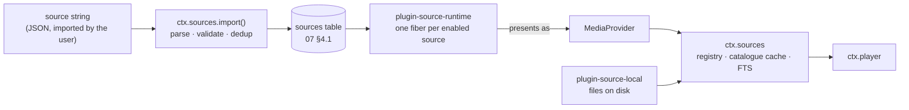

# Music Source Specification & Format

> **Legacy Reference:** Formerly `docs/06-music-sources.md §1 – §2`.

> **What this answers.** What a music source *is* now that it is a string rather than a package:
> the JSON document a user imports, the rule language inside it, the single runtime that
> interprets it, how a source authenticates and stays signed in, how a rule becomes bytes, what an
> imported source is and is not allowed to do, and how a broken one is diagnosed and repaired.

A source is **data, not code we ship**. The user pastes a string — from a friend, a forum, a
gist, a QR code — and the app can play from a backend nobody in this repository has heard of, with
no build, no release, and no plugin install. When that backend changes its API, the fix is an
edited string, not a version bump.

This is the [legado](https://github.com/gedoor/legado) model for book sources, applied to audio.
It is a deliberate reversal of the earlier design, in which every backend was a plugin package;
[ADR-5](../architecture/overview.md#adr-5--music-sources-are-imported-strings-interpreted-by-one-runtime)
records what that cost and what it bought.

---

## 1. The model

### 1.1 One runtime, many sources

There is exactly **one** piece of code that talks to remote music backends:
`plugin-source-runtime`. It claims no service key of its own — it reads the `sources` table and
registers one provider into `ctx.sources` per enabled row. Sources are rows; the runtime is the
only interpreter of them, and there is no second one to keep in step.



`MediaProvider` still exists, and everything above it — `ctx.sources`, `ctx.player`, the
catalogue cache, the URN scheme — is unchanged. What changed is its population: it is now an
**internal interface with exactly two implementations** (the runtime's per-source adapter, and
local files), not an extension point third parties write against. Nobody outside this repository
implements `MediaProvider`; they write a source document instead.

```ts
import type { Uri, Disposable } from '@BBeBee/protocol'

/** Internal. Two implementations: the source runtime, and plugin-source-local. */
export interface MediaProvider {
  readonly sourceId: string             // 'music-example-org-35be9fe2'
  readonly displayName: string
  readonly capabilities: Capabilities   // derived — see §1.3
  readonly auth: ProviderAuth           // synthesised from the document — see §5

  getTrack(id: string): Promise<Track>
  resolveStream(id: string, prefs: StreamPrefs): Promise<StreamHandle>
  ping(): Promise<boolean>

  search?(q: SearchQuery, page?: PageRequest): Promise<SearchResult>
  browse?(nodeId?: string, page?: PageRequest): Promise<Paged<BrowseEntry>>
  getTracks?(ids: string[]): Promise<Track[]>
  getAlbum?(id: string, page?: PageRequest): Promise<AlbumDetail>
  getArtist?(id: string): Promise<ArtistDetail>
  getPlaylist?(id: string, page?: PageRequest): Promise<PlaylistDetail>
  getLyrics?(id: string): Promise<Lyrics | undefined>
  getArtwork?(ref: ArtworkRef, size?: number): Promise<Uri>
  library?: ProviderLibrary
}
```

What a provider does **not** do is unchanged and still load-bearing: it never writes the database,
never touches the audio graph, never renders anything. It answers questions and returns plain
data. `ctx.sources` caches the answers into the catalogue tables
([07 §4.3](../data-model/schema.md#43-catalogue)); `ctx.player` consumes the stream handles.

### 1.2 Identity: the source id

A source document is keyed by **`sourceUrl`**, exactly as a legado book source is. It is the
backend's base URL, and it is what makes two Navidrome servers two sources rather than one
misconfigured one.

```
sourceUrl  https://music.example.org
       ↓   slugified host + the first 8 hex of sha256(sourceUrl)
id         music-example-org-35be9fe2
       ↓
URN        BBeBee:music-example-org-35be9fe2:track:8f1a2c
```

> The digest is **SHA-256**, and the suffix is 32 bits of it. Not decoration:
> the id is a primary key, so a collision does not merely confuse a listing —
> it makes one source's row overwrite another's. `doc_hash`
> ([07 §4.1](../data-model/urn.md#41-sources-accounts-and-sessions)) is the full
> digest for the same reason, one step worse: it decides whether a re-import is
> an update or a no-op, so a collision there silently skips the update.

The id is derived, stable, and short enough to read in a log line. It occupies the URN's second
segment, which is the segment [07 §1](../data-model/urn.md#1-identity-the-urn) always reserved for
"whichever namespace owns this id" — so the URN scheme did not change when the model did.

Two consequences worth stating, because both used to require plugin machinery:

- **Multiple instances are free.** Home and work Navidrome are two imported strings with two
  `sourceUrl`s. Nothing is "instantiable"; there is no such concept any more.
- **Re-importing is an update, not a duplicate.** A string whose `sourceUrl` already exists
  updates that row and keeps its id, so every URN, cached row, cookie jar and playlist reference
  survives the edit ([§9](#9-importing-updating-and-sharing)).

### 1.3 Capabilities are derived, not declared

The old SPI asked a provider to declare `capabilities` and hope it matched the methods it
implemented; under-declaring degraded the UI and over-declaring broke it. A source document has no
such gap: **the runtime computes `Capabilities` from which rule blocks are present.**

| Present in the document | Enables |
|---|---|
| `searchUrl` + `ruleSearch` | `search`, and participation in `searchAll` |
| `searchArtistUrl` + `ruleSearchArtist` | artist results in `search` (`searchResult.artists`) |
| `exploreUrl` + `ruleExplore` | `browse` |
| `ruleRecommend` (with optional `recommendUrl`) | `recommend` — the curated feed the recommendation shelf renders |
| `ruleAlbum` | `getAlbum`, album detail screens |
| `ruleTrackList` | Album and playlist track listings |
| `ruleStream` | `resolveStream` — **required**; a source without it cannot play anything and is rejected at import |
| `ruleLyric` | `getLyrics` |
| `loginUrl` / `loginUi` | A sign-in flow; absent means `flow: { kind: 'none' }` |
| `ruleLibrary.*` | The corresponding `ProviderLibrary` members |

A rule block that is present but empty counts as absent. There is exactly one required block —
`ruleStream` — because a source that cannot produce a playable URL is not a music source.

The artist search is the one search block that can share another's fetch: with `searchArtistUrl`
absent, `ruleSearchArtist` runs over the same document `searchUrl` fetched (a backend whose
combined search returns users and videos together); with it present, the artist rules run over
their own fetch. Rows borrow the track-shaped fields — `trackId` is the backend's id for the
person, `title` their name — and become `SearchResult.artists`. A query that names `types` gets
exactly those — `['artist']` does not fetch the track document, `['track']` does not run the
artist rules — and a query that names none gets everything the source can serve. `searchAll`
carries that per source: `typesBySource` lets one fan-out ask a source for songs only while
asking another for both, which is what the search screen's one-toggle-per-interface row edits. A
failing artist search degrades (the tracks survive) rather than failing the search.

```ts
export interface Capabilities {
  search: { tracks: boolean; albums: boolean; artists: boolean; playlists: boolean; fullText: boolean }
  browse: boolean
  lyrics: boolean
  artwork: boolean
  library: { read: boolean; save: boolean; playlistWrite: boolean; playlistReorder: boolean }
  streaming: {
    qualities: StreamQuality[]
    transcoding: boolean
    /** Byte-range requests — required for seeking within a stream. */
    seekable: boolean
    /** Whether resolved URLs expire and must be re-resolved. */
    urlExpiry: boolean
  }
  rateLimit?: { requests: number; windowMs: number }   // from `concurrentRate`
  regional: boolean
}

export type StreamQuality = 'low' | 'normal' | 'high' | 'lossless' | 'hi-res'
```

The shells still hide affordances rather than showing buttons that fail — they simply read a
computed value instead of a promised one.

---

## 2. The source document

### 2.1 Top-level fields

One JSON object is one source. An array of them is a **source set**, which is what people
actually share.

```ts
export interface SourceDocument {
  /** Identity. The backend's base URL. Required, unique, never edited in place. */
  sourceUrl: string
  sourceName: string
  sourceType?: 'music' | 'podcast' | 'radio'      // default 'music'
  sourceGroup?: string                            // free-text, comma-separated; drives filtering
  sourceIcon?: string
  sourceComment?: string                          // author's notes, shown in the editor
  enabled?: boolean                               // default true
  sortOrder?: number

  /** Hosts this source may talk to, beyond sourceUrl's own. Shown at import. §8 */
  allowedHosts?: string[]

  /** Requests per window, honoured by the runtime's scheduler. '3/1000' = 3 per second. */
  concurrentRate?: string

  /** Sent on every request. A rule, so it may be computed. */
  header?: string

  /** Free-text explanation of what `{{source.var}}` is for, shown beside the input. */
  variableComment?: string

  /** Functions shared by every `@js:` block in this document. */
  jsLib?: string

  /* ── auth (§5) ──────────────────────────────────────────────── */
  loginType?: 'qrcode' | 'oauth2' | 'form'
  loginUrl?: string
  loginUi?: LoginField[]
  loginCheckJs?: string
  loginQrJs?: string
  loginPollJs?: string
  loginRefreshJs?: string

  /* ── entry points ───────────────────────────────────────────── */
  searchUrl?: string
  searchArtistUrl?: string                        // artist search, when the backend splits it off
  exploreUrl?: string                             // JSON array of { title, url }, or a rule
  recommendUrl?: string                           // optional seed document for `ruleRecommend`

  /* ── stream qualities (§1.2) ────────────────────────────────── */
  qualities?: StreamQuality[]

  /* ── rule blocks (§2.2) ─────────────────────────────────────── */
  ruleSearch?: ListRule
  ruleSearchArtist?: ListRule
  ruleExplore?: ListRule
  ruleRecommend?: ListRule
  ruleAlbum?: AlbumRule
  ruleTrackList?: ListRule
  ruleStream?: StreamRule                         // required in practice — see §1.3
  ruleLyric?: LyricRule
  ruleLibrary?: LibraryRule
  ruleArtist?: ArtistRule
  rulePlaylist?: PlaylistRule

  /** Whether this audio source requests external lyric sources (ctx.lyricSources). Defaults to !ruleLyric. */
  needsLyricSource?: boolean

  /* ── maintained by the app, not the author ──────────────────── */
  lastUpdated?: number
  respondTime?: number
  weight?: number
}
```

> Fields the app maintains are written back on `check` ([§10](#10-diagnosing-a-broken-source)) and
> are stripped on export, so sharing a source never leaks how fast *your* network is or when *you*
> last used it.

### 2.2 The rule blocks

Every value below is a **rule string** in the language of [§3](#3-the-rule-language) — never a
plain value, even when it looks like one.

```ts
/** Search results, explore results, and album track listings share one shape. */
export interface ListRule {
  /** Selects the repeating element. Every other field is evaluated against one of them. */
  trackList: string

  title: string
  artist?: string
  album?: string
  albumId?: string
  artwork?: string
  durationMs?: string
  trackId: string                 // becomes the URN's last segment
  quality?: string

  /**
   * A playable URL the list already carries.
   *
   * A convenience, not a substitute: `ruleStream` is required regardless, and
   * reaches this value as `{{track.streamUrl}}`. Making it a substitute would
   * mean two code paths to a stream URL and a source that plays from search
   * but not from the library, so there is one.
   */
  streamUrl?: string
  /** For explore and album lists: descend rather than play. */
  childUrl?: string
  kind?: string                   // track|album|artist|playlist|folder|genre
}

export interface AlbumRule {
  title: string
  artist?: string
  artwork?: string
  year?: string
  description?: string
  trackCount?: string
  /** Where ruleTrackList is evaluated. Absent means "the same document". */
  trackListUrl?: string
}

export interface ArtistRule {
  artist?: string                 // full artist object or JSON rule
  name?: string
  bio?: string
  artwork?: string
  albums?: string
  topTracks?: string
}

export interface PlaylistRule {
  playlist?: string               // full playlist object or JSON rule
  name?: string
  description?: string
  artwork?: string
  trackList?: string
  trackId?: string
  title?: string
  artist?: string
  durationMs?: string
}

export interface StreamRule {
  /** The only required member of the only required block. */
  url: string
  headers?: string                // JSON object; merged over `header`
  mimeType?: string
  codec?: string
  bitrateKbps?: string
  sampleRate?: string
  byteLength?: string
  seekable?: string               // truthy string; default probed with a HEAD
  /** Epoch ms. Its presence is what sets `capabilities.streaming.urlExpiry`. */
  expiresAt?: string
  /**
   * The tier this resolve actually served, in the app's vocabulary.
   *
   * Distinct from `qualities`: that is the capability list a quality selector
   * reads before anything resolves; this is what one track got, which is how
   * the player can say "you asked for lossless, this is the 192K stream".
   * Optional — a source that cannot know omits it — but a value outside
   * `StreamQuality` is a `RuleError`, because nothing downstream can compare
   * a tier that is not a tier.
   */
  quality?: string
  /** Explicit quality tiers supported by this stream rule ('low' | 'normal' | 'high' | 'lossless' | 'hi-res'). */
  qualities?: StreamQuality[]
}

export interface LyricRule { lyric: string; format?: string; offsetMs?: string }
```

### 2.3 Dual-file authoring vs single-file distribution

Complex sources often involve substantial JavaScript logic (e.g. signature mixing, multi-stage authentication, audio stream track ranking). Authoring hundreds of lines of JS inside an escaped `\n` string in a single JSON file is unergonomic.

Sources in this repository adopt **dual-file authoring during development, compiled to single-file for distribution**:
- **`sources/<id>/source.json`**: source metadata, allowed hosts, and rule mappings.
- **`sources/<id>/source.js`**: pure, unescaped JavaScript helpers with IDE syntax highlighting, linting, and completion.

Build tooling validates and merges these files into single-file JSONs in `fixtures/sources/<id>.json`:
```bash
# Compile all sources into fixtures/sources/
pnpm build:sources

# Watch sources/ directory for changes and hot-recompile
pnpm watch:sources

# Unpack any single-file JSON back into dual-file source format
node --experimental-strip-types scripts/sources/cli.ts --unpack fixtures/sources/bilibili.json sources/bilibili
```

`browse` is `exploreUrl` + `ruleExplore`: each explore entry is a titled URL, and an item whose
`childUrl` is non-empty is a node to descend into rather than a leaf to play. A folder tree, a
genre list, a chart, and a podcast feed's episode list are all the same three fields, which is why
one UI component renders all of them.

`recommend` is `ruleRecommend` over an optional `recommendUrl` document: one page of curated
playlist cards per call, ten being the page size the recommendation shelf assumes. Rows are explore
rows — `kind: 'album'` with a `childUrl` — so a recommended playlist opens through the same
album-detail pipeline a browsed one does, and `ctx.sources.recommend` caches the page exactly the
way `browse` caches. `recommendUrl` is optional: a source whose recommendations are a curated list
rather than an endpoint lets the `@js:` rule build its rows itself, with `result` arriving as
`null`. What a backend answers when a recommended resource has since disappeared is the source's
own policy — the bilibili source, for one, splits the answer in two: *gone* (the API says -404)
renders a placeholder card, "当前资源无效"; *transiently refused* (rate limiting, risk control, a
timeout) renders a "加载失败" card naming the reason, with nothing cached so the next read of the
page retries. A card's creator line is the playlist page's business, not the shelf's: one lookup
per card for a name was two requests per card for one line of text.

**An unknown field inside a rule block is refused at import.** Not ignored — refused, with the
path named, so `{ "ruleSearch": { "titel": "$.title" } }` fails on the import screen rather than
importing a source whose titles are permanently absent. The asymmetry with the top level
([07 §4.1](../data-model/urn.md#41-sources-accounts-and-sessions), where an unknown field is kept
verbatim and simply not read) is deliberate: a stray key beside `sourceName` is forward
compatibility, and a stray key beside `title` is a typo in the one place a typo produces silence
instead of an error.

### 2.3 A complete example

**The floor.** A source that plays exactly one stream — the smallest legal document, and the
regression test that every screen survives a source with no optional block at all:

```json
{
  "sourceUrl": "https://stream.example.org/live.mp3",
  "sourceName": "Example Radio",
  "sourceType": "radio",
  "ruleStream": { "url": "={{source.url}}", "mimeType": "=audio/mpeg", "seekable": "=false" }
}
```

**A real one.** Subsonic-flavoured, showing templating, a computed auth token, JSONPath rules, and
a stream URL built from a stored id:

```json
{
  "sourceUrl": "https://music.example.org",
  "sourceName": "Navidrome — home",
  "sourceGroup": "self-hosted,subsonic",
  "concurrentRate": "5/1000",
  "variableComment": "username:password",
  "jsLib": "function auth(){ const [u,p]=String(src.vars.get('var')||'').split(':'); const s=src.crypto.randomHex(8); return `u=${u}&t=${src.crypto.md5(p+s)}&s=${s}&v=1.16.1&c=BBeBee&f=json` }",
  "searchUrl": "{{source.url}}/rest/search3?query={{key}}&songCount=50&songOffset={{@js:(page-1)*50}}&{{@js:auth()}}",
  "exploreUrl": "[{\"title\":\"Albums\",\"url\":\"{{source.url}}/rest/getAlbumList2?type=alphabeticalByName&size=100&offset={{@js:(page-1)*100}}&{{@js:auth()}}\"}]",

  "ruleSearch": {
    "trackList": "$.subsonic-response.searchResult3.song[*]",
    "trackId":   "$.id",
    "title":     "$.title",
    "artist":    "$.artist",
    "album":     "$.album",
    "albumId":   "$.albumId",
    "durationMs": "$.duration##$##000",
    "artwork":   "={{source.url}}/rest/getCoverArt?id={{item.coverArt}}&{{@js:auth()}}",
    "quality":   "$.suffix"
  },

  "ruleExplore": {
    "trackList": "$.subsonic-response.albumList2.album[*]",
    "trackId":   "$.id",
    "title":     "$.name",
    "artist":    "$.artist",
    "kind":      "=album",
    "childUrl":  "={{source.url}}/rest/getAlbum?id={{item.id}}&{{@js:auth()}}"
  },

  "ruleTrackList": {
    "trackList": "$.subsonic-response.album.song[*]",
    "trackId":   "$.id",
    "title":     "$.title",
    "artist":    "$.artist",
    "durationMs": "$.duration##$##000"
  },

  "ruleStream": {
    "url":       "={{source.url}}/rest/stream?id={{track.id}}&maxBitRate={{prefs.maxBitrateKbps}}&{{@js:auth()}}",
    "seekable":  "=true",
    "bitrateKbps": "{{prefs.maxBitrateKbps}}"
  }
}
```

Note what makes `ruleStream` work hours later, offline from the search that produced the track:
the runtime stores each list item's raw payload in `tracks.raw_json`
([07 §4.3](../data-model/schema.md#43-catalogue)) and exposes it as `{{track.*}}`. Resolution never
re-runs a search.

---

