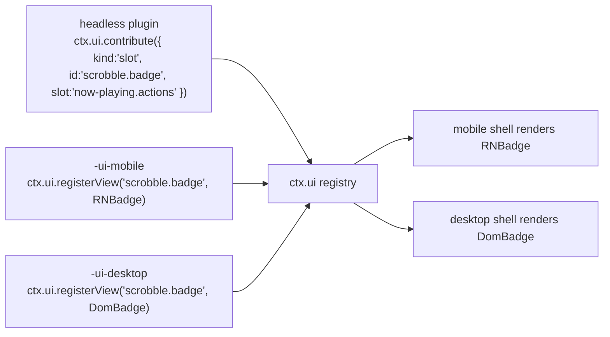

# UI Architecture & Descriptor Contribution Model

> **Legacy Reference:** Formerly `docs/08-ui-architecture.md §1 – §5, §7 – §9`.

> **What this answers.** **Layer 5** of [02 §1](../architecture/layers.md#1-the-layer-model): how a
> single plugin contributes user interface to two shells that share no component code, how views
> find their data without owning it, and where the boundary between "logic" and "view" is drawn.

Per [ADR-2](../architecture/overview.md#adr-2--the-ui-is-split-react-native-on-mobile-react-dom-on-desktop),
there are two view layers: React Native on mobile and React DOM on desktop. The cost of that
choice is paid entirely here, and this document is about containing it.

---

## 1. The three-package convention

A feature with UI splits into up to three packages. The split is not bureaucracy — it is what
keeps ADR-2 from doubling the *whole* feature instead of just its pixels.

```
@BBeBee/plugin-scrobble               ← headless: service, state, events, persistence
@BBeBee/plugin-scrobble-ui-mobile     ← React Native views
@BBeBee/plugin-scrobble-ui-desktop    ← React DOM views
```

| Package | Layer | Contains | May import |
|---|---|---|---|
| headless | 4 | The Cordis plugin, all logic, all state, all DB access, all networking | `@BBeBee/protocol` only |
| `-ui-mobile` | 5 | Components and the descriptors that name them | `react`, `react-native`, `@BBeBee/ui-kit-mobile`, and the headless package's **public subpaths** — its types plus the shared hooks and view ids (`/hooks`, `/views`) |
| `-ui-desktop` | 5 | Components and the descriptors that name them | `react`, `react-dom`, `@BBeBee/ui-kit-desktop`, and the headless package's **public subpaths** — its types plus the shared hooks and view ids (`/hooks`, `/views`) |

The split is the Layer 4/Layer 5 boundary made concrete. Layer 5 is where business *orchestration*
lives — this button, then that confirmation, then this navigation — while the business *rule* it
orchestrates stays at Layer 4, where it can be tested without a renderer and reused by the other
target's views unchanged.

The rule that makes it work:

> **A UI package contains no logic that would need to be written twice.**

If you are about to write the same `if` in both UI packages, it belongs in the headless one —
usually as a derived value on the service or a selector it exposes. In practice the UI packages
end up thin: layout, gestures, and event wiring.

The headless package works alone. A plugin with no UI package still functions; it simply
contributes nothing visible, which is exactly what happens on a target where its view was not
written.

---

## 2. Contributions are descriptors

Plugins never hand components to the shell directly. They register **descriptors** — serialisable
declarations naming a view — and the shell resolves the name against its own registry.

```ts
export type Contribution =
  | RouteContribution
  | SlotContribution
  | CommandContribution
  | SettingsContribution
  | MenuContribution

export interface RouteContribution {
  kind: 'route'
  id: string                       // 'scrobble.history'
  path: string                     // '/scrobble/history'
  title: string                    // i18n key
  icon?: string                    // name from the shared icon set
  /** Where the shell should offer navigation to it. */
  placement?: ('sidebar' | 'tab-bar' | 'more-menu')[]
  order?: number
}

export interface SlotContribution {
  kind: 'slot'
  id: string
  slot: SlotId                     // a well-known extension point
  order?: number
  /** Evaluated against slot context to decide visibility. Pure, cheap, synchronous. */
  when?: (ctx: SlotContext) => boolean
}

export interface CommandContribution {
  kind: 'command'
  id: string                       // 'player.togglePlay'
  title: string
  icon?: string
  defaultKeybinding?: string       // desktop only; ignored on mobile
  run(args?: unknown): void | Promise<void>
}

export interface SettingsContribution {
  kind: 'settings'
  id: string
  section: 'general' | 'playback' | 'audio' | 'sources' | 'storage' | 'advanced'
  title: string
  /** Rendered automatically from the schema unless a custom view is registered. */
  schema?: StandardSchemaV1
}

export interface MenuContribution {
  kind: 'menu'
  id: string
  /** Desktop application menu bar. Mobile maps these into the more-menu. */
  menu: 'file' | 'edit' | 'view' | 'playback' | 'help'
  title: string
  /** The command run when selected — menus never carry their own logic. */
  command: string
  order?: number
  /** Rendered as a checkbox item, driven by this predicate. */
  checked?: () => boolean
}

export interface UiService {
  contribute(c: Contribution): Disposable
  /** Called by each shell's view package to bind an id to a component. */
  registerView(id: string, component: unknown): Disposable

  readonly routes: readonly RouteContribution[]
  slotsFor(slot: SlotId): readonly SlotContribution[]
  readonly commands: readonly CommandContribution[]
  runCommand(id: string, args?: unknown): Promise<void>
  viewFor(id: string): unknown | undefined
}
```

`registerView` takes `unknown` deliberately: `@BBeBee/protocol` must not depend on `react`,
`react-native`, or `react-dom`, since it is imported by headless plugins that run in contexts with
no React at all. The shells cast at the boundary — one `as ComponentType` in one place per shell,
rather than a React dependency reaching into the contract layer.

> ⚠️ **Register a component bound to *your* context, never the shell's.** A shell renders a view
> as `h(Component, { ctx })` with the context it was mounted on — `app.ready(['ui'])`, which has
> `ui` injected and nothing else — and a cordis context throws for any property outside its inject
> list. A screen that reads `ctx.player` or `ctx.inspector` off the forwarded prop therefore throws
> *during render*, on a device, while every test that built a plain root context passed. Every view
> package here closes over the context its own plugin was applied with (a local `bound(ctx, Screen)`
> helper) and forwards the shell's other props; the one that did not shipped a page that rendered
> as a black window.
>
> The shells catch it either way — a view that throws is caught per route and rendered as a named
> failure, not as an unmounted app — but the boundary is a net, not the contract.

### Slots

Well-known extension points, enumerated in `@BBeBee/protocol` so both shells implement the same set:

```ts
export type SlotId =
  | 'now-playing.actions'        // buttons beside the transport
  | 'now-playing.panel'          // tabs in the expanded player (lyrics, queue, related)
  | 'track.context-menu'         // right-click / long-press on a track
  | 'album.context-menu'
  | 'library.sidebar'            // extra library sections
  | 'search.results-section'     // an extra results group
  | 'settings.sources'            // the source list: import, groups, enable, reorder
  | 'source.browse'               // a source's explore tree
  | 'source.test'                // one source, exercised feature by feature (06 §10)
  | 'status-bar'                 // desktop only; ignored on mobile
```

Slot rendering is where a plugin's UI actually shows up:

```tsx
// @BBeBee/ui-kit-desktop
export function Slot({ id, context }: { id: SlotId; context: SlotContext }) {
  const items = useSlot(id, context)
  return <>{items.map((it) => {
    const View = ui.viewFor(it.id) as ComponentType<{ context: SlotContext }> | undefined
    return View ? <View key={it.id} context={context} /> : null
  })}</>
}
```

---

## 3. Resolving a descriptor to a view

The descriptor names a view id. The shell looks it up in a registry populated by whichever UI
package was loaded for *this* target.



**Missing views are normal, not an error.** A plugin may ship a desktop view and no mobile one
(a multi-column log inspector), or the reverse (a gesture-driven mini player). The contribution
still registers; the slot simply renders nothing for it. This is a direct, ongoing cost of ADR-2,
and making it a first-class state rather than a crash is what keeps it survivable.

Three consequences worth enforcing:

- A descriptor must carry enough information to be *listed* without its view — a title and icon.
  A settings page with no view for this target can still appear, disabled, with "not available on
  this platform", rather than leaving a hole the user cannot explain.
- `when` predicates run in the shell and must be synchronous and cheap; they run during render.
- A command with no view is fully functional — it appears in the command palette on desktop and
  in the more-menu on mobile. Commands are the cheapest way to make a feature reachable on both
  targets.

---

## 4. Binding services to React

The rule from [02 §6](../architecture/layers.md#6-state-ownership): **React holds no domain state.**
Services own it; components subscribe.

Both `ui-kit-mobile` and `ui-kit-desktop` build on one shared, framework-agnostic hook layer in
`@BBeBee/ui-core`, which depends only on `react` and `@BBeBee/protocol`:

```ts
// @BBeBee/ui-core
export function useService<K extends ServiceKey>(key: K): Context[K] | undefined

/**
 * Subscribe to service state via useSyncExternalStore, so React 18 concurrent
 * rendering cannot tear. `select` must be referentially stable across calls
 * for unchanged inputs — return primitives or memoised objects.
 */
export function useServiceState<K extends ServiceKey, T>(
  key: K,
  events: (keyof Events)[],
  select: (svc: Context[K]) => T,
): T
```

Feature-specific hooks are thin wrappers, and they live in the **headless** package so both shells
share them:

```ts
// @BBeBee/plugin-player/hooks — shared by both UI packages
export const useTransport = () =>
  useServiceState('player', ['player/state-changed'], (p) => p.state)

export const useQueue = () =>
  useServiceState('player', ['queue/changed'], (p) => p.queue)

/** Position updates at 1 Hz; the UI interpolates with rAF between ticks. */
export const usePosition = () =>
  useServiceState('player', ['player/position'], (p) => p.state.positionMs)
```

This is where the three-package split earns its keep. The hooks — the part with actual logic about
which events invalidate which state — are written once. Only the JSX is written twice.

### Rendering rules

- **No `useEffect` for domain work.** An effect that fetches, writes, or mutates domain state
  belongs in a service method the component calls.
- **Optimistic updates live in the service**, not the component, so both shells behave identically
  when a write fails and rolls back.
- **Lists virtualise.** `FlashList` on mobile, `@tanstack/react-virtual` on desktop. A library can
  hold 100k tracks; neither platform survives rendering that.
- **`player/position` is interpolated, never polled.** The event fires at 1 Hz
  ([07 §5](../data-model/events.md#5-the-event-map)); a progress bar animates between ticks with
  `requestAnimationFrame` and re-syncs on each event.
- **Artwork renders `blurhash` first**, then the image
  ([07 §4.2](../data-model/schema.md#42-artwork)). No layout shift, no grey flash on scroll. A remote
  cover is requested with **no `Referer`**: several CDNs answer a hotlink 403 when the referrer is
  a foreign origin (Bilibili's `hdslb.com` does, and in dev the renderer's referrer is
  `localhost`), which shows every result as a broken image while the same URL opens fine in a tab.
- **A cover is resolved through `ctx.cache` before it renders.** The view packages render the kits'
  `Artwork` through a local `CachedArtwork` that calls `useResolvedArtwork(ctx, ref)`
  (`@BBeBee/plugin-cache/hooks`) — and `TrackRow`, which draws its own `Artwork` internally,
  through a `CachedTrackRow` — so the URL handed to ``/`Image` is a local file whenever the
  cache has one, and the `dominantColor`/identicon fallback covers the fetch in flight: the remote
  URL is never what gets rendered. The cached copy also fills in `artworks.local_uri`, which is
  what lets the lock screen receive a local `Uri` ([04 §7](../services/contracts.md)).
- **Artwork with no image falls back to a generated identicon.** When there is no cover to load —
  a local file without embedded art gets no `artworks` row at all — `Artwork` renders a
  GitHub-identicon-style square derived from the entity's URN: a FNV-1a hash of the seed drives a
  vertically mirrored 5×5 cell grid and a hue, painted as a dark tint behind a vivid pattern. The
  pattern is computed once in `ui-core` (`identicon()`), so both kits hash the same URN to the
  same square; only the elements differ (SVG on desktop, `View`s on mobile — no `react-native-svg`
  native module). Derived data never outranks real data: an image beats an identicon, and a
  `dominant_color` extracted from a real cover beats both. No identity (`seed` absent, no
  `artwork.id`) means no pattern — the plain colour square stands.

---

### Context menus & Library Interaction

Right-click on desktop, long-press on mobile, one menu. `TrackRow.onMore`, `UnifiedLibraryRow.onMore`, and header action controls hand the pointer anchor to the screen; the screen holds a controller from `@BBeBee/ui-menus` and renders the kit's `ContextMenu`. The **model** — which actions exist for a track, a playlist, a collection, and what each one calls — is written once in `@BBeBee/ui-menus`; the kits know how to draw menu rows and nothing about playlists or queues, which is what keeps the shells' menus unified down to the order of the items.

#### Visual and Component Model
- **Container styling**: High-contrast dark streaming card (`#242424`), 8px border radius, 4px padding, `0 12px 32px rgba(0,0,0,0.55)` depth shadow, and subtle 1px border (`rgba(255, 255, 255, 0.08)`).
- **Dividers**: Menu items support `divider: true` to draw a 1px translucent separator line above critical or dangerous operations.
- **Icons**: Standard operations (`pencil`, `delete`, `pin`, `create-playlist`, `create-folder`, `folder`, `play`, `download`, `playlist-add`) resolve to sharp outline SVG icons with consistent 16px geometry.
- **Submenus**: Submenu triggers render a crisp solid triangle (`▶`). Submenus dynamically exclude cyclic candidates (e.g. "Add to other playlists" excludes the source playlist, "Move to folder" excludes the current folder and descendant folders).

#### Playlist & Folder Menu Specifications
- **Playlist Context Menu**:
  - `edit-details`: Opens `EditPlaylistModal` to modify cover art (via local file chooser or remote URL), title, and description via `ctx.library.updatePlaylist`.
  - `delete-playlist`: Danger tone with top divider, deletes playlist and refreshes library view.
  - `toggle-pin`: Pin/unpin from top of library list.
  - `add-to-playlist`: "Add to other playlists", excluding current playlist.
  - `add-to-collection`: "Move to folder", supports existing folders, creating new folders, or moving to root.
- **Folder (Collection) Context Menu**:
  - `rename-collection`: Opens `RenameFolderModal` to update folder title via `ctx.library.renameCollection`.
  - `delete-collection`: Danger tone with divider, deletes collection and cascades child relationships.
  - `toggle-pin`: Pin/unpin folder in library list.
  - `create-playlist` & `create-folder`: Creates items directly within the selected folder.
  - `move-to-folder`: Move folder to another folder or root via `ctx.library.moveCollection`.
  - `add-to-playlist`: "Add to other playlists". Uses `collectAllFolderTracks` to **recursively traverse** all direct tracks, nested playlist tracks, nested album tracks, and all nested subfolder contents without duplicates.
  - `enqueue`: Plays all aggregated tracks across the folder hierarchy.

#### Library Presentation Modes
- **Collapsed mode** (72px rail): Minimalist icon list with consistent folder outline icons. When entering a folder, displays a `<` return button below the top brand logo to navigate back to the root library.
- **Sidebar mode** (260–340px): Standard view featuring inline expandable folders via rotating triangle controls (`▼` / `▲`), indented child items (28px padding), and dedicated folder detail view (`< Folder Title`).
- **Expanded mode** (full-canvas): High-density 3-column table view (`Title`, `Date Added`, `Last Played`) with top breadcrumb navigation (`音乐库 < 文件夹名`).

### Detail screens, sorting & media views

1. **Album, Playlist, Local Music & Favorites Track Tables**:
   - **Table Header Sorting**: Column headers (`#`, `标题`, `专辑`, `添加日期`, `时长`, `播放量`) support interactive sorting with ascending/descending directional indicators (`▲` / `▼`).
   - **Action Bar Sort Menu**: Dropdown `ContextMenu` ("默认顺序 ≣" / "自定义顺序 ≣") providing rapid switching between sorting keys and directions.
   - **Playback Queue Alignment**: Playing tracks from a sorted table (single-tap or "Play All") passes the sorted URN sequence to `ctx.player.playFromContext`, ensuring the playback queue matches visual order.
   - **Playlist Item ID Decoupling**: In `PlaylistDetailScreen`, rows wrap data as `{ item, track, trackUrn, originalIndex }`, preserving item IDs across sort operations so that removals and context menus act on the correct playlist item.
   - **Favorites Parity (`FavoritesScreen`)**: Styled with immersive purple gradient header, 56px play button, shuffle, real-time search filter, and `FavoriteTrackTableRow` with interactive green heart un-favorite button (`♥`).

2. **Local Music Dual Views (Tracks & Albums)**:
   - Header segmented toggle allows switching between "歌曲" (table list) and "专辑" (grid view).
   - Album grid view aggregates local tracks into `LocalAlbumCard` components with cover artwork, title, artist, track count, and hover play trigger.
   - Sort dropdown adapts dynamically to album-specific criteria (name, artist, year, track count).

3. **Playback History & Recent Plays**:
   - **Deduplication**: `HistoryScreen` (desktop and mobile) and `QueueScreen` (recent plays tab) de-duplicate tracks by `trackUrn`, retaining only the most recent playback record (with its relative timestamp and completion badge).
   - **Play Count Indicator**: `HistoryScreen` displays a `播放 N 次` capsule badge indicating total plays per track.
   - **Count Consistency**: Header counters (`(${uniqueRecords.length} 首)`) and empty state checks evaluate against deduplicated unique tracks.

### The source surfaces

Four screens carry the whole string model, and they are worth naming because they are the part of
the UI that has no equivalent in a conventional player. The descriptors come from
`plugin-sources` and the views from `plugin-sources-ui-{mobile,desktop}` — all four are ordinary
descriptors, nothing about them is privileged.

| Screen | Does | Notes on the split |
|---|---|---|
| **Source list** | Enable, disable, reorder, group, and see each source's health badge; delete asks once and takes the cached catalogue with it ([06 §4.1](../sources/runtime.md#41-a-sources-lifetime)). The local-files row shows the scanner's folders with the same use/delete controls as **Music folders** | Ordinary list; parity is free |
| **Import review** | Show what a pasted string contains — added / updated / rejected, and the host allowlist — before anything is written ([06 §9](../sources/authoring.md#9-importing-updating-and-sharing)) | The one screen that must never be skipped, so it is a modal route on both, not a slot |
| **Test a source** | Run one feature — search, browse, album, artist, playlist, lyrics, library, stream, a raw HTTP request, or arbitrary script — and show every rule's input, output and timing ([06 §10](../sources/authoring.md#10-diagnosing-a-broken-source)) | The list of test areas is the source's derived capability list, so the screen shows what that source can actually do; the trace is a long scrollable log, the closest thing in the app to a developer tool, and the reason a user can fix a source themselves |
| **Search** | One query fanned out over the selected sources with `searchAll`, one result section per source ([06 §4.1](../sources/runtime.md#41-a-sources-lifetime)) | Before the first search the bar and the interface toggles are a hero; afterwards both collapse to the top and the results take the height. On desktop, search can also be executed directly from the persistent TopBar interactive input with its 2×2 matrix dropdown. The search screen (`sources.search`) accepts incoming `query` parameters and triggers `searchAll` automatically. **One toggle per interface, not per source** — a backend with a separate artist search shows `Source · Songs` and `Source · Artists` independently, and the selection reaches `searchAll` as `typesBySource`. Selections are stored as *exclusions*, so a source imported later joins the next search instead of being silently missed — and a source that failed, timed out or matched nothing keeps its own header instead of vanishing into a merged list |
| **DSP & Equalizer** | 10-band graphic equalizer with preset switching (Flat, Bass Boost, Vocal, Treble), effect chain ordering, individual effect bypass toggles, and parameter editing (normalize, compressor, reverb, etc.). Contributed as `dsp.view`. Opened directly from the player or via an action button in the playback settings card. | Descriptors in `plugin-dsp-ui-*`. Desktop renders a dedicated view with vertical sliders; mobile provides touch-friendly vertical sliders, chip selectors, and full chain navigation |
| **Settings Center** | All-in-one single-page scrolling settings center (`settings.view`) with text anchor tabs: General & Language, Playback & Audio, Desktop Lyrics (line mode, alignment, font, size, color picker, opacity, live preview), Global Hotkeys (master toggle + 10 keybindings), Network & Proxy (HTTP/HTTPS/SOCKS5, Google latency probe, per-source routing switches), Storage & Cache (directory badges with change/open folder buttons), and About with an Advanced Settings toggle guarding the Danger Zone. | Descriptors in `plugin-settings` and rendered by `plugin-settings-ui-*`. |
| **Debug & Diagnostics** | Dedicated diagnostic hub comprising three views: `debug.view` (Debug status, environment specs for Node, Electron, OS, Chromium), `debug.logs` (Discover live ring-buffer logs with search, level filters, NDJSON copy, clear), and `debug.http-logs` (live inspection of third-party source network requests with method, status badge, latency, and URL). | Descriptors in `plugin-settings` and views in `plugin-settings-ui-desktop`. |

A download starts from the **⬇ control on a track row** (`TrackRow.onDownload`, present only where
`ctx.downloads` is loaded) in the library, an album and the search results.

The rule that keeps this affordable is [§1](#1-the-three-package-convention)'s: parsing,
validating, diffing, tracing and redacting all live in the headless package. The view packages
show a list, a text field, and a set of toggles. The library itself is `plugin-library-ui-*`
(playlists, albums and collections side by side), the album page is `plugin-album-ui-*`, and the
four above are the ones the string model added.

---

## 5. Navigation

| | Mobile | Desktop |
|---|---|---|
| Router | Expo Router (file-based) | A small in-memory router in `ui-kit-desktop` |
| Primary chrome | Bottom tab bar + stack | Persistent sidebar + content pane + TopBar |
| Contributed routes | Registered as dynamic routes; `placement` decides tab bar vs. more-menu | Sidebar entries ordered by `order` (excluding Search & Settings, which use TopBar) |
| Back | OS gesture / hardware button | In-app history, plus `Cmd/Ctrl+[` |
| Deep links | `BBeBee://` scheme via `expo-linking` | Same scheme registered with the OS by `main` |

Both shells implement the same `navigate(routeId, params)` used by commands, so a command works on
either target without knowing which router is underneath.

---

## 7. Shell responsibilities

The shells are thin. Everything below is genuinely platform-specific and belongs nowhere else.

| | `apps/mobile` | `apps/desktop/renderer` |
|---|---|---|
| Boot | Create context, register `core-*-expo`, mount inside `ctx.inject(['ui'], …)` | Same with `core-*-node` |
| Chrome | Tab bar, stack headers, safe-area insets | Sidebar, TopBar (central search + 2×2 matrix, profile avatar), window controls, resizable panes |
| Player surface | Mini player above the tab bar; expands to full screen | Persistent bottom bar; optional detached mini-player window |
| Platform-only | Gestures, haptics, pull-to-refresh | Right-click menus, drag-and-drop, keyboard shortcuts, tray, command palette |
| Absent | No keyboard shortcuts, no tray | No gestures, no haptics |

The desktop **command palette** (`Cmd/Ctrl+K`) is worth calling out: it renders
`ctx.ui.commands` directly, so every plugin command is reachable with zero UI work from the plugin
author. It is the highest-leverage piece of shell code in the project.

### 7.1 Desktop Shell Navigation & TopBar Interaction

The desktop shell organizes primary navigation between the left sidebar and the top bar:

1. **Left Sidebar Filtering**:
   - The left navigation rail is dedicated to browsing user content and collections (`library.view`, `history.view`, user playlists).
   - Global utility entries — specifically `settings.view` (Settings Center) and `sources.search` (Search) — are intentionally excluded from sidebar route rendering to avoid visual clutter and maintain Spotify-style navigation parity.

2. **TopBar Interactive Search & 2×2 Matrix Dropdown**:
   - **Dynamic Search Icon Shift**:
     - *Idle state*: The search icon (`🔍`) rests at the left padding (`left: 12px`).
     - *Active / Focused state*: The icon smoothly slides across to the far right (`right: 12px`, with transition `all 200ms cubic-bezier(0.4, 0, 0.2, 1)`) and functions as an interactive submit button (`cursor: pointer`).
     - *Dismissal*: Clicking outside the search area or pressing `Escape` unfocuses the input, dismisses the dropdown, and resets the icon back to the left edge.
   - **2×2 Matrix Floating Dropdown Panel**:
     - Automatically reveals directly beneath the input (`top: calc(100% + 8px)`, width 600px, z-index 1000) when the input is focused or query text is entered.
     - Structured as a 2-row × 2-column grid:
       - **Row 1**: Left header: "搜索范围" (`Search Scope`); Right header: "搜索历史" (`Search History`) accompanied by a subtle, high-transparency "清空" (`Clear`) button (`rgba(255, 255, 255, 0.4)`).
       - **Row 2**:
          - *Left cell (Search Scope)*: Third-party music source toggle buttons connected to `useSearchSourceSelection(ctx)`. Renders individual source interface chips (styled with active green `#1DB954` fill and black text) alongside "全部" (All) and "重置" (None) batch toggles. Source selections are maintained in a shared store backed by `useSyncExternalStore` and persisted as exclusions in `localStorage` (`bbebee_search_sources_excluded`) so that TopBar and `SearchScreen` stay strictly synchronized bi-directionally, and newly installed sources participate automatically.
          - *Right cell (Search History)*: Interactive history tags stored in `localStorage` (`bbebee_search_history`, max 10 entries). Clicking any tag immediately executes that query. When history is empty, a subtle "暂无搜索历史" fallback is displayed.
    - **Search Submission & Screen Routing**:
      - Pressing `Enter`, clicking the shifted right search icon, or clicking a history tag commits the query into history, closes the matrix panel, and calls `navigate('sources.search', { query, sourceIds, typesBySource, searchTimestamp })`.
      - `SearchScreen` (`plugin-sources-ui-desktop`) watches incoming `query`, `sourceIds`, `typesBySource`, and `searchTimestamp` props via `useEffect` and automatically executes `search.searchAll(query, { sourceIds, typesBySource })`, ensuring search scope restrictions chosen in TopBar take immediate effect on the search screen.

3. **TopBar User Profile & Settings Access**:
   - The user profile avatar icon is anchored in the right cluster of the TopBar.
   - Clicking the avatar navigates directly to `settings.view` (Settings Center).

4. **Safe Service Access in UI Hooks**:
   - Cordis Context instances are strictly scoped (`ctx.inject`). Accessing an un-injected property throws an error at runtime (`cannot get property "<name>" without inject`).
   - Hooks in UI view layers inspecting optional services (e.g., `useSources`, `useLiveSourceIds`, and `useSearchSourceOptions`) must always access service instances safely using `serviceOf<T>(ctx, key)` instead of raw member access `(ctx as any)[key]`.

### Secondary windows and single-kernel preservation

When desktop features require OS-level window detachment — such as **Desktop Lyrics** which must float on top of other desktop applications, remain visible when the main window is minimized, support arbitrary multi-monitor dragging, and provide click-through mouse event forwarding when locked:

1. **Single Cordis Kernel Invariant (ADR-3)**: The secondary `BrowserWindow` must **never** call `boot()` or initialize a secondary Cordis Context. Starting a second kernel would split plugin states, duplicate playback hooks, and violate singletons.
2. **Passive View Architecture**: The secondary window runs as a passive React view loaded via query/hash routing (`?window=desktop-lyrics` or `#desktop-lyrics`). It mounts a standalone, lightweight view component directly without activating Cordis plugins.
3. **IPC Forwarding Hub**: The main renderer's UI adapter (`plugin-desktop-lyrics-ui-desktop`) syncs state down to the secondary window through `window.BBeBee.desktopLyrics.updateData(...)`, and receives user actions back from the secondary window through `sendAction(...)` dispatched to `ctx.player` and `ctx.desktopLyrics`.
4. **OS Integration**:
   - Frameless transparent window (`frame: false`, `transparent: true`, `backgroundColor: '#00000000'`, `alwaysOnTop: true`, `skipTaskbar: true`).
   - Free dragging via CSS `-webkit-app-region: drag` and interactive buttons via `-webkit-app-region: no-drag`.
   - Mouse click-through: `setIgnoreMouseEvents(locked, { forward: true })` toggled dynamically upon lock state.

---

## 8. Accessibility

Not a phase-two concern, because retrofitting it is far more expensive than doing it.

- Every interactive element has an accessible name — `accessibilityLabel` on mobile,
  `aria-label` on desktop — supplied through the shared component props so it is written once.
- Desktop is fully keyboard navigable: visible focus rings, logical tab order, `Escape` closes
  every overlay, arrow keys move within lists.
- Mobile respects the OS text-size setting; the token scale is relative, and layouts are tested at
  200%.
- Contrast meets WCAG AA against both palettes — checked in the parity test, not by eye.
- `prefers-reduced-motion` (desktop) and Reduce Motion (mobile) disable the crossfade animations
  and the artwork parallax.
- The visualiser and any flashing element honour reduced-motion and are never the sole indicator
  of state.

---

## 9. Where to go next

[09 — Project Structure](../workflow/structure.md) turns all of this into a directory tree, a
build pipeline, and a set of enforced rules.
